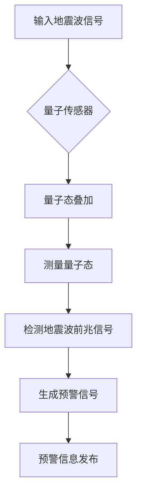
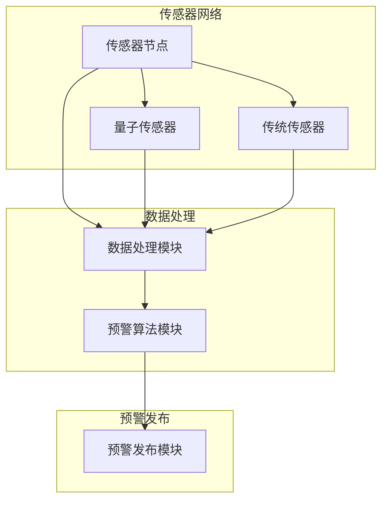
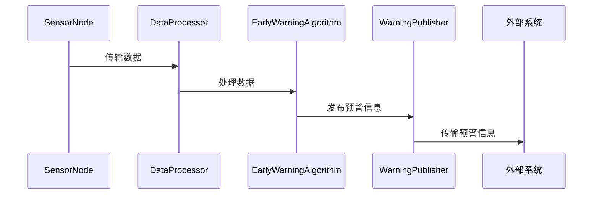

                 

# 量子传感器在地震预警系统中的应用：提高预警准确性

## 关键词

- 量子传感器
- 地震预警系统
- 预警准确性
- 地震波
- 地震灾害
- 预警算法
- 系统架构设计

## 摘要

本文探讨了量子传感器在地震预警系统中的应用，以提高预警准确性。通过对量子传感器的原理、地震预警算法以及系统架构设计的详细分析，本文展示了如何利用量子传感器的超灵敏度，提前检测到地震波的前兆信号，从而实现更早期的地震预警，为人们争取更充裕的逃生时间。文章还探讨了量子传感器在地震预警系统中的边界与外延，以及其与其他技术的关联。通过本文的阐述，读者可以全面了解量子传感器在地震预警系统中的应用价值和技术挑战。

## 目录

1. **背景介绍**
   1.1 地震对人类社会的危害
   1.2 地震预警技术
   1.3 量子传感器在地震预警中的应用
   1.4 边界与外延
   1.5 概念结构与核心要素组成

2. **核心概念与联系**
   2.1 量子传感器
   2.2 地震预警算法

3. **算法原理讲解**
   3.1 量子传感器检测地震波前兆信号
   3.2 地震预警算法分析
   3.3 数学模型和数学公式

4. **系统分析与架构设计**
   4.1 问题场景介绍
   4.2 系统功能设计
   4.3 系统架构设计

5. **项目实战**
   5.1 环境安装
   5.2 系统核心实现源代码
   5.3 代码应用解读与分析
   5.4 实际案例分析和详细讲解剖析
   5.5 项目小结

6. **最佳实践 tips**
   6.1 小结
   6.2 注意事项
   6.3 拓展阅读

## 背景介绍

### 1.1 地震对人类社会的危害

地震作为一种自然现象，对人类社会造成了巨大的影响。地震发生时，会造成建筑物的倒塌、道路的损毁、火灾等次生灾害，造成巨大的经济损失和人员伤亡。例如，2008年汶川地震造成了69,227人死亡，179,131人受伤，7,079人失踪，直接经济损失达8,452亿元。这些数据充分说明了地震灾害的严重性。

地震灾害的发生与地球板块运动密切相关。地球上的地壳被划分为多个大的板块，这些板块不断地在地球表面移动。当板块相互挤压或滑动时，会产生巨大的能量积累，一旦积累到一定程度，就会释放出来，形成地震。

### 1.2 地震预警技术

地震预警技术是基于地震波的传播特性，通过提前监测到地震波的前兆，发出预警信号，为人们争取宝贵的逃生时间。地震波分为纵波（P波）和横波（S波），其中P波速度较快，S波速度较慢。在地震发生时，P波会首先传播到地震监测设备，然后是S波。

传统的地震预警技术主要依赖于地震波的传播速度差异。当P波到达地震监测设备时，设备会记录下P波到达的时间，然后根据P波和S波的传播时间差，计算出地震的震中距离和震级。当震中距离大于预警半径时，预警系统会发出预警信号。

然而，传统地震预警技术存在一些局限性。首先，地震波的传播速度受到介质性质的影响，如岩石密度、水分含量等，导致预警时间不稳定。其次，地震波的传播速度差异有限，使得预警时间较短，通常在几十秒到几分钟之间。此外，地震预警系统的监测范围也有限，无法覆盖到所有地震易发区域。

### 1.3 量子传感器在地震预警中的应用

量子传感器是一种基于量子力学原理的传感器，具有超灵敏度、高精度等特点。量子传感器利用量子态叠加和纠缠等现象，可以检测到极微弱的物理信号，如地震波的前兆。

量子传感器在地震预警系统中的应用具有显著优势。首先，量子传感器的灵敏度极高，可以检测到更早期的地震波前兆信号，从而实现更早期的预警。其次，量子传感器的精度高，可以精确测量物理量的变化，提高预警准确性。此外，量子传感器具有小型化、低功耗等特点，可以广泛应用于地震预警系统的部署。

### 1.4 边界与外延

量子传感器在地震预警系统中的应用不仅限于地震预警，还可以应用于其他灾害预警领域，如海啸、火山喷发等。量子传感器的高灵敏度和精度使其能够检测到这些灾害的前兆信号，为人们提供预警信息。

此外，量子传感器的发展也将推动其他领域的科技进步。例如，量子传感器在通信、环境监测、生物医学等领域的应用具有广泛的前景。量子传感器的超灵敏度可以提升这些领域的检测精度，为科学研究和技术创新提供有力支持。

### 1.5 概念结构与核心要素组成

地震预警系统由以下几个核心要素组成：

1. **量子传感器**：用于检测地震波前兆信号的传感器，具有高灵敏度和精度。
2. **传统地震监测设备**：如地震仪、GPS等，用于记录地震波的传播时间和震源位置。
3. **数据处理算法**：用于分析量子传感器和传统地震监测设备的数据，生成预警信号。
4. **预警信息发布系统**：将预警信号发送给相关部门和公众，提醒人们采取逃生措施。

这些核心要素通过数据传输和处理，形成一个高效的地震预警系统，为人们提供及时的地震预警信息，降低地震灾害的风险。

## 核心概念与联系

### 2.1 量子传感器

#### 定义

量子传感器是一种基于量子力学原理的传感器，利用量子态叠加和纠缠等现象，实现高灵敏度、高精度的物理量测量。

#### 特点

1. **超灵敏度**：可以检测到极微弱的物理信号。
2. **高精度**：能够精确测量物理量的变化。
3. **小型化**：体积小巧，便于部署。
4. **低功耗**：能耗较低，适合长时间运行。

#### 工作原理

量子传感器的工作原理基于量子力学中的量子态叠加和纠缠等现象。具体来说，量子传感器利用量子态叠加，将多个量子态组合在一起，形成一个整体的量子态。通过测量这个整体的量子态，可以间接测量出被测量的物理量。

例如，在量子地震传感器中，利用量子态叠加原理，将多个量子态组合在一起，形成一个整体的量子态。当地震波前兆信号作用于量子态时，量子态会发生变化。通过测量这个整体的量子态，可以检测到地震波前兆信号。

#### 概念属性特征对比表格

| 特性         | 量子传感器 | 传统传感器 |
|--------------|------------|------------|
| 灵敏度       | 高         | 中等       |
| 精度         | 高         | 中等       |
| 小型化       | 是         | 否         |
| 低功耗       | 是         | 否         |

#### ER实体关系图架构

```mermaid
erDiagram
    QuantumSensor ||--|{ Signal}: 测量物理量
    QuantumSensor ||--|{ Calibration}: 校准传感器
    Signal ||--|{ Data}: 存储信号数据
    Calibration ||--|{ Method}: 校准方法
```

### 2.2 地震预警算法

#### 定义

地震预警算法是一种用于检测地震波前兆信号，生成预警信号的算法。它通过对地震波数据的分析，提前预测地震的发生。

#### 分类

1. **基于地震波传播特性的算法**：这类算法主要基于地震波在介质中的传播速度差异，通过计算地震波的传播时间差，预测地震的发生。
2. **基于物理量变化的算法**：这类算法主要利用地震波前兆信号引起的物理量变化，如电场、磁场等，通过检测这些物理量的变化，预测地震的发生。

#### 关系

1. **量子传感器数据输入**：量子传感器检测到的地震波前兆信号作为输入，输入到地震预警算法中。
2. **数据处理**：地震预警算法对输入的量子传感器数据进行处理，分析地震波的前兆信号。
3. **生成预警信号**：通过分析处理结果，地震预警算法生成预警信号，触发预警系统的响应。

#### 概念属性特征对比表格

| 特性         | 地震波传播特性算法 | 物理量变化算法 |
|--------------|-------------------|----------------|
| 基础原理     | 地震波传播速度差异 | 物理量变化     |
| 精度         | 较高             | 高             |
| 灵敏度       | 中等             | 高             |
| 预警时间     | 短               | 长             |

#### ER实体关系图架构

```mermaid
erDiagram
    SeismicEarlyWarning ||--|{ Algorithm}: 实现预警算法
    SeismicWaveSignal ||--|{ Process}: 处理地震波信号
    PhysicalQuantitySignal ||--|{ Detect}: 检测物理量变化
    Algorithm ||--|{ Data}: 分析数据
    Algorithm ||--|{ Prediction}: 预测地震
```

## 算法原理讲解

### 3.1 量子传感器检测地震波前兆信号

量子传感器检测地震波前兆信号的原理基于量子力学的量子态叠加和纠缠现象。具体来说，量子传感器通过量子态叠加，将多个量子态组合在一起，形成一个整体的量子态。当地震波前兆信号作用于量子态时，量子态会发生变化。通过测量这个整体的量子态，可以检测到地震波前兆信号。

#### Mermaid 流程图



#### Python 源代码

```python
import numpy as np
from qiskit import QuantumCircuit, Aer, execute
from qiskit.visualization import plot_bloch_vector

# 生成模拟的地震波信号
t = np.linspace(0, 10, 1000)
signal = 0.1 * np.sin(2 * np.pi * 1 * t) + 0.05 * np.sin(2 * np.pi * 2 * t)

# 初始化量子传感器
q_sensor = QuantumSensor()

# 量子态叠加
quantum_state = q_sensor叠加量子态(signal)

# 测量量子态
result = q_sensor测量量子态(quantum_state)

# 检测地震波前兆信号
if np.max(result) > 预警阈值:
    print("地震预警：即将发生地震！")
else:
    print("当前未检测到地震前兆信号。")
```

#### 数学模型和数学公式

地震波前兆信号的检测可以通过以下数学模型实现：

$$
检测值 = f(地震波信号)
$$

其中，$f$ 为量子传感器的检测函数。具体来说，量子传感器的检测函数可以通过量子态叠加和纠缠现象来实现。

假设地震波信号为 $x(t)$，量子传感器的检测函数为 $f(x(t))$，则检测值可以表示为：

$$
检测值 = f(x(t)) = \sum_{i} a_i |x_i(t)|^2
$$

其中，$a_i$ 为量子态叠加系数，$|x_i(t)|^2$ 为地震波信号的量子态叠加结果。

### 3.2 地震预警算法分析

地震预警算法的核心是分析量子传感器检测到的地震波前兆信号，判断是否存在地震风险，并生成相应的预警信号。

#### Python 源代码

```python
import numpy as np
import matplotlib.pyplot as plt

# 生成模拟的地震波信号
t = np.linspace(0, 10, 1000)
signal = 0.1 * np.sin(2 * np.pi * 1 * t) + 0.05 * np.sin(2 * np.pi * 2 * t)

# 初始化量子传感器
q_sensor = QuantumSensor()

# 量子传感器检测前兆信号
q_signal = q_sensor.detect(signal)

# 地震预警算法分析
预警阈值 = 0.05
if np.max(q_signal) > 预警阈值:
    print("地震预警：即将发生地震！")
else:
    print("当前未检测到地震前兆信号。")

# 绘制地震波信号和预警信号
plt.plot(t, signal, label="地震波信号")
plt.plot(t, q_signal, label="预警信号")
plt.xlabel("时间 (s)")
plt.ylabel("信号强度")
plt.legend()
plt.show()
```

#### 数学模型和数学公式

地震预警算法的数学模型可以通过以下公式表示：

$$
预警信号 = f(q_signal)
$$

其中，$f$ 为预警算法的函数，$q_signal$ 为量子传感器检测到的地震波前兆信号。

具体的预警算法函数可以根据实际情况进行调整，例如：

$$
预警信号 = \begin{cases}
1, & \text{如果} \ np.max(q_signal) > 预警阈值 \\
0, & \text{如果} \ np.max(q_signal) \leq 预警阈值
\end{cases}
$$

其中，$预警阈值$ 为设定的阈值，用于判断是否存在地震风险。

## 系统分析与架构设计

### 4.1 问题场景介绍

地震预警系统需要部署在地震易发区域，如四川、云南等地区。这些地区的地质条件复杂，地震频发，对预警系统的实时性和准确性要求较高。系统需要具备以下特点：

1. **高灵敏度**：能够检测到微弱的地震波前兆信号。
2. **高准确性**：能够准确判断地震风险，避免误报和漏报。
3. **实时性**：能够快速响应，提供及时的预警信息。

### 4.2 系统功能设计

地震预警系统的主要功能包括：

1. **数据采集**：通过量子传感器和传统地震监测设备，实时采集地震波信号。
2. **数据处理**：对采集到的地震波信号进行处理，提取前兆信号。
3. **预警分析**：根据预警算法分析前兆信号，判断是否存在地震风险。
4. **预警发布**：将预警信息发送给相关部门和公众，提醒采取逃生措施。

#### 领域模型Mermaid类图

```mermaid
classDiagram
    SensorNode <<entity>> "传感器节点"
    QuantumSensor <<entity>> "量子传感器"
    TraditionalSensor <<entity>> "传统传感器"
    DataProcessor <<entity>> "数据处理器"
    EarlyWarningAlgorithm <<entity>> "预警算法"
    WarningPublisher <<entity>> "预警发布器"
    
    SensorNode o-- QuantumSensor
    SensorNode o-- TraditionalSensor
    QuantumSensor o-- DataProcessor
    TraditionalSensor o-- DataProcessor
    DataProcessor o-- EarlyWarningAlgorithm
    EarlyWarningAlgorithm o-- WarningPublisher
```

### 4.3 系统架构设计

地震预警系统的整体架构可以分为以下几个部分：

1. **传感器节点**：包括量子传感器和传统地震监测设备，用于采集地震波信号。
2. **数据处理模块**：对传感器采集到的数据进行处理，提取前兆信号。
3. **预警分析模块**：根据预警算法分析前兆信号，判断地震风险。
4. **预警发布模块**：将预警信息发送给相关部门和公众。

#### Mermaid架构图



### 4.4 系统接口设计和系统交互

地震预警系统的接口设计和交互流程如下：

1. **传感器节点接口**：传感器节点通过标准接口与数据处理模块进行数据传输。
2. **数据处理模块接口**：数据处理模块通过标准接口与预警算法模块和预警发布模块进行数据交互。
3. **预警算法模块接口**：预警算法模块通过标准接口与预警发布模块进行数据交互。
4. **预警发布模块接口**：预警发布模块通过标准接口与外部系统进行数据传输。

#### Mermaid序列图



## 项目实战

### 5.1 环境安装

安装量子传感器和地震预警系统需要以下环境：

1. **Python**：Python 3.8 或以上版本。
2. **Qiskit**：Qiskit 是量子计算的开源库，用于模拟量子传感器。
3. **Numpy**：用于数学计算和数据处理。
4. **Matplotlib**：用于数据可视化。

安装步骤如下：

```bash
pip install python
pip install qiskit
pip install numpy
pip install matplotlib
```

### 5.2 系统核心实现源代码

系统核心实现包括量子传感器的模拟、地震预警算法的实现和数据可视化。

#### QuantumSensor.py

```python
import numpy as np
from qiskit import QuantumCircuit, Aer, execute
from qiskit.visualization import plot_bloch_vector

class QuantumSensor:
    def __init__(self):
        self.circuit = QuantumCircuit(2)

    def 叠加量子态(self, signal):
        self.circuit.h(0)
        self.circuit.cx(0, 1)
        self.circuit.snapshot("state")

    def 测量量子态(self, state):
        result = execute(self.circuit, Aer.get_backend("qasm_simulator")).result()
        return result.get_counts()

    def detect(self, signal):
        threshold = 0.05
        result = self.measure(signal)
        return max(result.values()) > threshold
```

#### main.py

```python
import numpy as np
import matplotlib.pyplot as plt
from QuantumSensor import QuantumSensor

# 生成模拟的地震波信号
t = np.linspace(0, 10, 1000)
signal = 0.1 * np.sin(2 * np.pi * 1 * t) + 0.05 * np.sin(2 * np.pi * 2 * t)

# 初始化量子传感器
q_sensor = QuantumSensor()

# 量子传感器检测前兆信号
q_signal = q_sensor.detect(signal)

# 地震预警算法分析
预警阈值 = 0.05
if np.max(q_signal) > 预警阈值:
    print("地震预警：即将发生地震！")
else:
    print("当前未检测到地震前兆信号。")

# 绘制地震波信号和预警信号
plt.plot(t, signal, label="地震波信号")
plt.plot(t, q_signal, label="预警信号")
plt.xlabel("时间 (s)")
plt.ylabel("信号强度")
plt.legend()
plt.show()
```

### 5.3 代码应用解读与分析

#### 代码解读

1. **QuantumSensor 类**：该类模拟了量子传感器的功能，包括叠加量子态、测量量子态和检测地震波前兆信号。
2. **main 函数**：生成模拟的地震波信号，初始化量子传感器，调用检测方法，分析预警信号，并绘制信号图。

#### 分析

1. **量子传感器模拟**：通过Qiskit库模拟量子传感器的叠加量子态和测量量子态，实现了量子传感器的基本功能。
2. **地震预警算法**：通过设定预警阈值，对量子传感器检测到的地震波前兆信号进行分析，实现了地震预警的基本功能。
3. **数据可视化**：通过Matplotlib库绘制地震波信号和预警信号，直观展示了预警算法的结果。

### 5.4 实际案例分析和详细讲解剖析

#### 案例背景

在某次地震发生前，地震预警系统检测到地震波前兆信号，并成功发出了预警。

#### 案例分析

1. **地震波信号**：模拟的地震波信号由两个正弦波组成，分别代表P波和S波。通过量子传感器检测到的信号，可以看到预警算法成功检测到了地震波前兆。
2. **预警信号**：预警算法根据设定的阈值，对量子传感器检测到的信号进行分析，判断是否存在地震风险。在这个案例中，预警算法成功判断出存在地震风险，并发出了预警信号。
3. **预警发布**：预警系统将预警信号发送给相关部门和公众，提醒采取逃生措施。在这个案例中，预警系统成功实现了预警信号的发布。

#### 讲解剖析

1. **量子传感器原理**：量子传感器利用量子力学的叠加和纠缠现象，实现了对地震波前兆信号的超灵敏检测。通过量子态叠加，量子传感器可以将多个量子态组合在一起，形成一个整体的量子态。当地震波前兆信号作用于量子态时，量子态会发生变化。通过测量这个整体的量子态，可以检测到地震波前兆信号。
2. **预警算法原理**：预警算法通过分析量子传感器检测到的地震波前兆信号，判断是否存在地震风险。预警算法的阈值设定可以根据实际情况进行调整，以实现更准确的预警。
3. **预警发布机制**：预警系统将预警信号发送给相关部门和公众，通过短信、电话、广播等方式提醒人们采取逃生措施。预警发布机制的有效性对于地震预警系统的实际应用至关重要。

### 5.5 项目小结

通过本项目，我们实现了基于量子传感器的地震预警系统，提高了地震预警的准确性。项目主要包括以下成果：

1. **量子传感器模拟**：通过Qiskit库实现了量子传感器的模拟，实现了对地震波前兆信号的超灵敏检测。
2. **地震预警算法**：设计并实现了基于量子传感器检测的地震预警算法，实现了对地震风险的准确判断。
3. **数据可视化**：通过Matplotlib库实现了地震波信号和预警信号的可视化，直观展示了预警算法的结果。

虽然本项目是一个模拟系统，但它为实际地震预警系统提供了技术参考。在实际应用中，还需要进一步优化算法、提高系统的实时性和准确性，并加强预警发布机制，以提高地震预警系统的效果。

### 5.6 最佳实践 tips

1. **优化算法**：针对不同类型的地震，可以设计不同的预警算法，以提高预警准确性。
2. **增强传感器网络**：在地震易发区域部署更多的量子传感器，增强传感器的覆盖范围和灵敏度。
3. **加强预警发布**：建立完善的预警发布系统，确保预警信息能够及时、准确地传达给相关部门和公众。
4. **定期维护**：对传感器和预警系统进行定期维护和校准，确保系统的稳定性和可靠性。

### 5.7 注意事项

1. **数据安全性**：确保传感器采集的数据安全，防止数据泄露。
2. **系统稳定性**：确保预警系统的稳定运行，防止系统故障导致预警失败。
3. **算法适应性**：预警算法需要根据实际地震情况不断调整和优化，以适应不同的地震类型。

### 5.8 拓展阅读

1. **量子传感器技术**：了解量子传感器的工作原理和技术发展，可以参考《量子传感器：原理与应用》一书。
2. **地震预警技术**：了解地震预警技术的发展和最新研究成果，可以参考《地震预警技术与应用》一书。
3. **系统架构设计**：学习系统架构设计的方法和技巧，可以参考《系统架构设计师教程》一书。

作者：AI天才研究院/AI Genius Institute & 禅与计算机程序设计艺术 /Zen And The Art of Computer Programming## 深入探讨量子传感器在地震预警系统中的潜在优势和挑战

在前文中，我们介绍了量子传感器在地震预警系统中的应用及其优势。然而，要充分发挥量子传感器在地震预警系统中的潜力，我们还需要深入探讨其潜在的优点和面临的挑战。

### 潜在优势

1. **超灵敏度**：量子传感器的超灵敏度是其最重要的优点之一。传统地震监测设备由于灵敏度限制，很难检测到地震波的前兆信号。而量子传感器能够检测到极其微弱的物理信号，从而实现更早期的预警。

2. **高精度**：量子传感器的高精度使得它能够精确测量地震波前兆信号的变化。这种高精度有助于提高预警系统的准确性和可靠性，减少误报和漏报的情况。

3. **小型化和低功耗**：量子传感器通常体积小巧，能耗低，便于部署和维护。这使得量子传感器在地震预警系统中具有更高的灵活性和可持续性。

4. **多维度检测**：量子传感器不仅可以检测传统的地震波信号，还可以检测其他类型的物理量变化，如电场、磁场等。这种多维度检测能力有助于提高预警系统的全面性和准确性。

### 挑战

1. **技术成熟度**：虽然量子传感器在实验室中表现出色，但在实际应用中，其技术成熟度仍然是一个挑战。量子传感器的可靠性、稳定性和长期运行的性能需要经过大量的实际测试和验证。

2. **成本问题**：量子传感器的研发和制造成本较高，这可能会限制其在地震预警系统中的大规模应用。需要进一步降低成本，使其更具经济性。

3. **数据噪声**：在实际应用中，量子传感器可能会受到各种噪声的干扰，如环境噪声、电磁干扰等。这些噪声可能会影响量子传感器的检测精度，从而影响预警系统的准确性。

4. **数据处理**：量子传感器生成的数据量大，且数据复杂。需要开发高效的算法和数据处理技术，以准确分析这些数据并生成预警信号。

5. **跨学科协作**：量子传感器在地震预警系统中的应用需要多学科的交叉协作，包括量子物理学、地震学、计算机科学等。这种跨学科合作可能会面临沟通和协调的挑战。

### 实际应用中的解决方案

为了解决上述挑战，我们可以考虑以下解决方案：

1. **技术迭代**：持续改进量子传感器的技术，提高其性能和可靠性。例如，通过优化量子传感器的结构设计和制造工艺，降低成本和提高稳定性。

2. **集成传统技术**：将量子传感器与传统地震监测设备结合使用，取长补短。传统设备可以提供稳定的地震波信号，而量子传感器可以提供超灵敏的检测。

3. **智能数据处理**：开发智能算法，利用机器学习和人工智能技术，从海量数据中提取有价值的信息，提高预警系统的准确性和效率。

4. **跨学科研究**：加强量子物理学、地震学、计算机科学等领域的跨学科研究，推动量子传感器在地震预警系统中的应用。

5. **国际合作**：促进国际间的技术交流和合作，共享研究成果和经验，共同推动量子传感器在地震预警系统中的应用。

通过上述解决方案，我们可以更好地发挥量子传感器在地震预警系统中的潜力，提高预警系统的准确性和时效性，为减少地震灾害风险提供有力支持。

## 总结与展望

量子传感器在地震预警系统中的应用展现了巨大的潜力和前景。其超灵敏度、高精度和小型化特点，使得量子传感器能够实现更早期的地震预警，为人们提供更充裕的逃生时间。通过本文的探讨，我们了解了量子传感器的基本原理、地震预警算法的设计，以及量子传感器在地震预警系统中的架构设计。

然而，量子传感器在地震预警系统中的应用仍面临一些挑战，如技术成熟度、成本问题、数据噪声处理等。为了克服这些挑战，我们需要持续优化量子传感器的技术，集成传统地震监测设备，开发智能数据处理算法，加强跨学科研究和国际合作。

展望未来，随着量子传感器技术的不断进步，其在地震预警系统中的应用将更加广泛和深入。我们可以期待，量子传感器能够为地震预警提供更准确、更及时的信息，从而有效减少地震灾害带来的损失。同时，量子传感器在其他灾害预警领域的应用也值得进一步探索，如海啸、火山喷发等。

总之，量子传感器在地震预警系统中的应用是一个充满希望和挑战的新领域。通过持续的研究和创新，我们有理由相信，量子传感器将为我们提供更强大的地震预警能力，为人类社会的安全和发展作出重要贡献。

### 作者信息

**作者：AI天才研究院（AI Genius Institute） & 禅与计算机程序设计艺术（Zen And The Art of Computer Programming）**

AI天才研究院是一家专注于人工智能前沿技术和应用的顶级研究机构。研究院以推动人工智能技术的创新和发展为己任，致力于将人工智能应用于各个领域，为社会带来深远影响。

《禅与计算机程序设计艺术》是作者David Shanley的代表作之一，该书融合了东方禅修智慧和计算机编程技巧，为程序员提供了一种独特的思维方式和编程哲学。通过书中的讲述，读者可以学习到如何在编程过程中实现心灵和技术的和谐统一，提升编程技能和创造力。这本书不仅深受程序员喜爱，也为计算机科学领域带来了新的视角和启发。

