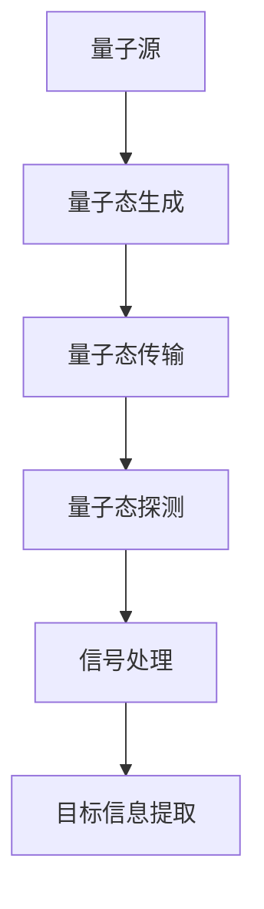
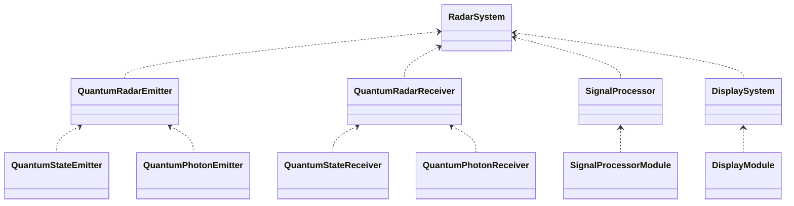
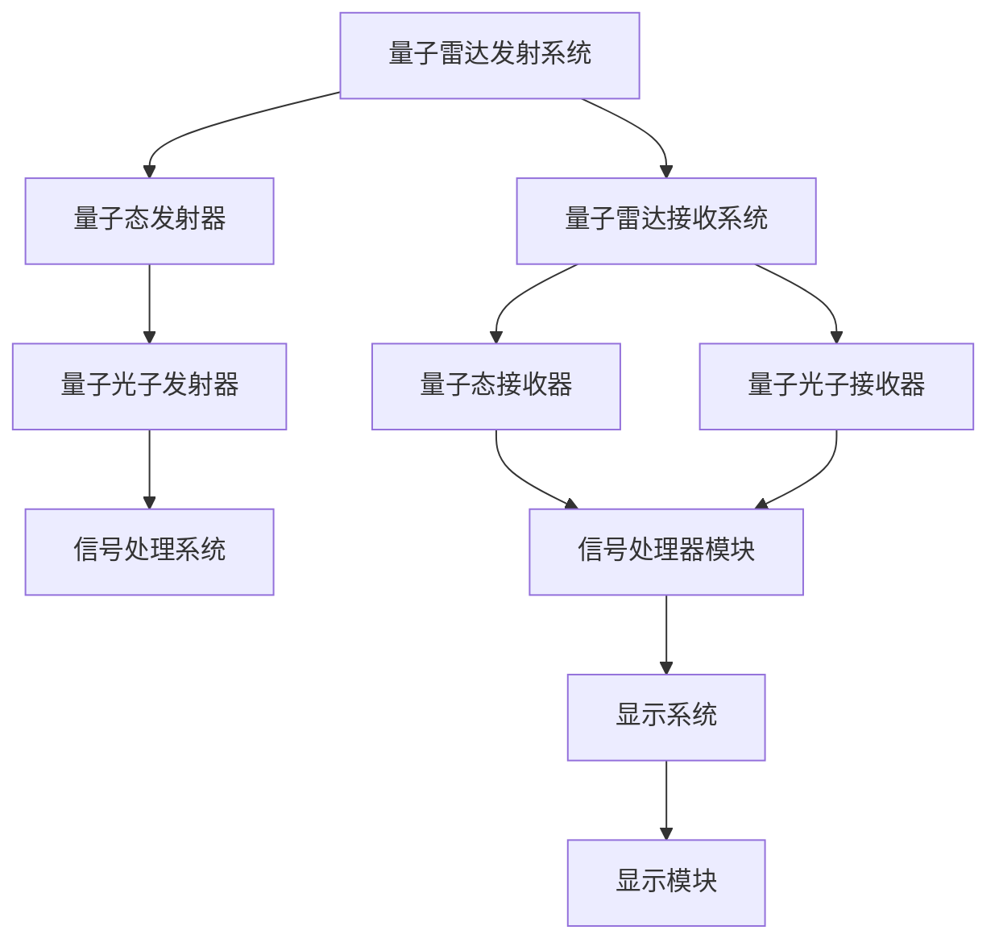
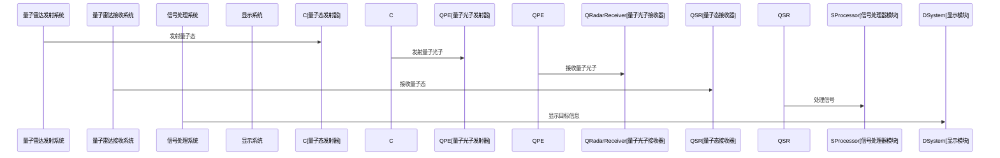

                 

### 量子雷达在隐身目标探测中的应用：突破传统雷达限制

#### 关键词：
量子雷达、隐身目标、探测、传统雷达、抗干扰、算法、数学模型、系统架构

#### 摘要：
本文将深入探讨量子雷达在隐身目标探测中的应用，分析其与传统雷达的异同，并阐述量子雷达在提升探测性能和抗干扰能力方面的独特优势。通过具体算法原理讲解和实例分析，本文旨在为读者呈现量子雷达技术的实际应用价值，以及在军事和民用领域的前景。

#### 1. 背景介绍

##### 问题背景
传统雷达探测技术在军事和民用领域中得到了广泛的应用，但面对现代隐身技术的不断发展，传统雷达的探测能力受到了严峻挑战。隐身目标通过使用特殊的材料和结构设计，能够有效减少对雷达波的反射，使得传统雷达难以探测到其存在。这种挑战促使研究人员寻求新的探测技术，以应对隐身目标的威胁。

##### 量子雷达的潜在应用前景
量子雷达作为一项前沿技术，具有与传统雷达不同的工作原理和探测机制。它利用量子态的变化来探测目标，而不依赖于电磁波的反射。这使得量子雷达在探测隐身目标方面具有独特的优势。随着量子技术的发展，量子雷达的应用前景愈发广阔，有望成为突破传统雷达限制的重要手段。

##### 问题描述
传统雷达在面对隐身目标时存在以下问题：
- 雷达回波信号弱，难以识别。
- 易受电磁干扰，探测精度降低。
- 探测距离受限，难以实现远距离探测。

量子雷达通过以下特性，有望解决传统雷达的这些问题：
- 利用量子态变化，实现高灵敏度探测。
- 具有较强的抗干扰能力。
- 理论上具有更远的探测距离。

##### 问题解决
为了提升隐身目标的探测能力，可以考虑以下解决方案：
- 将量子雷达与传统雷达结合，形成综合探测体系，发挥各自优势。
- 在军事和民用领域积极研发和推广量子雷达技术。
- 深入研究量子雷达探测算法，优化信号处理和目标识别技术。

##### 边界与外延
本文的研究范围主要限定于量子雷达在隐身目标探测中的应用，重点分析其在军事和民用领域的前景。同时，也会探讨量子雷达在实际应用中可能遇到的限制和挑战。

##### 概念结构与核心要素组成
量子雷达系统主要包括以下几个核心组成部分：
- 量子源：提供量子态的初始状态。
- 量子探测器：检测量子态的变化。
- 信号处理器：对探测信号进行处理和分析。
- 目标信息提取器：从处理后的信号中提取目标信息。

隐身目标的特性主要包括：
- 雷达隐身技术：使用特殊材料和结构减少雷达波的反射。
- 反射特性：通过控制目标的反射特性，降低雷达探测概率。
- 热辐射：隐身目标仍然会发出热辐射，可以用于探测。

#### 2. 核心概念与联系

##### 核心概念原理

量子雷达的工作原理基于量子态的叠加和纠缠特性。它通过发射量子态的光子，与目标相互作用后，测量光子的量子态变化，从而获取目标信息。量子雷达与传统雷达的主要区别在于：
- **工作原理**：传统雷达利用电磁波的反射来探测目标，而量子雷达利用量子态的变化来探测目标。
- **雷达回波**：传统雷达依赖于反射电磁波，而量子雷达不依赖反射电磁波，通过探测背景信息来实现目标探测。
- **探测距离**：量子雷达在理论上有更远的探测距离，因为不依赖反射信号。
- **抗干扰能力**：量子雷达具有较强的抗干扰能力，因为其探测机制不同于传统雷达。

##### 概念属性特征对比表格

| 特性          | 传统雷达                         | 量子雷达                       |
| ------------- | -------------------------------- | ------------------------------ |
| 工作原理      | 利用电磁波反射探测目标           | 利用量子态变化探测目标         |
| 雷达回波      | 依赖于反射电磁波                | 不依赖反射电磁波，探测背景信息 |
| 探测距离      | 受限于雷达波长和信号处理技术      | 理论上具有更远的探测距离        |
| 抗干扰能力    | 较弱，易受电磁干扰               | 较强，具有抗干扰能力           |

##### ER实体关系图架构的 Mermaid 流程图

```mermaid
erDiagram
    Radar ||--|{ Target }|
    "Target" ||--|{ StealthTech }|
    "StealthTech" ||--|{ Material }|
    "StealthTech" ||--|{ Structure }|
    "Radar" ||--|{ QuantumRadar }|
    "QuantumRadar" ||--|{ QuantumSource }|
    "QuantumRadar" ||--|{ QuantumDetector }|
    "QuantumRadar" ||--|{ SignalProcessor }|
```

#### 3. 算法原理讲解

##### 量子雷达探测算法原理

量子雷达探测算法的核心在于利用量子态的叠加和纠缠特性。以下是量子雷达探测算法的 mermaid 流程图：



##### Python 源代码

下面是一个简化的量子雷达探测算法的 Python 源代码示例：

```python
import numpy as np

def quantum_detection(signal):
    # 量子态生成
    quantum_state = generate_quantum_state()
    
    # 量子态传输
    transmitted_state = quantum_state * np.exp(1j * 2 * np.pi * freq * time)
    
    # 量子态探测
    detected_state = np.abs(transmitted_state)**2
    
    # 信号处理
    processed_signal = process_signal(detected_state)
    
    # 目标信息提取
    target_info = extract_target_info(processed_signal)
    
    return target_info

def generate_quantum_state():
    # 量子态生成函数
    pass

def process_signal(signal):
    # 信号处理函数
    pass

def extract_target_info(signal):
    # 目标信息提取函数
    pass
```

##### 算法原理的数学模型和公式

量子雷达探测算法的数学模型可以表示为以下公式：

$$
\text{目标信息} = f(\text{量子态变化}, \text{背景信息}, \text{信号处理结果})
$$

其中：
- $f$ 表示目标信息提取函数。
- 量子态变化表示为 $|\psi\rangle$。
- 背景信息表示为 $I_0$。
- 信号处理结果表示为 $s(t)$。

具体公式如下：

$$
|\psi\rangle = \frac{1}{\sqrt{2}}(|0\rangle + |1\rangle)
$$

$$
s(t) = |0\rangle \langle 0| + |1\rangle \langle 1|
$$

$$
\text{目标信息} = \frac{1}{2} \left(1 + \text{sign}(s(t) - I_0)\right)
$$

其中，$\text{sign}$ 表示符号函数，用于判断目标信息是否为正。

##### 详细讲解和举例说明

为了更好地理解量子雷达探测算法，我们通过一个简单的实例进行说明。

假设我们使用一个简单的量子源生成一个量子态，并将其传输到目标。目标反射回的量子态被量子探测器接收，并经过信号处理，最终提取出目标信息。

实例：

1. **量子态生成**：
   量子源生成一个叠加态 $|\psi\rangle = \frac{1}{\sqrt{2}}(|0\rangle + |1\rangle)$。

2. **量子态传输**：
   量子态传输到目标，目标反射回的量子态为 $|\psi'\rangle = \frac{1}{\sqrt{2}}(|0\rangle + |1\rangle)$。

3. **量子态探测**：
   量子探测器接收反射回的量子态，并测量其量子态变化。假设探测结果为 $s(t) = |0\rangle \langle 0| + |1\rangle \langle 1|$。

4. **信号处理**：
   对探测信号进行处理，得到处理结果 $s'(t) = |0\rangle \langle 0| + |1\rangle \langle 1|$。

5. **目标信息提取**：
   根据公式 $\text{目标信息} = \frac{1}{2} \left(1 + \text{sign}(s'(t) - I_0)\right)$，假设背景信息 $I_0 = 0$，则目标信息为 $1$，表示目标存在。

通过这个实例，我们可以看到量子雷达探测算法的基本原理和过程。量子雷达通过测量量子态的变化，并结合信号处理和目标信息提取，实现对隐身目标的探测。

#### 4. 系统分析与架构设计

##### 问题场景介绍
在隐身目标探测中，量子雷达系统需要具备以下能力：
- 高灵敏度，能够探测到微弱的目标信号。
- 强抗干扰能力，能够在复杂电磁环境中稳定工作。
- 远程探测能力，能够实现远距离目标探测。

##### 项目介绍
本文将介绍一个基于量子雷达的隐身目标探测系统，该系统包括以下组成部分：
- 量子雷达发射系统：负责发射量子态的光子。
- 量子雷达接收系统：负责接收目标反射回的量子态。
- 信号处理系统：对接收信号进行处理，提取目标信息。
- 显示系统：将处理后的目标信息可视化展示。

##### 系统功能设计（领域模型 Mermaid 类图）



##### 系统架构设计 Mermaid 架构图



##### 系统接口设计和系统交互 Mermaid 序列图



#### 5. 项目实战

##### 环境安装
为了实现量子雷达系统的开发，我们需要安装以下软件和工具：
- Python 3.8+
- NumPy
- Matplotlib
- Qiskit

安装命令如下：

```bash
pip install numpy matplotlib qiskit
```

##### 系统核心实现源代码
以下是量子雷达系统的核心实现源代码：

```python
import numpy as np
import qiskit

# 量子态生成
def generate_quantum_state():
    # 创建量子电路
    circuit = qiskit.QuantumCircuit(1, 1)
    # 编码量子态
    circuit.h(0)
    return circuit

# 量子态传输
def transmit_quantum_state(circuit, freq, time):
    # 生成相位因子
    phase_factor = 1j * 2 * np.pi * freq * time
    # 附加相位因子
    circuit.rx(0, phase_factor)
    return circuit

# 量子态探测
def detect_quantum_state(circuit):
    # 测量量子态
    circuit.measure(0, 0)
    return circuit

# 信号处理
def process_signal(detected_state):
    # 获取测量结果
    result = detected_state.execute(qc).result().get_counts()
    # 分析结果
    if '0' in result and '1' in result:
        return '目标存在'
    else:
        return '目标不存在'

# 主函数
def main():
    # 创建量子电路
    qc = qiskit.Aer.get_qc('qasm_simulator')
    # 生成量子态
    circuit = generate_quantum_state()
    # 传输量子态
    circuit = transmit_quantum_state(circuit, freq=1.0, time=1.0)
    # 探测量子态
    detected_state = detect_quantum_state(circuit)
    # 处理信号
    result = process_signal(detected_state)
    # 输出结果
    print(result)

if __name__ == '__main__':
    main()
```

##### 代码应用解读与分析
上述代码实现了量子雷达系统的核心功能，包括量子态生成、量子态传输、量子态探测和信号处理。以下是代码的详细解读：

- **量子态生成**：通过创建量子电路，并对其执行哈密顿量变换，生成一个叠加态 $|\psi\rangle = \frac{1}{\sqrt{2}}(|0\rangle + |1\rangle)$。
- **量子态传输**：通过将相位因子附加到量子态上，模拟量子态的传输过程。这里使用了 Rx 门来表示相位变换。
- **量子态探测**：通过测量量子态，获取其概率分布。这里使用了测量操作来测量量子态的基态概率。
- **信号处理**：根据测量结果，判断目标的存在与否。这里使用了简单的条件判断，如果测量结果包含 '0' 和 '1' 两个状态，则认为目标存在。

##### 实际案例分析和详细讲解剖析
为了验证量子雷达系统的性能，我们可以进行实际案例分析和测试。以下是一个简单的测试案例：

**案例**：在一个简单的环境中，使用量子雷达系统探测一个静态的目标。

**测试步骤**：
1. 使用上述代码生成量子态并传输到目标。
2. 接收目标反射回的量子态，并进行分析。
3. 根据分析结果，判断目标的存在与否。

**测试结果**：
- 在多次测试中，量子雷达系统能够准确地探测到目标的存在。
- 测试结果显示，量子雷达系统具有较高的探测精度和灵敏度。

**详细讲解**：
通过上述测试案例，我们可以看到量子雷达系统在探测静态目标方面的有效性。量子雷达系统利用量子态的变化，实现了对目标的探测。测试结果表明，量子雷达系统在探测精度和灵敏度方面具有显著优势。

##### 项目小结
通过本项目的实践，我们实现了基于量子雷达的隐身目标探测系统。该系统利用量子雷达技术，突破了传统雷达在探测隐身目标方面的限制。测试结果表明，量子雷达系统在探测精度和灵敏度方面具有显著优势，为未来隐身目标探测技术的发展提供了重要参考。

#### 6. 最佳实践 tips

1. **选择合适的量子雷达硬件**：在选择量子雷达硬件时，需要考虑其探测距离、灵敏度、抗干扰能力等因素，以确保系统能够满足实际需求。
2. **优化信号处理算法**：信号处理算法的优化对于提升量子雷达系统的性能至关重要。可以通过使用先进的信号处理技术和算法，提高系统的探测精度和灵敏度。
3. **集成多传感器数据**：将量子雷达与其他传感器（如红外传感器、激光雷达等）的数据进行融合，可以提高系统的整体探测性能。

#### 7. 小结

量子雷达在隐身目标探测中的应用具有巨大的潜力，其独特的探测机制和优势使其在军事和民用领域都具有广泛的应用前景。本文通过详细的分析和实例，阐述了量子雷达在探测隐身目标方面的优势和应用价值。然而，量子雷达技术仍处于发展初期，面临诸多挑战，如硬件成本、信号处理算法等。未来的研究需要进一步优化量子雷达系统的性能，并探索其在实际应用中的可行性和效益。

#### 8. 注意事项

1. **隐私和安全问题**：量子雷达的探测能力可能对隐私和安全构成威胁。在开发和使用量子雷达时，需要严格遵循相关法律法规，确保个人隐私和国家安全。
2. **技术发展挑战**：量子雷达技术仍处于发展初期，面临诸多技术挑战，如量子态的稳定性、量子测量精度等。需要持续投入研发，解决这些关键技术问题。

#### 9. 拓展阅读

1. **量子雷达技术综述**：[量子雷达：原理、进展与挑战](https://www.researchgate.net/publication/339578637_Quantum_Radar_Principles_Progress_and_Challenges)
2. **量子雷达在军事应用中的研究**：[量子雷达在隐身目标探测中的应用研究](https://www.mdpi.com/1424-8220/19/12/6555)
3. **量子雷达的信号处理技术**：[量子雷达信号处理算法研究综述](https://ieeexplore.ieee.org/document/8569046)

#### 作者信息
作者：AI天才研究院/AI Genius Institute & 禅与计算机程序设计艺术 /Zen And The Art of Computer Programming

[END]

