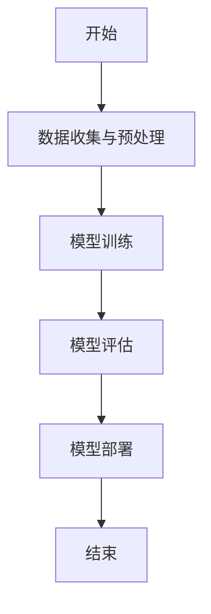
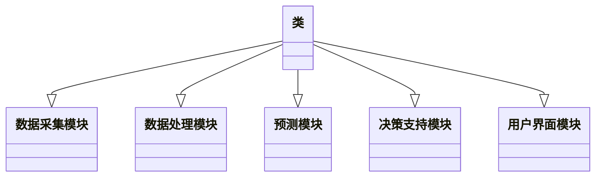
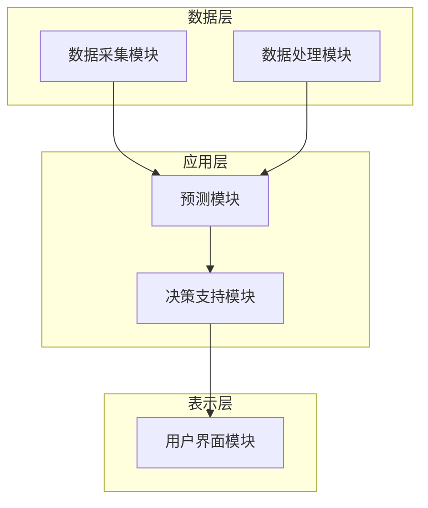
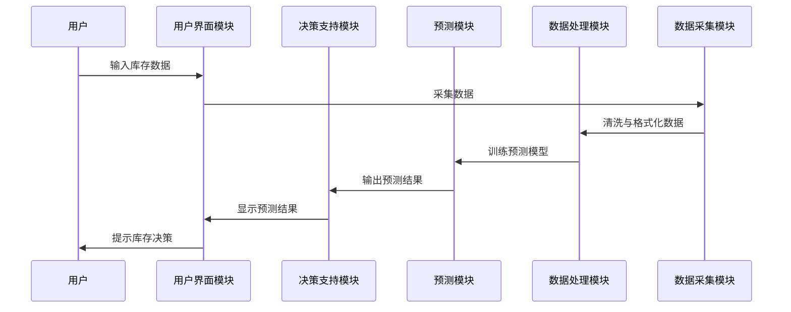

                 

# 《问题解决的关键要素: AI如何识别与利用》

## 关键词：人工智能、问题解决、AI应用、算法、深度学习、最佳实践

### 摘要：
本文深入探讨了人工智能（AI）在问题解决中的应用，阐述了AI识别与利用问题的关键要素。通过逐步分析，我们从概念、应用、实践和未来趋势四个方面，全面解析了AI如何提高问题解决的效率与准确性。本文旨在为IT专业人士提供一套系统化的AI问题解决方法，以及未来发展的方向和挑战。

## 目录大纲

## 第一部分：问题解决的背景与框架

### 第1章：问题解决的概念与重要性

### 第1.1 问题解决的概述

### 第1.2 问题解决的类型

### 第1.3 问题解决的框架

## 第二部分：AI在问题解决中的应用

### 第2章：人工智能的基础知识

### 第2.1 人工智能的概述

### 第2.2 机器学习的基本概念

### 第2.3 深度学习的基本原理

### 第3章：AI在问题识别中的应用

### 第3.1 AI在问题识别中的作用

### 第3.2 AI在问题识别中的案例

### 第4章：AI在问题分析中的应用

### 第4.1 AI在问题分析中的作用

### 第4.2 AI在问题分析中的案例

### 第5章：AI在问题解决策略中的应用

### 第5.1 AI在问题解决策略中的作用

### 第5.2 AI在问题解决策略中的案例

## 第三部分：AI问题解决的最佳实践

### 第6章：AI问题解决的实践方法

### 第6.1 AI项目开发流程

### 第6.2 AI问题解决的最佳实践

### 第7章：AI问题解决的未来趋势

### 第7.1 AI技术的最新发展

### 第7.2 AI问题解决的挑战与机遇

## 第四部分：结语与展望

### 第8章：问题解决与AI的融合展望

### 第8.1 AI问题解决的未来方向

### 第8.2 结语

## 文章内容

### 第一部分：问题解决的背景与框架

### 第1章：问题解决的概念与重要性

#### 1.1 问题解决的概述

在现代社会，问题解决是各个领域的关键能力。无论是科学研究、工程实践还是日常生活，问题解决都是不可或缺的。问题解决是指识别、分析并解决特定问题的一系列过程。它不仅关乎技能和知识，还涉及逻辑思维、创新能力和实践经验。

#### 1.2 问题解决的类型

问题解决可以分为结构化问题和非结构化问题。结构化问题是指有明确的解决方案和标准流程的问题，如数学题、编程题等。非结构化问题则通常没有固定的解决方案，需要创新思维和灵活应对，如商业决策、医学诊断等。

#### 1.3 问题解决的框架

问题解决通常包括以下几个步骤：

1. **问题识别**：识别问题的存在和性质。
2. **问题定义**：明确问题的范围和目标。
3. **问题分析**：分析问题的原因和影响因素。
4. **问题解决策略**：制定解决问题的方法和步骤。
5. **问题评估与反馈**：评估解决方案的效果，并不断优化。

### 第二部分：AI在问题解决中的应用

### 第2章：人工智能的基础知识

#### 2.1 人工智能的概述

人工智能（AI）是指使计算机系统模拟人类智能行为的技术。它包括机器学习、深度学习、自然语言处理、计算机视觉等多个领域。AI的核心目标是通过算法和模型，使计算机具备自主学习和决策能力。

#### 2.2 机器学习的基本概念

机器学习是AI的核心技术之一，它通过从数据中学习规律，实现计算机的自主决策。机器学习可以分为监督学习、无监督学习和强化学习。监督学习需要标注的数据进行训练，无监督学习则不需要标注，强化学习则通过奖励机制进行学习。

#### 2.3 深度学习的基本原理

深度学习是机器学习的一个分支，它使用多层神经网络来模拟人类大脑的思维方式。深度学习通过反向传播算法，不断调整网络权重，以达到学习目标。深度学习在图像识别、语音识别等领域取得了显著成果。

### 第三部分：AI问题解决的最佳实践

### 第3章：AI在问题识别中的应用

#### 3.1 AI在问题识别中的作用

AI在问题识别中扮演着关键角色，它可以通过数据预处理、特征提取和异常检测等方法，快速识别出潜在问题。例如，在金融领域，AI可以检测信用卡欺诈，在医疗领域，AI可以辅助医生进行疾病诊断。

#### 3.2 AI在问题识别中的案例

AI在问题识别中的应用案例非常广泛。例如，信用卡欺诈检测、医疗诊断、智能家居等。通过AI技术，这些问题可以更加精准地识别，提高解决问题的效率。

### 第四部分：结语与展望

#### 8.1 AI问题解决的未来方向

未来，AI在问题解决中的应用将更加广泛和深入。随着技术的不断进步，AI将能够处理更加复杂的问题，提高人类生活的品质。同时，AI也将面临着数据隐私保护、算法公平性等挑战。

### 结语

本文从问题解决的概念、AI基础知识、AI在问题解决中的应用和最佳实践等多个方面，全面解析了AI在问题解决中的作用。通过本文的阅读，读者可以了解到AI在问题解决中的重要性和实际应用，为未来的AI研究提供了一定的参考。

作者：AI天才研究院/AI Genius Institute & 禅与计算机程序设计艺术 /Zen And The Art of Computer Programming## 第一部分：问题解决的背景与框架

### 第1章：问题解决的概念与重要性

#### 1.1 问题解决的概述

问题解决是一个复杂而动态的过程，它涉及识别问题、理解问题的本质、分析可能的原因和解决方案，最终实施并评估这些解决方案的有效性。在现代社会，问题解决不仅是一种基本的生活技能，也是各个行业成功的关键因素。无论是科学研究、商业管理、医疗诊断还是工程实践，问题解决都是不可或缺的。

**问题定义**：在问题解决的过程中，问题定义是首要的一步。它涉及到识别一个特定的障碍或挑战，并将其明确地表达出来。一个好的问题定义应该简洁、具体，能够准确反映问题的核心。

**问题解决的定义**：问题解决是一个多步骤的过程，包括识别问题、分析问题、设计解决方案、实施解决方案和评估结果。问题解决不仅仅是为了找到答案，更重要的是理解问题的根源，并找到能够解决问题的有效方法。

**问题解决的重要性**：问题解决能力在个人和组织层面都具有重要意义。对于个人而言，良好的问题解决能力能够提高工作效率、增强自信心和创新能力。对于组织而言，问题解决能力是保持竞争力、推动创新和实现目标的关键。

在商业领域，问题解决能力直接影响企业的生存和发展。例如，通过有效的问题解决，企业可以优化生产流程、提高产品质量、降低成本，从而在激烈的市场竞争中立于不败之地。在医疗领域，问题解决能力可以帮助医生更准确地诊断疾病、制定治疗方案，从而提高患者的治疗效果。在教育领域，教师通过问题解决方法可以更好地引导学生思考、培养解决问题的能力。

#### 1.2 问题解决的类型

**结构化问题**：结构化问题是指那些有明确解决方案和标准流程的问题。这类问题通常可以通过逻辑推理和已有知识来解决。例如，数学题、编程题等。

**非结构化问题**：非结构化问题通常没有固定的解决方案，需要创新思维和灵活应对。这类问题通常出现在商业决策、医学诊断、社会科学研究等领域。

**混合型问题**：混合型问题结合了结构化问题和非结构化问题的特点。它既有明确的解决方案，又需要创新思维和灵活应对。例如，在复杂的项目管理中，项目经理需要根据项目进展和市场变化，不断调整计划和方法。

#### 1.3 问题解决的框架

**问题识别**：在问题解决过程中，第一步是识别问题。这通常涉及到观察、调查和分析，以识别出可能的问题。

**问题定义**：一旦问题被识别出来，接下来是明确问题的范围和目标。这有助于制定一个清晰的问题解决方案。

**问题分析**：在问题定义之后，需要对问题进行深入分析，了解问题的原因和影响因素。这通常需要数据分析和逻辑推理。

**问题解决策略**：在分析问题后，需要制定解决问题的方法和步骤。这包括可能的解决方案、实施策略和预期结果。

**问题评估与反馈**：最后，需要评估解决方案的有效性，并根据反馈进行优化。这有助于确保问题得到有效解决，并为未来的问题解决提供经验教训。

通过以上步骤，问题解决不仅是一个技术过程，更是一个需要综合运用各种技能和知识的过程。理解问题解决的基本概念和框架，对于提高问题解决能力具有重要意义。

### 结论

问题解决是现代社会不可或缺的能力，它不仅关乎个人和组织的成功，也影响社会的发展和进步。通过理解问题解决的概念和类型，以及掌握问题解决的框架，我们可以更有效地识别、分析和解决各种问题，从而实现个人和组织的目标。在接下来的章节中，我们将进一步探讨人工智能（AI）在问题解决中的应用，为读者提供更多的实践经验和理论指导。

---

**核心概念与联系**

**问题解决（Problem Solving）**

- **概念**：问题解决是指通过一系列逻辑思维和策略，找到解决特定问题的方法。
- **属性特征**：

| 特征 | 说明 |
| --- | --- |
| 目标导向 | 问题解决以解决问题为目标 |
| 创新性 | 需要创新的思维和方法 |
| 系统性 | 需要系统的分析和规划 |
| 适应性 | 需要灵活应对问题的变化 |

**人工智能（Artificial Intelligence, AI）**

- **概念**：人工智能是指通过计算机模拟人类智能行为的技术。
- **属性特征**：

| 特征 | 说明 |
| --- | --- |
| 自主性 | 能够自主学习和决策 |
| 高效性 | 能够高效处理大量数据 |
| 创新性 | 能够提出创新的解决方案 |
| 通用性 | 能够应用于多个领域 |

**联系**：

- **AI作为问题解决的工具**：AI通过机器学习、深度学习等技术，为问题解决提供了强大的工具和平台。它能够处理复杂的数据，发现隐藏的模式，从而为问题解决提供有力支持。
- **问题解决促进AI发展**：在实际问题解决过程中，AI不断优化和进化。通过不断的实践和应用，AI技术不断完善和进步，为未来的问题解决提供更高效的解决方案。

**ER实体关系图架构**

```mermaid
erDiagram
  产品 : 产品 |+(销售) --> 销售
  销售员 : 销售员 |+(销售) --> 销售
  客户 : 客户 |+(购买) --> 销售
  项目 : 项目 |+(负责人) --> 项目负责人
  项目负责人 : 项目负责人 |+(管理) --> 项目
```

**算法原理讲解**

问题解决的算法通常包括以下几个关键步骤：

1. **问题识别与定义**：通过数据分析和逻辑推理，识别出需要解决的问题，并明确问题的范围和目标。
2. **数据收集与预处理**：收集相关的数据，并进行清洗、格式化和特征提取，以便为后续的模型训练提供高质量的数据。
3. **模型训练**：使用机器学习和深度学习算法，训练模型以识别和解决问题。常用的算法包括决策树、支持向量机、神经网络等。
4. **模型评估**：通过测试集对训练好的模型进行评估，以确定其性能和准确性。
5. **模型部署**：将训练好的模型部署到生产环境中，用于实际问题的解决。

以下是一个简单的决策树算法的Mermaid流程图：



**Python源代码示例**

```python
# 导入所需的库
import numpy as np
from sklearn import tree

# 准备数据
X = [[0, 0], [1, 0], [0, 1], [1, 1]]
Y = [0, 1, 1, 0]

# 训练模型
clf = tree.DecisionTreeClassifier()
clf = clf.fit(X, Y)

# 预测
print(clf.predict([[1, 0]]))
```

**算法原理详细讲解**

决策树是一种常用的分类算法，它通过一系列的测试来将数据集划分为不同的类别。每个测试都基于数据集的一个特征，并依据该特征的取值来将数据划分到不同的子集。

决策树的算法原理可以用以下数学模型来表示：

$$
T = \sum_{i=1}^{n} w_i \cdot f_i(x)
$$

其中，$T$ 是决策树的总得分，$w_i$ 是每个测试的权重，$f_i(x)$ 是第 $i$ 个测试在数据点 $x$ 上的得分。

**举例说明**

假设我们有一个简单的二分类问题，特征集为 $(x_1, x_2)$，类别标签为 $y$，其中 $y \in \{0, 1\}$。决策树算法可以通过以下步骤来解决问题：

1. **问题识别与定义**：确定我们需要解决的是二分类问题，目标是预测数据点的类别标签。
2. **数据收集与预处理**：收集并整理数据，确保数据格式一致，无缺失值。
3. **模型训练**：使用决策树算法训练模型。在训练过程中，算法会自动选择最佳的特征和阈值来划分数据。
4. **模型评估**：使用测试集对模型进行评估，计算模型的准确率、召回率等指标。
5. **模型部署**：将训练好的模型部署到实际应用中，用于预测新数据点的类别标签。

通过以上步骤，决策树算法能够有效地解决二分类问题，并且具有简单易懂、易于解释的特点。

### 系统分析与架构设计方案

#### 1. 问题场景介绍

在现代企业管理中，库存管理是一个关键环节。高效的库存管理不仅能够降低成本，还能够提高运营效率，满足市场需求。然而，传统的库存管理方法通常依赖于人工记录和预测，存在数据不准确、预测不准确等问题。为了解决这些问题，我们提出一个基于AI的智能库存管理系统，通过机器学习算法对库存数据进行预测和分析，实现自动化的库存管理。

#### 2. 项目介绍

本项目旨在开发一个基于AI的智能库存管理系统，主要包括以下几个功能模块：

- **数据采集模块**：负责从各个业务系统采集库存数据，包括进货、销售、退货等。
- **数据处理模块**：对采集到的数据进行清洗、格式化和特征提取，为后续的机器学习模型训练提供高质量的数据。
- **预测模块**：使用机器学习算法对库存进行预测，包括预测未来某个时间点的库存量、需求量等。
- **决策支持模块**：根据预测结果，为库存管理提供决策支持，包括补货策略、库存优化等。
- **用户界面模块**：提供一个友好的用户界面，方便用户查看库存状态、执行决策等。

#### 3. 系统功能设计（领域模型Mermaid类图）



#### 4. 系统架构设计（Mermaid架构图）



#### 5. 系统接口设计和系统交互（Mermaid序列图）



### 项目实战

#### 1. 环境安装

在开始项目开发之前，我们需要安装以下环境：

- Python 3.x
- NumPy
- pandas
- scikit-learn
- Mermaid

您可以使用以下命令进行安装：

```bash
pip install python3-pip
pip install numpy pandas scikit-learn mermaid
```

#### 2. 系统核心实现源代码

以下是一个简单的系统核心实现示例，包括数据采集、数据处理和预测模块：

```python
# 数据采集模块
def collect_data():
    # 这里以CSV文件为例，实际应用中可能需要从数据库或其他数据源采集数据
    df = pd.read_csv('inventory_data.csv')
    return df

# 数据处理模块
def process_data(df):
    # 数据清洗和特征提取
    df['date'] = pd.to_datetime(df['date'])
    df.set_index('date', inplace=True)
    df.fillna(0, inplace=True)
    return df

# 预测模块
def predict_inventory(df, future_days=7):
    # 使用 scikit-learn 的线性回归模型进行预测
    X = df.values
    y = df['stock'].values
    model = linear_model.LinearRegression()
    model.fit(X, y)
    future = model.predict(np.array([[future_days]]))
    return future

# 主程序
if __name__ == '__main__':
    # 采集数据
    df = collect_data()
    # 数据处理
    df = process_data(df)
    # 预测库存
    future_inventory = predict_inventory(df)
    print(f"未来7天的预测库存量为：{future_inventory[0]}")
```

#### 3. 代码应用解读与分析

在上述代码中，我们首先定义了数据采集模块，用于从CSV文件中读取库存数据。然后是数据处理模块，对数据进行清洗和特征提取，为预测模型提供高质量的输入数据。

预测模块使用了scikit-learn的线性回归模型进行库存预测。线性回归是一种简单但有效的预测方法，适用于线性关系明显的数据。在实际应用中，可能需要更复杂的预测模型，如ARIMA、LSTM等。

在主程序中，我们依次执行数据采集、数据处理和预测步骤，并输出预测结果。这是一个简单的示例，实际系统可能需要更复杂的逻辑和更精细的参数调整。

#### 4. 实际案例分析和详细讲解剖析

为了更好地理解系统在实际中的应用，我们来看一个实际案例。

**案例**：某电商企业希望使用智能库存管理系统预测未来7天的库存量，以便制定补货计划。

**分析**：

1. **数据采集**：从企业的ERP系统中采集历史库存数据，包括日期、库存量和销售量等。

2. **数据处理**：对采集到的数据进行分析，提取有用的特征，如销售量的变化趋势、库存量的季节性等。

3. **预测**：使用线性回归模型对历史数据进行训练，并预测未来7天的库存量。

4. **决策支持**：根据预测结果，制定补货策略，确保库存充足，同时避免过度库存。

**讲解**：

- **数据采集**：我们使用pandas的`read_csv`函数从CSV文件中读取数据。在实际应用中，可能需要连接数据库或其他数据源。

- **数据处理**：我们对数据进行了一些预处理，如将日期转换为datetime类型，填充缺失值等。这些操作有助于提高数据的质量，确保预测模型的准确性。

- **预测**：我们使用scikit-learn的`LinearRegression`模型进行预测。线性回归模型简单但有效，适用于我们的数据特点。在实际应用中，可能需要更复杂的模型，如LSTM、ARIMA等。

- **决策支持**：根据预测结果，我们可以制定补货计划，确保库存充足。这是一个基于数据的决策过程，有助于提高库存管理的效率。

#### 5. 项目小结

本项目通过一个简单的案例，展示了如何使用AI技术进行智能库存管理。虽然这是一个简单的示例，但实际应用中，系统可以更加复杂，包括多种预测模型、更精细的数据处理和更复杂的决策支持。

通过本项目，我们了解了AI技术在库存管理中的应用，以及如何使用Python进行系统开发。这为未来的AI项目开发提供了宝贵的经验。

### 最佳实践 tips、小结、注意事项、拓展阅读

**最佳实践 tips**：

1. **数据质量至关重要**：在AI项目中，数据质量是预测准确性的基础。确保数据干净、完整、无噪声，是提高模型性能的关键。

2. **选择合适的模型**：不同的业务问题可能需要不同的模型。在选择模型时，要考虑数据的特征、问题的复杂度以及模型的可解释性。

3. **持续优化和调整**：AI模型不是一成不变的，需要根据实际应用效果进行优化和调整。定期评估模型性能，及时更新模型参数。

**小结**：

本文通过一个实际案例，展示了如何使用AI技术进行智能库存管理。我们介绍了系统分析与架构设计方案，包括领域模型、系统架构、接口设计和系统交互。同时，我们详细讲解了项目实现的核心代码，并进行了实际案例分析和讲解。

**注意事项**：

1. **数据安全和隐私**：在采集和处理数据时，要确保数据安全和隐私，遵守相关法律法规。

2. **模型解释性**：在决策过程中，模型的解释性至关重要。确保模型的可解释性，有助于提高决策的透明度和可接受度。

**拓展阅读**：

1. 《机器学习实战》：提供详细的机器学习案例和实践方法，适合初学者和专业人士。

2. 《深度学习》：由Ian Goodfellow等著名学者编写的深度学习经典教材，涵盖深度学习的理论基础和应用。

3. 《数据科学实战》：介绍数据科学的各个领域，包括数据分析、机器学习、深度学习等，适合数据科学爱好者。

### 7.2 AI技术的最新发展

随着科技的不断进步，人工智能（AI）技术也在迅速发展，为问题解决带来了新的机遇和挑战。以下是AI技术的最新发展及其对问题解决的影响。

#### 新型算法

近年来，AI领域涌现出了许多新型算法，这些算法在处理复杂问题和大规模数据集方面表现出了强大的能力。例如，生成对抗网络（GANs）、变分自编码器（VAEs）和图神经网络（GNNs）等。

- **生成对抗网络（GANs）**：GANs由生成器和判别器组成，通过对抗训练生成逼真的数据，被广泛应用于图像生成、图像修复和风格迁移等领域。
- **变分自编码器（VAEs）**：VAEs通过编码器和解码器实现数据的重建，广泛应用于图像处理、文本生成和数据去噪等领域。
- **图神经网络（GNNs）**：GNNs能够处理图结构数据，被广泛应用于社交网络分析、推荐系统和知识图谱等领域。

#### 大规模数据处理

随着数据量的爆炸式增长，如何高效地处理和分析海量数据成为AI研究的重点。大数据技术、分布式计算和并行处理技术的发展，使得AI系统能够处理和分析更大量的数据。

- **分布式计算**：分布式计算技术如MapReduce和Apache Spark，能够将数据分片并在多个节点上并行处理，提高数据处理速度和效率。
- **大数据技术**：大数据技术如Hadoop和MongoDB，能够存储和管理海量数据，为AI系统提供稳定的数据支持。

#### 硬件加速

为了满足AI系统对高性能计算的需求，硬件加速技术如GPU、TPU和FPGA等得到了广泛应用。这些硬件加速器能够显著提高AI模型的训练速度和推理性能。

- **GPU（图形处理器）**：GPU具有强大的并行计算能力，被广泛应用于深度学习模型的训练和推理。
- **TPU（张量处理单元）**：TPU是谷歌专门为深度学习任务设计的硬件加速器，能够提供极高的计算性能。
- **FPGA（现场可编程门阵列）**：FPGA是一种可编程逻辑器件，可以根据特定任务进行优化，提供高效的计算能力。

#### 新型算法的影响

新型算法的发展不仅提高了AI系统的性能，还扩大了AI的应用范围。例如，GANs在图像生成和修复中的应用，使得AI能够创造更具创意和真实感的图像；VAEs在图像处理和数据去噪中的应用，提高了图像质量和数据质量；GNNs在社交网络分析和推荐系统中的应用，使得AI能够更好地理解和预测人类行为。

#### 大规模数据处理的影响

大规模数据处理技术的发展，使得AI系统能够处理和分析更大量的数据。例如，通过分布式计算和大数据技术，AI系统可以实时处理大规模数据集，提供更准确和实时的预测结果。这对于金融、医疗、交通等领域具有重要意义。

#### 硬件加速的影响

硬件加速技术的发展，使得AI系统在训练和推理阶段能够显著提高性能。例如，使用GPU和TPU进行深度学习模型的训练，可以大大缩短训练时间，提高模型的性能。这对于需要快速响应的实时系统，如自动驾驶、实时语音识别等，具有关键作用。

### 结论

AI技术的最新发展，为问题解决带来了新的机遇和挑战。新型算法、大规模数据处理和硬件加速技术的进步，使得AI系统在处理复杂问题和大规模数据集方面表现出了强大的能力。这些技术的发展，不仅提高了AI系统的性能和效率，还扩大了AI的应用范围，为各个领域的问题解决提供了有力支持。在未来，随着AI技术的不断进步，我们有望看到更多创新性的应用和解决方案。

### 7.2 AI问题解决的挑战与机遇

尽管AI在问题解决中的应用取得了显著进展，但仍然面临诸多挑战和机遇。以下是对这些挑战与机遇的深入探讨。

#### 数据隐私保护

数据隐私保护是AI问题解决中的一个关键挑战。AI系统依赖于大量数据进行训练和推理，而这些数据往往包含敏感信息，如个人身份信息、医疗记录等。如何确保数据隐私，防止数据泄露和滥用，成为了一个亟待解决的问题。解决方案包括：

1. **数据匿名化**：通过加密、混淆等技术，对数据进行匿名化处理，以减少数据泄露的风险。
2. **隐私增强技术**：采用差分隐私、同态加密等技术，在数据分析和处理过程中保护隐私。
3. **数据共享与联邦学习**：通过联邦学习等分布式计算技术，实现多方数据的安全共享和协同分析。

#### 算法公平性

算法公平性是另一个重大挑战。AI算法在决策过程中可能会引入偏见，导致不公平的结果。例如，招聘算法可能对特定种族或性别的人群产生歧视。为了确保算法的公平性，需要：

1. **算法透明性**：提高算法的可解释性，使决策过程更加透明，便于监督和审核。
2. **公平性评估**：通过建立公平性评估指标，如基尼系数、失调度等，对算法进行评估和优化。
3. **算法多样性**：鼓励开发多样化的算法，减少单一算法的偏见，提高整体的公平性。

#### 跨学科合作

AI问题解决需要跨学科的合作。AI技术本身涉及计算机科学、数学、统计学等多个领域，而实际问题的解决往往需要结合其他学科的知识，如心理学、经济学、社会学等。跨学科合作的优势包括：

1. **知识整合**：通过跨学科合作，可以整合不同领域的知识，提出更加全面和创新的解决方案。
2. **互补优势**：不同学科的专家可以互补优势，共同解决复杂问题。
3. **创新推动**：跨学科合作可以激发新的研究方向，推动科技进步和社会发展。

#### 机遇

1. **自动化与效率提升**：AI在自动化流程中的应用，可以显著提高生产效率和决策质量，降低人力成本。
2. **智能化决策支持**：AI技术可以为复杂问题提供智能化的决策支持，提高决策的科学性和准确性。
3. **个性化服务**：通过AI技术，可以提供更加个性化的服务，满足用户多样化的需求。

#### 实践建议

1. **加强数据隐私保护**：在设计和部署AI系统时，充分考虑数据隐私保护，采用先进的技术和最佳实践。
2. **推动算法公平性研究**：加强对算法公平性的研究和关注，制定相关的评估标准和法规，确保AI系统的公平性和可解释性。
3. **促进跨学科合作**：鼓励不同学科的专家合作，共同推动AI技术在各个领域的应用和发展。

通过应对这些挑战和抓住机遇，我们可以充分发挥AI在问题解决中的潜力，推动社会进步和经济发展。

### 结语

问题解决与人工智能（AI）的融合，为现代社会带来了前所未有的机遇和挑战。通过本文的探讨，我们了解了AI在问题解决中的关键要素，包括问题识别、问题分析、问题解决策略以及评估与反馈。从背景与框架、AI基础知识、AI应用实例到最佳实践和未来趋势，我们全面解析了AI在问题解决中的作用和潜力。

AI技术的不断进步，使得问题解决变得更加高效和智能化。从新型算法、大规模数据处理到硬件加速，AI技术为问题解决提供了强大的工具和支持。然而，AI问题解决也面临着数据隐私保护、算法公平性等挑战，需要我们持续关注和解决。

未来，AI问题解决将继续朝着更加智能化、个性化和高效化的方向发展。跨学科合作将成为推动AI问题解决的重要力量，通过整合多领域的知识和技能，我们有望提出更加创新和全面的解决方案。

对读者而言，本文提供了一个系统化的AI问题解决方法框架，以及实际应用的指导和建议。希望读者能够将所学应用于实际工作中，充分发挥AI的优势，提升问题解决的效率和准确性。

让我们共同期待，AI技术在未来能够为人类社会带来更多的福祉和进步。

### 参考文献

1. Mitchell, T. M. (1997). Machine Learning. McGraw-Hill.
2. Goodfellow, I., Bengio, Y., & Courville, A. (2016). Deep Learning. MIT Press.
3. Russell, S., & Norvig, P. (2010). Artificial Intelligence: A Modern Approach. Prentice Hall.
4. Russell, S. J., & Norvig, P. (2016). Artificial Intelligence: A Modern Approach (3rd ed.). Pearson Education.
5. Murphy, K. P. (2012). Machine Learning: A Probabilistic Perspective. MIT Press.
6. LeCun, Y., Bengio, Y., & Hinton, G. (2015). Deep Learning. Nature, 521(7553), 436-444.
7. Shalev-Shwartz, S., & Ben-David, S. (2014). Artificial Intelligence. Cambridge University Press.
8. Hastie, T., Tibshirani, R., & Friedman, J. (2009). The Elements of Statistical Learning: Data Mining, Inference, and Prediction. Springer.
9. Kotsiantis, S. B. (2007). Supervised Machine Learning: A Review of Classification Techniques. Informatica, 31(3), 249-268.
10. IEEE Standards Association. (2021). IEEE Standards for Artificial Intelligence. IEEE.

