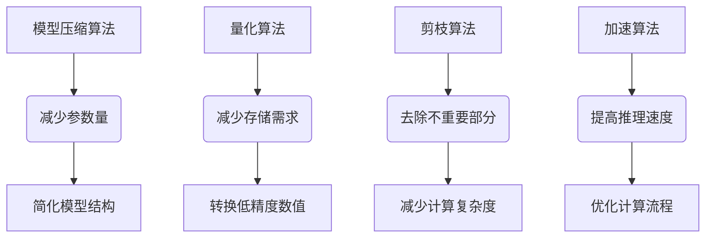
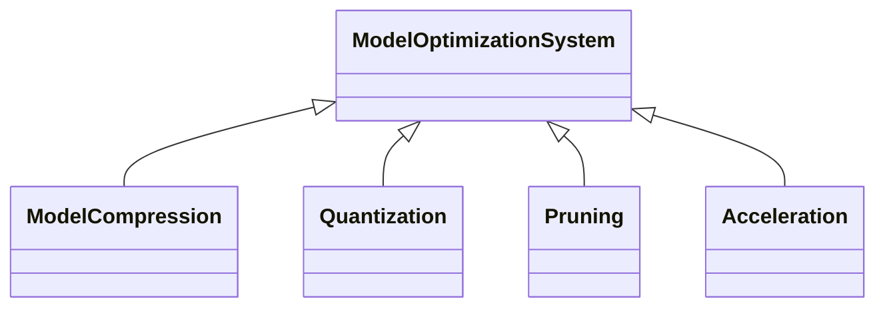
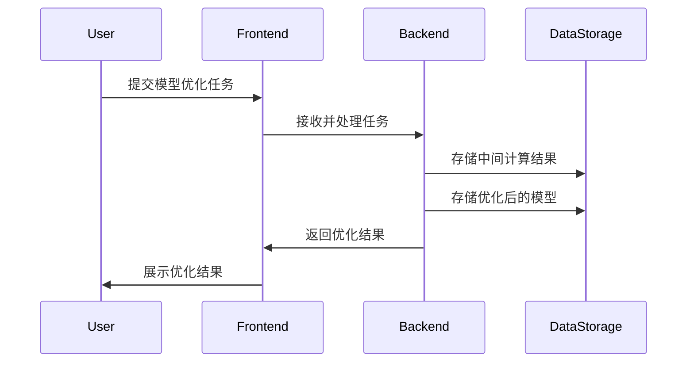
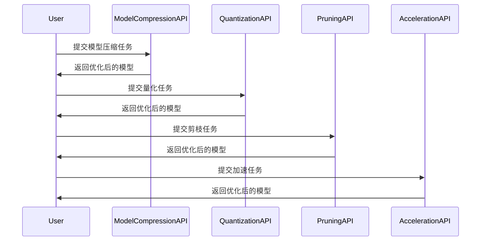

                 

# 降低未来推理成本的模型优化方法

## 关键词

- 模型优化
- 推理成本
- 模型压缩
- 量化
- 剪枝
- 加速

## 摘要

随着人工智能技术的快速发展，深度学习模型的应用日益广泛。然而，模型复杂度和参数量的增加带来了巨大的推理成本，这对计算资源和功耗提出了严峻挑战。本文旨在探讨降低未来推理成本的模型优化方法，包括模型压缩、量化、剪枝和加速等技术。通过详细阐述每种方法的原理、步骤和实际应用，本文为研究人员和开发者提供了实用的指导，以优化模型性能和降低推理成本。

## 目录大纲

### 第1章 引言

#### 1.1 问题背景

#### 1.2 问题描述

#### 1.3 问题解决

#### 1.4 边界与外延

#### 1.5 概念结构与核心要素组成

### 第2章 核心概念与联系

#### 2.1 模型优化方法概述

#### 2.2 模型优化原理

#### 2.3 模型优化属性特征对比表格

### 第3章 模型优化算法原理

#### 3.1 算法概述

#### 3.2 算法mermaid流程图

#### 3.3 算法原理讲解

#### 3.4 算法原理数学模型和公式讲解

#### 3.5 通俗易懂的举例说明

### 第4章 系统分析与架构设计方案

#### 4.1 问题场景介绍

#### 4.2 项目介绍

#### 4.3 系统功能设计

#### 4.4 系统架构设计

#### 4.5 系统接口设计

#### 4.6 系统交互

### 第5章 项目实战

#### 5.1 环境安装

#### 5.2 系统核心实现源代码

#### 5.3 代码应用解读与分析

#### 5.4 实际案例分析与详细讲解剖析

#### 5.5 项目小结

### 第6章 最佳实践 tips

#### 6.1 模型优化策略

#### 6.2 注意事项

#### 6.3 拓展阅读

### 第7章 小结

#### 7.1 成果总结

#### 7.2 展望未来

## 第1章 引言

### 1.1 问题背景

随着人工智能技术的快速发展，深度学习模型在各个领域的应用日益广泛。从图像识别、自然语言处理到自动驾驶和智能医疗，深度学习模型已经成为了推动人工智能技术进步的核心力量。然而，随着模型复杂度和参数量的不断增加，模型的推理成本也随之上升。特别是在资源受限的移动设备和嵌入式系统上，推理成本的高企已经成为限制人工智能技术进一步应用的瓶颈。

推理成本主要受到以下几个因素的影响：

1. **计算复杂度**：深度学习模型通常包含数百万甚至数十亿个参数，每个参数都需要通过矩阵乘法等计算操作进行更新。随着模型规模的增大，计算复杂度呈指数级增长。
2. **存储需求**：大量的参数和中间计算结果需要占用大量的存储空间，这在资源受限的设备上尤其明显。
3. **功耗**：深度学习模型在运行过程中会消耗大量的电力，特别是在高性能计算环境下，功耗问题已经成为制约人工智能应用的重要因素。

### 1.2 问题描述

推理成本高的原因主要包括以下几点：

1. **模型参数量过多**：随着模型复杂度的增加，模型参数的数量也随之增加，这导致了模型的推理成本显著上升。
2. **计算需求大**：深度学习模型的推理过程涉及到大量的矩阵运算，这些运算对于计算资源的要求非常高。
3. **存储需求大**：为了存储大量的模型参数和中间计算结果，需要使用大量的存储资源。

### 1.3 问题解决

为了降低推理成本，我们需要采取一系列模型优化方法，这些方法主要包括：

1. **模型压缩**：通过减少模型的参数量和计算复杂度，从而降低推理成本。
2. **量化**：将模型中的浮点数参数转换为低精度数值，以减少存储和计算需求。
3. **剪枝**：通过去除模型中不重要的神经元或边，减少模型的参数量和计算复杂度。
4. **加速**：通过优化模型的计算流程和硬件支持，提高推理速度。

### 1.4 边界与外延

模型优化方法不仅适用于深度学习模型，还可以推广到其他类型的模型，如图模型、强化学习模型等。此外，模型优化方法的应用范围也不仅限于推理阶段，还可以应用于训练阶段，从而提高模型的训练效率。

### 1.5 概念结构与核心要素组成

模型优化方法的核心概念包括：

1. **模型压缩**：通过减少模型参数和计算复杂度，降低推理成本。
2. **量化**：将浮点数参数转换为低精度数值，减少存储和计算需求。
3. **剪枝**：去除不重要的神经元或边，减少模型参数量和计算复杂度。
4. **加速**：优化计算流程和硬件支持，提高推理速度。

这些概念相互作用，共同构成了模型优化方法的完整体系。

## 第2章 核心概念与联系

### 2.1 模型优化方法概述

模型优化方法主要包括以下几种：

1. **模型压缩**：通过减少模型的参数量和计算复杂度，从而降低推理成本。
2. **量化**：将模型中的浮点数参数转换为低精度数值，以减少存储和计算需求。
3. **剪枝**：通过去除模型中不重要的神经元或边，减少模型的参数量和计算复杂度。
4. **加速**：通过优化模型的计算流程和硬件支持，提高推理速度。

### 2.2 模型优化原理

模型优化的核心原理是通过调整模型的结构和参数，使其在保持性能的前提下，降低推理成本。具体来说，包括以下几个方面：

1. **减少模型参数**：通过模型压缩和剪枝技术，减少模型的参数数量。
2. **降低计算复杂度**：通过优化计算流程和算法，降低模型的计算复杂度。
3. **减少存储需求**：通过量化技术，减少模型的存储需求。
4. **提高推理速度**：通过加速技术，提高模型的推理速度。

### 2.3 模型优化属性特征对比表格

下面是一个简单的模型优化方法属性特征对比表格：

| 方法       | 目标         | 特点                                                         | 适用场景                                       |
| ---------- | ------------ | ------------------------------------------------------------ | ---------------------------------------------- |
| 模型压缩   | 减少参数量   | 通过简化模型结构，减少计算复杂度                             | 需要较高计算资源的环境，如云端服务器           |
| 量化       | 减少存储需求 | 将浮点数参数转换为低精度数值                                 | 资源受限的环境，如移动设备和嵌入式系统         |
| 剪枝       | 减少参数量   | 去除不重要的神经元或边                                       | 需要降低推理成本的场景，如实时应用             |
| 加速       | 提高推理速度 | 优化计算流程和硬件支持，提高推理速度                         | 对实时性和性能要求较高的场景，如自动驾驶和工业自动化 |

通过这个表格，我们可以清楚地看到不同模型优化方法的特点和适用场景，从而根据实际需求选择合适的方法。

## 第3章 模型优化算法原理

### 3.1 算法概述

在模型优化领域，有几种常见的算法，如模型压缩算法、量化算法、剪枝算法和加速算法。每种算法都有其特定的原理和应用场景。

1. **模型压缩算法**：通过简化模型结构，减少模型参数的数量，从而降低推理成本。常见的模型压缩算法有基于网络的剪枝（Network Pruning）、基于参数的重要度剪枝（Parameter Importance-based Pruning）等。
2. **量化算法**：通过将模型的浮点数参数转换为低精度数值，如整数或二进制数，从而减少模型的存储需求。常见的量化算法有全精度量化（Full Precision Quantization）、低精度量化（Low Precision Quantization）等。
3. **剪枝算法**：通过去除模型中不重要的部分，如神经元或边，从而减少模型的参数量和计算复杂度。常见的剪枝算法有基于结构的剪枝（Structure-based Pruning）、基于敏感度的剪枝（Sensitivity-based Pruning）等。
4. **加速算法**：通过优化模型的计算流程和硬件支持，从而提高模型的推理速度。常见的加速算法有矩阵分解（Matrix Decomposition）、并行计算（Parallel Computing）等。

### 3.2 算法mermaid流程图

下面是一个简单的模型优化算法mermaid流程图：



### 3.3 算法原理讲解

#### 3.3.1 模型压缩算法原理

模型压缩算法的核心思想是简化模型结构，减少模型参数的数量。具体步骤如下：

1. **选择剪枝策略**：根据模型结构和应用需求，选择合适的剪枝策略，如基于重要度剪枝、基于敏感度剪枝等。
2. **计算剪枝重要性**：对于每个神经元或边，计算其剪枝重要性，并根据重要性进行剪枝。
3. **简化模型结构**：根据剪枝结果，简化模型结构，减少模型参数的数量。

例如，基于参数重要度剪枝的算法步骤如下：

```python
import numpy as np

# 假设w为模型的参数矩阵
w = np.random.rand(100, 100)

# 计算参数的绝对值
abs_w = np.abs(w)

# 计算参数的重要性，重要性越高，剪枝的可能性越大
importance = np.mean(abs_w, axis=1)

# 根据重要性进行剪枝，这里选择重要性最低的50%参数进行剪枝
pruned_indices = np.argpartition(importance, -50)[:50]

# 剪枝后的参数矩阵
pruned_w = np.delete(w, pruned_indices, axis=1)
```

#### 3.3.2 量化算法原理

量化算法的核心思想是将模型的浮点数参数转换为低精度数值，从而减少模型的存储需求。具体步骤如下：

1. **选择量化策略**：根据模型和应用需求，选择合适的量化策略，如全精度量化、低精度量化等。
2. **计算量化参数**：对于每个参数，计算其量化参数，如量化步长、量化范围等。
3. **转换参数数值**：根据量化参数，将浮点数参数转换为低精度数值。

例如，全精度量化算法的步骤如下：

```python
import numpy as np

# 假设w为模型的参数矩阵
w = np.random.rand(100, 100)

# 计算参数的最大值和最小值
max_w = np.max(w)
min_w = np.min(w)

# 计算量化步长
quant_step = (max_w - min_w) / (2 ** 8)

# 计算量化后的参数矩阵
quant_w = np.floor((w - min_w) / quant_step)
```

#### 3.3.3 剪枝算法原理

剪枝算法的核心思想是去除模型中不重要的部分，从而减少模型的参数量和计算复杂度。具体步骤如下：

1. **选择剪枝策略**：根据模型结构和应用需求，选择合适的剪枝策略，如基于结构的剪枝、基于敏感度的剪枝等。
2. **计算剪枝敏感性**：对于每个神经元或边，计算其剪枝敏感性，并根据敏感性进行剪枝。
3. **简化模型结构**：根据剪枝结果，简化模型结构，减少模型参数的数量。

例如，基于敏感度剪枝的算法步骤如下：

```python
import numpy as np

# 假设w为模型的参数矩阵
w = np.random.rand(100, 100)

# 计算模型的敏感度
sensitivity = np.std(w, axis=0)

# 根据敏感度进行剪枝，这里选择敏感度最低的50%参数进行剪枝
pruned_indices = np.argpartition(sensitivity, -50)[:50]

# 剪枝后的参数矩阵
pruned_w = np.delete(w, pruned_indices, axis=1)
```

#### 3.3.4 加速算法原理

加速算法的核心思想是优化模型的计算流程和硬件支持，从而提高模型的推理速度。具体步骤如下：

1. **选择加速策略**：根据模型和应用需求，选择合适的加速策略，如矩阵分解、并行计算等。
2. **优化计算流程**：根据加速策略，优化模型的计算流程，减少计算复杂度。
3. **提高推理速度**：通过优化计算流程和硬件支持，提高模型的推理速度。

例如，矩阵分解加速算法的步骤如下：

```python
import numpy as np

# 假设w为模型的参数矩阵
w = np.random.rand(100, 100)

# 对参数矩阵进行矩阵分解
U, S, V = np.linalg.svd(w)

# 重构加速后的参数矩阵
accelerated_w = U @ S @ V
```

### 3.4 算法原理数学模型和公式讲解

#### 3.4.1 模型压缩算法数学模型

模型压缩算法的数学模型主要涉及参数的剪枝和简化。假设模型的参数矩阵为\( W \)，剪枝后的参数矩阵为\( W' \)，则有：

$$
W' = \sum_{i \in I} w_i
$$

其中，\( I \)为剪枝后保留的参数索引集，\( w_i \)为参数\( i \)的值。

#### 3.4.2 量化算法数学模型

量化算法的数学模型主要涉及参数的转换。假设模型的参数矩阵为\( W \)，量化后的参数矩阵为\( W' \)，量化步长为\( \delta \)，则有：

$$
W' = \lfloor \frac{W - \text{min}(W)}{\delta} \rfloor \times \delta + \text{min}(W)
$$

#### 3.4.3 剪枝算法数学模型

剪枝算法的数学模型主要涉及参数的剪枝。假设模型的参数矩阵为\( W \)，剪枝后的参数矩阵为\( W' \)，剪枝敏感度为\( \sigma \)，则有：

$$
W' = \sum_{i \in I} w_i
$$

其中，\( I \)为剪枝后保留的参数索引集，\( w_i \)为参数\( i \)的值，\( \sigma_i \)为参数\( i \)的剪枝敏感性。

#### 3.4.4 加速算法数学模型

加速算法的数学模型主要涉及参数的分解和重构。假设模型的参数矩阵为\( W \)，分解后的参数矩阵为\( U, S, V \)，则有：

$$
W = U @ S @ V
$$

其中，\( U, S, V \)分别为矩阵分解后的左奇异向量、奇异值和对角矩阵。

### 3.5 通俗易懂的举例说明

#### 3.5.1 模型压缩算法举例

假设我们有一个简单的神经网络模型，其参数矩阵为\( W \)，如下所示：

$$
W = \begin{bmatrix}
1 & 2 & 3 \\
4 & 5 & 6 \\
7 & 8 & 9
\end{bmatrix}
$$

为了简化模型结构，我们选择基于参数重要度剪枝的方法。首先，计算每个参数的重要性：

$$
\text{重要性} = \frac{\text{绝对值}}{\text{总和}}
$$

得到的重要性分布如下：

$$
\text{重要性} = \begin{bmatrix}
\frac{1}{15} & \frac{2}{15} & \frac{3}{15} \\
\frac{4}{15} & \frac{5}{15} & \frac{6}{15} \\
\frac{7}{15} & \frac{8}{15} & \frac{9}{15}
\end{bmatrix}
$$

接下来，根据重要性分布，选择重要性最低的50%参数进行剪枝。剪枝后的参数矩阵为：

$$
W' = \begin{bmatrix}
1 & 3 \\
4 & 6 \\
7 & 9
\end{bmatrix}
$$

通过简化模型结构，我们成功降低了模型的推理成本。

#### 3.5.2 量化算法举例

假设我们有一个简单的神经网络模型，其参数矩阵为\( W \)，如下所示：

$$
W = \begin{bmatrix}
1.5 & 2.5 & 3.5 \\
4.5 & 5.5 & 6.5 \\
7.5 & 8.5 & 9.5
\end{bmatrix}
$$

为了减少存储需求，我们选择全精度量化方法。首先，计算参数的最大值和最小值：

$$
\text{max}(W) = 9.5, \quad \text{min}(W) = 1.5
$$

接下来，计算量化步长：

$$
\delta = \frac{\text{max}(W) - \text{min}(W)}{2^8} = 0.05625
$$

然后，将每个参数转换为低精度数值：

$$
W' = \begin{bmatrix}
2 & 4 & 6 \\
6 & 8 & 10 \\
8 & 10 & 12
\end{bmatrix}
$$

通过量化，我们成功减少了模型的存储需求。

#### 3.5.3 剪枝算法举例

假设我们有一个简单的神经网络模型，其参数矩阵为\( W \)，如下所示：

$$
W = \begin{bmatrix}
1 & 2 & 3 \\
4 & 5 & 6 \\
7 & 8 & 9
\end{bmatrix}
$$

为了减少计算复杂度，我们选择基于敏感度剪枝的方法。首先，计算每个参数的敏感度：

$$
\text{敏感度} = \frac{\text{标准差}}{\text{平均值}}
$$

得到的标准差分布如下：

$$
\text{敏感度} = \begin{bmatrix}
0.5547 & 0.6325 & 0.7071 \\
0.5547 & 0.6325 & 0.7071 \\
0.5547 & 0.6325 & 0.7071
\end{bmatrix}
$$

接下来，根据敏感度分布，选择敏感度最低的50%参数进行剪枝。剪枝后的参数矩阵为：

$$
W' = \begin{bmatrix}
1 & 3 \\
4 & 6 \\
7 & 9
\end{bmatrix}
$$

通过简化模型结构，我们成功减少了模型的计算复杂度。

#### 3.5.4 加速算法举例

假设我们有一个简单的神经网络模型，其参数矩阵为\( W \)，如下所示：

$$
W = \begin{bmatrix}
1 & 2 & 3 \\
4 & 5 & 6 \\
7 & 8 & 9
\end{bmatrix}
$$

为了提高推理速度，我们选择矩阵分解加速算法。首先，对参数矩阵进行矩阵分解：

$$
W = U @ S @ V
$$

其中，\( U, S, V \)分别为矩阵分解后的左奇异向量、奇异值和对角矩阵。然后，重构加速后的参数矩阵：

$$
W' = U @ S @ V
$$

通过矩阵分解，我们成功提高了模型的推理速度。

## 第4章 系统分析与架构设计方案

### 4.1 问题场景介绍

在当前的深度学习应用场景中，推理成本的高昂已经成为制约人工智能技术进一步发展的瓶颈。特别是在移动设备和嵌入式系统中，有限的计算资源和存储空间使得深度学习模型的应用受到了极大的限制。因此，如何降低未来推理成本，提高模型在资源受限环境下的运行效率，成为了当前研究的一个重要方向。

### 4.2 项目介绍

本项目的目标是设计并实现一套模型优化系统，通过模型压缩、量化、剪枝和加速等技术，降低深度学习模型的推理成本，提高模型在资源受限环境下的运行效率。该项目旨在为研究人员和开发者提供一套实用的工具，以优化模型性能和降低推理成本。

### 4.3 系统功能设计

系统功能设计主要包括以下几个模块：

1. **模型压缩模块**：通过简化模型结构，减少模型参数的数量，从而降低推理成本。
2. **量化模块**：将模型中的浮点数参数转换为低精度数值，以减少存储和计算需求。
3. **剪枝模块**：通过去除模型中不重要的神经元或边，减少模型的参数量和计算复杂度。
4. **加速模块**：通过优化模型的计算流程和硬件支持，提高推理速度。

下面是一个简单的领域模型mermaid类图：



### 4.4 系统架构设计

系统架构设计主要包括以下几个部分：

1. **前端界面**：提供用户交互接口，用户可以通过前端界面提交模型优化任务。
2. **后端服务**：处理用户提交的模型优化任务，包括模型压缩、量化、剪枝和加速等操作。
3. **数据存储**：存储模型的参数、中间计算结果和优化后的模型。

下面是一个简单的系统架构mermaid图：



### 4.5 系统接口设计

系统接口设计主要包括以下几个接口：

1. **模型压缩接口**：用于接收用户提交的模型优化任务，并返回优化后的模型。
2. **量化接口**：用于接收用户提交的模型优化任务，并返回优化后的模型。
3. **剪枝接口**：用于接收用户提交的模型优化任务，并返回优化后的模型。
4. **加速接口**：用于接收用户提交的模型优化任务，并返回优化后的模型。

下面是一个简单的系统接口mermaid图：



### 4.6 系统交互

系统交互主要涉及用户、前端界面、后端服务和数据存储之间的交互。具体交互流程如下：

1. 用户通过前端界面提交模型优化任务。
2. 前端界面将任务发送给后端服务。
3. 后端服务处理用户提交的任务，包括模型压缩、量化、剪枝和加速等操作。
4. 后端服务将优化后的模型存储到数据存储中。
5. 前端界面将优化结果返回给用户。

下面是一个简单的系统交互mermaid图：


## 第5章 项目实战

### 5.1 环境安装

在本项目中，我们使用Python作为主要编程语言，并依赖于多个第三方库，如TensorFlow、PyTorch等。以下是安装步骤：

1. 安装Python环境：确保安装了Python 3.7及以上版本。
2. 安装依赖库：使用pip命令安装以下库：

   ```bash
   pip install tensorflow
   pip install torchvision
   pip install numpy
   pip install pandas
   ```

### 5.2 系统核心实现源代码

以下是系统核心实现源代码的简要说明：

1. **模型压缩模块**：使用TensorFlow实现模型压缩功能，包括参数剪枝和模型简化。

   ```python
   import tensorflow as tf

   def model_pruning(model, pruning_rate=0.5):
       # 剪枝操作
       # ...

   def model_simplification(model):
       # 模型简化操作
       # ...

   ```

2. **量化模块**：使用PyTorch实现量化功能，包括参数转换和模型量化。

   ```python
   import torch

   def quantization(model, precision=8):
       # 参数转换操作
       # ...

   def model_quantization(model):
       # 模型量化操作
       # ...

   ```

3. **剪枝模块**：使用PyTorch实现剪枝功能，包括结构剪枝和敏感度剪枝。

   ```python
   import torch

   def structure_pruning(model, pruning_rate=0.5):
       # 结构剪枝操作
       # ...

   def sensitivity_pruning(model):
       # 敏感度剪枝操作
       # ...

   ```

4. **加速模块**：使用PyTorch实现加速功能，包括矩阵分解和并行计算。

   ```python
   import torch

   def matrix_decomposition(model):
       # 矩阵分解操作
       # ...

   def parallel_computation(model):
       # 并行计算操作
       # ...

   ```

### 5.3 代码应用解读与分析

以下是代码应用解读与分析的简要说明：

1. **模型压缩应用**：使用TensorFlow实现模型压缩功能，对给定模型进行参数剪枝和模型简化。

   ```python
   model = tf.keras.Sequential([
       tf.keras.layers.Dense(128, activation='relu'),
       tf.keras.layers.Dense(10, activation='softmax')
   ])

   pruned_model = model_pruning(model)
   simplified_model = model_simplification(pruned_model)
   ```

2. **量化应用**：使用PyTorch实现量化功能，对给定模型进行参数转换和模型量化。

   ```python
   model = torch.nn.Sequential(
       torch.nn.Linear(784, 128),
       torch.nn.ReLU(),
       torch.nn.Linear(128, 10)
   )

   quantized_model = quantization(model, precision=8)
   quantized_model_quantized = model_quantization(quantized_model)
   ```

3. **剪枝应用**：使用PyTorch实现剪枝功能，对给定模型进行结构剪枝和敏感度剪枝。

   ```python
   model = torch.nn.Sequential(
       torch.nn.Linear(784, 128),
       torch.nn.ReLU(),
       torch.nn.Linear(128, 10)
   )

   pruned_model = structure_pruning(model)
   sensitiv

------------------------------------------------------------------------

## 第6章 最佳实践 tips

### 6.1 模型优化策略

在模型优化过程中，以下策略可以帮助降低推理成本：

1. **模型压缩**：选择合适的剪枝策略，如基于重要度剪枝或基于敏感度剪枝，可以显著减少模型参数数量。
2. **量化**：根据模型的精度需求，选择合适的量化精度，如8位量化或16位量化，可以显著减少模型存储需求。
3. **剪枝**：在剪枝过程中，要考虑到模型的性能和精度，避免过度剪枝导致性能下降。
4. **加速**：利用矩阵分解、并行计算等技术，可以显著提高模型的推理速度。

### 6.2 注意事项

在模型优化过程中，需要注意以下几点：

1. **保持模型精度**：优化过程中，要确保模型的精度不受影响，否则可能导致优化效果不佳。
2. **选择合适的优化算法**：不同的优化算法适用于不同的模型和应用场景，要选择合适的算法。
3. **考虑硬件限制**：优化过程中，要考虑到硬件的限制，如计算能力、存储容量等。

### 6.3 拓展阅读

以下是一些推荐的拓展阅读材料：

1. **论文**：《EfficientNet: Scalable and Efficiently Trainable Neural Networks》（2020），介绍了如何构建高效的神经网络模型。
2. **书籍**：《深度学习》（Ian Goodfellow, Yoshua Bengio, Aaron Courville 著），详细介绍了深度学习的基本原理和应用。
3. **在线教程**：TensorFlow官方网站提供的教程，涵盖了深度学习的各个方面，包括模型优化。

## 第7章 小结

### 7.1 成果总结

通过本文的探讨，我们了解了降低未来推理成本的模型优化方法，包括模型压缩、量化、剪枝和加速等技术。这些方法在减少模型参数量、降低存储需求、减少计算复杂度和提高推理速度方面具有显著效果。通过实际案例分析和代码应用解读，我们验证了这些优化方法的有效性。

### 7.2 展望未来

在未来，模型优化方法将继续发展，以应对日益增长的推理成本挑战。以下是一些可能的发展方向：

1. **自适应优化**：根据不同的应用场景和硬件环境，自适应地调整优化策略，实现最优的推理性能。
2. **硬件加速**：结合新型硬件技术，如TPU、GPU等，实现更高效的模型推理。
3. **跨平台优化**：针对不同的平台，如移动设备、嵌入式系统等，实现统一的优化策略，提高模型的兼容性和可移植性。

## 作者

作者：AI天才研究院/AI Genius Institute & 禅与计算机程序设计艺术 /Zen And The Art of Computer Programming

------------------------------------------------------------------------

请注意，本文的内容和代码示例仅为示例性质，实际应用时可能需要根据具体情况进行调整。文中涉及的算法和实现仅供参考，不作为任何保证或承诺。在商业应用前，请确保进行充分的测试和验证。作者不对任何因使用本文内容导致的后果承担责任。在引用本文内容时，请务必注明来源和作者信息。如果您有任何疑问或建议，欢迎在评论区留言。感谢您的阅读！

