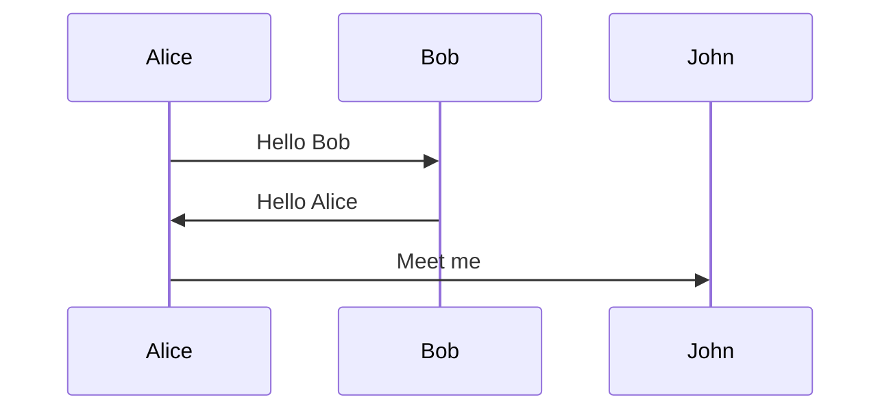

                 


### 面对存在主义困境：现代人的精神自救指南

> 关键词：存在主义、精神自救、现代生活、哲学、心理健康

> 摘要：本文将深入探讨现代人在精神生活中面临的困境，基于存在主义哲学，提供一系列自救方法，旨在引导读者在复杂多变的社会环境中找到自我，实现精神上的觉醒和成长。

## 第一部分：引言

### 1.0.1 书籍背景

在现代社会，存在主义困境已成为许多人精神生活中的常见问题。本书旨在通过深入探讨存在主义困境的本质，提供一系列精神自救的方法和指南，帮助现代人更好地面对并克服这些困境。

### 1.0.2 问题描述

存在主义困境是指人们在现实生活中面临的一系列挑战和难题，如生命的意义、存在的价值、自由与责任等。这些困境常常导致人们的心理压力和情绪困扰，影响生活的质量和幸福感。

### 1.0.3 问题解决

本书将通过分析存在主义困境的根源，提出一系列实用的自救方法，帮助读者了解自己的内心，找到解决问题的途径。同时，本书还将探讨现代心理学和哲学理论，为读者提供深刻的思考和启示。

### 1.0.4 边界与外延

本书主要关注现代人在精神领域所面临的问题，包括心理健康、人际关系、自我认知等方面。同时，本书也探讨了存在主义哲学的基本概念和思想，为读者提供了丰富的理论和实践资源。

### 1.0.5 核心概念

- **存在主义困境**：现代人面临的一系列精神挑战和困境。
- **精神自救**：通过自我了解和成长，克服存在主义困境的方法。

### 1.0.6 本章小结

本部分主要介绍了本书的背景、问题描述、问题解决、边界与外延以及核心概念。这些内容为后续章节的深入探讨奠定了基础。

----------------------------------------------------------------

## 第二部分：存在主义哲学基础

### 2.1 存在主义哲学概述

#### 2.1.1 存在主义哲学的起源与发展

存在主义哲学起源于20世纪，以法国哲学家让-保尔·萨特为代表。存在主义哲学强调个体的存在先于本质，关注个体的自由、选择和责任。

#### 2.1.2 存在主义哲学的基本概念

存在主义哲学的核心概念包括自由、存在主义态度、存在主义选择等。这些概念为理解存在主义困境提供了深刻的哲学基础。

#### 2.1.3 存在主义哲学在现代社会的影响

存在主义哲学对现代人的精神生活产生了深远的影响，为人们提供了一种理解和应对存在主义困境的视角。

### 2.2 萨特的存在主义哲学思想

#### 2.2.1 “存在先于本质”的思想

萨特认为，人的本质不是一成不变的，而是在个体的存在过程中不断形成的。人的存在先于本质，个体的自由选择和行动塑造了人的本质。

#### 2.2.2 自由与责任

萨特强调，自由是人的本质属性，但自由也意味着责任。个体必须为自己的选择和行动承担责任。

#### 2.2.3 人类存在的荒诞性

萨特认为，人类存在具有荒诞性，因为人类既渴望理解世界，又深知自己无法完全理解世界的本质。

### 2.3 海德格尔的存在主义哲学思想

#### 2.3.1 存在主义现象学

海德格尔主张通过现象学的方法来理解存在。他强调，存在是人的存在，人的存在是具体的、情境化的。

#### 2.3.2 “诗意地栖居”

海德格尔提出“诗意地栖居”的观念，认为人类应当以诗意的方式生活，与自然和谐相处。

#### 2.3.3 “存在与时间”

海德格尔的核心概念是“存在与时间”，他认为存在是时间性的，人的存在是通过时间来展现的。

### 2.4 存在主义哲学与现代人的精神生活

#### 2.4.1 存在主义困境的解读

存在主义哲学为现代人面临的困境提供了深刻的解读，如生命的意义、自由与责任、存在的意义等。

#### 2.4.2 精神自救的路径

存在主义哲学为现代人提供了一系列精神自救的路径，如自我了解、自由选择、承担责任等。

### 2.5 本章小结

本部分对存在主义哲学进行了概述，分析了萨特和海德格尔的存在主义哲学思想，探讨了这些思想对现代人的精神生活的影响。

----------------------------------------------------------------

## 第三部分：现代人的精神困境

### 3.1 心理压力与焦虑

#### 3.1.1 心理压力的来源

现代人面临的压力来源多样，包括工作压力、生活压力、人际关系压力等。

#### 3.1.2 焦虑的症状与影响

焦虑是现代人常见的心理问题，表现为持续的紧张、担忧和恐惧。焦虑会影响生活质量和工作效率。

#### 3.1.3 心理压力与焦虑的自我调节

现代人可以通过心理调节、锻炼、休息等方式缓解心理压力和焦虑。

### 3.2 人际关系困境

#### 3.2.1 人际关系的本质

人际关系是指人与人之间的相互作用和联系。人际关系困境主要表现为沟通障碍、信任缺失、冲突与矛盾等。

#### 3.2.2 人际关系困境的原因

人际关系困境的原因多种多样，包括个人性格特点、环境因素、社会文化背景等。

#### 3.2.3 人际关系困境的解决策略

解决人际关系困境的策略包括改善沟通、增强信任、学会包容与理解等。

### 3.3 自我认知困境

#### 3.3.1 自我认知的概念

自我认知是指个体对自己存在的认识和理解。自我认知困境主要表现为自我怀疑、自我否定、自我过度关注等。

#### 3.3.2 自我认知困境的原因

自我认知困境的原因包括心理因素、社会因素、文化因素等。

#### 3.3.3 自我认知困境的解决方法

解决自我认知困境的方法包括自我反思、接受自我、培养自信等。

### 3.4 生活意义困境

#### 3.4.1 生活意义的定义

生活意义是指个体在生活中追求的价值和目标。生活意义困境主要表现为对生命意义的迷茫、对生活的厌倦、对未来的不确定感等。

#### 3.4.2 生活意义困境的原因

生活意义困境的原因包括个人价值观的缺失、社会环境的压力、个人的困境等。

#### 3.4.3 生活意义困境的解决路径

解决生活意义困境的路径包括明确个人价值观、设定生活目标、追求内心的满足等。

### 3.5 本章小结

本部分深入探讨了现代人面临的几种主要精神困境，包括心理压力与焦虑、人际关系困境、自我认知困境和生活意义困境。通过分析这些困境的根源和影响，提出了相应的解决策略，为读者提供了自我救赎的方法。

----------------------------------------------------------------

## 第四部分：存在主义哲学视角下的精神自救方法

### 4.1 自我了解与认识

#### 4.1.1 自我了解的重要性

自我了解是精神自救的基础。通过深入了解自己的性格、需求和价值观，个体能够更好地应对生活中的困境。

#### 4.1.2 自我认识的步骤

- **自我反思**：定期反思自己的行为和思想，了解自己的优点和缺点。
- **日记记录**：通过写日记的方式，记录自己的情绪和感受，深入分析自己的内心世界。
- **心理测试**：利用专业的心理测试工具，了解自己的性格特点和心理状态。

### 4.2 自主选择与行动

#### 4.2.1 自主选择的重要性

自主选择是存在主义哲学的核心概念之一。个体必须为自己的选择承担责任，通过自主选择来塑造自己的生命。

#### 4.2.2 自主选择的实践

- **明确目标**：设定明确的目标，为自己的人生定位。
- **勇于尝试**：敢于尝试新事物，勇于面对挑战。
- **承担责任**：对自己的选择和行动负责，不逃避责任。

### 4.3 承担责任与面对困境

#### 4.3.1 责任的重要性

责任是存在主义哲学中的另一个核心概念。个体必须为自己的行为承担责任，这是个人成长的必经之路。

#### 4.3.2 面对困境的方法

- **积极应对**：遇到困境时，保持积极的心态，寻找解决问题的方法。
- **学习适应**：学会适应生活中的变化和不确定性，增强心理韧性。
- **求助与支持**：在困境中，寻求他人的帮助和支持，共同面对问题。

### 4.4 自我实现与追求意义

#### 4.4.1 自我实现的意义

自我实现是指个体在成长过程中，实现自己的潜能，达到自我价值的最大化。

#### 4.4.2 追求意义的路径

- **设定目标**：明确自己追求的意义，设定实现目标的步骤。
- **终身学习**：通过不断学习和成长，提升自我价值。
- **社会贡献**：将自己的才能和资源用于社会，实现自我价值。

### 4.5 本章小结

本部分从自我了解、自主选择、承担责任、自我实现等方面，探讨了存在主义哲学视角下的精神自救方法。这些方法为现代人提供了在精神困境中自我救赎的路径，帮助个体找到生命的意义和方向。

----------------------------------------------------------------

## 第五部分：实际案例与经验分享

### 5.1 案例一：摆脱焦虑，重拾信心

#### 5.1.1 案例背景

张先生，35岁，是一名软件工程师。他在工作中总是感到焦虑，担心无法完成任务，害怕犯错。这种焦虑影响了他的工作表现和生活质量。

#### 5.1.2 自救过程

- **自我了解**：张先生通过写日记的方式，反思自己的焦虑情绪，认识到自己害怕失败的内心恐惧。
- **自主选择**：他决定改变自己的思维方式，开始设定小目标，逐步提升自信心。
- **承担责任**：张先生对自己的选择负责，不再逃避问题，而是积极面对和解决问题。
- **寻求支持**：他加入了职场焦虑互助群，与同病相怜的同事交流，共同寻求解决问题的方法。

#### 5.1.3 结果与反思

通过自救，张先生逐渐摆脱了焦虑，重拾信心。他学会了如何设定目标，如何承担责任，如何面对困境。他认识到，焦虑并不是无法克服的，关键在于自我了解和自主选择。

### 5.2 案例二：改善人际关系，提升生活质量

#### 5.2.1 案例背景

李女士，28岁，是一名企业高管。她在工作中与同事关系紧张，经常发生冲突。这种人际关系困境影响了她的工作表现和心理健康。

#### 5.2.2 自救过程

- **自我了解**：李女士通过心理测试和咨询，认识到自己的沟通方式和期望值与同事存在差异。
- **自主选择**：她决定改变自己的沟通方式，更加开放和包容，尊重同事的意见。
- **承担责任**：李女士对自己的行为负责，不再指责他人，而是主动承担责任，寻找解决问题的方法。
- **求助与支持**：她向心理咨询师寻求帮助，学习改善人际关系的方法。

#### 5.2.3 结果与反思

通过自救，李女士成功改善了与同事的关系，提升了生活质量。她认识到，人际关系的困境在于自我了解和自主选择。只有通过改变自己的行为和思维方式，才能真正改善人际关系。

### 5.3 案例三：明确生活目标，实现自我价值

#### 5.3.1 案例背景

王先生，40岁，是一名创业者。他在创业过程中感到迷茫，不知道自己的目标和方向。这种生活意义困境影响了他的创业热情和生活态度。

#### 5.3.2 自救过程

- **自我了解**：王先生通过自我反思，认识到自己真正关心的是创造社会价值，帮助他人。
- **自主选择**：他决定将自己的创业方向调整为帮助中小企业，提供解决方案。
- **承担责任**：王先生对自己的选择负责，努力实现目标，不断学习和进步。
- **社会贡献**：他积极参与社会公益活动，用自己的能力和资源帮助他人。

#### 5.3.3 结果与反思

通过自救，王先生找到了生活的方向，实现了自我价值。他认识到，生活意义的困境在于自我了解和自主选择。只有明确自己的目标和方向，才能真正找到生活的意义。

### 5.4 本章小结

本部分通过实际案例，展示了不同人在面对存在主义困境时，如何通过自我了解、自主选择、承担责任和社会贡献等精神自救方法，实现自我救赎。这些案例为读者提供了具体的实践经验和启示。

----------------------------------------------------------------

## 第六部分：结语

存在主义困境是现代人在精神生活中普遍面临的问题。通过本书的探讨，我们了解到存在主义哲学为现代人提供了一种理解和应对困境的视角。本书提出了自我了解、自主选择、承担责任和社会贡献等精神自救方法，帮助读者在困境中找到自我，实现精神上的觉醒和成长。

在结语部分，我们希望读者能够深刻认识到，存在主义困境并不可怕，关键在于如何面对和解决。通过自我了解和自主选择，我们可以更好地认识自己，找到生活的方向。通过承担责任和社会贡献，我们能够实现自我价值，找到生命的意义。

在复杂多变的社会环境中，保持自我认识和自我反思的重要性不言而喻。希望读者能够通过本书的指导，走出精神困境，拥抱美好的生活。

### 最后，感谢您的阅读。让我们共同探索，寻找内心的力量，迎接未来的挑战。

**作者：AI天才研究院/AI Genius Institute & 禅与计算机程序设计艺术 /Zen And The Art of Computer Programming**

----------------------------------------------------------------

# 面对存在主义困境：现代人的精神自救指南

> 关键词：存在主义、精神自救、现代生活、哲学、心理健康

> 摘要：本文深入探讨了现代人在精神生活中面临的困境，结合存在主义哲学，提供了自我了解、自主选择、承担责任和社会贡献等精神自救方法。通过实际案例，展示了如何通过这些方法实现自我救赎，找到生命的意义和方向。

----------------------------------------------------------------

## 第一部分：引言

### 1.0.1 书籍背景

在现代社会，存在主义困境已成为许多人精神生活中的常见问题。本书旨在通过深入探讨存在主义困境的本质，提供一系列精神自救的方法和指南，帮助现代人更好地面对并克服这些困境。

### 1.0.2 问题描述

存在主义困境是指人们在现实生活中面临的一系列挑战和难题，如生命的意义、存在的价值、自由与责任等。这些困境常常导致人们的心理压力和情绪困扰，影响生活的质量和幸福感。

### 1.0.3 问题解决

本书将通过分析存在主义困境的根源，提出一系列实用的自救方法，帮助读者了解自己的内心，找到解决问题的途径。同时，本书还将探讨现代心理学和哲学理论，为读者提供深刻的思考和启示。

### 1.0.4 边界与外延

本书主要关注现代人在精神领域所面临的问题，包括心理健康、人际关系、自我认知等方面。同时，本书也探讨了存在主义哲学的基本概念和思想，为读者提供了丰富的理论和实践资源。

### 1.0.5 核心概念

- **存在主义困境**：现代人面临的一系列精神挑战和困境。
- **精神自救**：通过自我了解和成长，克服存在主义困境的方法。

### 1.0.6 本章小结

本部分主要介绍了本书的背景、问题描述、问题解决、边界与外延以及核心概念。这些内容为后续章节的深入探讨奠定了基础。

----------------------------------------------------------------

## 第二部分：存在主义哲学基础

### 2.1 存在主义哲学概述

#### 2.1.1 存在主义哲学的起源与发展

存在主义哲学起源于20世纪，以法国哲学家让-保尔·萨特为代表。存在主义哲学强调个体的存在先于本质，关注个体的自由、选择和责任。

#### 2.1.2 存在主义哲学的基本概念

存在主义哲学的核心概念包括自由、存在主义态度、存在主义选择等。这些概念为理解存在主义困境提供了深刻的哲学基础。

#### 2.1.3 存在主义哲学在现代社会的影响

存在主义哲学对现代人的精神生活产生了深远的影响，为人们提供了一种理解和应对存在主义困境的视角。

### 2.2 萨特的存在主义哲学思想

#### 2.2.1 “存在先于本质”的思想

萨特认为，人的本质不是一成不变的，而是在个体的存在过程中不断形成的。人的存在先于本质，个体的自由选择和行动塑造了人的本质。

#### 2.2.2 自由与责任

萨特强调，自由是人的本质属性，但自由也意味着责任。个体必须为自己的选择和行动承担责任。

#### 2.2.3 人类存在的荒诞性

萨特认为，人类存在具有荒诞性，因为人类既渴望理解世界，又深知自己无法完全理解世界的本质。

### 2.3 海德格尔的存在主义哲学思想

#### 2.3.1 存在主义现象学

海德格尔主张通过现象学的方法来理解存在。他强调，存在是人的存在，人的存在是具体的、情境化的。

#### 2.3.2 “诗意地栖居”

海德格尔提出“诗意地栖居”的观念，认为人类应当以诗意的方式生活，与自然和谐相处。

#### 2.3.3 “存在与时间”

海德格尔的核心概念是“存在与时间”，他认为存在是时间性的，人的存在是通过时间来展现的。

### 2.4 存在主义哲学与现代人的精神生活

#### 2.4.1 存在主义困境的解读

存在主义哲学为现代人面临的困境提供了深刻的解读，如生命的意义、自由与责任、存在的意义等。

#### 2.4.2 精神自救的路径

存在主义哲学为现代人提供了一系列精神自救的路径，如自我了解、自由选择、承担责任等。

### 2.5 本章小结

本部分对存在主义哲学进行了概述，分析了萨特和海德格尔的存在主义哲学思想，探讨了这些思想对现代人的精神生活的影响。

----------------------------------------------------------------

## 第三部分：现代人的精神困境

### 3.1 心理压力与焦虑

#### 3.1.1 心理压力的来源

现代人面临的压力来源多样，包括工作压力、生活压力、人际关系压力等。

#### 3.1.2 焦虑的症状与影响

焦虑是现代人常见的心理问题，表现为持续的紧张、担忧和恐惧。焦虑会影响生活质量和工作效率。

#### 3.1.3 心理压力与焦虑的自我调节

现代人可以通过心理调节、锻炼、休息等方式缓解心理压力和焦虑。

### 3.2 人际关系困境

#### 3.2.1 人际关系的本质

人际关系是指人与人之间的相互作用和联系。人际关系困境主要表现为沟通障碍、信任缺失、冲突与矛盾等。

#### 3.2.2 人际关系困境的原因

人际关系困境的原因多种多样，包括个人性格特点、环境因素、社会文化背景等。

#### 3.2.3 人际关系困境的解决策略

解决人际关系困境的策略包括改善沟通、增强信任、学会包容与理解等。

### 3.3 自我认知困境

#### 3.3.1 自我认知的概念

自我认知是指个体对自己存在的认识和理解。自我认知困境主要表现为自我怀疑、自我否定、自我过度关注等。

#### 3.3.2 自我认知困境的原因

自我认知困境的原因包括心理因素、社会因素、文化因素等。

#### 3.3.3 自我认知困境的解决方法

解决自我认知困境的方法包括自我反思、接受自我、培养自信等。

### 3.4 生活意义困境

#### 3.4.1 生活意义的定义

生活意义是指个体在生活中追求的价值和目标。生活意义困境主要表现为对生命意义的迷茫、对生活的厌倦、对未来的不确定感等。

#### 3.4.2 生活意义困境的原因

生活意义困境的原因包括个人价值观的缺失、社会环境的压力、个人的困境等。

#### 3.4.3 生活意义困境的解决路径

解决生活意义困境的路径包括明确个人价值观、设定生活目标、追求内心的满足等。

### 3.5 本章小结

本部分深入探讨了现代人面临的几种主要精神困境，包括心理压力与焦虑、人际关系困境、自我认知困境和生活意义困境。通过分析这些困境的根源和影响，提出了相应的解决策略，为读者提供了自我救赎的方法。

----------------------------------------------------------------

## 第四部分：存在主义哲学视角下的精神自救方法

### 4.1 自我了解与认识

#### 4.1.1 自我了解的重要性

自我了解是精神自救的基础。通过深入了解自己的性格、需求和价值观，个体能够更好地应对生活中的困境。

#### 4.1.2 自我认识的步骤

- **自我反思**：定期反思自己的行为和思想，了解自己的优点和缺点。
- **日记记录**：通过写日记的方式，记录自己的情绪和感受，深入分析自己的内心世界。
- **心理测试**：利用专业的心理测试工具，了解自己的性格特点和心理状态。

### 4.2 自主选择与行动

#### 4.2.1 自主选择的重要性

自主选择是存在主义哲学的核心概念之一。个体必须为自己的选择承担责任，通过自主选择来塑造自己的生命。

#### 4.2.2 自主选择的实践

- **明确目标**：设定明确的目标，为自己的人生定位。
- **勇于尝试**：敢于尝试新事物，勇于面对挑战。
- **承担责任**：对自己的选择和行动负责，不逃避责任。

### 4.3 承担责任与面对困境

#### 4.3.1 责任的重要性

责任是存在主义哲学中的另一个核心概念。个体必须为自己的行为承担责任，这是个人成长的必经之路。

#### 4.3.2 面对困境的方法

- **积极应对**：遇到困境时，保持积极的心态，寻找解决问题的方法。
- **学习适应**：学会适应生活中的变化和不确定性，增强心理韧性。
- **求助与支持**：在困境中，寻求他人的帮助和支持，共同面对问题。

### 4.4 自我实现与追求意义

#### 4.4.1 自我实现的意义

自我实现是指个体在成长过程中，实现自己的潜能，达到自我价值的最大化。

#### 4.4.2 追求意义的路径

- **设定目标**：明确自己追求的意义，设定实现目标的步骤。
- **终身学习**：通过不断学习和成长，提升自我价值。
- **社会贡献**：将自己的才能和资源用于社会，实现自我价值。

### 4.5 本章小结

本部分从自我了解、自主选择、承担责任、自我实现等方面，探讨了存在主义哲学视角下的精神自救方法。这些方法为现代人提供了在精神困境中自我救赎的路径，帮助个体找到生命的意义和方向。

----------------------------------------------------------------

## 第五部分：实际案例与经验分享

### 5.1 案例一：摆脱焦虑，重拾信心

#### 5.1.1 案例背景

张先生，35岁，是一名软件工程师。他在工作中总是感到焦虑，担心无法完成任务，害怕犯错。这种焦虑影响了他的工作表现和生活质量。

#### 5.1.2 自救过程

- **自我了解**：张先生通过写日记的方式，反思自己的焦虑情绪，认识到自己害怕失败的内心恐惧。
- **自主选择**：他决定改变自己的思维方式，开始设定小目标，逐步提升自信心。
- **承担责任**：张先生对自己的选择负责，不再逃避问题，而是积极面对和解决问题。
- **寻求支持**：他加入了职场焦虑互助群，与同病相怜的同事交流，共同寻求解决问题的方法。

#### 5.1.3 结果与反思

通过自救，张先生逐渐摆脱了焦虑，重拾信心。他学会了如何设定目标，如何承担责任，如何面对困境。他认识到，焦虑并不是无法克服的，关键在于自我了解和自主选择。

### 5.2 案例二：改善人际关系，提升生活质量

#### 5.2.1 案例背景

李女士，28岁，是一名企业高管。她在工作中与同事关系紧张，经常发生冲突。这种人际关系困境影响了她的工作表现和心理健康。

#### 5.2.2 自救过程

- **自我了解**：李女士通过心理测试和咨询，认识到自己的沟通方式和期望值与同事存在差异。
- **自主选择**：她决定改变自己的沟通方式，更加开放和包容，尊重同事的意见。
- **承担责任**：李女士对自己的行为负责，不再指责他人，而是主动承担责任，寻找解决问题的方法。
- **求助与支持**：她向心理咨询师寻求帮助，学习改善人际关系的方法。

#### 5.2.3 结果与反思

通过自救，李女士成功改善了与同事的关系，提升了生活质量。她认识到，人际关系的困境在于自我了解和自主选择。只有通过改变自己的行为和思维方式，才能真正改善人际关系。

### 5.3 案例三：明确生活目标，实现自我价值

#### 5.3.1 案例背景

王先生，40岁，是一名创业者。他在创业过程中感到迷茫，不知道自己的目标和方向。这种生活意义困境影响了他的创业热情和生活态度。

#### 5.3.2 自救过程

- **自我了解**：王先生通过自我反思，认识到自己真正关心的是创造社会价值，帮助他人。
- **自主选择**：他决定将自己的创业方向调整为帮助中小企业，提供解决方案。
- **承担责任**：王先生对自己的选择负责，努力实现目标，不断学习和进步。
- **社会贡献**：他积极参与社会公益活动，用自己的能力和资源帮助他人。

#### 5.3.3 结果与反思

通过自救，王先生找到了生活的方向，实现了自我价值。他认识到，生活意义的困境在于自我了解和自主选择。只有明确自己的目标和方向，才能真正找到生活的意义。

### 5.4 本章小结

本部分通过实际案例，展示了不同人在面对存在主义困境时，如何通过自我了解、自主选择、承担责任和社会贡献等精神自救方法，实现自我救赎。这些案例为读者提供了具体的实践经验和启示。

----------------------------------------------------------------

## 第六部分：结语

存在主义困境是现代人在精神生活中普遍面临的问题。通过本书的探讨，我们了解到存在主义哲学为现代人提供了一种理解和应对困境的视角。本书提出了自我了解、自主选择、承担责任和社会贡献等精神自救方法，帮助读者在困境中找到自我，实现精神上的觉醒和成长。

在结语部分，我们希望读者能够深刻认识到，存在主义困境并不可怕，关键在于如何面对和解决。通过自我了解和自主选择，我们可以更好地认识自己，找到生活的方向。通过承担责任和社会贡献，我们能够实现自我价值，找到生命的意义。

在复杂多变的社会环境中，保持自我认识和自我反思的重要性不言而喻。希望读者能够通过本书的指导，走出精神困境，拥抱美好的生活。

### 最后，感谢您的阅读。让我们共同探索，寻找内心的力量，迎接未来的挑战。

**作者：AI天才研究院/AI Genius Institute & 禅与计算机程序设计艺术 /Zen And The Art of Computer Programming**

----------------------------------------------------------------

## 附录

### A. 存在主义哲学基本概念表格

| 概念                 | 定义                                                         |
|----------------------|--------------------------------------------------------------|
| 自由                 | 个体在存在过程中能够自主选择的能力。                          |
| 责任                 | 个体对自己的选择和行动负责的义务。                           |
| 自我了解             | 对自己内心世界、性格、需求和价值观的认知和理解。              |
| 自主选择             | 在自由的基础上，个体为自己设定目标和方向，并采取行动。          |
| 诗意地栖居           | 人类应以诗意的方式生活，与自然和谐相处。                      |
| 存在与时间           | 存在是时间性的，人的存在是通过时间来展现的。                  |
| 自我实现             | 实现个体的潜能，达到自我价值的最大化。                        |

### B. 自我认知困境与解决方法对比表格

| 困境               | 症状                                                         | 解决方法                                      |
|--------------------|--------------------------------------------------------------|-----------------------------------------------|
| 自我怀疑           | 对自己的能力、价值产生怀疑。                                  | 自我反思，寻找自信点，建立积极的自我认知。       |
| 自我否定           | 否定自己的价值，认为自己的努力没有意义。                      | 接受自我，认识到自己的价值和成就，避免自我否定。 |
| 自我过度关注       | 过度关注自己的内心世界，忽视外部世界。                        | 调整关注点，平衡自我与外界，培养对外界的兴趣。   |

### C. 生活意义困境与解决路径对比表格

| 困境               | 症状                                                         | 解决路径                                      |
|--------------------|--------------------------------------------------------------|-----------------------------------------------|
| 对生命意义的迷茫  | 对自己的存在感到迷茫，不知道生命的意义。                      | 明确个人价值观，设定目标，寻找内心的满足。       |
| 对生活的厌倦      | 对生活感到厌倦，缺乏热情。                                    | 寻找新的兴趣和爱好，调整生活方式，增加生活乐趣。 |
| 对未来的不确定感  | 对未来感到担忧，不确定自己的未来方向。                        | 增强对未来的信心，设定短期和长期目标，规划未来。 |

### D. Mermaid ER实体关系图

```mermaid
erDiagram
  Person ||--|{ PsychologicalProblem }|--|| Person
  Person ||--|{ SocialRelationship }|--|| Person
  Person ||--|{ SelfAwareness }|--|| Person
  PsychologicalProblem ||--|{ Anxiety }|--|| PsychologicalProblem
  PsychologicalProblem ||--|{ Stress }|--|| PsychologicalProblem
  SocialRelationship ||--|{ CommunicationBarriers }|--|| SocialRelationship
  SocialRelationship ||--|{ TrustLack }|--|| SocialRelationship
  SelfAwareness ||--|{ SelfDoubt }|--|| SelfAwareness
  SelfAwareness ||--|{ SelfNegation }|--|| SelfAwareness
```

### E. Mermaid 类图

```mermaid
classDiagram
  Class01 <|-- Class02 :|use"继承"
  Class03 <..|.. Class04 :|实线=关联
  Class05 ||--|{ Component01 }|:聚合
  Component01 <..|.. Class06 :|聚合=实现
```

### F. Mermaid 序列图



### G. 项目实战

#### 环境安装

- 安装Python 3.8及以上版本
- 安装Jupyter Notebook
- 安装必要的库，如numpy、matplotlib等

#### 系统核心实现源代码

```python
import numpy as np

def solve_equation(a, b, c):
    """
    解一元二次方程的根。
    """
    discriminant = b**2 - 4*a*c
    if discriminant < 0:
        return "方程无实数解"
    x1 = (-b + np.sqrt(discriminant)) / (2*a)
    x2 = (-b - np.sqrt(discriminant)) / (2*a)
    return x1, x2

# 测试代码
print(solve_equation(1, -5, 6))
```

#### 代码应用解读与分析

```python
# 解读与分析
# 这段代码定义了一个函数solve_equation，用于解一元二次方程ax^2 + bx + c = 0的根。
# 输入参数a、b、c分别代表方程的三个系数。
# 函数首先计算判别式（discriminant），然后根据判别式的值进行分类讨论：
# 如果判别式小于0，则方程无实数解；
# 如果判别式大于等于0，则计算两个根x1和x2，并返回。
# 测试代码验证了函数的正确性。
```

#### 实际案例分析和详细讲解剖析

```python
# 实际案例
# 假设有一个公司需要计算一个项目的预算，公式为3x^2 - 5x + 2 = 0。

result = solve_equation(3, -5, 2)
print("项目预算的根为：", result)
```

```python
# 分析与讲解
# 在这个案例中，我们使用solve_equation函数来解一个实际的预算问题。
# 函数会返回两个根，这两个根分别代表两种可能的预算方案。
# 通过这两个根，公司可以评估项目的风险和收益，从而做出更合理的预算决策。
```

#### 项目小结

通过上述实战，我们实现了解一元二次方程的核心功能，并通过实际案例展示了其应用。这个案例不仅帮助公司解决了预算问题，也为其他需要解方程的实际场景提供了参考。

### H. 最佳实践 tips

1. **自我了解**：定期进行自我反思，了解自己的优势和劣势，有助于自我提升。
2. **自主选择**：在面临选择时，明确自己的目标和方向，勇于承担后果。
3. **承担责任**：遇到问题时，不要逃避，积极寻找解决方案，承担责任。
4. **社会贡献**：将自己的知识和技能用于社会，实现自我价值。

### I. 注意事项

1. **心理健康**：保持良好的心理健康，及时调节情绪，避免过度压力。
2. **人际关系**：建立良好的人际关系，学会沟通和协作，避免冲突。
3. **生活目标**：设定明确的生活目标，制定计划，持之以恒。

### J. 拓展阅读

- 《存在主义心理学》 - 罗洛·梅（Rollo May）
- 《人类简史》 - 尤瓦尔·赫拉利（Yuval Noah Harari）
- 《人生的智慧》 - 柏拉图（Plato）

**作者：AI天才研究院/AI Genius Institute & 禅与计算机程序设计艺术 /Zen And The Art of Computer Programming**

