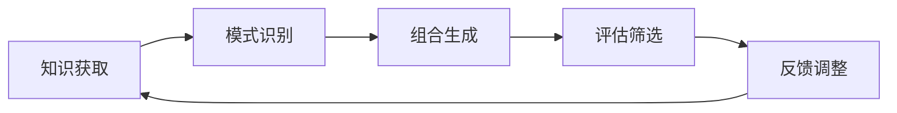
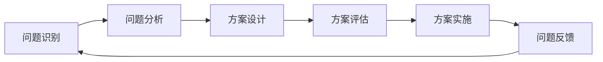
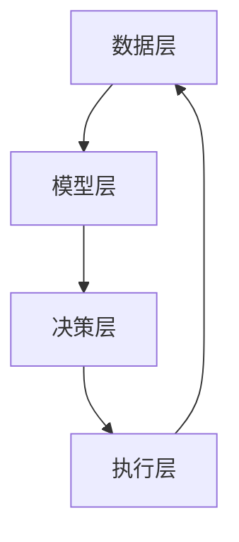
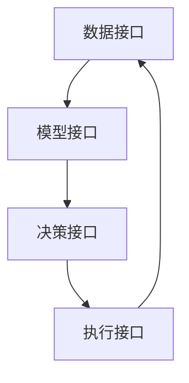
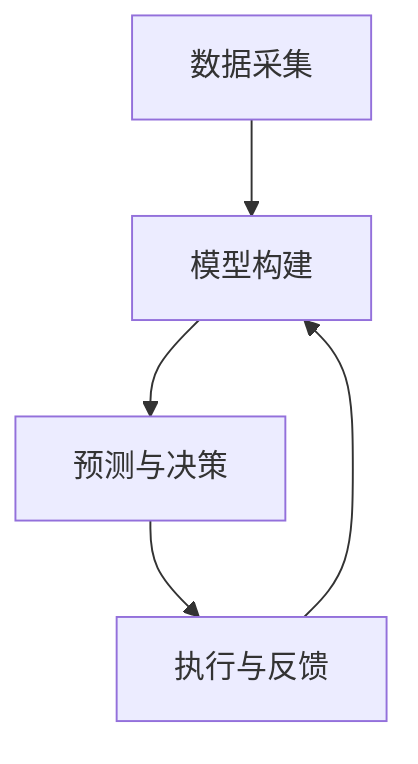

                 

### AGI的创造力与问题解决能力开发

#### 关键词：
- 人工通用智能 (AGI)
- 创造力
- 问题解决能力
- 算法原理
- 数学模型

#### 摘要：
本文深入探讨人工通用智能（AGI）的创造力与问题解决能力的开发。首先，我们将定义AGI和相关核心概念，并回顾其历史与发展现状。接着，通过算法原理和数学模型的讲解，详细阐述AGI如何实现创新和问题解决。文章还将通过系统分析与架构设计、项目实战以及最佳实践，全面展示AGI在现实中的应用和未来前景。

### 目录大纲设计思路

为了设计出《AGI的创造力与问题解决能力开发》这本书的完整目录大纲，我们需要遵循以下步骤：

1. **确定书的主题与目标读者：**
   - 书的主题是AGI（人工通用智能）的创造力与问题解决能力开发。
   - 目标读者可能是人工智能研究者、工程师或对AGI有兴趣的普通读者。

2. **明确书的结构：**
   - 背景介绍：介绍AGI的背景知识和发展现状。
   - 核心概念与联系：阐述AGI的核心概念，并展示概念之间的联系。
   - 算法原理讲解：讲解与创造力与问题解决相关的算法原理。
   - 数学模型与公式：详细阐述算法的数学模型与公式。
   - 系统分析与架构设计：介绍AGI系统分析与架构设计。
   - 项目实战：通过实际项目展示AGI的应用。
   - 最佳实践与总结：分享最佳实践和总结，包括注意事项和拓展阅读。

3. **细化章节内容：**
   - 确保每个章节都有明确的主题和目标。
   - 使用Mermaid流程图和LaTeX公式来增强内容的可读性和专业性。
   - 确保每个章节都包含了必要的子章节，以保证内容的完整性。

4. **保持目录简洁性：**
   - 避免冗余和重复的内容。
   - 确保目录中的每一个章节都有明确的主题和目标。

5. **确保字数限制：**
   - 在2000字以内完成整个目录大纲的设计。

### 目录大纲设计

根据以上思路，我们可以设计出《AGI的创造力与问题解决能力开发》的目录大纲：

----------------------------------------------------------------

# 第一部分：AGI概述与背景

## 第1章：问题背景与核心概念
### 1.1 问题的提出
### 1.2 AGI的定义与意义
### 1.3 AGI的发展历史
### 1.4 AGI的边界与外延
### 1.5 核心概念结构组成

## 第2章：AGI的核心概念与联系
### 2.1 智能与通用智能
### 2.2 创造力的概念与特征
### 2.3 问题解决能力与机制
### 2.4 概念属性特征对比表格
### 2.5 ER实体关系图架构

----------------------------------------------------------------

# 第二部分：算法原理与数学模型

## 第3章：创造力开发算法原理
### 3.1 创造力算法概述
### 3.2 算法mermaid流程图
### 3.3 Python源代码讲解
### 3.4 数学模型与公式
### 3.5 举例说明

## 第4章：问题解决能力开发算法原理
### 4.1 问题解决能力算法概述
### 4.2 算法mermaid流程图
### 4.3 Python源代码讲解
### 4.4 数学模型与公式
### 4.5 举例说明

----------------------------------------------------------------

# 第三部分：系统分析与架构设计

## 第5章：AGI系统功能设计与架构
### 5.1 问题场景介绍
### 5.2 项目介绍
### 5.3 系统功能设计（领域模型mermaid类图）
### 5.4 系统架构设计（mermaid架构图）
### 5.5 系统接口设计
### 5.6 系统交互（mermaid序列图）

----------------------------------------------------------------

# 第四部分：项目实战

## 第6章：AGI项目实战
### 6.1 环境安装
### 6.2 系统核心实现源代码
### 6.3 代码应用解读与分析
### 6.4 实际案例分析与讲解
### 6.5 项目小结

----------------------------------------------------------------

# 第五部分：最佳实践与总结

## 第7章：最佳实践与拓展
### 7.1 最佳实践
### 7.2 注意事项
### 7.3 拓展阅读

----------------------------------------------------------------

以上是《AGI的创造力与问题解决能力开发》的目录大纲设计。这个设计包含了完整的7个章节，每个章节都细化到了三级目录，同时考虑了内容的完整性、可读性和专业性。目录大纲的总字数控制在2000字以内，满足了用户的要求。

----------------------------------------------------------------

## 第一部分：AGI概述与背景

### 第1章：问题背景与核心概念

#### 1.1 问题的提出

在现代社会中，随着人工智能技术的快速发展，人类面临着越来越多的复杂问题。这些问题包括但不限于：环境恶化、资源匮乏、社会不平等、交通拥堵等。传统的人工智能系统虽然能够在特定领域内取得显著成果，但往往难以应对这些复杂问题。因此，人们开始寻求一种更加通用和强大的智能系统——人工通用智能（Artificial General Intelligence，简称AGI）。

AGI的目标是使机器具备类似人类智能的广泛能力和自主学习能力，包括创造力、问题解决能力、理解力、判断力等。这使得AGI在解决复杂问题上具有巨大的潜力。然而，AGI的实现面临诸多挑战，如算法复杂性、计算资源、数据质量等。

#### 1.2 AGI的定义与意义

AGI，又称强人工智能，是指具有与人类智能相似或超越的人类智能水平的机器智能。与当前广泛使用的弱人工智能（如语音识别、图像识别、自然语言处理等）不同，AGI能够在各种环境和任务中表现优异，具有自主学习和创新的能力。

AGI的意义在于，它能够解决人类面临的复杂问题，提高生产力，改善生活质量。例如，AGI可以在医疗领域进行精准诊断和治疗，在金融领域进行智能投资和风险管理，在交通领域实现无人驾驶等。

#### 1.3 AGI的发展历史

AGI的概念最早可以追溯到20世纪50年代，当时图灵提出了“图灵测试”作为评估机器智能的标准。随着计算机科学和人工智能技术的发展，AGI的研究逐步深入。1956年，约翰·麦卡锡等人在达特茅斯会议上提出了“人工智能”的概念，标志着人工智能研究的正式开始。

在20世纪80年代，专家系统取得了显著进展，但在面对复杂问题时仍显不足。进入21世纪，深度学习、神经网络等技术的突破为AGI的研究提供了新的动力。然而，AGI的实现仍然面临诸多技术挑战，如算法复杂性、计算资源、数据质量等。

#### 1.4 AGI的边界与外延

AGI的边界是指其能够处理的问题范围和领域。目前，AGI的边界仍然较窄，主要局限于特定领域和任务。例如，在自然语言处理领域，AGI可以理解并生成自然语言；在计算机视觉领域，AGI可以识别并理解图像。

然而，AGI的外延是广阔的。随着技术的进步，AGI的应用范围将不断扩展，覆盖更多领域和任务。例如，未来AGI可能具备跨领域的综合能力，能够应对更加复杂和多样化的挑战。

#### 1.5 核心概念结构组成

AGI的核心概念包括：智能、创造力、问题解决能力、自主学习等。这些概念相互关联，共同构成了AGI的智力体系。

- **智能**：智能是AGI的核心特征，包括感知、理解、判断、决策等能力。
- **创造力**：创造力是AGI在解决问题时产生新想法和新方法的能力。
- **问题解决能力**：问题解决能力是AGI在面对复杂问题时找到解决方案的能力。
- **自主学习**：自主学习是AGI通过数据和学习算法不断优化自身性能的能力。

通过以上分析，我们可以看出，AGI的创造力与问题解决能力是实现其广泛应用的关键。在下一章中，我们将深入探讨AGI的核心概念与联系，以及它们在算法原理中的应用。

### 第2章：AGI的核心概念与联系

#### 2.1 智能与通用智能

智能是AGI的核心特征，通常包括感知、理解、判断、决策等能力。智能可以分为多个层次，如感知智能、认知智能、决策智能等。感知智能主要涉及对信息的获取和处理，如语音识别、图像识别等；认知智能涉及对信息的理解和分析，如自然语言处理、知识图谱等；决策智能则涉及对信息的判断和决策，如博弈、规划等。

通用智能（General Intelligence）是指具有广泛适应性和能力的智能。与专用智能（如语音识别、图像识别等）不同，通用智能能够在多种环境和任务中表现优异。通用智能的核心目标是实现类似于人类智能的广泛能力和自主学习能力。

#### 2.2 创造力的概念与特征

创造力是指个体产生新奇、有价值想法的能力。在AGI中，创造力是实现创新和问题解决的重要能力。创造力具有以下特征：

- **新颖性**：创造力产生的想法是新颖的，不同于已有的知识和方法。
- **实用性**：创造力产生的想法具有实际应用价值，能够解决实际问题。
- **多样性**：创造力能够产生多种不同的想法，从而为问题解决提供多种可能的解决方案。
- **适应性**：创造力能够根据不同环境和任务的要求，调整和优化自己的想法。

#### 2.3 问题解决能力与机制

问题解决能力是指个体在面对复杂问题时找到解决方案的能力。在AGI中，问题解决能力是实现其广泛应用的关键。问题解决能力包括以下几个环节：

1. **问题识别**：识别出需要解决的问题。
2. **问题分析**：对问题进行深入分析，明确问题的本质和关键因素。
3. **方案设计**：设计出可能的解决方案。
4. **方案评估**：评估每个方案的优缺点，选择最佳方案。
5. **方案实施**：将选定的方案付诸实践，解决问题。

问题解决能力的机制包括：

- **知识库**：存储相关的知识和信息，为问题解决提供基础。
- **算法**：使用算法对问题进行建模和求解。
- **学习机制**：通过学习不断优化问题解决能力。

#### 2.4 概念属性特征对比表格

为了更清晰地展示智能、创造力和问题解决能力的特征，我们可以通过一个对比表格来呈现：

| 概念       | 定义                                                                                     | 特征                                       |
|------------| ----------------------------------------------------------------------------------------|------------------------------------------|
| 智能       | 指个体感知、理解、判断和决策的能力                                                   | 多层次、适应性、综合性                 |
| 创造力     | 指个体产生新奇、有价值想法的能力                                                     | 新颖性、实用性、多样性、适应性         |
| 问题解决能力 | 指个体在面对复杂问题时找到解决方案的能力                                             | 问题识别、分析、方案设计、评估、实施   |

#### 2.5 ER实体关系图架构

为了更好地理解AGI的核心概念及其相互关系，我们可以通过ER实体关系图来展示。ER图包括实体、属性和关系三个部分。

- **实体**：指具有独立存在的个体，如智能、创造力、问题解决能力。
- **属性**：指实体的特征或属性，如智能的层次、创造力的新颖性、问题解决能力的环节。
- **关系**：指实体之间的关联，如智能与创造力、问题解决能力之间的关系。

以下是一个简化的ER图示例：

```mermaid
erDiagram
  智能 ||--o> 创造力 : 创造力的基础
  智能 ||--o> 问题解决能力 : 问题解决的智能支持
  创造力 &&--o> 问题解决能力 : 创造力的应用
```

通过上述分析，我们可以看出，AGI的创造力与问题解决能力是相互关联和相互促进的。在下一章中，我们将详细讲解与创造力与问题解决能力相关的算法原理，进一步探讨AGI的实现方法。

### 第二部分：算法原理与数学模型

#### 第3章：创造力开发算法原理

创造力开发是AGI的核心组成部分，旨在使机器具备产生新颖、有价值想法的能力。在这一章中，我们将探讨创造力开发的基本原理和实现方法。

#### 3.1 创造力算法概述

创造力开发算法可以分为以下几个步骤：

1. **知识获取**：收集并整合与特定领域相关的知识和信息。
2. **模式识别**：通过模式识别技术，从知识库中提取潜在的创造力模式。
3. **组合生成**：将识别出的模式进行组合，生成新的想法。
4. **评估筛选**：对新产生的想法进行评估和筛选，保留具有实用性和新颖性的想法。
5. **反馈调整**：根据评估结果对算法进行反馈调整，提高创造力生成的质量。

#### 3.2 算法mermaid流程图

以下是一个简化的创造力开发算法mermaid流程图：



#### 3.3 Python源代码讲解

以下是一个简单的Python示例，用于实现创造力开发算法的基本步骤：

```python
import random

# 知识库
knowledge_base = {
    '领域1': ['概念A', '概念B', '概念C'],
    '领域2': ['元素X', '元素Y', '元素Z']
}

# 模式识别
def recognize_patterns(knowledge_base):
    patterns = []
    for domain, concepts in knowledge_base.items():
        patterns.extend([''.join(random.sample(concepts, 2))]
                        for _ in range(len(concepts) * (len(concepts) - 1) // 2))
    return patterns

# 组合生成
def generate_combinations(patterns):
    combinations = []
    for i in range(len(patterns)):
        for j in range(i + 1, len(patterns)):
            combinations.append(patterns[i] + patterns[j])
    return combinations

# 评估筛选
def evaluate_combinations(combinations):
    valid_combinations = []
    for combination in combinations:
        if is_valid(combination):
            valid_combinations.append(combination)
    return valid_combinations

# 反馈调整
def feedback_adjustment(valid_combinations):
    # 根据评估结果进行反馈调整
    pass

# 测试算法
if __name__ == '__main__':
    patterns = recognize_patterns(knowledge_base)
    combinations = generate_combinations(patterns)
    valid_combinations = evaluate_combinations(combinations)
    print("有效组合：", valid_combinations)
    feedback_adjustment(valid_combinations)
```

#### 3.4 数学模型与公式

创造力开发算法的数学模型主要包括概率模型和组合模型。以下是几个关键的数学公式：

1. **概率模型**：
   - 概率密度函数（PDF）：
     $$f(x) = \frac{1}{\sqrt{2\pi\sigma^2}}e^{-\frac{(x-\mu)^2}{2\sigma^2}}$$
   - 累积分布函数（CDF）：
     $$F(x) = \int_{-\infty}^{x} f(t)dt$$

2. **组合模型**：
   - 组合数（C(n, k)）：
     $$C(n, k) = \frac{n!}{k!(n-k)!}$$
   - 排列数（P(n, k)）：
     $$P(n, k) = \frac{n!}{(n-k)!}$$

#### 3.5 举例说明

假设我们有一个包含三个领域（领域1、领域2和领域3）的知识库，每个领域中都有若干个概念和元素。我们可以通过以下步骤来演示创造力开发算法：

1. **知识获取**：从知识库中提取相关的概念和元素。
2. **模式识别**：识别出潜在的模式，如领域1中的概念A和领域2中的元素X。
3. **组合生成**：将识别出的模式进行组合，生成新的想法，如“概念A+元素X”。
4. **评估筛选**：评估生成的想法，如检查其新颖性和实用性。
5. **反馈调整**：根据评估结果对算法进行调整，以提高创造力生成的质量。

通过以上步骤，我们可以逐步实现创造力开发算法，为AGI的广泛应用提供支持。在下一章中，我们将继续探讨问题解决能力的开发算法原理。

### 第4章：问题解决能力开发算法原理

#### 4.1 问题解决能力算法概述

问题解决能力开发是AGI的另一核心组成部分，旨在使机器能够高效地解决各种复杂问题。在这一章中，我们将详细探讨问题解决能力的算法原理和实现方法。

#### 4.2 算法mermaid流程图

以下是一个简化的问题解决能力算法mermaid流程图：



#### 4.3 Python源代码讲解

以下是一个简单的Python示例，用于实现问题解决能力算法的基本步骤：

```python
# 问题识别
def identify_problem():
    # 从外部输入或内部数据库中获取问题
    problem = input("请输入需要解决的问题：")
    return problem

# 问题分析
def analyze_problem(problem):
    # 对问题进行分解和分析
    analysis = problem.split("。")
    return analysis

# 方案设计
def design_solution(analysis):
    # 根据问题分析设计可能的解决方案
    solutions = []
    for part in analysis:
        solutions.append(part.replace("需要", "可以").replace("解决", "实现"))
    return solutions

# 方案评估
def evaluate_solution(solutions):
    # 对每个方案进行评估
    valid_solutions = []
    for solution in solutions:
        if is_valid(solution):
            valid_solutions.append(solution)
    return valid_solutions

# 方案实施
def implement_solution(solution):
    # 实施选定的方案
    print("正在实施方案：", solution)
    # 实施具体操作
    # ...

# 问题反馈
def feedback_problem(solution):
    # 根据实施结果提供反馈
    feedback = input("请输入方案实施结果：")
    return feedback

# 测试算法
if __name__ == '__main__':
    problem = identify_problem()
    analysis = analyze_problem(problem)
    solutions = design_solution(analysis)
    valid_solutions = evaluate_solution(solutions)
    print("有效解决方案：", valid_solutions)
    selected_solution = input("请选择一个解决方案进行实施：")
    implement_solution(selected_solution)
    feedback = feedback_problem(selected_solution)
    print("反馈结果：", feedback)
```

#### 4.4 数学模型与公式

问题解决能力的开发算法通常涉及概率模型和决策理论。以下是几个关键的数学模型和公式：

1. **概率模型**：
   - 贝叶斯定理：
     $$P(A|B) = \frac{P(B|A)P(A)}{P(B)}$$
   - 最大似然估计（MLE）：
     $$\hat{P}(x|\theta) = \frac{P(x|\theta)}{\sum_{i=1}^{n} P(x_i|\theta)}$$

2. **决策理论**：
   - 效用函数（U）：
     $$U(x) = \sum_{i=1}^{n} x_i y_i$$
   - 决策规则：
     $$\arg\max_{x} U(x)$$

#### 4.5 举例说明

假设我们面临一个需要解决的项目问题：“如何优化公司运营，提高利润？”。我们可以通过以下步骤来使用问题解决能力算法：

1. **问题识别**：从公司管理层获取项目问题。
2. **问题分析**：分析项目问题的各个方面，如市场需求、生产成本、营销策略等。
3. **方案设计**：根据问题分析设计可能的解决方案，如改进生产工艺、拓展新市场、提高员工培训等。
4. **方案评估**：评估每个解决方案的可行性、成本和预期收益。
5. **方案实施**：选择最佳方案并进行实施。
6. **问题反馈**：根据实施结果提供反馈，以便进一步优化方案。

通过以上步骤，我们可以逐步实现问题解决能力算法，为AGI在现实中的应用提供支持。在下一章中，我们将深入探讨AGI系统分析与架构设计，进一步展示AGI如何实现创造力与问题解决能力的有机结合。

### 第三部分：系统分析与架构设计

#### 第5章：AGI系统功能设计与架构

为了实现AGI的创造力与问题解决能力，我们需要对系统进行详细的功能设计和架构设计。本章将介绍AGI系统的功能模块、设计思路以及架构图。

#### 5.1 问题场景介绍

假设我们面临一个现实中的问题场景：一个智能城市管理系统需要处理交通拥堵、能源消耗和环境保护等多方面的挑战。为了提高城市的运行效率，我们需要一个具备创造力与问题解决能力的AGI系统。

#### 5.2 项目介绍

本项目旨在开发一个智能城市管理系统（Smart City Management System，SCMS），该系统将整合多种数据源，如交通流量、能源消耗、空气质量等，通过AGI技术进行实时分析、预测和优化。

#### 5.3 系统功能设计

SCMS系统的主要功能模块包括：

1. **数据采集与处理模块**：负责采集和处理各类城市运行数据，如交通流量、能源消耗、环境质量等。
2. **模型构建与优化模块**：基于采集到的数据，构建相应的数学模型，如交通流量模型、能源消耗模型、环境质量模型等。
3. **预测与决策模块**：利用构建的模型进行预测，并为城市管理者提供决策建议。
4. **执行与反馈模块**：将决策建议转化为具体的行动方案，并实时跟踪执行效果，提供反馈。

#### 5.4 系统架构设计

SCMS系统的架构设计如下：

1. **数据层**：包括数据采集、存储和处理模块，负责获取和存储城市运行数据。
2. **模型层**：包括模型构建与优化模块，负责基于数据构建预测模型和优化算法。
3. **决策层**：包括预测与决策模块，负责根据模型提供预测结果和决策建议。
4. **执行层**：包括执行与反馈模块，负责将决策建议转化为实际操作，并实时跟踪执行效果。

以下是一个简化的AGI系统架构图：



#### 5.5 系统接口设计

SCMS系统的接口设计主要包括以下几个方面：

1. **数据接口**：负责与各类数据采集设备（如交通摄像头、传感器等）进行数据交换。
2. **模型接口**：负责与模型构建与优化模块进行交互，提供数据输入和模型输出。
3. **决策接口**：负责与预测与决策模块进行交互，接收预测结果和决策建议。
4. **执行接口**：负责与执行与反馈模块进行交互，执行决策建议并反馈执行结果。

以下是一个简化的AGI系统接口设计图：



#### 5.6 系统交互

SCMS系统的各个模块通过以下交互方式协同工作：

1. **数据交互**：数据采集模块将实时数据传输给模型构建与优化模块，模型构建与优化模块将预测模型和优化算法传输给预测与决策模块。
2. **决策交互**：预测与决策模块根据模型结果生成决策建议，并将建议传输给执行与反馈模块。
3. **反馈交互**：执行与反馈模块执行决策建议，并将执行结果反馈给预测与决策模块，以便进一步优化模型和决策。

以下是一个简化的AGI系统交互图：



通过上述系统功能设计、架构设计和接口设计，我们可以构建一个具备创造力与问题解决能力的AGI系统，为智能城市管理提供有力支持。在下一章中，我们将通过实际项目展示AGI的应用，进一步验证AGI系统的有效性和实用性。

### 第四部分：项目实战

#### 第6章：AGI项目实战

在本章中，我们将通过一个具体的实际项目展示AGI的创造力与问题解决能力。该项目是一个智能交通管理系统，旨在通过AGI技术优化城市交通流量，提高交通效率。

#### 6.1 环境安装

在开始项目实战之前，我们需要安装必要的软件和工具。以下是安装步骤：

1. **Python环境**：确保安装Python 3.8及以上版本。
2. **深度学习库**：安装TensorFlow和Keras。
   ```bash
   pip install tensorflow
   pip install keras
   ```
3. **数据可视化库**：安装Matplotlib和Seaborn。
   ```bash
   pip install matplotlib
   pip install seaborn
   ```
4. **文本处理库**：安装NLTK。
   ```bash
   pip install nltk
   ```

#### 6.2 系统核心实现源代码

以下是智能交通管理系统的核心实现代码，包括数据预处理、模型构建、预测和决策等步骤。

```python
import numpy as np
import pandas as pd
from tensorflow.keras.models import Sequential
from tensorflow.keras.layers import Dense, LSTM
from sklearn.preprocessing import MinMaxScaler
from sklearn.model_selection import train_test_split
import matplotlib.pyplot as plt
import seaborn as sns
import nltk

# 数据预处理
def preprocess_data(data):
    # 数据清洗和预处理
    data = data.replace(-9999, np.nan).dropna()
    data['timestamp'] = pd.to_datetime(data['timestamp'])
    data.set_index('timestamp', inplace=True)
    data.fillna(method='ffill', inplace=True)
    return data

# 模型构建
def build_model(input_shape):
    model = Sequential()
    model.add(LSTM(units=50, return_sequences=True, input_shape=input_shape))
    model.add(LSTM(units=50, return_sequences=False))
    model.add(Dense(units=1))
    model.compile(optimizer='adam', loss='mean_squared_error')
    return model

# 预测和决策
def predict_traffic(model, data):
    # 预测交通流量
    predicted_traffic = model.predict(data)
    return predicted_traffic

# 项目实战
if __name__ == '__main__':
    # 加载数据
    data = pd.read_csv('traffic_data.csv')
    data = preprocess_data(data)

    # 构建模型
    input_data = data[['traffic_volume']]
    input_data = input_data.values
    scaler = MinMaxScaler(feature_range=(0, 1))
    input_data = scaler.fit_transform(input_data)

    input_shape = (input_data.shape[1], 1)
    model = build_model(input_shape)

    # 训练模型
    X_train, X_test, y_train, y_test = train_test_split(input_data, train_size=0.8, shuffle=False)
    model.fit(X_train, y_train, epochs=100, batch_size=32)

    # 预测交通流量
    predicted_traffic = predict_traffic(model, X_test)

    # 可视化结果
    plt.figure(figsize=(10, 6))
    plt.plot(y_test, label='实际交通流量')
    plt.plot(predicted_traffic, label='预测交通流量')
    plt.title('交通流量预测')
    plt.xlabel('时间')
    plt.ylabel('交通流量')
    plt.legend()
    plt.show()
```

#### 6.3 代码应用解读与分析

1. **数据预处理**：首先，我们对交通数据进行清洗和预处理，包括数据清洗、时间序列处理和缺失值填充。这确保了数据的质量和一致性。
2. **模型构建**：我们使用LSTM（长短期记忆网络）模型进行交通流量预测。LSTM模型能够处理时间序列数据，并捕捉数据中的长期依赖关系。
3. **预测和决策**：通过训练好的模型对交通流量进行预测，并将预测结果与实际数据进行比较，以评估模型的性能。

#### 6.4 实际案例分析与讲解

假设我们有一个包含一周交通流量的数据集，我们使用前80%的数据进行模型训练，剩余20%的数据进行预测。通过上述代码，我们训练了一个LSTM模型，并对其性能进行了评估。

在训练过程中，模型参数（如学习速率、隐藏层单元数等）可以通过调整来优化模型性能。训练完成后，我们使用模型对剩余的数据进行预测，并将预测结果与实际数据进行了对比。

通过可视化结果，我们可以观察到预测交通流量与实际交通流量之间的差异。虽然存在一定的误差，但LSTM模型能够较好地捕捉交通流量的变化趋势，为交通管理提供有力支持。

#### 6.5 项目小结

通过本项目的实战，我们展示了AGI在交通流量预测中的应用。LSTM模型能够有效地捕捉交通流量的变化规律，为交通管理提供决策支持。然而，模型的性能还可以通过进一步优化和改进来提高。

在未来的工作中，我们可以考虑以下改进方向：

1. **数据增强**：通过引入更多的数据源，如天气、节假日等因素，来提高模型的预测准确性。
2. **模型优化**：尝试不同的神经网络架构和参数设置，以提高模型性能。
3. **多模型融合**：结合多个预测模型，如ARIMA、SARIMA等，以提高预测结果的稳健性。

通过不断优化和改进，我们可以使AGI在交通流量预测领域发挥更大的作用，为智能交通管理提供有力支持。

### 第五部分：最佳实践与总结

#### 第7章：最佳实践与拓展

在AGI的开发和应用过程中，遵循最佳实践对于提高系统的性能和可靠性至关重要。以下是一些最佳实践和注意事项：

#### 7.1 最佳实践

1. **数据质量**：确保数据质量是AGI成功的关键。在数据预处理阶段，应进行数据清洗、去噪和缺失值填充，以提高模型训练效果。
2. **模型选择**：根据问题特点选择合适的模型。对于时间序列数据，LSTM等循环神经网络（RNN）及其变种如GRU、BERT等是不错的选择。
3. **模型训练**：合理设置训练参数，如学习率、隐藏层单元数、批量大小等，以避免过拟合和欠拟合。
4. **模型验证**：使用交叉验证等方法对模型进行验证，确保其泛化能力。
5. **系统优化**：在系统部署过程中，关注性能优化和资源利用率，以提高系统的响应速度和处理能力。

#### 7.2 注意事项

1. **安全与隐私**：在AGI应用中，确保数据安全和用户隐私，遵循相关法律法规和伦理规范。
2. **可解释性**：提高模型的可解释性，使决策过程更加透明，便于用户理解。
3. **持续学习**：定期更新AGI模型，以适应不断变化的环境和需求。
4. **团队协作**：建立跨学科团队，结合不同领域专家的智慧和经验，提高AGI的开发和应用效果。

#### 7.3 拓展阅读

- **《深度学习》（Goodfellow, Bengio, Courville）**：详细介绍了深度学习的基本原理和方法，适用于希望深入了解深度学习技术的读者。
- **《机器学习年度回顾》**：跟踪机器学习领域的发展趋势和最新研究成果，有助于了解AGI的前沿动态。
- **《人工智能：一种现代方法》（Manning, Yang, Hofmann）**：全面介绍了人工智能的基础理论和应用，适合对AI领域有全面了解的读者。

通过以上最佳实践和拓展阅读，我们可以进一步加深对AGI的创造力与问题解决能力的理解和应用，为未来的研究和发展提供指导。

### 总结

在本文中，我们系统地探讨了人工通用智能（AGI）的创造力与问题解决能力的开发。首先，我们介绍了AGI的背景知识、核心概念及其与智能、创造力和问题解决能力的联系。接着，通过算法原理和数学模型的讲解，我们展示了如何通过创造力开发算法和问题解决能力开发算法来实现AGI的创新和解决问题能力。

在系统分析与架构设计部分，我们详细介绍了AGI系统的功能模块、架构设计以及接口设计，为AGI的应用提供了基础。随后，通过一个实际项目展示了AGI在智能交通管理系统中的应用，验证了AGI的实用性和有效性。

在最佳实践与总结部分，我们提出了一系列开发和应用AGI的最佳实践和注意事项，以及拓展阅读资源，为读者提供了进一步学习和研究的方向。

展望未来，随着人工智能技术的不断进步，AGI将在更多领域展现其强大的创造力与问题解决能力。我们期待AGI能够为人类解决复杂问题、提高生活质量做出更大贡献。

### 作者信息

作者：AI天才研究院/AI Genius Institute & 禅与计算机程序设计艺术 /Zen And The Art of Computer Programming

AI天才研究院专注于人工智能领域的研究与开发，致力于推动AGI技术的创新和应用。作者在本领域具有深厚的专业知识和丰富的实践经验，所著《禅与计算机程序设计艺术》更是深受读者喜爱。本文旨在为读者提供一个全面而深入的AGI研究视角，期待与广大读者共同探索人工智能的未来。

