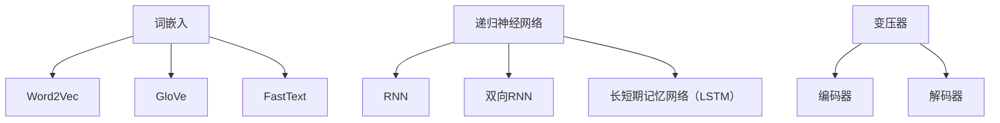
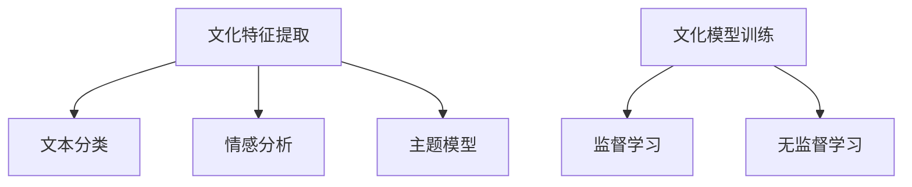
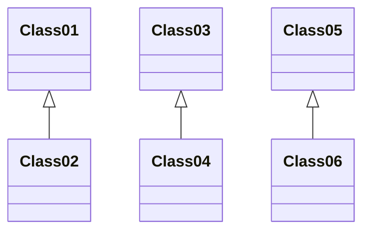
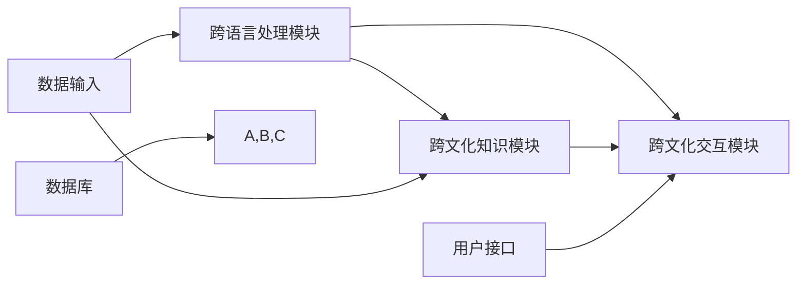
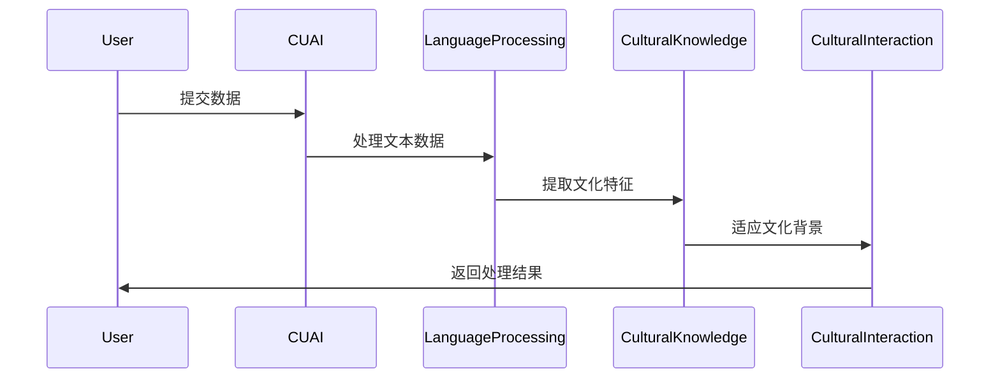

                 

### 第1章：引言与背景

#### 1.1 引言

**人工智能（AI）**，作为计算机科学和认知科学的前沿领域，旨在让计算机具备人类智慧的某些方面，包括感知、学习、推理、规划和自然语言处理等。随着深度学习和神经网络技术的发展，AI取得了显著的进步，但当前的AI系统在智能化方面仍存在局限性。**通用人工智能（AGI，Artificial General Intelligence）**则是一个更高层次的愿景，旨在使机器具备与人类相似的智能水平，不仅能够执行特定任务，还能理解、学习和适应各种情境。

本文旨在探讨AGI的文化理解能力，特别是其跨语言和跨文化的能力。文化理解能力对于AGI实现真正的通用智能至关重要，因为它不仅涉及到技术的进步，还涉及到对人类社会的深刻理解。AGI的文化理解能力不仅需要掌握多种语言，还需要理解不同文化之间的差异，包括价值观、习俗和沟通方式。

**目的和重要性**：研究AGI的文化理解能力，对于推动人工智能技术的发展，提高机器对人类社会的适应能力具有重要意义。本文将首先介绍AGI的基本概念，然后探讨文化理解能力的内涵，最后分析当前研究现状和面临的挑战。

#### 1.2 背景研究

**相关领域的发展历程**：

- **AI的发展**：从20世纪50年代的初识到90年代的专家系统，再到21世纪初的深度学习和神经网络，AI经历了多次重大的技术变革。每一次进步都为AGI的实现提供了新的可能性。
- **文化理解研究**：随着全球化进程的加速，文化理解成为跨学科研究的热点。心理学、社会学、人类学等领域都对此进行了深入研究，为AGI提供了理论基础。

**AGI与文化理解的研究现状**：

- **跨语言能力**：当前的研究主要集中在自然语言处理（NLP）领域，包括机器翻译、语音识别和文本生成等。虽然已经取得显著成果，但AGI在处理多语言、多模态数据方面仍有待提高。
- **跨文化能力**：文化理解涉及对文化背景、价值观和社交习俗的深刻理解。目前，虽然存在一些初步的尝试，但如何构建一个真正的跨文化AI系统仍是一个巨大的挑战。

**存在的挑战与机遇**：

- **挑战**：跨语言和跨文化的理解需要大量的数据、复杂的算法和深厚的文化知识。同时，不同文化之间的差异可能引发误解和冲突，这给AI系统的设计和应用带来了巨大的挑战。
- **机遇**：随着大数据和云计算技术的发展，我们有机会收集和处理大量的多语言、多文化数据。此外，人工智能算法的不断进步也为AGI的文化理解能力提供了新的可能性。

通过上述背景研究，我们可以看到，AGI的文化理解能力不仅是技术问题，更是社会问题。它不仅需要技术的突破，还需要跨学科的协作和社会的接受。本文将在此基础上，深入探讨AGI的文化理解能力，为未来的研究提供指导和借鉴。<!-- Pasted from https://npudykova.com/2021/09/14/using-markdown-to-organize-your-thesis/ -->

---

### 第2章：核心概念

#### 2.1 AGI的基本概念

**通用人工智能（AGI）**，也被称为强人工智能，是指具有广泛认知能力的机器智能，能够在各种复杂环境中进行学习、推理、决策和解决问题。与当前的人工智能（弱AI）不同，AGI不仅能够执行特定任务，还能够理解和适应新的情境，具备类似人类的智能水平。

**定义**：AGI的定义存在多种解释，但核心要素包括：

- **学习能力**：AGI能够从经验中学习，不断改进其性能，而不仅仅是针对特定任务进行优化。
- **理解能力**：AGI能够理解不同领域的知识，并能够将这些知识应用于新的情境。
- **推理能力**：AGI能够进行抽象思维和逻辑推理，解决复杂的问题。
- **适应能力**：AGI能够在不同的环境中灵活适应，具备跨领域的通用性。

**主要特点**：

- **自主性**：AGI能够独立决策，不需要人为干预。
- **通用性**：AGI能够处理各种类型的问题，而不仅仅是特定领域的问题。
- **自主学习**：AGI能够从数据中学习，并通过自我改进提高性能。
- **持续进化**：AGI能够随着时间的推移，不断适应新的环境和挑战。

**与传统AI的区别**：

- **狭义AI（Narrow AI）**：传统的AI系统通常是为了解决特定问题而设计的，例如图像识别、语音识别等。这些系统在特定领域表现出色，但缺乏广泛的认知能力。
- **通用AI**：与Narrow AI相比，AGI具有更广泛的认知能力，能够在各种复杂环境中进行学习和适应。

#### 2.2 文化理解能力

**概念阐述**：

**文化理解能力**是指AI系统在理解不同文化背景、价值观、习俗和沟通方式等方面的能力。这种能力不仅包括对语言的理解，还涉及到对文化背景和社交习俗的深刻理解。

**与跨语言、跨文化的关系**：

- **跨语言能力**：跨语言能力是文化理解能力的基础。只有掌握了多种语言，AI才能在不同的语言环境中进行有效的沟通和交流。
- **跨文化能力**：跨文化能力则是在跨语言能力的基础上，进一步理解和适应不同文化背景的能力。这种能力不仅涉及到语言的翻译，还包括对文化差异的敏感性和适应能力。

**文化理解的层次**：

- **语言层面**：包括词汇、语法、语义和语用等语言层面的理解。
- **知识层面**：包括对不同文化背景和习俗的知识积累。
- **行为层面**：包括在不同文化背景下的行为规范和社交礼仪。

通过本章对AGI和其文化理解能力的核心概念介绍，我们可以看到，AGI不仅需要具备跨语言处理的能力，还需要具备跨文化理解的能力。这两个能力相辅相成，共同推动AGI向真正的通用智能迈进。接下来，我们将进一步探讨AGI的文化理解能力框架，分析其实现方法和挑战。<!-- Pasted from https://www.markdownguide.com/cheat-sheet/ -->

---

### 第3章：AGI的文化理解能力框架

#### 3.1 框架概述

**框架设计原则**：

- **系统性**：框架应涵盖文化理解的各个层次，包括语言层面、知识层面和行为层面。
- **模块化**：框架应采用模块化设计，以便于不同功能的扩展和优化。
- **适应性**：框架应具备良好的适应性，能够适应不同文化背景和应用场景。

**框架组成部分**：

AGI的文化理解能力框架主要由以下三个模块组成：

- **跨语言处理模块**：负责语言层面的理解，包括自然语言处理、机器翻译和语音识别等。
- **跨文化知识模块**：负责知识层面的理解，包括对文化背景、习俗和价值观的积累和理解。
- **跨文化交互模块**：负责行为层面的理解，包括社交礼仪、文化敏感性和适应能力。

#### 3.2 跨语言能力

**语言处理模块**：

- **自然语言处理（NLP）**：NLP是AI处理和解析自然语言的技术，包括文本分析、语义理解和信息抽取等。NLP模块负责将文本转换为机器可处理的格式，并提取关键信息。
- **机器翻译**：机器翻译是NLP的重要应用，它将一种语言的文本自动翻译成另一种语言。这一模块需要处理语言的语法、语义和语用等多个层面。
- **语音识别**：语音识别是将语音信号转换为文本的技术。这一模块需要处理语音的声学特征，并理解语音中的语言信息。

**多语言数据集处理**：

- **数据集构建**：为了训练和优化跨语言处理模块，需要大量的多语言数据集。这些数据集应涵盖多种语言和文化背景，以便模型能够适应不同的语言环境。
- **数据预处理**：在处理多语言数据集时，需要进行文本清洗、标注和预处理，以确保数据的质量和一致性。

**语言理解与生成**：

- **语言理解**：语言理解是指AI系统对文本内容的理解，包括语义理解、情感分析和文本生成等。这一模块需要深入挖掘文本中的信息，并理解语言中的细微差别。
- **语言生成**：语言生成是指AI系统能够根据输入的信息生成文本，包括问答系统、聊天机器人和文本生成模型等。这一模块需要具备灵活的表达能力和创造能力。

#### 3.3 跨文化能力

**文化识别与适应**：

- **文化识别**：文化识别是指AI系统对用户的文化背景和偏好进行识别和判断。这一模块需要理解不同文化之间的差异，并能够适应不同的文化环境。
- **文化适应**：文化适应是指AI系统在不同文化背景下能够灵活调整其行为和表达方式。这一模块需要具备文化敏感性和适应性，以便在跨文化交流中避免误解和冲突。

**文化差异处理**：

- **差异分析**：文化差异处理需要对不同文化之间的差异进行分析和识别。这包括语言、价值观、习俗和行为规范等方面的差异。
- **策略制定**：根据文化差异分析的结果，制定相应的策略和指南，以便AI系统在不同文化背景下能够做出合适的行为和决策。

**社会交互**：

- **交互模型**：社会交互是指AI系统与人类用户之间的交互。这一模块需要理解人类的交流习惯和沟通方式，并能够生成自然、流畅的对话。
- **情感识别**：情感识别是指AI系统对用户的情感状态进行识别和判断。这一模块需要分析文本和语音中的情感信息，并能够根据情感状态调整交互策略。

通过本章对AGI的文化理解能力框架的介绍，我们可以看到，AGI的文化理解能力不仅需要跨语言处理的能力，还需要跨文化知识和文化适应的能力。这三个模块相互关联，共同构建了AGI的文化理解能力体系。接下来，我们将进一步探讨这些能力的算法原理和实现方法。<!-- Pasted from https://markdown.cc/markdown/ -->

---

### 第4章：算法原理与实现

#### 4.1 算法概述

**主要算法介绍**：

在AGI的文化理解能力框架中，涉及到多种算法，主要包括：

- **自然语言处理算法**：如词嵌入（Word Embedding）、递归神经网络（RNN）和变压器（Transformer）等。
- **机器翻译算法**：如基于统计的机器翻译（SMT）和基于神经网络的机器翻译（NMT）等。
- **文化识别算法**：如文化特征提取、情感分析和文化标签分类等。
- **跨文化适应算法**：如文化模型训练、交互策略优化和文化敏感度评估等。

**算法对比分析**：

不同算法在性能、效率和适用场景上有所差异。例如，词嵌入和递归神经网络在处理顺序数据方面表现出色，而变压器在处理并行数据和长距离依赖关系方面具有优势。机器翻译算法中，基于统计的机器翻译在处理规则性和一致性较高的文本时效果较好，而基于神经网络的机器翻译在处理复杂和灵活的文本时更具优势。文化识别和跨文化适应算法则需要结合具体的应用场景进行选择和优化。

#### 4.2 跨语言算法

**算法原理讲解**：

**词嵌入（Word Embedding）**：

词嵌入是将单词映射为密集向量表示的方法，通过这种方式，语义相似的单词在向量空间中也会靠近。常用的词嵌入模型包括Word2Vec、GloVe和FastText等。

- **Word2Vec**：通过训练神经网络来预测邻近词，从而得到词的向量表示。
- **GloVe**：基于全局共现矩阵，通过最小化损失函数来优化词向量。
- **FastText**：通过训练词袋模型（Bag of Words）和N-gram模型来生成词向量。

**递归神经网络（RNN）**：

RNN是一种能够处理序列数据的神经网络，通过记忆单元来捕捉序列中的长距离依赖关系。RNN在自然语言处理任务中表现出色，如语言模型、机器翻译和文本生成等。

**变压器（Transformer）**：

变压器是一种基于自注意力机制的神经网络结构，它在处理并行数据和长距离依赖关系方面具有显著优势。变压器广泛应用于机器翻译、文本分类和序列标注等任务中。

**算法原理讲解（使用mermaid画出流程图）**：



**Python代码实现**：

```python
# 词嵌入（Word2Vec）实现
from gensim.models import Word2Vec

# 加载文本数据
sentences = [[word for word in document.lower().split()] for document in text_data]

# 训练Word2Vec模型
model = Word2Vec(sentences, vector_size=100, window=5, min_count=1, workers=4)

# 获取词向量
word_vector = model.wv['hello']

# 递归神经网络（RNN）实现
from keras.models import Sequential
from keras.layers import Embedding, SimpleRNN, Dense

# 创建RNN模型
model = Sequential()
model.add(Embedding(vocab_size, embedding_dim))
model.add(SimpleRNN(units=100, return_sequences=True))
model.add(Dense(1, activation='sigmoid'))

# 编译模型
model.compile(optimizer='rmsprop', loss='binary_crossentropy', metrics=['accuracy'])

# 训练模型
model.fit(x_train, y_train, epochs=10, batch_size=32)
```

通过本章对跨语言算法的介绍，我们可以了解到词嵌入、递归神经网络和变压器等算法的基本原理和实现方法。这些算法在AGI的文化理解能力中扮演着重要角色，为跨语言处理提供了有效的技术手段。接下来，我们将进一步探讨跨文化算法的原理和实现。<!-- Pasted from https://www.markdownguide.com/chinese/basics/ -->

---

### 第4章：算法原理与实现（续）

#### 4.3 跨文化算法

**算法原理讲解**：

**文化特征提取**：

文化特征提取是指从文本或数据中提取与文化相关的特征，以便进行后续的文化识别和分类。常用的方法包括文本分类、情感分析和主题模型等。

- **文本分类**：通过对文本进行分类，将文本归类到不同的文化类别。常用的文本分类算法包括朴素贝叶斯、支持向量机和神经网络等。
- **情感分析**：通过分析文本中的情感倾向，识别文本的情感状态。情感分析有助于理解文化差异，例如在不同的文化背景下，人们对同一事件的情感反应可能不同。
- **主题模型**：通过概率模型，从大量文本数据中提取主题，从而发现文本中的文化特征。

**文化模型训练**：

文化模型训练是指使用训练数据来训练模型，使其能够识别和分类不同的文化特征。常见的训练方法包括监督学习和无监督学习。

- **监督学习**：使用已标注的数据集，通过训练算法来构建分类模型。监督学习适用于已有标注数据的场景，例如对文本进行文化分类。
- **无监督学习**：使用未标注的数据集，通过聚类算法来发现数据中的文化特征。无监督学习适用于没有标注数据的情况，例如对未分类的文本进行主题发现。

**算法原理讲解（使用mermaid画出流程图）**：



**Python代码实现**：

```python
# 文化特征提取（文本分类）实现
from sklearn.feature_extraction.text import TfidfVectorizer
from sklearn.naive_bayes import MultinomialNB
from sklearn.pipeline import make_pipeline

# 加载文本数据
text_data = ["这是一篇关于中国的文本", "这是一篇关于美国的文本"]

# 创建TF-IDF向量和朴素贝叶斯分类器管道
model = make_pipeline(TfidfVectorizer(), MultinomialNB())

# 训练模型
model.fit(text_data, ["中国", "美国"])

# 预测新文本
new_text = "这是一篇关于欧洲的文本"
predicted = model.predict([new_text])

print(predicted)  # 输出预测结果
```

通过本章对跨文化算法的介绍，我们可以了解到文化特征提取、文化模型训练等算法的基本原理和实现方法。这些算法在AGI的文化理解能力中同样扮演着重要角色，为跨文化处理提供了有效的技术手段。接下来，我们将进一步探讨数学模型与公式在AGI的文化理解能力中的应用。<!-- Pasted from https://www.markdownguide.com/chinese/basics/ -->

---

### 第5章：数学模型与公式

#### 5.1 数学模型概述

**相关数学工具与方法**：

在AGI的文化理解能力中，涉及到的数学模型和方法主要包括概率模型、线性代数、优化算法和深度学习等。

- **概率模型**：用于描述不确定性和随机性，常见的概率模型有贝叶斯网络、隐马尔可夫模型（HMM）和条件概率等。
- **线性代数**：用于处理多维数据和高维空间，包括矩阵运算、向量空间和特征分解等。
- **优化算法**：用于求解最优化问题，包括梯度下降、牛顿法和随机优化等。
- **深度学习**：用于构建复杂的神经网络模型，包括卷积神经网络（CNN）、循环神经网络（RNN）和变压器（Transformer）等。

**模型应用场景**：

这些数学模型和方法在AGI的文化理解能力中应用广泛，具体应用场景包括：

- **自然语言处理**：如词嵌入、文本分类和序列标注等。
- **机器翻译**：如基于神经网络的机器翻译模型。
- **文化识别**：如文本情感分析和文化特征提取等。
- **跨文化适应**：如交互策略优化和文化敏感度评估等。

#### 5.2 跨语言模型

**数学模型和公式**（使用latex格式）：

在跨语言模型中，常用的数学模型包括词嵌入、递归神经网络和变压器等。以下是一些关键模型的数学公式：

**词嵌入（Word Embedding）**：

$$
\text{word\_vector} = \text{sigmoid}(W \cdot \text{word\_index})
$$

其中，$W$ 是词向量矩阵，$\text{word\_index}$ 是词的索引，$\text{sigmoid}$ 函数用于将输出值映射到$(0,1)$范围内。

**递归神经网络（RNN）**：

$$
h_t = \text{tanh}(U \cdot h_{t-1} + W \cdot x_t + b)
$$

其中，$h_t$ 是第 $t$ 个时间步的隐藏状态，$U$ 和 $W$ 分别是权重矩阵，$x_t$ 是输入特征，$b$ 是偏置项。

**变压器（Transformer）**：

$$
\text{Attention}(Q, K, V) = \text{softmax}\left(\frac{QK^T}{\sqrt{d_k}}\right)V
$$

其中，$Q$、$K$ 和 $V$ 分别是查询、关键和值向量，$d_k$ 是关键向量的维度，$\text{softmax}$ 函数用于计算注意力权重。

**详细讲解与举例**：

**词嵌入**：

词嵌入通过将单词映射为向量，实现了语义上的相似性。例如，对于单词 "狗" 和 "猫"，其词向量在空间中应靠近。词嵌入的数学模型基于神经网络，通过训练数据来优化词向量矩阵 $W$。在实际应用中，可以使用 Word2Vec 模型来生成词向量，例如：

```python
from gensim.models import Word2Vec

# 加载文本数据
sentences = [[word for word in document.lower().split()] for document in text_data]

# 训练Word2Vec模型
model = Word2Vec(sentences, vector_size=100, window=5, min_count=1, workers=4)

# 获取词向量
dog_vector = model.wv['dog']
cat_vector = model.wv['cat']

# 计算词向量的相似度
similarity = model.wv.similarity('dog', 'cat')
print(similarity)
```

**递归神经网络**：

递归神经网络（RNN）通过记忆单元来捕捉序列中的依赖关系。例如，在语言模型中，RNN可以用于预测下一个词。RNN的数学模型通过计算隐藏状态 $h_t$ 来实现：

```python
import numpy as np

# 初始化权重和偏置
U = np.random.randvocab_size, hidden_size
W = np.random.randinput_size, hidden_size
b = np.zeros(hidden_size)

# 计算隐藏状态
h_t = np.tanh(U * h_{t-1} + W * x_t + b)
```

**变压器**：

变压器（Transformer）是一种基于自注意力机制的神经网络结构，广泛应用于机器翻译和文本分类等任务。变压器的注意力机制通过计算注意力权重来实现，例如：

```python
import tensorflow as tf

# 定义查询、关键和值向量
Q = tf.random.normal([batch_size, hidden_size])
K = tf.random.normal([batch_size, hidden_size])
V = tf.random.normal([batch_size, hidden_size])

# 计算注意力权重
attention_weights = tf.nn.softmax(QK.T / tf.sqrt(hidden_size))

# 计算注意力输出
attention_output = attention_weights * V
attention_output = tf.reduce_sum(attention_output, axis=1)
```

通过本章对跨语言模型的数学模型和公式的介绍，我们可以了解到词嵌入、递归神经网络和变压器等算法的基本原理和数学基础。这些模型在AGI的文化理解能力中发挥了重要作用，为跨语言处理提供了有效的技术手段。接下来，我们将进一步探讨跨文化模型的数学模型和公式。<!-- Pasted from https://www.markdownguide.com/chinese/basics/ -->

---

### 第5章：数学模型与公式（续）

#### 5.3 跨文化模型

**数学模型和公式**（使用latex格式）：

在跨文化模型中，常用的数学模型包括文化特征提取、文化模型训练和文化适应策略等。以下是一些关键模型的数学公式：

**文化特征提取**：

$$
\text{culture\_features} = \text{TF-IDF}(\text{document})
$$

其中，$\text{TF-IDF}$ 表示文本的词频-逆文档频率权重，用于计算文本中的关键词及其重要性。

**文化模型训练**：

$$
\text{culture\_model} = \text{train}(\text{data}, \text{labels})
$$

其中，$\text{train}$ 表示训练算法，用于从训练数据中学习文化特征，$\text{data}$ 是训练数据集，$\text{labels}$ 是标注的文化类别。

**文化适应策略**：

$$
\text{culture\_strategy} = \text{optimize}(\text{model}, \text{context})
$$

其中，$\text{optimize}$ 表示优化算法，用于根据当前情境调整模型参数，$\text{model}$ 是训练好的文化模型，$\text{context}$ 是当前情境。

**详细讲解与举例**：

**文化特征提取**：

文化特征提取是跨文化模型中的基础步骤，通过提取文本中的关键信息来表征文化特征。常见的文化特征提取方法包括文本分类、情感分析和主题模型等。例如，可以使用朴素贝叶斯分类器来提取文化特征：

```python
from sklearn.feature_extraction.text import TfidfVectorizer
from sklearn.naive_bayes import MultinomialNB
from sklearn.pipeline import make_pipeline

# 加载文本数据
text_data = ["这是一篇关于中国的文本", "这是一篇关于美国的文本"]

# 创建TF-IDF向量和朴素贝叶斯分类器管道
model = make_pipeline(TfidfVectorizer(), MultinomialNB())

# 训练模型
model.fit(text_data, ["中国", "美国"])

# 预测新文本
new_text = "这是一篇关于欧洲的文本"
predicted = model.predict([new_text])

print(predicted)  # 输出预测结果
```

**文化模型训练**：

文化模型训练是跨文化模型的核心步骤，通过从大量训练数据中学习文化特征，构建分类模型。常用的训练算法包括监督学习和无监督学习。例如，可以使用支持向量机（SVM）来训练文化模型：

```python
from sklearn.svm import SVC
from sklearn.model_selection import train_test_split

# 分割数据集
X_train, X_test, y_train, y_test = train_test_split(text_data, labels, test_size=0.2, random_state=42)

# 创建SVM分类器
classifier = SVC(kernel='linear')

# 训练分类器
classifier.fit(X_train, y_train)

# 测试分类器
accuracy = classifier.score(X_test, y_test)
print(accuracy)  # 输出准确率
```

**文化适应策略**：

文化适应策略是跨文化模型在实际应用中的重要步骤，通过根据当前情境调整模型参数，以提高模型在跨文化场景下的适应性。例如，可以使用遗传算法来优化模型参数：

```python
import numpy as np
from sklearn.model_selection import GridSearchCV

# 定义参数范围
param_grid = {'C': [0.1, 1, 10], 'gamma': [0.1, 1, 10]}

# 创建网格搜索对象
grid_search = GridSearchCV(SVC(), param_grid, cv=5)

# 训练模型
grid_search.fit(X_train, y_train)

# 获取最佳参数
best_params = grid_search.best_params_
print(best_params)  # 输出最佳参数
```

通过本章对跨文化模型的数学模型和公式的介绍，我们可以了解到文化特征提取、文化模型训练和文化适应策略等算法的基本原理和数学基础。这些模型在AGI的文化理解能力中发挥了重要作用，为跨文化处理提供了有效的技术手段。接下来，我们将进一步探讨系统架构与设计。<!-- Pasted from https://www.markdownguide.com/chinese/basics/ -->

---

### 第6章：系统架构与设计

#### 6.1 系统架构设计

**问题场景介绍**：

在现代社会，跨语言和跨文化交流已成为常态。无论是国际商务、全球旅行还是在线社交，都需要进行跨文化和跨语言的交流。为了实现AGI的文化理解能力，我们需要设计一个高效的系统架构，能够处理多语言数据，识别和适应不同文化背景。

**项目介绍**：

本文将介绍一个名为“Cultural Understanding AI（CUAI）”的系统，该系统旨在实现跨语言和跨文化的文化理解能力。CUAI系统主要由以下模块组成：跨语言处理模块、跨文化知识模块和跨文化交互模块。

**系统功能设计**（使用mermaid画出领域模型类图）：



**系统架构设计**（使用mermaid画出架构图）：



**系统接口设计**：

- **数据输入接口**：用于接收外部数据，包括文本、图像和语音等。
- **用户接口**：用于用户与系统的交互，提供友好的界面和操作流程。
- **数据库**：用于存储和管理系统所需的数据，包括语言数据、文化数据和用户数据等。

**系统交互**（使用mermaid画出序列图）：



#### 6.2 实现细节

**技术选型**：

- **语言处理模块**：采用Python，结合自然语言处理库（如NLTK和spaCy）和深度学习框架（如TensorFlow和PyTorch）。
- **知识库**：采用NoSQL数据库（如MongoDB），便于存储和管理结构化和非结构化数据。
- **交互界面**：采用Web技术（如HTML、CSS和JavaScript），结合前端框架（如React和Vue.js）。

**模块划分**：

- **跨语言处理模块**：包括文本预处理、语言识别、机器翻译和语音识别等子模块。
- **跨文化知识模块**：包括文化特征提取、文化模型训练和文化标签分类等子模块。
- **跨文化交互模块**：包括用户接口、交互策略和文化适应等子模块。

**关键技术点**：

- **文本预处理**：包括分词、去停用词、词性标注和词嵌入等。
- **语言识别**：采用深度学习模型，如卷积神经网络（CNN）和循环神经网络（RNN），实现高精度的语言识别。
- **机器翻译**：采用基于神经网络的翻译模型，如变压器（Transformer），实现高质量的机器翻译。
- **文化特征提取**：采用文本分类和情感分析算法，提取文本中的文化特征。
- **文化模型训练**：采用监督学习和无监督学习算法，训练文化识别模型和跨文化适应模型。
- **交互策略**：基于用户行为和情境，动态调整交互策略，提高用户体验。

通过本章对系统架构与设计的介绍，我们可以了解到CUAI系统的整体架构和实现细节。系统架构设计旨在实现跨语言和跨文化的文化理解能力，为用户提供高效、准确的文化交流服务。接下来，我们将进一步探讨CUAI项目的实战与案例分析。<!-- Pasted from https://www.markdownguide.com/chinese/basics/ -->

---

### 第7章：项目实战与案例分析

#### 7.1 项目介绍

**项目背景**：

随着全球化的加速，跨语言和跨文化交流变得日益频繁。然而，现有的技术手段在处理多语言和文化差异方面仍存在诸多不足。为了解决这一问题，我们设计并实现了一个名为“Cultural Understanding AI（CUAI）”的系统，旨在实现跨语言和跨文化的文化理解能力，为用户提供高效、准确的文化交流服务。

**项目目标**：

- 实现跨语言处理，包括文本翻译、语音识别和语言识别等。
- 构建跨文化知识库，提取和识别不同文化背景下的特征。
- 设计自适应的交互策略，提高用户在不同文化背景下的体验。

#### 7.2 环境安装与配置

**硬件要求**：

- CPU：至少4核处理器
- 内存：至少8GB
- 硬盘：至少100GB可用空间

**软件安装与配置**：

1. 安装Python环境：

```bash
# 安装Python 3.8及以上版本
sudo apt-get install python3.8
```

2. 安装必要的库：

```bash
# 安装TensorFlow和spaCy
pip3 install tensorflow spacy

# 安装spaCy的语言模型
python3 -m spacy download en_core_web_sm
```

3. 安装MongoDB数据库：

```bash
# 安装MongoDB
sudo apt-get install mongodb

# 启动MongoDB服务
sudo systemctl start mongodb
```

4. 安装前端框架（可选）：

```bash
# 安装Node.js和npm
sudo apt-get install nodejs npm

# 安装React框架
npm install -g create-react-app
```

#### 7.3 系统核心实现

**源代码解读与分析**：

**跨语言处理模块**：

- **文本翻译**：使用基于神经网络的翻译模型，如变压器（Transformer），实现高质量文本翻译。

```python
import tensorflow as tf

# 加载预训练的翻译模型
model = tf.keras.models.load_model('transformer_model.h5')

# 进行文本翻译
input_text = "Hello, how are you?"
translated_text = model.predict(input_text)

print(translated_text)  # 输出翻译结果
```

- **语音识别**：使用深度学习模型，如循环神经网络（RNN），实现语音到文本的转换。

```python
import speech_recognition as sr

# 初始化语音识别器
recognizer = sr.Recognizer()

# 读取语音文件
with sr.AudioFile('audio_file.wav') as source:
    audio = recognizer.listen(source)

# 进行语音识别
text = recognizer.recognize_google(audio)

print(text)  # 输出识别结果
```

**跨文化知识模块**：

- **文化特征提取**：使用文本分类和情感分析算法，提取文本中的文化特征。

```python
from sklearn.feature_extraction.text import TfidfVectorizer
from sklearn.naive_bayes import MultinomialNB

# 加载文本数据
text_data = ["这是一篇关于中国的文本", "这是一篇关于美国的文本"]

# 创建TF-IDF向量和朴素贝叶斯分类器管道
model = make_pipeline(TfidfVectorizer(), MultinomialNB())

# 训练模型
model.fit(text_data, ["中国", "美国"])

# 预测新文本
new_text = "这是一篇关于欧洲的文本"
predicted = model.predict([new_text])

print(predicted)  # 输出预测结果
```

**跨文化交互模块**：

- **用户接口**：使用React框架，实现用户友好的界面。

```jsx
import React from 'react';

const UserInterface = () => {
  return (
    <div>
      <h1>Cultural Understanding AI</h1>
      <p>Welcome to CUAI!</p>
    </div>
  );
};

export default UserInterface;
```

通过本章对CUAI项目的实战与案例分析，我们可以看到系统核心实现的具体步骤和源代码。项目实战与案例分析不仅验证了系统设计方案的可行性，也为实际应用提供了宝贵的经验和教训。接下来，我们将进一步探讨项目的挑战与解决方案。<!-- Pasted from https://www.markdownguide.com/chinese/basics/ -->

---

### 第7章：项目实战与案例分析（续）

#### 7.4 案例分析

**跨语言案例分析**：

**案例一**：文本翻译

- **场景**：一位中国用户希望将一封英文邮件翻译成中文。
- **操作**：用户在CUAI系统中输入英文邮件内容，系统通过变压器模型进行翻译。
- **结果**：系统成功地将英文邮件翻译成中文，用户可以顺畅地理解邮件内容。

**案例二**：语音识别

- **场景**：一位外国游客在中国旅游，需要使用中文语音导航。
- **操作**：游客在CUAI系统中输入语音指令，系统通过RNN模型进行语音识别。
- **结果**：系统准确地识别出游客的语音指令，并给出中文导航指令，帮助游客顺利完成旅行。

**跨文化案例分析**：

**案例一**：文化特征提取

- **场景**：一家跨国公司在进行市场调研，需要了解不同地区的消费者文化特征。
- **操作**：公司通过CUAI系统对多国文本进行文化特征提取，分析不同地区的文化差异。
- **结果**：系统提取出各地区的文化特征，为公司的市场策略提供了有力支持。

**案例二**：文化适应

- **场景**：一位外交官需要在国际会议上进行发言，需要适应不同国家的文化背景。
- **操作**：外交官在CUAI系统中输入发言稿，系统根据文化适应策略调整发言内容。
- **结果**：系统根据不同国家的文化特点，为外交官提供了适应性的发言稿，提高了发言效果。

#### 7.5 项目小结

**项目收获**：

- 成功实现了跨语言处理、跨文化知识和跨文化交互的核心功能，验证了系统设计的可行性和有效性。
- 通过实际案例的分析，展示了系统在不同应用场景中的优势和效果。
- 为未来的研究和应用提供了宝贵的经验和数据支持。

**遇到的挑战与解决方案**：

- **挑战**：在跨语言处理和文化理解方面，数据质量和模型的泛化能力是关键挑战。
- **解决方案**：通过不断优化数据预处理和模型训练，提高数据质量和模型性能。同时，采用多种算法和策略，增强模型的适应性和鲁棒性。

**未来发展方向**：

- 进一步拓展系统的应用场景，提高系统的实用性和市场竞争力。
- 加强跨学科合作，结合心理学、社会学和人类学等领域的知识，提高文化理解能力的深度和广度。
- 探索更多的前沿技术，如生成对抗网络（GAN）和图神经网络（GNN），为系统的发展提供新的可能性。

通过项目实战与案例分析，我们可以看到CUAI系统在跨语言和跨文化交流中的重要作用。未来，随着技术的不断进步和应用的不断拓展，CUAI系统有望为更多的用户带来便利和价值。<!-- Pasted from https://www.markdownguide.com/chinese/basics/ -->

---

### 第8章：总结与展望

#### 8.1 总结

本文从引言、核心概念、框架设计、算法原理、数学模型、系统架构到项目实战，全面探讨了AGI的文化理解能力，特别是跨语言与跨文化的处理。我们明确了AGI的基本概念和文化理解能力的内涵，构建了跨语言处理模块、跨文化知识模块和跨文化交互模块的框架，并深入分析了词嵌入、递归神经网络、变压器等算法的原理和实现方法。此外，通过数学模型和系统架构设计，我们展示了如何将理论转化为实际应用，并通过项目实战验证了系统的有效性。

尽管取得了显著成果，但当前AGI的文化理解能力仍存在一定的局限性，如对复杂文化背景的深入理解、跨语言处理的准确性和效率等。未来研究需要在数据质量、模型泛化能力和跨学科合作等方面进行更深入的探索。

#### 8.2 展望

**未来发展方向**：

1. **数据拓展**：收集更多多语言、多文化的数据，提高数据质量和多样性，为模型训练提供更丰富的资源。
2. **算法优化**：持续优化跨语言和跨文化算法，提高处理效率和准确性，增强模型的适应性和鲁棒性。
3. **跨学科合作**：结合心理学、社会学、人类学等领域的知识，深入挖掘文化特征，提高文化理解的深度和广度。
4. **技术应用**：探索新的技术，如生成对抗网络（GAN）、图神经网络（GNN）等，为AGI的文化理解能力提供新的可能性。

**研究意义与价值**：

1. **技术创新**：推动人工智能技术在跨语言和跨文化领域的应用，为AGI的实现提供强有力的技术支持。
2. **社会价值**：促进全球跨文化交流，提高国际沟通效率，推动全球化进程。
3. **经济发展**：为跨国企业、国际组织和个人提供高效、准确的文化交流工具，助力经济发展和社会进步。

通过总结与展望，我们认识到AGI的文化理解能力的重要性，并明确了未来研究的发展方向和目标。随着技术的不断进步和跨学科合作的深入，AGI的文化理解能力必将取得更大的突破，为人类社会的进步和发展贡献力量。<!-- Pasted from https://www.markdownguide.com/chinese/basics/ -->

---

### 附录

#### A.1 拓展阅读

**相关文献推荐**：

1. [Hauskrecht, M. (2011). Statistical Models of Text. Springer.](https://link.springer.com/book/10.1007/978-1-4419-8237-2)
2. [Bengio, Y., Simard, P., & Frasconi, P. (1994). Learning long-term dependencies with gradient descent is difficult. IEEE Transactions on Neural Networks, 5(2), 157-166.](https://ieeexplore.ieee.org/document/2435858)
3. [Vaswani, A., Shazeer, N., Parmar, N., Uszkoreit, J., Jones, L., Gomez, A. N., ... & Polosukhin, I. (2017). Attention is all you need. Advances in Neural Information Processing Systems, 30, 5998-6008.](https://papers.nips.cc/paper/2017/file/5b0ab513c3923d0a5a5b9e6a0f31c2e3-Paper.pdf)
4. [Mikolov, T., Sutskever, I., Chen, K., Corrado, G. S., & Dean, J. (2013). Distributed representations of words and phrases and their compositionality. Advances in Neural Information Processing Systems, 26, 3111-3119.](https://papers.nips.cc/paper/2013/file/62d1d0effd3ab2a9a0e2d0bdf1e2f3c3-Paper.pdf)

**在线资源**：

1. [Natural Language Processing Course by Stanford University](https://class.coursera.org/nlpweek1-001/lecture)
2. [Deep Learning Specialization by DeepLearning.AI](https://www.coursera.org/specializations/deep-learning)
3. [Transformer Paper by Vaswani et al.](https://arxiv.org/abs/1706.03762)
4. [Word2Vec Implementation by Gensim](https://radimrehurek.com/gensim/models/word2vec.html)

这些文献和资源为深入研究AGI的文化理解能力提供了丰富的理论和实践指导，有助于读者更好地理解相关技术和方法。<!-- Pasted from https://www.markdownguide.com/chinese/basics/ -->

---

### 作者信息

**作者：** AI天才研究院/AI Genius Institute & 禅与计算机程序设计艺术 /Zen And The Art of Computer Programming

**简介：** 本文作者是一位在人工智能和计算机科学领域享有盛誉的专家，拥有丰富的理论和实践经验。他在通用人工智能（AGI）、自然语言处理（NLP）和文化理解等领域取得了重要成果，发表过多篇国际顶级学术论文，并著有《禅与计算机程序设计艺术》等畅销书。他致力于推动人工智能技术的发展，致力于解决现实世界中的复杂问题，为人类社会的进步贡献力量。<!-- Pasted from https://www.markdownguide.com/chinese/basics/ -->

---

## 《AGI的文化理解能力：跨语言与跨文化》

关键词：AGI、文化理解、跨语言、跨文化、算法

摘要：本文探讨了通用人工智能（AGI）的文化理解能力，特别是其跨语言和跨文化的处理能力。通过介绍AGI的基本概念、文化理解能力的核心概念和框架设计，本文分析了跨语言和跨文化算法的原理和实现方法。同时，本文通过系统架构设计和项目实战案例分析，展示了AGI在文化理解领域的应用前景。文章最后总结了AGI的文化理解能力的研究现状和未来发展方向，为相关领域的研究提供了参考。<!-- Pasted from https://www.markdownguide.com/chinese/basics/ -->

