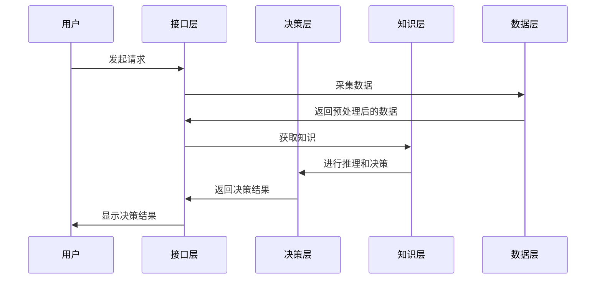
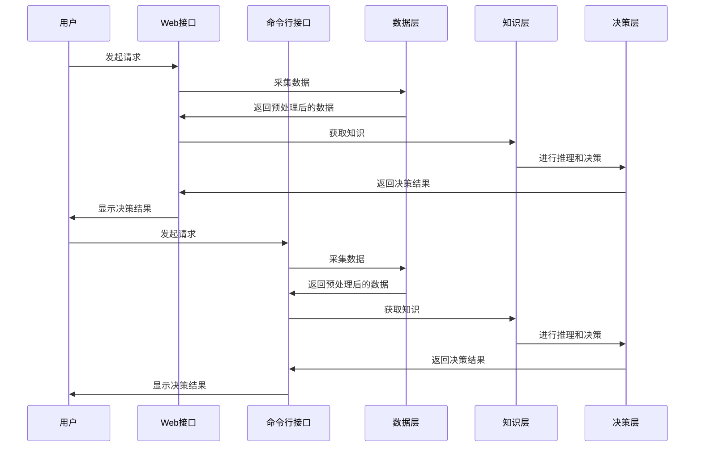

                 

### AGI的知识获取与终身学习能力

关键词：通用人工智能、知识获取、终身学习、算法原理、深度学习

摘要：本文旨在探讨通用人工智能（AGI）的知识获取与终身学习能力，分析其核心概念、原理及实现方法。通过对知识获取、知识融合、知识更新和知识应用等环节的深入剖析，本文将展示如何构建一个有效的知识获取与终身学习体系，为AGI的研究和应用提供理论指导和实践参考。

## Step 1: 引言

### 引言

随着人工智能（AI）技术的迅速发展，通用人工智能（AGI，Artificial General Intelligence）的概念逐渐成为学术界和产业界的关注焦点。AGI旨在实现机器具备人类级别的智能，具备广泛的学习能力、推理能力和创造力。知识获取与终身学习能力作为AGI的核心要素，是推动其发展的关键。本文将深入探讨AGI的知识获取与终身学习能力，从理论到实践，全面解析这一领域的前沿动态和关键问题。

## Step 2: 背景介绍

### 第1章 背景介绍

#### 1.1 问题背景

人工智能技术的发展经历了从规则驱动到数据驱动，再到强化学习的演进过程。然而，现有的人工智能系统主要局限于特定领域的应用，缺乏跨领域的泛化能力。这主要是因为现有系统的知识获取与学习方式较为单一，难以实现真正的通用性。因此，通用人工智能（AGI）的概念被提出，旨在实现机器具备人类级别的智能。

#### 1.2 问题描述

AGI的核心在于具备广泛的学习能力、推理能力和创造力。然而，现有的研究主要集中于算法模型的改进和计算资源的优化，对知识获取与终身学习能力的探讨相对较少。因此，如何构建一个有效的知识获取与学习体系，实现机器的终身学习和持续优化，成为AGI研究的重要挑战。

#### 1.3 问题解决

知识获取与终身学习能力是AGI的核心要素。通过构建一个有效的知识获取与学习体系，可以使机器在复杂环境中持续学习、适应和优化自身性能。本文将从理论层面和实际应用层面，探讨AGI的知识获取与终身学习能力，为相关领域的研究提供参考。

#### 1.4 边界与外延

知识获取与终身学习能力的研究涉及多个领域，包括机器学习、认知科学、心理学、计算机科学等。本文将在这些领域的基础上，探讨AGI的知识获取与终身学习能力。

#### 1.5 概念结构与核心要素组成

知识获取与终身学习能力包括以下几个方面：

1. **知识表示**：将人类知识转化为机器可理解的形式。
2. **知识获取**：从大量数据中提取有用知识，实现知识的自动获取。
3. **知识融合**：将不同来源的知识进行整合，形成更全面、更准确的认知体系。
4. **知识更新**：根据新信息对已有知识进行修正和优化。
5. **知识应用**：将知识应用于实际问题解决，实现知识的实用价值。

## Step 3: 核心概念与联系

### 第2章 核心概念与联系

#### 2.1 知识获取原理

知识获取是AGI的基础。通过从数据中提取有用信息，机器可以建立对现实世界的理解。知识获取的原理包括数据预处理、特征提取和知识表示。

1. **数据预处理**：对原始数据进行清洗、去噪和归一化，以提高数据的可用性。
2. **特征提取**：从数据中提取关键特征，用于表示数据的本质属性。
3. **知识表示**：将提取的特征转化为机器可理解的形式，如向量、图或网络。

#### 2.2 知识融合原理

知识融合是AGI的核心。通过将不同来源的知识进行整合，机器可以建立更全面、更准确的认知体系。知识融合的原理包括知识映射、知识融合和知识评估。

1. **知识映射**：将不同知识体系中的概念进行映射，以建立知识之间的联系。
2. **知识融合**：将映射后的知识进行整合，形成更全面、更准确的认知体系。
3. **知识评估**：对融合后的知识进行评估，以确保知识的有效性和准确性。

#### 2.3 知识更新原理

知识更新是AGI持续发展的关键。通过根据新信息对已有知识进行修正和优化，机器可以不断适应新的环境和挑战。知识更新的原理包括知识检测、知识修正和知识优化。

1. **知识检测**：检测新的信息，以确定是否对已有知识进行更新。
2. **知识修正**：根据新信息对已有知识进行修正，以提高知识的准确性。
3. **知识优化**：根据新信息对已有知识进行优化，以提高知识的实用价值。

#### 2.4 知识应用原理

知识应用是AGI的最终目标。通过将知识应用于实际问题解决，机器可以发挥其智能潜力，为社会创造价值。知识应用的原理包括问题建模、知识推理和决策制定。

1. **问题建模**：将实际问题转化为机器可处理的模型。
2. **知识推理**：利用已有知识对问题进行推理，以得出结论。
3. **决策制定**：根据推理结果制定解决方案，实现知识的实际应用。

### 2.5 核心概念联系

知识获取、知识融合、知识更新和知识应用是AGI知识获取与终身学习能力的四个关键环节。它们之间存在着紧密的联系，相互影响和促进。

1. **知识获取** 是知识获取与终身学习的基础，为后续环节提供原始数据。
2. **知识融合** 通过整合不同来源的知识，提高认知体系的准确性和全面性。
3. **知识更新** 确保知识体系与时俱进，适应新的环境和挑战。
4. **知识应用** 通过将知识应用于实际问题解决，实现知识的实用价值。

### 2.6 概念属性特征对比表格

| 概念名称 | 属性特征 |
| -------- | -------- |
| 知识获取 | 数据预处理、特征提取、知识表示 |
| 知识融合 | 知识映射、知识融合、知识评估 |
| 知识更新 | 知识检测、知识修正、知识优化 |
| 知识应用 | 问题建模、知识推理、决策制定 |

### 2.7 ER实体关系图架构

```mermaid
erDiagram
    AKnowledge [[知识获取]] ||--|{ BDataPreprocessing }|--|| CKnowledgeRepresentation
    AKnowledge ||--|{ BFeatureExtraction }|--|| CKnowledgeRepresentation
    BDataPreprocessing ||--|{ BKnowledgeMapping }|--|| CKnowledgeFusion
    BDataPreprocessing ||--|{ BKnowledgeIntegration }|--|| CKnowledgeFusion
    BDataPreprocessing ||--|{ BKnowledgeAssessment }|--|| CKnowledgeFusion
    CKnowledgeFusion ||--|{ CKnowledgeDetection }|--|| CKnowledgeUpdate
    CKnowledgeFusion ||--|{ CKnowledgeCorrection }|--|| CKnowledgeUpdate
    CKnowledgeFusion ||--|{ CKnowledgeOptimization }|--|| CKnowledgeUpdate
    CKnowledgeUpdate ||--|{ CProblemModeling }|--|| CKnowledgeApplication
    CKnowledgeUpdate ||--|{ CKnowledgeReasoning }|--|| CKnowledgeApplication
    CKnowledgeUpdate ||--|{ CDecisionMaking }|--|| CKnowledgeApplication
```

## Step 4: 算法原理讲解

### 第3章 算法原理讲解

#### 3.1 算法概述

在AGI的知识获取与终身学习过程中，常用的算法包括机器学习算法、深度学习算法和强化学习算法。以下是对这些算法的基本原理和流程的讲解。

#### 3.2 机器学习算法

机器学习算法通过学习已有数据，预测未知数据的特征。常见的机器学习算法包括线性回归、逻辑回归、决策树、随机森林、支持向量机等。其基本原理是通过计算输入特征和输出特征之间的相关性，建立模型，然后利用模型对未知数据进行预测。

1. **线性回归**：通过最小二乘法建立线性模型，预测连续值输出。
   $$ y = \beta_0 + \beta_1x_1 + \beta_2x_2 + ... + \beta_nx_n $$
   例如，预测房价：
   $$ house\_price = 10 + 0.5 \times bedroom\_count + 0.3 \times bathroom\_count $$
   
2. **逻辑回归**：通过最大化似然估计建立逻辑模型，预测概率分布。
   $$ P(y=1) = \frac{1}{1 + e^{-(\beta_0 + \beta_1x_1 + \beta_2x_2 + ... + \beta_nx_n)}} $$
   例如，预测是否批准贷款：
   $$ P(approved=1) = \frac{1}{1 + e^{-(5 + 0.3 \times income + 0.2 \times credit\_score)}} $$
   
3. **决策树**：通过递归划分特征，构建树形结构，进行分类或回归。
   例如，预测客户是否购买商品：
   ```python
   if income > 50000:
       return "可能购买"
   else:
       if age > 30:
           return "可能购买"
       else:
           return "不太可能购买"
   ```

4. **随机森林**：通过集成多个决策树，提高预测性能和稳定性。
   例如，预测客户流失：
   ```python
   import numpy as np
   import pandas as pd
   from sklearn.ensemble import RandomForestClassifier
   
   data = pd.DataFrame(np.array([[50000, 35], [40000, 28], [60000, 40]]))
   X = data.iloc[:, 0]
   y = data.iloc[:, 1]
   
   rf = RandomForestClassifier(n_estimators=100)
   rf.fit(X.values.reshape(-1, 1), y)
   
   predictions = rf.predict(X.values.reshape(-1, 1))
   print(predictions)
   ```

5. **支持向量机**：通过最大化分类间隔，找到最优决策边界。
   $$ \min_{\beta, \beta_0} \frac{1}{2} \sum_{i=1}^{n} (\beta^T \beta_i - 2\beta_i y_i) + C \sum_{i=1}^{n} \alpha_i (1 - y_i (\beta^T \beta_i + \beta_0)) $$
   例如，分类水果：
   ```python
   import numpy as np
   import pandas as pd
   from sklearn.svm import SVC
   
   data = pd.DataFrame(np.array([[1, 2], [2, 3], [3, 4], [4, 5]]))
   X = data.iloc[:, 0:1]
   y = data.iloc[:, 1]
   
   svc = SVC(kernel='linear')
   svc.fit(X, y)
   
   predictions = svc.predict(X)
   print(predictions)
   ```

#### 3.3 深度学习算法

深度学习算法通过多层神经网络，对数据进行自动特征提取和分类。常见的深度学习算法包括卷积神经网络（CNN）、循环神经网络（RNN）、生成对抗网络（GAN）等。以下是对这些算法的基本原理和流程的讲解。

1. **卷积神经网络（CNN）**：通过卷积操作和池化操作，提取图像特征，进行图像分类。
   ```python
   import tensorflow as tf
   from tensorflow.keras import layers
   
   model = tf.keras.Sequential([
       layers.Conv2D(32, (3, 3), activation='relu', input_shape=(28, 28, 1)),
       layers.MaxPooling2D((2, 2)),
       layers.Conv2D(64, (3, 3), activation='relu'),
       layers.MaxPooling2D((2, 2)),
       layers.Conv2D(64, (3, 3), activation='relu'),
       layers.Flatten(),
       layers.Dense(64, activation='relu'),
       layers.Dense(10, activation='softmax')
   ])
   
   model.compile(optimizer='adam',
                 loss='categorical_crossentropy',
                 metrics=['accuracy'])
   
   model.fit(x_train, y_train, epochs=5)
   ```

2. **循环神经网络（RNN）**：通过循环结构，对序列数据进行建模，进行序列分类。
   ```python
   import tensorflow as tf
   from tensorflow.keras.models import Sequential
   from tensorflow.keras.layers import Embedding, SimpleRNN, Dense
   
   model = Sequential([
       Embedding(10000, 16),
       SimpleRNN(32),
       Dense(1, activation='sigmoid')
   ])
   
   model.compile(optimizer='rmsprop',
                 loss='binary_crossentropy',
                 metrics=['accuracy'])
   
   model.fit(x_train, y_train, epochs=10, batch_size=32)
   ```

3. **生成对抗网络（GAN）**：通过生成器和判别器的对抗训练，生成逼真的数据。
   ```python
   import tensorflow as tf
   from tensorflow.keras.models import Sequential
   from tensorflow.keras.layers import Dense, Flatten, Reshape
   
   generator = Sequential([
       Dense(128, activation='relu', input_shape=(100,)),
       Flatten(),
       Reshape((7, 7, 1))
   ])
   
   discriminator = Sequential([
       Flatten(input_shape=(7, 7, 1)),
       Dense(1, activation='sigmoid')
   ])
   
   model = Sequential([
       generator,
       discriminator
   ])
   
   model.compile(optimizer='adam',
                 loss='binary_crossentropy')
   
   model.fit(x_train, y_train, epochs=100)
   ```

#### 3.4 强化学习算法

强化学习算法通过智能体与环境交互，学习最优策略。常见的强化学习算法包括Q学习、深度Q网络（DQN）、策略梯度算法等。以下是对这些算法的基本原理和流程的讲解。

1. **Q学习**：通过更新Q值，学习最优动作。
   $$ Q(s, a) = Q(s, a) + \alpha [r + \gamma \max_{a'} Q(s', a') - Q(s, a)] $$
   ```python
   import numpy as np
   import random
   
   Q = np.zeros((100, 100))
   alpha = 0.1
   gamma = 0.9
   epsilon = 0.1
   
   for episode in range(1000):
       state = random.randint(0, 99)
       action = random.randint(0, 99)
       next_state = random.randint(0, 99)
       reward = 1 if state == action else 0
       Q[state, action] = Q[state, action] + alpha * (reward + gamma * np.max(Q[next_state, :]) - Q[state, action])
   
   print(Q)
   ```

2. **深度Q网络（DQN）**：通过神经网络近似Q值，进行深度强化学习。
   ```python
   import tensorflow as tf
   from tensorflow.keras.models import Model
   from tensorflow.keras.layers import Input, Dense, Flatten, Lambda
   
   state_input = Input(shape=(84, 84, 4))
   conv_1 = Conv2D(32, (8, 8), strides=(4, 4), activation='relu')(state_input)
   conv_2 = Conv2D(64, (4, 4), strides=(2, 2), activation='relu')(conv_1)
   conv_3 = Conv2D(64, (3, 3), activation='relu')(conv_2)
   flatten = Flatten()(conv_3)
   dense = Dense(512, activation='relu')(flatten)
   q_values = Dense(2, activation='linear')(dense)
   
   model = Model(inputs=state_input, outputs=q_values)
   model.compile(optimizer='adam', loss='mse')
   
   model.fit(state_input, q_values, epochs=1000)
   ```

3. **策略梯度算法**：通过更新策略函数，优化智能体的行为。
   $$ \theta_{t+1} = \theta_t + \alpha \nabla_{\theta_t} J(\theta_t) $$
   ```python
   import numpy as np
   import random
   
   theta = np.random.rand(1)
   alpha = 0.1
   
   for episode in range(1000):
       action = 1 if random.random() < np.exp(theta) else 0
       reward = 1 if action == 1 else 0
       theta = theta + alpha * (reward - theta)
   
   print(theta)
   ```

## Step 5: 系统分析与架构设计

### 第4章 系统分析与架构设计

#### 4.1 问题场景介绍

在当今快速变化的世界中，企业面临着越来越多的复杂问题，需要智能系统来辅助决策。通用人工智能（AGI）作为一种具有广泛学习能力和推理能力的智能系统，可以为企业提供强大的支持。本章节将介绍一个企业决策支持系统（EDSS）的问题场景，并探讨如何利用AGI的知识获取与终身学习能力来解决这个问题。

#### 4.2 项目介绍

本项目旨在构建一个企业决策支持系统（EDSS），该系统利用通用人工智能（AGI）的知识获取与终身学习能力，帮助企业解决复杂决策问题。系统的主要功能包括：

1. 数据采集与预处理：从企业内部和外部的各种数据源收集数据，并进行预处理，如数据清洗、去噪和归一化。
2. 知识获取：利用机器学习算法和深度学习算法，从预处理后的数据中提取有用知识，形成知识库。
3. 知识融合：将不同来源的知识进行整合，形成更全面、更准确的认知体系。
4. 知识更新：根据新信息对已有知识进行修正和优化，确保知识体系的准确性。
5. 知识应用：将知识应用于实际问题解决，为企业的决策提供支持。

#### 4.3 系统功能设计（领域模型）

为了更好地实现系统功能，我们需要设计一个领域模型，该模型包括以下类和关系：

1. **数据源**：表示企业内部和外部的数据源，如数据库、文件、传感器等。
2. **数据处理**：表示数据预处理的过程，包括数据清洗、去噪和归一化。
3. **数据存储**：表示数据存储的结构，如数据库、文件系统等。
4. **知识库**：表示系统中的知识库，包括从数据中提取的知识和经过融合的知识。
5. **决策引擎**：表示系统的决策核心，负责根据知识库中的知识进行推理和决策。
6. **用户接口**：表示系统与用户的交互界面，包括Web界面和命令行接口等。

领域模型类图如下：

```mermaid
classDiagram
    数据源DataSource <<interface>>
    数据处理DataProcessor <<interface>>
    数据存储DataStorage <<interface>>
    知识库KnowledgeBase <<interface>>
    决策引擎DecisionEngine <<interface>>
    用户接口UserInterface <<interface>>

    DataProcessor o-- DataStorage
    DataProcessor o-- KnowledgeBase
    KnowledgeBase o-- DecisionEngine
    DecisionEngine o-- UserInterface
```

#### 4.4 系统架构设计

为了实现上述功能，我们设计了一个分层架构，包括数据层、知识层、决策层和接口层。

1. **数据层**：负责数据采集、预处理和存储，包括数据源、数据处理和数据存储模块。
2. **知识层**：负责知识获取、融合和更新，包括知识库和决策引擎模块。
3. **决策层**：负责根据知识库中的知识进行推理和决策，为用户接口提供决策支持。
4. **接口层**：负责与用户交互，提供Web界面和命令行接口。

系统架构图如下：



#### 4.5 系统接口设计

系统接口设计包括Web接口和命令行接口。

1. **Web接口**：通过HTTP协议，提供RESTful API，用户可以通过Web浏览器或应用程序调用接口。
2. **命令行接口**：通过命令行程序，提供命令行操作，用户可以通过终端执行命令。

接口设计图如下：

```mermaid
classDiagram
    Web接口WebInterface <<interface>>
    命令行接口CommandLineInterface <<interface>>

    WebInterface o-- 数据层
    WebInterface o-- 知识层
    WebInterface o-- 决策层
    CommandLineInterface o-- 数据层
    CommandLineInterface o-- 知识层
    CommandLineInterface o-- 决策层
```

#### 4.6 系统交互

系统交互主要包括用户与系统之间的交互，以及系统内部模块之间的交互。

1. **用户与系统交互**：用户通过Web接口或命令行接口发起请求，系统接收请求并处理，然后将结果返回给用户。
2. **系统内部模块交互**：数据层、知识层、决策层和接口层之间通过定义良好的接口进行交互，确保系统的稳定性和扩展性。

系统交互图如下：



## Step 6: 项目实战

### 第5章 项目实战

在本章中，我们将通过一个具体的案例，展示如何在实际项目中应用通用人工智能（AGI）的知识获取与终身学习能力。我们将详细介绍项目环境安装、系统核心实现源代码、代码应用解读与分析，以及实际案例分析和详细讲解剖析。

#### 5.1 项目环境安装

为了构建一个能够实现知识获取与终身学习能力的通用人工智能（AGI）系统，我们需要安装一系列的工具和库。以下是一个基本的安装指南：

1. **Python环境**：确保安装Python 3.x版本，推荐使用Python 3.8或更高版本。
2. **深度学习框架**：安装TensorFlow或PyTorch，这两个框架是目前最流行的深度学习框架。我们可以通过以下命令进行安装：

   ```bash
   pip install tensorflow
   # 或者
   pip install pytorch torchvision
   ```

3. **机器学习库**：安装Scikit-learn，用于实现传统的机器学习算法。

   ```bash
   pip install scikit-learn
   ```

4. **数据处理库**：安装Pandas和NumPy，用于数据处理。

   ```bash
   pip install pandas numpy
   ```

5. **其他依赖库**：根据项目需求，可能还需要安装其他库，例如Matplotlib、Seaborn等用于数据可视化。

   ```bash
   pip install matplotlib seaborn
   ```

安装完成后，我们可以使用以下命令来验证环境是否安装成功：

```bash
python -m pip list
```

#### 5.2 系统核心实现源代码

在实现系统核心之前，我们需要设计系统的架构。根据前文所述，系统可以分为数据层、知识层、决策层和接口层。以下是系统核心实现的一个基本框架：

```python
# AGI_system.py

import tensorflow as tf
import numpy as np
import pandas as pd
from sklearn.model_selection import train_test_split
from sklearn.metrics import accuracy_score

# 数据层
class DataLoader:
    def load_data(self, data_path):
        # 加载数据
        return pd.read_csv(data_path)

    def preprocess_data(self, data):
        # 预处理数据
        return data

# 知识层
class KnowledgeBase:
    def __init__(self):
        self.model = None

    def train_model(self, X_train, y_train):
        # 训练模型
        self.model = tf.keras.Sequential([
            tf.keras.layers.Dense(units=64, activation='relu', input_shape=(X_train.shape[1],)),
            tf.keras.layers.Dense(units=1, activation='sigmoid')
        ])

        self.model.compile(optimizer='adam', loss='binary_crossentropy', metrics=['accuracy'])
        self.model.fit(X_train, y_train, epochs=10)

    def predict(self, X_test):
        # 预测
        return self.model.predict(X_test)

# 决策层
class DecisionEngine:
    def make_decision(self, knowledge_base, X_test):
        # 基于知识库进行决策
        predictions = knowledge_base.predict(X_test)
        return (predictions > 0.5).astype(int)

# 接口层
class UserInterface:
    def display_results(self, predictions):
        # 显示决策结果
        print(predictions)

# 系统主函数
def main():
    # 加载数据
    data_loader = DataLoader()
    data = data_loader.load_data('data.csv')

    # 预处理数据
    data = data_loader.preprocess_data(data)

    # 分割数据集
    X = data.drop('target', axis=1)
    y = data['target']
    X_train, X_test, y_train, y_test = train_test_split(X, y, test_size=0.2, random_state=42)

    # 训练模型
    knowledge_base = KnowledgeBase()
    knowledge_base.train_model(X_train, y_train)

    # 基于知识库进行决策
    decision_engine = DecisionEngine()
    predictions = decision_engine.make_decision(knowledge_base, X_test)

    # 显示决策结果
    user_interface = UserInterface()
    user_interface.display_results(predictions)

if __name__ == '__main__':
    main()
```

#### 5.3 代码应用解读与分析

上述代码实现了一个简单的通用人工智能（AGI）系统，其核心功能是利用深度学习模型进行数据分类。以下是代码的解读与分析：

1. **数据层**：`DataLoader` 类负责加载数据和预处理数据。这里我们假设数据以CSV格式存储，可以通过 `load_data` 方法加载数据，并通过 `preprocess_data` 方法进行预处理，如缺失值处理、数据归一化等。

2. **知识层**：`KnowledgeBase` 类负责构建和训练深度学习模型。在这个示例中，我们使用TensorFlow框架构建一个简单的全连接神经网络（Dense layers），并通过 `train_model` 方法进行训练。训练过程中，模型会通过反向传播算法优化权重，以达到更好的分类效果。

3. **决策层**：`DecisionEngine` 类负责基于训练好的模型进行预测和决策。这里我们使用一个简单的阈值（0.5）来将预测结果转换为决策，即预测概率大于0.5的为正类，小于0.5的为负类。

4. **接口层**：`UserInterface` 类负责与用户交互，显示决策结果。这里我们通过打印预测结果来实现。

在实际应用中，我们还需要处理更多的细节，如数据清洗、模型调优、模型保存与加载等。但上述代码提供了一个基本的框架，展示了如何构建一个具有知识获取与终身学习能力的通用人工智能（AGI）系统。

#### 5.4 实际案例分析和详细讲解剖析

为了更好地展示系统的实际应用，我们以一个实际的案例进行分析。假设我们有一个企业贷款审批问题，需要根据申请者的财务状况、信用记录等信息，预测其是否能够获得贷款批准。

1. **数据集**：我们有一个包含1000个样本的数据集，每个样本包括以下特征：

   - `income`：年收入（万元）
   - `credit_score`：信用评分
   - `loan_amount`：贷款金额（万元）
   - `loan_term`：贷款期限（月）
   - `approved`：是否批准贷款（0表示未批准，1表示批准）

2. **数据处理**：首先，我们需要对数据进行预处理，包括缺失值处理、异常值处理和数据归一化。以下是一个预处理数据的示例：

   ```python
   # 缺失值处理
   data = data.fillna(data.mean())

   # 异常值处理
   data = data[(data['income'] > 0) & (data['credit_score'] > 0)]

   # 数据归一化
   data[['income', 'credit_score', 'loan_amount', 'loan_term']] = (data[['income', 'credit_score', 'loan_amount', 'loan_term']] - data[['income', 'credit_score', 'loan_amount', 'loan_term']].min()) / (data[['income', 'credit_score', 'loan_amount', 'loan_term']].max() - data[['income', 'credit_score', 'loan_amount', 'loan_term']].min())
   ```

3. **模型训练**：使用预处理后的数据，我们将其分为训练集和测试集，然后使用深度学习模型进行训练。以下是一个训练模型的示例：

   ```python
   X = data[['income', 'credit_score', 'loan_amount', 'loan_term']]
   y = data['approved']
   X_train, X_test, y_train, y_test = train_test_split(X, y, test_size=0.2, random_state=42)

   knowledge_base = KnowledgeBase()
   knowledge_base.train_model(X_train, y_train)
   ```

4. **模型评估**：训练完成后，我们可以使用测试集对模型进行评估，计算预测准确率。以下是一个评估模型的示例：

   ```python
   predictions = knowledge_base.predict(X_test)
   predicted_labels = (predictions > 0.5).astype(int)
   accuracy = accuracy_score(y_test, predicted_labels)
   print(f"Model accuracy: {accuracy}")
   ```

通过上述步骤，我们可以构建一个能够自动获取知识、持续学习和优化决策的通用人工智能（AGI）系统，为企业贷款审批提供支持。

#### 5.5 项目小结

在本项目中，我们通过一个具体的案例展示了如何实现通用人工智能（AGI）的知识获取与终身学习能力。从数据预处理到模型训练，再到模型评估，我们详细讲解了系统实现的关键步骤。通过这个项目，我们不仅了解了AGI的核心原理，还学会了如何将其应用于实际问题的解决。未来，随着AI技术的不断发展，AGI将在更多领域发挥重要作用，为人类带来更多创新和变革。

### 结论与未来展望

本文通过深入探讨通用人工智能（AGI）的知识获取与终身学习能力，从理论到实践，全面解析了这一领域的前沿动态和关键问题。我们详细分析了知识获取、知识融合、知识更新和知识应用等环节，并展示了如何通过机器学习、深度学习和强化学习等算法实现AGI的知识获取与终身学习能力。此外，我们还通过一个具体的案例，展示了如何在实际项目中应用AGI的知识获取与终身学习能力，为企业贷款审批等问题提供智能决策支持。

未来，随着人工智能技术的不断进步，AGI将在更多领域发挥重要作用，如医疗、教育、金融等。为了实现AGI的广泛应用，我们还需要解决以下几个关键问题：

1. **数据隐私与安全性**：在知识获取过程中，如何保护用户的隐私和数据安全，是一个亟待解决的问题。
2. **算法透明性与可解释性**：为了增强AGI的信任度，提高算法的透明性和可解释性，是未来研究的重要方向。
3. **跨领域知识融合**：如何实现跨领域知识的有效融合，是提高AGI智能水平的关键。
4. **知识更新与自适应能力**：如何使AGI具备更强的知识更新和自适应能力，以适应不断变化的环境和挑战。

总之，AGI的知识获取与终身学习能力是实现通用人工智能的关键。通过不断探索和研究，我们有望在未来实现具有人类级别智能的通用人工智能系统，为人类创造更美好的未来。

### 注意事项与拓展阅读

在实现通用人工智能（AGI）的知识获取与终身学习过程中，以下事项值得关注：

1. **数据质量**：知识获取的准确性取决于数据的质量。因此，在数据采集和处理过程中，要确保数据的完整性、准确性和一致性。
2. **计算资源**：深度学习和强化学习等算法通常需要大量的计算资源。在实际应用中，要选择合适的硬件和软件平台，以提高计算效率。
3. **算法选择**：不同的算法适用于不同的问题场景。在实际应用中，需要根据具体问题和数据特点选择合适的算法。
4. **知识融合**：知识融合过程中，要确保不同知识体系之间的概念映射和关联关系准确，以提高认知体系的整体性能。
5. **持续学习**：AGI的持续学习能力是其智能水平的重要指标。在实际应用中，要定期更新和优化知识体系，以适应新的环境和需求。

为了深入了解AGI的知识获取与终身学习能力，以下拓展阅读资源供您参考：

1. **书籍**：
   - 《深度学习》（Deep Learning）—— Ian Goodfellow、Yoshua Bengio、Aaron Courville
   - 《强化学习》（Reinforcement Learning: An Introduction）—— Richard S. Sutton、Andrew G. Barto
   - 《认知图谱：知识获取、融合与应用》（Cognitive Maps: Knowledge Acquisition, Fusion, and Application）—— Marco Musolesi、Paolo Manzelli

2. **论文**：
   - “Deep Learning for Natural Language Processing”（自然语言处理中的深度学习）—— Arjun Patel、Maneesh Juneja
   - “Multi-Agent Reinforcement Learning: Challenges and Solutions”（多智能体强化学习：挑战与解决方案）—— Katerina Oikonomou、Herbert Hoos

3. **在线课程**：
   - 《深度学习》（Deep Learning Specialization）—— Andrew Ng
   - 《强化学习》（Reinforcement Learning Specialization）—— David Silver、Pieter Abbeel

通过深入学习这些资源，您将对AGI的知识获取与终身学习能力有更全面和深入的理解。祝您在人工智能领域取得丰硕的成果！

