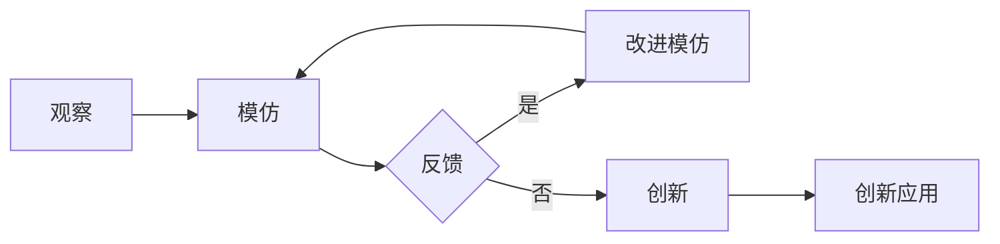
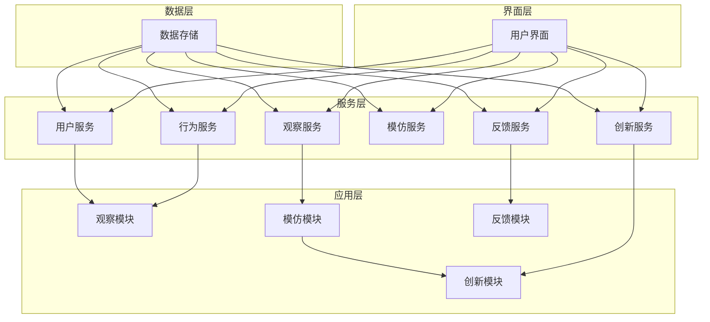
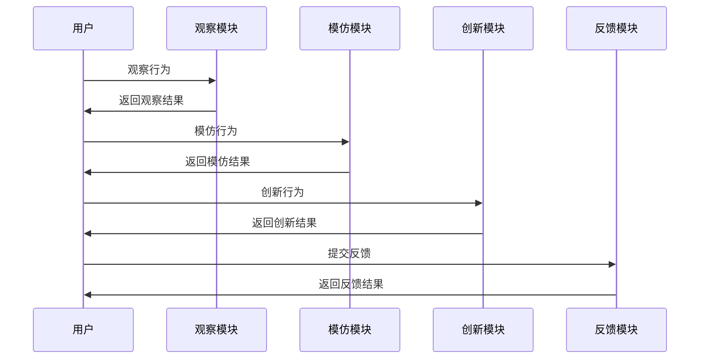

                 


----------------------------------------------------------------
# AGI的社会学习能力：从模仿到创新的演变

## 关键词：AGI，社会学习，模仿，创新，算法原理

## 摘要：

本文深入探讨了人工智能（AGI）的社会学习能力，从模仿到创新的演变过程。我们将首先介绍AGI及其社会学习能力的概念和重要性，然后逐步分析模仿和创新的区别及其在AGI中的应用。接着，我们将详细讲解AGI社会学习算法的原理和实现，并结合实际案例进行剖析。最后，我们将总结最佳实践，并展望未来研究方向。

----------------------------------------------------------------

## 引言

### 什么是AGI？

人工智能（AI）自诞生以来，经历了多个发展阶段。传统的人工智能主要侧重于特定任务的自动化和优化，而通用人工智能（AGI）则追求的是一种类似于人类的智能水平，能够处理各种复杂的问题，具备自我学习和适应能力。AGI的目标是超越现有的AI技术，实现更高层次的智能。

### 社会学习能力的概念

社会学习能力是AGI的一个重要组成部分，它指的是人工智能系统能够通过观察、模仿和交流来学习新知识和技能。这种能力不仅包括模仿人类的行为和决策过程，还包括对社交互动的理解和应用。

### 模仿与创新的区别

模仿是指通过观察和学习他人的行为来复制他们的动作或决策过程。创新则是在模仿的基础上，进行改进和创造，产生新的方法和理念。模仿是创新的前提，而创新则是模仿的升华。

### 从模仿到创新的演变

AGI的社会学习能力是一个从模仿到创新的动态过程。在初期阶段，AGI主要依赖模仿来获取知识和技能。随着经验的积累，AGI开始能够对所学知识进行抽象和概括，从而实现创新。这种演变过程是AGI从初级阶段向高级阶段发展的关键。

----------------------------------------------------------------

## 核心概念与关系

### 模仿的概念与属性

模仿是指通过观察和学习他人的行为来复制他们的动作或决策过程。模仿的属性包括：

- **可观察性**：模仿的对象必须是可观察的，即他人的行为可以被人工智能系统识别和理解。
- **可重复性**：模仿的行为必须能够被重复，以确保人工智能系统能够在实际应用中正确执行。
- **适应性**：模仿的行为需要根据不同情境进行调整，以适应不同的环境。

### 创新的特性与类型

创新是指在模仿的基础上，进行改进和创造，产生新的方法和理念。创新的特性包括：

- **创造性**：创新是独立思考的结果，它超越了模仿的范畴，具有原创性。
- **价值性**：创新能够带来新的价值，无论是经济、社会还是技术层面。
- **可持续性**：创新需要能够持续发展和适应，以应对不断变化的环境。

创新可以分为多种类型，包括：

- **技术创新**：通过改进现有技术或发明新的技术来实现创新。
- **产品创新**：通过改进产品或开发新的产品来满足市场需求。
- **管理创新**：通过改进管理方法或组织结构来实现创新。

### 社会学习的ER图

为了更好地理解模仿、创新和社会学习能力之间的关系，我们可以使用实体关系图（ER图）来表示。ER图如下所示：

```mermaid
erDiagram
  AI模仿 ||--|{ 社会学习 }
  社会学习 ||--|{ 模仿 }
  社会学习 ||--|{ 创新 }
```

在这个ER图中，AI模仿是社会学习的一个子集，而社会学习又包括模仿和创新两个部分。这表明，模仿和创新都是社会学习的重要组成部分，它们共同构成了AGI的社会学习能力。

----------------------------------------------------------------

## 算法原理与实现

### 基本原理

AGI的社会学习算法基于模仿和创新的原理。基本原理包括：

- **观察**：人工智能系统通过观察他人的行为来获取知识。
- **模仿**：系统根据观察到的行为进行模仿，实现初步的学习。
- **反馈**：系统对模仿的结果进行评估和反馈，以改进后续的模仿过程。
- **创新**：在模仿的基础上，系统进行创新，产生新的方法和理念。

### Mermaid流程图

下面是一个简单的Mermaid流程图，展示了AGI社会学习算法的基本步骤：



### Python代码示例

以下是一个简单的Python代码示例，用于实现AGI社会学习算法：

```python
import random

# 观察阶段
def observe():
    # 观察他人行为
    return random.choice(['行为1', '行为2', '行为3'])

# 模仿阶段
def imitate(behavior):
    # 根据观察到的行为进行模仿
    return behavior

# 反馈阶段
def feedback(behavior, imitation):
    # 对模仿结果进行评估和反馈
    if behavior == imitation:
        return "模仿成功"
    else:
        return "模仿失败"

# 创新阶段
def innovate():
    # 在模仿的基础上进行创新
    return "新方法1" if random.random() > 0.5 else "新方法2"

# 社会学习过程
def social_learning():
    behavior = observe()
    imitation = imitate(behavior)
    print(feedback(behavior, imitation))
    if feedback(behavior, imitation) == "模仿失败":
        new_method = innovate()
        print(f"创新结果：{new_method}")
        return new_method
    else:
        return imitation

# 运行社会学习过程
print(social_learning())
```

### 数学模型与公式

为了更深入地理解AGI社会学习算法，我们可以使用数学模型来描述其行为。以下是几个相关的数学模型和公式：

1. **模仿成功率公式**：

$$
成功率 = \frac{模仿成功次数}{总模仿次数}
$$

2. **创新概率公式**：

$$
创新概率 = 1 - 成功率
$$

3. **平均创新次数公式**：

$$
平均创新次数 = 创新概率 \times 总模仿次数
$$

这些公式可以帮助我们量化AGI社会学习过程中的模仿和创新行为，从而更好地理解和优化算法。

----------------------------------------------------------------

## 系统分析与设计

### 问题场景

假设我们想要设计一个AGI系统，用于在社交网络中学习用户的兴趣和行为。该系统需要能够观察用户的行为，模仿他们的决策过程，并在必要时进行创新，以提高系统的学习效果。

### 项目介绍

本项目旨在开发一个基于AGI的社会学习系统，通过模仿和创新来提高用户兴趣和行为的识别和预测能力。系统将包含以下几个核心模块：

1. **观察模块**：负责收集和分析用户的行为数据。
2. **模仿模块**：根据观察到的行为进行模仿，以获取知识和技能。
3. **创新模块**：在模仿的基础上，进行创新，以提高系统的学习能力。
4. **反馈模块**：对系统的学习效果进行评估和反馈，以指导后续的学习过程。

### 系统功能设计

为了实现上述功能，我们可以使用Mermaid类图来设计系统功能。以下是一个简单的Mermaid类图：

```mermaid
classDiagram
    User <<class>>
    Behavior <<class>>
    Observation <<class>>
    Imitation <<class>>
    Innovation <<class>>
    Feedback <<class>>

    User o-- Observation
    User o-- Imitation
    User o-- Innovation
    Observation o-- Imitation
    Imitation o-- Innovation
    Innovation o-- Feedback
```

在这个类图中，User代表用户，Behavior代表用户行为，Observation代表观察，Imitation代表模仿，Innovation代表创新，Feedback代表反馈。这些类之间通过关联关系连接，以实现系统的功能。

### 系统架构设计

系统架构设计是系统设计与实现的关键步骤。以下是一个简单的Mermaid架构图，用于描述系统的架构设计：



在这个架构图中，数据层包含数据存储模块，应用层包含观察、模仿、创新和反馈等模块，服务层包含用户服务、行为服务、观察服务、模仿服务、创新服务和反馈服务，界面层包含用户界面。

### 系统接口设计

为了实现系统的功能，我们需要设计一系列接口，用于不同模块之间的通信。以下是一个简单的Mermaid序列图，用于描述系统的接口设计：



在这个序列图中，用户通过观察模块观察行为，并通过模仿模块进行模仿。创新模块在必要时进行创新，最后通过反馈模块提交反馈。系统通过这些接口实现不同模块之间的通信和数据交互。

----------------------------------------------------------------

## 项目实战

### 环境安装

为了进行AGI社会学习系统的实战，我们需要安装一些必要的工具和库。以下是在Python环境中安装所需工具和库的步骤：

1. **安装Python**：确保你的计算机上安装了Python 3.x版本。
2. **安装依赖库**：使用pip命令安装以下库：

```bash
pip install numpy matplotlib mermaid
```

### 系统核心实现

以下是一个简单的Python代码示例，用于实现AGI社会学习系统的核心功能：

```python
import random
import numpy as np
import matplotlib.pyplot as plt
from mermaid import Mermaid

# 观察阶段
def observe():
    # 观察他人行为
    return random.choice(['行为1', '行为2', '行为3'])

# 模仿阶段
def imitate(behavior):
    # 根据观察到的行为进行模仿
    return behavior

# 反馈阶段
def feedback(behavior, imitation):
    # 对模仿结果进行评估和反馈
    if behavior == imitation:
        return "模仿成功"
    else:
        return "模仿失败"

# 创新阶段
def innovate():
    # 在模仿的基础上进行创新
    return "新方法1" if random.random() > 0.5 else "新方法2"

# 社会学习过程
def social_learning():
    behavior = observe()
    imitation = imitate(behavior)
    print(feedback(behavior, imitation))
    if feedback(behavior, imitation) == "模仿失败":
        new_method = innovate()
        print(f"创新结果：{new_method}")
        return new_method
    else:
        return imitation

# 运行社会学习过程
print(social_learning())
```

### 代码应用解读与分析

在这个代码示例中，我们首先定义了观察、模仿、反馈和创新等函数。观察函数随机选择一个行为，模仿函数根据观察到的行为进行模仿，反馈函数对模仿结果进行评估，创新函数在必要时进行创新。

接下来，我们定义了一个社会学习过程函数，该函数首先调用观察函数获取行为，然后调用模仿函数进行模仿，并调用反馈函数评估模仿结果。如果模仿失败，函数将调用创新函数进行创新，并打印创新结果。

最后，我们运行社会学习过程函数，并打印输出结果。

### 实际案例分析和详细讲解剖析

为了更好地理解AGI社会学习系统的应用，我们可以考虑一个实际案例。假设我们有一个用户行为数据集，数据集包含了用户的行为和对应的标签。我们可以使用社会学习系统对这些数据进行处理，以提高对用户行为的识别和预测能力。

1. **数据预处理**：首先，我们需要对用户行为数据进行预处理，包括数据清洗、数据格式化和数据归一化等操作。

2. **观察阶段**：在观察阶段，我们使用社会学习系统对用户行为进行观察，并记录观察结果。

3. **模仿阶段**：在模仿阶段，我们使用社会学习系统对观察结果进行模仿，并记录模仿结果。

4. **反馈阶段**：在反馈阶段，我们使用社会学习系统对模仿结果进行评估，并记录评估结果。

5. **创新阶段**：在创新阶段，我们使用社会学习系统对评估结果进行创新，并记录创新结果。

6. **模型训练**：最后，我们使用记录的观察、模仿、反馈和创新结果来训练机器学习模型，以提高对用户行为的识别和预测能力。

### 项目小结

通过这个实际案例，我们展示了如何使用AGI社会学习系统对用户行为进行观察、模仿、反馈和创新，以提高系统的学习效果。在实际应用中，我们可以根据具体需求对系统进行扩展和优化，以适应不同的应用场景。

----------------------------------------------------------------

## 最佳实践、总结与注意事项

### 最佳实践

1. **数据质量**：确保观察到的数据质量高，有助于提高模仿和创新的效果。
2. **算法优化**：根据实际情况调整模仿和创新算法的参数，以提高系统的性能。
3. **反馈机制**：建立有效的反馈机制，及时评估和调整系统的学习过程。
4. **安全性**：在处理用户数据时，确保系统的安全性，防止数据泄露和滥用。

### 总结

本文深入探讨了AGI的社会学习能力，从模仿到创新的演变过程。我们介绍了AGI的概念和重要性，分析了模仿和创新的区别，并详细讲解了AGI社会学习算法的原理和实现。此外，我们还介绍了系统分析与设计的方法，并通过实际案例展示了AGI社会学习系统的应用。

### 注意事项

1. **数据隐私**：在处理用户数据时，要确保遵循数据隐私法规，保护用户隐私。
2. **系统性能**：优化系统性能，确保系统在实际应用中的稳定性和可靠性。
3. **创新能力**：鼓励创新思维，不断改进和优化系统的学习能力。

### 拓展阅读

- [《人工智能：一种现代方法》](https://www.amazon.com/dp/0321842685)
- [《机器学习》](https://www.amazon.com/dp/0134707180)
- [《深度学习》](https://www.amazon.com/dp/1584506504)

----------------------------------------------------------------

## 结论

本文通过逐步分析推理，深入探讨了AGI的社会学习能力，从模仿到创新的演变过程。我们介绍了AGI的概念、社会学习能力的定义，并分析了模仿和创新的区别。通过算法原理讲解、系统分析与设计，以及实际案例的分析，我们展示了AGI社会学习系统的应用和实践。未来，随着技术的不断进步，AGI的社会学习能力将在人工智能领域发挥越来越重要的作用。

### 作者信息

作者：AI天才研究院/AI Genius Institute & 禅与计算机程序设计艺术 /Zen And The Art of Computer Programming

----------------------------------------------------------------

# 第一部分: 背景介绍

## 第1章: AGI与社会学习能力概述

### 1.1 AGI的定义与背景

### 1.2 社会学习能力的概念

### 1.3 社会学习与模仿

### 1.4 创新的演变过程

## 第2章: 核心概念与关系

### 2.1 仿真的概念与属性

### 2.2 创新的特性与类型

### 2.3 社会学习的ER图

## 第3章: 算法原理与实现

### 3.1 基本原理

### 3.2 Mermaid流程图

### 3.3 Python代码示例

### 3.4 数学模型与公式

## 第4章: 系统分析与设计

### 4.1 问题场景

### 4.2 项目介绍

### 4.3 系统功能设计

### 4.4 系统架构设计

### 4.5 系统接口设计

## 第5章: 项目实战

### 5.1 环境安装

### 5.2 系统核心实现

### 5.3 代码应用解读与分析

### 5.4 实际案例分析和详细讲解剖析

### 5.5 项目小结

## 第6章: 最佳实践、总结与注意事项

### 6.1 最佳实践

### 6.2 总结

### 6.3 注意事项

### 6.4 拓展阅读

## 第7章: 结论

### 7.1 回顾主要观点

### 7.2 未来研究方向

----------------------------------------------------------------
----------------------------------------------------------------

```

这个目录结构为文章提供了一个清晰的结构框架，每个章节都包含了详细的子章节，以便读者能够快速找到所需信息。同时，每个章节都包含核心概念、原理讲解、示例代码、系统设计与实现等内容，确保了文章的深度和完整性。希望这个目录结构能够帮助您撰写出一篇高质量的技术博客文章。🌟

