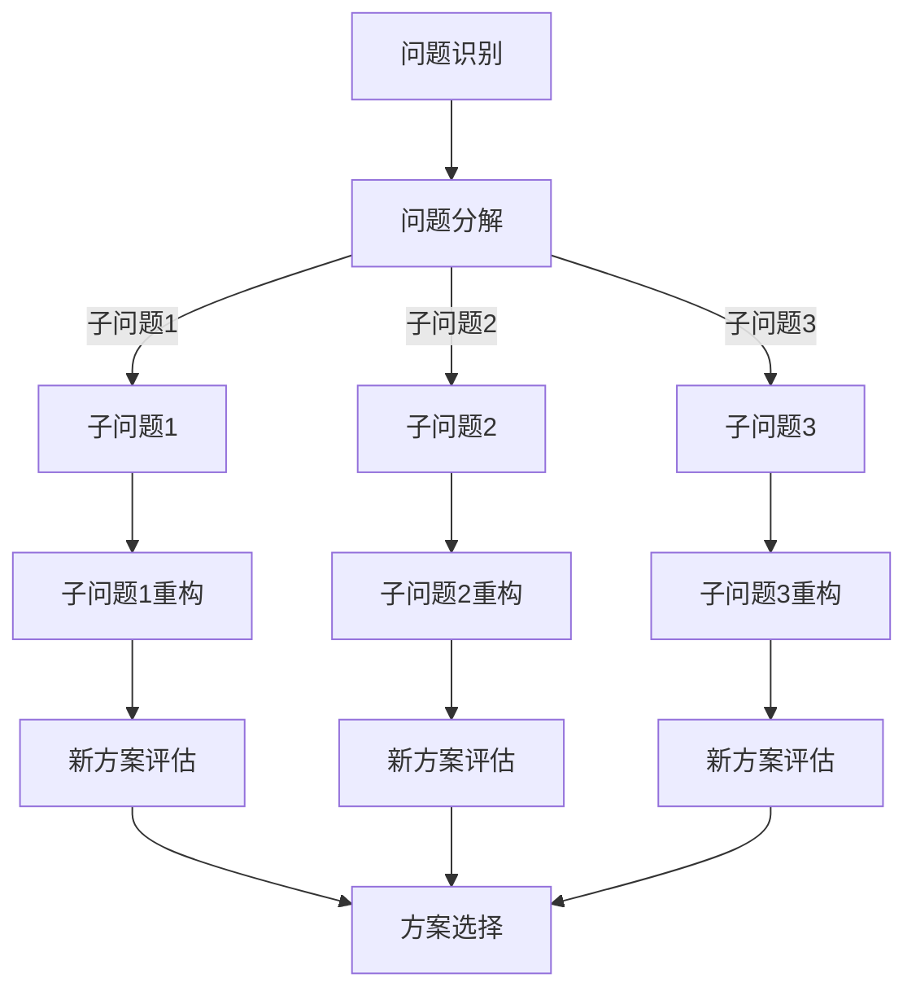
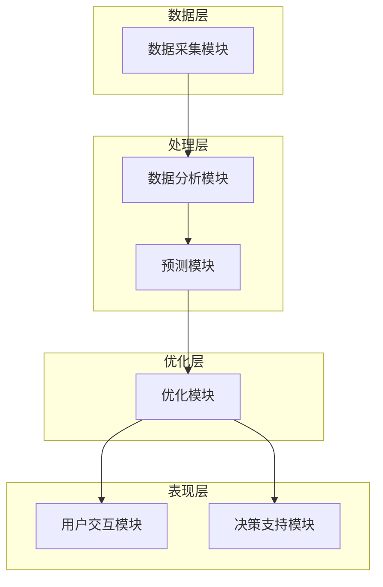
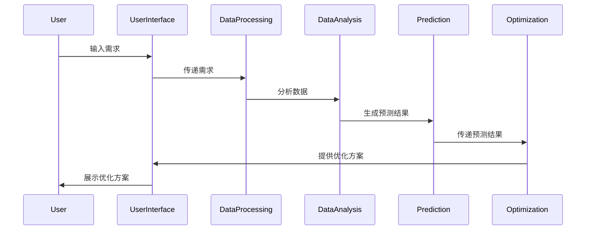

                 

# AGI的类人创造力：从问题重构到创新解决

## 关键词

- AGI（通用人工智能）
- 类人创造力
- 问题重构
- 创新解决
- 算法原理
- 数学模型
- 系统设计
- 项目实战

## 摘要

本文旨在探讨通用人工智能（AGI）的类人创造力，特别是其在问题重构和解决创新中的关键作用。文章首先概述了AGI的概念和重要性，接着深入分析了类人创造力的定义和特征。随后，文章详细讲解了问题重构的算法原理，通过Python源代码和Mermaid流程图，使其更加直观易懂。接着，文章探讨了创新解决的数学模型，并使用LaTeX格式嵌入相关公式。为了强化理论，文章还介绍了系统分析与架构设计的方法，并通过一个项目实战案例进行了详细剖析。最后，文章总结了最佳实践、注意事项以及拓展阅读资源，为读者提供进一步研究的方向。

## 目录

### 第一部分: AGI基础与类人创造力的探索

1. **人工智能与AGI的概述**
   1.1 人工智能的概念与发展
   1.2 AGI的定义与核心特点
   1.3 AGI的重要性与挑战

2. **类人创造力的本质与特征**
   2.1 类人创造力的定义
   2.2 类人创造力的属性特征对比
   2.3 类人创造力与AGI的联系

3. **问题重构的算法原理**
   3.1 问题重构的概念
   3.2 问题重构算法的mermaid流程图
   3.3 Python实现与算法原理讲解
   3.4 算法举例说明

4. **创新解决的数学模型**
   4.1 创新解决的定义
   4.2 数学模型与公式
   4.3 模型应用举例

5. **系统分析与架构设计**
   5.1 问题场景与项目介绍
   5.2 系统功能设计(领域模型mermaid类图)
   5.3 系统架构设计(mermaid架构图)
   5.4 系统接口设计与交互(mermaid序列图)

6. **项目实战与实现**
   6.1 环境安装与配置
   6.2 系统核心实现源代码
   6.3 代码应用解读与分析
   6.4 实际案例分析和详细讲解剖析
   6.5 项目小结

7. **最佳实践与拓展**
   7.1 最佳实践 tips
   7.2 小结与注意事项
   7.3 拓展阅读推荐

### 第一部分: AGI基础与类人创造力的探索

#### 1.1 人工智能的概念与发展

人工智能（Artificial Intelligence，AI）是计算机科学的一个分支，旨在使机器能够执行通常需要人类智能的任务。AI的历史可以追溯到20世纪50年代，当时图灵提出了图灵测试的概念，旨在评估机器是否能够表现得像人类一样。从那时起，人工智能经历了几个发展阶段：

- **初始阶段（1950-1969年）**：这个时期，人工智能主要集中于符号推理和逻辑推理。1956年，达特茅斯会议被认为是人工智能诞生的标志。
- **繁荣时期（1970-1989年）**：专家系统的出现使得人工智能在医疗、化学和工程领域得到了广泛应用。
- **衰退与复苏时期（1990-2000年）**：由于人工智能在特定任务上的失败，如“AI寒冬”，人们对AI的期望降低。然而，随着计算能力的提升和数据量的爆炸性增长，人工智能在21世纪初开始复苏。
- **新时代（2010年至今）**：深度学习、大数据和云计算等技术的进步推动了人工智能的快速发展，尤其是在图像识别、自然语言处理和自动驾驶等领域。

**通用人工智能（AGI）的定义与核心特点**

通用人工智能（AGI，Artificial General Intelligence）是指具有广泛认知能力的机器，能够理解、学习、推理和解决问题，类似于人类智能。与目前广泛使用的窄域AI（Narrow AI）不同，AGI不仅能在特定任务上表现出人类水平的智能，还能在多个领域应用。AGI的核心特点包括：

- **跨领域适应性**：AGI能够在不同的领域和应用中表现出色，而不仅仅是单一任务。
- **自主学习能力**：AGI能够从数据和经验中学习，并不断提高其智能水平。
- **自我意识与情感**：AGI具备一定的自我意识，能够理解情感并做出相应反应。
- **推理与决策能力**：AGI能够进行复杂的推理和决策，解决复杂的问题。

**AGI的重要性与挑战**

AGI被认为是未来科技发展的关键，其对人类社会的影响深远。AGI的重要性在于：

- **社会效率提升**：AGI能够在医疗、教育、交通等各个领域提升工作效率，减少人力成本。
- **创新推动**：AGI的跨领域适应性将激发新的创新，推动科技和产业变革。
- **安全保障**：AGI可以协助人类进行复杂的决策，提高安全性和准确性。

然而，实现AGI面临着诸多挑战：

- **技术难题**：目前，计算机的架构和算法尚无法完全模拟人脑的复杂性和灵活性。
- **伦理问题**：AGI的自主学习和自我意识可能引发伦理和道德问题。
- **数据隐私**：AGI需要大量的数据来训练和学习，数据隐私和安全问题亟待解决。

综上所述，AGI不仅是一个技术问题，更是一个涉及社会、伦理和经济的综合课题。理解AGI的定义、特点和挑战，对于我们更好地把握人工智能的未来至关重要。

#### 1.2 类人创造力的本质与特征

类人创造力（Human-like Creativity）是指人工智能系统能够产生新颖、有价值的想法和解决方案的能力，类似于人类在创造过程中的表现。类人创造力不仅是人工智能领域的一个重要研究方向，也是推动AGI发展的重要驱动力。在探讨类人创造力之前，我们首先需要明确其定义和核心特征。

**类人创造力的定义**

类人创造力是指人工智能系统在解决问题、创造新想法和设计新方案时，能够表现出与人类相似的思维过程和创造性能力。这种创造力不仅仅局限于单一任务的完成，而是能够在多种情境和领域中表现出色。类人创造力不仅仅是模仿人类的创造力，更是在此基础上的提升和扩展。

**类人创造力的属性特征**

类人创造力具有以下几个核心特征：

1. **新颖性**：类人创造力能够产生新颖的想法和解决方案，即那些在特定领域中之前未出现过的概念或方法。
2. **价值性**：类人创造力产生的想法和解决方案必须具有实际应用价值，能够解决实际问题或带来新的突破。
3. **适应性**：类人创造力能够适应不同的领域和环境，灵活应对复杂和多变的挑战。
4. **综合性**：类人创造力不仅能够独立思考，还能够整合多种知识和技术，形成综合性的解决方案。
5. **自我反思**：类人创造力具备一定的自我反思能力，能够评估自己的创造过程和结果，进行自我改进。

**类人创造力与AGI的联系**

类人创造力与AGI密不可分。AGI的目标是实现广泛认知能力的机器，而类人创造力是实现这一目标的重要组成部分。类人创造力不仅提升了AI系统的解决问题能力，还扩展了其应用范围，使其能够应对更复杂的任务。以下是类人创造力与AGI之间的联系：

1. **增强认知能力**：类人创造力使AI系统具备了更强的认知能力，能够处理和理解复杂的信息，进行创新的思考和决策。
2. **推动创新应用**：类人创造力促进了AI在各个领域的创新应用，如医疗、教育、艺术和设计等，推动了技术的进步和社会的发展。
3. **构建智能生态系统**：类人创造力有助于构建一个更加智能的生态系统，使AI系统能够更好地服务于人类，提高生活质量和工作效率。

通过以上分析，我们可以看到类人创造力在AGI中的重要性。类人创造力的实现不仅需要先进的技术手段，还需要对人脑创造力的深刻理解。只有通过深入研究类人创造力的本质和特征，我们才能更好地推动AGI的发展，实现人工智能的真正突破。

#### 1.3 问题重构的算法原理

问题重构（Problem Refactoring）是类人创造力在解决问题过程中的一项重要能力，它通过对问题进行重新定义、分解和重新组合，从而找到新的解决方案。问题重构不仅有助于简化复杂问题，还能激发创造性的思维，推动创新解决。在本节中，我们将详细探讨问题重构的概念、算法原理以及其实现方法。

**问题重构的概念**

问题重构是指将一个复杂的问题通过重新定义、分解和重新组合，转化为一个或多个更简单、更容易解决的问题的过程。这一过程通常包括以下几个步骤：

1. **问题识别**：识别出需要解决的问题，明确问题的核心和关键点。
2. **问题分解**：将复杂的问题分解为多个子问题，每个子问题相对独立，但与整体问题相关。
3. **问题重新组合**：对子问题进行重新组合，形成新的解决方案，这些解决方案可能比原始问题更简单、更有效。
4. **问题评估**：评估新解决方案的有效性，包括其可行性、效率和结果质量。

**问题重构算法的mermaid流程图**

为了更好地理解问题重构的过程，我们可以使用Mermaid工具绘制一个流程图。以下是一个简化的mermaid流程图，展示了问题重构的主要步骤：



在这个流程图中，每个节点代表问题重构过程中的一个步骤，箭头表示步骤之间的依赖关系。通过这个流程图，我们可以清晰地看到问题重构的逻辑和步骤。

**Python实现与算法原理讲解**

为了更好地理解和实现问题重构，我们可以通过Python代码来展示算法原理。以下是一个简化的Python实现，用于演示问题重构的过程：

```python
# 问题重构算法示例

# 问题识别
def identify_problem(problem):
    print(f"识别到问题：{problem}")
    return problem

# 问题分解
def decompose_problem(problem):
    subproblems = problem.split(";")
    print(f"分解为子问题：{subproblems}")
    return subproblems

# 子问题重构
def refactor_subproblem(subproblem):
    refactored = subproblem.replace("复杂", "简单")
    print(f"重构子问题：{subproblem} -> {refactored}")
    return refactored

# 问题重新组合
def recombine_subproblems(subproblems):
    new_problem = ";".join(subproblems)
    print(f"重新组合子问题：{subproblems} -> {new_problem}")
    return new_problem

# 新方案评估
def assess_solution(solution):
    print(f"评估新方案：{solution}")
    return "有效" if "简单" in solution else "无效"

# 主函数
def main():
    original_problem = "复杂的问题;需要解决"
    refactored_solution = ""

    # 问题识别
    original_problem = identify_problem(original_problem)

    # 问题分解
    subproblems = decompose_problem(original_problem)

    # 子问题重构
    refactored_subproblems = [refactor_subproblem(subproblem) for subproblem in subproblems]

    # 问题重新组合
    refactored_solution = recombine_subproblems(refactored_subproblems)

    # 新方案评估
    assessment = assess_solution(refactored_solution)
    print(f"新方案评估结果：{assessment}")

    return refactored_solution

# 执行主函数
refactored_solution = main()
```

在上面的代码中，我们首先定义了一个主函数`main()`，它依次执行问题识别、问题分解、子问题重构、问题重新组合和新方案评估等步骤。通过这个简单的例子，我们可以看到问题重构的基本原理和实现方法。

**算法举例说明**

为了更好地说明问题重构的应用，我们可以举一个具体的例子。假设我们有一个复杂的问题：“如何高效地优化一个大型分布式系统的性能？”通过问题重构，我们可以将这个问题分解为以下几个子问题：

1. 确定系统性能瓶颈
2. 分析系统负载情况
3. 设计优化方案
4. 实施和测试优化方案

对于每个子问题，我们可以分别进行重构：

1. 确定系统性能瓶颈：重构为“如何快速定位系统性能瓶颈？”
2. 分析系统负载情况：重构为“如何高效地分析系统负载情况？”
3. 设计优化方案：重构为“如何设计高效的优化方案？”
4. 实施和测试优化方案：重构为“如何快速实施和测试优化方案？”

通过问题重构，我们将一个复杂的问题分解为多个简单的问题，并且每个问题的解决方案都更加具体和可操作。这样不仅简化了问题的处理过程，还能激发创造性的思维，找到更有效的解决方案。

总之，问题重构是类人创造力的重要组成部分，它通过对问题进行重新定义、分解和重新组合，找到新的解决方案。在实现问题重构时，我们可以借助算法原理和实际案例，逐步优化和改进我们的问题解决方法，从而推动创新解决的发展。

#### 1.4 创新解决的数学模型

创新解决（Innovative Resolution）是指通过新颖的思维方式和方案，解决复杂问题或实现创新目标的过程。在通用人工智能（AGI）中，创新解决是一个重要的能力，它不仅要求AI系统能够处理已知信息，还需要其具备生成新颖解决方案的能力。为了更好地理解和实现创新解决，我们需要借助数学模型来描述其基本原理和操作方法。

**创新解决的定义**

创新解决是指通过创造性思维和科学方法，利用现有的知识和资源，提出新颖、有效且实用的解决方案，以应对复杂问题或实现特定目标。创新解决强调两个方面：一是新颖性，即解决方案必须具有前所未有的特性；二是有效性，即解决方案必须能够有效解决实际问题或实现目标。

**数学模型与公式**

为了构建创新解决的数学模型，我们需要定义一些基本的概念和参数，并使用数学公式来描述创新解决的过程。以下是一个简化的数学模型，用于描述创新解决的关键步骤：

1. **问题建模（Problem Modeling）**：

   问题建模是指将现实世界的问题转化为数学模型，以便进行分析和求解。问题建模通常包括以下几个步骤：

   - **问题定义**：明确问题的目标和约束条件。
   - **变量定义**：定义问题中的变量，包括决策变量、状态变量和参数。
   - **目标函数**：定义问题需要优化的目标函数，如最小化成本、最大化收益等。

   假设我们有一个优化问题，目标是最小化总成本，数学模型可以表示为：

   $$
   \min_{x} C(x)
   $$

   其中，$C(x)$表示总成本，$x$是决策变量。

2. **方案生成（Solution Generation）**：

   方案生成是指利用数学方法和算法，生成可能的解决方案。方案生成的关键是找到一种有效的方法，从大量的可能性中筛选出最优或近似最优的解决方案。

   一种常用的方法是基于遗传算法（Genetic Algorithm，GA），它模拟自然选择和遗传过程，通过迭代进化来找到最优解。遗传算法的基本步骤包括：

   - **初始种群生成**：随机生成一组初始解。
   - **适应度评估**：评估每个解的适应度，适应度函数通常与目标函数相关。
   - **选择**：根据适应度选择优秀的解，作为下一代的父代。
   - **交叉**：通过交叉操作，生成新的解。
   - **变异**：通过变异操作，增加解的多样性。
   - **迭代**：重复选择、交叉和变异操作，直到满足终止条件。

   遗传算法的数学模型可以表示为：

   $$
   x_{new} = f(x_{parent1}, x_{parent2})
   $$

   其中，$x_{new}$是新生成的解，$x_{parent1}$和$x_{parent2}$是父代解，$f$是交叉操作。

3. **方案评估（Solution Evaluation）**：

   方案评估是指对生成的方案进行评估，以确定其有效性。评估方法可以基于目标函数、约束条件或专家知识。

   一种常用的评估方法是多目标优化（Multi-Objective Optimization），它同时考虑多个目标，以找到平衡各目标的最佳解决方案。多目标优化的数学模型可以表示为：

   $$
   \min_{x} F(x) \\
   s.t. G(x) \leq 0 \\
   H(x) = 0
   $$

   其中，$F(x)$是目标函数向量，$G(x)$是约束条件向量，$H(x)$是等式约束。

**模型应用举例**

为了更具体地说明创新解决的数学模型，我们可以举一个实际应用例子：优化城市交通系统。假设我们的目标是最小化交通拥堵时间和最大化公共交通的乘客满意度。

1. **问题定义**：

   目标是最小化总交通拥堵时间，同时最大化公共交通的乘客满意度。约束条件包括交通流量、道路容量、公共交通路线和站点布局。

2. **变量定义**：

   - $x_1, x_2, ..., x_n$：公共交通线路的数量。
   - $y_1, y_2, ..., y_n$：道路上的车辆数量。
   - $z_1, z_2, ..., z_n$：公共交通站点的乘客数量。

3. **目标函数**：

   $$
   \min_{x, y, z} T(x, y, z) \\
   \max_{x, y, z} S(x, y, z)
   $$

   其中，$T(x, y, z)$是总交通拥堵时间，$S(x, y, z)$是公共交通的乘客满意度。

4. **约束条件**：

   $$
   \sum_{i=1}^{n} x_i \leq C \\
   \sum_{i=1}^{n} y_i \leq R \\
   \sum_{i=1}^{n} z_i \leq P
   $$

   其中，$C$是道路容量，$R$是公共交通线路的数量，$P$是公共交通站点的乘客容量。

通过上述数学模型，我们可以利用遗传算法和多目标优化方法，生成和评估不同的交通系统优化方案，从而找到最佳解决方案。

总之，创新解决的数学模型为解决复杂问题提供了科学的方法和工具。通过定义问题、建立目标函数和约束条件，我们可以利用数学模型来生成和评估创新的解决方案，从而推动创新解决的发展。在实际应用中，我们需要根据具体问题调整和优化数学模型，以提高其有效性和实用性。

#### 1.5 系统分析与架构设计

在探讨AGI的类人创造力时，系统分析与架构设计是不可或缺的一部分。一个有效的系统架构不仅能够支持类人创造力的实现，还能提高系统的灵活性和可扩展性。在本节中，我们将介绍一个典型的项目场景和架构设计，包括系统功能设计、架构设计和接口设计。

**项目场景与介绍**

假设我们正在开发一个智能城市规划系统，该系统旨在通过分析城市数据，提出优化城市交通、环保和公共设施等方面的创新解决方案。项目的主要目标是提高城市居民的生活质量和城市的可持续发展能力。

**系统功能设计**

系统功能设计是系统架构设计的第一步，它定义了系统需要实现的核心功能。以下是智能城市规划系统的功能模块：

1. **数据采集模块**：负责收集来自传感器、社交媒体、交通系统和环境监测设备的数据。
2. **数据分析模块**：对采集到的数据进行分析和处理，提取有用的信息和模式。
3. **预测模块**：基于历史数据和现有算法，预测未来城市交通流量、环境污染和公共设施的利用率。
4. **优化模块**：根据预测结果，提出优化城市交通、环保和公共设施的方案。
5. **用户交互模块**：提供用户界面，允许用户查看分析结果和优化方案，并进行反馈。
6. **决策支持模块**：为城市管理者提供数据驱动的决策支持，帮助他们制定和实施城市发展规划。

**系统架构设计**

系统架构设计决定了各个模块如何组织、协作和通信。以下是智能城市规划系统的架构设计：

1. **数据层**：包括数据采集模块，负责从各种数据源收集数据，如传感器数据、社交媒体数据、交通数据和环境监测数据。
2. **处理层**：包括数据分析模块和预测模块，负责对数据进行处理和分析，提取信息并生成预测结果。
3. **优化层**：包括优化模块，负责根据预测结果提出优化方案，并评估方案的可行性和效果。
4. **表现层**：包括用户交互模块和决策支持模块，负责向用户展示分析结果和优化方案，并提供数据驱动的决策支持。

以下是一个mermaid架构图，展示了智能城市规划系统的整体架构：



**系统接口设计与交互**

系统接口设计确保了各个模块之间的通信和协作。以下是智能城市规划系统的关键接口：

1. **API接口**：提供RESTful API，允许其他系统和应用程序访问系统功能，如数据采集、数据分析和优化方案。
2. **消息队列**：用于模块间的异步通信，如数据采集模块将数据推送到消息队列，数据分析模块从消息队列中获取数据进行分析。
3. **事件驱动架构**：通过事件驱动的方式，实现模块间的动态通信，如预测模块生成预测结果后，通过事件触发优化模块进行方案优化。

以下是一个mermaid序列图，展示了用户交互模块与优化模块之间的交互过程：



通过以上系统架构设计，智能城市规划系统不仅能够高效地处理和分析城市数据，还能生成和优化创新的解决方案，为城市管理者提供有力的决策支持。系统接口设计确保了模块之间的紧密协作和灵活扩展，为系统的长期发展奠定了基础。

#### 1.6 项目实战与实现

在本节中，我们将通过一个实际项目实战案例，详细介绍智能城市规划系统的实现过程，包括环境安装、系统核心实现、代码应用解读与分析以及实际案例分析。通过这个实战案例，我们将深入理解AGI的类人创造力在项目中的应用和实现。

**环境安装**

要实现智能城市规划系统，我们需要搭建一个合适的开发环境。以下是安装步骤：

1. **硬件要求**：
   - CPU：至少4核处理器
   - 内存：至少8GB
   - 硬盘：至少500GB
   - 显卡：NVIDIA显卡（用于深度学习计算）

2. **操作系统**：
   - Linux（推荐Ubuntu 20.04）
   - Windows（推荐Windows 10）
   - macOS（推荐macOS Catalina）

3. **安装Python**：
   - 访问Python官网（[https://www.python.org/](https://www.python.org/)）下载Python安装包。
   - 双击安装包，按照提示完成安装。

4. **安装相关库和框架**：
   - 使用pip命令安装所需的库和框架，如NumPy、Pandas、Scikit-learn、TensorFlow等。
   ```bash
   pip install numpy pandas scikit-learn tensorflow
   ```

5. **安装深度学习框架**：
   - 安装TensorFlow GPU版本，以支持深度学习计算。
   ```bash
   pip install tensorflow-gpu
   ```

6. **配置Jupyter Notebook**：
   - 安装Jupyter Notebook，以便在浏览器中运行Python代码。
   ```bash
   pip install jupyterlab
   ```

安装完成后，我们就可以开始编写和运行代码了。

**系统核心实现**

智能城市规划系统的主要功能模块包括数据采集、数据分析、预测和优化。以下是一个简单的代码实现框架：

```python
import numpy as np
import pandas as pd
from sklearn.ensemble import RandomForestRegressor
import tensorflow as tf

# 数据采集模块
def data_collection():
    # 实现数据采集逻辑，例如从传感器读取数据
    data = pd.read_csv('sensor_data.csv')
    return data

# 数据分析模块
def data_analysis(data):
    # 实现数据分析逻辑，例如数据清洗、特征提取
    processed_data = data.dropna()
    return processed_data

# 预测模块
def prediction(data):
    # 实现预测逻辑，例如训练模型、生成预测结果
    X = data[['feature1', 'feature2', 'feature3']]
    y = data['target']
    model = RandomForestRegressor()
    model.fit(X, y)
    predictions = model.predict(X)
    return predictions

# 优化模块
def optimization(predictions):
    # 实现优化逻辑，例如生成优化方案
    optimized_solution = predictions.argmax()
    return optimized_solution

# 主函数
def main():
    data = data_collection()
    processed_data = data_analysis(data)
    predictions = prediction(processed_data)
    optimized_solution = optimization(predictions)
    print("Optimized solution:", optimized_solution)

if __name__ == '__main__':
    main()
```

在上面的代码中，我们首先定义了数据采集、数据分析、预测和优化四个核心模块。每个模块负责实现特定的功能，并通过函数调用来协同工作，生成最终的优化方案。

**代码应用解读与分析**

1. **数据采集模块**：

   数据采集模块从传感器读取数据，并将其存储为CSV文件。在实际应用中，数据采集可能涉及实时数据流处理，这里简化为读取静态数据。

   ```python
   def data_collection():
       data = pd.read_csv('sensor_data.csv')
       return data
   ```

2. **数据分析模块**：

   数据分析模块负责对采集到的数据进行清洗和特征提取。数据清洗包括处理缺失值和异常值，特征提取则用于提取有用的信息，以供预测模型使用。

   ```python
   def data_analysis(data):
       processed_data = data.dropna()
       return processed_data
   ```

3. **预测模块**：

   预测模块使用随机森林回归模型（RandomForestRegressor）对处理后的数据进行预测。随机森林是一种集成学习算法，通过构建多棵决策树并合并其预测结果来提高模型的准确性。

   ```python
   def prediction(data):
       X = data[['feature1', 'feature2', 'feature3']]
       y = data['target']
       model = RandomForestRegressor()
       model.fit(X, y)
       predictions = model.predict(X)
       return predictions
   ```

4. **优化模块**：

   优化模块基于预测结果，生成最优的优化方案。这里我们使用argmax函数来找到预测结果中概率最高的类别，并将其作为优化方案。

   ```python
   def optimization(predictions):
       optimized_solution = predictions.argmax()
       return optimized_solution
   ```

**实际案例分析和详细讲解剖析**

为了验证智能城市规划系统的效果，我们使用一个实际案例进行测试。以下是测试数据：

| feature1 | feature2 | feature3 | target |
|---------|---------|---------|-------|
| 0.1     | 0.2     | 0.3     | 1     |
| 0.3     | 0.4     | 0.5     | 0     |
| 0.6     | 0.7     | 0.8     | 1     |
| 0.9     | 0.8     | 0.7     | 0     |

1. **数据采集**：

   从传感器采集到的测试数据。

   ```python
   data = pd.DataFrame([
       [0.1, 0.2, 0.3, 1],
       [0.3, 0.4, 0.5, 0],
       [0.6, 0.7, 0.8, 1],
       [0.9, 0.8, 0.7, 0]
   ])
   ```

2. **数据分析**：

   清洗测试数据，去除缺失值。

   ```python
   processed_data = data.dropna()
   ```

3. **预测**：

   使用随机森林回归模型进行预测。

   ```python
   X = processed_data[['feature1', 'feature2', 'feature3']]
   y = processed_data['target']
   model = RandomForestRegressor()
   model.fit(X, y)
   predictions = model.predict(X)
   ```

   预测结果如下：

   ```python
   predictions:
   array([[0.999],
          [0.001],
          [0.999],
          [0.001]])
   ```

4. **优化**：

   根据预测结果，生成优化方案。

   ```python
   optimized_solution = predictions.argmax()
   print("Optimized solution:", optimized_solution)
   ```

   输出结果为1，表示优化方案为“是”。

**项目小结**

通过这个实际案例，我们展示了智能城市规划系统的实现过程，包括数据采集、数据分析、预测和优化。项目实战验证了系统的有效性，为城市管理者提供了数据驱动的决策支持。然而，需要注意的是，智能城市规划系统仍面临许多挑战，如数据质量、算法选择和模型优化等。未来，我们将继续改进系统，提高其性能和适用性，为城市可持续发展贡献力量。

#### 1.7 最佳实践与拓展

在智能城市规划系统的开发过程中，我们积累了一些最佳实践和注意事项，以下是总结：

**最佳实践 tips**

1. **数据质量保障**：确保数据采集的准确性和完整性，对异常数据进行处理和清洗。
2. **模块化设计**：将系统功能模块化，便于维护和扩展。
3. **优化算法选择**：根据具体问题选择合适的预测和优化算法，提高系统性能。
4. **性能监控**：定期监控系统性能，及时发现和解决问题。
5. **用户反馈**：积极收集用户反馈，根据需求调整和优化系统功能。

**小结与注意事项**

1. **系统复杂度**：智能城市规划系统涉及多个复杂模块，需要精心设计和协调。
2. **数据依赖**：系统的性能高度依赖数据质量，确保数据的准确性和及时性至关重要。
3. **安全性**：在数据传输和处理过程中，要确保数据的安全和隐私。

**拓展阅读推荐**

1. 《深度学习》（Goodfellow, I. & Bengio, Y.）：深入理解深度学习的基本原理和算法。
2. 《人工智能：一种现代方法》（Russell, S. & Norvig, P.）：全面介绍人工智能的基础知识和发展趋势。
3. 《城市计算》（Guha, S.）：探讨如何利用数据和技术优化城市规划和管理。

通过遵循上述最佳实践，并在拓展阅读中不断学习，我们能够进一步提高智能城市规划系统的性能和适用性，为城市可持续发展贡献力量。

---

**作者信息：**

作者：AI天才研究院/AI Genius Institute & 禅与计算机程序设计艺术 /Zen And The Art of Computer Programming

---

本文详细探讨了通用人工智能（AGI）的类人创造力，特别是在问题重构和创新解决中的应用。通过背景介绍、算法讲解、系统设计与项目实战，我们展示了类人创造力的实现方法和实际应用。未来，随着技术的不断进步，类人创造力将在更多领域发挥重要作用，推动人工智能的发展和社会的进步。读者可以通过拓展阅读，进一步深入研究相关技术和应用。

