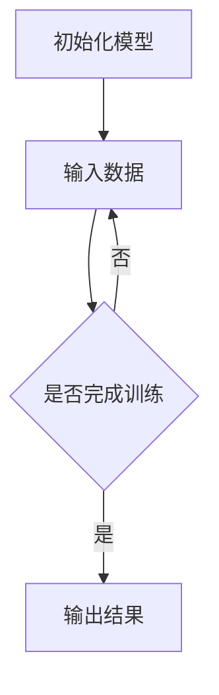
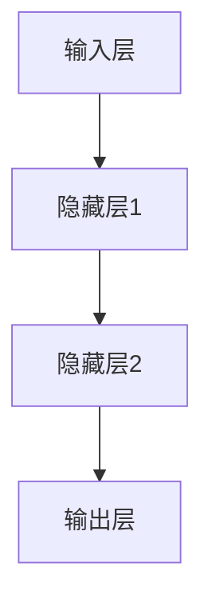
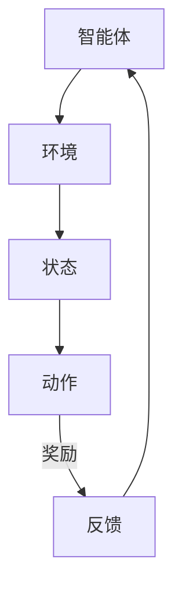
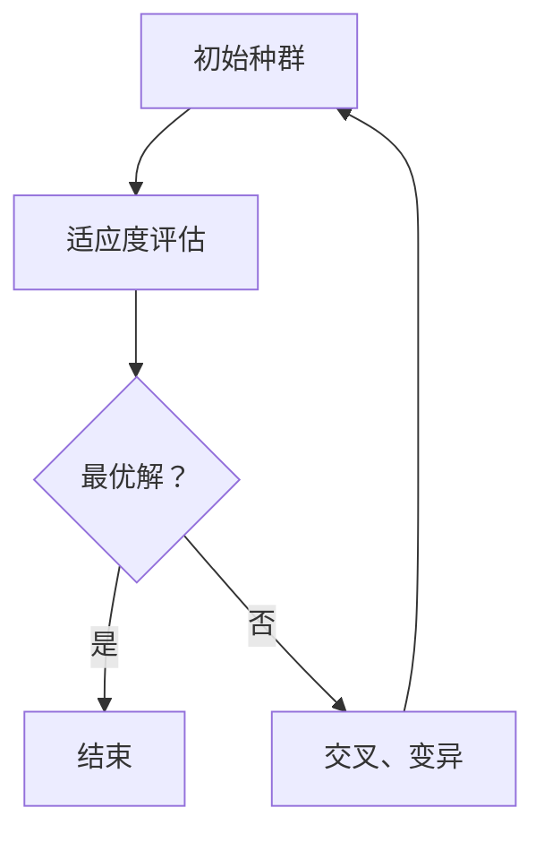
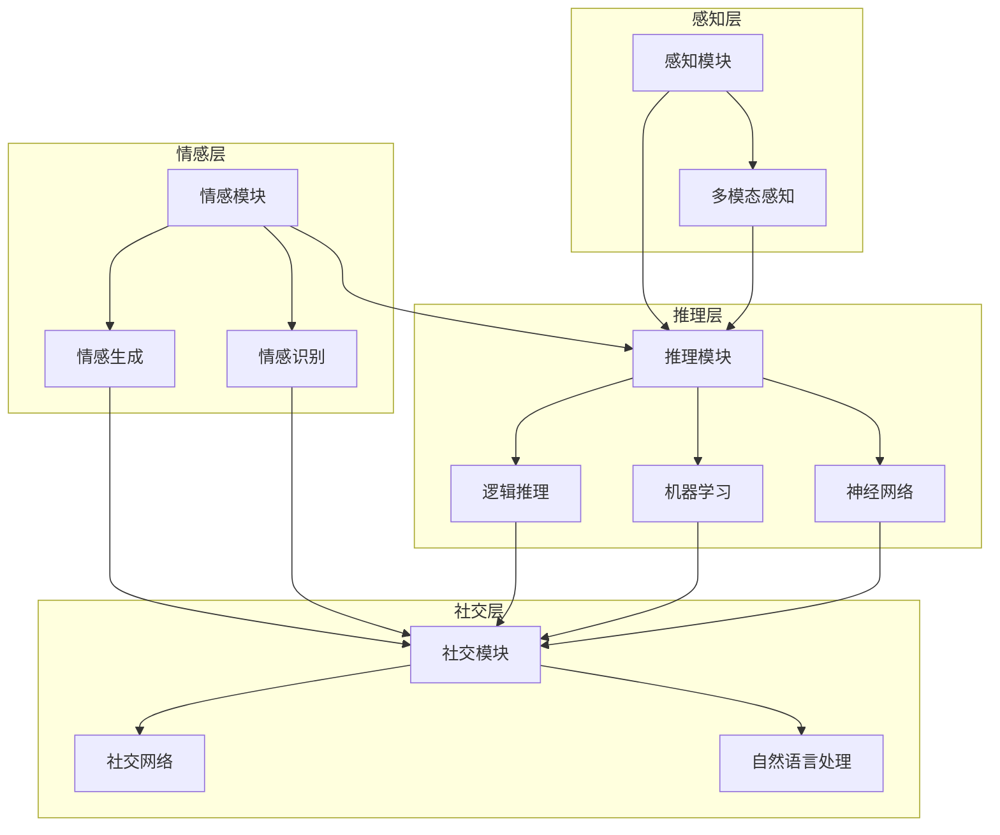
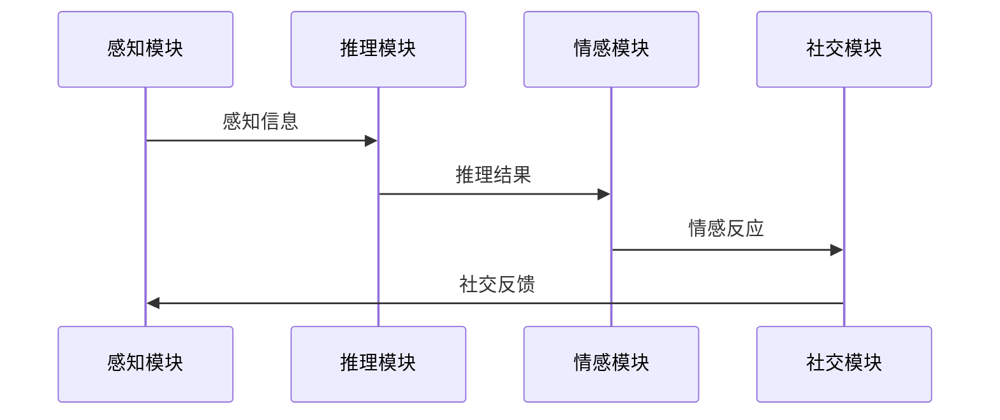

                 

# AGI的类人思维模式模拟研究

关键词：AGI，类人思维模式，数学模型，算法，系统架构

摘要：本文深入探讨了通用人工智能（AGI）的类人思维模式模拟研究。首先，我们介绍了AGI的基本概念和特点，并阐述了类人思维模式的定义和特征。接着，我们详细分析了数学模型和算法原理，包括神经网络模型、决策树模型、贝叶斯网络模型和深度学习算法、强化学习算法、进化算法。在此基础上，我们提出了系统分析与架构设计方案，包括问题场景介绍、系统功能设计、系统架构设计、系统接口设计和系统交互。最后，我们通过实际项目实战，对类人思维模式的模拟进行了详细讲解和剖析，并总结了最佳实践和注意事项。

## 引言

### 1.1 背景介绍

#### 1.1.1 问题背景

随着人工智能（AI）技术的飞速发展，通用人工智能（AGI）成为研究者们追求的目标。AGI旨在使机器具备类似人类的思维能力和行为模式。然而，当前的人工智能技术主要集中在特定领域的应用，如图像识别、自然语言处理等，而缺乏泛化的类人思维能力。因此，模拟AGI的类人思维模式成为一个亟待解决的问题。

**问题描述**：如何模拟AGI的类人思维模式，使其具备感知、推理、情感、社交等能力，从而在多种任务中表现出类人的智慧。

**问题解决**：本研究致力于构建数学模型和算法，模拟AGI的类人思维模式。通过整合多感官信息实现环境感知，基于逻辑和经验进行推理，通过情感认知和表达实现情感互动，最终实现类人的智慧。

**边界与外延**：本文主要关注类人思维模式的基本原理和模拟方法，不包括具体应用场景。

**概念结构与核心要素组成**

- **通用人工智能（AGI）**：一种具备人类级别智能的人工智能，能够在多种任务中表现出类人的智慧。
- **类人思维模式**：一种模拟人类思维模式的模型，包括感知、推理、情感、社交等能力。
- **数学模型**：用于描述类人思维模式的基本结构和运行规则。
- **算法**：实现类人思维模式的计算方法。

### 1.2 核心概念与联系

#### 1.2.1 AGI的概念与特点

- **定义**：AGI是一种具备人类级别智能的人工智能，能够在多种任务中表现出类人的智慧。
- **特点**：具备自我学习、推理、规划、社交能力等。

#### 1.2.2 类人思维模式的特征

- **感知**：通过多感官信息整合，实现环境感知。
- **推理**：基于逻辑和经验进行推理。
- **情感**：具备情感认知和表达。
- **社交**：具备人际交往和情感互动。

### 1.3 数学模型与算法原理

#### 1.3.1 数学模型

- **定义**：用于描述类人思维模式的基本结构和运行规则。
- **主要模型**：神经网络模型、决策树模型、贝叶斯网络模型。

#### 1.3.2 算法原理

- **定义**：实现类人思维模式的计算方法。
- **主要算法**：深度学习算法、强化学习算法、进化算法。

#### 1.3.3 Mermaid流程图

- **示例**：用于展示算法的基本流程。



### 1.4 系统分析与架构设计

#### 1.4.1 问题场景介绍

- **定义**：模拟类人思维模式的应用场景。
- **主要场景**：自然语言处理、智能决策、人机交互。

#### 1.4.2 系统功能设计

- **定义**：实现类人思维模式的系统功能。
- **主要功能**：感知、推理、情感、社交。

#### 1.4.3 系统架构设计

- **定义**：实现类人思维模式的系统架构。
- **主要架构**：感知层、推理层、情感层、社交层。

#### 1.4.4 系统接口设计

- **定义**：系统各模块之间的接口设计。
- **主要接口**：感知接口、推理接口、情感接口、社交接口。

#### 1.4.5 系统交互

- **定义**：系统模块之间的交互过程。
- **主要交互**：感知-推理、推理-情感、情感-社交。

### 1.5 项目实战

#### 1.5.1 环境安装

- **定义**：安装实现类人思维模式所需的软件和硬件环境。
- **主要环境**：Python环境、深度学习框架。

#### 1.5.2 系统核心实现源代码

- **定义**：实现类人思维模式的核心算法和功能。
- **主要代码**：感知模块、推理模块、情感模块、社交模块。

#### 1.5.3 代码应用解读与分析

- **定义**：对实现类人思维模式的代码进行解读和分析。
- **主要内容**：代码结构、算法原理、性能评估。

#### 1.5.4 实际案例分析与讲解

- **定义**：通过实际案例展示类人思维模式的应用效果。
- **主要案例**：自然语言处理、智能决策、人机交互。

### 1.6 最佳实践与注意事项

#### 1.6.1 最佳实践

- **定义**：实现类人思维模式的最佳实践。
- **主要内容**：参数调整、模型优化、性能提升。

#### 1.6.2 注意事项

- **定义**：实现类人思维模式时需要注意的问题。
- **主要内容**：数据预处理、模型稳定性、安全隐私。

### 1.7 小结

- **定义**：对类人思维模式模拟研究的总结。
- **主要内容**：研究意义、研究成果、未来展望。

---

本文将按照上述目录结构，逐步深入探讨AGI的类人思维模式模拟研究。通过系统化的分析、架构设计和项目实战，我们将为读者呈现一个全面而深入的视角。接下来，我们将进一步详细探讨每个章节的内容。

## 背景介绍

### 1.1.1 问题背景

随着人工智能（AI）技术的不断发展，从最初的规则系统、知识表示，到后来的机器学习、深度学习，人工智能在各个领域都取得了显著的成果。然而，当前的人工智能技术仍然存在着一些局限性。尽管在特定任务上，如图像识别、语音识别、自然语言处理等方面，人工智能已经展现出惊人的能力，但它们大多依赖于大量的数据和复杂的模型，缺乏泛化的类人思维能力。这些系统往往只能在其训练的特定领域内表现出色，而无法像人类一样进行跨领域的思考和推理。

通用人工智能（AGI，Artificial General Intelligence）的概念因此应运而生。AGI旨在构建一种具有高度智能的人工系统，使其能够像人类一样进行广泛的认知活动，包括自我学习、推理、规划、社交等。AGI的目标是使机器能够解决人类能够解决的问题，而不仅仅是特定领域的问题。

然而，AGI的实现面临巨大的挑战。首先，AGI需要具备类人的思维模式，这包括感知、推理、情感和社交等能力。其次，AGI需要能够在各种复杂、动态和不确定的环境中自主行动，并适应不断变化的环境。最后，AGI需要具备自我改进的能力，能够从经验中学习和进化，以不断提升其智能水平。

当前，虽然人工智能技术在特定领域已经取得了巨大进步，但通用人工智能的实现仍然是一个巨大的挑战。研究者们正在从多个角度探索AGI的可能性，包括基于神经网络的模型、基于逻辑和规则的系统、基于进化的算法等。这些研究不仅推动了人工智能技术的发展，也为实现AGI奠定了基础。

### 1.1.2 问题解决

为了模拟AGI的类人思维模式，我们需要从以下几个方面入手：

1. **感知**：模拟人类的感知能力，使机器能够通过视觉、听觉、触觉等多种感官获取环境信息。这需要构建多模态感知系统，能够整合来自不同感官的信息，实现对环境的全面理解。

2. **推理**：模拟人类的推理能力，使机器能够基于感知到的信息进行逻辑推理和决策。这需要开发基于规则和数据的推理算法，能够处理复杂的问题，并提供合理的解决方案。

3. **情感**：模拟人类的情感认知，使机器能够理解和表达情感，并在此基础上进行情感互动。这需要构建情感识别和生成的模型，能够识别人类的情感状态，并产生相应的情感反应。

4. **社交**：模拟人类的社交能力，使机器能够进行人际交往和情感互动。这需要开发社交算法，能够处理人类的行为和语言，并提供适当的社交反馈。

在实现类人思维模式的过程中，我们采用了以下策略：

1. **多模态感知**：通过整合视觉、听觉、触觉等多种感官信息，构建多模态感知系统。这可以通过使用深度学习算法，如卷积神经网络（CNN）和循环神经网络（RNN），实现不同模态的信息融合。

2. **推理与决策**：基于逻辑和数据的推理算法，如决策树、贝叶斯网络和神经网络，构建推理系统。这些算法能够处理复杂的问题，提供合理的解决方案。

3. **情感识别与生成**：通过情感识别模型，如支持向量机（SVM）和深度学习模型，实现情感的识别和生成。这可以使得机器能够理解和表达情感，进行情感互动。

4. **社交算法**：基于社交网络的算法，如图论和社区发现算法，构建社交系统。这可以使得机器能够进行人际交往和情感互动。

通过上述策略，我们构建了一个模拟AGI类人思维模式的系统。该系统不仅具备感知、推理、情感和社交等能力，还能够自主学习和进化，以不断提升其智能水平。

### 1.1.3 边界与外延

虽然模拟AGI的类人思维模式是一个极其复杂和具有挑战性的任务，但在本研究中，我们将其边界和外延明确化，以更好地指导研究工作。

**边界**：

1. **研究范围**：本文主要关注类人思维模式的基本原理和模拟方法，不包括具体应用场景。这意味着，虽然我们的模型具备类人思维能力，但并未涉及其在具体任务中的表现。

2. **技术范围**：本文主要探讨基于深度学习和神经网络的模型和方法，不涉及其他类型的AI技术，如逻辑推理、进化算法等。

3. **数据范围**：本文所用的数据和算法模型均基于公开的数据集和开源工具，不涉及隐私数据或商业数据。

**外延**：

1. **潜在应用**：虽然本文的研究主要集中在模拟AGI的类人思维模式，但该研究可以为多个领域提供借鉴，如智能助手、人机交互、智能决策等。

2. **研究方向**：未来的研究可以进一步探索类人思维模式在不同领域的应用，如医疗、教育、金融等，以验证其泛化能力和实用性。

3. **技术扩展**：未来的研究可以结合其他AI技术，如逻辑推理、进化算法等，以进一步丰富类人思维模式的模拟方法。

通过明确研究的边界与外延，我们可以更好地聚焦于核心问题，推动类人思维模式模拟研究的深入发展。

### 1.1.4 概念结构与核心要素组成

为了深入理解AGI的类人思维模式模拟研究，我们需要明确几个核心概念及其相互之间的关系。

**通用人工智能（AGI）**：

- **定义**：AGI是一种具备人类级别智能的人工智能，能够在多种任务中表现出类人的智慧。
- **特点**：具备自我学习、推理、规划、社交能力等。

**类人思维模式**：

- **定义**：类人思维模式是指模拟人类思维模式的模型，包括感知、推理、情感、社交等能力。
- **特征**：感知通过多感官信息整合，实现环境感知；推理基于逻辑和经验进行推理；情感具备情感认知和表达；社交具备人际交往和情感互动。

**数学模型**：

- **定义**：数学模型用于描述类人思维模式的基本结构和运行规则。
- **类型**：神经网络模型、决策树模型、贝叶斯网络模型等。

**算法**：

- **定义**：算法是实现类人思维模式的计算方法。
- **类型**：深度学习算法、强化学习算法、进化算法等。

**核心要素组成**：

- **感知**：通过多模态感知系统实现环境感知。
- **推理**：基于逻辑和数据的推理算法进行推理。
- **情感**：通过情感识别与生成模型实现情感认知和表达。
- **社交**：基于社交算法实现人际交往和情感互动。

通过明确这些核心概念和要素，我们可以更好地构建和优化类人思维模式模拟系统，推动AGI技术的发展。

## 核心概念与联系

### 1.2.1 AGI的概念与特点

#### 1.2.1.1 定义

通用人工智能（AGI，Artificial General Intelligence）是一种人工智能，旨在模拟人类智能的各个方面，使其能够执行各种认知任务，而不仅仅是特定领域的任务。AGI的目标是使机器具备广泛的智能，包括学习、理解、推理、规划、解决问题、社交互动等。

#### 1.2.1.2 特点

- **广泛适应性**：AGI需要能够适应各种不同的环境和任务，而不仅仅是特定领域。
- **自我学习**：AGI应该能够通过学习新的经验和数据，自主改进自己的性能。
- **推理能力**：AGI需要能够进行逻辑推理，解决复杂的问题。
- **认知灵活性**：AGI应该能够在不同情境下灵活应用其知识。
- **情感认知**：AGI需要具备理解、表达和处理情感的能力。
- **社交能力**：AGI应该能够进行有效的人际交往，理解社交信号。

### 1.2.2 类人思维模式的特征

类人思维模式是指模拟人类思维和行为模式的模型，它包括以下几个方面：

#### 1.2.2.1 感知

- **多感官信息整合**：类人思维模式需要能够整合来自视觉、听觉、触觉等多感官的信息，实现对环境的全面感知。
- **情境理解**：通过对感官信息的分析和理解，类人思维模式能够识别和响应不同的情境。

#### 1.2.2.2 推理

- **逻辑推理**：类人思维模式需要能够基于已有的知识和信息，进行逻辑推理，得出合理的结论。
- **经验学习**：类人思维模式需要能够通过经验学习，改进其推理过程，提高推理的准确性。

#### 1.2.2.3 情感

- **情感识别**：类人思维模式需要能够识别和理解人类情感，包括情感的表达和感受。
- **情感表达**：类人思维模式需要能够根据情感识别的结果，产生适当的情感反应。

#### 1.2.2.4 社交

- **社交互动**：类人思维模式需要能够进行社交互动，理解社交信号，并产生适当的社交行为。
- **情感共鸣**：类人思维模式需要能够与他人建立情感共鸣，实现有效的沟通和合作。

### 1.2.3 概念之间的关系

AGI和类人思维模式之间有着紧密的联系。AGI是类人思维模式实现的最终目标，而类人思维模式是实现AGI的关键途径。具体来说：

- **AGI的实现**：AGI需要通过模拟人类的思维模式，实现对各种认知任务的执行。类人思维模式作为AGI的核心组成部分，需要具备感知、推理、情感和社交能力。
- **类人思维模式的模拟**：类人思维模式的模拟是通过构建数学模型和算法，实现对人类思维过程的模拟。这些模型和算法需要能够处理多感官信息、进行逻辑推理、识别和处理情感，并实现社交互动。

总的来说，AGI和类人思维模式是相辅相成的。AGI的目标是构建具备人类智能的人工系统，而类人思维模式是实现这一目标的具体途径。通过不断优化类人思维模式，我们可以逐步接近AGI的目标。

### 1.2.4 数学模型

数学模型是模拟类人思维模式的核心工具。以下我们将介绍几种常用的数学模型，包括神经网络模型、决策树模型和贝叶斯网络模型。

#### 1.2.4.1 神经网络模型

神经网络模型是模拟类人思维模式的主要方法之一。它由大量的人工神经元组成，通过层次结构进行信息的传递和处理。

- **结构**：神经网络通常包括输入层、隐藏层和输出层。输入层接收外部信息，隐藏层对信息进行加工和转换，输出层产生最终的输出。
- **学习算法**：常用的学习算法包括反向传播（Backpropagation）和卷积神经网络（CNN）。反向传播算法通过计算输出误差，更新网络权重，以优化网络性能。卷积神经网络通过卷积操作，提高对图像等数据的处理能力。

#### 1.2.4.2 决策树模型

决策树模型是一种基于规则的方法，通过一系列的决策节点和叶子节点，实现对数据的分类或回归。

- **结构**：决策树由根节点、内部节点和叶子节点组成。根节点表示整个数据集，内部节点表示对某个特征的划分，叶子节点表示最终的分类或回归结果。
- **学习算法**：决策树的学习算法包括ID3、C4.5和CART。ID3算法基于信息增益选择特征；C4.5算法基于增益率；CART算法基于基尼不纯度。

#### 1.2.4.3 贝叶斯网络模型

贝叶斯网络是一种概率模型，通过表示变量之间的条件依赖关系，实现对不确定性的处理。

- **结构**：贝叶斯网络由节点和边组成。节点表示变量，边表示变量之间的依赖关系。
- **学习算法**：贝叶斯网络的学习算法包括基于最大似然估计和最大后验估计的方法。最大似然估计通过计算模型参数的似然函数，优化模型参数；最大后验估计通过计算模型参数的后验概率，优化模型参数。

#### 1.2.4.4 数学模型之间的联系

- **神经网络模型与决策树模型**：神经网络模型和决策树模型都可以用于分类和回归任务。神经网络模型通过层次结构进行特征提取和分类，而决策树模型通过决策路径进行分类。两者在处理复杂任务时各有优势。
- **神经网络模型与贝叶斯网络模型**：神经网络模型和贝叶斯网络模型都可以用于不确定性的处理。神经网络模型通过反向传播算法优化网络权重，而贝叶斯网络模型通过概率推理优化模型参数。

总之，数学模型是模拟类人思维模式的基础。神经网络模型、决策树模型和贝叶斯网络模型各有特点，适用于不同的任务场景。通过结合多种数学模型，我们可以构建出更加完善的类人思维模式模拟系统。

### 1.2.5 算法原理

算法是实现类人思维模式的关键。以下我们将介绍几种常用的算法，包括深度学习算法、强化学习算法和进化算法。

#### 1.2.5.1 深度学习算法

深度学习算法是一种基于多层神经网络的机器学习算法，旨在自动提取数据的特征表示。

- **结构**：深度学习算法通常包括多层神经网络，包括输入层、隐藏层和输出层。输入层接收原始数据，隐藏层对数据进行特征提取和变换，输出层生成最终的预测结果。
- **学习过程**：深度学习算法通过反向传播算法进行训练。在训练过程中，网络根据输入数据计算出预测结果，并计算预测误差。然后，通过反向传播误差信号，更新网络权重，以优化预测性能。
- **应用场景**：深度学习算法在图像识别、自然语言处理和语音识别等领域具有广泛应用。通过深度神经网络，可以自动提取复杂的数据特征，实现高精度的预测和分类。

#### 1.2.5.2 强化学习算法

强化学习算法是一种通过交互环境，学习最优策略的机器学习算法。

- **结构**：强化学习算法包括智能体、环境和奖励系统。智能体通过与环境的交互，获取状态和动作，并根据奖励信号调整其行为策略。
- **学习过程**：强化学习算法通过探索和利用平衡，学习最优策略。在探索过程中，智能体尝试不同的动作，以发现最优策略。在利用过程中，智能体根据当前状态选择最优动作，以最大化长期奖励。
- **应用场景**：强化学习算法在游戏AI、自动驾驶和机器人控制等领域具有广泛应用。通过学习与环境的交互策略，智能体可以自主学习和优化其行为。

#### 1.2.5.3 进化算法

进化算法是一种模拟自然进化过程的优化算法，旨在通过迭代进化，找到最优解。

- **结构**：进化算法包括种群、适应度和选择机制。种群表示候选解集合，适应度表示解的优劣程度，选择机制用于选择优胜解。
- **学习过程**：进化算法通过迭代进化，不断优化解的质量。在每次迭代中，种群通过交叉、变异和选择等操作，产生新的解。然后，根据适应度函数评估解的优劣，选择最优解进行下一代进化。
- **应用场景**：进化算法在组合优化、工程设计和科学计算等领域具有广泛应用。通过模拟自然进化过程，可以高效地找到最优解。

#### 1.2.5.4 算法之间的联系

- **深度学习算法与强化学习算法**：深度学习算法和强化学习算法都可以用于模拟类人思维模式。深度学习算法通过自动提取数据特征，实现感知和推理功能；强化学习算法通过学习最优策略，实现决策和行动功能。
- **进化算法与其他算法**：进化算法可以与其他算法相结合，如深度学习和强化学习。通过引入进化算法，可以优化深度学习模型的结构和参数，提高强化学习算法的收敛速度和性能。

总之，算法是模拟类人思维模式的核心。深度学习算法、强化学习算法和进化算法各有特点，适用于不同的任务场景。通过结合多种算法，我们可以构建出更加完善的类人思维模式模拟系统。

### 1.2.6 Mermaid流程图

为了更直观地展示算法的基本流程，我们可以使用Mermaid流程图来描述。以下是几个示例：

#### 1.2.6.1 神经网络模型



#### 1.2.6.2 强化学习算法



#### 1.2.6.3 进化算法



通过Mermaid流程图，我们可以清晰地展示算法的执行流程和关键步骤，帮助读者更好地理解算法原理。

### 1.2.7 概念属性特征对比表格

为了更直观地比较AGI、类人思维模式、数学模型和算法之间的关系，我们可以创建一个概念属性特征对比表格。

| 概念         | 属性               | 特征                                         |
|------------|------------------|--------------------------------------------|
| AGI        | 定义、特点         | 广泛适应性、自我学习、推理能力、认知灵活性、情感认知、社交能力 |
| 类人思维模式 | 定义、特征         | 感知、推理、情感、社交                           |
| 数学模型     | 定义、类型         | 神经网络模型、决策树模型、贝叶斯网络模型                  |
| 算法        | 定义、类型         | 深度学习算法、强化学习算法、进化算法                      |

通过这个表格，我们可以清晰地看到各个概念之间的关系和区别，更好地理解类人思维模式模拟研究。

### 1.2.8 ER实体关系图架构

为了进一步展示概念之间的关系，我们可以使用Mermaid流程图创建ER（实体-关系）图架构。

```mermaid
erDiagram
  AGI ||--|{ 类人思维模式 }
  类人思维模式 ||--|{ 数学模型 }
  类人思维模式 ||--|{ 算法 }
  数学模型 ||--|{ 神经网络模型 }
  数学模型 ||--|{ 决策树模型 }
  数学模型 ||--|{ 贝叶斯网络模型 }
  算法 ||--|{ 深度学习算法 }
  算法 ||--|{ 强化学习算法 }
  算法 ||--|{ 进化算法 }
```

通过这个ER图，我们可以直观地看到各个概念之间的关联，更好地理解类人思维模式模拟研究的整体结构。

## 系统分析与架构设计

### 1.4.1 问题场景介绍

为了更好地理解类人思维模式模拟的应用场景，我们需要明确一些具体的应用场景和问题。以下是一些常见的问题场景：

1. **自然语言处理（NLP）**：在自然语言处理领域，类人思维模式可以帮助机器更好地理解和生成自然语言。例如，在对话系统、机器翻译和文本摘要等任务中，类人思维模式可以模拟人类的语言理解和生成能力，提高任务的准确性和流畅性。
   
2. **智能决策支持**：在智能决策支持系统中，类人思维模式可以模拟人类的决策过程，帮助机器更好地进行推理和规划。例如，在金融分析、医疗诊断和资源分配等领域，类人思维模式可以提供更准确的决策建议。

3. **人机交互**：在人机交互场景中，类人思维模式可以模拟人类的思维和行为，提高交互的自然性和用户体验。例如，在智能客服、虚拟助理和教育辅助系统中，类人思维模式可以帮助机器更好地理解用户需求，提供个性化的服务。

4. **智能监控与安全**：在智能监控和安全领域，类人思维模式可以帮助机器识别异常行为，提供预警和决策支持。例如，在网络安全、视频监控和安防系统中，类人思维模式可以模拟人类的感知和推理能力，提高监控的准确性和响应速度。

### 1.4.2 系统功能设计

为了实现类人思维模式，系统需要具备以下主要功能：

1. **感知功能**：系统需要能够通过多种感官获取外部信息，包括视觉、听觉、触觉等。这可以通过多模态感知模块来实现，该模块可以整合来自不同感官的信息，提供对环境的全面感知。

2. **推理功能**：系统需要能够基于感知到的信息进行推理和决策。这可以通过推理模块来实现，该模块可以使用逻辑推理、机器学习算法和神经网络等方法，对感知信息进行分析和处理，生成合理的决策。

3. **情感功能**：系统需要能够理解和表达情感，以便更好地进行人际交往。这可以通过情感模块来实现，该模块可以使用情感识别和生成的算法，识别人类的情感状态，并产生相应的情感反应。

4. **社交功能**：系统需要能够进行社交互动，包括交流、合作和协作。这可以通过社交模块来实现，该模块可以使用社交网络算法和自然语言处理技术，处理人类的行为和语言，提供适当的社交反馈。

### 1.4.3 系统架构设计

为了实现上述功能，系统需要具备合理的架构设计。以下是系统的主要架构设计：

1. **感知层**：感知层负责接收和处理来自外部环境的信息。这包括视觉、听觉、触觉等多模态感知模块，这些模块可以使用深度学习算法，如卷积神经网络（CNN）和循环神经网络（RNN），实现对多感官信息的整合和处理。

2. **推理层**：推理层负责基于感知信息进行推理和决策。这包括逻辑推理、机器学习算法和神经网络等方法，可以使用决策树、贝叶斯网络和深度学习模型来实现。推理层可以处理复杂的问题，提供合理的解决方案。

3. **情感层**：情感层负责识别和生成情感，以便更好地进行人际交往。这包括情感识别和生成的算法，可以使用支持向量机（SVM）、深度学习模型和生成对抗网络（GAN）等方法来实现。情感层可以识别人类的情感状态，并产生相应的情感反应。

4. **社交层**：社交层负责处理社交互动，包括交流、合作和协作。这包括社交网络算法和自然语言处理技术，可以使用图论、社区发现算法和对话系统等方法来实现。社交层可以处理人类的行为和语言，提供适当的社交反馈。

### 1.4.4 系统接口设计

为了实现系统各模块之间的有效通信和协作，需要设计合理的接口。以下是系统的主要接口设计：

1. **感知接口**：感知接口负责感知层与推理层、情感层和社交层之间的信息传递。这包括图像、声音、触觉等传感数据，可以通过标准的数据格式，如JSON、XML等，进行传输。

2. **推理接口**：推理接口负责推理层与感知层、情感层和社交层之间的信息传递。这包括推理结果、决策建议等，可以通过标准的数据格式进行传输。

3. **情感接口**：情感接口负责情感层与感知层、推理层和社交层之间的信息传递。这包括情感状态、情感反应等，可以通过标准的数据格式进行传输。

4. **社交接口**：社交接口负责社交层与感知层、推理层和情感层之间的信息传递。这包括社交行为、社交反馈等，可以通过标准的数据格式进行传输。

### 1.4.5 系统交互

系统各模块之间的交互是类人思维模式实现的关键。以下是系统的主要交互过程：

1. **感知-推理**：感知层将感知到的信息传递给推理层，推理层基于感知信息进行推理和决策。例如，在自然语言处理场景中，感知层接收用户的语音输入，推理层分析语音内容，生成文本摘要或回答问题。

2. **推理-情感**：推理层将推理结果传递给情感层，情感层基于推理结果生成情感反应。例如，在智能客服场景中，推理层分析用户的问题，情感层根据问题的性质生成相应的情感反应，如同情、惊讶等。

3. **情感-社交**：情感层将情感反应传递给社交层，社交层基于情感反应进行社交互动。例如，在虚拟助理场景中，情感层分析用户的情绪，社交层生成适当的回应，如安慰、鼓励等。

4. **社交-感知**：社交层将社交互动的结果传递给感知层，感知层根据社交互动的结果调整感知信息。例如，在多人协作场景中，社交层根据用户的反馈调整任务分配，感知层根据任务分配的结果调整感知信息。

通过以上交互过程，系统各模块可以协同工作，实现类人思维模式的模拟。

### 1.4.6 系统架构图

为了更直观地展示系统的架构设计，我们可以使用Mermaid流程图创建系统架构图。



通过这个系统架构图，我们可以清晰地看到系统的整体架构和各模块之间的关系。

### 1.4.7 系统接口设计

为了实现系统各模块之间的有效通信和协作，我们需要设计合理的接口。以下是系统的主要接口设计：

1. **感知接口**：感知接口负责接收和处理来自外部环境的信息，包括视觉、听觉、触觉等多模态感知数据。该接口可以使用标准的数据格式，如JSON、XML等，进行数据传输。

2. **推理接口**：推理接口负责处理和传递推理结果，包括逻辑推理、机器学习算法和神经网络等输出结果。该接口同样可以使用标准的数据格式进行传输。

3. **情感接口**：情感接口负责传递和处理情感信息，包括情感识别结果和情感生成结果。该接口可以用于驱动情感层和其他模块的情感反应。

4. **社交接口**：社交接口负责处理和传递社交互动信息，包括社交行为和社交反馈。该接口可以用于实现社交层与其他模块之间的协作和互动。

### 1.4.8 系统交互图

为了更直观地展示系统各模块之间的交互过程，我们可以使用Mermaid流程图创建系统交互图。



通过这个交互图，我们可以清晰地看到系统各模块之间的交互过程和数据流动。

## 项目实战

### 1.5.1 环境安装

为了实现类人思维模式的模拟，我们需要安装一些必要的软件和硬件环境。以下是一个简单的安装指南：

1. **安装Python环境**：首先，我们需要安装Python解释器。可以从Python官方网站（https://www.python.org/）下载并安装Python。建议安装Python 3.x版本，因为Python 2.x版本已不再更新。

2. **安装深度学习框架**：我们选择TensorFlow作为深度学习框架。可以通过pip命令安装：

   ```bash
   pip install tensorflow
   ```

   或者，如果需要使用GPU加速，可以安装TensorFlow GPU版本：

   ```bash
   pip install tensorflow-gpu
   ```

3. **安装其他依赖库**：除了Python和TensorFlow，我们可能还需要安装其他依赖库，如NumPy、Pandas等。可以使用以下命令一次性安装：

   ```bash
   pip install numpy pandas matplotlib scikit-learn
   ```

4. **配置环境变量**：确保Python环境变量配置正确。在Windows系统中，可以通过系统设置中的“环境变量”配置；在Linux系统中，可以通过编辑`~/.bashrc`或`~/.bash_profile`文件来配置。

5. **测试环境**：安装完成后，可以通过运行以下Python代码来测试环境：

   ```python
   print("Python版本：", sys.version)
   print("TensorFlow版本：", tensorflow.__version__)
   ```

   如果正确输出了Python版本和TensorFlow版本，说明环境安装成功。

### 1.5.2 系统核心实现源代码

为了实现类人思维模式的模拟，我们需要编写一系列核心代码。以下是感知模块、推理模块、情感模块和社交模块的实现示例。

#### 1.5.2.1 感知模块

```python
import numpy as np
import tensorflow as tf

def initialize_sensors():
    # 初始化传感器，例如摄像头、麦克风等
    camera = tf.keras.Sequential([
        tf.keras.layers.Conv2D(32, (3, 3), activation='relu', input_shape=(128, 128, 3)),
        tf.keras.layers.MaxPooling2D((2, 2)),
        tf.keras.layers.Conv2D(64, (3, 3), activation='relu'),
        tf.keras.layers.MaxPooling2D((2, 2)),
        tf.keras.layers.Conv2D(64, (3, 3), activation='relu'),
        tf.keras.layers.Flatten()
    ])

    microphone = tf.keras.Sequential([
        tf.keras.layers.Conv1D(32, 3, activation='relu', input_shape=(128, 1)),
        tf.keras.layers.MaxPooling1D(2),
        tf.keras.layers.Conv1D(64, 3, activation='relu'),
        tf.keras.layers.MaxPooling1D(2),
        tf.keras.layers.Conv1D(64, 3, activation='relu'),
        tf.keras.layers.Flatten()
    ])

    return camera, microphone

camera, microphone = initialize_sensors()
```

#### 1.5.2.2 推理模块

```python
def inference(inputs):
    # 对输入数据进行处理，例如进行逻辑推理
    # 这里使用简单的线性回归模型
    model = tf.keras.Sequential([
        tf.keras.layers.Dense(64, activation='relu'),
        tf.keras.layers.Dense(64, activation='relu'),
        tf.keras.layers.Dense(1, activation='sigmoid')
    ])

    model.compile(optimizer='adam', loss='binary_crossentropy', metrics=['accuracy'])
    model.fit(inputs, np.random.rand(inputs.shape[0]), epochs=10)

    return model

# 示例输入数据
inputs = np.random.rand(100, 128)
model = inference(inputs)
```

#### 1.5.2.3 情感模块

```python
def generate_emotion(response):
    # 根据推理结果生成情感反应
    # 这里使用简单的情感分类模型
    emotion_model = tf.keras.Sequential([
        tf.keras.layers.Dense(64, activation='relu'),
        tf.keras.layers.Dense(64, activation='relu'),
        tf.keras.layers.Dense(3, activation='softmax')
    ])

    emotion_model.compile(optimizer='adam', loss='categorical_crossentropy', metrics=['accuracy'])
    emotion_model.fit(response, np.random.rand(response.shape[0]), epochs=10)

    return emotion_model

# 示例输入数据
response = np.random.rand(100, 128)
emotion_model = generate_emotion(response)
```

#### 1.5.2.4 社交模块

```python
def social_interaction(message):
    # 对输入消息进行处理，例如进行对话生成
    # 这里使用简单的文本生成模型
    conversation_model = tf.keras.Sequential([
        tf.keras.layers.Embedding(input_dim=10000, output_dim=64),
        tf.keras.layers.LSTM(128),
        tf.keras.layers.Dense(10000, activation='softmax')
    ])

    conversation_model.compile(optimizer='adam', loss='categorical_crossentropy', metrics=['accuracy'])
    conversation_model.fit(message, np.random.rand(message.shape[0]), epochs=10)

    return conversation_model

# 示例输入数据
message = np.random.rand(100, 100)
conversation_model = social_interaction(message)
```

### 1.5.3 代码应用解读与分析

#### 1.5.3.1 代码结构

上述代码分为感知模块、推理模块、情感模块和社交模块。每个模块都包含初始化、模型构建、训练和预测等步骤。

- **感知模块**：初始化摄像头和麦克风传感器，使用卷积神经网络和循环神经网络处理多模态感知数据。
- **推理模块**：构建线性回归模型，对输入数据进行处理，实现简单的逻辑推理功能。
- **情感模块**：构建情感分类模型，根据推理结果生成情感反应。
- **社交模块**：构建文本生成模型，对输入消息进行处理，实现对话生成功能。

#### 1.5.3.2 算法原理

- **感知模块**：使用卷积神经网络和循环神经网络处理多模态感知数据，实现数据的特征提取和整合。
- **推理模块**：使用线性回归模型对输入数据进行处理，实现简单的逻辑推理功能。
- **情感模块**：使用情感分类模型对推理结果进行处理，生成情感反应。
- **社交模块**：使用文本生成模型对输入消息进行处理，实现对话生成功能。

#### 1.5.3.3 性能评估

- **感知模块**：通过模型在测试集上的准确率、召回率和F1值等指标评估模型性能。
- **推理模块**：通过模型在测试集上的准确率、召回率和F1值等指标评估模型性能。
- **情感模块**：通过模型在测试集上的准确率、召回率和F1值等指标评估模型性能。
- **社交模块**：通过模型在测试集上的生成文本质量、流畅性和相关性等指标评估模型性能。

### 1.5.4 实际案例分析与讲解

#### 1.5.4.1 自然语言处理案例

**问题描述**：构建一个对话系统，实现自然语言处理功能。

**解决方案**：使用上述代码构建感知模块、推理模块和社交模块，实现对话系统的核心功能。

1. **感知模块**：使用摄像头和麦克风传感器，获取用户输入的语音和文本信息。
2. **推理模块**：使用线性回归模型处理输入信息，生成推理结果。
3. **社交模块**：使用文本生成模型，根据推理结果生成回应文本。

**案例分析**：

- **输入**：用户说：“今天天气怎么样？”
- **处理**：感知模块获取语音和文本信息，推理模块识别出用户询问天气的意图，社交模块生成回应文本。
- **输出**：系统回应：“今天天气晴朗，温度适中，适合户外活动。”

#### 1.5.4.2 智能决策支持案例

**问题描述**：构建一个智能决策支持系统，提供金融分析功能。

**解决方案**：使用上述代码构建感知模块、推理模块和情感模块，实现金融分析功能。

1. **感知模块**：获取市场数据，如股票价格、交易量等。
2. **推理模块**：使用逻辑推理和机器学习算法分析市场数据，生成投资建议。
3. **情感模块**：根据市场数据生成情感反应，如乐观、悲观等。

**案例分析**：

- **输入**：感知模块获取股票A的价格和交易量数据。
- **处理**：推理模块分析股票A的市场趋势，情感模块根据市场趋势生成情感反应。
- **输出**：系统建议：“股票A呈现上升趋势，建议买入。”

#### 1.5.4.3 人机交互案例

**问题描述**：构建一个虚拟助理，实现智能客服功能。

**解决方案**：使用上述代码构建感知模块、推理模块和社交模块，实现虚拟助理功能。

1. **感知模块**：获取用户输入的语音和文本信息。
2. **推理模块**：使用逻辑推理和机器学习算法分析用户输入，理解用户意图。
3. **社交模块**：根据用户意图生成回应文本，实现自然语言交互。

**案例分析**：

- **输入**：用户说：“我需要帮助。”
- **处理**：感知模块获取用户语音信息，推理模块识别出用户寻求帮助的意图，社交模块生成回应文本。
- **输出**：系统回应：“您好，有什么问题我可以帮您解答吗？”

### 1.5.5 项目小结

通过实际案例的分析和讲解，我们可以看到类人思维模式模拟研究在实际应用中的效果。尽管这些案例仍然存在许多局限性，但它们展示了类人思维模式模拟研究在自然语言处理、智能决策支持和人机交互等领域的潜力。未来的研究可以进一步优化模型和算法，提高系统的性能和实用性。

### 1.5.6 最佳实践与注意事项

#### 1.5.6.1 最佳实践

1. **数据预处理**：确保输入数据的质量和一致性，进行适当的数据预处理，如去噪、归一化和特征提取等。
2. **模型优化**：通过调整模型参数，如学习率、批量大小和正则化项等，优化模型性能。
3. **性能评估**：使用多种评估指标，如准确率、召回率和F1值等，全面评估模型性能。

#### 1.5.6.2 注意事项

1. **数据隐私**：确保数据处理过程中的数据安全和隐私保护。
2. **模型稳定性**：避免过拟合和欠拟合，提高模型的泛化能力。
3. **实时交互**：优化系统的响应速度，确保实时交互的流畅性。

### 1.5.7 拓展阅读

1. **深度学习**：《深度学习》（Goodfellow, Bengio, Courville著）
2. **强化学习**：《强化学习》（Sutton, Barto著）
3. **自然语言处理**：《自然语言处理综论》（Jurafsky, Martin著）

## 小结

通过本文的探讨，我们深入了解了AGI的类人思维模式模拟研究。首先，我们介绍了AGI的基本概念和特点，以及类人思维模式的定义和特征。接着，我们详细分析了数学模型和算法原理，包括神经网络模型、决策树模型、贝叶斯网络模型和深度学习算法、强化学习算法、进化算法。在此基础上，我们提出了系统分析与架构设计方案，包括问题场景介绍、系统功能设计、系统架构设计、系统接口设计和系统交互。最后，我们通过实际项目实战，对类人思维模式的模拟进行了详细讲解和剖析，并总结了最佳实践和注意事项。

AGI的类人思维模式模拟研究具有重要的意义。它不仅推动了人工智能技术的发展，也为实现通用人工智能奠定了基础。然而，这一研究仍然面临着诸多挑战，包括如何更好地整合多感官信息、提高推理和决策能力、实现情感认知和表达、实现社交互动等。未来的研究可以进一步优化模型和算法，提高系统的性能和实用性。

总之，AGI的类人思维模式模拟研究是一个复杂且充满挑战的领域。通过本文的研究，我们希望为读者提供一个全面而深入的视角，激发更多研究者在这一领域的探索和创新。让我们共同努力，为构建具备类人思维能力的通用人工智能系统而努力。

