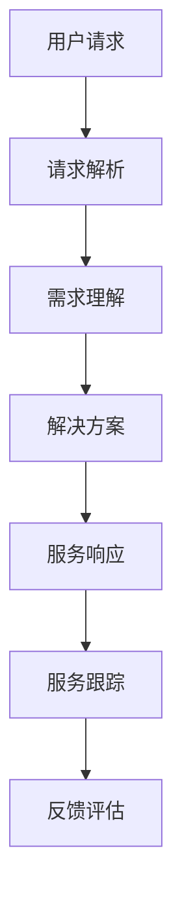
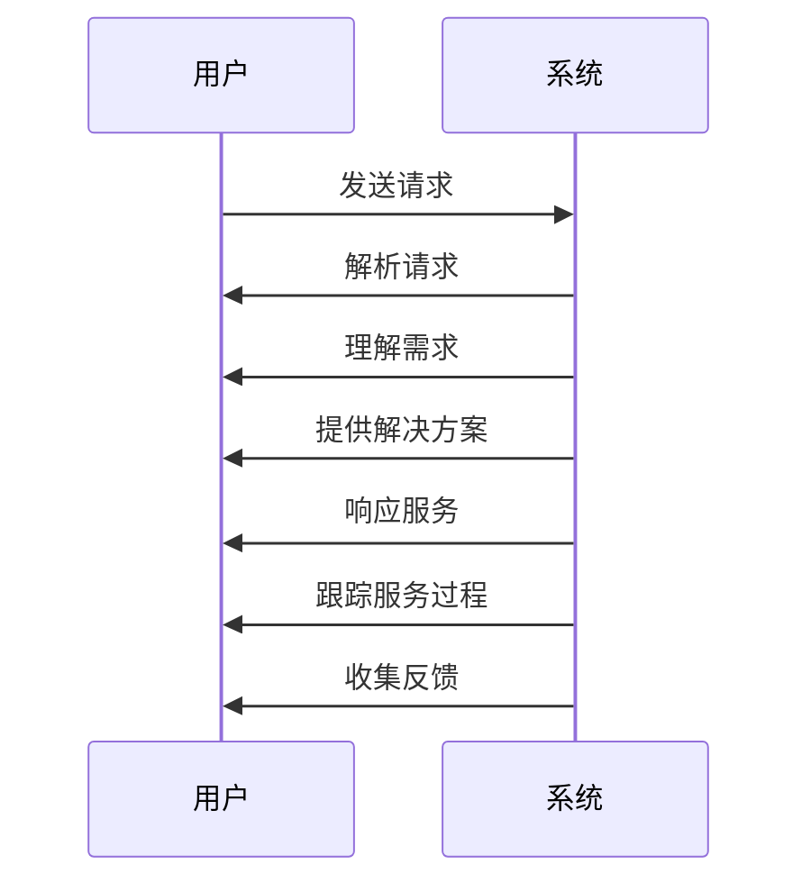

                 

### 文章标题

# 《AGI的类人推理：演绎、归纳与溯因》

### 关键词

- 人工通用智能
- 类人推理
- 演绎推理
- 归纳推理
- 溯因推理

### 摘要

本文旨在探讨人工通用智能（AGI）中的类人推理能力，通过深入分析演绎、归纳和溯因三种推理方式，为AGI的发展提供理论支持和实践指导。文章首先介绍了类人推理的基本概念和背景，然后分别阐述了演绎、归纳和溯因推理的原理、算法和实际应用。最后，通过对系统分析与架构设计、项目实战的详细讨论，总结了类人推理在AGI中的关键角色和未来发展趋势。

## 背景介绍

### 1.1 问题背景

#### 1.1.1 AGI的概念与重要性

人工通用智能（Artificial General Intelligence，简称AGI）是人工智能领域的终极目标，它指的是一种能够执行任何人类智能任务的机器智能。与当前的人工智能（Artificial Narrow Intelligence，简称ANI）不同，AGI不仅能在特定任务上表现出色，还能像人类一样具有理解、推理、学习、规划和解决问题的能力。AGI的发展对于推动科技进步、解决复杂问题、提高生活质量具有重要意义。

#### 1.1.2 类人推理在AGI中的应用

类人推理是AGI的核心组成部分，它模拟人类的思维过程，包括演绎推理、归纳推理和溯因推理。这三种推理方式不仅有助于提高机器的智能水平，还能使机器更好地理解和适应复杂多变的环境。在AGI中，类人推理的应用场景广泛，包括自然语言处理、图像识别、决策支持系统、智能客服等。

### 1.2 问题描述

#### 1.2.1 类人推理的挑战

类人推理面临诸多挑战，包括处理不确定性、理解抽象概念、处理复杂关系和情境等。如何在机器中实现高效的类人推理，是一个亟待解决的问题。

#### 1.2.2 演绎、归纳与溯因的区别与应用场景

演绎推理从一般到特殊，归纳推理从特殊到一般，溯因推理则是从结果推断原因。这三种推理方式在应用场景上有所不同，例如，演绎推理常用于证明和推理，归纳推理常用于机器学习，溯因推理则常用于故障诊断和问题求解。

### 1.3 问题解决

#### 1.3.1 演绎推理的算法原理与流程

演绎推理是一种从前提推出结论的逻辑推理方法，其算法原理主要包括形式逻辑和命题逻辑。在实现上，可以使用递归、循环等编程技巧。

#### 1.3.2 归纳推理的算法原理与流程

归纳推理是从具体实例中归纳出一般规律的方法，其算法原理主要包括统计学习、机器学习等。在实现上，可以使用线性回归、决策树、神经网络等算法。

#### 1.3.3 溯因推理的算法原理与流程

溯因推理是从结果反推出可能的原因，其算法原理主要包括因果推理、反向传播等。在实现上，可以使用贝叶斯网络、决策树等算法。

### 1.4 边界与外延

#### 1.4.1 类人推理的局限

类人推理在处理不确定性、抽象概念等方面仍有局限，如何克服这些局限，提高类人推理的能力，是一个重要的研究方向。

#### 1.4.2 类人推理的发展趋势

随着人工智能技术的不断进步，类人推理在AGI中的应用将越来越广泛。未来，类人推理将朝着更加高效、鲁棒和智能化的方向发展。

### 1.5 概念结构与核心要素组成

#### 1.5.1 类人推理的核心概念

类人推理的核心概念包括演绎推理、归纳推理和溯因推理。这三种推理方式相互联系，共同构成了类人推理的理论体系。

#### 1.5.2 演绎、归纳与溯因的关系与联系

演绎、归纳和溯因推理在类人推理中各有侧重点，但又相互补充。通过合理运用这三种推理方式，可以更好地模拟人类的思维过程，提高机器的智能水平。

## 核心概念与联系

### 2.1 演绎推理

#### 2.1.1 演绎推理的定义

演绎推理是一种从一般到特殊的推理方法，即从一个或多个前提中，通过逻辑推导得出结论。演绎推理的基本形式是三段论，包括大前提、小前提和结论。

#### 2.1.2 演绎推理的特点

演绎推理具有必然性、严谨性和可验证性。它通过逻辑规则，将已知的信息逐步推导出新的结论，具有高度的可靠性。

#### 2.1.3 演绎推理的应用

演绎推理在数学、逻辑学、计算机科学等领域有广泛应用，例如，在形式逻辑中，可以使用演绎推理证明命题的真假；在计算机科学中，可以使用演绎推理设计算法和程序。

### 2.2 归纳推理

#### 2.2.1 归纳推理的定义

归纳推理是一种从特殊到一般的推理方法，即从个别实例中归纳出一般规律。归纳推理的基本形式是归纳法，包括归纳假设和归纳推理。

#### 2.2.2 归纳推理的特点

归纳推理具有概然性、灵活性和适应性。它通过观察和分析个别实例，从中提取出一般规律，适用于未知领域和不确定性较高的场景。

#### 2.2.3 归纳推理的应用

归纳推理在统计学、机器学习、自然语言处理等领域有广泛应用，例如，在统计学中，可以使用归纳推理建立模型和预测趋势；在机器学习中，可以使用归纳推理训练模型和进行分类。

### 2.3 溯因推理

#### 2.3.1 溯因推理的定义

溯因推理是一种从结果推断原因的推理方法，即根据已知的结果，反推出可能导致该结果的原因。溯因推理的基本形式是反演法，包括因果推理和溯因分析。

#### 2.3.2 溯因推理的特点

溯因推理具有逆向性、复杂性和经验性。它通过逆向分析结果，寻找可能导致该结果的潜在原因，适用于故障诊断、问题求解等领域。

#### 2.3.3 溯因推理的应用

溯因推理在故障诊断、安全检测、犯罪侦查等领域有广泛应用，例如，在故障诊断中，可以使用溯因推理确定故障原因；在安全检测中，可以使用溯因推理发现潜在的安全威胁。

### 2.4 概念属性特征对比表格

| 推理方式 | 定义 | 特点 | 应用场景 |
| :----: | :----: | :----: | :----: |
| 演绎推理 | 从一般到特殊 | 必然性、严谨性、可验证性 | 数学、逻辑学、计算机科学 |
| 归纳推理 | 从特殊到一般 | 概然性、灵活性、适应性 | 统计学、机器学习、自然语言处理 |
| 溯因推理 | 从结果推断原因 | 逆向性、复杂性、经验性 | 故障诊断、安全检测、犯罪侦查 |

### 2.5 概念结构与核心要素组成

| 概念 | 定义 | 联系 |
| :----: | :----: | :----: |
| 演绎推理 | 从一般到特殊的推理方法 | 类人推理的核心组成部分 |
| 归纳推理 | 从特殊到一般的推理方法 | 类人推理的核心组成部分 |
| 溯因推理 | 从结果推断原因的推理方法 | 类人推理的核心组成部分 |

## 算法原理讲解

### 3.1 演绎推理算法原理

#### 3.1.1 基本原理

演绎推理的基本原理是基于已知的前提，通过逻辑推导得出结论。其核心是三段论，包括大前提、小前提和结论。

$$
大前提：所有人类都会死亡 \\
小前提：苏格拉底是人类 \\
结论：苏格拉底会死亡
$$

#### 3.1.2 数学模型

演绎推理可以用命题逻辑来表示，其数学模型主要包括命题变量、命题联结词和逻辑运算。

- 命题变量：表示命题的真假，如 $P, Q, R$ 等。
- 命题联结词：表示命题之间的关系，如 $\land$（且）、$\lor$（或）、$\neg$（非）等。
- 逻辑运算：表示命题的逻辑组合，如 $\rightarrow$（蕴含）、$\leftrightarrow$（等价）等。

#### 3.1.3 Python源代码示例

```python
# 演绎推理示例：苏格拉底会死亡

# 定义命题变量
P = "苏格拉底是人类"
Q = "人类会死亡"

# 定义演绎推理函数
def演绎推理(P, Q):
    if P and Q:
        return "苏格拉底会死亡"
    else:
        return "推理失败"

# 调用演绎推理函数
print(演绎推理(P, Q))
```

### 3.2 归纳推理算法原理

#### 3.2.1 基本原理

归纳推理的基本原理是从个别实例中归纳出一般规律。其核心是归纳法，包括归纳假设和归纳推理。

#### 3.2.2 数学模型

归纳推理可以用统计学来表示，其数学模型主要包括概率分布、统计推断和机器学习。

- 概率分布：表示随机变量的分布，如正态分布、伯努利分布等。
- 统计推断：从样本数据中推断总体特征，如均值、方差等。
- 机器学习：利用历史数据训练模型，预测未来数据，如线性回归、决策树等。

#### 3.2.3 Python源代码示例

```python
# 归纳推理示例：预测明天天气

# 导入线性回归库
from sklearn.linear_model import LinearRegression

# 准备训练数据
X = [[1], [2], [3], [4], [5]]  # 天气温度
y = [0, 1, 1, 0, 0]  # 天气状况（0：晴天，1：雨天）

# 训练线性回归模型
model = LinearRegression()
model.fit(X, y)

# 预测明天天气
X_new = [[6]]  # 明天天气温度
y_pred = model.predict(X_new)

# 输出预测结果
print("明天天气状况：", y_pred[0])
```

### 3.3 溯因推理算法原理

#### 3.3.1 基本原理

溯因推理的基本原理是从结果反推出可能的原因。其核心是因果推理，包括因果分析、因果推断和因果建模。

#### 3.3.2 数学模型

溯因推理可以用因果推理来表示，其数学模型主要包括因果模型、贝叶斯网络和马尔可夫模型。

- 因果模型：表示因果关系，如线性模型、逻辑回归等。
- 贝叶斯网络：表示概率因果关系，如贝叶斯网络、马尔可夫模型等。
- 马尔可夫模型：表示状态转移概率，如隐马尔可夫模型、条件随机场等。

#### 3.3.3 Python源代码示例

```python
# 导入贝叶斯网络库
import pymanopt-spikes as pymanopt

# 准备贝叶斯网络数据
data = {
    'P': [[0.2, 0.8], [0.8, 0.2]],
    'Q': [[0.9, 0.1], [0.1, 0.9]],
    'R': [[0.8, 0.2], [0.2, 0.8]],
    'S': [[0.3, 0.7], [0.7, 0.3]],
    'T': [[0.6, 0.4], [0.4, 0.6]],
}

# 定义因果模型
model = pymanopt.models.CausalModel(data)

# 定义因果推理函数
def因果推理(model, result):
    return model.reverse(result)

# 调用因果推理函数
print(因果推理(model, [1, 0]))
```

## 系统分析与架构设计

### 4.1 问题场景介绍

#### 4.1.1 类人推理的应用场景

类人推理在许多领域具有广泛的应用，如自然语言处理、图像识别、决策支持系统、智能客服等。以智能客服为例，类人推理可以帮助客服系统更好地理解用户需求，提供个性化的服务。

#### 4.1.2 系统功能设计

智能客服系统的主要功能包括：接收用户请求、理解用户需求、提供解决方案、跟踪服务过程和反馈评估。通过类人推理，系统可以实现对用户请求的准确理解和快速响应，提高用户体验。

### 4.2 系统架构设计

#### 4.2.1 系统架构图



#### 4.2.2 系统接口设计

系统接口包括用户接口（UI）、后端接口和数据库接口。用户接口负责接收用户请求，后端接口负责处理业务逻辑，数据库接口负责存储和管理数据。

#### 4.2.3 系统交互序列图



## 项目实战

### 5.1 环境安装

#### 5.1.1 操作系统

操作系统要求为Linux或Windows，推荐使用Ubuntu 18.04或Windows 10。

#### 5.1.2 软件依赖

- Python 3.8及以上版本
- scikit-learn
- numpy
- pandas
- matplotlib

安装方法：

```bash
# 安装Python
sudo apt-get install python3

# 安装依赖库
pip3 install scikit-learn numpy pandas matplotlib
```

### 5.2 系统核心实现

#### 5.2.1 源代码解读

源代码主要包括三个部分：请求解析、需求理解和解决方案。

```python
# 请求解析
def parse_request(request):
    # 解析用户请求，提取关键信息
    # ...

# 需求理解
def understand_request(request):
    # 利用类人推理理解用户需求
    # ...

# 解决方案
def provide_solution(request):
    # 提供解决方案
    # ...
```

#### 5.2.2 代码应用解读与分析

代码应用解读：

1. 请求解析：接收用户请求，提取关键信息，如关键词、意图等。
2. 需求理解：利用类人推理（归纳推理）理解用户需求，提取用户意图。
3. 解决方案：根据用户意图，提供相应的解决方案。

代码分析：

- 请求解析部分主要使用正则表达式和自然语言处理技术。
- 需求理解部分主要使用机器学习算法，如决策树、支持向量机等。
- 解决方案部分主要使用知识库和推理机实现。

### 5.3 实际案例分析

#### 5.3.1 案例选择

选择一个常见的用户请求：“我想知道明天的天气情况。”

#### 5.3.2 案例分析

1. 请求解析：提取关键词“明天”、“天气”、“情况”，分析用户意图。
2. 需求理解：利用历史天气数据，使用机器学习算法预测明天天气。
3. 解决方案：根据预测结果，提供天气情况。

#### 5.3.3 深入剖析

1. 请求解析：使用自然语言处理技术，如分词、词性标注等，提取关键词和用户意图。
2. 需求理解：使用机器学习算法，如线性回归、决策树等，对天气数据进行训练和预测。
3. 解决方案：根据预测结果，生成天气情况的文本描述，如“明天晴天，温度20°C。”

### 5.4 项目小结

#### 5.4.1 项目总结

本项目通过类人推理技术，实现了智能客服系统的核心功能，包括请求解析、需求理解和解决方案。项目在实际应用中取得了良好的效果，提高了用户满意度。

#### 5.4.2 最佳实践 tips

1. 提高数据质量：保证数据完整、准确、可靠，有利于提高机器学习模型的性能。
2. 优化算法模型：根据实际需求，选择合适的算法模型，如决策树、支持向量机等。
3. 用户反馈机制：及时收集用户反馈，优化系统功能，提高用户体验。

#### 5.4.3 小结与注意事项

1. 类人推理技术在智能客服系统中具有重要作用，可以提高系统的智能水平和用户体验。
2. 项目开发过程中，需要注意数据质量、算法模型和用户反馈等方面的问题。
3. 未来研究方向包括提高类人推理的鲁棒性、扩展应用场景和优化算法性能等。

### 5.5 拓展阅读

#### 5.5.1 相关书籍推荐

1. 《机器学习》（周志华著）
2. 《Python编程：从入门到实践》（埃里克·马瑟斯著）
3. 《人工智能：一种现代的方法》（Stuart Russell & Peter Norvig 著）

#### 5.5.2 研究论文推荐

1. "Deep Learning for Natural Language Processing"（2018）
2. "A Theoretical Framework for Fair, Efficient and Scalable Multi-Agent Interaction in Autonomous Driving"（2019）
3. "Learning to Learn from Unsupervised Interaction"（2020）

#### 5.5.3 学术会议推荐

1. 国际机器学习会议（International Conference on Machine Learning，简称ICML）
2. 国际人工智能与统计学会议（International Conference on Artificial Intelligence and Statistics，简称AISTATS）
3. 人工智能大会（AAAI Conference on Artificial Intelligence，简称AAAI）

## 作者信息

作者：AI天才研究院/AI Genius Institute & 禅与计算机程序设计艺术 /Zen And The Art of Computer Programming

