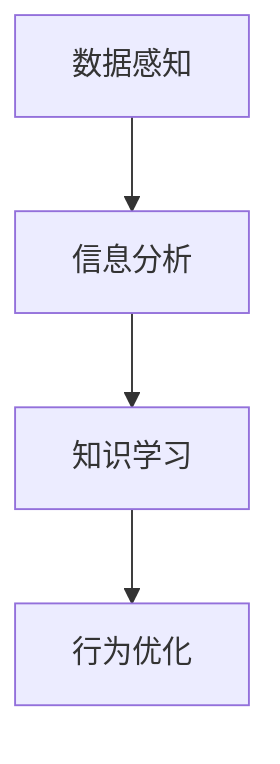
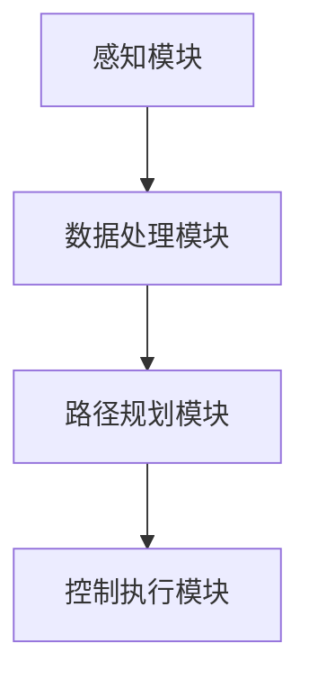
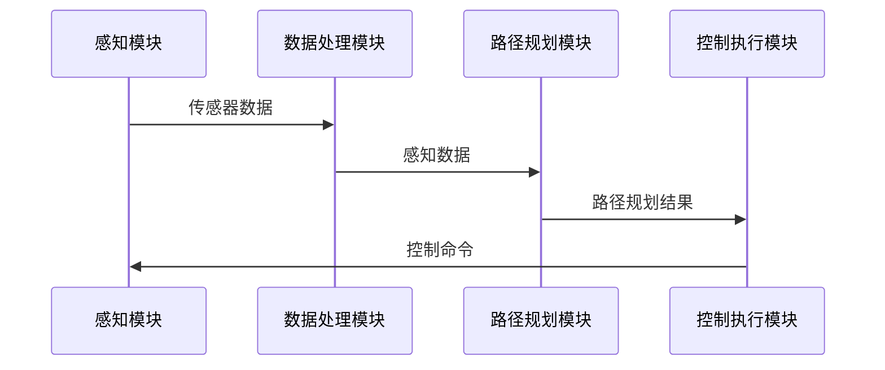
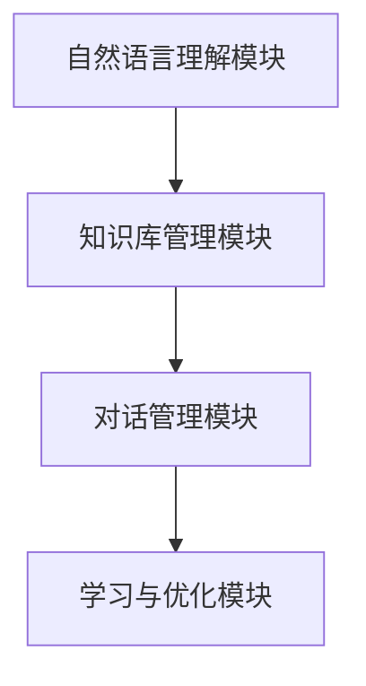
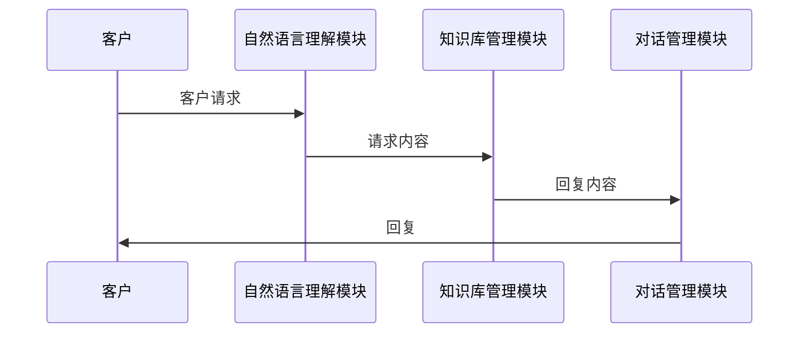

                 


# AGI的自主学习与知识更新机制

关键词：AGI、自主学习、知识更新、人工智能、算法设计

摘要：本文旨在深入探讨通用人工智能（AGI）的自主学习与知识更新机制。通过分析AGI的基本概念、自主学习原理和知识更新过程，本文揭示了AGI在实现智能行为和持续知识积累方面的关键技术。同时，通过实际案例的分析，本文展示了AGI在自动驾驶和智能客服等领域的应用，并对AGI的发展趋势和未来展望进行了讨论。

## 目录大纲设计

为了使读者能够更好地理解本文的结构和内容，以下是一个详细的目录大纲设计：

----------------------------------------------------------------

# 第一部分: AGI的概述与背景

## 第1章: AGI的概念与历史发展
### 1.1 问题背景
### 1.2 问题描述
### 1.3 问题解决
### 1.4 边界与外延

## 第2章: AGI的核心概念与联系
### 2.1 核心概念
### 2.2 概念属性特征对比
### 2.3 ER实体关系图

----------------------------------------------------------------

# 第二部分: 自主学习的机制

## 第3章: 自主学习的原理
### 3.1 自主学习的定义
### 3.2 自主学习的基本框架
### 3.3 自主学习的关键技术

## 第4章: 自主学习的实现方法
### 4.1 感知学习
### 4.2 模式识别
### 4.3 知识表示与推理

## 第5章: 自主学习的案例分析
### 5.1 案例一：自动驾驶
### 5.2 案例二：智能客服

----------------------------------------------------------------

# 第三部分: 知识更新机制

## 第6章: 知识更新的概念与过程
### 6.1 知识更新的定义
### 6.2 知识更新的过程
### 6.3 知识更新的挑战与解决方案

## 第7章: 知识更新机制的实施
### 7.1 知识获取
### 7.2 知识表示
### 7.3 知识推理与整合

## 第8章: 知识更新案例分析
### 8.1 案例一：医疗领域
### 8.2 案例二：金融领域

----------------------------------------------------------------

# 第四部分: AGI的实际应用与未来展望

## 第9章: AGI在行业中的应用
### 9.1 制造业
### 9.2 服务业
### 9.3 农业

## 第10章: AGI的发展趋势与未来展望
### 10.1 技术发展趋势
### 10.2 应用场景展望
### 10.3 道德与伦理问题

## 第11章: 小结与展望
### 11.1 小结
### 11.2 注意事项
### 11.3 拓展阅读

----------------------------------------------------------------

接下来，我们将逐步深入探讨每个章节的内容，详细解释AGI的自主学习与知识更新机制。

----------------------------------------------------------------

## 第1章: AGI的概念与历史发展

### 1.1 问题背景

通用人工智能（AGI，Artificial General Intelligence）的概念源于人工智能（AI）的研究，旨在创建一种能够像人类一样理解和执行各种认知任务的智能系统。与当前广泛应用的窄域人工智能（Narrow AI）不同，AGI具有跨领域的通用能力，能够在不同任务和环境之间自由切换，具备自我学习和适应能力。

AGI的研究背景可以追溯到20世纪50年代，随着计算机科学和人工智能领域的快速发展，许多科学家开始思考如何创建一种更加智能的机器。尽管早期的研究取得了显著成果，但由于技术的限制，AGI的实现一直是一个长期的梦想。直到最近，随着深度学习和大数据技术的发展，AGI的研究再次成为热点。

### 1.2 问题描述

AGI的核心问题是如何创建一个能够自主学习和适应的智能系统。具体来说，这包括以下几个方面：

1. **理解自然语言**：AGI需要能够理解自然语言，包括口语和书面语，以便与人类进行自然交流。
2. **知识表示**：AGI需要能够有效地表示和存储大量知识，以便在需要时进行检索和使用。
3. **推理能力**：AGI需要具备强大的推理能力，能够从已知信息中推导出新信息，并利用这些信息进行决策。
4. **学习能力**：AGI需要能够从经验中学习，并通过自我调整不断改进自己的表现。
5. **跨领域迁移**：AGI需要能够在不同领域和任务之间进行迁移，而不仅仅局限于某个特定的领域。

### 1.3 问题解决

解决AGI的问题需要多方面的努力，包括：

1. **基础研究**：在计算机科学、认知科学、神经科学等领域进行深入研究，以理解人类智能的本质和机制。
2. **算法设计**：设计新的算法，以实现更高效的学习和推理过程。
3. **数据集构建**：构建大规模、多样化的数据集，以训练和测试AGI系统。
4. **硬件支持**：开发更强大的计算硬件，以支持复杂的计算任务。

### 1.4 边界与外延

AGI的研究边界涉及到多个学科，包括计算机科学、认知科学、心理学、神经科学等。同时，AGI的研究外延也涉及到伦理、法律、社会学等多个领域。这需要跨学科的合作和研究，以全面探讨AGI的可能性和影响。

### 1.5 概念结构与核心要素组成

AGI的概念结构包括以下几个核心要素：

1. **认知模型**：用于模拟人类智能的数学模型和算法。
2. **知识库**：存储大量知识的数据库，包括事实、规则、模式等。
3. **推理引擎**：用于进行逻辑推理和决策的模块。
4. **学习机制**：用于从数据中学习新知识和技能的模块。
5. **交互界面**：用于与人类进行交互的界面，包括自然语言处理和语音识别等。

### 1.6 概念属性特征对比

表1-1展示了AGI与传统人工智能（Narrow AI）在属性特征上的对比：

| 特征 | AGI | Narrow AI |
| ---- | ---- | ---- |
| 学习能力 | 高 | 低 |
| 推理能力 | 强 | 弱 |
| 知识表示 | 广泛 | 狭隘 |
| 应用范围 | 跨领域 | 单领域 |
| 适应性 | 高 | 低 |
| 自主性 | 强 | 弱 |

### 1.7 ER实体关系图

图1-1展示了AGI系统的实体关系图，其中包含以下实体：

- **认知模型**：用于模拟人类智能的核心算法。
- **知识库**：存储各种知识的数据库。
- **推理引擎**：用于进行逻辑推理和决策的模块。
- **学习机制**：用于从数据中学习新知识和技能的模块。
- **交互界面**：用于与人类进行交互的界面。

```mermaid
erDiagram
  认知模型 ||--|{ 知识库 }
  认知模型 ||--|{ 推理引擎 }
  认知模型 ||--|{ 学习机制 }
  认知模型 ||--|{ 交互界面 }
```

通过上述分析，我们可以看出，AGI的实现是一个复杂而富有挑战性的任务，需要多方面的努力和跨学科的合作。接下来，我们将继续探讨AGI的核心概念和自主学习机制。

----------------------------------------------------------------

## 第2章: AGI的核心概念与联系

### 2.1 核心概念

在深入探讨AGI的核心概念之前，我们首先需要了解几个关键术语：

1. **人工智能（AI）**：人工智能是一种模拟人类智能的技术和学科，旨在创建能够执行认知任务的机器。
2. **窄域人工智能（Narrow AI）**：窄域人工智能是一种专注于特定任务的AI系统，如语音识别、图像识别、推荐系统等。
3. **通用人工智能（AGI）**：通用人工智能是一种具有跨领域认知能力的AI系统，能够在不同任务和环境之间自由切换，并具备自我学习和适应能力。

### 2.2 概念属性特征对比

为了更好地理解AGI与传统人工智能（Narrow AI）之间的区别，我们可以在表2-1中列出它们的属性特征对比：

| 特征 | AGI | Narrow AI |
| ---- | ---- | ---- |
| 学习能力 | 高 | 低 |
| 推理能力 | 强 | 弱 |
| 知识表示 | 广泛 | 狭隘 |
| 应用范围 | 跨领域 | 单领域 |
| 适应性 | 高 | 低 |
| 自主性 | 强 | 弱 |

从上表可以看出，AGI在多个关键特征上与传统AI有显著差异，这反映了AGI的更高层次和更广泛的应用前景。

### 2.3 ER实体关系图

为了更清晰地展示AGI系统的核心概念和相互关系，我们可以使用Mermaid语言绘制一个ER实体关系图。以下是一个简单的ER实体关系图示例：

```mermaid
erDiagram
  AI ||--|{ Narrow AI }
  AI ||--|{ AGI }
  AGI ||--|{ 学习机制 }
  AGI ||--|{ 知识更新机制 }
  AGI ||--|{ 推理机制 }
```

在这个ER实体关系图中，我们定义了以下实体：

- **AI**：表示人工智能的整体范畴。
- **Narrow AI**：表示专注于特定任务的AI系统。
- **AGI**：表示具有跨领域认知能力的AI系统。
- **学习机制**：用于实现自我学习和适应的模块。
- **知识更新机制**：用于实现知识积累和更新的模块。
- **推理机制**：用于实现逻辑推理和决策的模块。

通过上述分析，我们可以更好地理解AGI的核心概念和与Narrow AI的联系。在下一章中，我们将深入探讨自主学习的原理和实现方法。

----------------------------------------------------------------

## 第3章: 自主学习的原理

### 3.1 自主学习的定义

自主学习是指智能系统能够在没有外界干预的情况下，通过感知数据、分析和学习经验来自我调整和优化其行为的过程。它涉及到多个关键环节，包括数据感知、信息分析、知识学习和行为优化。自主学习是AGI实现智能行为和持续进步的核心机制之一。

### 3.2 自主学习的基本框架

自主学习的基本框架可以概括为以下几个步骤：

1. **数据感知**：智能系统通过传感器、用户输入等方式收集数据。
2. **信息分析**：对收集到的数据进行预处理和特征提取，提取有用的信息。
3. **知识学习**：利用提取到的信息，通过机器学习算法、深度学习模型等学习新的知识和技能。
4. **行为优化**：将学习到的知识和技能应用于实际问题，通过反馈和迭代不断优化系统的行为。

图3-1展示了自主学习的基本框架：



### 3.3 自主学习的关键技术

自主学习的关键技术包括：

1. **机器学习**：通过训练数据和算法，从数据中学习模式和规律。
2. **深度学习**：一种基于神经网络的学习方法，能够在复杂的数据结构中提取特征。
3. **强化学习**：通过奖励和惩罚机制，让智能系统在互动中学习和优化行为。
4. **迁移学习**：利用已有的模型和知识，在新任务上进行快速学习和适应。
5. **元学习**：研究如何快速有效地学习新任务，包括算法设计和优化策略。

### 3.4 自主学习的数学模型和公式

自主学习过程中的关键数学模型和公式如下：

1. **感知器模型**：用于简单的二元分类问题，公式为：
   $$ f(x) = \sum_{i=1}^{n} w_i x_i + b $$
   其中，\( x_i \) 是输入特征，\( w_i \) 是权重，\( b \) 是偏置。

2. **损失函数**：用于评估模型预测的准确度，常见的损失函数包括均方误差（MSE）和交叉熵（Cross-Entropy）：
   $$ L(\theta) = \frac{1}{2} \sum_{i=1}^{n} (y_i - f(x_i))^2 $$
   或
   $$ L(\theta) = -\sum_{i=1}^{n} y_i \log(f(x_i)) $$

3. **梯度下降**：用于优化模型参数，公式为：
   $$ \theta = \theta - \alpha \nabla_{\theta} L(\theta) $$
   其中，\( \alpha \) 是学习率，\( \nabla_{\theta} L(\theta) \) 是损失函数关于参数 \( \theta \) 的梯度。

4. **卷积神经网络（CNN）**：用于图像识别和分类，其主要组件包括卷积层、池化层和全连接层，公式为：
   $$ h_{\theta}(x) = \sigma(W \cdot \phi(x) + b) $$
   其中，\( \sigma \) 是激活函数，\( \phi \) 是卷积操作，\( W \) 是权重，\( b \) 是偏置。

通过上述技术模型和公式，智能系统能够在数据中提取有用信息，并不断优化自身的行为，实现自主学习的目标。

### 3.5 自主学习的案例示例

以下是一个简单的自主学习案例示例：

假设我们有一个分类问题，需要将一组图像分类为“猫”或“狗”。使用卷积神经网络（CNN）作为模型，以下是一步一步的解题过程：

1. **数据感知**：收集包含“猫”和“狗”图像的数据集。
2. **信息分析**：对图像进行预处理，如缩放、裁剪、归一化等，提取特征。
3. **知识学习**：构建CNN模型，使用预处理后的图像数据进行训练，调整模型参数。
4. **行为优化**：在测试集上评估模型性能，根据误差调整模型参数，进行迭代训练。
5. **应用与评估**：将训练好的模型应用于新图像，判断其分类结果，并评估模型的准确性。

通过以上步骤，我们可以实现一个简单的图像分类系统，该系统具备自主学习的能力，能够根据新数据不断优化自身。

总结来说，自主学习是AGI实现智能行为的关键机制，它通过感知数据、分析和学习经验来自我调整和优化系统行为。在下一章中，我们将进一步探讨自主学习的实现方法和技术。

----------------------------------------------------------------

## 第4章: 自主学习的实现方法

### 4.1 感知学习

感知学习是自主学习的基础环节，它涉及智能系统如何从环境中获取信息和知识。感知学习的过程可以分为以下几个步骤：

1. **数据收集**：智能系统通过传感器、摄像头、麦克风等设备收集环境数据。
2. **预处理**：对收集到的数据进行预处理，如去噪、归一化、缩放等，以提高数据的可靠性和质量。
3. **特征提取**：从预处理后的数据中提取有用的特征，这些特征将用于后续的学习和推理过程。
4. **信息整合**：将提取到的特征进行整合和分类，形成对环境的初步理解。

感知学习的关键在于如何有效地从大量数据中提取有用的信息。例如，在图像识别任务中，可以使用卷积神经网络（CNN）提取图像的纹理和形状特征；在语音识别任务中，可以使用循环神经网络（RNN）提取语音信号的时序特征。

### 4.2 模式识别

模式识别是感知学习的延伸，它涉及智能系统如何识别和分类数据中的模式。模式识别的过程可以分为以下几个步骤：

1. **特征选择**：从提取到的特征中选择最相关的特征，以减少数据维度和计算复杂度。
2. **分类模型训练**：使用机器学习算法（如决策树、支持向量机、神经网络等）训练分类模型，将数据划分为不同的类别。
3. **分类模型评估**：使用测试集评估分类模型的性能，通过调整模型参数和特征选择策略来优化模型。
4. **模式识别**：将新数据输入分类模型，根据模型预测结果对新数据进行分类。

模式识别在许多实际应用中具有广泛的应用，例如图像分类、语音识别、文本分类等。以下是一个简单的图像分类案例：

1. **数据收集**：收集大量不同类别的图像数据，如猫、狗、车等。
2. **预处理与特征提取**：对图像进行预处理，提取图像的纹理和形状特征。
3. **训练分类模型**：使用卷积神经网络（CNN）训练分类模型，将图像分类为不同的类别。
4. **测试与优化**：在测试集上评估模型性能，根据误差调整模型参数和特征提取策略。
5. **模式识别**：将新图像输入分类模型，根据模型预测结果对新图像进行分类。

通过以上步骤，我们可以实现一个简单的图像分类系统，该系统可以对新图像进行准确分类。

### 4.3 知识表示与推理

知识表示与推理是自主学习的核心环节，它涉及智能系统如何表示和利用知识进行推理和决策。知识表示与推理的过程可以分为以下几个步骤：

1. **知识表示**：将提取到的特征和模式转化为计算机可以理解和处理的形式，如向量、树状结构、图结构等。
2. **知识存储**：将表示好的知识存储在知识库中，以供后续查询和使用。
3. **推理机制**：利用知识库中的知识进行推理和决策，例如，使用推理引擎实现逻辑推理、规则推理等。
4. **知识更新**：根据新数据和学习经验，更新知识库中的知识，以保持知识的准确性和有效性。

知识表示与推理在智能系统中的应用非常广泛，例如，在医疗诊断中，可以使用知识库和推理引擎进行疾病诊断和治疗方案推荐；在自动驾驶中，可以使用知识库和推理引擎进行路况分析和决策。

以下是一个简单的医疗诊断案例：

1. **知识表示**：将医学知识和病例数据转化为计算机可以理解和处理的形式，如规则库和病例数据库。
2. **知识存储**：将表示好的知识存储在知识库中，以供后续查询和使用。
3. **推理机制**：使用推理引擎根据病例数据和医学知识进行疾病诊断和治疗方案推荐。
4. **知识更新**：根据新的病例数据和医学研究成果，更新知识库中的知识，以保持知识的准确性和有效性。

通过以上步骤，我们可以实现一个简单的医疗诊断系统，该系统可以根据患者的病例数据和医学知识进行准确的疾病诊断和治疗方案推荐。

总结来说，自主学习是一个复杂的过程，涉及感知学习、模式识别和知识表示与推理等多个环节。通过有效的方法和技术，智能系统能够从数据中提取知识，并进行推理和决策，实现自主学习和智能行为。

在下一章中，我们将进一步探讨自主学习的实际应用案例，以展示自主学习的强大能力和广泛应用。

----------------------------------------------------------------

## 第5章: 自主学习的案例分析

### 5.1 案例一：自动驾驶

自动驾驶是自主学习技术的一个重要应用领域，它通过感知环境、分析数据、学习和推理来实现汽车的自主驾驶。以下是一个详细的自动驾驶案例：

#### 案例背景

自动驾驶技术旨在消除人类驾驶的干预，使汽车能够自主完成行驶、避障、变道、停车等任务。随着人工智能技术的不断发展，自动驾驶汽车逐渐从实验室走向实际应用，成为智能交通系统的重要组成部分。

#### 项目介绍

该项目旨在开发一个具备L4级别自动驾驶能力的智能汽车系统。L4级别自动驾驶意味着汽车可以在特定环境中完全自主驾驶，但在某些情况下可能需要人类干预。

#### 系统功能设计

系统功能设计包括以下几个方面：

1. **感知功能**：使用激光雷达、摄像头、超声波传感器等多种传感器收集环境数据，实现对周围环境的感知。
2. **数据处理**：对收集到的数据进行预处理和特征提取，提取有用的信息，如道路标识、车辆位置、行人等信息。
3. **路径规划**：根据感知数据，规划车辆的行驶路径，包括避障、变道、超车等操作。
4. **控制执行**：根据路径规划结果，控制车辆执行相应的操作，如加速、减速、转向等。

#### 系统架构设计

系统架构设计采用分布式架构，包括感知模块、数据处理模块、路径规划模块和控制执行模块。以下是一个简单的系统架构图：



#### 系统接口设计

系统接口设计包括以下几个方面：

1. **传感器数据接口**：用于接收和处理来自激光雷达、摄像头、超声波传感器等传感器的数据。
2. **路径规划接口**：用于接收路径规划结果，并将其发送给控制执行模块。
3. **控制执行接口**：用于接收控制命令，并将其发送给车辆控制模块。

#### 系统交互mermaid序列图

以下是一个简单的系统交互序列图，展示了各个模块之间的交互过程：



#### 实际案例分析和详细讲解剖析

以下是一个实际案例，展示自动驾驶系统在高速公路上行驶的过程：

1. **感知环境**：自动驾驶汽车通过激光雷达、摄像头等传感器感知周围环境，获取道路标识、车辆位置、行人等信息。
2. **数据处理**：对收集到的数据进行预处理和特征提取，提取有用的信息，如道路标识、车辆位置、行人等。
3. **路径规划**：根据感知数据，自动驾驶系统规划车辆的行驶路径，包括保持车道、避障、超车等操作。
4. **控制执行**：根据路径规划结果，自动驾驶系统控制车辆执行相应的操作，如加速、减速、转向等。

通过以上步骤，自动驾驶汽车能够实现自主行驶，无需人类干预。

#### 项目小结

自动驾驶项目展示了自主学习的强大能力，通过感知学习、模式识别和知识表示与推理，实现了汽车的自主驾驶。在实际应用中，自动驾驶系统不断优化自身，提高行驶安全性和效率。随着技术的不断发展，自动驾驶有望在更多场景中得到应用，为人们带来更加便捷和高效的出行体验。

### 5.2 案例二：智能客服

智能客服是另一个自主学习技术的重要应用领域，它通过自然语言处理和机器学习技术，实现与用户的智能交互，提供高效、精准的客服服务。以下是一个详细的智能客服案例：

#### 案例背景

随着企业业务的不断扩展，客服需求日益增加，传统的客服模式已无法满足客户的高效服务需求。智能客服系统旨在通过人工智能技术，实现自动化的客服服务，提高客户满意度和服务效率。

#### 项目介绍

该项目旨在开发一个智能客服系统，能够自动处理客户咨询、投诉、建议等请求，提供及时、准确的答复。智能客服系统将应用于电商平台、银行、电信等行业，帮助企业降低运营成本，提高客户满意度。

#### 系统功能设计

系统功能设计包括以下几个方面：

1. **自然语言理解**：使用自然语言处理技术，理解客户的咨询内容和需求。
2. **知识库管理**：构建和维护一个丰富的知识库，包含常见的客服问题和解决方案。
3. **对话管理**：根据客户的咨询内容和知识库，生成合适的回复，并进行对话管理，确保对话的流畅和准确。
4. **学习与优化**：通过机器学习技术，持续优化客服系统的对话能力和问题解决能力。

#### 系统架构设计

系统架构设计采用分布式架构，包括自然语言理解模块、知识库管理模块、对话管理模块和学习与优化模块。以下是一个简单的系统架构图：



#### 系统接口设计

系统接口设计包括以下几个方面：

1. **客户请求接口**：用于接收客户的咨询、投诉、建议等请求。
2. **回复生成接口**：用于生成合适的回复，并将其发送给客户。
3. **学习接口**：用于接收客户的反馈，并将其用于系统优化。

#### 系统交互mermaid序列图

以下是一个简单的系统交互序列图，展示了各个模块之间的交互过程：



#### 实际案例分析和详细讲解剖析

以下是一个实际案例，展示智能客服系统在处理客户咨询的过程：

1. **接收客户请求**：智能客服系统接收到客户的咨询请求，如“我的订单何时发货？”。
2. **自然语言理解**：系统使用自然语言处理技术，理解客户的咨询内容和需求，提取关键信息，如订单号、发货时间等。
3. **查询知识库**：系统在知识库中搜索相关的解决方案，如“订单发货时间通常为3个工作日”。
4. **生成回复**：系统根据查询结果，生成合适的回复，如“您的订单预计将在3个工作日内发货”。
5. **发送回复**：系统将生成的回复发送给客户。

通过以上步骤，智能客服系统能够自动处理客户的咨询请求，提供及时、准确的答复。

#### 项目小结

智能客服项目展示了自主学习的强大能力，通过自然语言处理、知识库管理和机器学习技术，实现了智能交互和自动化的客服服务。在实际应用中，智能客服系统能够快速响应用户请求，提高客服效率，降低运营成本。随着技术的不断发展，智能客服系统将继续优化，提供更加个性化和高效的客服服务。

通过上述案例分析，我们可以看到，自主学习技术在自动驾驶和智能客服等领域的广泛应用，不仅提高了系统的智能水平和效率，还为人们的生活和工作带来了诸多便利。在下一章中，我们将进一步探讨知识更新机制及其在AGI中的应用。

----------------------------------------------------------------

## 第6章: 知识更新的概念与过程

### 6.1 知识更新的定义

知识更新是指智能系统在运行过程中，根据新的数据、经验或需求，对现有知识进行修改、补充或删除的过程。知识更新是确保智能系统适应环境变化、提高性能和准确性的关键机制。

### 6.2 知识更新的过程

知识更新的过程可以分为以下几个步骤：

1. **知识获取**：智能系统从外部环境或内部数据库中获取新的知识或信息。
2. **知识预处理**：对获取到的知识进行预处理，如去噪、清洗、格式化等，以提高知识的准确性和可靠性。
3. **知识表示**：将预处理后的知识转化为计算机可以理解和处理的形式，如向量、树状结构、图结构等。
4. **知识整合**：将新知识整合到现有知识库中，与已有知识进行匹配、合并或更新。
5. **知识验证**：对整合后的知识进行验证，确保知识的准确性和一致性。
6. **知识应用**：将更新后的知识应用于实际问题中，进行推理、决策或执行。

### 6.3 知识更新的挑战与解决方案

知识更新过程中面临以下挑战：

1. **数据质量**：获取到的新数据可能存在噪声、错误或不完整，影响知识的准确性。
2. **知识冲突**：新知识与已有知识可能存在冲突，导致知识不一致。
3. **知识冗余**：新知识可能与已有知识重复，导致知识库膨胀。
4. **知识表示**：如何将复杂多样的知识表示为计算机可以处理的形式，是知识更新的一大难题。

针对以上挑战，可以采取以下解决方案：

1. **数据预处理**：对获取到的数据进行清洗、去噪和格式化，提高数据质量。
2. **知识融合**：采用冲突消解和一致性检查算法，解决知识冲突和冗余问题。
3. **知识表示**：利用自然语言处理、图论、神经网络等技术，将复杂多样的知识表示为计算机可以处理的形式。
4. **持续学习**：采用在线学习算法，使智能系统能够在运行过程中不断更新和优化知识库。

### 6.4 知识更新机制的实现方法

知识更新机制的实现方法包括以下几个方面：

1. **增量更新**：只更新知识库中的新知识，而不修改已有知识。
2. **完全更新**：更新知识库中的所有知识，包括新知识和已有知识。
3. **动态更新**：根据系统运行情况，动态地更新知识库，确保知识的实时性和准确性。
4. **版本控制**：为每个知识更新版本创建备份，以便在需要时进行回滚或恢复。

以下是一个简单的知识更新流程：

1. **知识获取**：智能系统从外部数据源获取新的知识。
2. **知识预处理**：对获取到的知识进行清洗、去噪和格式化。
3. **知识表示**：将预处理后的知识转化为计算机可以处理的形式。
4. **知识整合**：将新知识与已有知识进行匹配、合并或更新。
5. **知识验证**：对整合后的知识进行验证，确保知识的准确性和一致性。
6. **知识应用**：将更新后的知识应用于实际问题中。

通过以上步骤，智能系统可以实现知识的持续更新和优化，提高系统的智能水平和性能。

### 6.5 知识更新机制的实际应用案例

以下是一个知识更新机制的实际应用案例：

#### 案例背景

某电商平台的智能推荐系统需要根据用户的行为数据不断更新推荐算法，以提高推荐准确性和用户体验。

#### 项目介绍

该项目旨在开发一个基于用户行为数据的智能推荐系统，通过不断更新和优化推荐算法，为用户提供个性化的商品推荐。

#### 知识更新过程

1. **知识获取**：智能系统从用户行为数据中提取新的知识，如用户浏览、购买、收藏等行为。
2. **知识预处理**：对获取到的行为数据进行清洗、去噪和格式化，以提高数据质量。
3. **知识表示**：将预处理后的行为数据转化为计算机可以处理的形式，如用户特征向量。
4. **知识整合**：将新知识与已有知识进行匹配、合并或更新，形成新的推荐算法模型。
5. **知识验证**：对整合后的推荐算法进行验证，确保推荐的准确性和一致性。
6. **知识应用**：将更新后的推荐算法应用于实际推荐场景，为用户提供个性化的商品推荐。

通过以上步骤，电商平台的智能推荐系统能够不断更新和优化推荐算法，提高推荐准确性和用户体验。

#### 项目小结

知识更新机制在智能推荐系统中发挥了重要作用，通过不断更新和优化推荐算法，智能系统能够更好地适应用户需求，提高推荐准确性和用户体验。随着技术的不断发展，知识更新机制将得到进一步优化和完善，为智能系统提供更加高效和智能的知识更新方案。

在下一章中，我们将进一步探讨知识更新机制的实施方法和技术。

----------------------------------------------------------------

## 第7章: 知识更新机制的实施

### 7.1 知识获取

知识获取是知识更新机制的关键步骤，涉及从外部数据源或内部数据存储中提取有用信息的过程。以下是知识获取的主要方法和步骤：

1. **数据收集**：从互联网、数据库、传感器等数据源收集原始数据，如文本、图像、语音等。
2. **数据预处理**：对收集到的数据进行清洗、去噪和格式化，以提高数据质量，如去除重复数据、填补缺失值、归一化等。
3. **特征提取**：从预处理后的数据中提取有用的特征，如文本的词频、图像的边缘特征、语音的频谱特征等。
4. **知识表示**：将提取到的特征转化为计算机可以处理的形式，如向量、树状结构、图结构等。

知识获取的关键在于如何从海量数据中提取有用信息，以下是一些常用的方法：

1. **自然语言处理（NLP）**：使用NLP技术提取文本数据中的关键信息，如关键词、主题等。
2. **图像处理**：使用图像处理技术提取图像中的特征，如边缘、纹理、颜色等。
3. **语音识别**：使用语音识别技术提取语音数据中的关键信息，如语音波形、频谱等。
4. **数据挖掘**：使用数据挖掘技术从大量数据中挖掘潜在的模式和规律，如聚类、分类、关联规则等。

### 7.2 知识表示

知识表示是将获取到的信息转化为计算机可以处理的形式的过程。有效的知识表示方法有助于智能系统更好地理解和利用知识。以下是几种常用的知识表示方法：

1. **向量表示**：将知识表示为高维向量，如Word2Vec、GloVe等词向量表示方法，适用于文本数据。
2. **树状结构**：使用树状结构表示知识，如决策树、决策图等，适用于分类和推理问题。
3. **图结构**：使用图结构表示知识，如知识图谱、图神经网络等，适用于复杂关系和图谱数据的表示。
4. **神经网络表示**：使用神经网络表示知识，如卷积神经网络（CNN）、循环神经网络（RNN）、Transformer等，适用于序列数据和复杂特征提取。

### 7.3 知识推理与整合

知识推理与整合是知识更新机制的核心环节，涉及如何利用现有知识和新知识进行推理、整合和更新。以下是知识推理与整合的主要方法和步骤：

1. **推理算法**：使用推理算法从现有知识中推导出新知识，如逻辑推理、模糊推理、贝叶斯推理等。
2. **知识融合**：将新知识与已有知识进行融合，解决知识冲突和冗余，如融合规则、融合模型等。
3. **知识更新**：根据新知识和推理结果，更新知识库中的知识，如增量更新、完全更新等。
4. **知识验证**：对更新后的知识进行验证，确保知识的准确性和一致性，如一致性检查、误差分析等。

以下是几种常用的知识推理与整合方法：

1. **基于规则的推理**：使用规则库进行推理，如产生式规则、模糊规则等。
2. **基于模型的推理**：使用模型进行推理，如决策树模型、神经网络模型等。
3. **基于数据的推理**：使用数据挖掘技术进行推理，如聚类、分类、关联规则等。
4. **基于知识图谱的推理**：使用知识图谱进行推理，如路径搜索、子图匹配等。

### 7.4 知识更新案例分析

以下是一个知识更新机制在实际应用中的案例分析：

#### 案例背景

某电商平台的智能推荐系统需要不断更新和优化推荐算法，以应对不断变化的市场环境和用户需求。

#### 项目介绍

该项目旨在开发一个基于用户行为数据和商品属性的智能推荐系统，通过不断更新和优化推荐算法，为用户提供个性化的商品推荐。

#### 知识更新过程

1. **知识获取**：从用户行为数据和商品属性数据中提取新的知识，如用户浏览、购买、收藏等行为，以及商品类别、价格、销量等属性。
2. **知识预处理**：对获取到的数据

