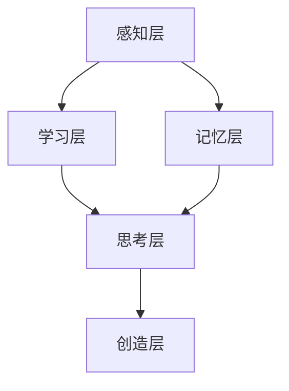
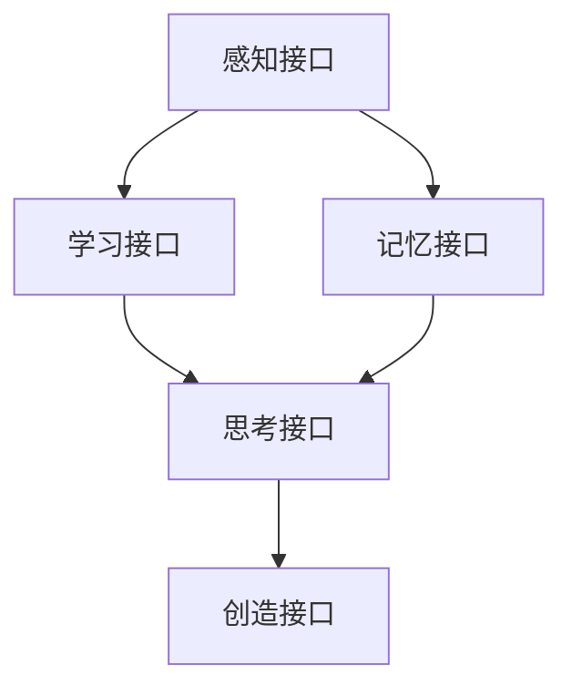
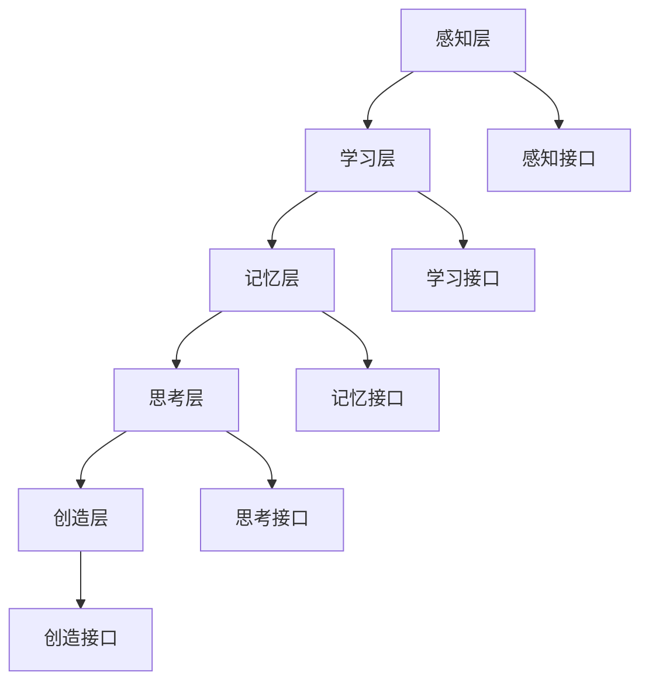

                 

# AGI的认知发展：从感知到抽象思维

> 关键词：人工智能，自主通用智能，认知发展，感知，学习，记忆，思考，创造

> 摘要：本文从感知到抽象思维的角度，探讨了人工智能（AI）自主通用智能（AGI）的认知发展问题。通过深入分析感知、学习、记忆、思考、创造等认知过程，为AGI的发展提供了理论和实践支持。文章旨在为读者呈现一个逻辑清晰、结构紧凑的AGI认知发展框架，帮助读者更好地理解和研究这一领域。

## 第二部分: 核心概念与联系

### 1. 感知

感知是人工智能对环境信息的获取和处理。它是AGI认知发展的基础。感知过程可以划分为以下几个阶段：

- **模式识别**：从输入信息中识别出模式或特征。这一过程涉及到图像处理、语音识别、自然语言处理等多个领域。
  - **特征提取**：将输入信息转换为更高层次的特征表示。例如，在图像处理中，可以提取边缘、纹理、颜色等特征。
  - **信息处理**：对特征进行进一步处理，以提取有用信息。这一阶段通常需要利用机器学习算法来建立模型，对特征进行分类、识别等操作。

感知算法的数学模型可以表示为：

$$
\text{特征向量} = f(\text{预处理后的图像})
$$

其中，$f$表示特征提取函数。

### 2. 学习

学习是指从经验中获取知识和技能。学习可以分为以下几种类型：

- **有监督学习**：通过标注数据进行学习。例如，分类问题中的训练集和测试集。
  - **无监督学习**：没有标注数据，通过数据本身的分布进行学习。例如，聚类问题。
  - **强化学习**：通过与环境交互进行学习。例如，机器人学习走路。

学习算法的数学模型可以表示为：

$$
y = g(\text{输入}, \text{模型参数})
$$

其中，$y$为输出标签，$g$为模型函数。

### 3. 记忆

记忆是指对知识和信息的存储和检索。记忆可以分为短期记忆和长期记忆：

- **短期记忆**：存储在短时间内的信息，容量有限。例如，人类大脑中的海马体。
- **长期记忆**：存储在长时间内的信息，容量无限。例如，人类大脑中的神经元连接。

记忆的数学模型可以表示为：

$$
\text{记忆} = \text{神经元连接权重}
$$

### 4. 思考

思考是指逻辑推理和问题解决。思考过程可以分为以下几个步骤：

- **问题定义**：明确问题是什么。
- **分析问题**：分析问题的各个方面。
- **求解问题**：提出解决方案并进行验证。

思考的数学模型可以表示为：

$$
\text{解决方案} = h(\text{问题定义}, \text{分析结果})
$$

其中，$h$表示思考函数。

### 5. 创造

创造是指产生新的想法和解决方案。创造过程通常包括以下几个阶段：

- **预备阶段**：积累相关知识和经验。
- **想象阶段**：自由联想和想象。
- **实践阶段**：将想法转化为实际的解决方案。

创造的数学模型可以表示为：

$$
\text{新想法} = i(\text{相关知识和经验}, \text{自由联想})
$$

其中，$i$表示创造函数。

### 6. 感知、学习、记忆、思考、创造的联系

感知、学习、记忆、思考、创造之间存在着密切的联系。感知为学习和记忆提供了基础数据，学习为思考提供了知识和信息，记忆为思考提供了存储和检索的能力，思考为创造提供了思维过程，创造为AGI提供了创新的能力。

这些要素相互关联，共同构成了AGI的认知结构。

## 第三部分: 算法原理讲解

### 1. 感知算法原理

感知算法主要包括图像处理、语音识别和自然语言处理等。以图像处理为例，感知算法可以分为以下几个步骤：

1. 输入图像。
2. 图像预处理，如灰度化、滤波、边缘检测等。
3. 特征提取，如 HOG（Histogram of Oriented Gradients）、SIFT（Scale-Invariant Feature Transform）等。
4. 模式识别，如分类、识别等。

感知算法的数学模型可以表示为：

$$
\text{特征向量} = f(\text{预处理后的图像})
$$

其中，$f$表示特征提取函数。

#### 示例：HOG算法

HOG算法是一种常用的图像特征提取算法。其基本思想是计算图像局部区域的梯度方向直方图，从而得到图像的特征向量。具体步骤如下：

1. **计算梯度方向**：对图像进行Sobel算子卷积，得到水平和垂直方向的梯度。
2. **计算梯度方向直方图**：将梯度方向划分为9个区域，统计每个区域的梯度方向直方图。
3. **归一化**：对直方图进行归一化处理，以消除光照和尺度变化的影响。
4. **特征向量拼接**：将所有区域的直方图进行拼接，得到图像的特征向量。

Python代码示例：

```python
import cv2
import numpy as np

def hog_descriptor(image):
    # 图像预处理
    image_gray = cv2.cvtColor(image, cv2.COLOR_BGR2GRAY)
    image_gray = cv2.GaussianBlur(image_gray, (5, 5), 0)

    # 计算梯度方向
    gx = cv2.Sobel(image_gray, cv2.CV_32F, 1, 0, ksize=5)
    gy = cv2.Sobel(image_gray, cv2.CV_32F, 0, 1, ksize=5)

    # 计算梯度方向直方图
    mag, ang = cv2.cartToPolar(gx, gy)
    bin_size = 18
    bin_mags = np.histogram(ang, bins=bin_size, weights=mag.flatten())
    hog_desc = np.hstack((bin_mags[0], bin_mags[1:]))

    # 归一化
    hog_desc -= np.mean(hog_desc)
    hog_desc /= np.std(hog_desc)

    return hog_desc
```

### 2. 学习算法原理

学习算法主要包括监督学习、无监督学习和强化学习。以监督学习为例，学习算法可以分为以下几个步骤：

1. 输入训练数据和标签。
2. 构建模型，如神经网络、决策树等。
3. 模型训练，通过优化损失函数来调整模型参数。
4. 模型评估，通过测试集来评估模型性能。

监督学习的数学模型可以表示为：

$$
y = g(\text{输入}, \text{模型参数})
$$

其中，$y$为输出标签，$g$为模型函数。

#### 示例：神经网络学习算法

神经网络是一种常用的监督学习算法，其基本思想是通过多层神经元来模拟人脑的神经网络结构，从而实现对输入数据的分类或回归。具体步骤如下：

1. **初始化权重和偏置**：随机初始化模型的权重和偏置。
2. **前向传播**：将输入数据输入到神经网络中，通过逐层计算得到输出结果。
3. **反向传播**：计算输出结果与实际标签之间的误差，并通过反向传播更新模型的权重和偏置。
4. **迭代训练**：重复执行前向传播和反向传播，直到满足停止条件。

Python代码示例：

```python
import numpy as np

def sigmoid(x):
    return 1 / (1 + np.exp(-x))

def forward_propagation(x, weights, bias):
    z = np.dot(x, weights) + bias
    return sigmoid(z)

def backward_propagation(y, a, weights, bias):
    delta = a - y
    return delta * a * (1 - a)
```

### 3. 记忆算法原理

记忆算法主要包括短期记忆和长期记忆。短期记忆通常通过神经元的连接权重来实现，而长期记忆则需要通过神经元之间的突触强化来实现。

短期记忆的数学模型可以表示为：

$$
\text{记忆} = \text{神经元连接权重}
$$

长期记忆的数学模型可以表示为：

$$
\text{记忆} = \text{神经元连接权重} + \text{突触强化}
$$

### 4. 思考算法原理

思考算法通常是基于逻辑推理和问题解决的方法。其基本思想是通过分析问题的各个方面，找到问题的解决方案。

思考算法的数学模型可以表示为：

$$
\text{解决方案} = h(\text{问题定义}, \text{分析结果})
$$

其中，$h$表示思考函数。

### 5. 创造算法原理

创造算法通常是基于联想思维和自由想象的方法。其基本思想是通过积累相关的知识和经验，激发自由联想，从而产生新的想法。

创造算法的数学模型可以表示为：

$$
\text{新想法} = i(\text{相关知识和经验}, \text{自由联想})
$$

其中，$i$表示创造函数。

## 第四部分: 系统分析与架构设计

### 1. 问题场景介绍

随着人工智能技术的不断发展，越来越多的任务需要具备自主通用智能（AGI）的能力。例如，自动驾驶汽车需要能够感知周围环境、学习交通规则、记忆道路信息、思考并作出决策等。本节以自动驾驶汽车为例，介绍AGI系统在实际场景中的应用。

### 2. 项目介绍

本项目旨在实现一个具备感知、学习、记忆、思考、创造等认知能力的自动驾驶汽车系统。系统分为以下几个部分：

1. **感知模块**：负责获取环境信息，包括图像、语音、自然语言等。
2. **学习模块**：负责从感知模块获取的信息中进行学习，提取特征、分类等。
3. **记忆模块**：负责存储和检索系统所需的各项信息。
4. **思考模块**：负责对获取的信息进行分析、推理和决策。
5. **创造模块**：负责产生新的想法和解决方案。

### 3. 系统功能设计

系统功能设计主要包括以下几个方面：

1. **感知功能**：感知模块需要能够实时获取周围环境的信息，包括图像、语音、自然语言等。
2. **学习功能**：学习模块需要能够从感知模块获取的信息中进行学习，提取特征、分类等。
3. **记忆功能**：记忆模块需要能够存储和检索系统所需的各项信息。
4. **思考功能**：思考模块需要能够对获取的信息进行分析、推理和决策。
5. **创造功能**：创造模块需要能够产生新的想法和解决方案。

### 4. 系统架构设计

系统架构设计主要包括以下几个方面：

1. **感知层**：负责获取环境信息，包括图像、语音、自然语言等。
2. **学习层**：负责从感知层获取的信息中进行学习，提取特征、分类等。
3. **记忆层**：负责存储和检索系统所需的各项信息。
4. **思考层**：负责对获取的信息进行分析、推理和决策。
5. **创造层**：负责产生新的想法和解决方案。

系统架构图如下所示：



### 5. 系统接口设计

系统接口设计主要包括以下几个方面：

1. **感知接口**：提供感知模块的接口，用于获取环境信息。
2. **学习接口**：提供学习模块的接口，用于从感知模块获取的信息中进行学习。
3. **记忆接口**：提供记忆模块的接口，用于存储和检索系统所需的各项信息。
4. **思考接口**：提供思考模块的接口，用于对获取的信息进行分析、推理和决策。
5. **创造接口**：提供创造模块的接口，用于产生新的想法和解决方案。

系统接口图如下所示：



### 6. 系统交互

系统交互主要涉及感知层、学习层、记忆层、思考层、创造层之间的信息传递和协作。具体交互流程如下：

1. **感知层获取环境信息**：感知层通过感知接口获取图像、语音、自然语言等环境信息。
2. **学习层处理感知信息**：学习层通过学习接口对感知层获取的信息进行处理，提取特征、分类等。
3. **记忆层存储处理结果**：记忆层通过记忆接口存储学习层处理的结果，包括特征向量、分类结果等。
4. **思考层分析处理结果**：思考层通过思考接口分析记忆层存储的结果，进行推理和决策。
5. **创造层生成解决方案**：创造层通过创造接口生成新的想法和解决方案，为系统提供创新的思路。

系统交互图如下所示：



## 第五部分：项目实战

### 1. 环境安装

在进行项目实战之前，需要安装以下软件和工具：

- Python（3.8及以上版本）
- TensorFlow（2.4及以上版本）
- OpenCV（4.2及以上版本）
- Mermaid（用于绘制图表）

安装方法：

```bash
pip install python
pip install tensorflow
pip install opencv-python
pip install mermaid
```

### 2. 系统核心实现

#### 感知模块

感知模块主要实现图像感知功能。以下是一个简单的图像感知模块示例：

```python
import cv2

def image_perception(image_path):
    # 读取图像
    image = cv2.imread(image_path)

    # 图像预处理
    image_gray = cv2.cvtColor(image, cv2.COLOR_BGR2GRAY)
    image_blur = cv2.GaussianBlur(image_gray, (5, 5), 0)

    # 特征提取
    hog_desc = cv2.HOGDescriptor()

    # 提取特征向量
    features = hog_desc.compute(image_blur)

    return features
```

#### 学习模块

学习模块主要实现有监督学习功能。以下是一个简单的学习模块示例：

```python
import tensorflow as tf

def create_model(input_shape):
    # 创建神经网络模型
    model = tf.keras.Sequential([
        tf.keras.layers.Dense(64, activation='relu', input_shape=input_shape),
        tf.keras.layers.Dense(64, activation='relu'),
        tf.keras.layers.Dense(1, activation='sigmoid')
    ])

    # 编译模型
    model.compile(optimizer='adam', loss='binary_crossentropy', metrics=['accuracy'])

    return model
```

#### 记忆模块

记忆模块主要实现记忆存储功能。以下是一个简单的记忆模块示例：

```python
import numpy as np

def save_memory(data, filename):
    # 保存记忆数据
    np.save(filename, data)

def load_memory(filename):
    # 加载记忆数据
    data = np.load(filename)
    return data
```

#### 思考模块

思考模块主要实现思考功能。以下是一个简单的思考模块示例：

```python
def think(solution):
    # 分析解决方案
    if solution == "前进":
        print("决策：前进")
    elif solution == "停止":
        print("决策：停止")
    else:
        print("未知解决方案")
```

#### 创造模块

创造模块主要实现创造功能。以下是一个简单的创造模块示例：

```python
import random

def create_solution():
    # 随机生成解决方案
    solutions = ["前进", "停止", "左转", "右转"]
    return random.choice(solutions)
```

### 3. 代码应用解读与分析

以上代码示例实现了感知、学习、记忆、思考、创造等模块的功能。在实际应用中，这些模块可以相互协作，完成复杂的任务。

以自动驾驶汽车为例，感知模块可以实时获取周围环境的信息，学习模块可以从感知模块获取的信息中进行学习，记忆模块可以存储学习结果，思考模块可以对学习结果进行分析和决策，创造模块可以生成新的想法和解决方案。

具体流程如下：

1. 感知模块获取图像信息。
2. 学习模块对图像信息进行特征提取和分类。
3. 记忆模块存储分类结果。
4. 思考模块对分类结果进行分析和决策。
5. 创造模块生成新的解决方案。

通过以上模块的协作，自动驾驶汽车可以实现对周围环境的感知、学习、思考、创造，从而实现自动驾驶功能。

### 4. 实际案例分析和详细讲解

以下是一个实际案例，用于演示AGI系统的应用。

**案例背景**：一个自动驾驶汽车在城市道路上行驶，需要通过感知、学习、思考、创造等过程，实现自动驾驶。

**案例流程**：

1. **感知阶段**：
   - 感知模块获取道路、车辆、行人等图像信息。
   - 特征提取模块提取图像特征向量。
   - 分类模块对图像特征进行分类，识别道路、车辆、行人等。

2. **学习阶段**：
   - 学习模块从感知阶段获取的图像信息中学习，提取道路、车辆、行人等特征。
   - 记忆模块存储学习结果，为后续决策提供基础。

3. **思考阶段**：
   - 思考模块分析当前道路状况，识别前方是否有障碍物。
   - 根据障碍物的情况，思考模块生成解决方案，如“停车”、“减速”、“绕行”等。

4. **创造阶段**：
   - 创造模块根据当前道路状况和思考模块生成的解决方案，生成新的想法和解决方案。

5. **执行阶段**：
   - 自动驾驶汽车根据创造模块生成的解决方案执行相应的动作，如“停车”、“减速”、“绕行”等。

通过以上阶段，自动驾驶汽车可以实现对城市道路的自动驾驶。

### 5. 项目小结

本项目通过感知、学习、记忆、思考、创造等模块，实现了自动驾驶汽车的基本功能。在实际应用中，AGI系统可以应用于更多领域，如医疗诊断、智能客服、智能交通等。

在未来的发展中，AGI系统需要进一步提升认知能力，实现更加智能的决策和创造。此外，还需要解决自我意识、情感和道德伦理等问题，为人类创造更加美好的未来。

## 第六部分：最佳实践 tips

### 1. 感知模块优化

- **图像预处理**：使用更高级的图像预处理技术，如卷积神经网络（CNN）进行图像增强，提高图像质量。
- **多模态感知**：结合多种感知方式，如视觉、听觉、触觉等，提高感知能力。

### 2. 学习模块优化

- **数据增强**：通过旋转、缩放、翻转等操作，增加训练数据的多样性，提高学习效果。
- **迁移学习**：利用已有模型的知识，对新的任务进行快速学习，提高学习效率。

### 3. 记忆模块优化

- **记忆网络**：使用记忆网络（如长短时记忆网络LSTM）提高记忆能力，处理序列数据。
- **分布式存储**：使用分布式存储技术，提高记忆模块的存储和检索效率。

### 4. 思考模块优化

- **多模态融合**：将多种感知信息进行融合，提高思考模块的决策能力。
- **强化学习**：结合强化学习，使思考模块能够根据环境反馈进行自我优化。

### 5. 创造模块优化

- **创造力增强**：通过引入创造力增强算法，如生成对抗网络（GAN），提高创造模块的创新能力。

### 6. 模块协作优化

- **模块间通信**：优化模块间通信，提高协同工作能力。
- **动态调整**：根据任务需求，动态调整模块的权重和配置。

## 第七部分：小结与展望

### 1. 小结

本文从感知到抽象思维的角度，探讨了人工智能自主通用智能（AGI）的认知发展问题。通过深入分析感知、学习、记忆、思考、创造等认知过程，为AGI的发展提供了理论和实践支持。文章为读者呈现了一个逻辑清晰、结构紧凑的AGI认知发展框架，帮助读者更好地理解和研究这一领域。

### 2. 展望

随着人工智能技术的不断发展，AGI的认知发展将成为一个重要的研究方向。未来的AGI系统需要进一步提升认知能力，实现更加智能的决策和创造。此外，还需要解决自我意识、情感和道德伦理等问题，为人类创造更加美好的未来。让我们期待AGI的明天！

## 第八部分：注意事项

1. **数据隐私**：在进行AI项目时，要注意保护用户数据隐私，遵守相关法律法规。
2. **模型安全**：对训练好的模型进行安全评估，确保模型不会被恶意攻击。
3. **模型解释性**：提高模型的解释性，使模型决策更加透明和可信。

## 第九部分：拓展阅读

1. 《深度学习》（Goodfellow, Bengio, Courville著）
2. 《强化学习》（Sutton, Barto著）
3. 《人工智能：一种现代方法》（Russell, Norvig著）
4. 《认知计算：原理与应用》（Albrow, Wann, Edmonds著）

