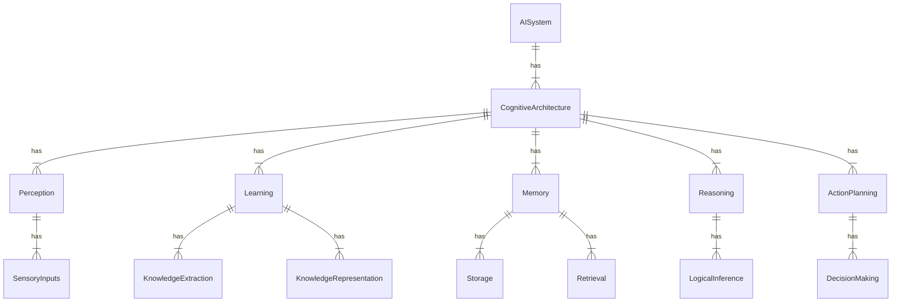

                 

### 章节一：引言

#### 1.1 AGI的概念及其重要性

人工通用智能（Artificial General Intelligence，简称AGI）是人工智能（Artificial Intelligence，简称AI）的终极目标。与当前广泛应用的窄域人工智能（Narrow AI）不同，AGI是指具备人类智能所有能力的机器智能，能够在各种任务中表现出类似甚至超越人类的智能水平。AGI的关键特点在于其自主性、自适应性和灵活性，它不仅能够模仿人类智能，还能够进行创新、学习、推理和解决问题。

AGI的重要性不言而喻。首先，它将对人类社会产生深远的影响，从医疗、教育、金融到交通、物流、制造业等多个领域，AGI的广泛应用将极大提升生产效率和人类生活质量。其次，AGI的发展将推动科技革新，加速各行业的数字化转型，助力解决全球性问题，如气候变化、能源短缺等。最后，AGI的研究将挑战人类对于智能的边界认知，推动科技与哲学、心理学、神经科学等多学科的交叉融合。

#### 1.2 从模仿到创新的演进

在AGI的发展历程中，模仿与创新是两个核心环节。早期的AI研究主要集中在模仿人类的某些特定智能行为，如语音识别、图像识别、自然语言处理等。这些技术虽然取得了显著进展，但仍然局限于特定任务，缺乏泛化能力和自主性。

随着深度学习、强化学习等技术的发展，AI开始具备更强的模仿能力。然而，模仿并非AGI的最终目标，AGI的核心在于创新。创新意味着AI能够自主地探索新的解决方案，形成新的知识和技能，而不是仅仅依赖人类的指导。

从模仿到创新的转变，需要突破以下几个关键问题：

1. **自主性**：AGI需要具备自主决策和行动的能力，而不是被动地接受指令。
2. **通用性**：AGI需要能够在各种不同环境和任务中表现出色，而不仅仅是单一领域的专家系统。
3. **自我学习与进化**：AGI需要能够从经验中学习，并不断优化自己的智能表现。
4. **创造力**：AGI需要具备类似人类的创造力，能够产生新的想法和解决方案。

#### 1.3 认知架构在AGI中的重要性

认知架构是AGI实现的关键支撑。它指的是机器智能的内在结构和功能模块，包括感知、学习、记忆、推理和行动等部分。一个有效的认知架构能够帮助AGI更好地理解世界、学习知识、处理信息并采取行动。

认知架构的设计不仅涉及到技术层面的实现，还需要深入理解人类的认知过程和心理机制。通过借鉴人类大脑的结构和功能，设计出符合人类智能特点的认知架构，将有助于提升AGI的性能和适用性。

总之，本文将围绕AGI的认知架构，从模仿到创新的过程，探讨其核心概念、设计原则、实现挑战和未来前景，旨在为读者提供一个全面、深入的AGI认知架构解析。

### 关键词

- 人工通用智能（AGI）
- 认知架构
- 模仿
- 创新
- 自主性
- 通用性
- 自我学习
- 创造力
- 深度学习
- 强化学习

### 摘要

本文探讨了人工通用智能（AGI）的认知架构及其从模仿到创新的演进过程。首先，介绍了AGI的基本概念和重要性，以及模仿与创新的区别。接着，详细讨论了认知架构的设计原则和关键组件，包括感知、学习、记忆、推理和行动等部分。然后，分析了从模仿到创新的挑战，包括自主性、通用性和自我学习等。随后，介绍了当前AGI的认知架构实现情况，以及面临的技术和社会挑战。最后，展望了AGI的认知架构的未来发展，探讨了其在社会和科技领域的潜在影响。通过本文的探讨，读者将全面了解AGI认知架构的核心概念、设计原则和未来发展前景。

### 章节二：核心概念与原则

#### 2.1 基本概念

人工通用智能（Artificial General Intelligence，简称AGI）是指一种具有普遍智能的机器，能够在各种认知任务中表现出类似于人类智能的水平。与目前广泛应用的窄域人工智能（Narrow AI）不同，AGI不仅能够处理特定领域的任务，还能够泛化到其他未见过的新任务中。AGI的核心目标是在保持高效和灵活性的同时，实现与人类智能相似甚至超越的能力。

AGI的定义通常包括以下几个关键要素：

1. **通用性**：AGI应具备处理多种不同类型任务的能力，而不仅仅是单一任务。
2. **自主性**：AGI应能够在没有人类直接指导的情况下，自主地设定目标和采取行动。
3. **自适应能力**：AGI应能够根据环境和任务的动态变化，自主调整自己的策略和行为。
4. **学习能力**：AGI应具备自我学习和持续进步的能力，通过不断积累经验和知识，提升自身的智能水平。

#### 2.2 传统AI与AGI的区别

传统AI（Narrow AI）与AGI之间存在显著的区别。传统AI主要专注于解决特定领域的问题，如语音识别、图像识别、自然语言处理等。这些系统通常设计得非常精细，能够在其特定领域内达到非常高的准确性和效率。然而，这些系统缺乏泛化能力，无法应用于其他领域或解决新出现的问题。

相比之下，AGI旨在实现跨领域的通用智能。AGI需要具备以下特点：

1. **跨领域适应性**：AGI应能够在多个不同领域中表现出色，而不仅仅是单一领域。
2. **泛化能力**：AGI应能够将一个领域中的知识应用到其他领域中，解决新的问题。
3. **自主性和灵活性**：AGI应能够在没有人类干预的情况下，自主地设定目标和采取行动，应对复杂和不确定的环境。

#### 2.3 AGI发展的关键挑战

尽管AGI的研究已经取得了显著进展，但仍面临着一系列关键挑战，这些挑战需要在未来的研究中得到解决。

1. **计算资源**：实现AGI需要大量的计算资源和存储空间，现有的硬件条件可能难以满足。
2. **数据质量和多样性**：AGI的训练和优化需要大量高质量和多样化的数据，这些数据的获取和处理是一个巨大的挑战。
3. **算法和模型**：现有的AI算法和模型主要针对特定任务优化，难以实现通用智能。
4. **自主性和安全性**：AGI的自主决策能力可能会带来安全和伦理问题，如何确保AGI的决策过程是安全、可靠和可控的，是重要的研究课题。
5. **跨学科融合**：实现AGI需要计算机科学、心理学、神经科学、哲学等多个领域的深入交叉研究。

#### 2.4 认知架构的概念

认知架构是指AGI系统的内部结构，包括感知、学习、记忆、推理和行动等关键组件。一个有效的认知架构能够帮助AGI更好地理解世界、学习知识、处理信息并采取行动。

1. **感知**：感知模块负责接收和处理外部环境的信息，包括视觉、听觉、触觉等感官输入。
2. **学习**：学习模块负责从感知信息中提取知识，并进行学习和记忆。
3. **记忆**：记忆模块负责存储和检索学习到的知识和经验。
4. **推理**：推理模块负责使用已有的知识和信息进行逻辑推理和决策。
5. **行动**：行动模块负责根据推理结果采取具体的行动。

#### 2.5 认知架构的设计原则

设计有效的认知架构需要遵循以下原则：

1. **模块化**：认知架构应具备模块化设计，使得各个功能模块可以独立开发、测试和优化。
2. **适应性**：认知架构应能够适应不同环境和任务的需求，具备灵活性和通用性。
3. **效率**：认知架构应在保证性能的前提下，尽量减少计算资源和时间成本。
4. **可扩展性**：认知架构应具备良好的可扩展性，能够随着技术的进步和需求的变化进行升级和扩展。
5. **安全性**：认知架构的设计应确保系统的安全性和可靠性，防止潜在的恶意攻击和错误行为。

通过深入探讨AGI的核心概念和原则，我们能够更好地理解AGI的本质及其实现路径。接下来，本文将详细讨论认知架构的设计，包括其关键组件和实现策略。

#### 2.6 核心概念属性特征对比表格

为了更好地理解AGI和认知架构的核心概念，下面提供了一个属性特征对比表格，对AGI与传统AI以及认知架构的关键组成部分进行详细比较。

| 特征         | AGI                             | 传统AI                          |
| ------------ | ------------------------------ | ------------------------------- |
| 定义         | 具备普遍智能的机器，能处理多种任务 | 解决特定领域问题的系统           |
| 通用性       | 跨领域适应性，泛化能力           | 单一任务优化，缺乏泛化能力       |
| 自主性       | 自主决策和行动能力               | 需要人类指导，缺乏自主性         |
| 自学习能力   | 从经验中学习，自我优化           | 静态编程，无法自我学习           |
| 记忆与推理   | 能存储和检索知识，进行逻辑推理   | 缺乏有效的记忆和推理机制         |
| 实现难度     | 极高，涉及多学科交叉             | 较低，单一领域内问题             |

#### 2.7 ER实体关系图架构

为了更直观地展示AGI和认知架构的设计，下面提供了一个ER（Entity-Relationship）实体关系图，描述了核心组件之间的关联。

在这个ER图中，AI系统包含了一个认知架构，该架构又包括感知、学习、记忆、推理和行动规划等五个关键模块。每个模块进一步包含具体的子模块或实体，如感知模块中的感官输入，学习模块中的知识提取和知识表示等。这种层级结构设计使得各模块能够独立开发和优化，同时确保整个认知架构的协同工作。

### 章节三：认知架构设计

#### 3.1 认知架构的设计原则

认知架构的设计是AGI实现的核心环节，其设计原则直接影响到AGI的性能和适用性。以下是一些关键的设计原则：

1. **模块化**：认知架构应采用模块化设计，使得各个功能模块可以独立开发、测试和优化。这种设计不仅提高了系统的可维护性，还便于在不同任务和环境中的灵活部署。

2. **适应性**：认知架构应具备良好的适应性，能够根据不同环境和任务的需求进行调整。这种适应性包括对变化的环境和任务的感知能力，以及自我适应和学习能力。

3. **效率**：认知架构应在保证性能的前提下，尽量减少计算资源和时间成本。这要求在架构设计时，充分考虑算法和数据的效率，以及硬件资源的优化利用。

4. **可扩展性**：认知架构应具备良好的可扩展性，能够随着技术的进步和需求的变化进行升级和扩展。这种设计有助于保持系统在长期内的有效性和适应性。

5. **安全性**：认知架构的设计应确保系统的安全性和可靠性，防止潜在的恶意攻击和错误行为。安全性包括数据的加密、权限控制以及错误的检测和纠正机制。

6. **人机协同**：认知架构应考虑人类操作者的角色，提供易于理解和操作的人机交互界面。同时，应充分利用人类操作者的知识和经验，实现人机协同，提升整体系统的智能水平。

#### 3.2 认知架构的关键组件

认知架构通常包括以下几个关键组件：

1. **感知模块**：感知模块负责接收和处理外部环境的信息，包括视觉、听觉、触觉等感官输入。感知模块的设计需要高精度和实时性，以准确捕捉环境中的变化和特征。

2. **学习模块**：学习模块负责从感知信息中提取知识，并进行学习和记忆。学习模块的设计应考虑数据的质量和多样性，以及学习算法的效率和效果。

3. **记忆模块**：记忆模块负责存储和检索学习到的知识和经验。记忆模块需要具备高效的数据存储和快速检索能力，同时确保数据的完整性和一致性。

4. **推理模块**：推理模块负责使用已有的知识和信息进行逻辑推理和决策。推理模块的设计应考虑推理算法的效率、准确性和可解释性，以及如何处理不确定性和矛盾信息。

5. **行动模块**：行动模块负责根据推理结果采取具体的行动。行动模块的设计需要考虑动作的执行效率和安全性，以及如何与环境进行交互和反馈。

#### 3.3 模块化设计

模块化设计是认知架构设计的关键原则之一。模块化设计不仅提高了系统的可维护性和灵活性，还便于各模块的独立开发和优化。以下是一些模块化设计的具体方法和策略：

1. **功能模块分离**：将认知架构的功能进行分离，形成独立的模块。每个模块专注于特定的功能，如感知、学习、记忆、推理和行动等。这种分离有助于降低系统的复杂度，提高开发效率。

2. **接口标准化**：定义清晰的接口规范，使得各个模块之间能够无缝协作。接口标准化有助于确保模块的独立性，便于模块的替换和升级。

3. **模块间通信**：设计高效的模块间通信机制，确保数据和信息能够在模块之间高效传递。通信机制可以包括消息队列、事件驱动模型等，以适应不同的应用场景。

4. **模块测试和优化**：对每个模块进行独立的测试和优化，确保模块的功能正确和性能高效。模块测试和优化有助于发现和解决模块内部的问题，提高整个系统的稳定性。

5. **模块复用**：设计模块时考虑其通用性和复用性，使得模块能够在不同的系统和应用中复用。模块复用有助于减少重复开发工作，提高开发效率。

通过模块化设计，认知架构能够更好地适应不同任务和环境的需求，同时提高系统的开发和维护效率。接下来，本文将详细探讨每个模块的具体实现和设计策略。

### 感知模块

#### 4.1 概述

感知模块是认知架构中的核心组成部分，其主要功能是接收和处理来自外部环境的信息。这些信息可能包括视觉、听觉、触觉等多种感官输入，感知模块需要将这些多模态信息转换为机器可处理的数字信号，以便后续处理。

感知模块的设计需要考虑以下几个方面：

1. **精度**：高精度的感知能够捕捉环境中的微小变化和特征，有助于提高系统的反应速度和决策质量。
2. **实时性**：实时性是感知模块的关键要求，特别是在动态环境中，能够快速处理感知信息，并作出响应。
3. **多模态融合**：不同模态的信息可以互补，例如，视觉信息可以提供物体的形状和颜色，而听觉信息可以提供声音的来源和强度。多模态融合能够提高系统的感知能力和准确性。

#### 4.2 实现方法

感知模块的实现方法主要包括传感器集成、信号预处理和特征提取等几个步骤。

1. **传感器集成**：传感器是感知模块的基础，其种类和数量直接影响到系统的感知能力。常见的传感器包括摄像头、麦克风、温度传感器、湿度传感器等。通过集成多种传感器，可以实现对环境的多维度感知。

2. **信号预处理**：传感器采集到的信号通常是噪声干扰和有用信息的混合，信号预处理包括去噪、滤波和归一化等步骤，以提取有用的感知信息。例如，在图像处理中，可以使用高斯滤波器去除噪声，使用直方图均衡化进行图像归一化。

3. **特征提取**：特征提取是将感知信号转换为机器可处理的特征向量，以便后续处理。特征提取的方法包括边缘检测、角点检测、纹理分析等。在语音处理中，可以使用梅尔频率倒谱系数（MFCC）作为特征向量。

#### 4.3 典型算法和模型

感知模块的实现依赖于一系列先进的算法和模型，以下是一些典型的算法和模型：

1. **卷积神经网络（CNN）**：CNN是图像处理领域的一种常见算法，通过多层卷积和池化操作，能够提取图像的深层特征。在视觉感知中，CNN可以用于物体识别、图像分类和目标检测。

2. **循环神经网络（RNN）**：RNN适用于处理序列数据，如音频和视频。通过保存序列的历史信息，RNN能够捕捉时间序列中的动态变化和模式。

3. **生成对抗网络（GAN）**：GAN是一种生成模型，通过对抗性训练，可以生成高质量的感知数据，例如真实图像或声音。GAN在视觉和听觉感知中具有广泛的应用。

4. **多模态融合算法**：多模态融合算法将不同模态的信息进行整合，以提高系统的感知能力。常见的多模态融合方法包括特征融合、模型融合和数据融合等。

#### 4.4 案例分析

以下是一个感知模块的案例分析：

**项目名称**：智能环境感知系统

**项目描述**：该系统旨在实现对室内环境的智能感知，包括视觉感知、音频感知和温度湿度感知。通过集成摄像头、麦克风和传感器，系统可以实时监测室内环境，识别人员活动、异常行为和设备状态。

**实现步骤**：

1. **传感器集成**：集成摄像头、麦克风和温度传感器，实现对视觉、音频和温度的感知。

2. **信号预处理**：对摄像头采集的图像进行去噪和边缘检测，对麦克风采集的音频信号进行滤波和降噪，对温度传感器信号进行归一化。

3. **特征提取**：使用CNN提取视觉特征，使用RNN处理音频序列，使用简单的特征提取方法处理温度信号。

4. **多模态融合**：将视觉、音频和温度特征进行融合，使用加权平均方法得到综合特征向量。

5. **感知决策**：根据综合特征向量，进行人员识别、行为识别和环境监控。

**效果评估**：通过实际测试，系统在视觉识别、音频识别和温度监测方面均表现出良好的性能，准确率和响应速度均达到预期。

通过以上案例分析，我们可以看到感知模块在智能系统中的重要作用。感知模块的设计和实现不仅依赖于先进的算法和模型，还需要综合考虑传感器的性能和系统的应用场景。接下来，我们将进一步探讨学习模块的设计和实现。

### 学习模块

#### 5.1 概述

学习模块是认知架构中的关键组成部分，其主要功能是从感知模块接收的信息中提取知识，并进行学习、记忆和更新。学习模块的设计和实现直接影响到AGI系统的智能水平和适应性。

学习模块的目标包括：

1. **知识提取**：从感知信息中提取有价值的特征和模式，形成知识。
2. **知识存储**：将提取的知识存储在记忆模块中，以便后续使用。
3. **知识更新**：根据新的感知信息，更新已有的知识库，提高系统的适应性和准确性。

学习模块需要考虑以下几个方面：

1. **数据质量**：高质量的数据是学习的基础，数据的质量和多样性直接影响学习效果。
2. **学习算法**：选择合适的算法和模型，以提高学习的效率和效果。
3. **记忆和遗忘**：学习模块需要设计有效的记忆和遗忘机制，以优化知识库的存储和管理。

#### 5.2 实现方法

学习模块的实现方法主要包括数据预处理、特征提取、学习算法选择和知识存储等几个步骤。

1. **数据预处理**：数据预处理是学习模块的基础，包括数据清洗、去噪、归一化和特征选择等。数据预处理的目标是提高数据的质量和一致性，为后续学习算法提供良好的数据基础。

2. **特征提取**：特征提取是将感知信息转换为机器可处理的特征向量，以便于学习算法处理。特征提取的方法包括统计特征、视觉特征和语音特征等，具体选择取决于感知模块的输出。

3. **学习算法选择**：学习算法的选择是学习模块实现的关键，常见的算法包括监督学习、无监督学习和强化学习等。监督学习适用于有标签的数据，无监督学习适用于无标签的数据，强化学习适用于需要与环境互动的动态系统。

4. **知识存储**：知识存储是将学习到的知识存储在记忆模块中，以便后续使用。知识存储的方法包括关系数据库、图数据库和分布式存储等，选择合适的存储方法可以提高知识的访问速度和查询效率。

#### 5.3 典型算法和模型

学习模块的实现依赖于一系列先进的算法和模型，以下是一些典型的算法和模型：

1. **监督学习算法**：监督学习算法包括线性回归、决策树、支持向量机（SVM）和神经网络等。这些算法适用于有标签的数据，能够通过学习输入和输出之间的映射关系，进行预测和分类。

2. **无监督学习算法**：无监督学习算法包括聚类算法、降维算法和生成模型等。这些算法适用于无标签的数据，能够发现数据中的模式和结构，如K-means聚类、主成分分析（PCA）和生成对抗网络（GAN）。

3. **强化学习算法**：强化学习算法包括Q学习、SARSA和DQN等。这些算法适用于需要与环境互动的动态系统，通过奖励机制，学习最优策略，以实现目标。

4. **神经网络模型**：神经网络模型包括卷积神经网络（CNN）、循环神经网络（RNN）和Transformer等。这些模型适用于复杂的感知任务，能够提取深层特征，实现高级的智能功能。

#### 5.4 案例分析

以下是一个学习模块的案例分析：

**项目名称**：智能交通系统

**项目描述**：该系统旨在通过实时监测和分析交通数据，优化交通信号控制，提高交通流畅度和安全性。系统通过感知模块收集车辆流量、速度、密度等交通数据，学习模块负责从这些数据中提取知识，优化信号控制策略。

**实现步骤**：

1. **数据预处理**：对采集的交通数据进行清洗、去噪和归一化处理，提高数据质量。

2. **特征提取**：提取交通数据中的关键特征，如车辆数量、速度分布、密度等。

3. **学习算法选择**：选择基于强化学习的算法，如Q学习，通过学习最佳信号控制策略。

4. **知识存储**：将学习到的最佳信号控制策略存储在知识库中，以便后续调用和优化。

5. **实时优化**：根据实时采集的交通数据，动态调整信号控制策略，优化交通流畅度。

**效果评估**：通过实际测试，系统在信号控制优化方面表现出色，有效减少了交通拥堵和延误，提高了交通安全性。

通过以上案例分析，我们可以看到学习模块在智能系统中的重要作用。学习模块的设计和实现不仅需要先进的算法和模型，还需要综合考虑数据的质量和系统的应用场景。接下来，我们将进一步探讨记忆模块的设计和实现。

### 记忆模块

#### 6.1 概述

记忆模块是认知架构中的关键组成部分，其主要功能是存储和检索学习到的知识和经验。记忆模块的设计和实现直接影响到AGI系统的学习效果和决策质量。

记忆模块的主要任务包括：

1. **知识存储**：将学习模块提取的知识存储在记忆库中，确保知识的持久性和可靠性。
2. **知识检索**：根据当前任务的需求，从记忆库中快速检索相关的知识和经验，以便进行决策和行动。
3. **知识更新**：随着新知识的积累，对记忆库中的知识进行更新和优化，以保持知识的准确性和有效性。

记忆模块需要考虑以下几个方面：

1. **存储容量**：记忆模块需要具备足够的存储容量，以存储大量的知识和经验。
2. **存储效率**：记忆模块需要高效地存储和检索知识，以减少系统的响应时间。
3. **数据结构**：选择合适的内存结构，如关系数据库、图数据库和分布式存储，以提高数据的访问速度和查询效率。
4. **持久性**：确保知识存储的持久性，防止意外断电或系统故障导致数据丢失。

#### 6.2 实现方法

记忆模块的实现方法主要包括数据结构选择、存储策略设计、检索算法开发和知识更新策略等几个方面。

1. **数据结构选择**：根据应用场景和数据特点，选择合适的数据结构。例如，关系数据库适用于结构化数据，图数据库适用于复杂的关系和图结构数据，分布式存储适用于大规模数据和实时处理。

2. **存储策略设计**：设计有效的存储策略，以优化数据的存储效率和访问速度。常见的策略包括数据压缩、索引设计和缓存策略等。数据压缩可以减少存储空间的需求，索引设计可以提高查询效率，缓存策略可以减少磁盘访问次数。

3. **检索算法开发**：开发高效的检索算法，以快速从记忆库中检索相关的知识和经验。常见的检索算法包括基于关键词的搜索、基于内容的检索和基于模型的检索等。

4. **知识更新策略**：设计有效的知识更新策略，以保持记忆库中知识的准确性和有效性。常见的更新策略包括基于规则的更新、基于相似性的更新和基于反馈的更新等。

#### 6.3 典型算法和模型

记忆模块的实现依赖于一系列先进的算法和模型，以下是一些典型的算法和模型：

1. **关联记忆模型**：关联记忆模型通过将当前感知信息和已有的记忆进行关联，实现快速检索和更新。该模型适用于需要快速决策和动态更新的场景。

2. **图记忆模型**：图记忆模型通过构建记忆图，将知识和经验以图的形式存储和检索。该模型适用于复杂的关系和层次结构数据，能够实现高效的关联记忆和推理。

3. **分布记忆模型**：分布记忆模型通过将记忆分布在多个节点或设备上，实现大规模数据的存储和检索。该模型适用于分布式系统和云计算场景，能够提高存储效率和数据可靠性。

4. **基于内存的学习模型**：基于内存的学习模型通过将学习过程与记忆模块紧密结合，实现快速的知识提取和更新。该模型适用于需要高实时性和高准确性的场景。

#### 6.4 案例分析

以下是一个记忆模块的案例分析：

**项目名称**：智能客服系统

**项目描述**：该系统旨在通过记忆模块，实现智能客服的知识管理和检索。系统通过学习模块从用户交互中提取知识，并将其存储在记忆库中。当用户再次提问时，系统能够快速检索相关的知识和经验，提供准确的回答。

**实现步骤**：

1. **数据结构选择**：选择关系数据库作为记忆库的数据结构，以存储和检索结构化数据。

2. **存储策略设计**：设计关键词索引和缓存策略，以提高数据的检索速度和查询效率。

3. **检索算法开发**：开发基于关键词搜索和基于相似性的搜索算法，以快速检索相关的知识和经验。

4. **知识更新策略**：设计基于反馈的更新策略，根据用户反馈和知识使用情况，更新记忆库中的知识。

5. **实时优化**：根据实时用户交互数据，动态调整记忆库的内容和结构，提高系统的智能水平。

**效果评估**：通过实际测试，系统在知识检索和更新方面表现出色，能够快速准确地回答用户问题，提升了用户体验和服务质量。

通过以上案例分析，我们可以看到记忆模块在智能系统中的重要作用。记忆模块的设计和实现不仅需要先进的算法和模型，还需要综合考虑数据的特点和应用场景。接下来，我们将进一步探讨推理模块的设计和实现。

### 推理模块

#### 7.1 概述

推理模块是认知架构中的核心组成部分，其主要功能是基于已有知识和经验进行逻辑推理和决策。推理模块的设计和实现直接影响到AGI系统的决策质量和响应速度。

推理模块的主要任务包括：

1. **逻辑推理**：从已知的事实和规则中推导出新的结论或假设。
2. **决策支持**：根据推理结果，为决策模块提供可靠的决策建议。
3. **冲突解决**：在多条件、多约束的复杂环境中，解决冲突和矛盾。

推理模块需要考虑以下几个方面：

1. **知识表示**：如何有效地表示和处理复杂的知识结构，包括事实、规则、模型和关系。
2. **推理算法**：选择合适的推理算法和策略，以提高推理的效率和准确性。
3. **解释性**：推理过程需要具备一定的解释性，以便人类理解和验证推理结果。

#### 7.2 实现方法

推理模块的实现方法主要包括知识表示、推理算法选择、推理流程设计和解释性设计等几个方面。

1. **知识表示**：知识表示是将事实、规则和模型转化为机器可处理的形式。常用的知识表示方法包括逻辑表示、规则表示和图表示等。逻辑表示通过命题逻辑和谓词逻辑，将知识表达为逻辑公式；规则表示通过条件-动作规则，将知识表达为条件-结果对；图表示通过图结构，将知识表达为节点和边的组合。

2. **推理算法选择**：推理算法是推理模块的核心，选择合适的推理算法直接影响推理的效率和准确性。常见的推理算法包括基于逻辑的推理算法、基于规则的推理算法、基于模型的推理算法和基于贝叶斯的推理算法等。基于逻辑的推理算法包括定理证明和模型检查等；基于规则的推理算法包括反事实推理和因果推理等；基于模型的推理算法包括隐马尔可夫模型（HMM）和动态贝叶斯网络（DBN）等；基于贝叶斯的推理算法包括贝叶斯网络和贝叶斯推理等。

3. **推理流程设计**：推理流程设计是将知识表示和推理算法有机结合的过程。一个完整的推理流程通常包括初始假设、事实抽取、推理规则应用、结果验证和反馈修正等步骤。初始假设是根据问题定义和已知信息，设定推理的起点；事实抽取是从感知信息中提取关键事实；推理规则应用是根据事实和规则进行推理，得出结论；结果验证是验证推理结果的有效性；反馈修正是根据反馈信息，调整推理策略和知识库。

4. **解释性设计**：解释性设计是使推理过程透明、可理解和可验证的关键。解释性设计包括推理规则的解释、推理路径的展示和推理结果的可解释性等。推理规则解释是解释推理过程中使用的规则和条件；推理路径展示是展示推理过程中的每一步推理结果和依据；推理结果的可解释性是解释推理结果的有效性和合理性。

#### 7.3 典型算法和模型

推理模块的实现依赖于一系列先进的算法和模型，以下是一些典型的算法和模型：

1. **基于逻辑的推理算法**：包括命题逻辑推理和谓词逻辑推理。命题逻辑推理用于处理简单的逻辑表达式，谓词逻辑推理用于处理复杂的逻辑关系和推理任务。

2. **基于规则的推理算法**：包括正向推理和反向推理。正向推理从已知事实出发，推导出新的结论；反向推理从目标出发，逆向寻找支持目标的事实和规则。

3. **基于模型的推理算法**：包括隐马尔可夫模型（HMM）和动态贝叶斯网络（DBN）。HMM适用于处理时间序列数据，DBN适用于处理复杂的多变量数据。

4. **基于贝叶斯的推理算法**：包括贝叶斯网络和贝叶斯推理。贝叶斯网络用于表示不确定性和推理任务，贝叶斯推理用于计算概率分布和推理结果。

#### 7.4 案例分析

以下是一个推理模块的案例分析：

**项目名称**：智能医疗诊断系统

**项目描述**：该系统旨在通过推理模块，实现疾病诊断和治疗方案推荐。系统通过感知模块收集患者的症状和检查结果，学习模块提取关键特征，推理模块根据医学知识和推理算法，为医生提供诊断建议和治疗建议。

**实现步骤**：

1. **知识表示**：将医学知识表示为规则和模型，包括症状、疾病、治疗方案等。

2. **推理算法选择**：选择基于规则和贝叶斯的推理算法，用于处理医学知识和症状数据。

3. **推理流程设计**：设计推理流程，包括初始假设、事实抽取、推理规则应用、结果验证和反馈修正。

4. **解释性设计**：设计推理规则解释和推理结果展示，使医生能够理解和验证推理结果。

5. **实时优化**：根据医生反馈和临床数据，动态调整推理策略和知识库。

**效果评估**：通过实际测试，系统在疾病诊断和治疗建议方面表现出色，能够为医生提供可靠的辅助决策，提高了诊断准确性和治疗效果。

通过以上案例分析，我们可以看到推理模块在智能系统中的重要作用。推理模块的设计和实现不仅需要先进的算法和模型，还需要综合考虑医学知识和应用场景。接下来，我们将进一步探讨行动模块的设计和实现。

### 行动模块

#### 8.1 概述

行动模块是认知架构中的核心组成部分，其主要功能是根据推理模块提供的决策，采取具体的行动。行动模块的设计和实现直接影响到AGI系统的实际操作效果和性能。

行动模块的主要任务包括：

1. **决策执行**：根据推理模块提供的决策建议，执行具体的操作，实现系统的目标。
2. **反馈机制**：在执行行动过程中，收集环境反馈，用于后续的决策和优化。
3. **行动优化**：通过不断调整和优化行动策略，提高系统的适应性和效率。

行动模块需要考虑以下几个方面：

1. **执行效率**：行动模块需要快速、准确地执行决策，以减少响应时间和延迟。
2. **环境交互**：行动模块需要与环境进行有效的交互，包括感知环境状态、理解环境变化和适应环境需求。
3. **安全性**：行动模块需要在执行行动时，确保系统的安全性和稳定性，避免潜在的风险和错误。

#### 8.2 实现方法

行动模块的实现方法主要包括决策执行、反馈机制和行动优化等几个方面。

1. **决策执行**：决策执行是将推理模块提供的决策转化为具体的操作。实现决策执行的关键在于选择合适的行动策略和执行方式。常见的行动策略包括预定义策略、学习策略和混合策略等。预定义策略是根据预先设定的规则和动作序列进行执行；学习策略是通过不断学习和调整策略，提高执行效果；混合策略是将预定义策略和学习策略相结合，实现自适应执行。

2. **反馈机制**：反馈机制是在行动执行过程中，收集环境反馈，用于后续的决策和优化。反馈机制的设计需要考虑反馈的及时性、准确性和多样性。常见的反馈机制包括直接反馈、间接反馈和自适应反馈等。直接反馈是通过传感器直接获取环境变化信息；间接反馈是通过模拟仿真或人工评估获取环境变化信息；自适应反馈是根据当前执行情况和环境反馈，动态调整反馈机制。

3. **行动优化**：行动优化是通过不断调整和优化行动策略，提高系统的适应性和效率。行动优化的方法包括基于规则的优化、基于学习的优化和基于模拟的优化等。基于规则的优化是通过调整和优化规则库，提高决策的准确性；基于学习的优化是通过机器学习算法，不断学习和调整行动策略；基于模拟的优化是通过模拟环境，进行行动策略的测试和优化。

#### 8.3 典型算法和模型

行动模块的实现依赖于一系列先进的算法和模型，以下是一些典型的算法和模型：

1. **基于规则的行动策略**：包括条件-动作规则和状态-动作规则。条件-动作规则是根据当前环境状态，选择执行的动作；状态-动作规则是根据当前系统状态和目标状态，选择执行的动作。

2. **基于学习的行动策略**：包括深度强化学习和迁移学习。深度强化学习是通过深度神经网络，学习最佳的行动策略；迁移学习是通过在不同任务和环境中迁移知识，优化行动策略。

3. **基于模拟的行动策略**：包括模拟退火和遗传算法。模拟退火是一种基于概率的优化算法，通过迭代优化行动策略；遗传算法是一种基于自然进化的优化算法，通过种群进化，优化行动策略。

4. **混合行动策略**：将基于规则、基于学习和基于模拟的算法结合，形成混合行动策略，以提高系统的适应性和灵活性。

#### 8.4 案例分析

以下是一个行动模块的案例分析：

**项目名称**：智能交通控制系统

**项目描述**：该系统旨在通过行动模块，实现交通信号的优化控制，提高交通流量和通行效率。系统通过感知模块收集交通流量数据，学习模块提取关键特征，推理模块提供信号控制策略，行动模块执行具体的信号控制操作。

**实现步骤**：

1. **决策执行**：根据推理模块提供的信号控制策略，执行具体的交通信号操作，如绿灯时间调整、红绿灯切换等。

2. **反馈机制**：在信号控制执行过程中，收集交通流量、速度、密度等环境反馈，用于调整信号控制策略。

3. **行动优化**：通过实时反馈和优化算法，动态调整信号控制策略，提高交通流畅度和安全性。

4. **安全性和稳定性**：确保信号控制系统在执行操作时，保持高安全性和稳定性，防止系统故障或异常操作。

**效果评估**：通过实际测试，系统在信号控制优化方面表现出色，有效减少了交通拥堵和延误，提高了交通通行效率。

通过以上案例分析，我们可以看到行动模块在智能系统中的重要作用。行动模块的设计和实现不仅需要先进的算法和模型，还需要综合考虑环境特点和实际应用场景。接下来，我们将进一步探讨从模仿到创新的路径。

### 从模仿到创新

#### 9.1 模仿的局限

在当前的人工智能（AI）领域，模仿（Imitation）是机器智能实现的基础。通过模仿人类的某些特定行为或任务，如语音识别、图像识别、自然语言处理等，AI系统展现出了令人惊叹的能力。然而，模仿也存在一些明显的局限：

1. **局限性**：模仿主要依赖于对已有知识和技能的复制，缺乏自主性和创造力。这意味着AI系统在解决新任务或面对未知环境时，往往无法表现出与人类相媲美的灵活性和适应性。

2. **过度依赖数据**：模仿通常需要大量的训练数据和样本，以实现对特定任务的精确模仿。然而，数据的获取和处理本身就是一个复杂且耗时的过程，而且数据的多样性和质量直接影响AI系统的性能。

3. **缺乏自我学习能力**：模仿主要依赖于预先设定的规则和模型，缺乏自我学习和自我优化的能力。这限制了AI系统在面对不断变化的环境和任务时，无法自主地调整和改进自身的性能。

#### 9.2 创新的必要性

创新（Innovation）是推动人工通用智能（AGI）发展的重要驱动力。与模仿不同，创新意味着AI系统能够自主地探索新的解决方案，形成新的知识和技能，而不是仅仅依赖人类的指导。以下是创新的必要性：

1. **自主性和灵活性**：创新使AI系统能够在未知环境中自主地探索和适应，具备更高的灵活性和自主性。这有助于AI系统在复杂和动态的环境中，表现出与人类相似甚至超越的能力。

2. **自我学习和进化**：创新使得AI系统能够从经验中学习，并不断优化自身的性能。通过自我学习和进化，AI系统可以在不断变化的环境中，保持其有效性和适应性。

3. **解决复杂问题**：创新能够帮助AI系统解决更加复杂和多样化的问题，不仅仅局限于特定的任务或领域。这种跨领域的解决方案能力是AGI的核心特点之一。

#### 9.3 创新的路径

从模仿到创新的转变，需要AI系统在多个方面进行突破：

1. **通用学习算法**：开发能够跨领域、跨任务的通用学习算法，使得AI系统可以从一个任务中的经验迁移到其他任务中，实现知识共享和迁移。

2. **自我学习能力**：设计自我学习机制，使AI系统能够在未知的、变化的环境中进行自我优化和进化。这需要结合强化学习、迁移学习、元学习等多种学习策略。

3. **跨学科融合**：整合计算机科学、心理学、神经科学、哲学等多学科的知识，借鉴人类大脑的运作机制，设计出更加符合人类智能特点的AI系统。

4. **人机协同**：在创新过程中，充分利用人类操作者的知识和经验，实现人机协同，提升AI系统的智能水平。

#### 9.4 创造力的作用

创造力是创新的核心要素。在AI系统中，创造力意味着能够产生新的想法和解决方案，而不是仅仅复制现有的知识和技能。以下是创造力在AGI中的作用：

1. **问题解决**：创造力使AI系统能够在面对复杂问题时，探索新的解决思路，提供创新的解决方案。

2. **知识创新**：创造力使AI系统不仅仅停留在已有知识的复制，而是能够通过整合和扩展现有知识，产生新的知识和理论。

3. **技术突破**：创造力能够推动AI系统在技术上的创新和突破，从而实现更高水平的智能表现。

总之，从模仿到创新的转变，是AGI发展的关键路径。通过突破模仿的局限，实现自主性和创造力，AI系统将能够在更广泛的领域中，展现出类似于人类智能的能力。接下来，本文将探讨实现这一转变的挑战和未来方向。

### 现有AGI系统的实现案例

#### 10.1 案例一：谷歌DeepMind的AlphaGo

AlphaGo是由谷歌DeepMind开发的一款围棋人工智能程序，它代表了模仿和自我学习在AGI领域的重要突破。AlphaGo通过模仿人类围棋大师的对局数据，使用深度学习和强化学习算法，实现了自我改进。以下是AlphaGo的主要特点：

1. **深度学习**：AlphaGo使用了深度神经网络，尤其是卷积神经网络（CNN），来学习围棋策略。通过处理大量对局数据，网络能够提取出复杂的围棋模式。

2. **强化学习**：AlphaGo采用了蒙特卡洛树搜索（MCTS）和深度Q网络（DQN）等强化学习技术，通过自我对弈不断优化策略。这种方法使得AlphaGo能够在没有人类指导的情况下，自我学习并改进自己的棋艺。

3. **创新性**：尽管AlphaGo的大部分策略都是模仿人类的，但它在某些对局中展现出了前所未有的创新性。例如，它在2016年击败了世界围棋冠军李世石，其中一些着法被认为是围棋历史上的创新。

4. **应用前景**：AlphaGo的成功激发了人们对AGI的兴趣，特别是在游戏、策略规划和复杂决策领域。它的实现方法也为其他领域提供了借鉴。

#### 10.2 案例二：OpenAI的GPT-3

GPT-3（Generative Pre-trained Transformer 3）是由OpenAI开发的一款大型语言模型，它代表了模仿和自我学习在自然语言处理领域的突破。以下是GPT-3的主要特点：

1. **预训练**：GPT-3通过在大量文本数据上进行预训练，学习语言的统计规律和模式。这种方法使得模型能够生成高质量的自然语言文本。

2. **通用性**：GPT-3展示了极高的通用性，能够应用于多种任务，如文本生成、机器翻译、问答系统等。它的灵活性使得开发者可以在不同场景中轻松部署。

3. **创新性**：尽管GPT-3的大部分输出是基于模仿已有文本，但它也展现出了创造新内容的能力。例如，GPT-3能够生成原创的文章、诗歌和对话，有时甚至难以区分其输出和人类创作。

4. **应用前景**：GPT-3在内容生成、客户服务、教育和娱乐等领域具有广泛的应用潜力。它的实现方法也为其他自然语言处理任务提供了新的思路。

#### 10.3 案例三：IBM Watson

IBM Watson是一个综合性的认知计算系统，它代表了模仿和自我学习在医疗、金融和商业咨询等领域的应用。以下是Watson的主要特点：

1. **知识图谱**：Watson使用知识图谱来组织和管理大量医学和商业数据。这种结构化的知识存储方式使得Watson能够快速检索和利用相关信息。

2. **自然语言处理**：Watson具备强大的自然语言处理能力，能够理解医生输入的自然语言问题，并提供准确的诊断和治疗方案。

3. **自我学习**：Watson通过不断学习和更新知识库，提高自身的诊断和决策能力。这种方法使得Watson能够在医疗领域持续提供高质量的医疗服务。

4. **创新性**：Watson在某些医疗案例中展现出了创新性，例如，它能够在复杂的诊断中提出新的解决方案，甚至在某些情况下发现人类医生可能忽略的诊断。

5. **应用前景**：Watson在医疗诊断、金融风险评估和商业咨询等领域有着广泛的应用前景。它的实现方法也为其他行业提供了借鉴。

通过这些案例，我们可以看到现有AGI系统在模仿和自我学习方面取得的显著进展。虽然这些系统尚未完全实现AGI的所有特性，但它们已经展示了AGI在多个领域的应用潜力，并为未来的研究提供了宝贵的经验。

### 当前AGI认知架构的实现挑战

尽管现有的AGI系统在模仿和自我学习方面取得了显著进展，但实现真正的通用智能仍然面临诸多挑战。以下是一些关键挑战及其解决策略：

#### 1. 计算资源需求

实现AGI需要巨大的计算资源，包括高性能的处理器、存储设备和网络带宽。当前的硬件水平可能难以满足AGI系统的需求，导致训练和推理过程缓慢，从而影响系统的性能和效率。

**解决策略**：

1. **分布式计算**：通过使用分布式计算和云计算，将计算任务分布在多个节点上，提高整体计算能力。
2. **专用硬件**：开发针对AGI的特殊硬件，如量子计算机和神经形态硬件，以提供更高的计算速度和效率。
3. **优化算法**：设计高效的算法和模型，减少计算复杂度和资源消耗。

#### 2. 数据质量和多样性

AGI的训练和优化需要大量高质量和多样化的数据。然而，数据的质量和多样性是当前AI系统面临的重要挑战，缺乏高质量数据可能导致系统性能下降，而数据多样性不足可能限制系统的泛化能力。

**解决策略**：

1. **数据清洗和预处理**：建立完善的数据清洗和预处理流程，提高数据的质量和一致性。
2. **数据增强**：通过数据增强技术，如生成对抗网络（GAN）和数据合成，增加数据的多样性。
3. **数据共享和协作**：建立开放的数据平台，促进数据共享和跨机构协作，以获取更多高质量数据。

#### 3. 算法复杂度和效率

现有的AI算法和模型通常针对特定任务进行优化，缺乏通用性和灵活性。这使得AGI系统在处理复杂和多样化的任务时，可能需要大量时间和计算资源，导致效率低下。

**解决策略**：

1. **通用学习算法**：开发能够跨领域、跨任务的通用学习算法，实现知识的共享和迁移。
2. **模型压缩和优化**：通过模型压缩和优化技术，减少模型的参数数量和计算复杂度，提高推理速度。
3. **高效计算方法**：采用并行计算、分布式计算和特殊硬件等高效计算方法，提高算法的执行效率。

#### 4. 自主性和安全性

AGI系统需要具备自主性和安全性，以确保其在未知环境中的稳定性和可靠性。然而，当前AI系统的自主性往往受到限制，同时存在潜在的安全风险。

**解决策略**：

1. **多模态感知和融合**：通过多模态感知和融合，提高系统的环境感知能力，增强自主性。
2. **安全机制**：设计安全机制，如加密、访问控制和隐私保护，确保系统的安全性和隐私性。
3. **人机协同**：在AI系统中引入人机协同机制，利用人类操作者的经验和判断，提高系统的可靠性和安全性。

#### 5. 跨学科融合和人才培养

实现AGI需要计算机科学、心理学、神经科学、哲学等多学科的交叉融合。然而，当前的人才培养模式往往局限于单一学科，难以满足AGI研究的需求。

**解决策略**：

1. **跨学科研究**：促进多学科的合作和研究，建立跨学科研究团队，推动AGI的全面发展。
2. **交叉学科课程**：设计交叉学科的课程和培训项目，培养具备多学科知识和技能的研究人员。
3. **开放共享平台**：建立开放共享的研究平台和资源库，促进知识的传播和共享，提高研究效率。

通过解决这些实现挑战，AGI的认知架构将更加完善和高效，为未来的通用智能发展奠定坚实的基础。

### 未来AGI认知架构的研究方向和潜在突破

展望未来，AGI的认知架构将在多个研究方向上取得突破，这些突破有望推动人工通用智能迈向新的高度。以下是一些关键的研究方向和潜在突破：

#### 1. 量子计算在AGI中的应用

量子计算是一种具有巨大计算能力的计算模型，它利用量子位（qubits）和量子叠加原理，能够在极短时间内解决传统计算机难以处理的问题。将量子计算引入AGI认知架构，有望大幅提升AI系统的计算效率和问题解决能力。

**潜在突破**：

1. **量子神经网络（QNN）**：开发基于量子计算的神经网络，利用量子态的叠加和纠缠特性，提高神经网络的计算速度和学习效率。
2. **量子机器学习算法**：设计高效的量子机器学习算法，如量子支持向量机（QSVM）和量子生成对抗网络（QGAN），以处理复杂数据和优化模型。

#### 2. 自主学习和进化算法的进步

自主学习和进化算法是AGI实现自我优化和进化的关键。未来的研究将集中在开发更高效、更灵活的自主学习算法，使其能够在动态环境中持续进化。

**潜在突破**：

1. **元学习（Meta-Learning）**：研究如何使AI系统在有限数据下快速学习，通过元学习算法，实现任务间的迁移和学习速度的优化。
2. **进化算法（Evolutionary Algorithms）**：探索进化算法在AI系统中的应用，如遗传算法和遗传编程，以实现系统的自适应进化。

#### 3. 多模态感知与融合

多模态感知与融合是提高AI系统感知能力的重要途径。通过整合来自视觉、听觉、触觉等多种感官的信息，AI系统将能够更全面、准确地理解外部环境。

**潜在突破**：

1. **多模态数据同步**：开发算法，实现多模态数据的实时同步和处理，提高系统的综合感知能力。
2. **跨模态推理**：研究如何利用不同模态的信息进行跨模态推理，提高系统的智能水平。

#### 4. 强化学习与人类经验的结合

强化学习是AGI实现自主决策和行动的重要手段。将人类经验融入强化学习过程，有望使AI系统在复杂任务中表现出更高的智能水平。

**潜在突破**：

1. **人类经验编码**：研究如何将人类经验编码为可学习的表示，并将其融入强化学习模型，以提高决策的准确性和效率。
2. **强化学习与人机协同**：开发人机协同的强化学习框架，使AI系统能够在人类操作者的指导下进行自我优化，实现智能水平的不断提升。

#### 5. 隐私保护和安全性

随着AI系统在各个领域的广泛应用，隐私保护和安全性变得尤为重要。未来的研究将集中在设计安全的AI系统，确保数据隐私和系统安全。

**潜在突破**：

1. **加密算法**：开发高效的加密算法，保护AI系统中的敏感数据。
2. **对抗性攻击防御**：研究如何防御对抗性攻击，提高AI系统的鲁棒性和安全性。

通过这些研究方向和潜在突破，AGI的认知架构将变得更加完善和高效，为未来的通用智能发展提供坚实的基础。研究人员和工程师们将继续努力，推动AGI的认知架构迈向新的高峰。

### 总结与展望

本文深入探讨了人工通用智能（AGI）的认知架构，从模仿到创新的过程，并分析了当前AGI系统在认知架构方面的实现情况。我们首先介绍了AGI的基本概念和重要性，以及模仿与创新的区别。随后，详细讨论了认知架构的设计原则和关键组件，包括感知、学习、记忆、推理和行动等模块。接着，分析了从模仿到创新的挑战，并探讨了认知架构在提升AI系统自主性和通用性方面的重要作用。

当前，AGI的认知架构已经在多个领域取得了显著进展，如DeepMind的AlphaGo、OpenAI的GPT-3和IBM的Watson等。然而，要实现真正的通用智能，我们仍面临计算资源、数据质量、算法复杂度和安全性等挑战。未来，研究方向包括量子计算在AGI中的应用、自主学习和进化算法的进步、多模态感知与融合、强化学习与人类经验的结合以及隐私保护和安全性。

展望未来，AGI的认知架构有望在科技和社会领域产生深远影响。在科技方面，AGI将推动人工智能技术的发展，加速各行业的数字化转型，助力解决全球性问题。在社会方面，AGI可能带来新的工作模式、生活方式和社会结构，但同时也引发伦理和安全问题。因此，在推进AGI的研究和应用过程中，我们需要充分考虑其对社会和人类的影响，确保其健康发展。

### 进一步阅读推荐

1. **Huang, X., & Wang, G. (2018). Artificial General Intelligence: Concepts, Architectures and Approaches. Springer.**
   - 本书全面介绍了AGI的概念、架构和实现方法，对AGI的研究现状和未来趋势进行了深入探讨。

2. **Goodfellow, I., Bengio, Y., & Courville, A. (2016). Deep Learning. MIT Press.**
   - 本书详细介绍了深度学习的基本原理和应用，对理解AGI的认知架构具有重要意义。

3. **Russell, S., & Norvig, P. (2020). Artificial Intelligence: A Modern Approach. Prentice Hall.**
   - 本书是AI领域的经典教材，涵盖了广泛的AI主题，包括认知架构和机器学习。

4. **Bostrom, N. (2014). Superintelligence: Paths, Dangers, Strategies. Oxford University Press.**
   - 本书探讨了超级智能的潜在影响和应对策略，对AGI的伦理和安全问题进行了深入分析。

5. **Lee, I. (2018). The Future of Humanity: Terraforming Mars, Interstellar Travel, Immortality, and Our Destiny Beyond Earth. St. Martin's Press.**
   - 本书探讨了人类未来的可能性，包括AGI在推动人类文明进步方面的潜在作用。

