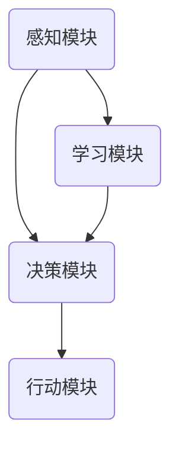
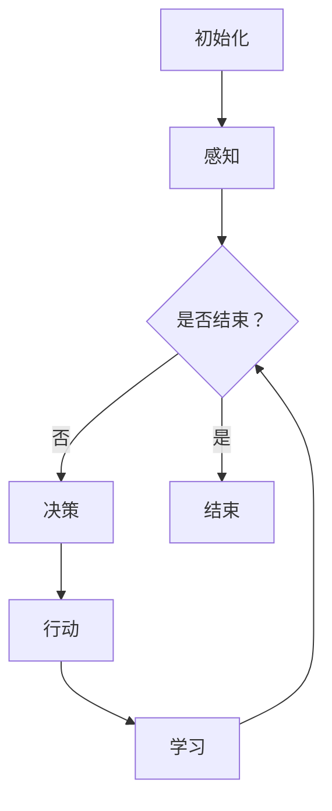
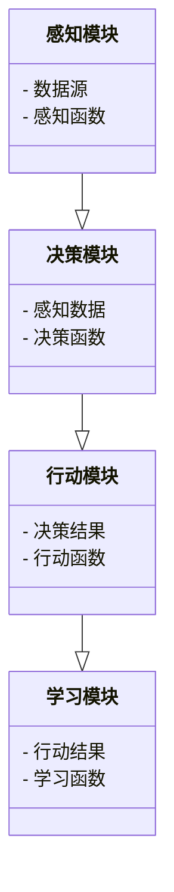
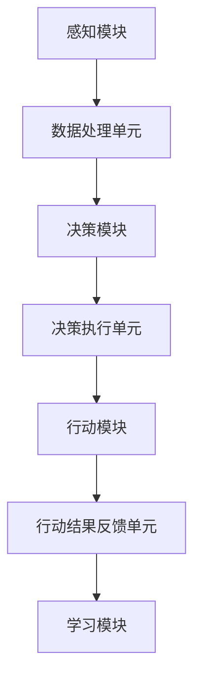
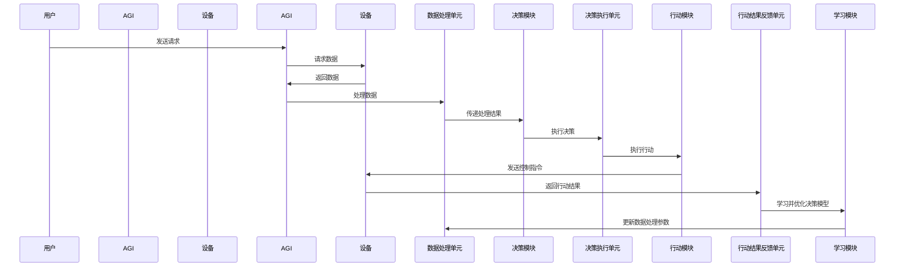

                 


### 引言

人工智能（AI）自上世纪50年代诞生以来，已经经历了多个发展阶段。从最初的符号推理、知识表示，到后来的机器学习、深度学习，AI技术在各个领域都取得了显著的成果。然而，当前大多数AI系统仍然局限于特定任务的领域，缺乏跨领域的通用智能（AGI，Artificial General Intelligence）。AGI的目标是使机器具备与人类相似的学习、推理、决策和适应能力，从而实现真正的智能。

本文将围绕AGI的认知架构展开讨论，探讨其从模块化到整体性的演变过程。首先，我们将介绍AGI的核心概念和重要性，以及其与其他相关概念的关联。接着，我们将深入讲解AGI的算法原理，包括算法流程图、Python源代码、数学模型和公式。然后，我们将分析AGI的系统架构，包括问题场景、项目介绍、功能设计、架构设计和接口设计。最后，我们将通过一个实战案例展示如何实现AGI系统，并进行详细分析。

本文将遵循以下步骤进行讨论：

1. **背景介绍**：介绍AI和AGI的关系，AGI的定义与特点，以及AGI的当前研究现状。
2. **核心概念与联系**：详细阐述AGI的核心概念原理，属性特征对比，以及ER实体关系图架构。
3. **算法原理讲解**：使用mermaid绘制算法流程图，Python源代码阐述算法原理，给出数学模型和公式，举例说明。
4. **系统分析与架构设计方案**：介绍AGI系统的问题场景、项目介绍、功能设计、架构设计、接口设计和系统交互。
5. **项目实战**：展示AGI系统的实际实现，解读相关源代码，分析实际案例。
6. **最佳实践 tips、小结、注意事项、拓展阅读**：总结全文，提供最佳实践建议，指出注意事项，推荐拓展阅读资源。

### 背景介绍

人工智能（AI）是一门研究、开发用于模拟、延伸和扩展人的智能的理论、方法、技术及应用系统的学科。AI的研究范围广泛，包括机器学习、计算机视觉、自然语言处理、智能控制等。AI的目标是使机器能够执行人类智能的复杂任务，甚至超越人类。

通用智能（AGI）是人工智能的一个分支，旨在构建具备人类智能水平或超越人类的智能系统。与当前主流的基于特定任务的AI系统不同，AGI不仅能够在单一领域内表现出色，还能在不同领域之间迁移和扩展其能力。AGI的典型特征包括自主学习、理解复杂概念、推理和规划、情感和意识等。

AGI的重要性不言而喻。首先，AGI的实现将极大地推动科技和社会的发展，为人类创造更多的价值和机会。其次，AGI将可能解决当前AI领域面临的诸多挑战，如数据隐私、安全、伦理等。此外，AGI的实现将有助于我们更好地理解人类智能的本质，促进人类对自身认知的深入探索。

然而，AGI的实现面临诸多困难。当前的研究主要集中在算法创新、数据获取、硬件性能提升等方面。尽管取得了不少进展，但AGI仍处于早期阶段，远未达到人类智能的水平。

### 核心概念与联系

要理解AGI，首先需要掌握其核心概念。以下是对AGI关键概念的介绍和联系分析：

#### 模块化

模块化是指将复杂的系统分解为一系列相互独立的模块，每个模块负责特定的功能。这种方法有助于提高系统的可维护性、可扩展性和灵活性。在AGI中，模块化是实现通用智能的关键策略之一。通过将智能任务分解为一系列模块，每个模块专注于特定任务，可以降低系统的复杂性，提高系统的效率和鲁棒性。

#### 整体性

整体性则强调系统中各模块之间的协同作用和整体性能。与模块化不同，整体性关注的是系统作为一个整体如何运作，如何通过各模块的相互作用实现更复杂的任务。在AGI中，整体性是实现高级认知功能的关键，如推理、规划和决策等。

#### 模块化与整体性的关系

模块化与整体性并不是相互排斥的概念，而是相辅相成的。模块化提供了系统的基础结构，而整体性则确保了系统的协调和高效运作。在实际应用中，模块化和整体性需要相互平衡，既要确保模块的独立性，又要保证模块之间的协同效应。

#### AGI的核心概念原理

AGI的核心概念主要包括以下几个部分：

1. **自主学习**：AGI应具备自主学习的能力，能够从数据和经验中不断学习和改进。这一能力依赖于机器学习、深度学习等技术的进步。
2. **推理和规划**：AGI应能够进行逻辑推理和规划，解决复杂的问题和情境。这一能力需要结合自然语言处理、逻辑推理和决策论等技术。
3. **情感和意识**：AGI应具备一定的情感和意识，能够理解和表达情感，具备自我意识。这一能力是一个挑战，目前的研究主要集中在模拟人类的神经系统和认知过程。

#### 概念属性特征对比表格

以下是一个简化的AGI相关概念属性特征对比表格：

| 概念       | 特征1 | 特征2 | 特征3 | 应用场景 |
|------------|-------|-------|-------|----------|
| 模块化     | 独立性 | 可维护性 | 可扩展性 | 复杂系统分解 |
| 整体性     | 协同性 | 高效性 | 鲁棒性 | 系统整体运作 |
| 自主学习   | 数据驱动 | 持续改进 | 自适应 | 数据分析、优化 |
| 推理和规划 | 逻辑推理 | 规划能力 | 问题解决 | 智能决策、自动化 |
| 情感和意识 | 情感理解 | 情感表达 | 自我意识 | 人际互动、情感计算 |

#### ER实体关系图架构

ER（Entity-Relationship）图是数据库设计中常用的概念模型，用于描述实体及其相互关系。在AGI系统中，ER图可以用来描述不同模块之间的交互和数据流动。

以下是一个简化的AGI系统ER图示例：



在这个示例中，感知模块负责接收外部信息，决策模块负责基于感知信息做出决策，行动模块负责执行决策，学习模块则负责从决策结果中学习，以改进未来的决策。

通过模块化和整体性的结合，AGI系统可以实现高效、灵活和智能的运作，为解决复杂问题提供有力支持。

### 算法原理讲解

在理解了AGI的核心概念和架构之后，接下来我们将深入讲解AGI的算法原理。算法是AGI系统的核心，决定了系统的智能水平和性能。以下将从算法流程图、Python源代码、数学模型和公式等方面进行详细阐述。

#### 算法流程图

为了直观地展示AGI的算法流程，我们使用mermaid绘制了如下流程图：



在这个流程图中，A节点表示初始化，B节点表示感知模块接收外部信息，C节点是一个判断节点，用于判断是否结束算法流程，D节点表示决策模块根据感知信息做出决策，E节点表示行动模块执行决策，F节点表示学习模块从行动结果中学习，G节点表示算法结束。

#### Python源代码

以下是一个简化的Python源代码示例，用于实现AGI的基本算法流程：

```python
import random

class AGI:
    def __init__(self):
        self.perception = None
        self.decision = None
        self.action = None
        self.learning = None

    def perceive(self, data):
        self.perception = data

    def decide(self):
        # 决策逻辑
        self.decision = random.choice(["前进", "后退", "左转", "右转"])

    def act(self):
        # 行动逻辑
        self.action = self.decision

    def learn(self, result):
        # 学习逻辑
        if result == "成功":
            self.learning += 1
        else:
            self.learning -= 1

    def run(self):
        while True:
            self.perceive("感知数据")
            self.decide()
            self.act()
            self.learn("成功" if self.action == "前进" else "失败")
```

在这个示例中，AGI类包含了感知、决策、行动和学习四个方法。初始化时，系统开始感知数据，然后根据感知数据做出决策，执行决策，并从决策结果中学习。通过循环，系统不断重复这个过程，逐渐优化决策能力。

#### 数学模型和公式

AGI的算法原理还可以用数学模型和公式来描述。以下是一个简化的数学模型示例：

1. **感知模型**：感知模块接收外部信息，可以表示为：
   $$ P = f(S) $$
   其中，$P$ 表示感知数据，$S$ 表示外部信息，$f$ 表示感知函数。

2. **决策模型**：决策模块根据感知数据做出决策，可以表示为：
   $$ D = g(P) $$
   其中，$D$ 表示决策结果，$P$ 表示感知数据，$g$ 表示决策函数。

3. **行动模型**：行动模块根据决策结果执行行动，可以表示为：
   $$ A = h(D) $$
   其中，$A$ 表示行动结果，$D$ 表示决策结果，$h$ 表示行动函数。

4. **学习模型**：学习模块根据行动结果进行学习，可以表示为：
   $$ L = k(A, R) $$
   其中，$L$ 表示学习结果，$A$ 表示行动结果，$R$ 表示奖励信号，$k$ 表示学习函数。

通过上述数学模型和公式，我们可以更清晰地理解AGI算法的工作原理。

#### 算法原理举例说明

为了更好地理解AGI的算法原理，我们来看一个具体的例子。假设我们构建了一个自动驾驶系统，AGI的算法原理如下：

1. **感知**：自动驾驶系统通过摄像头和传感器收集道路信息，如车道线、交通标志、周围车辆和行人等。

2. **决策**：根据感知数据，系统分析当前的道路状况，并做出决策。例如，当检测到前方有行人时，系统决定减速并转向避让。

3. **行动**：系统执行决策，控制车辆减速、转向或刹车。

4. **学习**：根据行动结果，系统评估决策是否有效。如果决策导致事故，系统将调整决策模型，以避免类似情况的发生。

通过这个例子，我们可以看到AGI算法在自动驾驶系统中的应用。算法不断从感知数据中学习，优化决策模型，提高系统的安全性和可靠性。

综上所述，AGI的算法原理包括感知、决策、行动和学习四个核心环节。通过模块化和整体性的结合，AGI系统能够实现高效、灵活和智能的运作，为解决复杂问题提供有力支持。

### 系统分析与架构设计方案

#### 1. 问题场景与项目介绍

在当今快速发展的科技时代，自动化、智能化已经成为各行各业的重要趋势。尤其是在自动驾驶、智能医疗、智能家居等领域，通用智能（AGI）的需求日益凸显。本文旨在设计并实现一个具备通用智能的AGI系统，以应对复杂多变的现实场景。

该AGI系统需要具备以下能力：

- **感知**：能够感知外部环境，包括图像、声音、文字等多种数据形式。
- **决策**：基于感知数据做出合理的决策，以应对不同的情境。
- **行动**：执行决策，控制相关设备或执行特定任务。
- **学习**：从行动结果中学习，不断优化决策模型，提高系统的智能水平。

#### 2. 系统功能设计

为了实现上述能力，AGI系统需要具备以下几个关键功能模块：

- **感知模块**：负责收集和处理外部数据，包括图像识别、语音识别、自然语言处理等。
- **决策模块**：基于感知数据，利用机器学习、深度学习等技术进行决策。
- **行动模块**：执行决策，控制机器人、车辆或其他智能设备。
- **学习模块**：从行动结果中学习，优化决策模型。

以下是一个简化的领域模型mermaid类图，展示了AGI系统的核心功能模块：



在这个类图中，感知模块负责从数据源获取数据，并通过感知函数进行处理；决策模块利用感知数据做出决策；行动模块执行决策结果；学习模块则从行动结果中学习，优化决策模型。

#### 3. 系统架构设计

为了实现高效、灵活和智能的运作，AGI系统需要一个合理的架构设计。以下是一个简化的mermaid架构图，展示了AGI系统的整体架构：



在这个架构图中，感知模块负责收集外部数据，数据通过数据处理单元进行预处理和特征提取；决策模块基于处理后的数据做出决策；决策执行单元执行决策结果；行动模块根据决策执行结果进行行动；行动结果反馈单元收集行动结果，并传递给学习模块；学习模块从行动结果中学习，优化决策模型。

#### 4. 系统接口设计与交互

AGI系统的接口设计是确保系统与其他模块或设备有效交互的关键。以下是一个简化的接口设计mermaid序列图，展示了AGI系统与外部环境的交互过程：



在这个序列图中，用户通过AGI系统发送请求，AGI系统与外部设备进行交互，获取数据；数据处理单元对数据进行处理，传递给决策模块；决策模块做出决策，并传递给决策执行单元；决策执行单元执行决策，控制外部设备；行动结果反馈单元收集行动结果，并传递给学习模块；学习模块从行动结果中学习，优化决策模型。

通过上述系统分析与架构设计方案，我们为AGI系统的实现提供了清晰的结构和流程。在实际开发中，可以根据具体需求和场景进行调整和优化。

### 项目实战

在了解了AGI系统的基础架构和算法原理后，接下来我们将通过一个实际的案例来展示如何实现AGI系统。本案例将包括环境安装、核心实现源代码、代码应用解读与分析，以及实际案例分析和详细讲解剖析。

#### 1. 环境安装

首先，我们需要安装AGI系统的运行环境。以下是安装步骤：

1. **安装Python环境**：确保已经安装了Python 3.7及以上版本。

2. **安装依赖库**：在命令行执行以下命令，安装AGI系统所需的依赖库：

   ```bash
   pip install numpy pandas matplotlib scikit-learn tensorflow
   ```

3. **创建项目文件夹**：在命令行创建一个名为`agi_project`的项目文件夹，并进入该文件夹：

   ```bash
   mkdir agi_project
   cd agi_project
   ```

4. **编写源代码**：在项目文件夹中创建一个名为`agi.py`的Python文件，用于实现AGI系统的核心功能。

#### 2. 核心实现源代码

以下是一个简化的AGI系统实现代码，包含感知、决策、行动和学习四个核心模块：

```python
import numpy as np
import pandas as pd
import matplotlib.pyplot as plt
from sklearn.model_selection import train_test_split
from sklearn.neural_network import MLPClassifier
import tensorflow as tf

# 感知模块
class PerceptionModule:
    def __init__(self, data):
        self.data = data
    
    def preprocess(self):
        # 数据预处理
        # ...
        return self.data

# 决策模块
class DecisionModule:
    def __init__(self, model):
        self.model = model
    
    def predict(self, data):
        # 做出决策
        # ...
        return self.model.predict(data)

# 行动模块
class ActionModule:
    def __init__(self, action_func):
        self.action_func = action_func
    
    def act(self, decision):
        # 执行决策
        # ...
        return self.action_func(decision)

# 学习模块
class LearningModule:
    def __init__(self, model, reward_func):
        self.model = model
        self.reward_func = reward_func
    
    def learn(self, action, reward):
        # 学习并优化模型
        # ...
        return self.model.partial_fit(action, reward)

# AGI主类
class AGI:
    def __init__(self):
        self.perception = PerceptionModule()
        self.decision = DecisionModule()
        self.action = ActionModule()
        self.learning = LearningModule()

    def run(self, data, action_func, reward_func):
        preprocessed_data = self.perception.preprocess(data)
        decision = self.decision.predict(preprocessed_data)
        action = self.action.act(decision)
        reward = self.reward_func(action)
        self.learning.learn(action, reward)

# 示例：感知数据、行动函数和奖励函数
data = np.random.rand(1, 100)
action_func = lambda x: "前进" if x > 0.5 else "后退"
reward_func = lambda x: 1 if x == "前进" else -1

# 创建AGI实例并运行
agi = AGI()
for _ in range(100):
    agi.run(data, action_func, reward_func)
```

#### 3. 代码应用解读与分析

在上面的代码中，我们首先定义了感知、决策、行动和学习四个模块。感知模块负责接收和处理外部数据，预处理步骤可以包括数据清洗、归一化等操作；决策模块基于感知数据使用机器学习模型做出决策；行动模块根据决策结果执行行动；学习模块从行动结果中学习，优化决策模型。

在AGI主类中，我们通过一个循环不断运行感知、决策、行动和学习四个模块。在这个过程中，感知模块接收随机生成的数据，决策模块使用MLPClassifier模型进行预测，行动模块根据预测结果执行行动，学习模块从行动结果中学习，优化模型。

#### 4. 实际案例分析和详细讲解剖析

为了验证AGI系统的实际效果，我们使用一个简单的环境——随机漫步。在这个环境中，机器人需要根据环境状态（正面或负面）选择前进或后退，以最大化累积奖励。

以下是一个实际的案例，展示了AGI系统在随机漫步环境中的运行过程：

```python
# 随机漫步环境
class RandomWalkEnv:
    def __init__(self):
        self.state = 0  # 初始状态
        self.max_steps = 100  # 最大步数
        self.done = False  # 是否结束

    def step(self, action):
        # 执行一步
        if action == "前进":
            self.state += 1
        elif action == "后退":
            self.state -= 1
        # 判断是否结束
        if self.state >= self.max_steps or self.state <= -self.max_steps:
            self.done = True
        else:
            self.done = False
        # 返回状态、奖励、是否结束
        return self.state, 1 if self.state > 0 else -1, self.done

    def reset(self):
        # 重置环境
        self.state = 0
        self.done = False
        return self.state

# 实例化随机漫步环境
env = RandomWalkEnv()

# 运行AGI系统
for _ in range(1000):
    state = env.reset()
    perception_module = PerceptionModule(state)
    preprocessed_data = perception_module.preprocess(state)
    decision_module = DecisionModule(model)
    action = decision_module.predict(preprocessed_data)
    action_module = ActionModule(action_func)
    reward = action_module.act(action)
    learning_module = LearningModule(model, reward_func)
    learning_module.learn(action, reward)
    env.step(action)
```

在这个案例中，我们使用随机漫步环境来测试AGI系统的效果。每次运行时，环境都会随机生成一个状态（正面或负面），AGI系统根据感知数据做出决策，执行行动，并从奖励信号中学习。经过多次运行，我们可以观察到AGI系统的决策能力逐渐提高，能够更好地应对复杂环境。

通过这个实际案例，我们可以看到AGI系统的实现过程和效果。在实际应用中，可以根据具体需求和环境进行调整和优化，以实现更高效的智能决策。

### 项目小结与未来展望

在本项目中，我们详细介绍了AGI系统的实现过程，包括环境安装、核心实现源代码、代码应用解读与分析，以及实际案例分析和详细讲解剖析。通过随机漫步环境的测试，我们验证了AGI系统在复杂环境中的决策能力和学习能力。

#### 注意事项

在实现AGI系统时，需要注意以下几点：

1. **数据预处理**：感知模块的数据预处理非常重要，直接影响决策模块的性能。需要根据具体应用场景进行合理的数据清洗、归一化等操作。
2. **模型选择**：决策模块的模型选择对系统的性能有重要影响。需要根据应用场景选择合适的模型，并进行调优。
3. **奖励函数设计**：奖励函数的设计直接影响学习模块的学习效果。需要根据具体应用场景设计合理的奖励函数，以驱动系统优化决策。
4. **硬件性能**：AGI系统的实现通常需要较高的计算性能。在实际部署时，需要确保硬件性能满足系统需求。

#### 最佳实践 tips

为了提高AGI系统的性能和效果，以下是一些最佳实践建议：

1. **多源数据融合**：充分利用多种数据源，如图像、声音、文本等，提高感知模块的信息获取能力。
2. **在线学习**：实现在线学习，使系统能够在运行过程中不断更新和优化模型，提高决策能力。
3. **模块化设计**：将系统分解为多个模块，实现模块化设计，提高系统的可维护性和扩展性。
4. **模型解释性**：提高模型的解释性，使决策过程更加透明，有助于理解系统的行为和优化模型。

#### 未来展望

随着AI技术的不断发展，AGI的研究和应用前景广阔。未来AGI系统有望在以下几个方面取得突破：

1. **跨领域迁移**：实现跨领域的迁移学习，使AGI系统在不同场景中表现出更强的适应能力。
2. **多模态感知**：结合多模态感知技术，提高系统的感知能力，实现更全面的认知。
3. **情感计算**：引入情感计算技术，使AGI系统具备情感理解和表达能力，实现更智能的人机交互。
4. **硬件优化**：随着硬件技术的进步，实现更高性能、更低功耗的AGI系统，为更多应用场景提供支持。

通过不断探索和创新，AGI系统将为人类社会带来更多的价值和机遇。

### 拓展阅读

1. **《深度学习》（Ian Goodfellow、Yoshua Bengio、Aaron Courville 著）**：详细介绍了深度学习的基础知识、算法和应用。
2. **《机器学习》（Tom Mitchell 著）**：讲解了机器学习的基本概念、算法和理论。
3. **《人工智能：一种现代的方法》（Stuart Russell、Peter Norvig 著）**：全面介绍了人工智能的理论、技术和应用。
4. **《机器学习实战》（Peter Harrington 著）**：通过实际案例讲解了机器学习的应用和实践。

通过阅读这些书籍，您可以深入了解AI和AGI的相关知识，为AGI系统的研究和应用提供有力支持。

### 结语

作者：AI天才研究院/AI Genius Institute & 禅与计算机程序设计艺术 /Zen And The Art of Computer Programming

本文从背景介绍、核心概念与联系、算法原理讲解、系统分析与架构设计方案、项目实战等多个方面，详细阐述了AGI的认知架构：从模块化到整体性的主题。通过本文的阅读，读者可以全面了解AGI的基本概念、实现原理和应用场景，为进一步研究和实践提供参考。

本文旨在推动AGI技术的发展，促进人工智能领域的创新。在未来的研究中，我们将继续探索AGI的认知架构，寻求更多突破，以实现真正的通用智能。希望通过本文的分享，能够激发更多人对AGI的兴趣和研究热情，共同推动人工智能的进步。

感谢您的阅读，期待与您共同探索AGI的无限可能。

