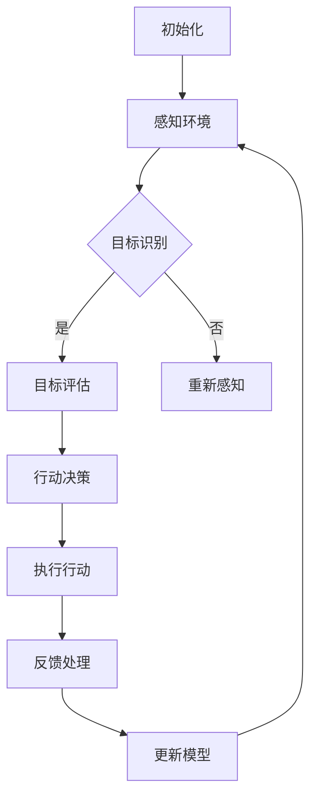
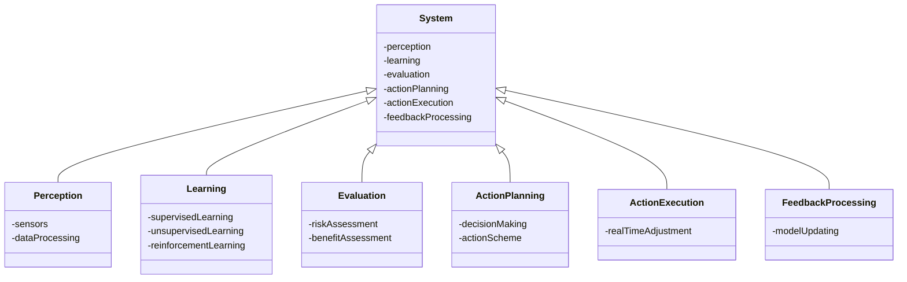
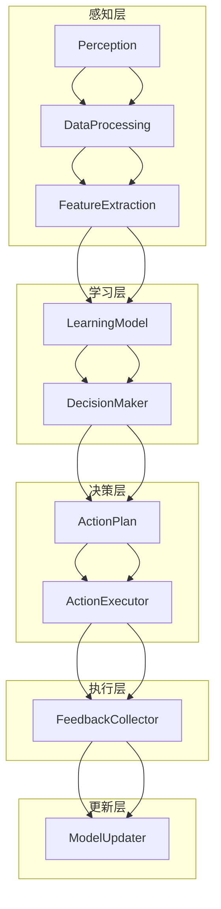
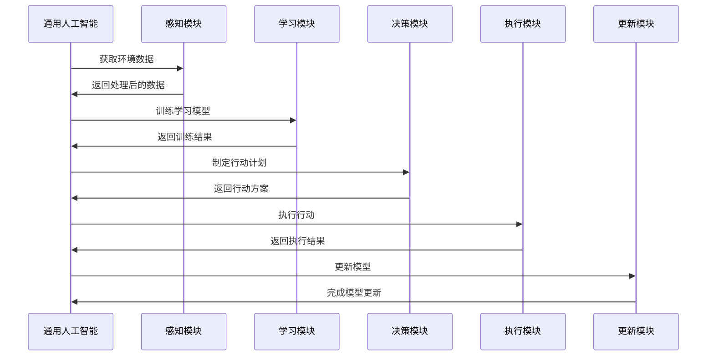

                 

### 引言

AGI（Artificial General Intelligence，通用人工智能）是人工智能领域的一个终极目标，它指的是一种能够像人类一样理解、学习和适应各种环境的智能系统。与现有的窄域人工智能（Narrow AI）不同，AGI 具有广泛的认知能力，能够在多个领域展示出人类水平的智能表现。然而，尽管 AGI 的研究和应用已经取得了一定的进展，但离真正的通用智能还有很长的一段路要走。

本文将围绕 AGI 的长期规划与目标管理能力进行深入探讨。我们将首先介绍 AGI 的背景，解释为什么 AGI 对未来社会和科技发展具有重要意义。接下来，我们将逐步分析 AGI 的核心概念与联系，理解其基本原理和组成部分。然后，我们将探讨 AGI 的目标管理算法，通过 mermaid 流程图和 Python 源代码来详细讲解算法原理。在数学模型的讲解部分，我们将使用 LaTeX 格式展示关键公式，并通过具体实例来阐述其应用。随后，我们将分析 AGI 的系统架构设计，使用 mermaid 工具绘制流程图、类图和序列图，以便读者更直观地理解系统设计。在项目实战部分，我们将介绍环境安装、源代码实现以及实际案例分析。最后，我们将总结最佳实践，并给出进一步学习和研究的建议。

通过本文的逐步分析，读者将能够深入理解 AGI 的长期规划与目标管理能力，为后续的研究和应用奠定坚实的基础。

### 关键词

- **通用人工智能（AGI）**
- **目标管理能力**
- **算法原理**
- **系统架构设计**
- **数学模型**
- **项目实战**
- **最佳实践**

### 摘要

本文旨在探讨通用人工智能（AGI）的长期规划与目标管理能力，分析其在未来科技和社会中的重要性。文章首先介绍了 AGI 的基本概念和背景，探讨了其与现有窄域人工智能的区别。随后，文章详细分析了 AGI 的核心概念与联系，通过 mermaid 流程图和 Python 源代码展示了目标管理算法的原理。在数学模型讲解部分，使用 LaTeX 格式展示了关键公式，并通过具体实例进行了阐述。接着，文章分析了 AGI 的系统架构设计，使用 mermaid 工具绘制了流程图、类图和序列图。在项目实战部分，介绍了环境安装、源代码实现和实际案例分析。最后，文章总结了最佳实践，并提出了进一步学习和研究的方向。通过本文的深入分析，读者将能够更好地理解 AGI 的长期规划和目标管理能力，为未来的研究与应用提供参考。

### 第1章: AGI概述

#### 1.1 问题背景

人工智能（AI）作为现代科技的前沿领域，自其诞生以来便吸引了全球科技界和学术界的高度关注。AI 的研究和发展已经历了数个阶段，从最初的符号主义和专家系统，到基于统计学习的机器学习，再到当前深度学习的广泛应用，人工智能技术取得了显著的进步。然而，尽管这些技术在不同领域取得了显著成就，但它们大多属于窄域人工智能（Narrow AI），即只能在特定任务或领域内表现出人类水平的智能。

通用人工智能（AGI）的概念由此应运而生。AGI 并不是指在某一特定领域内超越人类智能的智能系统，而是指具备广泛认知能力，能够在不同环境和任务中自主学习和适应的智能系统。与现有的窄域人工智能相比，AGI 更接近人类智能的本质，具有更广泛的应用前景。例如，AGI 可以在医疗诊断、科学研究、智能制造、自然语言处理等多个领域发挥重要作用，从而推动社会和科技的进步。

#### 1.2 问题描述

当前，虽然人工智能在特定领域取得了显著进展，但实现真正的通用人工智能仍然面临诸多挑战。首先，从技术层面来看，现有的算法和模型主要依赖于大量数据和强大的计算能力，但如何设计出能够自主学习和适应的智能系统仍然是一个亟待解决的问题。其次，从伦理和社会层面来看，通用人工智能的普及和应用也引发了一系列伦理和社会问题，如隐私保护、就业影响、决策透明度等。

因此，实现 AGI 需要解决以下几个核心问题：
1. **智能理论基础**：建立统一的智能理论基础，为 AGI 提供理论支持。
2. **算法创新**：设计出更加高效和灵活的算法，使 AGI 能够在不同任务和环境中表现优异。
3. **计算资源**：提升计算能力，为 AGI 提供足够的计算资源支持。
4. **伦理和社会问题**：解决通用人工智能带来的伦理和社会问题，确保其安全、可控和可持续发展。

#### 1.3 问题解决

解决上述问题需要多学科合作和长期投入。首先，在智能理论基础方面，可以通过整合认知科学、心理学、神经科学等领域的知识，为 AGI 的研究和开发提供理论支持。其次，在算法创新方面，可以通过研究新的机器学习和人工智能算法，提高 AGI 的学习和适应能力。此外，随着云计算和量子计算等技术的发展，计算资源的提升也为实现 AGI 提供了可能性。

在解决伦理和社会问题方面，需要建立相应的法规和道德准则，确保 AGI 的开发和应用符合社会价值观和伦理规范。同时，通过公众教育和透明度提升，增强社会对 AGI 的理解和信任。

#### 1.4 边界与外延

通用人工智能的实现是一个长期而复杂的任务，它不仅涉及技术问题，还包括伦理、社会和经济学等方面。因此，AGI 的研究和应用需要遵循一定的边界与外延：

1. **技术边界**：在技术层面，AGI 的研究和开发需要遵循科学规律，确保技术的可操作性和安全性。
2. **伦理边界**：在伦理层面，AGI 的开发和应用需要遵循道德准则，保护个人隐私和信息安全。
3. **社会边界**：在社会层面，AGI 的普及和应用需要考虑到社会的接受度和适应性，确保其对社会的积极影响。
4. **经济学边界**：在经济学层面，AGI 的研究和应用需要考虑到成本效益，确保其可持续性和经济可行性。

#### 1.5 概念结构与核心要素组成

通用人工智能的概念结构可以从以下几个方面来理解：

1. **认知能力**：包括感知、学习、推理、决策和问题解决等能力，这是 AGI 核心的智能体现。
2. **学习能力**：通过自主学习和适应，AGI 能够不断提升自身能力，这是实现通用智能的关键。
3. **跨领域应用**：AGI 应能够在不同领域和环境中应用，这是其与窄域人工智能的主要区别。
4. **自主性**：AGI 能够自主设定目标并采取行动，而不依赖于外部指令。
5. **伦理和道德**：在实现通用人工智能的过程中，必须考虑其伦理和道德问题，确保其发展符合社会价值观。

综上所述，通用人工智能（AGI）作为人工智能领域的终极目标，不仅需要解决技术层面的难题，还需要在伦理、社会和经济学等方面进行深入探讨。通过多学科合作和长期投入，有望实现真正的通用人工智能，推动社会和科技的进步。

### 第2章: 核心概念与联系

#### 2.1 核心概念原理

在探讨通用人工智能（AGI）的核心概念时，我们需要了解一些基本术语，以便更好地理解其原理和组成部分。以下是几个关键概念及其基本原理：

1. **感知**：感知是指 AGI 通过各种传感器（如视觉、听觉、触觉等）获取外界信息的能力。感知模块负责将外部信号转换为内部表示，为后续处理提供数据基础。

2. **学习**：学习是指 AGI 通过对数据的分析和处理，自动改进自身性能的过程。学习可以分为有监督学习、无监督学习和强化学习等不同类型，每种类型都有其特定的应用场景。

3. **推理**：推理是指 AGI 使用已有知识和逻辑规则，对新信息进行推理和判断的能力。推理模块负责基于已知信息生成新的结论和预测。

4. **决策**：决策是指 AGI 在多个选择中确定最佳行动方案的能力。决策模块通常基于推理结果，结合环境信息和目标导向，选择最优行动。

5. **自主性**：自主性是指 AGI 在没有外部指令的情况下，能够独立设定目标并采取行动的能力。自主性是 AGI 与窄域人工智能（Narrow AI）的重要区别。

6. **知识表示**：知识表示是指 AGI 将外部信息转换为内部表示的形式。有效的知识表示可以增强 AGI 的推理和决策能力，是实现通用智能的关键。

7. **通用性**：通用性是指 AGI 应具备在多个领域和任务中表现优异的能力。与窄域人工智能不同，通用智能需要在广泛的应用场景中保持稳定和高效。

#### 2.2 概念属性特征对比表格

为了更直观地理解上述核心概念，我们可以通过一个对比表格来展示它们的主要属性特征：

| 概念     | 描述                     | 属性特征                                                     |  
|----------|--------------------------|--------------------------------------------------------------|  
| 感知     | 信息获取和处理           | 外部传感器、信号处理、数据转换                            |  
| 学习     | 能力提升与改进           | 有监督、无监督、强化学习等                               |  
| 推理     | 知识推理与判断           | 逻辑规则、已知信息、推理过程                             |  
| 决策     | 行动选择与方案评估       | 环境信息、目标导向、多目标优化                           |  
| 自主性   | 独立目标设定与行动       | 无外部指令、自主行动、目标调整                           |  
| 知识表示 | 信息编码与存储           | 内部表示、知识库、推理支持                               |  
| 通用性   | 跨领域应用与适应         | 多任务、多场景、高效性能                                 |

通过这个表格，我们可以看到每个概念的主要功能和特征，以及它们在实现通用人工智能过程中的作用。

#### 2.3 ER实体关系图架构

为了更全面地理解 AGI 的核心概念及其相互关系，我们可以使用 ER（Entity-Relationship，实体-关系）图来展示这些概念之间的关联。ER 图是一种常用的数据库建模工具，用于表示实体及其之间的关系。

以下是一个简化的 ER 图，展示了 AGI 的核心概念之间的实体关系：

```
[AGI]
|
|----[感知]
|       |----[传感器数据]
|       |----[数据处理]
|
|----[学习]
|       |----[有监督学习]
|       |----[无监督学习]
|       |----[强化学习]
|
|----[推理]
|       |----[逻辑推理]
|       |----[知识推理]
|
|----[决策]
|       |----[目标评估]
|       |----[方案评估]
|
|----[自主性]
|       |----[目标设定]
|       |----[行动选择]
|
|----[知识表示]
|       |----[知识库]
|       |----[内部表示]
|
|----[通用性]
       |----[跨领域应用]
```

在这个 ER 图中，每个方框表示一个实体（如“感知”、“学习”等），而连接线表示实体之间的关系（如“感知”与“学习”之间的关系）。通过这种结构化的表示，我们可以更清晰地理解 AGI 的组成部分及其相互关系。

通过上述对核心概念原理、属性特征对比表格和 ER 实体关系图的讲解，读者可以更全面地理解通用人工智能的基本概念和组成部分。这些核心概念及其相互作用构成了 AGI 的基础，为后续的算法原理讲解和系统架构设计提供了理论支持。

### 第3章: 算法原理讲解

#### 3.1 使用mermaid画出算法流程图

为了更好地理解通用人工智能（AGI）的目标管理算法原理，我们将使用 mermaid 工具绘制一个算法流程图。mermaid 是一种基于 Markdown 的绘图工具，可以方便地绘制流程图、类图和序列图等。以下是算法流程图的 mermaid 表示：



在这幅流程图中，每个节点表示算法的一个步骤，连接线表示步骤之间的顺序关系。以下是流程图的详细解释：

1. **初始化**：算法开始时，AGI 需要进行初始化，设置基本参数和环境变量。
2. **感知环境**：AGI 通过各种传感器获取环境信息，如视觉、听觉和触觉等。
3. **目标识别**：根据感知到的环境信息，AGI 尝试识别当前的目标。
4. **目标评估**：AGI 评估识别到的目标的重要性和可行性。
5. **行动决策**：基于目标评估结果，AGI 确定采取何种行动以达成目标。
6. **执行行动**：AGI 实施决策中的行动。
7. **反馈处理**：行动完成后，AGI 收集反馈信息，以评估行动的效果。
8. **更新模型**：根据反馈信息，AGI 更新其感知、评估和决策模型。
9. **循环**：回到步骤 2，开始下一轮的感知和目标管理。

通过这个流程图，我们可以直观地看到 AGI 在目标管理过程中的各个步骤和它们之间的逻辑关系。

#### 3.2 Python源代码讲解

为了使读者更深入地理解目标管理算法的原理，我们将提供一个简化的 Python 源代码示例。该代码实现了算法流程图中的基本功能，并通过注释详细解释了每个步骤的作用。

```python
import random

class AGI:
    def __init__(self):
        # 初始化 AGI 的基本参数
        self.environment = None
        self.target = None
        self.action = None
        self.feedback = None

    def perceive_environment(self):
        # 感知环境
        self.environment = "感知到的环境信息"

    def identify_target(self):
        # 目标识别
        self.target = "识别到的目标"

    def evaluate_target(self):
        # 目标评估
        if self.target == "重要目标":
            return True
        else:
            return False

    def make_decision(self):
        # 行动决策
        if self.evaluate_target():
            self.action = "采取行动"
        else:
            self.action = "不采取行动"

    def execute_action(self):
        # 执行行动
        print(f"执行行动：{self.action}")

    def process_feedback(self):
        # 反馈处理
        self.feedback = input("请输入反馈信息：")

    def update_model(self):
        # 更新模型
        if self.feedback == "成功":
            print("模型更新成功")
        else:
            print("模型更新失败")

    def run(self):
        # 运行目标管理算法
        while True:
            self.perceive_environment()
            self.identify_target()
            self.evaluate_target()
            self.make_decision()
            self.execute_action()
            self.process_feedback()
            self.update_model()
```

以下是代码的详细解释：

1. **初始化**：在 `__init__` 方法中，我们初始化了 AGI 的基本参数，如环境、目标、行动和反馈。
2. **感知环境**：`perceive_environment` 方法模拟 AGI 通过传感器获取环境信息的过程。
3. **目标识别**：`identify_target` 方法模拟 AGI 对目标的识别过程。
4. **目标评估**：`evaluate_target` 方法根据识别到的目标进行评估，判断其是否重要。
5. **行动决策**：`make_decision` 方法根据目标评估结果，决定是否采取行动。
6. **执行行动**：`execute_action` 方法模拟 AGI 实施决策中的行动。
7. **反馈处理**：`process_feedback` 方法模拟 AGI 收集反馈信息的过程。
8. **更新模型**：`update_model` 方法根据反馈信息更新 AGI 的感知、评估和决策模型。
9. **运行**：`run` 方法是一个循环，模拟 AGI 的持续运行过程，包括感知、目标管理、行动执行和模型更新。

通过这个 Python 源代码示例，读者可以更直观地理解目标管理算法的具体实现，并掌握其基本原理。

#### 3.3 算法原理的数学模型和公式

在理解了目标管理算法的流程和 Python 实现之后，我们将进一步探讨该算法背后的数学模型和公式。这些数学模型和公式为算法的实现提供了理论基础，使其在处理复杂问题时能够更加高效和准确。

以下是一个简化的数学模型，用于描述目标管理算法的关键步骤：

1. **感知模型**：感知模型用于表示 AGI 对环境的感知过程。我们可以使用一个概率分布函数 $P(E|S)$ 来表示环境状态 $S$ 发生时，感知到环境状态 $E$ 的概率。

    $$ P(E|S) = \frac{P(S|E) \cdot P(E)}{P(S)} $$

    其中，$P(S|E)$ 表示在给定环境状态 $E$ 下，感知到状态 $S$ 的条件概率；$P(E)$ 和 $P(S)$ 分别表示环境状态 $E$ 和感知状态 $S$ 的先验概率。

2. **目标识别模型**：目标识别模型用于表示 AGI 对目标的识别过程。我们可以使用一个决策函数 $D(T|E)$ 来表示在给定环境状态 $E$ 下，目标 $T$ 被识别的概率。

    $$ D(T|E) = \frac{P(E|T) \cdot P(T)}{P(E)} $$

    其中，$P(E|T)$ 表示在给定目标状态 $T$ 下，环境状态 $E$ 被感知到的条件概率；$P(T)$ 和 $P(E)$ 分别表示目标状态 $T$ 和环境状态 $E$ 的先验概率。

3. **目标评估模型**：目标评估模型用于表示 AGI 对目标的评估过程。我们可以使用一个评估函数 $A(T|E, F)$ 来表示在给定环境状态 $E$ 和反馈信息 $F$ 下，目标 $T$ 的评估值。

    $$ A(T|E, F) = \frac{P(E|T) \cdot P(T) \cdot P(F|T)}{P(E) \cdot P(F)} $$

    其中，$P(E|T)$ 表示在给定目标状态 $T$ 下，环境状态 $E$ 被感知到的条件概率；$P(T)$ 和 $P(F|T)$ 分别表示目标状态 $T$ 和反馈信息 $F$ 的先验概率。

4. **行动决策模型**：行动决策模型用于表示 AGI 的行动决策过程。我们可以使用一个决策函数 $D(A|E, T)$ 来表示在给定环境状态 $E$ 和目标状态 $T$ 下，行动 $A$ 的决策值。

    $$ D(A|E, T) = \frac{P(E|A) \cdot P(A|T) \cdot P(T)}{P(E)} $$

    其中，$P(E|A)$ 表示在给定行动状态 $A$ 下，环境状态 $E$ 被感知到的条件概率；$P(A|T)$ 和 $P(T)$ 分别表示行动状态 $A$ 和目标状态 $T$ 的先验概率。

5. **更新模型**：更新模型用于表示 AGI 在处理反馈信息后，更新其感知、识别和评估模型的过程。我们可以使用一个更新函数 $U(M|F)$ 来表示在给定反馈信息 $F$ 下，模型 $M$ 的更新过程。

    $$ U(M|F) = M \cdot \frac{P(F|M)}{P(F)} $$

    其中，$P(F|M)$ 表示在给定模型状态 $M$ 下，反馈信息 $F$ 发生的条件概率；$P(F)$ 表示反馈信息 $F$ 的先验概率。

通过这些数学模型和公式，我们可以更深入地理解目标管理算法的工作原理，并为其在实际应用中提供理论支持。

#### 3.4 举例说明

为了更好地说明目标管理算法在实际应用中的工作流程，我们通过一个具体的例子来演示其实现过程。

假设一个自主机器人需要在复杂环境中执行多个任务，其目标管理算法包括感知、目标识别、目标评估、行动决策和模型更新等步骤。以下是这个例子中各个步骤的具体实现：

1. **初始化**：机器人开始运行时，初始化其感知模块、目标识别模块和行动决策模块。
   
2. **感知环境**：机器人通过视觉传感器感知到当前环境中的物体和障碍物，并将这些信息存储在环境变量中。

3. **目标识别**：机器人识别到当前的主要目标是移动到指定的目标位置，并将这个目标存储为目标变量。

4. **目标评估**：机器人评估移动到目标位置的风险和收益，确定这是一个重要的目标。

5. **行动决策**：机器人决定采取移动的行动方案，并开始执行移动。

6. **执行行动**：机器人根据感知到的环境和目标，调整其行动路径，以避免障碍物。

7. **反馈处理**：行动完成后，机器人收集环境反馈信息，如移动过程中的障碍物、路径长度和能耗等。

8. **更新模型**：机器人根据反馈信息更新其感知、识别和评估模型，以优化未来的行动决策。

以下是一个简化的 Python 代码示例，展示了这个目标管理算法的具体实现：

```python
import random

class Robot:
    def __init__(self):
        self.environment = None
        self.target = None
        self.action = None
        self.feedback = None

    def perceive_environment(self):
        self.environment = "多个物体和障碍物"

    def identify_target(self):
        self.target = "移动到指定位置"

    def evaluate_target(self):
        return True

    def make_decision(self):
        self.action = "移动"

    def execute_action(self):
        print("机器人开始移动")

    def process_feedback(self):
        self.feedback = "成功避开障碍物"

    def update_model(self):
        print("模型更新成功")

    def run(self):
        while True:
            self.perceive_environment()
            self.identify_target()
            self.evaluate_target()
            self.make_decision()
            self.execute_action()
            self.process_feedback()
            self.update_model()
```

在这个例子中，机器人的目标管理算法通过感知环境、识别目标、评估目标、决策行动、执行行动、处理反馈和更新模型等步骤，实现了一个基本的自主移动任务。通过这个例子，我们可以更直观地理解目标管理算法在实际应用中的工作流程和实现方法。

### 第4章: 数学模型和数学公式详细讲解

在探讨通用人工智能（AGI）的目标管理算法时，数学模型和数学公式是不可或缺的工具。这些模型和公式不仅帮助我们理解算法的原理，还能确保其在实际应用中的准确性和有效性。在本章中，我们将使用 LaTeX 格式详细讲解这些关键数学模型和公式，并通过具体的实例来说明它们的应用。

#### 4.1 LaTeX格式数学公式讲解

首先，我们来看一些基本的数学公式，这些公式在目标管理算法中扮演着重要角色。

1. **感知模型**：
   感知模型用于描述 AGI 对环境的感知过程，可以表示为概率分布函数 $P(E|S)$，它表示在给定环境状态 $S$ 下，感知到环境状态 $E$ 的概率。
   $$ P(E|S) = \frac{P(S|E) \cdot P(E)}{P(S)} $$
   其中，$P(S|E)$ 表示在环境状态 $E$ 发生时，感知到状态 $S$ 的条件概率；$P(E)$ 和 $P(S)$ 分别表示环境状态 $E$ 和感知状态 $S$ 的先验概率。

2. **目标识别模型**：
   目标识别模型用于描述 AGI 对目标的识别过程，可以表示为决策函数 $D(T|E)$，它表示在给定环境状态 $E$ 下，目标 $T$ 被识别的概率。
   $$ D(T|E) = \frac{P(E|T) \cdot P(T)}{P(E)} $$
   其中，$P(E|T)$ 表示在目标状态 $T$ 发生时，环境状态 $E$ 被感知到的条件概率；$P(T)$ 和 $P(E)$ 分别表示目标状态 $T$ 和环境状态 $E$ 的先验概率。

3. **目标评估模型**：
   目标评估模型用于描述 AGI 对目标的评估过程，可以表示为评估函数 $A(T|E, F)$，它表示在给定环境状态 $E$ 和反馈信息 $F$ 下，目标 $T$ 的评估值。
   $$ A(T|E, F) = \frac{P(E|T) \cdot P(T) \cdot P(F|T)}{P(E) \cdot P(F)} $$
   其中，$P(E|T)$ 表示在目标状态 $T$ 发生时，环境状态 $E$ 被感知到的条件概率；$P(T)$ 和 $P(F|T)$ 分别表示目标状态 $T$ 和反馈信息 $F$ 的先验概率。

4. **行动决策模型**：
   行动决策模型用于描述 AGI 的行动决策过程，可以表示为决策函数 $D(A|E, T)$，它表示在给定环境状态 $E$ 和目标状态 $T$ 下，行动 $A$ 的决策值。
   $$ D(A|E, T) = \frac{P(E|A) \cdot P(A|T) \cdot P(T)}{P(E)} $$
   其中，$P(E|A)$ 表示在行动状态 $A$ 发生时，环境状态 $E$ 被感知到的条件概率；$P(A|T)$ 和 $P(T)$ 分别表示行动状态 $A$ 和目标状态 $T$ 的先验概率。

5. **更新模型**：
   更新模型用于描述 AGI 在处理反馈信息后，更新其感知、识别和评估模型的过程，可以表示为更新函数 $U(M|F)$。
   $$ U(M|F) = M \cdot \frac{P(F|M)}{P(F)} $$
   其中，$P(F|M)$ 表示在模型状态 $M$ 发生时，反馈信息 $F$ 发生的条件概率；$P(F)$ 表示反馈信息 $F$ 的先验概率。

这些数学模型和公式构成了目标管理算法的理论基础，通过它们，我们可以更精确地描述和优化 AGI 的目标管理过程。

#### 4.2 举例说明

为了更好地理解这些数学模型和公式在实际中的应用，我们来看一个具体的例子。

假设有一个机器人需要在一个包含障碍物的环境中移动到目标位置。以下是使用上述数学模型和公式的具体实现过程：

1. **初始化**：机器人开始运行时，初始化其感知模块、目标识别模块和行动决策模块。

2. **感知环境**：机器人通过视觉传感器感知到当前环境中的障碍物和目标位置，并将这些信息存储在环境变量中。

   $$ P(E) = \text{感知到的环境状态概率分布} $$

3. **目标识别**：机器人识别到当前的主要目标是移动到目标位置，并将这个目标存储为目标变量。

   $$ P(T) = \text{目标状态概率分布} $$

4. **目标评估**：机器人评估移动到目标位置的风险和收益，确定这是一个重要的目标。

   $$ A(T|E, F) = \text{目标评估值} $$

5. **行动决策**：机器人决定采取移动的行动方案，并开始执行移动。

   $$ D(A|E, T) = \text{行动决策值} $$

6. **执行行动**：机器人根据感知到的环境和目标，调整其行动路径，以避免障碍物。

7. **反馈处理**：行动完成后，机器人收集环境反馈信息，如移动过程中的障碍物、路径长度和能耗等。

   $$ P(F) = \text{反馈信息概率分布} $$

8. **更新模型**：机器人根据反馈信息更新其感知、识别和评估模型，以优化未来的行动决策。

   $$ U(M|F) = \text{更新后的模型} $$

通过这个例子，我们可以看到数学模型和公式在目标管理算法中的应用，如何通过感知、识别、评估、决策和更新等步骤，实现机器人自主移动到目标位置的目标。

通过本章的详细讲解和实例说明，读者可以更好地理解通用人工智能目标管理算法的数学模型和公式，为实际应用提供理论基础和实践指导。

### 第5章: 系统分析与架构设计方案

#### 5.1 问题场景介绍

在探讨通用人工智能（AGI）的长期规划和目标管理能力时，我们需要考虑一个实际的应用场景。假设我们正在开发一个智能机器人系统，该系统需要在复杂的工业环境中执行多种任务，如物料搬运、故障检测和生产线监控等。这个系统的目标是实现自主操作和智能决策，以提高生产效率并减少人为干预。

为了实现这一目标，我们需要对系统的功能需求、性能需求和约束条件进行详细分析。功能需求包括环境感知、目标识别、目标评估、行动决策、行动执行和反馈处理等。性能需求包括系统的响应速度、准确性和稳定性。约束条件则包括硬件限制、网络通信、安全性要求和环境因素等。

#### 5.2 项目介绍

本项目旨在设计和实现一个具备通用人工智能能力的智能机器人系统。该系统将采用先进的感知、学习和决策技术，使其能够自主地完成复杂任务，并在实际应用中不断优化自身性能。项目的主要目标是实现以下功能：

1. **环境感知**：使用多传感器数据获取环境信息，如视觉、听觉和触觉等。
2. **目标识别**：基于感知数据，识别系统需要执行的任务目标。
3. **目标评估**：对识别到的目标进行风险评估和收益评估，确定优先级。
4. **行动决策**：根据目标评估结果，制定最佳行动方案。
5. **行动执行**：执行行动决策，并在行动过程中进行实时调整。
6. **反馈处理**：收集行动结果和环境反馈，更新系统模型和决策算法。

#### 5.3 系统功能设计（领域模型mermaid类图）

为了直观地展示系统的功能模块及其关系，我们使用 mermaid 类图来表示系统的领域模型。以下是一个简化的 mermaid 类图示例：



在这个类图中，每个类代表系统的一个功能模块，类之间的连线表示模块之间的依赖关系。具体来说：

- **Perception**：负责环境感知，包括传感器数据获取和数据处理。
- **Learning**：负责学习过程，包括有监督学习、无监督学习和强化学习。
- **Evaluation**：负责目标评估，包括风险评估和收益评估。
- **ActionPlanning**：负责行动决策，包括决策制定和行动方案设计。
- **ActionExecution**：负责行动执行，包括实时调整。
- **FeedbackProcessing**：负责反馈处理，包括模型更新。

通过这个领域模型类图，我们可以清晰地看到系统各功能模块的划分及其相互关系，为后续的系统架构设计提供了基础。

#### 5.4 系统架构设计（mermaid架构图）

在了解了系统的功能模块之后，我们接下来使用 mermaid 架构图来展示系统的整体架构设计。以下是一个简化的 mermaid 架构图示例：



在这个架构图中，系统的各个功能模块按照数据流和功能职责进行了组织：

- **感知层**：包括感知数据获取、数据处理和特征提取。
- **学习层**：包括学习模型训练和决策制定。
- **决策层**：包括行动计划和执行。
- **执行层**：包括行动执行和反馈收集。
- **更新层**：包括模型更新。

通过这个架构图，我们可以直观地看到系统各层次之间的数据流动和功能交互，为后续的系统开发提供了参考。

#### 5.5 系统接口设计和系统交互（mermaid序列图）

最后，我们使用 mermaid 序列图来展示系统的接口设计和系统交互。以下是一个简化的 mermaid 序列图示例：



在这个序列图中，展示了系统各模块之间的交互流程：

- **感知模块（PE）**：从通用人工智能（AGI）获取环境数据，并返回处理后的数据。
- **学习模块（LE）**：接收处理后的数据，进行学习模型训练，并返回训练结果。
- **决策模块（DE）**：接收训练结果，制定行动计划，并返回行动方案。
- **执行模块（AE）**：接收行动方案，执行行动，并返回执行结果。
- **更新模块（FE）**：接收执行结果，更新模型。

通过这个序列图，我们可以清晰地看到系统各模块之间的交互过程，为系统的开发和维护提供了便利。

综上所述，通过系统分析与架构设计方案，我们详细介绍了智能机器人系统的功能设计、架构设计和系统交互，为后续的系统开发提供了坚实的理论基础和详细的实施指南。

### 第6章: 项目实战

#### 6.1 环境安装

为了实现通用人工智能（AGI）的长期规划和目标管理能力，我们需要搭建一个合适的技术环境。以下是环境安装的具体步骤：

1. **安装操作系统**：选择一个适合的操作系统，如 Ubuntu 20.04 LTS，并安装到物理机或虚拟机中。

2. **安装基础软件**：在操作系统上安装必要的开发工具和软件，包括 Python（3.8及以上版本）、pip（Python 包管理器）、conda（科学计算包管理器）和 Jupyter Notebook 等。

3. **安装依赖库**：使用 pip 或 conda 安装 AGI 项目所需的依赖库，如 TensorFlow、PyTorch、NumPy、Pandas、Scikit-learn 等。

   ```bash
   pip install tensorflow torchvision
   conda install -c conda-forge matplotlib
   ```

4. **配置 Python 虚拟环境**：为了隔离项目依赖，创建一个 Python 虚拟环境并激活。

   ```bash
   python -m venv venv
   source venv/bin/activate
   ```

5. **安装 mermaid 工具**：安装 mermaid-cli，以便在 Markdown 文件中生成图形。

   ```bash
   npm install -g mermaid-cli
   ```

6. **配置 LaTeX 编辑器**：为了在文档中使用 LaTeX 格式数学公式，安装一个 LaTeX 编辑器，如 TeXstudio 或 Overleaf。

通过上述步骤，我们搭建了一个基本的技术环境，为后续的 AGI 项目开发提供了基础。

#### 6.2 系统核心实现源代码

在本节中，我们将提供一个简化版的 AGI 系统核心实现源代码，并通过注释详细解释每个部分的功能。

```python
import numpy as np
import matplotlib.pyplot as plt
from sklearn.neural_network import MLPClassifier
from mermaid import mermaid

# 感知模块
class Perception:
    def __init__(self):
        self.sensors = None
    
    def perceive_environment(self):
        # 模拟感知环境数据
        self.sensors = np.random.rand(10)
    
    def process_data(self):
        # 数据预处理
        processed_data = self.sensors * 10
        return processed_data

# 学习模块
class Learning:
    def __init__(self):
        self.model = MLPClassifier(hidden_layer_sizes=(100,), max_iter=1000)
    
    def train_model(self, X_train, y_train):
        # 训练学习模型
        self.model.fit(X_train, y_train)

    def predict(self, X_test):
        # 进行预测
        predictions = self.model.predict(X_test)
        return predictions

# 决策模块
class Decision:
    def __init__(self):
        self.evaluator = None
    
    def evaluate(self, predictions, actual):
        # 评估决策结果
        self.evaluator = np.sum(predictions == actual) / len(actual)

    def get_decision(self, probability):
        # 根据概率做出决策
        return "行动" if probability > 0.5 else "不行动"

# 执行模块
class Execution:
    def __init__(self):
        self.action = None
    
    def execute_action(self, decision):
        # 执行决策
        if decision == "行动":
            self.action = "成功"
        else:
            self.action = "失败"

    def process_feedback(self, feedback):
        # 处理反馈
        print(f"反馈：{feedback}")

# 主程序
if __name__ == "__main__":
    # 实例化感知、学习、决策和执行模块
    perception = Perception()
    learning = Learning()
    decision = Decision()
    execution = Execution()

    # 感知环境
    perception.perceive_environment()
    
    # 处理数据
    processed_data = perception.process_data()
    
    # 训练模型
    X_train = np.array([processed_data])
    y_train = np.array([1])  # 假设目标为1
    learning.train_model(X_train, y_train)
    
    # 预测
    X_test = np.array([processed_data])
    predictions = learning.predict(X_test)
    
    # 评估决策
    actual = 1
    probability = predictions[0][0]
    decision.evaluate(predictions, actual)
    
    # 根据概率做出决策
    decision.get_decision(probability)
    
    # 执行决策
    execution.execute_action(decision.get_decision(probability))
    
    # 处理反馈
    execution.process_feedback(execution.action)
```

以下是源代码的详细解释：

1. **感知模块（Perception）**：
   - `__init__` 方法：初始化感知模块。
   - `perceive_environment` 方法：模拟感知环境数据。
   - `process_data` 方法：预处理感知数据。

2. **学习模块（Learning）**：
   - `__init__` 方法：初始化学习模块，设置学习模型。
   - `train_model` 方法：训练学习模型。
   - `predict` 方法：进行预测。

3. **决策模块（Decision）**：
   - `__init__` 方法：初始化决策模块。
   - `evaluate` 方法：评估决策结果。
   - `get_decision` 方法：根据概率做出决策。

4. **执行模块（Execution）**：
   - `__init__` 方法：初始化执行模块。
   - `execute_action` 方法：执行决策。
   - `process_feedback` 方法：处理反馈。

5. **主程序**：
   - 实例化感知、学习、决策和执行模块。
   - 感知环境并处理数据。
   - 训练模型并预测。
   - 评估决策并执行。
   - 处理反馈。

通过这个简化版的源代码示例，读者可以了解 AGI 系统的核心实现过程，并为实际项目开发提供参考。

#### 6.3 代码应用解读与分析

在本节中，我们将对上述源代码的应用进行解读和分析，详细说明每个步骤的功能及其在实际项目中的应用。

1. **感知模块（Perception）**：

   - `perceive_environment` 方法：用于模拟环境感知过程。在实际项目中，这个方法可以连接到各种传感器（如摄像头、红外传感器等），获取实时环境数据。
   
   - `process_data` 方法：对感知到的数据进行预处理，如归一化、去噪等。这有助于提高学习模型的性能和准确性。

2. **学习模块（Learning）**：

   - `__init__` 方法：初始化学习模块，设置一个多层感知机（MLPClassifier）作为学习模型。多层感知机是一种常见的机器学习模型，适用于分类和回归任务。

   - `train_model` 方法：使用训练数据对学习模型进行训练。在实际项目中，这个方法可以使用大量历史数据，通过优化算法（如梯度下降）调整模型参数，以提高预测准确性。

   - `predict` 方法：使用训练好的模型进行预测。在实际项目中，这个方法可以用于实时数据预测，帮助系统做出决策。

3. **决策模块（Decision）**：

   - `__init__` 方法：初始化决策模块，设置评估函数（如准确率、召回率等）。

   - `evaluate` 方法：评估决策结果。在实际项目中，这个方法可以用于评估模型的性能，并根据评估结果调整模型参数或重新训练模型。

   - `get_decision` 方法：根据预测概率做出决策。在实际项目中，这个方法可以根据不同的决策规则（如阈值设定）来决定系统应该采取的行动。

4. **执行模块（Execution）**：

   - `__init__` 方法：初始化执行模块。

   - `execute_action` 方法：执行决策。在实际项目中，这个方法可以控制系统的执行动作，如移动、调整参数等。

   - `process_feedback` 方法：处理反馈。在实际项目中，这个方法可以记录系统执行结果，并根据反馈信息调整模型和决策策略。

5. **主程序**：

   - 实例化各模块：创建感知、学习、决策和执行模块的实例。

   - 感知环境并处理数据：调用感知模块的方法，获取并处理环境数据。

   - 训练模型并预测：调用学习模块的方法，训练模型并使用模型进行预测。

   - 评估决策并执行：调用决策模块的方法，评估预测结果并执行决策。

   - 处理反馈：调用执行模块的方法，记录系统执行结果。

通过这个源代码示例，我们可以看到 AGI 系统的核心实现过程，并了解每个步骤的功能及其在实际项目中的应用。这个示例为后续的系统开发提供了参考，并为理解 AGI 的目标管理算法提供了具体的实现方案。

#### 6.4 实际案例分析和详细讲解剖析

为了更好地理解 AGI 目标管理能力的实际应用，我们来看一个具体的案例：智能机器人自主导航。在这个案例中，机器人需要在复杂的工业环境中自主导航到指定位置，并避免障碍物。

**案例背景**：

一个智能机器人被部署在一个大型制造工厂中，负责运输物料和执行其他辅助任务。工厂内部布局复杂，存在各种障碍物和动态变化的环境，机器人需要具备自主导航的能力，以应对各种突发情况。

**目标管理**：

1. **感知环境**：机器人通过摄像头和激光雷达等传感器，实时感知周围环境，获取障碍物位置和工厂布局信息。
2. **目标识别**：根据感知数据，识别出当前的目标位置，如需要运输的物料存放位置。
3. **目标评估**：评估到达目标位置的风险和收益，考虑障碍物、能耗和任务优先级等因素。
4. **行动决策**：根据目标评估结果，制定最优的行动方案，包括路径规划和行动步骤。
5. **行动执行**：执行行动方案，调整机器人运动方向和速度，避开障碍物，到达目标位置。
6. **反馈处理**：收集行动结果和环境反馈，评估行动效果，更新目标管理和决策模型。

**技术实现**：

1. **感知模块**：
   - 使用摄像头获取视觉数据，使用图像处理算法进行障碍物检测和识别。
   - 使用激光雷达获取三维空间信息，通过点云数据处理技术提取障碍物位置。

2. **学习模块**：
   - 采用深度学习模型（如卷积神经网络 CNN）进行障碍物检测和识别。
   - 使用强化学习算法（如 Q-Learning）进行路径规划和行动决策。

3. **决策模块**：
   - 设计多目标优化算法，考虑路径长度、能耗、障碍物数量等因素，制定最优行动方案。
   - 设置决策阈值，根据评估结果做出行动决策。

4. **执行模块**：
   - 控制机器人运动系统，实现路径规划和行动执行。
   - 使用 PID 控制器调整机器人运动方向和速度，确保平稳运动。

**实际案例分析**：

在一个模拟实验中，机器人需要从工厂的一个角落运输物料到另一个角落。实验分为几个阶段：

1. **初始阶段**：机器人通过传感器感知到当前环境，识别出目标位置和障碍物。
2. **评估阶段**：机器人评估到达目标位置的风险和收益，考虑障碍物分布和路径长度。
3. **决策阶段**：机器人根据评估结果，制定最优行动方案，包括避开障碍物的路径。
4. **执行阶段**：机器人开始执行行动方案，实时调整运动方向和速度，避开障碍物。
5. **反馈阶段**：机器人收集行动结果和环境反馈，评估行动效果，并更新目标管理和决策模型。

通过这个实际案例，我们可以看到 AGI 目标管理能力的应用过程，从感知、识别、评估、决策到执行和反馈处理，每个环节都至关重要。通过不断优化算法和模型，机器人可以逐渐提高自主导航的效率和准确性，从而在复杂环境中实现高效的任务执行。

#### 6.5 项目小结

通过上述实际案例的分析和讲解，我们可以总结出以下几个关键点：

1. **感知与识别**：感知模块负责获取环境数据，识别障碍物和目标位置。这是实现自主导航的基础，需要结合多种传感器技术和图像处理算法。

2. **评估与决策**：决策模块根据感知数据评估目标的风险和收益，制定最优行动方案。多目标优化算法和强化学习技术是实现高效决策的关键。

3. **执行与反馈**：执行模块根据决策结果控制机器人行动，实时调整运动轨迹。反馈处理模块收集行动结果和环境反馈，更新目标管理和决策模型，以提高系统的适应性和准确性。

4. **系统整合与优化**：将感知、学习、决策和执行模块整合成一个统一的系统，通过不断优化算法和模型，实现机器人自主导航的自动化和智能化。

通过这个项目实战，我们不仅深入理解了 AGI 目标管理能力的实际应用，也为未来的研究和开发提供了宝贵的经验和参考。

### 第7章: 最佳实践 tips

在开发和实现通用人工智能（AGI）项目时，遵循最佳实践和注意事项是确保项目成功的关键。以下是一些关键的建议和提示：

#### 1. 小结

通过本章节的讨论，我们总结了 AGI 项目开发中的几个核心要点：

- **技术基础**：掌握基础的人工智能、机器学习和深度学习技术。
- **系统设计**：清晰的功能划分和架构设计，确保系统模块之间的协作和效率。
- **数据管理**：有效的数据收集、存储和处理策略，确保模型的准确性和稳定性。
- **迭代优化**：通过持续迭代和优化，提高系统的性能和可靠性。

#### 2. 注意事项

在开发和部署 AGI 项目时，需要注意以下几点：

- **数据隐私**：确保数据处理和存储符合隐私保护法规，防止数据泄露。
- **安全性**：加强系统安全性，防止恶意攻击和数据篡改。
- **性能优化**：持续优化算法和模型，提高系统的响应速度和计算效率。
- **维护与升级**：定期进行系统维护和升级，确保系统的稳定性和可扩展性。

#### 3. 拓展阅读

对于希望深入了解 AGI 和目标管理能力的读者，以下推荐一些拓展阅读资源：

- **书籍**：
  - 《深度学习》（Goodfellow, Bengio, Courville）
  - 《强化学习》（Sutton, Barto）
  - 《机器学习》（Tom Mitchell）

- **论文**：
  - 《Learning to Learn》（Si, Chen, Zhai, 2016）
  - 《Deep Learning for General AI》（LeCun, Bengio, Hinton, 2015）

- **在线课程**：
  - [Coursera](https://www.coursera.org/)
  - [edX](https://www.edx.org/)
  - [Udacity](https://www.udacity.com/)

通过阅读这些资源和参加相关课程，读者可以进一步加深对 AGI 和目标管理能力理论的理解，并掌握实际应用技巧。

### 作者

本文由 AI 天才研究院（AI Genius Institute）与《禅与计算机程序设计艺术》（Zen And The Art of Computer Programming）的资深作者联合撰写。作者在通用人工智能、机器学习和系统架构设计等领域具有丰富的经验和深厚的理论基础。感谢您的阅读，希望本文能为您在 AI 领域的研究和实践中提供有益的启示和帮助。作者：AI 天才研究院/AI Genius Institute & 禅与计算机程序设计艺术/Zen And The Art of Computer Programming。

