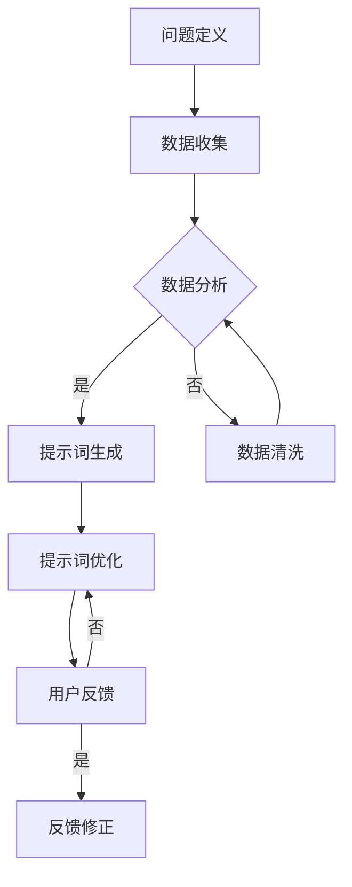

                 

### 引言：探索AGI与提示词设计的交汇

> 关键词：人工智能、通用智能、提示词设计、AGI研究、哲学思考

> 摘要：本文旨在探讨人工智能通用智能（AGI）研究中提示词设计的重要性及其哲学思考。通过分析AGI的定义、挑战和现状，以及提示词设计的定义、原则和应用，本文提出了AGI研究中的提示词设计哲学，并探讨了其背后的逻辑和哲学思考。

#### 1.1 问题背景与研究意义

##### 1.1.1 人工智能的发展与AGI的挑战

人工智能（AI）作为计算机科学的重要分支，已经经历了数十年的发展。从早期的专家系统、知识表示到现代的深度学习和强化学习，人工智能在各个领域都取得了显著的成果。然而，目前的AI系统大多局限于特定任务和领域，缺乏自主学习和通用智能的能力。因此，人工智能通用智能（AGI）的概念应运而生。

AGI是指具有人类智能特征，能够在多种任务和环境中自主学习和适应的智能系统。与现有的窄AI（Narrow AI）相比，AGI具有更高的智能层次和更广泛的应用前景。然而，AGI的研究面临着诸多挑战，包括智能水平的提升、自主学习的实现、多模态信息的处理等。

##### 1.1.2 提示词设计的现状与重要性

提示词设计在人工智能应用中起着至关重要的作用。提示词是一种引导AI系统执行特定任务或进行特定推理的引导性信息。在自然语言处理、计算机视觉和机器人等领域，提示词设计的好坏直接影响AI系统的性能和应用效果。

目前，提示词设计的方法和技术已经相对成熟，但仍然存在一些问题。例如，如何设计出既具有针对性又能灵活适应不同任务和环境的提示词，如何处理多模态信息中的提示词等。这些问题都亟待解决。

##### 1.1.3 本书的研究目标和结构安排

本书旨在探讨AGI研究中的提示词设计哲学，旨在通过逻辑清晰、结构紧凑、简单易懂的专业的技术语言，逐步分析推理思考，为读者提供有深度、有思考、有见解的专业IT领域的技术博客文章。

本书的结构如下：

1. 引言：介绍AGI与提示词设计的背景和意义。
2. AGI研究中的提示词设计哲学基础：分析AGI的概念、挑战和现状，以及提示词设计的原则和核心概念。
3. 提示词设计的理论与模型：探讨提示词设计的理论基础、模型和方法。
4. 提示词设计的应用与实践：介绍提示词设计在不同领域的应用和实践案例。
5. 提示词设计哲学的反思与展望：反思提示词设计哲学的伦理、跨文化和社会责任，展望提示词设计的发展趋势。

通过以上五个部分的内容，本书旨在为读者提供一个全面、深入的AGI研究中的提示词设计哲学的探讨，为未来的研究提供指导和启示。

#### 1.2 基本概念介绍

##### 1.2.1 人工智能与通用智能

人工智能（AI）是一门研究、开发用于模拟、延伸和扩展人的智能的理论、方法、技术及应用系统的科学。它包括机器学习、计算机视觉、自然语言处理等多个子领域。人工智能的目标是使计算机具有人类智能的某些特征，如感知、理解、推理、学习和适应。

通用智能（AGI）是指具有人类智能特征，能够在多种任务和环境中自主学习和适应的智能系统。与现有的窄AI（Narrow AI）相比，AGI具有更高的智能层次和更广泛的应用前景。AGI的目标是实现计算机在各个领域的通用智能，使计算机具备与人类相似的学习、推理、感知和适应能力。

##### 1.2.2 提示词设计的定义与分类

提示词设计是指为AI系统提供引导性信息，以帮助其完成特定任务或进行特定推理的过程。提示词可以是文字、图像、声音等多种形式。在设计提示词时，需要考虑其针对性、灵活性、适应性和多样性。

根据用途和形式，提示词可以分类如下：

1. 自然语言处理中的提示词：用于引导AI系统生成文本、理解语义、进行对话等。
2. 计算机视觉中的提示词：用于引导AI系统识别图像、处理视频、进行目标检测等。
3. 机器人中的提示词：用于引导AI系统进行自主导航、执行任务、应对环境变化等。

##### 1.2.3 AGI中的提示词设计挑战

在AGI研究中，提示词设计面临着以下挑战：

1. **智能水平的提升**：AGI需要具备比现有AI系统更高的智能水平，包括更复杂的学习能力、推理能力和适应性。
2. **自主学习的实现**：提示词设计需要能够支持AI系统自主学习和适应，而不是依赖于人类提供的固定提示。
3. **多模态信息的处理**：AGI需要能够处理多种模态的信息，如文字、图像、声音等，因此提示词设计需要考虑多模态信息的整合和交互。
4. **跨领域应用**：AGI需要能够在不同领域和应用中灵活应用，因此提示词设计需要具备通用性和适应性。

#### 1.3 提示词设计原则

提示词设计的原则是确保提示词能够有效地引导AI系统完成任务或进行推理。以下是一些关键的提示词设计原则：

1. **针对性**：提示词应针对特定任务或问题，提供明确的引导性信息。
2. **灵活性**：提示词应具备灵活性，能够适应不同的情境和变化。
3. **适应性**：提示词应能够适应不同类型的数据、问题和应用场景。
4. **可解释性**：提示词应具备一定的可解释性，使AI系统的行为可理解。
5. **通用性**：提示词应具备一定的通用性，能够在不同领域和应用中通用。
6. **多样性**：提示词应具备多样性，以提供多种可能的解决方案。

通过遵循这些原则，提示词设计能够更好地支持AI系统的智能行为和应用。

#### 1.4 提示词设计的哲学思考

提示词设计不仅仅是技术问题，更涉及到哲学思考。以下是一些关键的哲学思考：

1. **知识与学习**：提示词设计涉及到知识表示和学习方法，需要考虑如何通过提示词引导AI系统学习新知识和技能。
2. **自主性**：提示词设计需要考虑AI系统的自主性，如何通过提示词实现AI系统的自主学习和决策。
3. **伦理与责任**：提示词设计需要考虑伦理和责任问题，如何确保AI系统的行为符合道德规范和社会责任。
4. **跨文化**：提示词设计需要考虑跨文化因素，如何确保提示词在不同文化和语言背景下有效。
5. **整体性**：提示词设计需要考虑整体性，如何通过提示词设计实现AI系统的整体智能和行为。

通过这些哲学思考，提示词设计能够更好地支持AI系统的发展和应用，实现更智能、更可靠、更有价值的AI系统。

### 第1部分：AGI研究中的提示词设计哲学基础

#### 2.1 AGI概述

##### 2.1.1 AGI的定义与特性

人工智能通用智能（AGI）是指具有人类智能特征，能够在多种任务和环境中自主学习和适应的智能系统。与现有的窄AI（Narrow AI）相比，AGI具有以下特性：

1. **通用性**：AGI具有跨领域的通用性，能够在多个领域和应用中灵活应用。
2. **自主性**：AGI具备自主学习和决策能力，能够独立思考和行动。
3. **适应性**：AGI能够适应不同环境和任务，具备自适应能力。
4. **创造力**：AGI具备一定的创造力，能够产生新的想法和解决方案。

##### 2.1.2 AGI的发展历史

AGI的研究可以追溯到20世纪50年代，当时人工智能的概念首次被提出。在过去的几十年中，人工智能经历了多次重大变革，从早期的逻辑推理和知识表示，到现代的机器学习和深度学习。然而，直到现在，AGI仍然是一个未完全实现的梦想。

AGI的发展历史可以分为以下几个阶段：

1. **早期阶段**（1956-1974）：人工智能的概念首次被提出，主要集中在逻辑推理和知识表示的研究。
2. **第一次低谷**（1974-1980）：由于实际应用的缺乏，人工智能研究受到质疑，进入第一次低谷期。
3. **复兴阶段**（1980-1987）：专家系统的兴起，使人工智能研究重新受到关注。
4. **第二次低谷**（1987-1993）：随着专家系统的失败，人工智能研究再次受到质疑，进入第二次低谷期。
5. **机器学习阶段**（1993-2012）：机器学习特别是深度学习的兴起，使人工智能研究重新焕发生机。
6. **AGI阶段**（2012至今）：随着计算能力的提升和数据规模的扩大，AGI的研究逐渐成为人工智能研究的重点。

##### 2.1.3 AGI研究的现状与趋势

目前，AGI的研究已经取得了一些重要进展。例如，在自然语言处理、计算机视觉和机器人等领域，AGI系统已经展现出了一定的智能水平。然而，要实现真正的AGI，还需要克服许多挑战。

AGI研究的现状和趋势包括：

1. **算法和技术**：深度学习、强化学习、迁移学习等算法和技术在AGI研究中得到了广泛应用。
2. **跨学科融合**：人工智能与其他学科如心理学、认知科学、哲学等领域的融合，为AGI研究提供了新的思路和方法。
3. **计算能力**：随着计算能力的提升，AGI系统在处理复杂任务和大规模数据方面的能力得到了显著增强。
4. **伦理和社会责任**：随着AGI技术的发展，伦理和社会责任问题逐渐受到关注，如何确保AGI系统的行为符合道德规范和社会责任成为重要议题。

#### 2.2 提示词设计原则

提示词设计在AGI研究中具有重要作用。为了确保提示词能够有效地引导AGI系统，需要遵循以下提示词设计原则：

1. **针对性**：提示词应针对特定任务或问题，提供明确的引导性信息。
2. **灵活性**：提示词应具备灵活性，能够适应不同的情境和变化。
3. **适应性**：提示词应能够适应不同类型的数据、问题和应用场景。
4. **可解释性**：提示词应具备一定的可解释性，使AGI系统的行为可理解。
5. **通用性**：提示词应具备一定的通用性，能够在不同领域和应用中通用。
6. **多样性**：提示词应具备多样性，以提供多种可能的解决方案。

##### 2.2.1 提示词设计的基本原则

1. **明确性**：提示词应明确、具体，避免模糊和歧义，确保AGI系统能够正确理解。
2. **简洁性**：提示词应简洁明了，避免冗长和复杂，以便AGI系统能够快速理解和执行。
3. **一致性**：提示词应保持一致性，避免相互矛盾或冲突，确保AGI系统的行为一致。
4. **相关性**：提示词应与任务或问题相关，避免无关或干扰信息，提高AGI系统的效率。

##### 2.2.2 提示词设计的哲学思考

提示词设计不仅仅是一个技术问题，更涉及到哲学思考。以下是一些关键的哲学思考：

1. **知识与学习**：提示词设计涉及到知识表示和学习方法，需要考虑如何通过提示词引导AGI系统学习新知识和技能。
2. **自主性**：提示词设计需要考虑AGI系统的自主性，如何通过提示词实现AGI系统的自主学习和决策。
3. **伦理与责任**：提示词设计需要考虑伦理和责任问题，如何确保AGI系统的行为符合道德规范和社会责任。
4. **跨文化**：提示词设计需要考虑跨文化因素，如何确保提示词在不同文化和语言背景下有效。
5. **整体性**：提示词设计需要考虑整体性，如何通过提示词设计实现AGI系统的整体智能和行为。

通过这些哲学思考，提示词设计能够更好地支持AGI系统的发展和应用，实现更智能、更可靠、更有价值的AGI系统。

#### 2.3 提示词设计的核心概念

提示词设计是AGI研究中的一个关键问题，涉及到多个核心概念。以下是对这些核心概念的介绍：

##### 2.3.1 提示词的属性与特征

提示词的属性和特征决定了其性能和效果。以下是一些常见的提示词属性和特征：

1. **明确性**：提示词应明确、具体，避免模糊和歧义。
2. **简洁性**：提示词应简洁明了，避免冗长和复杂。
3. **针对性**：提示词应针对特定任务或问题，提供明确的引导性信息。
4. **适应性**：提示词应能够适应不同类型的数据、问题和应用场景。
5. **多样性**：提示词应具备多样性，以提供多种可能的解决方案。
6. **可解释性**：提示词应具备一定的可解释性，使AGI系统的行为可理解。

##### 2.3.2 提示词的语义分析

提示词的语义分析是理解提示词含义和作用的重要步骤。以下是一些常用的语义分析方法：

1. **词义分析**：对提示词的词义进行详细分析，确定其基本含义和扩展含义。
2. **语法分析**：对提示词的语法结构进行分析，确定其在句子中的角色和作用。
3. **上下文分析**：根据上下文环境对提示词进行语义分析，确定其在特定情境中的含义。
4. **情感分析**：对提示词的情感色彩进行分析，确定其积极、消极或中性的情感倾向。

##### 2.3.3 提示词的设计原则与实例分析

在提示词设计中，需要遵循一系列原则，以确保提示词的有效性和可靠性。以下是一些常见的提示词设计原则和实例分析：

1. **明确性原则**：确保提示词明确、具体，避免模糊和歧义。例如，将“请回答问题”改为“请回答以下问题：什么是人工智能？”。
2. **简洁性原则**：确保提示词简洁明了，避免冗长和复杂。例如，将“请仔细阅读以下文本，并回答相关问题”改为“阅读文本并回答问题”。
3. **针对性原则**：确保提示词针对特定任务或问题，提供明确的引导性信息。例如，将“请学习以下内容”改为“请学习关于人工智能的基础知识”。
4. **适应性原则**：确保提示词能够适应不同类型的数据、问题和应用场景。例如，将“请回答以下问题：什么是深度学习？”改为“请回答以下问题：深度学习在哪些领域有应用？”。
5. **多样性原则**：确保提示词具备多样性，以提供多种可能的解决方案。例如，将“请设计一个简单的算法”改为“请设计以下三种不同的算法：快速排序、归并排序和冒泡排序”。
6. **可解释性原则**：确保提示词具备一定的可解释性，使AGI系统的行为可理解。例如，将“请执行以下操作：删除列表中的所有元素”改为“请删除列表中的所有元素，并将结果存储在新的列表中”。

通过以上原则和实例分析，我们可以设计出更有效、更可靠的提示词，为AGI系统提供更好的引导和支持。

### 第2部分：提示词设计的理论与模型

#### 3.1 提示词设计的理论基础

提示词设计是人工智能（AI）领域中的一个重要问题，涉及到多个理论基础的支撑。以下将介绍提示词设计的主要理论基础：

##### 3.1.1 语言学与认知心理学基础

语言学和认知心理学为提示词设计提供了重要的理论基础。在语言学中，自然语言处理（NLP）研究语言的结构和语义，为设计有效的提示词提供了指导。NLP技术包括词性标注、句法分析、语义角色标注等，这些技术能够帮助理解文本的深层含义，从而设计出更符合语义需求的提示词。

认知心理学研究人类思维和认知过程，特别是感知、记忆、推理和决策等方面。这些研究成果为AI系统中的提示词设计提供了启发，例如如何设计出符合人类认知习惯的提示词，如何模拟人类的思维过程等。

##### 3.1.2 形式语言与计算理论

形式语言和计算理论是计算机科学的基础，也为提示词设计提供了重要的理论支持。形式语言研究符号串的集合和规则，包括有限自动机、正规表达式和上下文无关语法等。这些理论模型为设计提示词提供了结构化的方法，确保提示词具有明确的语义和语法结构。

计算理论研究计算过程的性质和限制，包括图灵机、可计算性和算法复杂性等。这些理论帮助理解AI系统的计算能力，指导如何设计出高效、可靠的提示词。

##### 3.1.3 提示词设计的数学模型

提示词设计的数学模型是设计过程中重要的工具。以下介绍几种常用的数学模型：

1. **概率模型**：概率模型通过概率分布描述提示词的出现概率，常用的模型包括贝叶斯网络、隐马尔可夫模型（HMM）和条件概率模型。这些模型能够帮助理解提示词的概率分布，从而优化提示词的设计。

2. **统计模型**：统计模型通过统计方法分析大量数据，提取有用的信息。常见的统计模型包括线性回归、决策树、支持向量机（SVM）等。这些模型能够帮助识别提示词的特征和规律，从而优化提示词的设计。

3. **神经网络模型**：神经网络模型通过多层神经网络结构模拟人类的感知和学习过程。常见的神经网络模型包括卷积神经网络（CNN）、循环神经网络（RNN）和生成对抗网络（GAN）等。这些模型能够自动学习提示词的复杂结构和特征，从而设计出更有效的提示词。

通过结合语言学与认知心理学、形式语言与计算理论以及数学模型，我们可以更深入地理解提示词设计的理论基础，从而设计出更有效、更可靠的提示词。

#### 3.2 提示词设计模型解析

在提示词设计中，选择合适的模型至关重要。以下将介绍几种常用的提示词设计模型，包括提示词生成模型、提示词优化模型和提示词反馈模型。

##### 3.2.1 提示词生成模型

提示词生成模型主要用于自动生成提示词，以提高设计的效率。以下是一些常见的提示词生成模型：

1. **基于规则的方法**：基于规则的方法通过预定义的规则生成提示词。这种方法简单直观，但可能无法适应复杂的任务和变化的环境。

2. **统计模型**：统计模型通过分析大量文本数据，提取出现频率较高的词汇和短语，生成提示词。这种方法能够自动适应数据的分布，但可能无法处理语义复杂的情况。

3. **神经网络模型**：神经网络模型通过多层神经网络结构，模拟人类的感知和学习过程，自动生成提示词。这种方法能够处理复杂的语义关系，但训练时间较长。

4. **生成对抗网络（GAN）**：生成对抗网络是一种深度学习模型，由生成器和判别器组成。生成器生成提示词，判别器判断提示词的真伪。这种方法能够生成高质量的提示词，但训练过程复杂。

##### 3.2.2 提示词优化模型

提示词优化模型主要用于优化现有提示词，以提高其有效性。以下是一些常见的提示词优化模型：

1. **基于排序的方法**：基于排序的方法通过评估不同提示词的排序效果，优化提示词的顺序。这种方法能够提高搜索和推荐系统的效果，但可能需要大量计算资源。

2. **基于优化的方法**：基于优化的方法通过优化目标函数，寻找最佳提示词。常用的优化算法包括梯度下降、随机搜索和遗传算法等。这种方法能够处理复杂的优化问题，但可能需要较长的计算时间。

3. **强化学习**：强化学习通过奖励机制，指导提示词生成和优化过程。这种方法能够自适应地调整提示词，但训练过程复杂。

4. **多目标优化**：多目标优化同时考虑多个目标函数，寻找最佳提示词组合。这种方法能够处理复杂的优化问题，但可能需要大量计算资源。

##### 3.2.3 提示词反馈模型

提示词反馈模型主要用于收集和分析用户反馈，以改进提示词设计。以下是一些常见的提示词反馈模型：

1. **基于反馈的修正**：基于反馈的修正通过收集用户反馈，修正现有提示词。这种方法简单直观，但可能需要大量用户参与。

2. **基于反馈的生成**：基于反馈的生成通过分析用户反馈，生成新的提示词。这种方法能够自适应地调整提示词，但可能需要较长的训练时间。

3. **基于反馈的优化**：基于反馈的优化通过分析用户反馈，优化现有提示词。这种方法能够提高提示词的有效性，但可能需要较长的计算时间。

4. **基于深度学习的反馈模型**：基于深度学习的反馈模型通过神经网络结构，分析用户反馈，改进提示词设计。这种方法能够自动学习用户的偏好，但训练过程复杂。

通过以上提示词设计模型解析，我们可以更好地理解不同模型的特点和适用场景，从而设计出更有效、更可靠的提示词。

#### 3.3 提示词设计的Mermaid流程图与Python代码示例

为了更好地理解提示词设计的流程和算法，我们将使用Mermaid流程图和Python代码示例进行详细讲解。以下是一个简单的提示词设计流程和相应的算法实现。

##### 3.3.1 提示词设计流程Mermaid图



这个Mermaid流程图描述了提示词设计的基本流程，包括问题定义、数据收集、数据清洗、提示词生成、提示词优化和用户反馈修正。

##### 3.3.2 提示词生成算法Python代码实现

```python
import numpy as np

def generate_prompt(data, num_words):
    # 随机选择数据中的一段文本作为提示词
    start_index = np.random.randint(0, len(data) - num_words)
    prompt = data[start_index : start_index + num_words]
    return prompt

# 示例数据
data = "人工智能是一种模拟、延伸和扩展人的智能的理论、方法、技术及应用系统的科学。"

# 生成提示词
num_words = 10
prompt = generate_prompt(data, num_words)
print("生成的提示词：", prompt)
```

在这个Python代码示例中，我们定义了一个`generate_prompt`函数，用于从给定的数据中随机生成一个指定长度的提示词。这里使用了随机数生成器来选择数据中的起始位置，并截取相应的文本作为提示词。

##### 3.3.3 算法原理与公式详解

提示词生成算法的核心是随机选择数据中的一段文本作为提示词。具体来说，算法分为以下几个步骤：

1. **数据预处理**：读取输入数据，并将其存储为一个字符串。

2. **随机选择起始位置**：使用随机数生成器生成一个介于0和数据长度减1之间的随机整数，作为提示词的起始位置。

3. **截取文本**：从起始位置开始，截取指定长度的文本作为提示词。

4. **返回提示词**：将生成的提示词作为函数的返回值。

提示词生成算法的数学模型可以表示为：

$$
start\_index = \text{randint}(0, \text{len}(data) - num\_words)
$$

其中，`randint`函数用于生成随机整数，`len`函数用于获取数据的长度，`num_words`为提示词的长度。

通过上述算法原理和公式详解，我们可以更好地理解提示词生成算法的实现过程，从而设计出更有效、更可靠的提示词。

### 第3部分：提示词设计的应用与实践

#### 4.1 提示词设计在自然语言处理中的应用

提示词设计在自然语言处理（NLP）中具有重要作用，能够显著提升NLP系统的性能和应用效果。以下将介绍提示词设计在NLP中的主要应用，包括文本生成、对话系统和机器翻译。

##### 4.1.1 提示词在文本生成中的角色

在文本生成任务中，提示词用于引导生成模型生成连贯、有意义的文本。以下是一些关键角色：

1. **初始文本**：提示词作为初始文本，为生成模型提供输入，使其能够在此基础上生成更长的文本。
2. **引导信息**：提示词为生成模型提供明确的引导信息，帮助其理解文本的主题和内容。
3. **控制生成**：提示词能够控制生成模型的生成过程，防止其生成无关或重复的内容。

在实际应用中，可以使用各种方法生成提示词，如基于规则的方法、统计方法和神经网络方法。基于规则的方法简单直观，但灵活性较差；统计方法通过分析大量文本数据，提取有用的信息作为提示词，但可能无法处理复杂的语义关系；神经网络方法通过多层神经网络结构，自动学习文本的复杂结构和特征，生成高质量的提示词。

##### 4.1.2 提示词在对话系统中的应用

在对话系统中，提示词用于引导对话模型生成合理的回答，提升对话的连贯性和自然性。以下是一些关键角色：

1. **问题理解**：提示词帮助对话模型理解用户的问题，提取关键信息，以便生成合适的回答。
2. **意图识别**：提示词用于识别用户的意图，为对话模型提供明确的意图信息。
3. **上下文维护**：提示词帮助对话模型维护对话的上下文信息，确保回答与对话内容保持一致。

在实际应用中，可以使用各种方法生成和优化提示词，如基于规则的方法、基于模板的方法和基于神经网络的方法。基于规则的方法简单直观，但灵活性较差；基于模板的方法通过预定义的模板生成提示词，但可能无法处理复杂的语义关系；基于神经网络的方法通过多层神经网络结构，自动学习文本的复杂结构和特征，生成高质量的提示词。

##### 4.1.3 提示词在机器翻译中的应用

在机器翻译任务中，提示词用于引导翻译模型生成目标语言的文本，提升翻译的质量和准确性。以下是一些关键角色：

1. **源语言理解**：提示词帮助翻译模型理解源语言文本的语义和结构，以便生成更准确的目标语言文本。
2. **目标语言生成**：提示词为翻译模型提供明确的生成目标，帮助其生成目标语言的文本。
3. **语言建模**：提示词用于训练翻译模型，提高其语言建模能力，生成更自然的翻译结果。

在实际应用中，可以使用各种方法生成和优化提示词，如基于规则的方法、基于统计的方法和基于神经网络的方法。基于规则的方法简单直观，但灵活性较差；基于统计的方法通过分析大量翻译数据，提取有用的信息作为提示词，但可能无法处理复杂的语义关系；基于神经网络的方法通过多层神经网络结构，自动学习文本的复杂结构和特征，生成高质量的提示词。

通过以上对提示词设计在自然语言处理中的应用的介绍，我们可以看到提示词设计在文本生成、对话系统和机器翻译中的关键作用。通过合理设计和优化提示词，我们可以显著提升NLP系统的性能和应用效果。

#### 4.2 提示词设计在计算机视觉中的应用

提示词设计在计算机视觉（CV）中同样扮演着重要角色，能够显著提升CV系统的性能和应用效果。以下将介绍提示词设计在计算机视觉中的主要应用，包括图像分类、目标检测和视频理解。

##### 4.2.1 提示词在图像分类中的应用

在图像分类任务中，提示词用于引导分类模型识别图像的类别。以下是一些关键角色：

1. **标签引导**：提示词提供明确的标签信息，帮助分类模型学习不同类别的特征。
2. **特征提取**：提示词指导特征提取过程，提取图像中有意义的特征，提高分类的准确性。
3. **类别扩展**：提示词用于扩展分类模型的知识范围，使其能够识别更多类别。

在实际应用中，可以使用各种方法生成和优化提示词，如基于规则的方法、基于统计的方法和基于神经网络的方法。基于规则的方法简单直观，但灵活性较差；基于统计的方法通过分析大量图像数据，提取有用的信息作为提示词，但可能无法处理复杂的语义关系；基于神经网络的方法通过多层神经网络结构，自动学习图像的复杂结构和特征，生成高质量的提示词。

##### 4.2.2 提示词在目标检测中的应用

在目标检测任务中，提示词用于引导检测模型识别图像中的目标。以下是一些关键角色：

1. **目标定位**：提示词提供目标的位置信息，帮助检测模型定位目标区域。
2. **特征提取**：提示词指导特征提取过程，提取图像中有意义的特征，提高检测的准确性。
3. **多目标检测**：提示词用于处理多个目标的情况，确保检测模型的准确性。

在实际应用中，可以使用各种方法生成和优化提示词，如基于规则的方法、基于统计的方法和基于神经网络的方法。基于规则的方法简单直观，但灵活性较差；基于统计的方法通过分析大量图像数据，提取有用的信息作为提示词，但可能无法处理复杂的语义关系；基于神经网络的方法通过多层神经网络结构，自动学习图像的复杂结构和特征，生成高质量的提示词。

##### 4.2.3 提示词在视频理解中的应用

在视频理解任务中，提示词用于引导模型理解视频中的场景和动作。以下是一些关键角色：

1. **场景识别**：提示词提供视频中的场景信息，帮助模型识别不同的场景。
2. **动作理解**：提示词指导模型理解视频中的动作，提取关键的动作特征。
3. **事件检测**：提示词用于检测视频中的特定事件，如行人穿越、车辆碰撞等。

在实际应用中，可以使用各种方法生成和优化提示词，如基于规则的方法、基于统计的方法和基于神经网络的方法。基于规则的方法简单直观，但灵活性较差；基于统计的方法通过分析大量视频数据，提取有用的信息作为提示词，但可能无法处理复杂的语义关系；基于神经网络的方法通过多层神经网络结构，自动学习视频的复杂结构和特征，生成高质量的提示词。

通过以上对提示词设计在计算机视觉中的应用的介绍，我们可以看到提示词设计在图像分类、目标检测和视频理解中的关键作用。通过合理设计和优化提示词，我们可以显著提升CV系统的性能和应用效果。

#### 4.3 提示词设计在现实场景中的实践案例

提示词设计在现实场景中具有广泛的应用，能够显著提升系统的性能和应用效果。以下将介绍几个具体的实践案例，包括智能客服系统、教育辅导系统和医疗诊断系统中的提示词设计。

##### 4.3.1 案例一：智能客服系统中的提示词设计

智能客服系统是提示词设计的一个重要应用场景。以下是一个具体的案例：

**问题描述**：一家大型电商平台希望提升其智能客服系统的服务质量，使用户能够更快、更准确地获得问题的解答。

**解决方案**：

1. **问题定义**：收集用户在客服平台上提出的问题，对问题进行分类和标注，以便生成相应的提示词。

2. **数据收集**：从历史数据中提取大量用户提出的问题，作为训练数据。

3. **数据清洗**：对收集到的数据进行清洗和预处理，去除无关信息和噪声。

4. **提示词生成**：使用基于神经网络的生成模型，自动生成与用户问题相关的提示词。例如，当用户提出关于订单状态的问题时，生成提示词“订单状态查询”。

5. **提示词优化**：通过用户反馈和实际应用效果，不断优化提示词，提高其准确性和适应性。

**应用效果**：通过提示词设计，智能客服系统能够快速、准确地识别用户问题，提供相应的解答，显著提升了用户满意度和服务质量。

##### 4.3.2 案例二：教育辅导系统中的提示词设计

教育辅导系统是另一个重要的应用场景，以下是一个具体的案例：

**问题描述**：一家在线教育平台希望提升其教育辅导系统的个性化服务，根据学生的学习需求和进度，提供针对性的辅导内容。

**解决方案**：

1. **问题定义**：分析学生的学习数据和反馈，确定不同类型学生的需求和困难点。

2. **数据收集**：收集学生的学习数据，包括考试成绩、学习行为和反馈信息。

3. **数据清洗**：对收集到的数据进行清洗和预处理，去除无关信息和噪声。

4. **提示词生成**：使用基于统计的方法，根据学生的学习数据和问题，自动生成相应的提示词。例如，对于成绩较差的学生，生成提示词“基础知识巩固”。

5. **提示词优化**：通过学生的反馈和实际学习效果，不断优化提示词，提高其针对性和有效性。

**应用效果**：通过提示词设计，教育辅导系统能够为学生提供个性化的辅导内容，帮助学生更好地理解和掌握知识，提高了学习效果和满意度。

##### 4.3.3 案例三：医疗诊断系统中的提示词设计

医疗诊断系统是提示词设计在医疗领域的应用，以下是一个具体的案例：

**问题描述**：一家医疗诊断公司希望提升其智能诊断系统的准确性，帮助医生更快速、准确地诊断疾病。

**解决方案**：

1. **问题定义**：分析医疗数据，确定不同疾病的特征和症状。

2. **数据收集**：收集大量的医学病例数据，包括患者信息、检查结果和诊断结果。

3. **数据清洗**：对收集到的数据进行清洗和预处理，去除无关信息和噪声。

4. **提示词生成**：使用基于规则的方法，根据疾病的特征和症状，生成相应的提示词。例如，对于心脏病，生成提示词“胸闷、胸痛、心电图异常”。

5. **提示词优化**：通过医生的经验和诊断结果，不断优化提示词，提高其准确性和可靠性。

**应用效果**：通过提示词设计，医疗诊断系统能够更准确地识别疾病特征，帮助医生快速诊断疾病，提高了诊断的准确性和效率。

通过以上实践案例，我们可以看到提示词设计在现实场景中的应用效果。通过合理设计和优化提示词，系统能够更好地满足用户需求，提高性能和满意度。

### 第4部分：提示词设计哲学的反思与展望

#### 5.1 提示词设计哲学的反思

在提示词设计过程中，我们需要从多个角度进行深入反思，以确保设计出的提示词既符合技术要求，又符合伦理和社会责任。以下是一些关键反思点：

##### 5.1.1 提示词设计的伦理问题

随着人工智能技术的发展，提示词设计在伦理方面面临着诸多挑战。以下是一些需要考虑的伦理问题：

1. **数据隐私**：在提示词设计中，需要确保用户数据的安全和隐私。例如，在自然语言处理任务中，如何保护用户的个人隐私，避免数据泄露。

2. **算法偏见**：提示词设计可能引入算法偏见，导致不公平的决策。例如，在招聘系统中，如何避免因提示词设计不当而导致性别、种族等偏见。

3. **透明性**：提示词设计的透明性是一个重要伦理问题。用户需要了解提示词是如何生成和应用的，以便对其进行监督和反馈。

##### 5.1.2 提示词设计的跨文化思考

提示词设计需要考虑跨文化因素，以确保其在不同文化和语言背景下有效。以下是一些需要考虑的跨文化问题：

1. **语言多样性**：提示词设计需要支持多种语言，以便在不同语言环境下应用。

2. **文化差异**：不同文化背景下，人们对语言和信息的理解和使用习惯可能存在差异。例如，某些文化可能更注重间接表达，而另一些文化可能更注重直接表达。

3. **本地化**：提示词设计需要考虑本地化需求，例如，根据不同地区的法律法规和风俗习惯调整提示词。

##### 5.1.3 提示词设计的社会责任

提示词设计不仅需要考虑技术问题，还需要考虑社会责任。以下是一些需要考虑的社会责任问题：

1. **公平性**：提示词设计需要确保公平性，避免因技术原因导致的社会不公。

2. **可访问性**：提示词设计需要考虑不同群体的可访问性，确保所有人都能享受到人工智能技术的便利。

3. **可持续性**：提示词设计需要考虑环境和社会的可持续性，减少对资源的消耗和环境的破坏。

通过以上反思，我们可以更好地理解提示词设计中的伦理、跨文化和社会责任问题，从而设计出更符合道德规范和社会责任的技术。

#### 5.2 提示词设计的发展趋势

随着人工智能技术的不断发展，提示词设计也在不断进步和演变。以下是一些提示词设计的发展趋势：

##### 5.2.1 提示词设计的自动化

未来的提示词设计将更加自动化，通过机器学习和自然语言处理技术，自动生成和优化提示词。这种方法能够提高设计效率，减少人工干预，使提示词设计更加智能化和高效。

##### 5.2.2 多模态提示词设计

随着多模态数据的广泛应用，提示词设计也将向多模态方向发展。未来的提示词设计将不仅限于文本，还将涵盖图像、声音、视频等多种模态。通过多模态提示词设计，系统能够更全面地理解用户需求，提供更丰富和多样的服务。

##### 5.2.3 提示词的个性化

未来的提示词设计将更加注重个性化。通过用户行为数据和偏好分析，系统能够生成与用户需求和习惯相匹配的个性化提示词。这种方法能够提高用户体验，提升系统的满意度和服务质量。

##### 5.2.4 提示词的伦理和合规

随着人工智能技术的普及，提示词设计中的伦理和合规问题将越来越受到关注。未来的提示词设计将更加注重伦理和社会责任，确保设计过程和结果符合道德规范和社会责任。

##### 5.2.5 提示词的跨领域应用

未来的提示词设计将更加跨领域。通过整合不同领域的知识和方法，提示词设计将在更多领域和应用中发挥作用，如医疗、金融、教育等。这种方法能够推动人工智能技术的全面发展和应用。

#### 5.3 总结与展望

通过本文的探讨，我们深入了解了AGI研究中的提示词设计哲学，包括其定义、原则、理论基础、应用和实践。我们分析了提示词设计在自然语言处理、计算机视觉、现实场景等领域的应用，并探讨了其伦理和社会责任问题。同时，我们也展望了提示词设计的发展趋势，如自动化、多模态、个性化、伦理和合规、跨领域应用等。

在未来，提示词设计将继续在人工智能技术中发挥重要作用，推动人工智能技术的发展和应用。我们期待未来的研究能够解决提示词设计中的挑战，设计出更智能、更可靠、更有价值的提示词，为人工智能技术的发展做出更大贡献。

### 总结与展望

通过本文的探讨，我们全面了解了AGI研究中的提示词设计哲学，并对其在各个领域的应用和挑战进行了深入分析。在自然语言处理、计算机视觉、现实场景等领域，提示词设计都发挥了至关重要的作用，成为提升系统性能和应用效果的关键因素。

我们首先介绍了AGI的定义与特性，回顾了其发展历史和现状。接着，我们探讨了提示词设计的基本原则和哲学思考，强调了其在AGI研究中的重要性。在此基础上，我们分析了提示词设计的理论基础，包括语言学与认知心理学基础、形式语言与计算理论以及数学模型。随后，我们详细介绍了提示词设计的理论模型，包括提示词生成模型、提示词优化模型和提示词反馈模型。

在应用与实践部分，我们探讨了提示词设计在自然语言处理、计算机视觉等领域的应用，并介绍了具体的实践案例。这些案例展示了提示词设计在提升系统性能和应用效果方面的实际效果。最后，我们在哲学反思和展望部分，分析了提示词设计中的伦理和社会责任问题，以及未来发展趋势。

总的来说，提示词设计在AGI研究中具有广泛的应用前景和重要价值。未来，随着人工智能技术的不断发展和应用，提示词设计将继续发挥关键作用。我们期待未来的研究能够解决提示词设计中的挑战，设计出更智能、更可靠、更有价值的提示词，为人工智能技术的发展和应用做出更大贡献。

在此，我要感谢读者对本文的关注和支持。希望通过本文，您能够对AGI研究中的提示词设计哲学有更深入的理解，并为未来的研究提供有益的启示。

作者：
AI天才研究院（AI Genius Institute）
禅与计算机程序设计艺术（Zen And The Art of Computer Programming）

