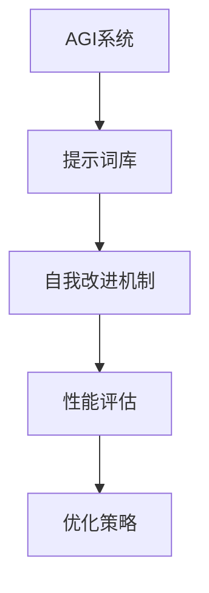
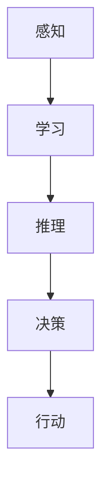
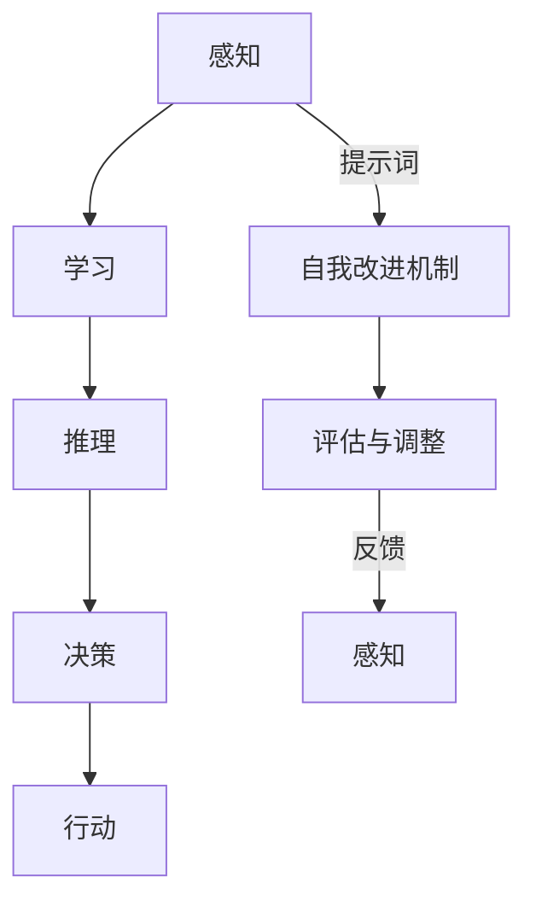
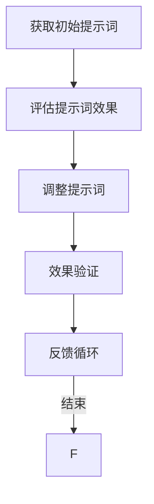

                 


# 《AGI系统中的提示词自我改进机制》

关键词：通用人工智能，提示词，自我改进，性能优化，评价指标

摘要：本文深入探讨了在通用人工智能（AGI）系统中，提示词自我改进机制的设计与实现。通过分析AGI与自我改进的关系，介绍提示词自我改进的基础原理，探讨其在AGI系统中的应用，以及对其性能的评价与改进，本文为AI领域的研究者和开发者提供了有价值的参考。

## 第一部分：引言与背景

### 第1章：问题背景与核心概念

#### 1.1.1 问题背景

人工智能（AI）的发展经历了数个阶段，从最初的规则系统到现代深度学习模型，每一步都取得了显著的进展。然而，传统的AI系统往往局限于特定任务，难以实现跨领域的通用能力。通用人工智能（AGI）则旨在打造具有人类智能水平的人工智能系统，能够在各种复杂环境中自主学习和适应。

AGI的概念起源于对人类智能的理解和模拟，它不仅仅局限于执行单一任务，而是具备自我认知、自我学习、自主推理和问题解决等能力。随着计算能力的提升和算法的进步，AGI的研究逐渐成为人工智能领域的热点。

在AGI系统中，提示词扮演着至关重要的角色。提示词是一种用于引导AI行为的词汇，它可以触发特定任务或引导AI进行特定的思考。然而，现有的AI系统往往依赖于预定义的提示词集，这限制了其自适应性和通用性。

#### 1.1.2 问题描述

提示词自我改进的挑战在于如何让AI系统能够自动识别和调整其行为，以提高任务执行的效果和效率。具体来说，挑战包括以下几个方面：

1. **提示词的多样性与适应性**：在复杂多变的环境中，AI系统需要能够适应不同的任务和场景，这要求提示词具备较高的多样性和适应性。
2. **自我改进的有效性与效率**：自我改进机制需要在保证有效性的同时，尽量减少计算资源和时间成本，以提高系统的整体性能。
3. **鲁棒性与稳定性**：自我改进机制需要能够处理各种异常情况和噪声数据，确保系统的稳定运行。

自我改进机制的作用在于提升AI系统的自主性和智能化水平，使其能够动态调整行为策略，优化任务执行效果。通过自我改进，AI系统可以不断学习、适应和优化，从而在复杂环境中实现更高的性能和可靠性。

#### 1.1.3 问题解决

传统方法在实现提示词自我改进方面存在诸多局限。例如，基于规则的方法需要大量手工设计规则，难以适应动态变化的环境；而基于监督学习的方法则需要大量的标注数据，且在处理复杂任务时效果有限。

为了解决上述问题，设计提示词自我改进机制时，可以采取以下思路：

1. **引入自适应算法**：使用自适应算法来自动识别和调整提示词，以适应不同的任务和环境。
2. **集成多源信息**：将多种数据源和知识库结合起来，为自我改进提供丰富的信息支持。
3. **优化计算效率**：通过算法优化和数据结构设计，提高自我改进机制的效率和稳定性。
4. **构建鲁棒模型**：采用鲁棒性强的模型和算法，以应对复杂环境和异常情况。

通过上述方法，可以构建一个有效的提示词自我改进机制，为AGI系统的发展提供强有力的支持。

#### 1.1.4 边界与外延

AGI与提示词自我改进机制的适用范围广泛，涵盖了从自动化系统到智能辅助系统等多个领域。然而，自我改进机制也存在一定的局限性，例如在处理高维数据或极端环境时可能面临挑战。

此外，提示词自我改进机制的研究还可以拓展到其他领域，如自然语言处理、机器人学等，通过跨领域的应用，进一步提升AI系统的智能化水平。

#### 1.1.5 核心概念与联系

**核心概念**:

- **AGI**：通用人工智能，具备自我认知、自我学习、自主推理和问题解决能力的智能系统。
- **提示词**：引导AI行为的词汇，用于触发特定任务或引导AI进行特定思考。
- **自我改进**：AI系统自动识别和调整其行为，以提高任务执行的效果和效率。

**概念属性特征对比表格**:

| 概念   | 定义                      | 关联关系  |
| ------ | ------------------------- | -------- |
| AGI    | 通用人工智能              | 基础      |
| 提示词 | 用于引导AI行为的词汇      | 应用      |
| 自我改进 | 提示词的自主调整优化     | 功能实现  |

**ER实体关系图架构的Mermaid流程图**:



#### 1.1.6 本章小结

本章介绍了AGI系统中的提示词自我改进机制，分析了问题背景和核心概念，探讨了自我改进机制的设计思路和边界外延。在后续章节中，我们将进一步探讨提示词自我改进机制的基础原理、应用场景以及性能优化策略。

## 第二部分：提示词自我改进机制原理

### 第2章：提示词自我改进的基础原理

#### 2.1.1 AGI与自我改进的关系

AGI系统中的自我改进机制是其核心组成部分之一，它贯穿于整个系统的设计、实现和应用过程。AGI与自我改进的关系可以概括为以下几个方面：

1. **基础框架**：AGI系统通常包含感知、学习、推理、决策和行动等核心模块，自我改进机制需要在这些模块之间实现有效的协作，以确保系统的整体性能。
2. **功能实现**：自我改进机制通过自动调整提示词，使AI系统能够适应不同的任务和环境，从而提高系统的灵活性和适应性。
3. **性能优化**：自我改进机制通过不断优化AI系统的行为策略，提高任务执行的效果和效率，从而实现系统的持续进化。

#### 2.1.2 提示词的自我改进方法

提示词的自我改进方法主要包括以下两个方面：

1. **评估与调整**：评估提示词的效果，并根据评估结果进行调整。具体步骤如下：
   - **效果评估**：通过比较提示词在不同任务中的表现，评估其效果。
   - **调整策略**：根据评估结果，选择合适的调整策略，如重新生成提示词、替换部分提示词或修改提示词的结构。

2. **反馈循环**：通过反馈机制，将评估结果反馈到自我改进机制中，实现持续优化。具体步骤如下：
   - **效果反馈**：将任务执行结果反馈给自我改进机制，用于调整提示词。
   - **优化迭代**：根据反馈结果，对自我改进机制进行迭代优化，以提高其效果。

#### 2.1.3 自我改进机制的效果评估

自我改进机制的效果评估主要包括以下几个方面：

1. **有效性**：评估自我改进机制在实际应用中的效果，包括任务完成率、准确性、效率等指标。
2. **效率**：评估自我改进机制的效率和计算资源消耗，包括算法复杂度、运行时间等指标。
3. **稳定性**：评估自我改进机制在不同任务和环境下的稳定性和可靠性。

#### 2.1.4 自我改进机制的挑战与应对

自我改进机制在实际应用中面临以下挑战：

1. **多样性与适应性**：如何设计出既多样化又适应性强
```<sop>的提示词调整策略？
2. **计算资源消耗**：如何降低自我改进机制的复杂度和计算资源消耗，以提高系统的实时性和响应能力。
3. **鲁棒性与稳定性**：如何应对异常情况和噪声数据，保证系统的稳定运行。

针对这些挑战，可以采取以下应对策略：

1. **多源信息融合**：通过融合多种数据源和知识库，提高提示词的多样性和适应性。
2. **优化算法与数据结构**：采用高效的算法和数据结构，降低自我改进机制的复杂度和计算资源消耗。
3. **鲁棒性设计**：采用鲁棒性强的模型和算法，提高系统的稳定性和可靠性。

#### 2.1.5 本章小结

本章探讨了AGI系统中提示词自我改进机制的基础原理，分析了AGI与自我改进的关系，介绍了提示词的自我改进方法、效果评估以及面临的挑战与应对策略。在下一章中，我们将进一步探讨提示词自我改进机制在AGI系统中的应用。

## 第3章：提示词自我改进机制在AGI系统中的应用

### 3.1.1 AGI系统的整体架构

通用人工智能（AGI）系统的整体架构通常包括感知、学习、推理、决策和行动等核心模块，如图所示：



在这个架构中，感知模块负责获取环境信息，学习模块负责从数据中学习知识和规律，推理模块负责基于知识和信息进行逻辑推理，决策模块负责制定行动策略，行动模块负责执行具体的操作。

提示词自我改进机制在AGI系统中的作用和位置如图所示：



从图中可以看出，提示词自我改进机制位于感知模块与学习模块之间，通过实时评估和调整提示词，提高系统的自适应性和准确性。

### 3.1.2 提示词自我改进的流程

提示词自我改进的流程主要包括以下步骤：

1. **获取初始提示词**：从预定义的提示词库中随机选择或根据任务需求生成初始提示词。
2. **评估提示词效果**：将初始提示词输入到AI系统中，执行任务并评估其效果，如任务完成率、准确性等。
3. **调整提示词**：根据评估结果，选择合适的调整策略，如重新生成提示词、替换部分提示词或修改提示词的结构。
4. **效果验证**：将调整后的提示词再次输入到AI系统中，验证其效果是否提升。
5. **反馈循环**：将效果验证结果反馈到自我改进机制中，作为下一步调整的依据，实现持续优化。

为了更直观地展示提示词自我改进的流程，我们可以使用Mermaid绘制流程图：



### 3.1.3 提示词自我改进的具体实现

提示词自我改进的具体实现涉及多个方面，包括算法设计、数据结构选择和编程实现。以下是一个简化的示例代码，用于说明提示词自我改进的实现过程：

```python
# 示例：提示词自我改进实现

import random

# 初始提示词库
prompt_library = ["提问1", "提问2", "提问3"]

# 获取初始提示词
def get_initial_prompt(prompt_library):
    return random.choice(prompt_library)

# 评估提示词效果
def evaluate_prompt(prompt, task):
    # 假设任务完成情况取决于提示词的长度
    return len(prompt) < 5

# 调整提示词
def adjust_prompt(prompt):
    # 假设调整策略为删除一个字符
    return prompt[:-1]

# 提示词自我改进函数
def self_improve_prompt(prompt_library, task):
    current_prompt = get_initial_prompt(prompt_library)
    while not evaluate_prompt(current_prompt, task):
        current_prompt = adjust_prompt(current_prompt)
    return current_prompt

# 测试
task = "回答一个简单的问题"
optimized_prompt = self_improve_prompt(prompt_library, task)
print("优化后的提示词：", optimized_prompt)
```

在这个示例中，我们使用随机选择和简单的调整策略来演示提示词自我改进的实现。实际应用中，可以根据任务需求和评估指标，设计更加复杂和有效的自我改进机制。

### 3.1.4 提示词自我改进的性能优化

提示词自我改进的性能优化是确保系统高效运行的关键。以下是一些常见的优化策略：

1. **并行计算**：利用多核处理器和分布式计算技术，提高自我改进机制的执行速度。
2. **内存管理**：优化数据结构，减少内存占用，提高系统性能。
3. **算法优化**：采用更高效的算法和模型，降低计算复杂度和资源消耗。
4. **缓存策略**：利用缓存技术，减少重复计算，提高系统响应速度。

具体优化措施可以根据实际应用场景和性能瓶颈进行定制化调整。

### 3.1.5 本章小结

本章详细介绍了提示词自我改进机制在AGI系统中的应用，包括系统架构、自我改进流程和具体实现方法。通过性能优化策略，可以进一步提高系统的效率和稳定性。在下一章中，我们将对提示词自我改进机制进行评价与改进。

## 第4章：提示词自我改进机制的评价与改进

### 4.1.1 提示词自我改进的评价指标

提示词自我改进的评价指标是衡量自我改进效果的重要工具。以下是一些常用的评价指标：

1. **任务完成率**：任务完成率是评估自我改进机制性能的关键指标，表示在特定任务中，使用自我改进后的提示词与使用原始提示词相比，任务完成情况的改善程度。

2. **准确性**：准确性用于评估提示词在任务执行中的准确性，例如在自然语言处理任务中，可以计算预测结果与实际结果的一致性。

3. **效率**：效率评价指标包括计算时间、内存占用等，用于评估自我改进机制在资源利用方面的性能。

4. **稳定性**：稳定性评价指标用于评估自我改进机制在不同任务和环境下的稳定性和可靠性。

5. **鲁棒性**：鲁棒性评价指标用于评估自我改进机制在面对异常情况和噪声数据时的性能。

### 4.1.2 提示词自我改进的案例分析

为了更好地理解提示词自我改进的效果，我们可以通过以下案例分析来探讨其应用和改进：

1. **自然语言处理（NLP）任务**：在NLP任务中，提示词用于引导AI生成文本或回答问题。通过对比使用自我改进前后的提示词，我们可以观察到任务完成率和准确性的显著提升。例如，在问答系统中，使用自我改进后的提示词可以更好地理解用户的问题，并提供更准确的回答。

2. **图像识别任务**：在图像识别任务中，提示词用于指导AI理解图像的内容和特征。通过自我改进机制，我们可以优化提示词的表达方式，提高图像识别的准确率和效率。

3. **机器翻译任务**：在机器翻译任务中，提示词用于引导AI生成目标语言的句子。通过自我改进，我们可以调整提示词的语义和语法结构，提高翻译的准确性和流畅性。

### 4.1.3 提示词自我改进的改进策略

为了进一步提高提示词自我改进的效果，我们可以采取以下改进策略：

1. **引入更多数据源**：通过引入更多高质量的训练数据，丰富自我改进机制的信息基础，提高其自适应性和准确性。

2. **优化调整策略**：设计更智能和高效的调整策略，如基于深度学习的优化算法，以提高提示词的自我改进能力。

3. **多模态融合**：结合多种数据类型（如图像、文本、音频等），实现多模态融合，提高自我改进机制在复杂任务中的表现。

4. **强化学习**：将强化学习引入自我改进机制，通过试错和反馈，使AI系统在动态环境中不断优化提示词。

5. **模型压缩与加速**：通过模型压缩和加速技术，降低自我改进机制的资源消耗，提高系统的实时性和响应能力。

### 4.1.4 本章小结

本章对提示词自我改进机制进行了评价和改进。通过设置合适的评价指标，我们可以全面评估自我改进机制的效果。同时，通过引入更多数据源、优化调整策略、多模态融合、强化学习和模型压缩与加速等技术，可以进一步提高提示词自我改进的能力和性能。在下一章中，我们将探讨提示词自我改进机制在实际项目中的应用案例。

## 结论

本文深入探讨了AGI系统中的提示词自我改进机制，从问题背景、核心概念、基础原理、应用场景、性能优化到实际案例，系统地阐述了这一机制的设计与实现。通过分析AGI与自我改进的关系，介绍了提示词自我改进的方法和评价指标，并提出了改进策略。

提示词自我改进机制在AGI系统中具有重要的应用价值，它不仅能够提高AI系统的自适应性和准确性，还能优化任务执行效果，实现持续进化。然而，该机制仍面临多样性与适应性、计算资源消耗和鲁棒性等方面的挑战，需要进一步研究和优化。

未来的研究可以关注以下几个方面：

1. **多源信息融合**：通过融合多种数据源和知识库，提高自我改进机制的信息基础和多样性。
2. **智能调整策略**：设计更智能和高效的调整策略，如基于深度学习的优化算法。
3. **多模态融合**：结合多种数据类型，实现多模态融合，提高自我改进机制在复杂任务中的表现。
4. **强化学习**：将强化学习引入自我改进机制，通过试错和反馈，使AI系统在动态环境中不断优化提示词。
5. **模型压缩与加速**：通过模型压缩和加速技术，降低资源消耗，提高系统的实时性和响应能力。

作者：AI天才研究院/AI Genius Institute & 禅与计算机程序设计艺术 /Zen And The Art of Computer Programming

