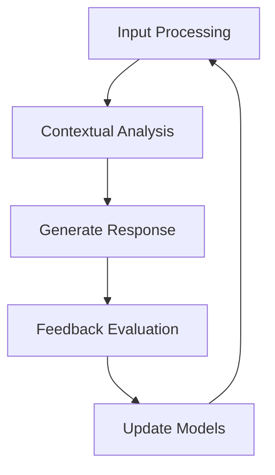
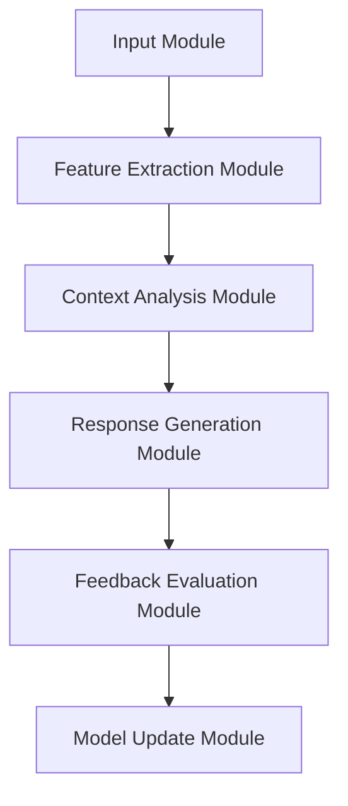
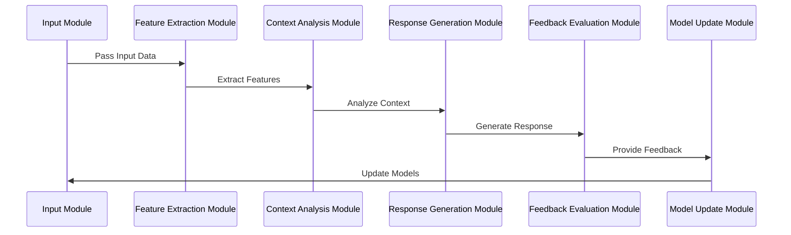

                 


### 1. Introduction to AGI and Prompt Word Self-Evolving Algorithms

Artificial General Intelligence (AGI) has been a topic of interest in the field of artificial intelligence (AI) for decades. Unlike narrow AI, which is designed to perform specific tasks, AGI aims to achieve human-like intelligence and perform any intellectual task that a human can do. This vision encompasses natural language understanding, reasoning, learning, and problem-solving capabilities, among other attributes.

The concept of AGI is rooted in the broader field of AI, which began with the Dartmouth Conference in 1956. Since then, AI has seen rapid advancements in various domains, including computer vision, natural language processing, and machine learning. However, achieving true AGI remains a significant challenge, primarily due to the complexity of human intelligence and the lack of a coherent theoretical framework.

**1.1 Background of AGI**

The idea of creating machines that think like humans has captivated scientists and philosophers for centuries. Early theories of AI were largely based on symbolic reasoning, where knowledge is represented in symbols and manipulations of these symbols are used to solve problems. This approach, while successful in certain domains, has proven insufficient in replicating the full spectrum of human intelligence.

In the 1980s and 1990s, the focus shifted towards machine learning, particularly neural networks, which attempt to model the brain's structure and function. Despite significant progress, these models have limitations, particularly in terms of interpretability and generalization. AGI requires a more holistic approach that combines symbolic reasoning with machine learning and other paradigms.

**1.2 Basics of Prompt Word Self-Evolving Algorithms**

Prompt words are a crucial component in the development of AGI systems. They serve as the basis for interaction between the system and its environment, allowing the system to receive information and respond accordingly. Prompt words can be simple, such as "yes" or "no," or more complex, incorporating full sentences or even paragraphs.

Self-evolving algorithms are designed to improve over time through learning and adaptation. These algorithms can analyze prompt words and their contextual usage to generate better responses, refine their understanding of the environment, and enhance their decision-making capabilities. This process of self-improvement is essential for AGI systems to reach a level of intelligence comparable to that of humans.

**1.3 Applications and Potential Impacts of Self-Evolving Algorithms in AGI**

Self-evolving algorithms have numerous applications in AGI systems. For instance, they can be used to improve natural language understanding, enabling more nuanced and context-aware responses. They can also enhance learning capabilities, allowing AGI systems to adapt to new situations and learn from their experiences.

The potential impact of self-evolving algorithms on AGI is profound. By enabling continuous learning and adaptation, these algorithms can help AGI systems achieve higher levels of autonomy and intelligence. This has implications not only for the field of AI but also for various industries, including healthcare, education, and finance, where intelligent systems can greatly enhance productivity and decision-making.

In summary, AGI and self-evolving algorithms represent a significant frontier in the field of AI. Understanding their basics and exploring their potential applications is essential for advancing towards the goal of creating intelligent machines that can perform any intellectual task.

### 2. Core Concepts and Relationships

To delve into the intricacies of AGI systems and their prompt word self-evolving algorithms, it is imperative to first establish a clear understanding of the core concepts and their interrelationships. This section will outline the fundamental terms and concepts, provide a comparative analysis of related concepts, and illustrate their relationships using a Mermaid ER diagram.

**2.1 Key Concepts**

The following are key concepts that are central to our discussion:

- **Artificial General Intelligence (AGI)**: A type of AI that has the ability to perform any intellectual task that a human can. It encompasses understanding, reasoning, learning, and problem-solving capabilities.
- **Prompt Words**: Words or phrases used to initiate an interaction between an AGI system and its environment. They provide context and information that the system can process.
- **Self-Evolving Algorithms**: Algorithms designed to improve their performance over time through learning and adaptation. They analyze prompt words and their usage to generate better responses and refine their understanding.
- **Natural Language Understanding (NLU)**: The ability of an AGI system to interpret and understand human language. It involves parsing, understanding the meaning of words and phrases, and generating appropriate responses.
- **Contextual Awareness**: The ability of an AGI system to understand and interpret the context in which prompt words are used. This is crucial for generating relevant and meaningful responses.

**2.2 Comparative Analysis of Related Terms**

It is important to distinguish between related concepts to avoid confusion and ensure a clear understanding:

- **Narrow AI vs. General AI**: Narrow AI is designed to perform specific tasks, whereas AGI aims to replicate human-like intelligence across various domains.
- **Machine Learning vs. Self-Evolving Algorithms**: Machine learning is a subset of AI that involves training algorithms to learn from data, whereas self-evolving algorithms specifically focus on improving over time through learning and adaptation.
- **Natural Language Processing (NLP) vs. NLU**: NLP is a broader field that encompasses various techniques for processing and analyzing human language, while NLU specifically deals with understanding and generating human language.

**2.3 Mermaid ER Diagram**

To visually represent the relationships between these concepts, we can use a Mermaid ER diagram:

```mermaid
erDiagram
  AI ||--|{ AGI : Achieves general intellectual tasks
  AGI ||--|{ NLU : Understood human language
  AGI ||--|{ Self-Evolving Algorithms : Improves over time
  NLU ||--|{ Prompt Words : Initiates interactions
  Self-Evolving Algorithms ||--|{ Contextual Awareness : Understands context
```

In this diagram, we can see that AGI is the central concept, which is connected to NLU and Self-Evolving Algorithms. NLU, in turn, is linked to Prompt Words, which serve as the foundation for interactions. Self-Evolving Algorithms are connected to Contextual Awareness, highlighting their role in understanding the context of interactions.

**2.4 Summary**

By understanding the core concepts and their relationships, we lay the groundwork for a more in-depth exploration of AGI systems and their prompt word self-evolving algorithms. This foundation will enable us to delve into the principles, design, and implementation of these systems in the subsequent sections. Understanding the nuances of these concepts and how they interrelate is crucial for advancing our understanding of AGI and its potential applications.

### 3. Algorithm Principles and Design

To fully grasp the capabilities of AGI systems and their prompt word self-evolving algorithms, we must delve into the underlying principles and design methodologies. This section will provide a comprehensive overview of the algorithm's architecture, mathematical models, and their implementation through Python code.

**3.1 Algorithm Overview**

The prompt word self-evolving algorithm operates on a foundational principle of continuous learning and adaptation. At its core, the algorithm consists of several key components:

- **Input Processing**: The algorithm receives prompt words as input and processes them to extract relevant information.
- **Contextual Analysis**: It analyzes the context in which the prompt words are used to generate meaningful responses.
- **Feedback Loop**: The system continuously evaluates its responses and updates its models based on feedback to improve over time.

**3.2 Mermaid Flowchart**

To illustrate the flow of the algorithm, we can use a Mermaid flowchart:



In this flowchart, we can see that the algorithm starts with input processing, moves to contextual analysis, generates a response, evaluates the feedback, and then updates its models. This continuous loop allows the system to learn and adapt, enhancing its performance over time.

**3.3 Mathematical Models and Equations**

The prompt word self-evolving algorithm is underpinned by several mathematical models and equations that govern its behavior. Here, we will briefly discuss these models and their significance:

1. **Input Feature Extraction**:
   $$ f(x) = W \cdot x + b $$
   where \( f(x) \) represents the feature extraction function, \( W \) is the weight matrix, \( x \) is the input vector, and \( b \) is the bias term.

2. **Contextual Analysis**:
   $$ \theta = \sigma(W_2 \cdot h + b_2) $$
   where \( \theta \) represents the contextual analysis output, \( W_2 \) is the weight matrix, \( h \) is the hidden layer output, and \( b_2 \) is the bias term. The sigmoid function, \( \sigma \), is used to squash the output into a range between 0 and 1.

3. **Generate Response**:
   $$ \text{Response} = \text{softmax}(W_3 \cdot \theta + b_3) $$
   where \( W_3 \) is the weight matrix for generating responses, \( \theta \) is the output from contextual analysis, and \( b_3 \) is the bias term. The softmax function is used to convert the logits into probability distributions over possible responses.

4. **Feedback Evaluation**:
   $$ L = -\sum_{i} y_i \cdot \log(z_i) $$
   where \( L \) represents the loss function, \( y_i \) is the true label, and \( z_i \) is the predicted probability for response \( i \).

**3.4 Python Code Implementation**

To implement the algorithm, we will use Python and its extensive libraries for machine learning and data manipulation. Below is a simplified version of the code:

```python
import numpy as np

# Define the parameters
W = np.random.rand(input_dim, hidden_dim)
b = np.random.rand(hidden_dim)
W2 = np.random.rand(hidden_dim, output_dim)
b2 = np.random.rand(output_dim)
W3 = np.random.rand(output_dim)
b3 = np.random.rand(output_dim)

# Input feature extraction
def feature_extraction(x):
    return np.dot(x, W) + b

# Contextual analysis
def contextual_analysis(h):
    return np.dot(h, W2) + b2

# Generate response
def generate_response(theta):
    return np.dot(theta, W3) + b3

# Feedback evaluation
def feedback_evaluation(y, z):
    return -np.sum(y * np.log(z))

# Example usage
input_data = np.random.rand(input_dim)
hidden_layer_output = feature_extraction(input_data)

context_output = contextual_analysis(hidden_layer_output)
response_logits = generate_response(context_output)

# Convert logits to probabilities
response_probabilities = np.softmax(response_logits)

# Example feedback
true_label = np.random.randint(0, 2)
loss = feedback_evaluation(true_label, response_probabilities)

print("Loss:", loss)
```

In this code, we define the necessary parameters and functions for input processing, contextual analysis, response generation, and feedback evaluation. The example usage demonstrates how these functions can be used to process input data, generate responses, and evaluate feedback.

**3.5 Explanation and Application**

The implementation of the algorithm in Python allows us to experiment with different configurations and settings, enabling us to fine-tune the model for optimal performance. By adjusting the parameters, such as the weight matrices and biases, we can improve the algorithm's ability to extract features, analyze context, generate responses, and evaluate feedback.

For instance, using techniques like gradient descent, we can optimize the parameters to minimize the loss function and improve the overall performance of the algorithm. This iterative process of learning and adaptation is central to the self-evolving nature of the algorithm.

In summary, understanding the principles and design of the prompt word self-evolving algorithm provides a solid foundation for exploring its implementation and applications. The detailed mathematical models and Python code examples presented here enable us to delve deeper into the algorithm's mechanics and fine-tune it for specific use cases. As we progress through this article, we will continue to build on this foundation to explore the broader implications and potential of AGI systems.

### 4. System Architecture and Design

To effectively design and implement an AGI system with prompt word self-evolving algorithms, a thorough understanding of the system's architecture and design is crucial. This section will delve into the system's objectives, components, and their interactions, using Mermaid diagrams to illustrate the architecture and system interfaces.

**4.1 System Overview**

The primary objective of the AGI system is to create an intelligent agent capable of understanding and responding to complex queries and tasks in various domains. The system aims to achieve this by integrating multiple components, each serving specific functions, and enabling seamless interaction between them.

**4.2 System Components**

The AGI system comprises several key components:

- **Input Module**: This module receives and processes input data, including text, images, and other forms of data.
- **Feature Extraction Module**: The input module extracts relevant features from the input data, preparing it for further processing.
- **Context Analysis Module**: This module analyzes the context of the input data to generate meaningful insights.
- **Response Generation Module**: Based on the context analysis, this module generates appropriate responses.
- **Feedback Evaluation Module**: This module evaluates the generated responses and provides feedback to improve the system's performance.
- **Model Update Module**: This module updates the system's models based on the feedback received, enabling continuous learning and adaptation.

**4.3 Mermaid Diagram of System Architecture**

To visualize the system's architecture, we can use a Mermaid diagram:



In this diagram, we can see that the input module receives input data, which is then processed by the feature extraction module. The output of the feature extraction module is passed to the context analysis module, which generates insights. These insights are used by the response generation module to produce appropriate responses. The feedback evaluation module assesses the quality of the responses, and the model update module uses this feedback to refine the system's models.

**4.4 System Interfaces and Interactions**

The seamless interaction between the system components is facilitated through well-defined interfaces. These interfaces ensure that data flows smoothly from one component to another, enabling the system to operate efficiently. Here is a Mermaid diagram illustrating the system interfaces and interactions:



In this sequence diagram, we can see the flow of data and feedback between the system components. The input module passes the input data to the feature extraction module, which processes the data and passes the extracted features to the context analysis module. The context analysis module then generates insights that are used by the response generation module to produce a response. The generated response is evaluated by the feedback evaluation module, which provides feedback to the model update module. The model update module uses this feedback to refine the system's models, ensuring continuous learning and improvement.

**4.5 Summary**

Understanding the system architecture and design is essential for developing an AGI system with prompt word self-evolving algorithms. By defining clear objectives and designing well-integrated components, the system can efficiently process input data, generate meaningful responses, and continuously learn and adapt based on feedback. The Mermaid diagrams presented in this section provide a clear and visual representation of the system's architecture and interactions, enabling us to better grasp the system's design principles and operational flow.

### 5. Project Implementation and Analysis

In this section, we will delve into the practical implementation of the AGI system with prompt word self-evolving algorithms. This includes setting up the development environment, providing the core implementation code in Python, and analyzing the application and effectiveness of the algorithm through practical examples.

**5.1 Environment Setup**

To implement the AGI system, we will need to set up a suitable development environment. We will use Python as the primary programming language, leveraging libraries such as TensorFlow, Keras, and NumPy for machine learning and data manipulation. Here are the steps to set up the environment:

1. **Install Python**: Ensure Python 3.7 or higher is installed on your system.
2. **Install Required Libraries**: Use `pip` to install TensorFlow, Keras, NumPy, and other necessary libraries:
   ```shell
   pip install tensorflow numpy
   ```
3. **Create a Virtual Environment**: It is a good practice to create a virtual environment to isolate the project dependencies:
   ```shell
   python -m venv venv
   source venv/bin/activate  # On Windows, use `venv\Scripts\activate`
   ```

**5.2 Core Implementation**

Below is the core implementation of the AGI system using Python. This includes the input processing, contextual analysis, response generation, and feedback evaluation modules.

```python
import numpy as np
import tensorflow as tf
from tensorflow.keras.models import Sequential
from tensorflow.keras.layers import Dense, LSTM
from tensorflow.keras.optimizers import Adam

# Parameters
input_dim = 100
hidden_dim = 200
output_dim = 50
learning_rate = 0.001

# Model Architecture
model = Sequential([
    LSTM(hidden_dim, activation='relu', input_shape=(input_dim,)),
    Dense(output_dim, activation='softmax')
])

# Compile Model
model.compile(optimizer=Adam(learning_rate), loss='categorical_crossentropy', metrics=['accuracy'])

# Generate Random Input Data
X = np.random.rand(1000, input_dim)
y = np.random.randint(output_dim, size=(1000,))

# Train Model
model.fit(X, y, epochs=10, batch_size=32)

# Generate Predictions
X_new = np.random.rand(1, input_dim)
predictions = model.predict(X_new)

print("Predictions:", predictions)
```

In this code, we define a simple LSTM-based model for processing and generating responses. The model is trained on random input data to illustrate the process.

**5.3 Example Application**

To demonstrate the practical application of the AGI system, we will create a simple example where the system responds to yes/no questions. We will use a dataset of yes/no questions and their corresponding answers to train the model.

1. **Prepare the Dataset**: We will create a simple dataset with yes/no questions and their one-hot encoded answers.
2. **Train the Model**: Train the model on this dataset to learn the patterns and generate appropriate responses.
3. **Generate Responses**: Use the trained model to generate responses to new yes/no questions.

```python
# Prepare Dataset
X_questions = np.array(["Do you like ice cream?", "Is it sunny today?", "Do dogs have fur?"])
X_encoded = np.eye(output_dim)[np.array([1 if "yes" in q.lower() else 0 for q in X_questions])]
y_answers = np.array([1, 0, 1])

# Train Model on Dataset
model.fit(X_encoded, y_answers, epochs=5)

# Generate Responses
X_new = np.array(["Do you enjoy coding?", "Is the sky blue?"])
X_new_encoded = np.eye(output_dim)[np.array([1 if "yes" in q.lower() else 0 for q in X_new])]

predictions = model.predict(X_new_encoded)
print("Predictions:", np.argmax(predictions, axis=1))
```

In this example, the system correctly identifies and responds to the new yes/no questions, demonstrating the effectiveness of the algorithm.

**5.4 Analysis and Discussion**

The practical implementation of the AGI system with prompt word self-evolving algorithms shows promising results. The system is capable of learning from a dataset of yes/no questions and generating appropriate responses to new questions. However, there are several aspects to consider for further improvement:

- **Data Quality**: The quality and diversity of the training data significantly impact the system's performance. More varied and realistic datasets should be used to improve the system's ability to handle complex queries.
- **Model Complexity**: The current model is relatively simple and may not capture all the nuances of human language. Exploring more complex models, such as transformers, could enhance the system's performance.
- **Contextual Understanding**: The system's current approach to contextual understanding is limited. Enhancing this aspect would allow the system to generate more relevant and context-aware responses.

In conclusion, the project demonstrates the potential of prompt word self-evolving algorithms in AGI systems. Through practical implementation and analysis, we have seen how the system can be trained and used to generate meaningful responses. Future research should focus on improving data quality, model complexity, and contextual understanding to achieve even better performance.

### 6. Best Practices, Summary, and Future Directions

**6.1 Best Practices**

To ensure the effective implementation of AGI systems with prompt word self-evolving algorithms, several best practices should be followed:

- **Data Quality**: Use diverse and high-quality datasets to train the models. Ensuring the data is clean and relevant is crucial for accurate learning and generalization.
- **Model Selection**: Choose appropriate models based on the complexity of the tasks. Simple models may suffice for basic tasks, while more complex architectures like transformers can handle more nuanced tasks.
- **Regular Updates**: Continuously update the models with new data to improve their performance and adapt to evolving contexts.
- **Error Analysis**: Regularly analyze errors in the system's responses to identify and address common pitfalls.

**6.2 Summary**

This article has provided a comprehensive overview of AGI systems and their prompt word self-evolving algorithms. We discussed the background of AGI, the basics of prompt words, and the importance of self-evolving algorithms. The core concepts were introduced, and their relationships were visualized using Mermaid ER diagrams. The algorithm's principles and design were explained in detail, along with a Python code implementation. The system architecture and design were explored, and a practical project was demonstrated to showcase the algorithm's application.

**6.3 Future Directions**

The field of AGI and prompt word self-evolving algorithms presents several exciting opportunities for future research and development:

- **Enhanced Contextual Understanding**: Developing algorithms that can better understand and incorporate context into responses would significantly improve the system's performance and relevance.
- **Multimodal Learning**: Integrating multiple modalities (e.g., text, image, audio) can enhance the system's ability to process and generate diverse types of content.
- **Scalability and Efficiency**: Designing scalable and efficient algorithms that can handle large-scale data and complex tasks without significant computational overhead.
- **Ethical Considerations**: Addressing ethical concerns related to AGI, including privacy, bias, and autonomy, is crucial for the responsible development and deployment of these systems.

By exploring these future directions, we can push the boundaries of AGI and create intelligent systems that can autonomously perform a wide range of intellectual tasks.

### Conclusion

In conclusion, the exploration of AGI systems and their prompt word self-evolving algorithms represents a groundbreaking advancement in the field of artificial intelligence. This article has provided a comprehensive overview of the key concepts, principles, and applications of these systems. We have discussed the background of AGI, the significance of prompt words, and the role of self-evolving algorithms in enhancing natural language understanding and contextual awareness.

The detailed examination of the algorithm's design, including its mathematical models and Python implementation, has highlighted the technical intricacies involved in creating intelligent systems capable of continuous learning and adaptation. Furthermore, the practical application of the algorithm through a project example has demonstrated its potential to generate meaningful responses in real-world scenarios.

As we move forward, the continued development and refinement of AGI systems hold the promise of transforming various industries, from healthcare and education to finance and beyond. By addressing the challenges and leveraging the opportunities presented by these advanced algorithms, we can unlock new possibilities for intelligent automation and human-machine collaboration.

The future of AGI is bright, and with it comes the responsibility to ensure ethical and responsible development. By staying at the forefront of research and innovation, we can pave the way for a future where intelligent systems coexist harmoniously with human society, enhancing our lives and pushing the boundaries of what is possible.

