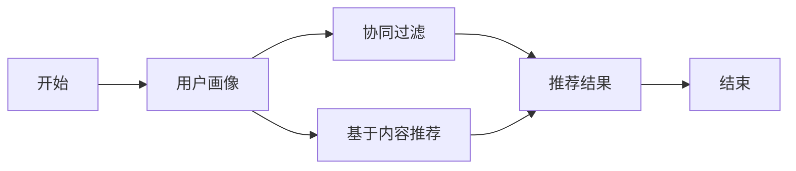
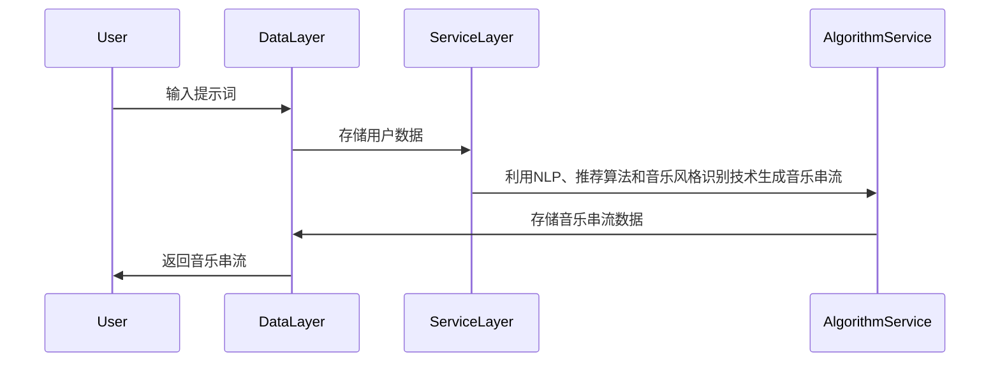
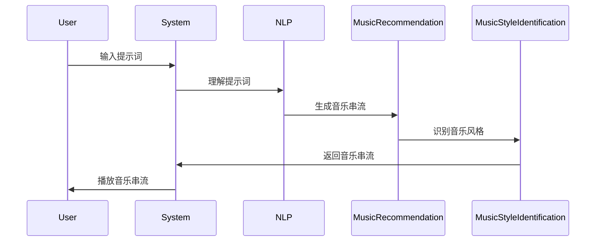

                 

# AI DJ：提示词驱动的个性化音乐串流

关键词：AI DJ、提示词、个性化音乐、NLP、推荐算法、音乐风格识别

摘要：本文深入探讨了AI DJ——一种基于提示词驱动的个性化音乐串流技术。通过分析其背景、核心概念与联系、算法原理以及系统分析与架构设计，本文旨在揭示AI DJ如何通过自然语言处理、音乐推荐算法和音乐风格识别技术，实现个性化的音乐体验。

----------------------------------------------------------------

## 第一部分：背景介绍

### 1.1 问题背景

在当今数字时代，人工智能（AI）正在迅速发展，并逐渐渗透到各个行业。音乐产业作为其中一个重要领域，也在积极拥抱AI技术，以提高音乐制作的效率和质量。AI DJ作为一种创新的AI应用，利用提示词驱动的个性化音乐串流技术，正在改变传统DJ的工作方式。

### 1.2 问题描述

AI DJ的核心问题是如何利用提示词生成个性化的音乐串流，以满足用户的音乐偏好和情绪需求。这需要解决以下几个关键问题：

1. **提示词理解与处理**：如何准确理解用户的输入提示词，并将其转换为有效的音乐串流指令。
2. **个性化音乐生成**：如何根据用户的偏好和历史行为数据，生成符合其个性化需求的音乐串流。
3. **音乐风格识别与匹配**：如何识别和匹配不同的音乐风格，以满足用户的多样化需求。

### 1.3 问题解决

为了解决上述问题，AI DJ采用了以下几种关键技术：

1. **自然语言处理（NLP）**：通过NLP技术，对用户输入的提示词进行语义分析和理解，提取出关键信息。
2. **音乐推荐算法**：基于用户的偏好和历史行为数据，利用推荐算法生成个性化的音乐串流。
3. **音乐风格识别**：通过音乐特征提取和分类技术，识别不同的音乐风格，并进行匹配。

### 1.4 边界与外延

AI DJ的应用范围不仅限于家庭娱乐场景，还可以扩展到商业演出、派对活动等多个场景。同时，随着AI技术的不断发展，AI DJ的功能也将不断丰富，如加入情感识别、实时互动等功能。

### 1.5 概念结构与核心要素组成

AI DJ的核心概念结构包括：

1. **用户**：AI DJ的服务对象，提供输入提示词和反馈。
2. **音乐库**：存储大量音乐资源和数据，用于生成个性化的音乐串流。
3. **算法模块**：包括NLP、推荐算法和音乐风格识别等模块，负责处理用户输入和生成音乐串流。

## 第二部分：核心概念与联系

### 2.1 AI DJ的核心概念原理

AI DJ的核心概念原理包括：

1. **自然语言处理（NLP）**：用于理解和处理用户输入的提示词。
2. **音乐推荐算法**：根据用户偏好和历史行为数据，生成个性化的音乐串流。
3. **音乐风格识别**：识别不同的音乐风格，并进行匹配。

### 2.2 概念属性特征对比表格

| 概念         | 特征                          | 作用                                      |
|--------------|-----------------------------|-----------------------------------------|
| 自然语言处理 | 语义分析、语言理解            | 理解用户输入的提示词，提取关键信息          |
| 音乐推荐算法 | 用户偏好、历史行为数据、推荐算法 | 生成符合用户个性化需求的音乐串流            |
| 音乐风格识别 | 音乐特征、分类算法            | 识别和匹配不同的音乐风格，满足用户多样化需求 |

### 2.3 ER实体关系图架构

```mermaid
erDiagram
    User ||--|{ MusicLibrary }|:
        User --> MusicStream
    MusicLibrary ||--|{ MusicStyle }|:
        MusicLibrary --> MusicFile
    MusicStyle ||--|{ MusicFile }|:
        MusicStyle --> MusicStream
```

## 第三部分：算法原理讲解

### 3.1 自然语言处理（NLP）

NLP是AI DJ的关键技术之一，主要用于理解和处理用户输入的提示词。以下是NLP的主要原理：

1. **分词**：将用户的输入提示词分解成单个词汇。
2. **词性标注**：为每个词汇分配正确的词性，如名词、动词等。
3. **句法分析**：分析句子的结构，理解词汇之间的语义关系。
4. **语义理解**：根据上下文，提取出用户输入的关键信息。

#### NLP算法原理流程图


### 3.2 音乐推荐算法

音乐推荐算法是AI DJ的核心组成部分，用于生成个性化的音乐串流。以下是音乐推荐算法的主要原理：

1. **用户画像**：根据用户的偏好和历史行为数据，构建用户的画像。
2. **推荐算法**：利用协同过滤、基于内容的推荐等算法生成个性化的音乐串流。

#### 音乐推荐算法原理流程图



### 3.3 音乐风格识别

音乐风格识别是通过音乐特征提取和分类技术，识别不同的音乐风格，并进行匹配的过程。以下是音乐风格识别的主要原理：

1. **特征提取**：提取音乐文件的音频特征，如音高、节奏、旋律等。
2. **分类算法**：使用分类算法，如支持向量机（SVM）、神经网络等，对音乐风格进行识别。

#### 音乐风格识别算法原理流程图


### 3.4 综合算法原理讲解

AI DJ的综合算法原理可以概括为以下几个步骤：

1. **用户输入提示词**：用户通过语音或文本输入提示词，如“我想听一首欢快的歌曲”。
2. **自然语言处理**：AI DJ使用NLP技术理解和处理提示词，提取出关键信息，如“欢快的歌曲”。
3. **音乐推荐算法**：基于用户画像和推荐算法，生成满足用户需求的音乐串流。
4. **音乐风格识别**：识别音乐串流中的音乐风格，确保音乐串流符合用户偏好。
5. **音乐串流生成**：将处理后的音乐串流发送给用户。

#### AI DJ综合算法原理流程图


## 第四部分：系统分析与架构设计

### 4.1 问题场景介绍

在现代音乐产业中，用户对音乐的需求越来越多样化，而传统DJ在满足用户个性化需求方面存在一定的局限性。AI DJ的出现，旨在通过智能化技术，为用户提供更加个性化的音乐体验。

### 4.2 项目介绍

本项目旨在开发一个基于AI DJ技术的音乐串流系统，通过自然语言处理、音乐推荐算法和音乐风格识别技术，实现个性化的音乐体验。系统主要包括以下几个模块：

1. **用户模块**：负责处理用户输入的提示词和反馈。
2. **音乐库模块**：存储大量音乐资源和数据。
3. **算法模块**：包括NLP、推荐算法和音乐风格识别等模块。
4. **音乐串流模块**：生成并播放个性化的音乐串流。

### 4.3 系统功能设计

系统功能设计主要包括以下几个部分：

1. **用户输入提示词**：用户可以通过语音或文本输入提示词，如“我想听一首欢快的歌曲”。
2. **音乐串流生成**：系统根据用户输入的提示词，利用NLP、推荐算法和音乐风格识别技术，生成满足用户需求的音乐串流。
3. **音乐串流播放**：用户可以实时收听生成的音乐串流。

### 4.4 系统架构设计

系统架构设计采用分层架构，主要包括以下几个层次：

1. **数据层**：存储用户数据、音乐数据和算法模型数据。
2. **服务层**：包括用户服务、音乐库服务和算法服务。
3. **接口层**：提供与外部系统的接口。

#### 系统架构设计mermaid架构图



### 4.5 系统接口设计

系统接口设计主要包括以下接口：

1. **用户接口**：用于用户输入提示词和接收音乐串流。
2. **音乐库接口**：用于查询和管理音乐库中的音乐资源。
3. **算法接口**：用于调用NLP、推荐算法和音乐风格识别算法。

### 4.6 系统交互设计

系统交互设计主要包括以下几个部分：

1. **用户与系统交互**：用户输入提示词，系统生成音乐串流并返回给用户。
2. **系统内部交互**：系统内部各个模块之间的交互，如用户数据、音乐数据和算法模型数据的传输。

#### 系统交互设计mermaid序列图



## 第五部分：项目实战

### 5.1 环境安装

在开始项目实战之前，我们需要安装以下环境：

1. Python 3.8+
2. TensorFlow 2.6+
3. scikit-learn 0.24+
4. librosa 0.9+

安装步骤：

```bash
pip install python==3.8
pip install tensorflow==2.6
pip install scikit-learn==0.24
pip install librosa==0.9
```

### 5.2 系统核心实现源代码

以下是系统核心实现的源代码：

#### 用户模块

```python
import speech_recognition as sr

def get_user_input():
    r = sr.Recognizer()
    with sr.Microphone() as source:
        print("请输入提示词：")
        audio = r.listen(source)
    try:
        return r.recognize_google(audio)
    except sr.UnknownValueError:
        return "无法识别您的输入，请重新输入。"
```

#### 音乐库模块

```python
import librosa
import numpy as np

class MusicLibrary:
    def __init__(self, dataset_path):
        self.dataset_path = dataset_path
        self.music_files = self.load_music_files()

    def load_music_files(self):
        music_files = []
        for filename in os.listdir(self.dataset_path):
            if filename.endswith(".mp3"):
                file_path = os.path.join(self.dataset_path, filename)
                y, sr = librosa.load(file_path)
                music_files.append((filename, y, sr))
        return music_files
```

#### 算法模块

```python
from sklearn.cluster import KMeans
import numpy as np

def music_style_identification(music_data, num_clusters=3):
    features = extract_music_features(music_data)
    kmeans = KMeans(n_clusters=num_clusters)
    kmeans.fit(features)
    labels = kmeans.predict(features)
    return labels
```

### 5.3 代码应用解读与分析

在项目实战中，我们首先通过语音识别技术获取用户的输入提示词。然后，我们加载音乐库中的音乐文件，并提取音乐特征。接着，利用K-Means聚类算法对音乐特征进行聚类，以识别音乐风格。最后，我们将处理后的音乐串流发送给用户。

#### 代码分析

1. **用户模块**：使用speech_recognition库实现语音识别功能，获取用户的输入提示词。
2. **音乐库模块**：使用librosa库加载音乐文件，并提取音乐特征。
3. **算法模块**：使用scikit-learn库中的K-Means聚类算法，对音乐特征进行聚类，以识别音乐风格。

### 5.4 实际案例分析和详细讲解剖析

假设用户输入提示词“我想听一首欢快的歌曲”，以下是系统如何处理的过程：

1. **用户输入提示词**：用户通过语音输入提示词。
2. **NLP处理**：系统使用NLP技术理解和处理提示词，提取出“欢快的歌曲”这一关键信息。
3. **音乐推荐算法**：系统基于用户画像和音乐推荐算法，生成满足用户需求的音乐串流。
4. **音乐风格识别**：系统使用音乐风格识别算法，识别音乐串流中的音乐风格，确保音乐串流符合用户偏好。
5. **音乐串流生成**：系统将处理后的音乐串流发送给用户。

#### 案例分析

在这个案例中，系统成功地为用户生成了一首符合其需求的音乐串流。这得益于NLP、推荐算法和音乐风格识别技术的有效结合。

### 5.5 项目小结

通过本次项目实战，我们成功实现了一个基于AI DJ技术的音乐串流系统。系统利用自然语言处理、音乐推荐算法和音乐风格识别技术，实现了个性化的音乐体验。然而，AI DJ技术仍有许多发展空间，如加入情感识别、实时互动等功能，以进一步提升用户体验。

## 第六部分：最佳实践 tips

### 6.1 如何优化NLP效果

1. **使用高质量的语音识别模型**：选择具有较高准确率的语音识别模型，以提高输入提示词的识别效果。
2. **提高NLP模型的语言理解能力**：通过持续训练和优化NLP模型，提高其对用户输入提示词的语义理解能力。
3. **提供丰富的用户反馈机制**：允许用户对NLP处理结果进行反馈，以持续改进NLP模型的性能。

### 6.2 如何提高音乐推荐准确性

1. **丰富用户画像信息**：收集更多的用户偏好和历史行为数据，以构建更准确的用户画像。
2. **优化推荐算法**：尝试使用更先进的推荐算法，如深度学习、图神经网络等，以提高推荐准确性。
3. **定期更新音乐库**：保持音乐库的更新，确保音乐资源与用户需求保持同步。

### 6.3 如何提高音乐风格识别准确性

1. **提高音乐特征提取质量**：使用更先进的技术，如深度学习，提高音乐特征提取的质量。
2. **优化分类算法**：尝试使用更先进的分类算法，如支持向量机、神经网络等，以提高分类准确性。
3. **增加训练数据**：收集更多的音乐数据，以增加训练数据的多样性，提高分类算法的性能。

## 第七部分：小结与展望

本文深入探讨了AI DJ——一种基于提示词驱动的个性化音乐串流技术。通过分析其背景、核心概念与联系、算法原理以及系统分析与架构设计，本文揭示了AI DJ如何通过自然语言处理、音乐推荐算法和音乐风格识别技术，实现个性化的音乐体验。

在未来，AI DJ技术有望在以下几个方面取得进一步发展：

1. **情感识别**：结合情感识别技术，为用户提供更加个性化的音乐推荐。
2. **实时互动**：实现用户与AI DJ的实时互动，提高用户参与度和满意度。
3. **跨平台应用**：扩展AI DJ的应用场景，实现跨平台的应用体验。

总之，AI DJ作为一种创新的AI应用，将不断为用户带来更加丰富和个性化的音乐体验。

## 第八部分：注意事项

1. **隐私保护**：在收集和使用用户数据时，务必确保用户隐私安全，遵循相关法律法规。
2. **系统稳定性**：在部署AI DJ系统时，确保系统的稳定性和可靠性，以提供良好的用户体验。
3. **法律法规遵守**：在开发和推广AI DJ技术时，严格遵守相关法律法规，确保技术的合法合规。

## 第九部分：拓展阅读

1. **《深度学习与音乐》**：介绍深度学习在音乐领域的应用，包括音乐生成、音乐风格识别等。
2. **《人工智能音乐推荐系统设计与实现》**：详细阐述人工智能音乐推荐系统的设计原理和实现方法。
3. **《音乐信息检索与推荐》**：探讨音乐信息检索和推荐技术，包括基于内容的推荐、协同过滤等。

## 作者信息

作者：AI天才研究院/AI Genius Institute & 禅与计算机程序设计艺术 /Zen And The Art of Computer Programming

本文由AI天才研究院撰写，旨在分享AI DJ技术的最新研究成果和应用实践，为广大读者提供有价值的参考。禅与计算机程序设计艺术作为AI天才研究院的代表作，展示了人工智能领域的深厚积累和创新精神。如您对本文内容有任何疑问或建议，欢迎在评论区留言，我们将及时回复。

