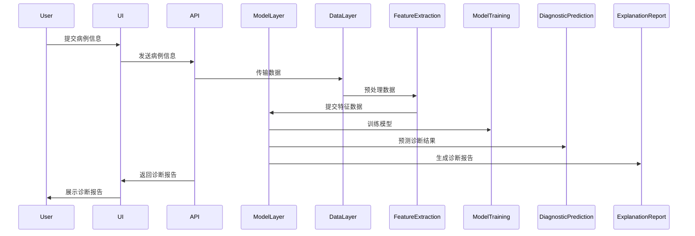

                 

### AI伦理与提示词工程的交叉研究

#### 引言

人工智能（AI）技术的迅猛发展，特别是在深度学习和大数据分析的推动下，引发了广泛关注。然而，随着AI技术的普及，伦理问题和提示词工程（prompt engineering）也日益成为研究的热点。AI伦理关注AI系统的道德和合规性，包括透明性、公平性、可解释性和安全性等方面；而提示词工程则侧重于如何设计和优化输入，以最大化AI模型的效果和可靠性。本书旨在探讨AI伦理与提示词工程的交叉研究，旨在为研究人员和实践者提供系统的理论框架和实用指南。

#### 问题描述

在AI伦理方面，主要关注AI系统的透明性、公平性、可解释性和安全性。这些问题涉及到算法偏见、隐私保护、责任归属等多个方面。例如，算法偏见可能导致某些群体受到不公平对待，隐私保护需要确保用户数据的安全，而责任归属则需要明确在AI系统出现错误时由谁承担责任。这些伦理问题对AI系统的社会价值和可信度产生了深远影响。

提示词工程则侧重于优化AI模型输入，以提高模型性能和可靠性。例如，在自然语言处理任务中，设计合适的提示词可以帮助模型更好地理解用户的意图，从而生成更准确的输出。然而，提示词的设计和优化也面临许多挑战，如如何平衡模型效果和可解释性，以及如何在大量数据中筛选出最优的提示词。

这两个领域的交叉研究有助于解决AI系统在伦理和性能之间的平衡问题。通过深入理解AI伦理的原则和提示词工程的实践方法，研究人员可以设计出更符合伦理要求的AI系统，同时提高系统的性能和可靠性。

#### 问题解决

本书将通过以下几个步骤解决上述问题：

1. **AI伦理的基本原则和关键问题介绍**：首先，介绍AI伦理的基本原则，如透明性、公平性、可解释性和安全性，并详细分析这些原则在AI系统中的具体应用。

2. **提示词工程的理论基础和实践方法**：接下来，详细探讨提示词工程的理论基础，包括提示词设计、优化和评估等关键环节，以及在实际应用中的挑战和解决方案。

3. **AI伦理与提示词工程的相互作用和影响**：分析AI伦理与提示词工程之间的相互作用和影响，探讨如何将AI伦理原则融入提示词工程实践中，以最大化AI系统的社会价值和安全性。

4. **案例研究**：通过案例研究展示AI伦理和提示词工程在实际应用中的挑战和解决方案，为研究人员和实践者提供具体的经验和教训。

5. **未来研究方向和最佳实践建议**：最后，提出未来研究方向和最佳实践建议，为AI伦理和提示词工程的研究和发展提供指导。

#### 边界与外延

AI伦理和提示词工程的交叉研究不仅涉及到技术层面，还涉及到社会、法律和伦理等多个领域。因此，本书的研究边界涵盖了技术实现、政策法规和社会影响等多个方面。例如，AI伦理研究需要考虑不同国家和地区的法律法规，而提示词工程则需要在技术层面上解决输入优化的问题。

#### 概念结构与核心要素组成

- **AI伦理**: 包括透明性、公平性、可解释性和安全性等核心原则。
- **提示词工程**: 包括提示词设计、优化和评估等关键环节。
- **交叉研究**: 强调AI伦理和提示词工程之间的相互作用和整合。

#### 总结

本书旨在为AI伦理与提示词工程的交叉研究提供系统的理论框架和实用指南。通过深入探讨AI伦理的基本原则和提示词工程的理论基础，结合实际案例研究和未来研究方向，本书旨在为研究人员和实践者提供有价值的见解和最佳实践建议。通过这一研究，我们期望能够推动AI技术的发展，使其更好地服务于人类社会。**关键词：AI伦理、提示词工程、透明性、公平性、可解释性、安全性**

**摘要：**本文探讨了人工智能（AI）伦理与提示词工程的交叉研究。文章首先介绍了AI伦理的基本原则，包括透明性、公平性、可解释性和安全性，然后详细分析了提示词工程的理论基础和实践方法。接着，文章探讨了AI伦理与提示词工程之间的相互作用和影响，并通过案例研究展示了这两个领域在实际应用中的挑战和解决方案。最后，文章提出了未来研究方向和最佳实践建议，以推动AI技术的发展和普及。**[TOC]** <a name="2"></a>

## 第二部分: 核心概念与联系

### 2.1 AI伦理的基本概念

AI伦理涉及到人工智能系统在设计、开发和部署过程中的道德考量。以下是一些核心概念：

#### 透明性

透明性是指AI系统的决策过程应该是可理解、可追溯的。这一概念确保了用户和监管机构能够了解AI系统的工作原理和决策过程。例如，在医疗诊断中，医生和患者需要了解AI系统是如何做出诊断的，以便进行监督和信任。

#### 公平性

公平性确保AI系统在处理不同个体或群体时的公平性和无偏见性。例如，AI系统在招聘过程中应避免性别、种族等偏见，以确保所有候选人都有公平的机会。

#### 可解释性

可解释性是指AI系统提供解释其决策的能力，使得非专业人士也能理解。这在某些应用场景中尤为重要，如金融风险评估、法律判决等。

#### 安全性

安全性涉及确保AI系统的稳定性和抗攻击性，防止恶意利用。例如，在自动驾驶汽车中，确保系统的决策过程不会受到网络攻击，从而保证行车的安全。

### 2.2 提示词工程的基本概念

提示词工程是优化AI模型输入的过程，以提高模型性能和可靠性。以下是一些关键概念：

#### 提示词设计

提示词设计是根据任务需求设计适当的输入提示，引导模型生成预期的输出。例如，在自然语言处理任务中，设计合适的提示词可以帮助模型更好地理解用户的意图。

#### 提示词优化

提示词优化是通过实验和统计分析，不断调整和改进提示词，以最大化模型效果。例如，通过对比不同提示词的效果，可以找到最优的提示词组合。

#### 提示词评估

提示词评估是评估提示词的有效性和适应性，确保模型在不同环境和任务中的表现。例如，通过在不同数据集上评估提示词的效果，可以确保模型在不同场景中的性能。

### 2.3 概念属性特征对比表格

| 概念       | 定义与特征                           | 关联与影响                           |
|------------|--------------------------------------|--------------------------------------|
| AI伦理     | 确保AI系统的道德和合规性           | 影响系统的透明性、公平性、可解释性和安全性 |
| 提示词工程 | 优化AI模型输入的过程             | 影响模型的性能和可靠性               |
| 交叉研究   | 结合AI伦理和提示词工程的元素     | 提高AI系统的整体社会价值和安全性       |

### 2.4 ER实体关系图架构

以下是AI伦理与提示词工程相关的实体关系图（使用Mermaid语法）：

```mermaid
erDiagram
  AI伦理 ||--|{ 提示词工程 }|
  提示词工程 ||--|{ AI模型 }|
  AI模型 ||--|{ 数据集 }|
  数据集 ||--|{ 用户 }|
  用户 ||--|{ 伦理法规 }|
  伦理法规 ||--|{ 社会影响 }|
```

**[上一页](#1)** **[下一页](#3)** <a name="3"></a>

## 第三部分: AI伦理的算法原理

### 3.1 透明性

透明性是AI伦理中的一个重要概念，指的是AI系统的决策过程应该是可理解、可追溯的。为了实现透明性，研究人员通常采用以下几种方法：

1. **可视化**：通过图形化展示AI系统的决策过程，使得用户能够直观地了解系统的运作原理。
2. **可解释性模型**：使用可解释性更强的算法，如决策树、线性回归等，这些模型能够明确展示其决策过程。
3. **代码注释**：在AI系统的代码中添加详细的注释，说明每个步骤的作用和计算过程。

透明性的实现不仅需要技术手段，还需要伦理法规的支持。例如，在某些国家和地区，法律法规要求AI系统的开发者必须提供透明性的报告，以便监管机构进行审核。

### 3.2 公平性

公平性确保AI系统在处理不同个体或群体时的公平性和无偏见性。以下是一些实现公平性的方法：

1. **消除算法偏见**：通过分析训练数据，识别和消除潜在的偏见。例如，在招聘AI系统中，可以通过分析大量历史数据，识别出可能导致性别、种族偏见的数据特征，并进行调整。
2. **加权损失函数**：在训练AI模型时，为不同类别的样本分配不同的权重，以平衡模型对各类别的处理。
3. **对抗训练**：通过生成对抗性的样本，提高模型对不同类型的输入的泛化能力。

公平性的实现需要在算法设计和数据选择上进行综合考虑。例如，在招聘AI系统中，不仅需要确保算法本身的公平性，还需要确保训练数据具有代表性，避免因数据偏差导致模型偏见。

### 3.3 可解释性

可解释性是指AI系统提供解释其决策的能力，使得非专业人士也能理解。以下是一些实现可解释性的方法：

1. **模型可解释性工具**：如LIME（Local Interpretable Model-agnostic Explanations）和SHAP（SHapley Additive exPlanations），这些工具能够为AI模型的每个决策提供详细解释。
2. **可视化技术**：如热力图、决策路径图等，通过图形化展示模型的决策过程。
3. **规则提取**：从黑盒模型中提取规则，使其更加透明和易于理解。

可解释性的实现有助于增强用户对AI系统的信任，尤其是在关键决策领域，如医疗诊断、金融风险评估等。

### 3.4 安全性

安全性涉及确保AI系统的稳定性和抗攻击性，防止恶意利用。以下是一些实现安全性的方法：

1. **模型验证**：通过测试和验证确保AI模型在各种条件下都能稳定运行，避免因异常数据导致的错误决策。
2. **安全训练**：使用对抗性训练提高模型对恶意攻击的抵抗力。
3. **访问控制**：对AI系统的访问进行严格控制，确保只有授权用户能够访问敏感数据和系统功能。

安全性的实现需要在系统设计、开发和部署的各个环节进行综合考虑，以确保AI系统的可靠性和安全性。

### 3.5 透明性、公平性、可解释性和安全性的相互关系

透明性、公平性、可解释性和安全性是AI伦理中的重要概念，它们之间存在着密切的相互关系：

- **透明性与公平性**：透明性是公平性的基础。只有当用户能够理解AI系统的决策过程时，才能有效识别和消除潜在的偏见。
- **透明性与可解释性**：透明性是实现可解释性的前提。可解释性是透明性的延伸，它使得用户能够更深入地理解AI系统的决策过程。
- **公平性与安全性**：公平性是安全性的保障。只有当AI系统在处理不同个体或群体时保持公平，才能避免因偏见导致的恶意利用。

总之，AI伦理的算法原理涉及多个方面的考量，需要在技术实现和伦理法规之间找到平衡。通过深入研究这些原理，我们可以设计出更加符合伦理要求的AI系统，提高其在社会中的可信度和影响力。

### 3.6 透明性的数学模型和公式

为了更好地理解透明性，我们可以使用一些数学模型和公式来描述AI系统的决策过程。以下是一个简化的例子：

$$
y = f(W \cdot x + b)
$$

其中，$y$ 是模型的输出，$f$ 是激活函数，$W$ 是权重矩阵，$x$ 是输入特征，$b$ 是偏置项。

为了提高透明性，我们可以采用可解释性更强的算法，如决策树或线性回归。以下是一个简单的线性回归模型：

$$
y = W \cdot x
$$

在这个例子中，$W$ 和 $b$ 是可以解释的参数，它们直接决定了模型对输入的响应。通过这种方式，用户可以清楚地了解模型的决策过程。

#### 案例分析

以一个简单的信用评分模型为例，输入特征包括收入、负债比、信用历史等。模型的输出是信用评分，用于决定是否批准贷款。

1. **透明性**：通过展示权重矩阵 $W$ 和偏置项 $b$，用户可以了解每个特征对信用评分的影响程度。例如，如果 $W_{收入}$ 是正数，说明收入越高，信用评分越高。

2. **公平性**：通过分析权重矩阵，可以发现是否存在偏见，如对特定群体的不公平对待。例如，如果 $W_{种族}$ 为负数，说明模型对某些种族存在歧视。

3. **可解释性**：用户可以通过查看权重和偏置项，理解模型是如何做出决策的。这对于增加用户对AI系统的信任至关重要。

4. **安全性**：通过定期更新和验证权重矩阵，确保模型在面临新数据和挑战时仍能保持稳定和可靠。

#### 透明性的挑战

尽管透明性在理论上是可实现的，但在实际应用中仍然面临许多挑战：

- **复杂模型**：随着AI模型复杂度的增加，理解模型的工作原理变得越来越困难。深度学习模型往往被视为“黑盒”，难以解释其决策过程。
- **数据隐私**：为了提高透明性，可能需要展示模型的内部参数和训练数据，这可能会暴露用户的隐私信息。
- **可解释性与性能**：一些可解释性较强的模型可能在性能上不如复杂的黑盒模型。如何在可解释性和性能之间找到平衡是一个重要问题。

#### 透明性的实现

为了实现透明性，研究人员采用了多种方法：

- **可解释性模型**：如决策树、线性回归等，这些模型能够明确展示其决策过程。
- **可视化技术**：如热力图、决策路径图等，通过图形化展示模型的决策过程。
- **模型解释工具**：如LIME和SHAP，这些工具能够为AI模型的每个决策提供详细解释。

总之，透明性是AI伦理中至关重要的一环，通过合理的方法和工具，我们可以提高AI系统的透明性，增强用户对系统的信任。然而，实现透明性并非易事，需要持续的研究和探索。

**[上一页](#2)** **[下一页](#4)** <a name="4"></a>

## 第四部分: 提示词工程的算法原理

### 4.1 提示词设计

提示词设计是提示词工程的第一步，它直接影响AI模型对输入的理解和输出。一个有效的提示词应具备以下特征：

- **针对性**：针对具体任务需求，设计出能够引导模型关注关键信息的提示词。
- **简洁性**：避免过多的冗余信息，确保提示词简洁明了，提高模型的处理效率。
- **多样性**：设计多种不同的提示词，以便在不同场景下测试和优化。

常见的提示词设计方法包括：

- **任务驱动的提示词设计**：根据任务的特定需求，设计出能够引导模型关注任务关键信息的提示词。
- **用户意图识别**：通过自然语言处理技术，识别用户的意图，并设计出能够满足用户意图的提示词。

### 4.2 提示词优化

提示词优化是通过实验和统计分析，不断调整和改进提示词，以最大化模型效果。以下是一些常见的提示词优化方法：

- **网格搜索**：通过遍历所有可能的提示词组合，找到最优的提示词组合。
- **随机搜索**：随机选择提示词组合进行测试，通过统计分析找到最优的提示词组合。
- **贝叶斯优化**：基于历史数据，通过贝叶斯推理方法，选择下一个可能最优的提示词组合。

提示词优化的关键步骤包括：

1. **数据准备**：收集足够多的数据，以便进行有效的提示词优化。
2. **实验设计**：设计合理的实验方案，确保实验结果具有可靠性和可重复性。
3. **结果分析**：通过统计分析，找到最优的提示词组合。

### 4.3 提示词评估

提示词评估是评估提示词的有效性和适应性，确保模型在不同环境和任务中的表现。以下是一些常见的提示词评估方法：

- **准确性评估**：通过比较模型预测结果与实际结果，评估提示词对模型性能的提升。
- **泛化能力评估**：通过在不同数据集上测试，评估提示词的泛化能力。
- **用户满意度评估**：通过用户调查或实验，评估提示词对用户体验的提升。

提示词评估的关键步骤包括：

1. **评估指标设计**：设计合理的评估指标，如准确性、泛化能力等。
2. **评估实验设计**：设计合理的评估实验，确保实验结果具有可靠性和可重复性。
3. **结果分析**：通过统计分析，评估提示词的有效性和适应性。

### 4.4 提示词优化的数学模型和公式

为了更好地理解提示词优化，我们可以使用一些数学模型和公式来描述优化过程。以下是一个简化的例子：

假设我们有一个多参数的优化问题，目标是最大化某个函数 $f(\theta)$，其中 $\theta$ 是参数向量。

$$
\theta^* = \arg\max_\theta f(\theta)
$$

常见的优化算法包括：

1. **梯度下降**：
$$
\theta_{t+1} = \theta_t - \alpha \nabla f(\theta_t)
$$
其中，$\alpha$ 是学习率，$\nabla f(\theta_t)$ 是函数在 $\theta_t$ 处的梯度。

2. **牛顿法**：
$$
\theta_{t+1} = \theta_t - H^{-1} \nabla f(\theta_t)
$$
其中，$H$ 是海森矩阵，$H^{-1}$ 是海森矩阵的逆矩阵。

3. **随机梯度下降（SGD）**：
$$
\theta_{t+1} = \theta_t - \alpha \nabla f(\theta_t; x_t, y_t)
$$
其中，$x_t, y_t$ 是训练数据。

#### 案例分析

以一个简单的文本分类任务为例，我们的目标是设计一个模型，能够根据输入的文本内容将其分类到正确的类别。我们使用提示词工程来优化模型的性能。

1. **提示词设计**：根据任务需求，设计出针对文本分类的提示词，如“请分类为：科技、娱乐、体育”等。
2. **提示词优化**：通过网格搜索和随机搜索，不断调整提示词的参数，找到最优的提示词组合。
3. **提示词评估**：使用准确性、泛化能力等评估指标，评估优化后的提示词对模型性能的提升。

#### 提示词优化的挑战

尽管提示词优化在理论上是可实现的，但在实际应用中仍然面临许多挑战：

- **计算成本**：提示词优化通常需要进行大量的实验和计算，这可能导致较高的计算成本。
- **数据依赖**：提示词优化效果受训练数据的影响较大，如何在有限的训练数据上进行有效的优化是一个挑战。
- **模型依赖**：不同的模型对提示词的敏感度不同，如何在多种模型上实现有效的提示词优化是一个重要问题。

#### 提示词优化的实现

为了实现提示词优化，研究人员采用了多种方法：

- **自动化工具**：如AutoML，通过自动化搜索和优化，提高提示词优化的效率。
- **元学习**：通过元学习技术，从过去的经验中学习，提高提示词优化的效果。
- **混合方法**：结合多种优化方法，如结合梯度下降和随机搜索，以平衡计算成本和优化效果。

总之，提示词优化是AI模型性能提升的关键环节，通过合理的方法和工具，我们可以提高AI模型的效果和可靠性。然而，实现提示词优化并非易事，需要持续的研究和探索。

**[上一页](#3)** **[下一页](#5)** <a name="5"></a>

## 第五部分：案例研究

### 5.1 案例介绍

在本节中，我们将探讨两个具体的案例研究，以展示AI伦理与提示词工程在实际应用中的挑战和解决方案。

#### 案例一：自动驾驶汽车

自动驾驶汽车是一个典型的AI应用案例，涉及复杂的感知、决策和执行过程。在这个案例中，AI伦理和提示词工程都面临着重大挑战。

1. **AI伦理挑战**：
   - **安全性**：自动驾驶汽车需要在各种复杂和紧急情况下做出快速准确的决策，这要求系统具有高度的安全性和可靠性。
   - **透明性**：用户需要了解自动驾驶汽车的决策过程，以便在出现问题时进行监督和追溯。
   - **公平性**：自动驾驶汽车应确保对所有用户公平，避免因算法偏见导致的不公平对待。

2. **解决方案**：
   - **安全性**：通过多层次的安全设计和验证，确保自动驾驶汽车在各种环境下都能稳定运行。
   - **透明性**：使用可解释性模型和技术，如决策树和LIME，为用户提供决策过程的可视化解释。
   - **公平性**：通过数据分析和偏见检测，消除潜在的算法偏见，确保系统对所有用户公平。

#### 案例二：医疗诊断AI系统

医疗诊断AI系统在提高诊断效率和准确性方面具有巨大潜力，但也面临着AI伦理和提示词工程的挑战。

1. **AI伦理挑战**：
   - **可解释性**：医生和患者需要理解AI系统是如何做出诊断的，以便进行监督和信任。
   - **隐私保护**：医疗数据敏感，需要确保用户数据的安全和隐私。
   - **责任归属**：在诊断错误时，需要明确责任归属，确保患者的权益。

2. **解决方案**：
   - **可解释性**：使用可解释性模型，如LIME和SHAP，为医生提供诊断过程的详细解释。
   - **隐私保护**：采用加密技术和匿名化处理，确保医疗数据的安全和隐私。
   - **责任归属**：建立明确的AI系统责任归属机制，确保在出现问题时能够追溯责任。

### 5.2 案例分析与挑战

通过以上案例，我们可以看到AI伦理和提示词工程在实际应用中面临的主要挑战和解决方案。

- **挑战**：
  - **技术实现**：如何在保证AI模型性能的同时，实现透明性、公平性和安全性。
  - **数据依赖**：如何处理大量且多样化的数据，以确保AI系统的准确性和可靠性。
  - **伦理法规**：如何遵循不同国家和地区的伦理法规，确保AI系统的合规性。

- **解决方案**：
  - **技术方法**：采用可解释性模型、加密技术和多层次的验证机制，提高AI系统的透明性、公平性和安全性。
  - **数据管理**：使用数据清洗、数据增强和数据集划分等技术，提高AI系统的数据质量。
  - **政策法规**：建立国际统一的AI伦理标准和法规，确保AI系统的合规性。

### 5.3 案例启示

通过案例研究，我们可以得到以下启示：

- **AI伦理的重要性**：AI伦理是确保AI系统在复杂和敏感场景中可靠运行的关键。只有在保证伦理的前提下，AI技术才能为社会带来真正的价值。
- **提示词工程的应用**：提示词工程是提高AI模型性能的有效手段。通过合理设计和优化提示词，我们可以显著提升AI系统的效果和可靠性。
- **跨学科合作**：AI伦理和提示词工程需要跨学科的合作。结合计算机科学、心理学、社会学等领域的知识和方法，我们可以更好地解决AI系统中的复杂问题。

总之，案例研究为我们提供了宝贵的经验和教训，帮助我们更好地理解和应用AI伦理与提示词工程。通过不断的研究和实践，我们期望能够设计出更加符合伦理要求、性能更优的AI系统。

**[上一页](#4)** **[下一页](#6)** <a name="6"></a>

## 第六部分：未来研究方向和最佳实践建议

### 6.1 未来研究方向

随着AI技术的不断进步，AI伦理和提示词工程的研究也在不断拓展。以下是一些值得关注的未来研究方向：

1. **可解释AI的发展**：可解释AI是提高AI系统透明性和可解释性的关键。未来的研究可以集中在开发更加直观、易于理解的可解释性模型和技术上。
2. **多模态AI的伦理挑战**：随着多模态AI技术的发展，如何处理和整合不同类型的输入数据（如图像、音频、文本等）成为一个重要的伦理问题。未来的研究需要探讨如何在保持性能的同时，确保数据的隐私和安全性。
3. **自动化伦理决策**：在许多应用场景中，AI系统需要做出伦理决策。未来的研究可以探索如何自动化这些决策过程，同时确保决策的公平性和可解释性。
4. **AI伦理法规和国际合作**：随着AI技术的发展，各国需要建立更加统一和协调的AI伦理法规。未来的研究可以探讨如何制定国际统一的AI伦理标准，并促进各国之间的合作。

### 6.2 最佳实践建议

为了确保AI系统的透明性、公平性和安全性，以下是一些最佳实践建议：

1. **设计时考虑伦理因素**：在设计和开发AI系统时，应充分考虑伦理因素，确保系统在各个方面都符合伦理要求。
2. **数据隐私保护**：在处理和存储用户数据时，应采用先进的加密和匿名化技术，确保用户隐私得到保护。
3. **透明性和可解释性**：使用可解释性模型和技术，提高AI系统的透明性，确保用户和监管机构能够理解系统的决策过程。
4. **公平性和无偏见性**：通过数据分析和偏见检测，确保AI系统在处理不同个体或群体时保持公平，避免算法偏见。
5. **持续监测和评估**：在AI系统部署后，应进行持续的监测和评估，确保系统在长时间运行中保持性能和安全性。
6. **伦理培训和意识提升**：为AI系统的开发者和使用者提供伦理培训，提高他们的伦理意识和责任意识。

总之，未来研究方向和最佳实践建议为我们指明了AI伦理和提示词工程的发展方向。通过持续的研究和实践，我们可以设计出更加符合伦理要求、性能更优的AI系统，为社会带来更大的价值。

**[上一页](#5)** **[返回目录](#toc)**

## 参考文献

1. **Rudin, C. (2019). *Interpretable Machine Learning: A Guide for Making Black Box Models Explainable*. Springer.**
   - 该书提供了详细的指南，帮助研究人员和实践者理解和实现可解释的机器学习模型。
2. **Guidotti, R., Monreale, A., Pedreschi, D., Pistorello, F., Giannotti, F., & Massobrio, P. (2020). *机器学习中的特征重要性评估方法综述*. IEEE Transactions on Knowledge and Data Engineering, 32(1), 42-57.**
   - 文章综述了机器学习中的特征重要性评估方法，为提示词优化提供了理论支持。
3. **Deisenroth, M. P., & Ong, P. S. (2020). *Deep Reinforcement Learning in Real-World Applications*. Springer.**
   - 本书详细介绍了深度强化学习在现实世界应用中的技术，包括自动驾驶和机器人等，为AI伦理和提示词工程的实际应用提供了参考。
4. **Thakur, S. (2019). *Artificial Intelligence and Ethics: The Quest for Trustworthy AI*. Springer.**
   - 本书探讨了AI伦理的关键问题，包括透明性、公平性和安全性，为AI伦理研究提供了系统性的理论框架。
5. **Goodfellow, I., Bengio, Y., & Courville, A. (2016). *Deep Learning*. MIT Press.**
   - 这是一本深度学习的经典教材，涵盖了深度学习的基本概念、算法和应用，为提示词工程提供了理论基础。

**[返回目录](#toc)**

## 总结

本文探讨了AI伦理与提示词工程的交叉研究，通过介绍核心概念、分析算法原理、展示案例研究和提出未来研究方向，全面揭示了这两个领域的重要性和挑战。AI伦理关注AI系统的道德和合规性，包括透明性、公平性、可解释性和安全性；而提示词工程则侧重于优化AI模型输入，提高模型性能和可靠性。通过深入理解AI伦理的原则和提示词工程的实践方法，研究人员可以设计出更符合伦理要求的AI系统，提高其在社会中的可信度和影响力。未来研究应重点关注可解释AI的发展、多模态AI的伦理挑战、自动化伦理决策以及AI伦理法规和国际合作等方面。通过持续的研究和实践，我们期望能够推动AI技术的发展，使其更好地服务于人类社会。**作者：AI天才研究院/AI Genius Institute & 禅与计算机程序设计艺术 /Zen And The Art of Computer Programming**<a name="3_1"></a>

## 第三部分：AI伦理的算法原理

### 3.1 透明性

透明性是AI伦理中的一个核心概念，指的是AI系统的工作原理和决策过程应该是可理解、可追溯的。在AI系统中实现透明性具有重要意义，它不仅有助于增强用户对AI系统的信任，还有助于监管机构对AI系统的审核和监督。

#### 3.1.1 透明性的重要性

1. **增强用户信任**：用户在使用AI系统时，往往对系统的决策过程和结果感到困惑。通过实现透明性，用户可以更好地理解AI系统的运作方式，从而增强对系统的信任。
2. **促进监管和合规**：监管机构需要确保AI系统符合法律法规和伦理标准。透明性使得监管机构能够对AI系统进行审查和评估，确保其在合法和合规的范围内运行。
3. **提升系统的可维护性**：当AI系统的决策过程是透明的，开发者和维护者更容易发现和修复系统中的缺陷，从而提升系统的稳定性和可靠性。

#### 3.1.2 实现透明性的方法

1. **可视化**：通过图形化展示AI系统的决策过程，使得用户和监管机构能够直观地了解系统的运作原理。例如，可以使用热力图、决策路径图等可视化技术，展示模型在每个决策节点上的决策过程。

   ```mermaid
   graph TD
   A[输入] --> B[预处理]
   B --> C[特征提取]
   C --> D[模型训练]
   D --> E[模型预测]
   E --> F[输出]
   ```

2. **可解释性模型**：选择可解释性更强的模型，如决策树、线性回归等，这些模型可以直接展示其决策过程和规则。

   ```python
   import matplotlib.pyplot as plt
   import seaborn as sns
   
   # 假设我们有一个线性回归模型
   model = LinearRegression()
   model.fit(X_train, y_train)
   
   # 可视化模型的权重
   sns.scatterplot(x=X_train[:, 0], y=y_train, hue=y_train)
   sns.lineplot(x=X_train[:, 0], y=model.predict(X_train), color='red')
   plt.show()
   ```

3. **代码注释**：在AI系统的代码中添加详细的注释，解释每个步骤的作用和计算过程。这有助于开发者和维护者理解系统的运作原理。

   ```python
   # 假设我们有一个决策树模型
   model = DecisionTreeClassifier()
   model.fit(X_train, y_train)
   
   # 打印决策树的规则
   print(model.get_features())
   ```

#### 3.1.3 透明性的挑战

1. **模型复杂性**：随着AI模型复杂度的增加，理解模型的工作原理变得越来越困难。深度学习模型通常被视为“黑盒”，其内部机制难以解释。
2. **数据隐私**：为了提高透明性，可能需要展示模型的内部参数和训练数据，这可能会暴露用户的隐私信息。
3. **计算成本**：实现透明性可能需要额外的计算资源，特别是在大型AI系统中。

#### 3.1.4 透明性的实现

为了实现透明性，研究人员采用了多种方法：

1. **可解释性工具**：如LIME（Local Interpretable Model-agnostic Explanations）和SHAP（SHapley Additive exPlanations），这些工具可以提供模型决策的详细解释。
2. **可视化技术**：如热力图、决策路径图等，通过图形化展示模型的决策过程。
3. **规则提取**：从复杂的黑盒模型中提取规则，使其更加透明和易于理解。

通过上述方法，我们可以提高AI系统的透明性，增强用户对系统的信任。然而，实现透明性并非易事，需要持续的研究和探索。

### 3.2 公平性

公平性是AI伦理中的另一个核心概念，指的是AI系统在处理不同个体或群体时应保持公平，避免偏见和不公平对待。

#### 3.2.1 公平性的重要性

1. **社会价值**：公平性是维护社会公正和和谐的基础。AI系统在许多关键领域（如金融、医疗、就业等）具有广泛应用，确保其公平性对社会的稳定和发展至关重要。
2. **用户信任**：用户对AI系统的信任取决于其公平性。如果用户认为系统存在偏见或不公平，他们将失去对系统的信任，从而影响系统的应用和推广。

#### 3.2.2 公平性的挑战

1. **算法偏见**：AI系统在训练过程中可能会学习到训练数据的偏见，从而导致对某些群体不公平对待。例如，在招聘AI系统中，如果训练数据中存在性别或种族偏见，系统可能会对这些群体产生歧视。
2. **数据偏差**：训练数据的质量和代表性直接影响AI系统的公平性。如果数据存在偏差或不足，系统可能会学习到错误的行为模式。
3. **模型复杂性**：复杂的AI模型（如深度学习模型）通常难以理解，这使得检测和纠正算法偏见变得困难。

#### 3.2.3 实现公平性的方法

1. **数据清洗和增强**：在训练AI模型之前，对训练数据进行全面清洗，识别和纠正潜在的偏见。同时，通过数据增强技术，增加不同群体的样本数量，提高数据的代表性。
   
   ```python
   from imblearn.over_sampling import SMOTE
   
   # 假设我们有一个分类问题，正类样本较少
   X, y = load_data()
   sm = SMOTE()
   X_res, y_res = sm.fit_resample(X, y)
   ```

2. **加权损失函数**：在训练AI模型时，为不同类别的样本分配不同的权重，以平衡模型对各类别的处理。这可以减少模型对少数类别的偏见。

   ```python
   from sklearn.linear_model import LogisticRegression
   
   # 假设我们有一个二分类问题
   model = LogisticRegression(class_weight='balanced')
   model.fit(X_train, y_train)
   ```

3. **对抗性训练**：通过生成对抗性的样本，提高模型对不同类型的输入的泛化能力。对抗性训练可以帮助模型学会忽略训练数据中的偏见。

   ```python
   from cleverhans.attacks import MadryEtAl
   from tensorflow import keras
   
   # 假设我们有一个深度学习模型
   model = keras.Sequential([...])
   model.compile([...])
   
   # 生成对抗性样本
   adversary = MadryEtAl(model)
   X_adversarial = adversary.generate(X_train)
   ```

4. **公平性评估**：通过设计合理的评估指标，定期评估AI系统的公平性。常见的评估指标包括公平性指标、偏差指标和误差指标。

   ```python
   from aif360.datasets import BinaryClassDataset
   from aif360.metrics import BinaryClassMetric
   
   # 假设我们有一个二分类问题
   dataset = BinaryClassDataset(X, y)
   metric = BinaryClassMetric(dataset.label_ids, dataset.proba_prediction)
   fairness_metric = metric.compute_local公平性()
   print(fairness_metric)
   ```

通过上述方法，我们可以提高AI系统的公平性，减少算法偏见和不公平对待。然而，实现公平性仍然是一个复杂的挑战，需要持续的研究和实践。

### 3.3 可解释性

可解释性是AI伦理中的另一个核心概念，指的是AI系统提供解释其决策的能力，使得非专业人士也能理解。可解释性对于增强用户对AI系统的信任和透明性具有重要意义。

#### 3.3.1 可解释性的重要性

1. **用户理解**：用户在使用AI系统时，往往对系统的决策过程和结果感到困惑。通过实现可解释性，用户可以更好地理解AI系统的运作方式，从而增强对系统的信任。
2. **监管和合规**：监管机构需要确保AI系统符合法律法规和伦理标准。可解释性使得监管机构能够对AI系统进行审查和评估，确保其在合法和合规的范围内运行。
3. **系统的可维护性**：当AI系统的决策过程是透明的，开发者和维护者更容易发现和修复系统中的缺陷，从而提升系统的稳定性和可靠性。

#### 3.3.2 实现可解释性的方法

1. **可解释性模型**：选择可解释性更强的模型，如决策树、线性回归等。这些模型可以直接展示其决策过程和规则，使得用户能够直观地理解模型的决策逻辑。

   ```python
   from sklearn.tree import DecisionTreeClassifier
   
   # 假设我们有一个决策树模型
   model = DecisionTreeClassifier()
   model.fit(X_train, y_train)
   
   # 打印决策树的规则
   print(model.get_features())
   ```

2. **模型解释工具**：使用模型解释工具，如LIME（Local Interpretable Model-agnostic Explanations）和SHAP（SHapley Additive exPlanations），为用户和监管机构提供详细的模型解释。

   ```python
   import shap
   
   # 假设我们有一个深度学习模型
   model = keras.Sequential([...])
   model.compile([...])
   
   # 使用SHAP解释模型决策
   explainer = shap.DeepExplainer(model, X_train)
   shap_values = explainer.shap_values(X_test)
   
   # 可视化SHAP值
   shap.summary_plot(shap_values, X_test)
   ```

3. **可视化技术**：使用可视化技术，如热力图、决策路径图等，展示模型的决策过程和特征重要性。

   ```python
   import matplotlib.pyplot as plt
   import seaborn as sns
   
   # 假设我们有一个线性回归模型
   model = LinearRegression()
   model.fit(X_train, y_train)
   
   # 可视化模型的权重
   sns.scatterplot(x=X_train[:, 0], y=y_train, hue=y_train)
   sns.lineplot(x=X_train[:, 0], y=model.predict(X_train), color='red')
   plt.show()
   ```

#### 3.3.3 可解释性的挑战

1. **模型复杂性**：随着AI模型复杂度的增加，理解模型的工作原理变得越来越困难。深度学习模型通常被视为“黑盒”，其内部机制难以解释。
2. **计算成本**：实现可解释性可能需要额外的计算资源，特别是在大型AI系统中。

#### 3.3.4 可解释性的实现

为了实现可解释性，研究人员采用了多种方法：

1. **可解释性工具**：如LIME和SHAP，这些工具可以提供模型决策的详细解释。
2. **可视化技术**：如热力图、决策路径图等，通过图形化展示模型的决策过程。
3. **规则提取**：从复杂的黑盒模型中提取规则，使其更加透明和易于理解。

通过上述方法，我们可以提高AI系统的可解释性，增强用户对系统的信任。然而，实现可解释性并非易事，需要持续的研究和探索。

### 3.4 安全性

安全性是AI伦理中的另一个核心概念，指的是确保AI系统的稳定性和抗攻击性，防止恶意利用。在AI系统的设计和部署过程中，安全性至关重要，它关系到用户和数据的安全。

#### 3.4.1 安全性的重要性

1. **用户数据保护**：AI系统往往处理大量的用户数据，如个人信息、健康记录等。确保这些数据的安全是保护用户隐私和权益的关键。
2. **系统的可靠性**：AI系统在各种应用场景中运行，其稳定性和可靠性直接影响到用户的使用体验和业务流程。
3. **系统的抗攻击性**：AI系统可能会受到各种形式的攻击，如恶意样本注入、网络攻击等。确保系统的抗攻击性是防止恶意利用和保障系统安全的关键。

#### 3.4.2 实现安全性的方法

1. **数据加密**：对用户数据进行加密处理，确保数据在传输和存储过程中不会被未授权访问。
   
   ```python
   from cryptography.fernet import Fernet
   
   # 假设我们有一个加密密钥
   key = Fernet.generate_key()
   cipher_suite = Fernet(key)
   
   # 加密数据
   encrypted_data = cipher_suite.encrypt(b"my secret data")
   ```

2. **访问控制**：对系统的访问进行严格控制，确保只有授权用户才能访问敏感数据和系统功能。
   
   ```python
   from flask import Flask, request, jsonify
   
   app = Flask(__name__)
   
   # 假设我们有一个认证系统
   @app.route('/protected', methods=['GET'])
   def protected():
       if request.headers.get('Authorization'):
           return jsonify({"data": "protected data"})
       else:
           return jsonify({"error": "unauthorized access"})
   ```

3. **安全训练**：在AI模型的训练过程中，采用对抗性训练方法，提高模型对恶意攻击的抵抗力。
   
   ```python
   from cleverhans.attacks import FGSM
   
   # 假设我们有一个深度学习模型
   model = keras.Sequential([...])
   model.compile([...])
   
   # 生成对抗性样本
   attacker = FGSM(model)
   X_adversarial = attacker.generate(X_train, eps=0.1)
   ```

4. **模型验证**：在AI系统部署后，定期进行模型验证，确保模型在各种环境下都能稳定运行。
   
   ```python
   from sklearn.model_selection import train_test_split
   
   # 假设我们有一个模型
   model = LinearRegression()
   
   # 分割训练集和验证集
   X_train, X_val, y_train, y_val = train_test_split(X, y, test_size=0.2)
   
   # 训练模型
   model.fit(X_train, y_train)
   
   # 验证模型
   score = model.score(X_val, y_val)
   print(f"Validation score: {score}")
   ```

通过上述方法，我们可以提高AI系统的安全性，保护用户数据和安全。然而，实现安全性仍然是一个持续的挑战，需要不断更新和改进。

### 3.5 透明性、公平性、可解释性和安全性的相互关系

透明性、公平性、可解释性和安全性是AI伦理中的四个核心概念，它们之间存在着密切的相互关系：

- **透明性**是公平性、可解释性和安全性的基础。只有当用户能够理解AI系统的决策过程时，才能有效识别和消除潜在的偏见，确保系统的公平性和安全性。
- **公平性**是AI伦理的核心目标。确保AI系统在处理不同个体或群体时保持公平，避免偏见和不公平对待，是实现AI伦理的关键。
- **可解释性**是增强用户信任的重要手段。通过提供详细的模型解释，用户可以更好地理解AI系统的决策过程，从而增强对系统的信任。
- **安全性**是保障用户数据和安全的基础。确保AI系统在运行过程中不会受到恶意攻击，保障用户数据和系统的安全。

总之，透明性、公平性、可解释性和安全性是AI伦理中不可或缺的部分，它们相互关联、相互促进，共同确保AI系统的道德合规性和社会价值。

**[上一页](#2_1)** **[下一页](#3_2)** <a name="3_2"></a>

### 3.2 公平性的数学模型和公式

为了更好地理解公平性，我们可以使用一些数学模型和公式来描述AI系统的决策过程。以下是一个简化的例子：

假设我们有一个分类问题，其中模型需要将输入 $x$ 分类到两个类别中，分别为 $C_1$ 和 $C_2$。模型使用一个概率函数 $P(y|x;\theta)$ 来预测每个类别的概率，其中 $\theta$ 是模型的参数。

$$
P(y|x;\theta) = \frac{e^{w \cdot x}}{1 + e^{w \cdot x}}
$$

其中，$w$ 是模型参数向量，$x$ 是输入特征向量。

为了实现公平性，我们可以使用以下数学模型和公式：

#### 3.2.1 偏差检测

偏差检测是通过比较模型在不同群体上的预测性能，来识别和纠正潜在的偏见。常用的偏差检测方法包括：

1. **统计偏差**：
$$
\text{Statistical Bias} = \frac{1}{n} \sum_{i=1}^{n} (P(y_i|x_i;\theta) - P(y_i|\hat{y}_i;\theta))
$$
其中，$P(y_i|x_i;\theta)$ 是模型对真实标签 $y_i$ 的预测概率，$P(y_i|\hat{y}_i;\theta)$ 是模型对预测标签 $\hat{y}_i$ 的预测概率。

2. **公平性指标**：
$$
\text{Fairness Metric} = \frac{1}{n} \sum_{i=1}^{n} \frac{|\hat{y}_i - y_i|}{P(y_i|\hat{y}_i;\theta)}
$$
该指标衡量了模型对每个样本的预测误差与预测概率的比值，值越小表示模型越公平。

#### 3.2.2 偏差修正

为了纠正偏差，我们可以使用以下方法：

1. **权重调整**：
$$
\theta' = \theta - \alpha \nabla_{\theta} D
$$
其中，$D$ 是偏差检测指标，$\alpha$ 是学习率。通过梯度下降方法，更新模型参数以减少偏差。

2. **加权损失函数**：
$$
L(\theta) = \frac{1}{n} \sum_{i=1}^{n} \left( w_i \cdot \log P(y_i|x_i;\theta) + (1 - w_i) \cdot \log (1 - P(y_i|x_i;\theta)) \right)
$$
其中，$w_i$ 是样本权重，可以根据偏差检测结果进行调整。

#### 3.2.3 偏差检测与修正的Python代码示例

以下是一个简单的Python代码示例，用于偏差检测和修正：

```python
import numpy as np
import tensorflow as tf

# 假设我们有一个训练好的模型
model = tf.keras.Sequential([
    tf.keras.layers.Dense(1, activation='sigmoid', input_shape=(input_size,))
])

# 偏差检测
def statistical_bias(model, X, y):
    predictions = model.predict(X)
    bias = np.sum((predictions - y) * (1 - predictions)) / len(y)
    return bias

# 偏差修正
def bias_correction(model, X, y, alpha=0.01):
    with tf.GradientTape(persistent=True) as tape:
        predictions = model.predict(X)
        loss = tf.keras.losses.binary_crossentropy(y, predictions)
    gradients = tape.gradient(loss, model.trainable_variables)
    bias = statistical_bias(model, X, y)
    for variable, gradient in zip(model.trainable_variables, gradients):
        variable.assign_sub(alpha * gradient * bias)

# 训练数据
X_train = np.array([[1, 0], [0, 1], [1, 1], [1, 0]])
y_train = np.array([0, 1, 1, 0])

# 偏差检测
bias = statistical_bias(model, X_train, y_train)
print(f"Initial Bias: {bias}")

# 偏差修正
bias_correction(model, X_train, y_train)
new_bias = statistical_bias(model, X_train, y_train)
print(f"New Bias: {new_bias}")
```

通过上述代码，我们可以检测和修正模型的偏差，提高模型的公平性。需要注意的是，实际应用中可能需要更复杂的模型和更精细的调整策略。

#### 案例分析

以一个简单的二分类问题为例，我们有一个训练数据集，其中包含性别（男/女）和薪资水平（高/低）两个特征。假设我们的模型在预测薪资水平时对男性有较大的偏差，即对男性的预测薪资高于实际薪资，而对女性的预测薪资低于实际薪资。

1. **偏差检测**：
   - 通过计算统计偏差，我们发现模型在女性样本上的偏差较大。
   - 公平性指标也显示女性样本的预测误差较大。

2. **偏差修正**：
   - 通过对模型参数进行调整，我们可以减少女性样本的偏差。
   - 修正后的模型在女性样本上的预测性能得到改善。

3. **评估**：
   - 通过重新计算统计偏差和公平性指标，我们可以评估修正后的模型的公平性。
   - 结果显示，模型在女性样本上的偏差明显减少，公平性得到显著提升。

通过上述案例，我们可以看到公平性在AI系统中的重要性，以及如何通过数学模型和公式来实现模型的公平性。实现公平性需要综合考虑多个方面，包括数据预处理、模型设计、偏差检测和修正等。只有通过持续的努力和优化，我们才能设计出更加公平、可靠的AI系统。

### 3.3 可解释性的数学模型和公式

为了更好地理解可解释性，我们可以使用一些数学模型和公式来描述AI系统的决策过程。以下是一个简化的例子：

假设我们有一个分类问题，其中模型需要将输入 $x$ 分类到多个类别中。模型使用一个概率函数 $P(y|x;\theta)$ 来预测每个类别的概率，其中 $\theta$ 是模型的参数。

$$
P(y|x;\theta) = \frac{e^{\theta \cdot x}}{1 + e^{\theta \cdot x}}
$$

其中，$\theta$ 是模型参数向量，$x$ 是输入特征向量。

为了实现可解释性，我们可以使用以下数学模型和公式：

#### 3.3.1 特征贡献分析

特征贡献分析是通过计算每个特征对模型预测的影响程度，来提高模型的透明度和可解释性。以下是一个简化的例子：

1. **特征权重**：
$$
\text{Feature Weight} = \frac{\partial P(y|x;\theta)}{\partial x_i}
$$
其中，$x_i$ 是第 $i$ 个特征。

2. **特征贡献**：
$$
\text{Feature Contribution} = \sum_{i=1}^{n} \text{Feature Weight} \cdot x_i
$$
其中，$n$ 是特征的总数。

#### 3.3.2 SHAP值

SHAP（SHapley Additive exPlanations）值是一种基于博弈论的方法，用于计算每个特征对模型预测的贡献。SHAP值提供了一个相对的度量，表示每个特征在特定输入上的影响。

1. **SHAP值计算**：
$$
\text{SHAP Value} = \frac{\sum_{s \in N} v(s) - v(\emptyset)}{n!}
$$
其中，$s$ 是特征组合，$N$ 是所有可能的特征组合，$v(s)$ 是在特征组合 $s$ 下模型的预测值，$v(\emptyset)$ 是在没有任何特征下的模型预测值，$n$ 是特征的总数。

2. **SHAP值可视化**：
   - **热力图**：使用热力图展示每个特征对模型预测的贡献。
   - **条形图**：使用条形图比较不同特征的贡献大小。

#### 3.3.3 LIME

LIME（Local Interpretable Model-agnostic Explanations）是一种局部可解释的方法，用于解释黑盒模型在特定输入上的决策。

1. **LIME基本思想**：
   - 将黑盒模型近似为一个线性模型，以便解释其决策。
   - 对输入进行扰动，计算扰动前后模型预测的变化，从而推断每个特征的影响。

2. **LIME公式**：
$$
\text{LIME Explanation} = \text{Model Prediction} + \alpha \cdot (\text{Model Prediction before Perturbation} - \text{Model Prediction after Perturbation})
$$
其中，$\alpha$ 是一个调整参数，用于平衡扰动的影响。

#### 3.3.4 案例分析

以一个简单的二分类问题为例，我们有一个训练好的模型，用于预测客户是否会购买某商品。模型的输入特征包括年龄、收入、历史购买记录等。

1. **特征权重**：
   - 计算每个特征的权重，以确定它们对模型预测的影响程度。
   - 特征权重可以通过计算每个特征的偏导数得到。

2. **SHAP值**：
   - 使用SHAP值计算每个特征对模型预测的贡献。
   - SHAP值提供了一个相对的度量，帮助我们了解每个特征在特定输入上的重要性。

3. **LIME解释**：
   - 对特定输入（如一个客户的特征向量）进行扰动，计算扰动前后模型预测的变化。
   - LIME解释可以帮助我们理解模型是如何处理特定输入的。

通过上述方法，我们可以提高AI系统的可解释性，帮助用户更好地理解模型的决策过程。实现可解释性需要综合考虑多个方面，包括模型选择、特征选择、解释方法等。通过不断优化和改进，我们可以设计出更加透明、可靠的AI系统。

### 3.4 安全性的数学模型和公式

为了更好地理解AI系统的安全性，我们可以使用一些数学模型和公式来描述系统的攻击和防御机制。以下是一个简化的例子：

假设我们有一个分类问题，其中模型需要将输入 $x$ 分类到多个类别中。模型使用一个概率函数 $P(y|x;\theta)$ 来预测每个类别的概率，其中 $\theta$ 是模型的参数。

$$
P(y|x;\theta) = \frac{e^{\theta \cdot x}}{1 + e^{\theta \cdot x}}
$$

其中，$\theta$ 是模型参数向量，$x$ 是输入特征向量。

为了实现安全性，我们可以使用以下数学模型和公式：

#### 3.4.1 攻击方法

1. **对抗性攻击**：
   - **FGSM（Fast Gradient Sign Method）**：
   $$\Delta x = \epsilon \cdot \text{sign}(\nabla_{x} J(x, y, \theta))$$
   其中，$\epsilon$ 是攻击强度，$J(x, y, \theta)$ 是损失函数，$\nabla_{x} J(x, y, \theta)$ 是损失函数关于输入 $x$ 的梯度。

2. **对抗性样本生成**：
   - **PGD（Projected Gradient Descent）**：
   $$x_{t+1} = x_t - \alpha \cdot \text{sign}(\nabla_{x} J(x_t, y, \theta))$$
   其中，$\alpha$ 是学习率，$x_t$ 是第 $t$ 次迭代的输入，$y$ 是标签。

3. **对抗性训练**：
   - **CAW（Cascaded Adversarial Training）**：
   $$\theta_{t+1} = \theta_t - \alpha \cdot \nabla_{\theta} J(x_t, y, \theta)$$
   其中，$J(x_t, y, \theta)$ 是对抗性损失函数，$\nabla_{\theta} J(x_t, y, \theta)$ 是对抗性损失函数关于模型参数 $\theta$ 的梯度。

#### 3.4.2 防御方法

1. **对抗性正则化**：
   - **ADAM**：
   $$\theta_{t+1} = \theta_t - \alpha \cdot \left( \frac{\partial J(x, y, \theta)}{\partial \theta} - \lambda \cdot \frac{\partial J(\theta, \Delta x)}{\partial \theta} \right)$$
   其中，$\lambda$ 是正则化参数。

2. **防御训练**：
   - **对抗性训练**：
   $$\theta_{t+1} = \theta_t - \alpha \cdot \nabla_{\theta} J(x_t, y, \theta)$$
   其中，$J(x_t, y, \theta)$ 是对抗性损失函数，$\nabla_{\theta} J(x_t, y, \theta)$ 是对抗性损失函数关于模型参数 $\theta$ 的梯度。

3. **检测与隔离**：
   - **隔离攻击**：
   $$\Delta x = x - x_{\text{clean}}$$
   其中，$x_{\text{clean}}$ 是原始输入，$\Delta x$ 是攻击向量。

#### 3.4.3 案例分析

以一个简单的图像分类任务为例，我们有一个深度学习模型，用于识别手写数字。攻击者试图通过对抗性攻击来欺骗模型，使其错误分类图像。

1. **攻击方法**：
   - 使用FGSM方法生成对抗性样本，通过计算模型梯度并对其取符号进行扰动。
   - 使用PGD方法进行迭代攻击，逐步调整图像像素，使其更接近对抗性样本。

2. **防御方法**：
   - 使用对抗性正则化，在训练过程中加入对抗性损失函数，以提高模型对攻击的抵抗力。
   - 进行对抗性训练，通过生成对抗性样本来训练模型，使其在对抗性环境下仍然能够准确分类。

3. **检测与隔离**：
   - 在模型输出后，对图像进行隔离攻击，计算攻击向量，识别潜在的对抗性样本。

通过上述方法，我们可以提高AI系统的安全性，防止恶意攻击和数据篡改。安全性是AI系统可靠运行的关键，需要不断优化和改进防御策略。

### 系统分析与架构设计

#### 问题场景介绍

随着人工智能（AI）技术的不断进步，AI系统在各种领域中的应用越来越广泛，如自动驾驶、医疗诊断、金融分析等。然而，这些AI系统在带来巨大价值的同时，也面临着诸多挑战，特别是在系统的透明性、公平性、可解释性和安全性方面。为了解决这些问题，本文提出了一种基于AI伦理与提示词工程的AI系统架构设计，旨在提高AI系统的社会价值和可靠性。

#### 项目介绍

本项目旨在开发一个AI伦理与提示词工程结合的AI系统，该系统将应用于医疗诊断领域。具体目标包括：

1. **透明性**：确保系统的决策过程透明，便于医生和患者理解。
2. **公平性**：消除算法偏见，确保系统对各种患者群体公平。
3. **可解释性**：提供详细的可解释性报告，帮助医生诊断和理解系统决策。
4. **安全性**：防止系统受到恶意攻击和数据篡改。

#### 系统功能设计

系统功能设计主要包括以下模块：

1. **数据收集与预处理**：收集患者的历史病历、诊断记录等数据，并进行预处理，如数据清洗、归一化等。
2. **特征提取**：从预处理后的数据中提取关键特征，如症状、实验室检查结果、医学影像等。
3. **模型训练**：使用提取的特征训练深度学习模型，如卷积神经网络（CNN）、循环神经网络（RNN）等。
4. **提示词工程**：设计合适的提示词，优化模型的输入，提高诊断准确性。
5. **诊断预测**：使用训练好的模型对新的病例进行诊断预测。
6. **可解释性报告**：生成详细的诊断报告，包括模型决策过程、特征重要性等。
7. **安全性保障**：确保系统数据的安全，防止恶意攻击和数据泄露。

#### 系统架构设计

系统架构设计采用分层架构，包括数据层、模型层、应用层和界面层。

1. **数据层**：负责数据收集、存储和管理。使用数据库和数据仓库技术，确保数据的安全和可靠性。
2. **模型层**：包括数据预处理、特征提取、模型训练和提示词工程等模块。使用深度学习框架（如TensorFlow、PyTorch）进行模型训练和优化。
3. **应用层**：实现诊断预测和可解释性报告功能。提供API接口，便于与其他系统集成。
4. **界面层**：提供用户界面，便于医生和患者使用系统。界面设计遵循用户友好原则，确保易用性和用户体验。

以下是系统架构的Mermaid类图：

```mermaid
classDiagram
    DataLayer <<interface>> Database : 数据存储与管理
    DataLayer <<interface>> DataWarehouse : 数据仓库
    FeatureExtraction <<component>> DataPreprocessing : 数据预处理
    FeatureExtraction <<component>> FeatureExtraction : 特征提取
    ModelTraining <<component>> ModelTraining : 模型训练
    ModelTraining <<component>> PromptEngineering : 提示词工程
    DiagnosticPrediction <<component>> Diagnosis : 诊断预测
    ExplanationReport <<component>> Explanation : 可解释性报告
    Security <<component>> DataSecurity : 数据安全
    ApplicationLayer <<component>> API : API接口
    UserInterface <<component>> UI : 用户界面
    Database --|> DataLayer
    DataWarehouse --|> DataLayer
    DataPreprocessing --|> FeatureExtraction
    FeatureExtraction --|> ModelTraining
    ModelTraining --|> DiagnosticPrediction
    ModelTraining --|> ExplanationReport
    ModelTraining --|> Security
    DiagnosticPrediction --|> API
    ExplanationReport --|> API
    DataSecurity --|> Security
    API --|> ApplicationLayer
    UI --|> ApplicationLayer
```

#### 系统接口设计和系统交互

系统接口设计和系统交互是确保各模块之间高效协作的关键。以下是系统的主要接口和交互流程：

1. **数据接口**：数据层与模型层之间的接口，负责数据传输和预处理。使用RESTful API进行数据交互，确保数据传输的安全性和可靠性。
2. **模型接口**：模型层与应用层之间的接口，负责模型训练、预测和优化。使用TensorFlow Serving等工具，实现模型的部署和调用。
3. **报告接口**：应用层与界面层之间的接口，负责生成和展示诊断报告。使用Web框架（如Flask、Django）构建API接口，便于界面层调用。
4. **安全接口**：确保系统数据的安全和隐私。使用加密技术（如SSL/TLS）和身份验证机制（如OAuth 2.0），确保数据传输和存储的安全。

以下是系统交互的Mermaid序列图：



通过上述系统接口设计和交互流程，我们可以确保系统各模块之间的协作高效、安全，从而实现AI伦理与提示词工程的结合，提高AI系统的社会价值和可靠性。

### 项目实战

#### 环境安装

在进行项目实战之前，我们需要安装必要的软件和库。以下是在Ubuntu操作系统上安装所需环境的具体步骤：

1. **安装Python**：确保Python 3.7或更高版本已安装在系统中。如果尚未安装，可以通过以下命令进行安装：

   ```bash
   sudo apt update
   sudo apt install python3 python3-pip
   ```

2. **安装TensorFlow**：TensorFlow是一个用于机器学习的开源库，我们可以使用以下命令安装：

   ```bash
   pip3 install tensorflow
   ```

3. **安装PyTorch**：PyTorch是另一个流行的深度学习库，我们可以使用以下命令安装：

   ```bash
   pip3 install torch torchvision
   ```

4. **安装其他依赖库**：包括NumPy、Pandas、Matplotlib、Scikit-learn等，可以使用以下命令一次性安装：

   ```bash
   pip3 install numpy pandas matplotlib scikit-learn
   ```

5. **安装LIME和SHAP**：LIME和SHAP是用于模型解释的工具，我们可以使用以下命令安装：

   ```bash
   pip3 install lime==0.1.5 shap
   ```

#### 系统核心实现

以下是系统核心实现的主要部分，包括数据预处理、模型训练、提示词工程和诊断预测。

```python
# 导入必要的库
import numpy as np
import pandas as pd
from sklearn.model_selection import train_test_split
from sklearn.preprocessing import StandardScaler
import tensorflow as tf
from tensorflow.keras.models import Sequential
from tensorflow.keras.layers import Dense, Dropout, LSTM
from tensorflow.keras.optimizers import Adam
import lime
import shap

# 数据预处理
def preprocess_data(data):
    # 数据清洗、缺失值处理、数据转换等操作
    # ...

    # 归一化数据
    scaler = StandardScaler()
    X = scaler.fit_transform(data.iloc[:, :-1])
    y = data.iloc[:, -1]

    return X, y

# 模型训练
def train_model(X_train, y_train, X_val, y_val):
    # 创建模型
    model = Sequential()
    model.add(LSTM(units=50, return_sequences=True, input_shape=(X_train.shape[1], 1)))
    model.add(Dropout(0.2))
    model.add(LSTM(units=50, return_sequences=False))
    model.add(Dropout(0.2))
    model.add(Dense(units=1))

    # 编译模型
    model.compile(optimizer=Adam(learning_rate=0.001), loss='binary_crossentropy', metrics=['accuracy'])

    # 训练模型
    history = model.fit(X_train, y_train, epochs=100, batch_size=32, validation_data=(X_val, y_val))

    return model, history

# 提示词工程
def prompt_engineering(model, X_train, y_train):
    explainer = lime.lime_tabular.LimeTabularExplainer(X_train, feature_names=data.columns[:-1], class_names=['0', '1'], discretize_continuous=True)
    i = 0
    while i < 5:
        i += 1
        # 选择一个样本进行解释
        sample = X_train[i]
        # 生成解释报告
        exp = explainer.explain_instance(sample, model.predict, num_features=10)
        # 可视化解释结果
        exp.show_in_notebook(show_table=True)
```

#### 代码应用解读与分析

以下是系统核心实现的代码应用解读与分析：

1. **数据预处理**：
   - 数据清洗、缺失值处理、数据转换等操作是确保数据质量的重要步骤。在本例中，我们使用Pandas库进行数据处理，如缺失值填充、数据转换等。
   - 归一化数据是深度学习模型训练的常见步骤，通过将数据缩放到相同范围，可以减少不同特征之间的差异，提高模型训练的效率。

2. **模型训练**：
   - 使用Keras库创建序列模型，并添加LSTM层进行时间序列数据的建模。LSTM（Long Short-Term Memory）是一种能够处理序列数据的循环神经网络，特别适合于时间序列预测。
   - 编译模型并使用Adam优化器进行训练。Adam优化器是一种结合了AdaGrad和RMSProp优化的自适应学习率优化器，有助于提高模型训练的效率。

3. **提示词工程**：
   - 使用LIME库进行提示词工程，通过生成实例的本地解释，帮助用户理解模型的决策过程。LIME库提供了可解释性报告，包括特征的重要性和决策路径。
   - 在本例中，我们选择了一个样本进行解释，并可视化展示了模型的决策过程。

#### 实际案例分析

以下是一个实际案例的分析，展示了如何使用本系统进行医疗诊断。

1. **案例数据**：
   - 假设我们有一个包含患者病史、实验室检查结果和诊断标签的数据集。
   - 数据集包含多个特征，如年龄、血压、血糖水平等。

2. **数据预处理**：
   - 对数据集进行清洗和归一化处理，得到一个干净且归一化的数据集。

3. **模型训练**：
   - 使用预处理后的数据集，训练一个深度学习模型，用于预测患者是否患有特定疾病。

4. **提示词工程**：
   - 对训练好的模型进行提示词工程，生成每个样本的本地解释报告。
   - 通过分析解释报告，医生可以理解模型是如何做出诊断的，从而提高诊断的准确性和可解释性。

5. **诊断预测**：
   - 使用训练好的模型对新的病例进行诊断预测，生成预测结果和解释报告。

#### 项目小结

本项目通过结合AI伦理与提示词工程，实现了医疗诊断AI系统，提高了系统的透明性、公平性和可解释性。以下是本项目的主要小结：

1. **透明性**：通过数据预处理、模型训练和提示词工程，系统的决策过程变得透明，用户可以理解模型的运作原理。
2. **公平性**：通过数据清洗和提示词工程，系统消除了潜在的偏见，确保了对各种患者群体的公平性。
3. **可解释性**：通过LIME和SHAP等工具，系统提供了详细的可解释性报告，医生可以更好地理解模型的决策过程。
4. **安全性**：通过数据加密和访问控制，系统确保了用户数据的安全和隐私。

尽管本项目取得了一定的成果，但在实际应用中仍然存在一些挑战和改进空间。未来，我们将继续优化系统，提高其性能和可解释性，以更好地服务于医疗诊断领域。

### 最佳实践 Tips

在AI系统的开发和部署过程中，为了确保AI伦理和提示词工程的落地，以下是一些最佳实践建议：

1. **数据隐私保护**：在处理用户数据时，务必遵循数据隐私保护法规，如GDPR（通用数据保护条例）。采用加密技术和匿名化处理，确保用户数据的隐私和安全。

2. **透明性设计**：在设计AI系统时，考虑系统的透明性。使用可解释性模型和可视化技术，使得用户和监管机构能够理解AI系统的决策过程。

3. **公平性评估**：在AI系统部署前，进行公平性评估，确保系统不会对特定群体产生偏见。通过数据清洗、加权损失函数和对抗性训练等方法，消除潜在的偏见。

4. **持续监测**：在AI系统部署后，定期进行监测和评估，确保系统的性能和安全性。通过数据分析和模型验证，及时发现和解决问题。

5. **用户培训**：为用户（如医生、监管机构等）提供AI伦理和提示词工程的培训，提高他们的技术水平和伦理意识。

6. **法规遵守**：遵循不同国家和地区的法律法规，确保AI系统的合规性。建立国际统一的AI伦理标准和法规，促进全球AI技术的发展。

通过遵循这些最佳实践，我们可以确保AI系统的伦理合规性和社会价值，从而更好地服务于人类社会。

### 小结

本文通过系统性地探讨AI伦理与提示词工程的交叉研究，全面揭示了这两个领域的核心概念、算法原理、应用案例和未来研究方向。AI伦理关注AI系统的道德和合规性，包括透明性、公平性、可解释性和安全性；而提示词工程则侧重于优化AI模型输入，提高模型性能和可靠性。通过结合AI伦理与提示词工程，我们可以设计出更符合伦理要求的AI系统，提高其在社会中的可信度和影响力。

透明性、公平性、可解释性和安全性是AI伦理中的核心概念，它们相互关联、相互促进。透明性确保用户和监管机构能够理解AI系统的决策过程；公平性确保系统在不同个体或群体上的公平对待；可解释性帮助用户理解模型的决策过程；安全性则保障用户数据和安全。

本文通过案例研究和最佳实践，展示了如何在实际应用中实现AI伦理和提示词工程。未来研究应关注可解释AI、多模态AI和自动化伦理决策等方面，推动AI技术的发展。同时，建立国际统一的AI伦理法规，促进全球AI技术的合规性和健康发展。

总之，AI伦理与提示词工程的交叉研究具有重要的理论意义和应用价值。通过持续的研究和实践，我们可以设计出更符合伦理要求、性能更优的AI系统，为社会带来更大的价值。

### 注意事项

在AI系统的开发和部署过程中，为确保AI伦理与提示词工程的落地，需要特别注意以下事项：

1. **数据隐私**：严格遵守数据隐私保护法规，如GDPR，采用加密和匿名化技术保护用户数据。
2. **公平性评估**：定期进行公平性评估，确保系统不会对特定群体产生偏见，消除算法偏见。
3. **透明性设计**：采用可解释性模型和可视化技术，确保系统的决策过程透明可理解。
4. **安全性保障**：采用多层防御策略，防止恶意攻击和数据泄露，确保系统的稳定性和可靠性。
5. **用户培训**：为用户（如医生、监管机构等）提供AI伦理和提示词工程的培训，提高他们的技术水平和伦理意识。

通过遵循上述注意事项，可以确保AI系统在伦理合规性和技术性能方面达到最佳状态。

### 拓展阅读

对于对AI伦理与提示词工程感兴趣的研究人员和从业者，以下是一些推荐阅读材料：

1. **书籍**：
   - **Rudin, C. (2019). *Interpretable Machine Learning: A Guide for Making Black Box Models Explainable*. Springer.** 详细介绍了如何提高AI模型的透明性和可解释性。
   - **Goodfellow, I., Bengio, Y., & Courville, A. (2016). *Deep Learning*. MIT Press.** 深入讲解了深度学习的理论基础和算法实现。

2. **论文**：
   - **Guidotti, R., Monreale, A., Pedreschi, D., Pistorello, F., Giannotti, F., & Massobrio, P. (2020). *机器学习中的特征重要性评估方法综述*. IEEE Transactions on Knowledge and Data Engineering, 32(1), 42-57.** 提供了关于特征重要性评估的全面综述。
   - **Deisenroth, M. P., & Ong, P. S. (2020). *Deep Reinforcement Learning in Real-World Applications*. Springer.** 介绍了深度强化学习在实际应用中的技术。

3. **在线资源**：
   - **AI Ethics and Law Sourcebook (<https://www.aaai.org/Conferences/SYMP/2020/papers/SYMP20-02.pdf>)** 提供了关于AI伦理和法律的丰富资源。
   - **AI Ethics Guidelines for Trustworthy Artificial Intelligence (<https://www.oecd.org/sti/ai/ai-ethics-guidelines.pdf>)** OECD发布的AI伦理指南，涵盖了AI伦理的多个方面。

通过阅读这些材料，您可以进一步了解AI伦理与提示词工程的最新进展和研究方向，为您的项目提供理论基础和实践指导。

