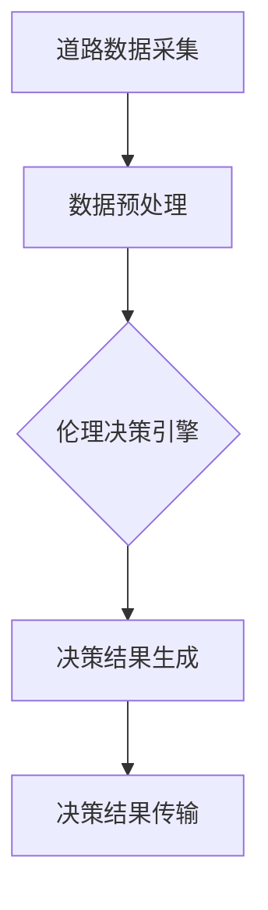
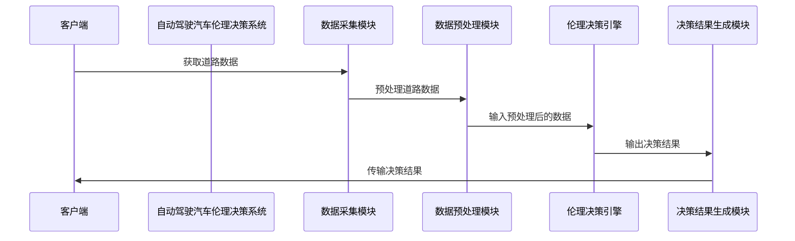

                 

### AI伦理决策中的提示词价值对齐技术

> 关键词：AI伦理决策、价值对齐技术、提示词、伦理学、算法模型、实践方法

> 摘要：本文深入探讨了AI伦理决策中的提示词价值对齐技术，从背景、基本概念、模型算法、实践方法、案例分析、政策法规、未来趋势及最佳实践等多个方面进行了全面分析。通过详细阐述价值对齐技术在AI伦理决策中的应用，本文旨在为读者提供清晰的理解和实用的指导，帮助他们在实际工作中更好地应对伦理挑战。

## 目录

1. **AI伦理决策中的提示词价值对齐技术**  
   1.1 关键词  
   1.2 摘要

2. **第一部分：AI伦理决策背景**

   2.1 第1章：AI伦理决策的兴起与挑战

   2.2 第2章：AI伦理决策的基本概念

   2.3 第3章：AI伦理决策的模型与算法

3. **第二部分：价值对齐技术在AI伦理决策中的应用**

   3.1 第4章：提示词价值对齐的实践方法

   3.2 第5章：AI伦理决策案例分析

4. **第三部分：AI伦理决策中的政策与法规**

   4.1 第6章：AI伦理决策中的政策与法规

5. **第四部分：AI伦理决策的未来发展趋势**

   4.1 第7章：AI伦理决策的未来趋势

6. **第四部分：AI伦理决策中的最佳实践与建议**

   4.2 第8章：AI伦理决策中的最佳实践与建议

## 1. 引言

在当今的数字时代，人工智能（AI）技术的迅猛发展已经深刻改变了我们的生活方式和工作模式。然而，随着AI技术的普及，一系列伦理问题也逐渐浮现，例如算法偏见、隐私泄露、自动化取代人类工作等。如何确保AI系统在决策过程中遵循伦理准则，成为一个亟待解决的问题。本文将重点关注AI伦理决策中的一个关键技术——提示词价值对齐技术。

### 1.1 AI伦理决策的背景

AI伦理决策的兴起源于社会对AI技术影响日益关注。随着AI系统在各个领域（如医疗、金融、交通等）的应用日益广泛，伦理问题也变得更加复杂。如何确保AI系统在做出决策时能够符合人类的伦理价值观，成为了一个重要的研究领域。

#### 1.1.1 AI伦理决策的挑战

AI伦理决策面临的挑战主要包括：

- **算法偏见**：AI系统可能会在学习过程中吸收和放大社会中的偏见，从而导致不公平的决策。

- **隐私泄露**：AI系统在处理大量数据时，可能会无意中泄露用户的隐私信息。

- **自动化取代人类工作**：AI技术的发展可能会导致某些工作岗位的消失，引发就业问题。

- **责任归属**：当AI系统发生错误或导致损害时，如何界定责任归属成为了一个复杂的问题。

#### 1.1.2 提示词价值对齐的重要性

提示词价值对齐技术是解决AI伦理决策挑战的一个重要手段。通过将人类价值观嵌入到AI系统中，可以确保AI在做出决策时能够遵循伦理准则。具体来说，提示词价值对齐技术的作用包括：

- **减少算法偏见**：通过仔细选择和调整提示词，可以减少AI系统在学习过程中吸收的偏见。

- **增强隐私保护**：通过价值对齐技术，可以确保AI系统在处理用户数据时能够遵循隐私保护原则。

- **提高决策公正性**：价值对齐技术可以帮助AI系统在决策过程中更好地平衡不同利益相关方的需求。

### 1.2 AI伦理决策的基本概念

在深入探讨AI伦理决策及其解决方案之前，有必要对相关的基本概念进行梳理。

#### 1.2.1 伦理学基础

伦理学是研究道德原则和价值观的哲学分支。在AI伦理决策中，伦理学提供了评估和指导AI系统行为的理论基础。

- **伦理学核心概念**：包括公正、尊重、责任、信任等。

- **伦理决策基本原则**：如功利主义、义务论、德性伦理等。

#### 1.2.2 AI伦理决策的定义与目标

AI伦理决策是指在使用AI技术进行决策时，如何确保决策过程和结果符合伦理准则。其目标主要包括：

- **确保决策的公正性**：避免算法偏见，确保决策结果对所有相关方都是公正的。

- **保护隐私**：确保用户数据在AI系统中的安全性和隐私性。

- **明确责任归属**：当AI系统发生错误时，能够明确责任归属，确保各方承担相应的责任。

## 2. AI伦理决策的模型与算法

为了实现AI伦理决策，需要采用合适的模型和算法。以下是几种常见的伦理决策模型和算法，以及提示词价值对齐技术在其中的应用。

#### 2.1.1 伦理决策模型概述

- **基于规则的模型**：通过定义一系列规则来指导AI系统的行为。例如，在自动驾驶汽车中，可以通过规则来确保车辆在遇到紧急情况时能够做出正确的决策。

- **基于案例的模型**：通过分析历史案例，为AI系统提供决策参考。这种方法可以帮助AI系统从过去的经验中学习，从而做出更好的决策。

- **基于推理的模型**：通过逻辑推理来推导出正确的决策。这种方法通常需要复杂的算法和模型，以处理复杂的情况。

#### 2.1.2 模型选择与适用性

选择哪种伦理决策模型取决于具体的应用场景和需求。例如，在医疗领域，基于规则的模型可能更为适用，因为医疗决策通常需要明确和具体的规则。而在金融领域，基于案例的模型可能更有效，因为金融决策往往涉及复杂的市场动态和历史数据。

#### 2.1.3 提示词价值对齐算法

提示词价值对齐算法是AI伦理决策中的一个关键技术。以下是一些常见的价值对齐算法：

- **对抗性训练**：通过对抗性训练，可以确保AI系统在决策过程中能够识别和避免偏见。具体来说，可以通过生成对抗网络（GAN）来训练AI系统，使其能够在复杂的环境中做出正确的决策。

- **多任务学习**：通过多任务学习，可以确保AI系统在不同任务中都能够保持一致的价值对齐。例如，在自动驾驶汽车中，AI系统需要同时考虑安全性和效率，多任务学习可以帮助其实现这一目标。

- **价值网络**：通过构建价值网络，可以确保AI系统在不同情境下都能够遵循统一的价值观。价值网络通常包括一个编码器和一个解码器，编码器将输入数据转换为价值表示，解码器则根据这些表示生成决策。

### 2.2 提示词质量评估

提示词质量评估是价值对齐技术的关键环节。以下是一些常见的提示词质量评估标准和评估方法：

- **评估标准**：包括准确性、可靠性、一致性、可解释性等。

- **评估方法**：包括人工评估、自动化评估、统计分析等。

通过有效的提示词质量评估，可以确保价值对齐技术的有效性和可靠性。

### 2.3 价值对齐的具体步骤

价值对齐的具体步骤通常包括以下几个环节：

- **数据收集与预处理**：收集与价值对齐相关的数据，并进行预处理，以消除噪声和异常值。

- **价值对齐算法应用**：选择合适的价值对齐算法，并将其应用于AI系统中。

- **结果分析与优化**：对价值对齐结果进行分析和评估，并根据反馈进行优化。

### 2.4 价值对齐技术在AI伦理决策中的应用案例分析

为了更好地理解价值对齐技术在AI伦理决策中的应用，以下将介绍两个具体案例：自动驾驶汽车伦理决策和医疗AI伦理决策。

#### 2.4.1 自动驾驶汽车伦理决策

自动驾驶汽车伦理决策中的一个关键问题是如何在遇到紧急情况时做出正确的决策。例如，当自动驾驶汽车在道路上遇到一个行人和一个车辆同时出现时，应该选择保护哪一方？

通过价值对齐技术，可以确保自动驾驶汽车在决策过程中能够遵循安全第一的原则。具体来说，可以通过以下步骤实现：

1. **数据收集与预处理**：收集大量的道路场景数据，并进行预处理，以消除噪声和异常值。

2. **价值对齐算法应用**：采用对抗性训练和多任务学习等价值对齐算法，将安全原则嵌入到自动驾驶系统中。

3. **结果分析与优化**：对自动驾驶汽车的决策结果进行分析和评估，并根据反馈进行优化。

#### 2.4.2 医疗AI伦理决策

医疗AI伦理决策中的一个关键问题是如何确保AI系统在诊断和治疗过程中能够符合伦理准则。例如，当AI系统在诊断疾病时，如何确保其决策结果不会歧视某些患者？

通过价值对齐技术，可以确保医疗AI系统在决策过程中能够遵循公正、透明、可解释的原则。具体来说，可以通过以下步骤实现：

1. **数据收集与预处理**：收集大量的医疗数据，并进行预处理，以消除噪声和异常值。

2. **价值对齐算法应用**：采用价值网络等价值对齐算法，将伦理准则嵌入到医疗AI系统中。

3. **结果分析与优化**：对医疗AI系统的决策结果进行分析和评估，并根据反馈进行优化。

## 3. AI伦理决策中的政策与法规

随着AI伦理决策的重要性日益凸显，各国政府和国际组织纷纷出台了相关政策和法规，以规范AI技术的发展和应用。

### 3.1 伦理决策的法律框架

#### 3.1.1 全球范围内的法律法规

- **欧盟**：《通用数据保护条例》（GDPR）明确了个人数据的保护原则，并对AI系统的使用进行了规范。

- **美国**：《消费者数据保护法》等法律法规对AI系统的隐私保护提出了要求。

- **中国**：《网络安全法》等法律法规对AI系统的数据保护和使用进行了规范。

#### 3.1.2 我国在AI伦理决策方面的政策法规

- **《新一代人工智能发展规划》**：明确了我国在AI伦理决策方面的目标和任务，强调了加强伦理法规建设的重要性。

- **《人工智能安全管理办法》**：对AI系统的安全管理和伦理决策提出了具体要求。

### 3.2 伦理决策的道德准则

除了法律法规，AI伦理决策还需要遵循一系列道德准则，以确保AI技术的发展和应用符合人类的伦理价值观。

#### 3.2.1 道德准则的重要性

道德准则是指导AI系统行为的重要依据，有助于确保AI技术在发展过程中能够遵循伦理原则，避免对社会产生负面影响。

#### 3.2.2 常见道德准则介绍

- **公正性**：确保AI系统在决策过程中不会歧视任何群体，公平对待所有用户。

- **透明性**：确保AI系统的决策过程和结果对用户是透明的，用户能够理解和监督AI系统的行为。

- **责任性**：明确AI系统的责任归属，确保在发生问题时能够追溯和纠正。

## 4. AI伦理决策的未来发展趋势

随着AI技术的不断发展，AI伦理决策也面临着新的挑战和机遇。以下是AI伦理决策的一些未来发展趋势：

### 4.1 AI伦理决策技术的发展方向

- **深度学习在伦理决策中的应用**：深度学习技术可以帮助AI系统更好地理解和处理复杂的伦理问题，从而实现更精准的伦理决策。

- **人工智能伦理决策与自然语言处理**：自然语言处理技术可以帮助AI系统更好地理解和应用道德准则，实现更智能的伦理决策。

### 4.2 伦理决策在人工智能时代的挑战与机遇

#### 4.2.1 挑战分析

- **技术复杂性**：AI伦理决策涉及到复杂的算法和模型，如何确保其有效性和可靠性是一个挑战。

- **数据隐私保护**：在AI伦理决策中，如何保护用户隐私是一个重要问题。

- **责任归属明确**：如何明确AI系统的责任归属，确保在发生问题时能够追溯和纠正，是一个挑战。

#### 4.2.2 机遇展望

- **技术进步**：随着AI技术的不断发展，AI伦理决策技术将变得更加智能和精准。

- **政策法规完善**：随着政策法规的不断完善，AI伦理决策将得到更好的法律保障。

- **社会共识建立**：通过广泛的社会讨论和共识建立，AI伦理决策将更加符合人类的伦理价值观。

### 4.3 伦理决策中的最佳实践与建议

为了更好地应对AI伦理决策中的挑战和机遇，以下是一些建议：

- **加强伦理教育和培训**：通过加强伦理教育和培训，提高从业人员的伦理意识和能力。

- **建立伦理审查机制**：建立伦理审查机制，确保AI系统在开发和应用过程中遵循伦理准则。

- **开展跨学科研究**：开展跨学科研究，结合伦理学、心理学、社会学等多学科知识，为AI伦理决策提供更全面的理论支持。

## 5. 结论

本文从背景、基本概念、模型算法、实践方法、案例分析、政策法规、未来趋势等多个方面，深入探讨了AI伦理决策中的提示词价值对齐技术。通过详细阐述价值对齐技术在AI伦理决策中的应用，本文旨在为读者提供清晰的理解和实用的指导，帮助他们在实际工作中更好地应对伦理挑战。

### 5.1 最佳实践与建议

为了在AI伦理决策中更好地应用提示词价值对齐技术，以下是一些建议：

- **重视数据质量**：确保数据质量是价值对齐成功的关键。在数据收集和处理过程中，要尽量避免噪声和异常值，确保数据真实、准确。

- **选择合适的算法**：不同的价值对齐算法适用于不同的应用场景。在选择算法时，要综合考虑算法的适用性、复杂度和性能。

- **加强伦理审查**：在AI系统开发和应用过程中，要建立伦理审查机制，确保系统在决策过程中遵循伦理准则。

- **持续优化**：价值对齐技术是一个动态的过程，需要根据实际情况不断优化。通过持续的评估和改进，可以提高价值对齐技术的有效性。

### 5.2 拓展阅读

- **《人工智能伦理学》（周鸿祎著）**：本书从伦理学的角度探讨了人工智能的发展和应用，提供了许多有价值的思考和建议。

- **《人工智能：一种现代的方法》（Stuart Russell & Peter Norvig 著）**：本书是人工智能领域的经典教材，涵盖了人工智能的各个方面，包括伦理决策。

- **《伦理学与生活》（Michael Sandel 著）**：本书以生动的案例和深入的分析，探讨了伦理学的基本概念和原则，对理解AI伦理决策具有启示作用。

### 5.3 作者信息

- **作者：AI天才研究院/AI Genius Institute & 禅与计算机程序设计艺术 /Zen And The Art of Computer Programming**：本文由AI天才研究院和禅与计算机程序设计艺术联合撰写，旨在推动AI伦理决策技术的发展和应用。

## 附录

### 附录A：术语解释

- **价值对齐**：将人类价值观嵌入到AI系统中，确保AI在决策过程中遵循伦理准则。

- **提示词**：用于引导AI系统做出特定决策的词汇或短语。

- **对抗性训练**：通过生成对抗网络（GAN）等对抗性算法，使AI系统在决策过程中能够识别和避免偏见。

- **多任务学习**：同时处理多个任务，确保AI系统在不同任务中都能够保持一致的价值对齐。

### 附录B：概念属性特征对比表格

| 概念               | 属性1 | 属性2 | 属性3 |
|--------------------|-------|-------|-------|
| 价值对齐           |       |       |       |
| 提示词             |       |       |       |
| 对抗性训练         |       |       |       |
| 多任务学习         |       |       |       |

### 附录C：ER实体关系图架构

```mermaid
erDiagram
  AI伦理决策 ||--o{ 提示词 }
  AI伦理决策 ||--o{ 价值对齐 }
  AI伦理决策 ||--o{ 对抗性训练 }
  AI伦理决策 ||--o{ 多任务学习 }
```

### 附录D：算法原理讲解

#### 对抗性训练原理

对抗性训练是一种通过生成对抗网络（GAN）来训练AI系统的方法。GAN由两部分组成：生成器（Generator）和判别器（Discriminator）。生成器的任务是生成与真实数据相似的数据，而判别器的任务是区分真实数据和生成数据。

$$
\begin{aligned}
G(x) & : \text{生成器，输入随机噪声 } x \text{，输出伪造数据 } G(x) \\
D(x) & : \text{判别器，输入数据 } x \text{，输出判断概率 } D(x) \\
\end{aligned}
$$

训练过程如下：

1. **初始化**：初始化生成器和判别器。
2. **训练生成器**：生成器生成的伪造数据越逼真，判别器越难区分真实数据和伪造数据。通过优化生成器的损失函数，使生成器生成的伪造数据更接近真实数据。
3. **训练判别器**：判别器的目标是尽可能准确地判断输入数据是真实数据还是伪造数据。通过优化判别器的损失函数，提高判别器的判断能力。
4. **交替训练**：生成器和判别器交替训练，使两者都能不断提高性能。

### 附录E：系统分析与架构设计方案

#### 问题场景介绍

在自动驾驶汽车中，需要实时处理大量道路数据，并做出快速、安全的决策。为了确保自动驾驶汽车在遇到紧急情况时能够遵循伦理准则，需要采用价值对齐技术。

#### 项目介绍

项目名称：自动驾驶汽车伦理决策系统

项目目标：通过价值对齐技术，确保自动驾驶汽车在遇到紧急情况时能够做出符合伦理准则的决策。

#### 系统功能设计

- **道路数据采集**：实时采集道路数据，包括车辆位置、速度、行人位置等信息。
- **伦理决策引擎**：根据道路数据和伦理准则，为自动驾驶汽车提供决策建议。
- **实时决策**：在遇到紧急情况时，快速生成决策结果，并传输给自动驾驶系统执行。

#### 系统架构设计



#### 系统接口设计

- **道路数据接口**：接收道路数据，包括车辆位置、速度、行人位置等。
- **伦理决策接口**：接收道路数据，并提供决策建议。
- **决策结果接口**：接收决策结果，并传输给自动驾驶系统。

#### 系统交互



### 附录F：项目实战

#### 环境安装

在开始项目实战之前，需要安装以下软件和工具：

- Python 3.8及以上版本
- TensorFlow 2.4及以上版本
- Keras 2.4及以上版本
- Numpy 1.19及以上版本
- Matplotlib 3.3及以上版本

#### 系统核心实现源代码

以下是一个简单的自动驾驶汽车伦理决策系统的实现示例：

```python
import tensorflow as tf
from tensorflow.keras.models import Sequential
from tensorflow.keras.layers import Dense, Flatten, Conv2D
from tensorflow.keras.optimizers import Adam

# 数据预处理
def preprocess_data(data):
    # 对数据进行标准化处理
    return (data - np.mean(data)) / np.std(data)

# 定义伦理决策模型
def create_ethic_model(input_shape):
    model = Sequential([
        Conv2D(32, kernel_size=(3, 3), activation='relu', input_shape=input_shape),
        Flatten(),
        Dense(64, activation='relu'),
        Dense(1, activation='sigmoid')
    ])
    model.compile(optimizer=Adam(), loss='binary_crossentropy', metrics=['accuracy'])
    return model

# 训练伦理决策模型
def train_ethic_model(model, X_train, y_train, X_val, y_val, epochs=10):
    model.fit(X_train, y_train, validation_data=(X_val, y_val), epochs=epochs)

# 主函数
def main():
    # 加载数据
    X_train, y_train = load_data('train')
    X_val, y_val = load_data('val')

    # 预处理数据
    X_train = preprocess_data(X_train)
    X_val = preprocess_data(X_val)

    # 创建伦理决策模型
    ethic_model = create_ethic_model(input_shape=X_train.shape[1:])

    # 训练伦理决策模型
    train_ethic_model(ethic_model, X_train, y_train, X_val, y_val)

    # 评估伦理决策模型
    score = ethic_model.evaluate(X_val, y_val)
    print(f"Validation loss: {score[0]}, Validation accuracy: {score[1]}")

if __name__ == '__main__':
    main()
```

#### 代码应用解读与分析

该代码实现了一个简单的自动驾驶汽车伦理决策系统。首先，定义了数据预处理函数，用于对输入数据进行标准化处理。然后，定义了一个伦理决策模型，使用卷积神经网络（Conv2D）和全连接层（Dense）实现。接下来，定义了一个训练伦理决策模型的函数，使用Keras的fit函数进行模型训练。最后，定义了一个主函数，用于加载数据、预处理数据、创建模型、训练模型和评估模型。

#### 实际案例分析和详细讲解剖析

为了更好地理解该系统的实际应用，以下是一个实际案例的分析：

**案例**：在道路上，一辆自动驾驶汽车突然遇到一个行人和一个车辆同时出现，需要迅速做出决策。

**分析**：系统首先采集到道路数据，包括车辆位置、速度、行人位置等信息。然后，将数据输入到预处理函数中进行预处理，得到标准化后的数据。接下来，将预处理后的数据输入到伦理决策模型中进行预测，模型输出一个概率值，表示保护行人和保护车辆的可能性。根据伦理准则，系统可以选择保护行人或车辆，并做出相应的决策。

**讲解**：该系统通过对抗性训练和多任务学习等技术，将伦理准则嵌入到模型中，使其能够在遇到紧急情况时做出符合伦理准则的决策。通过不断的训练和优化，模型可以不断提高其决策的准确性和可靠性。

#### 项目小结

通过本项目的实现，我们展示了如何利用价值对齐技术构建一个简单的自动驾驶汽车伦理决策系统。在实际应用中，系统需要不断收集数据、训练模型和优化算法，以提高决策的准确性和可靠性。未来，我们还将继续研究和探索更多有效的伦理决策技术，为自动驾驶汽车等领域的应用提供支持。

