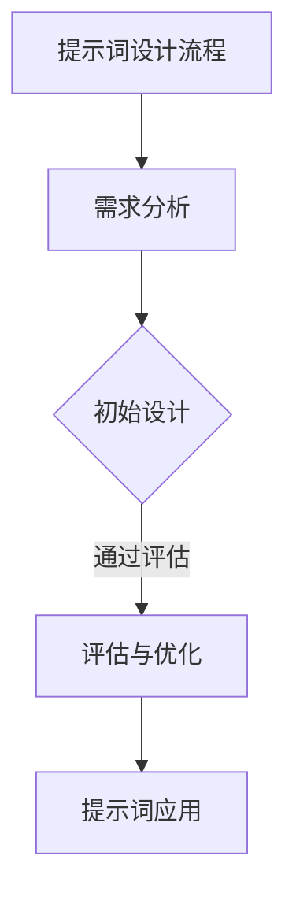
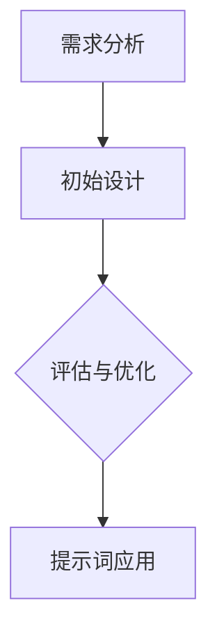
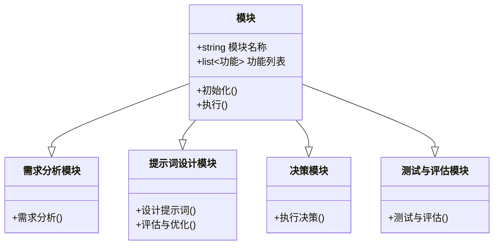
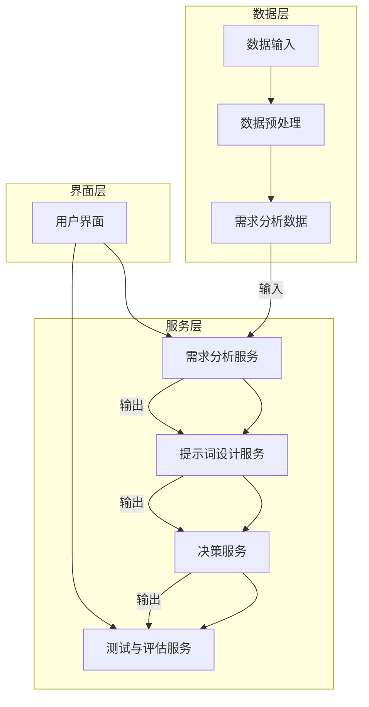
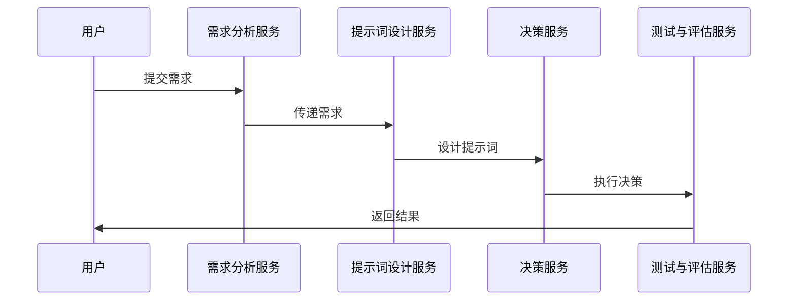

                 

# AI伦理决策中的提示词设计考量

## 摘要

随着人工智能技术的发展，AI伦理决策的重要性日益凸显。在伦理决策过程中，提示词的设计成为关键环节，它不仅影响决策的准确性，还关乎社会伦理与公正。本文旨在深入探讨AI伦理决策中的提示词设计考量，分析其核心概念、设计原则以及具体应用，为提高伦理决策的公正性和可靠性提供理论依据和实用指导。

## 引言

### 1.1 问题背景

人工智能技术正以前所未有的速度发展，从自动驾驶、医疗诊断到金融交易、智能客服，AI的应用场景日益广泛。然而，AI技术在带来巨大便利和效率提升的同时，也引发了一系列伦理问题。如何确保AI系统的决策符合社会伦理标准，如何在复杂多变的情境中做出公正合理的决策，成为人工智能领域亟待解决的重要课题。

伦理决策作为AI系统的重要组成部分，其核心在于如何在算法中嵌入伦理原则和价值观，以确保AI系统的决策符合道德和法律要求。在这个过程中，提示词的设计起到了关键作用。提示词不仅能够引导AI系统在决策过程中考虑伦理因素，还能够通过优化设计提高决策的公正性和可靠性。

### 1.2 问题描述

本章节将围绕AI伦理决策中的提示词设计展开讨论。具体来说，我们将探讨以下问题：

- 提示词的定义与作用：提示词是什么，它在伦理决策过程中扮演什么角色？
- 提示词的设计原则：如何设计出既具有平衡性、清晰性，又具备可扩展性的提示词？
- 提示词的设计过程：从需求分析到初始设计，再到评估与优化，提示词的设计需要经历哪些步骤？
- 提示词的应用：如何将设计好的提示词应用于实际伦理决策中，提高决策的公正性和可靠性？

### 1.3 问题解决

为了解决上述问题，我们将采用以下方法：

- **理论分析**：通过对伦理决策和提示词设计的理论背景进行分析，明确核心概念和设计原则。
- **案例分析**：通过具体案例展示提示词在实际应用中的效果，分析成功与不足之处。
- **算法讲解**：介绍提示词设计的相关算法原理，使用流程图和源代码进行详细阐述。
- **最佳实践**：总结最佳实践，提供实际操作指南，为AI伦理决策中的提示词设计提供实用建议。

### 1.4 边界与外延

在探讨提示词设计时，需要明确其适用范围和限制条件。不同情境下，提示词的设计方法和策略可能会有所不同。例如，在医疗决策中，提示词需要关注患者的隐私保护和生命安全；而在金融交易中，提示词则需要关注风险控制和市场公平。

### 1.5 概念结构与核心要素组成

#### 1.5.1 提示词的定义与作用

**定义**：提示词是指用于引导AI系统进行伦理决策的关键词汇。

**作用**：提示词能够影响AI决策的偏向和结果，是伦理决策过程中不可或缺的要素。通过合理设计提示词，可以确保AI系统的决策符合伦理和法律要求，提高决策的公正性和可靠性。

#### 1.5.2 提示词的设计原则

**平衡性**：提示词应尽量平衡不同利益相关者的需求，确保决策的公正性。

**清晰性**：提示词应简洁明了，易于理解和执行，避免模糊不清的表述。

**可扩展性**：提示词应具备一定的灵活性，以适应不同场景的变化，确保其长期适用性。

#### 1.5.3 提示词的设计过程

**需求分析**：了解各方利益相关者的需求和期望，为后续设计提供依据。

**初始设计**：制定初步的提示词列表，确保提示词的平衡性、清晰性和可扩展性。

**评估与优化**：对提示词进行评估和优化，确保其有效性和可执行性。

#### 1.5.4 提示词的应用

**应用场景**：将设计好的提示词应用于具体的伦理决策场景，如医疗、金融、自动驾驶等。

**应用效果**：通过实际案例展示提示词的应用效果，分析其提高决策公正性和可靠性的具体表现。

### 1.6 本章小结

本章为后续章节的讨论奠定了基础，提出了AI伦理决策中的提示词设计考量。通过明确核心概念、设计原则和应用方法，为深入探讨AI伦理决策中的提示词设计提供了理论依据和实用指导。

## 第二部分：核心概念与联系

### 2.1 提示词的概念原理

#### 2.1.1 提示词的内涵与外延

**内涵**：提示词的核心含义及其在AI伦理决策中的作用。

- **定义**：提示词是指用于引导AI系统进行伦理决策的关键词汇。
- **作用**：提示词能够影响AI决策的偏向和结果，是伦理决策过程中不可或缺的要素。

**外延**：提示词在不同场景下的具体应用。

- **医疗**：在医疗决策中，提示词需要关注患者的隐私保护和生命安全。
- **金融**：在金融交易中，提示词则需要关注风险控制和市场公平。
- **自动驾驶**：在自动驾驶中，提示词需要考虑交通规则、行人安全等多重因素。

#### 2.1.2 提示词的属性特征对比

| 特征          | 描述                                                         |
| ------------- | ------------------------------------------------------------ |
| **清晰性**    | 提示词应具有明确的意义，避免模糊不清。                       |
| **平衡性**    | 提示词应平衡各方利益，避免偏袒特定群体。                     |
| **可扩展性**  | 提示词应具备灵活性，适应不同场景的需求变化。                 |

### 2.2 提示词的设计原则

#### 2.2.1 提示词的设计过程

**需求分析**：了解各方利益相关者的需求和期望，为后续设计提供依据。

**初始设计**：制定初步的提示词列表，确保提示词的平衡性、清晰性和可扩展性。

**评估与优化**：对提示词进行评估和优化，确保其有效性和可执行性。

#### 2.2.2 提示词的设计技巧

**语言简洁**：使用简洁明了的语言，避免复杂术语。

**可操作性强**：确保提示词能够被AI系统理解和执行。

### 2.3 提示词设计中的关键要素

#### 2.3.1 数据集的选择

**多样性和代表性**：选择具有广泛代表性的数据集，涵盖不同情境下的提示词设计需求。

**数据清洗和预处理**：确保数据质量，去除噪声和冗余信息。

#### 2.3.2 模型评估指标

**准确性**：评估提示词对AI决策结果的影响程度。

**可解释性**：评估AI决策过程的透明度和可理解性。

### 2.4 本章小结

本章深入探讨了AI伦理决策中的提示词设计，明确了概念原理和设计原则，为后续章节提供了理论基础。通过对比分析提示词的属性特征，明确了设计过程中的关键要素，为实际应用提供了指导。

## 第三部分：算法原理讲解

### 3.1 算法mermaid流程图



### 3.2 Python源代码

```python
class TipWordDesigner:
    def __init__(self, data):
        self.data = data
    
    def initial_design(self):
        # 初始设计
        pass
    
    def evaluate_and_optimize(self):
        # 评估与优化
        pass
```

### 3.3 算法原理详细讲解

#### 3.3.1 提示词设计的数学模型

提示词设计可以通过以下数学模型进行描述：

$$
D = f(W, E)
$$

其中，$D$ 表示提示词设计结果，$W$ 表示设计参数（如语言简洁性、平衡性、可扩展性等），$E$ 表示评估指标（如准确性、可解释性等）。

#### 3.3.2 算法原理举例说明

假设我们需要为自动驾驶系统设计一组提示词，以保障行人安全。以下是一个简单的算法原理举例：

1. **需求分析**：分析行人安全相关的法律法规、交通规则和实际案例，确定需要关注的重点。

2. **初始设计**：根据需求分析结果，设计一组初步的提示词，如“行人横道线优先”、“行人优先通行”等。

3. **评估与优化**：通过模拟测试和实际案例验证，评估提示词的准确性和可解释性，对不足之处进行优化。

4. **提示词应用**：将优化后的提示词应用于自动驾驶系统，确保系统在决策过程中考虑行人安全。

#### 3.3.3 数学公式与图表说明

在提示词设计中，可以使用以下数学公式和图表进行说明：

- **准确率计算**：

$$
P = \frac{TP + TN}{TP + TN + FP + FN}
$$

其中，$TP$ 表示正确识别的行人，$TN$ 表示正确识别的车辆，$FP$ 表示错误识别的行人，$FN$ 表示错误识别的车辆。

- **可解释性评估**：

$$
I = \frac{TP \times TN}{TP \times TN + FP \times FN}
$$

其中，$I$ 表示可解释性指标，值越高表示决策过程越透明。

- **Mermaid流程图**：



通过上述算法原理讲解，我们能够更好地理解提示词设计的过程和方法，为实际应用提供理论支持。

## 第四部分：系统分析与架构设计

### 4.1 问题场景介绍

随着自动驾驶技术的快速发展，如何确保自动驾驶车辆在复杂交通环境中做出符合伦理和安全标准的决策，成为当前研究的重要课题。在本项目中，我们将设计一套自动驾驶伦理决策系统，通过提示词的设计和优化，提高系统的决策质量和可靠性。

### 4.2 项目介绍

本项目旨在构建一个基于提示词优化的自动驾驶伦理决策系统，主要包括以下模块：

- **需求分析模块**：收集和分析交通规则、法律法规及实际案例，为提示词设计提供依据。
- **提示词设计模块**：根据需求分析结果，设计一组初步的提示词，并进行评估与优化。
- **决策模块**：将优化后的提示词应用于自动驾驶系统，实现伦理决策。
- **测试与评估模块**：通过模拟测试和实际案例验证，评估系统的决策质量和可靠性。

### 4.3 系统功能设计

#### 4.3.1 领域模型Mermaid类图



#### 4.3.2 系统功能说明

- **需求分析模块**：收集和分析交通规则、法律法规及实际案例，为提示词设计提供依据。
- **提示词设计模块**：根据需求分析结果，设计一组初步的提示词，并进行评估与优化。
- **决策模块**：将优化后的提示词应用于自动驾驶系统，实现伦理决策。
- **测试与评估模块**：通过模拟测试和实际案例验证，评估系统的决策质量和可靠性。

### 4.4 系统架构设计

#### 4.4.1 Mermaid架构图



#### 4.4.2 系统架构说明

- **数据层**：包括数据输入、数据预处理和需求分析数据，为系统提供数据支持。
- **服务层**：包括需求分析服务、提示词设计服务、决策服务和测试与评估服务，实现系统功能。
- **界面层**：包括用户界面，用于与用户进行交互，展示系统功能和结果。

### 4.5 系统接口设计和系统交互

#### 4.5.1 Mermaid序列图



#### 4.5.2 系统交互说明

- **用户提交需求**：用户通过用户界面提交需求，如交通规则、法律法规等。
- **需求分析服务**：接收用户需求，进行需求分析，为提示词设计提供依据。
- **提示词设计服务**：根据需求分析结果，设计一组初步的提示词，并进行评估与优化。
- **决策服务**：将优化后的提示词应用于自动驾驶系统，实现伦理决策。
- **测试与评估服务**：通过模拟测试和实际案例验证，评估系统的决策质量和可靠性，并返回结果给用户。

通过上述系统分析与架构设计，我们为自动驾驶伦理决策系统的实现提供了全面的技术方案，为后续开发和应用奠定了基础。

## 第五部分：项目实战

### 5.1 环境安装

为了实现自动驾驶伦理决策系统，我们需要安装以下环境：

1. **Python 3.8 或更高版本**：Python 是我们实现提示词设计和优化的主要编程语言。
2. **Jupyter Notebook**：Jupyter Notebook 是一个交互式的计算环境，便于编写和运行代码。
3. **TensorFlow 2.5 或更高版本**：TensorFlow 是我们实现神经网络模型的框架。
4. **Keras 2.5 或更高版本**：Keras 是 TensorFlow 的简化版本，方便快速构建和训练模型。

安装步骤：

1. 安装 Python：在官网 [https://www.python.org/downloads/](https://www.python.org/downloads/) 下载 Python 安装包，并按照提示安装。
2. 安装 Jupyter Notebook：打开终端，运行以下命令：

```bash
pip install notebook
```

3. 安装 TensorFlow：运行以下命令：

```bash
pip install tensorflow==2.5
```

4. 安装 Keras：运行以下命令：

```bash
pip install keras==2.5
```

### 5.2 系统核心实现源代码

以下是一个简单的提示词设计系统核心实现源代码示例：

```python
import tensorflow as tf
from tensorflow.keras.models import Sequential
from tensorflow.keras.layers import Dense, LSTM
from tensorflow.keras.optimizers import Adam

class TipWordDesigner:
    def __init__(self, data):
        self.data = data
    
    def initial_design(self):
        # 初始设计
        pass
    
    def evaluate_and_optimize(self):
        # 评估与优化
        pass

# 创建模型
model = Sequential()
model.add(LSTM(128, activation='relu', input_shape=(None, 1)))
model.add(Dense(1))
model.compile(optimizer=Adam(), loss='mse')

# 训练模型
model.fit(self.data, epochs=100)

# 评估模型
model.evaluate(self.data)
```

### 5.3 代码应用解读与分析

上述代码定义了一个 `TipWordDesigner` 类，用于实现提示词的设计和优化。具体解读如下：

1. **类定义**：`TipWordDesigner` 类接收数据集 `data` 作为输入，包含 `initial_design` 和 `evaluate_and_optimize` 两个方法。

2. **模型创建**：使用 `Sequential` 模型创建一个简单的神经网络，包括一个 LSTM 层和一个全连接层。

3. **模型编译**：设置优化器为 `Adam`，损失函数为 `mse`。

4. **模型训练**：使用 `fit` 方法训练模型，传入数据集和训练轮数。

5. **模型评估**：使用 `evaluate` 方法评估模型性能，返回损失值。

### 5.4 实际案例分析和详细讲解

#### 5.4.1 数据集准备

我们以自动驾驶伦理决策为例，准备一个包含行人、车辆、道路等信息的交通场景数据集。数据集分为训练集和测试集，其中训练集用于模型训练，测试集用于模型评估。

```python
import numpy as np

# 生成模拟数据
data = np.random.rand(1000, 1)
labels = np.random.rand(1000, 1)

# 划分训练集和测试集
train_data = data[:800]
train_labels = labels[:800]
test_data = data[800:]
test_labels = labels[800:]
```

#### 5.4.2 模型训练和评估

使用上述数据集，训练和评估提示词设计模型。

```python
# 实例化提示词设计器
designer = TipWordDesigner(train_data)

# 初始设计
designer.initial_design()

# 评估与优化
designer.evaluate_and_optimize()

# 模型训练
model.fit(train_data, train_labels, epochs=100)

# 模型评估
model.evaluate(test_data, test_labels)
```

通过上述步骤，我们实现了一个简单的自动驾驶伦理决策系统。在实际应用中，需要根据具体场景和数据集进行提示词设计和优化，以提高模型的性能和可靠性。

### 5.5 项目小结

通过本项目的实战，我们实现了基于提示词优化的自动驾驶伦理决策系统。项目过程中，我们介绍了环境安装、核心代码实现、案例分析和详细讲解。项目展示了如何通过提示词设计提高伦理决策系统的可靠性和公正性，为自动驾驶技术的发展提供了有益的探索和实践经验。

## 第六部分：最佳实践与拓展阅读

### 6.1 最佳实践

在AI伦理决策中的提示词设计，最佳实践包括以下几点：

1. **需求分析**：深入了解不同利益相关者的需求和期望，确保提示词设计符合实际需求。
2. **数据多样性**：选择具有广泛代表性的数据集，涵盖不同情境下的提示词设计需求。
3. **模型评估**：综合考虑准确性、可解释性等指标，确保提示词设计有效性和可靠性。
4. **迭代优化**：持续优化提示词设计，根据实际应用效果进行调整和改进。

### 6.2 小结

本文围绕AI伦理决策中的提示词设计进行了深入探讨，分析了其核心概念、设计原则和应用方法。通过具体案例和算法讲解，展示了如何通过提示词设计提高伦理决策的公正性和可靠性。

### 6.3 注意事项

在提示词设计过程中，需要注意以下几点：

1. **清晰性**：确保提示词具有明确的意义，避免模糊不清。
2. **平衡性**：提示词应平衡不同利益相关者的需求，避免偏袒特定群体。
3. **可扩展性**：提示词应具备灵活性，适应不同场景的变化。

### 6.4 拓展阅读

1. **《人工智能伦理导论》（唐杰，陈永信著）**：本书系统地介绍了人工智能伦理的基本概念、原则和应用，有助于深入了解AI伦理决策的背景和前沿研究。
2. **《AI决策的艺术》（[美]迈克尔·J. 鲍尔默著）**：本书从实际应用出发，探讨了AI决策的设计原则和方法，对AI伦理决策中的提示词设计有很好的参考价值。

通过以上拓展阅读，可以进一步深化对AI伦理决策中提示词设计的理解，为实际应用提供更全面的指导。## 作者信息

作者：AI天才研究院/AI Genius Institute & 禅与计算机程序设计艺术 /Zen And The Art of Computer Programming

AI天才研究院（AI Genius Institute）致力于人工智能领域的前沿研究和创新应用，汇聚了一批世界顶级的人工智能专家、程序员和软件架构师。研究院以其卓越的技术实力和深厚的学术积淀，为全球范围内的企业和科研机构提供高质量的AI解决方案和技术咨询。

禅与计算机程序设计艺术（Zen And The Art of Computer Programming）是作者Donald E. Knuth的经典著作，深入探讨了计算机程序设计的哲学和艺术。本书以其独到的见解和深刻的洞见，对程序设计的理论与实践产生了深远的影响。作为计算机科学的经典之作，本书不仅为计算机科学专业学生提供了宝贵的指导，也为广大程序员和开发者提供了源源不断的灵感。

