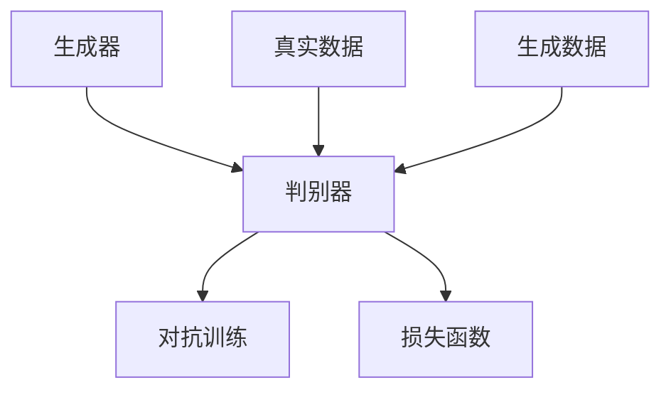
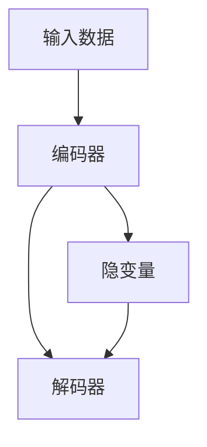
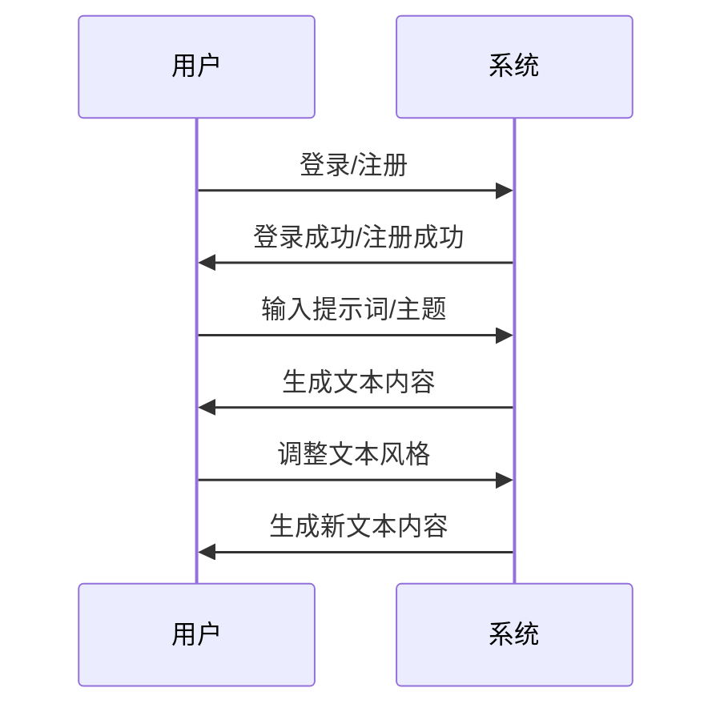

                 

# AI创意写作：利用提示词激发灵感

关键词：AI创意写作、提示词、生成对抗网络（GAN）、变分自编码器（VAE）、文本生成、故事创作

摘要：本文将探讨AI创意写作的核心概念和实现技术，特别是利用提示词激发灵感的机制。我们将详细分析生成对抗网络（GAN）和变分自编码器（VAE）的算法原理，以及其在AI创意写作中的实际应用。此外，我们还将介绍如何使用AI写作工具进行文本生成和故事创作，并提供实战案例和最佳实践。

## 第一部分：背景与概述

### 第1章：AI创意写作概述

#### 1.1 AI与创意写作

##### 1.1.1 AI技术的发展历程

人工智能（AI）的概念最早由计算机科学家约翰·麦卡锡（John McCarthy）在1956年提出。自那时以来，AI经历了多个发展阶段，从早期的规则推理系统到现代的深度学习模型。随着计算能力的提升和大数据的广泛应用，AI技术取得了显著的进步。

在创意写作方面，传统的创作方式主要依赖于人类作家的灵感和技巧。然而，随着AI技术的发展，计算机开始能够模拟人类的创造力，从而辅助或取代人类进行写作。AI创意写作不仅能够生成文本，还能够创作音乐、绘画、摄影等多种形式的创意作品。

##### 1.1.2 创意写作的重要性

创意写作是人类表达思想、情感和观点的重要手段。它不仅具有艺术价值，还在传播知识、娱乐大众和推动社会进步方面发挥着重要作用。随着数字时代的到来，创意写作的形式和载体不断丰富，人们对高质量创意作品的需求也日益增长。

AI创意写作的出现，为创作者提供了新的工具和方法，使得创作过程更加高效和多样化。通过AI技术，创作者可以突破自身的局限，探索新的创作方向和风格。

##### 1.1.3 AI在创意写作中的应用

AI在创意写作中的应用主要体现在文本生成、故事创作和艺术作品创作等方面。文本生成技术能够自动生成文章、报告、邮件等文本内容，帮助创作者快速完成写作任务。故事创作技术则能够根据预设的情节和角色，生成连贯、有趣的故事情节。

此外，AI还能够创作音乐、绘画和摄影等艺术作品。例如，AI音乐生成系统可以根据用户提供的风格和主题，自动创作音乐作品；AI绘画系统则能够根据用户输入的描述，生成相应的绘画作品。

#### 1.2 提示词的作用与机制

##### 1.2.1 提示词的基本概念

提示词（Prompt）是AI创意写作中的一个重要概念。它是指用户输入的用于指导AI生成文本的关键词或短语。提示词可以为AI提供创作方向，帮助AI理解用户的意图，从而生成更加符合预期的文本内容。

##### 1.2.2 提示词激发灵感的原理

提示词激发灵感的原理主要基于以下几点：

1. **语义引导**：提示词包含了用户的意图和需求，AI可以通过分析提示词的语义，理解用户的创作方向，从而生成相关的内容。

2. **模式识别**：AI通过大量的文本数据训练，能够识别出语言模式。提示词可以帮助AI找到与提示词相关的语言模式，从而生成连贯、自然的文本。

3. **随机性引入**：AI创意写作系统中通常包含一定的随机性元素，提示词可以为随机性引入提供方向，使得生成的文本更加多样化和有趣。

##### 1.2.3 提示词在AI中的应用

提示词在AI创意写作中的应用主要体现在以下几个方面：

1. **文本生成**：通过提示词，AI可以生成文章、故事、邮件等文本内容。例如，用户可以输入“写一篇关于人工智能的短文”，AI则根据提示词生成一篇关于人工智能的文章。

2. **故事创作**：提示词可以帮助AI创作故事情节。例如，用户可以输入“一个英雄的冒险故事”，AI则根据提示词生成一个具有英雄元素的故事。

3. **艺术作品创作**：提示词还可以用于AI创作音乐、绘画和摄影等艺术作品。例如，用户可以输入“一幅春天的画作”，AI则根据提示词生成一幅春天的绘画作品。

### 第2章：AI创意写作的核心概念

#### 2.1 语言模型简介

##### 2.1.1 语言模型的基本原理

语言模型（Language Model，LM）是AI创意写作的核心技术之一。它是一种概率模型，用于预测下一个单词或词组，从而生成连贯的文本。语言模型通常基于大规模的语料库，通过统计学习方法训练得到。

语言模型的基本原理可以分为以下几个步骤：

1. **数据收集**：收集大量文本数据，用于训练语言模型。

2. **数据预处理**：对收集到的文本数据进行清洗、分词、去停用词等预处理操作，以便于模型训练。

3. **模型训练**：使用统计学习方法，如n元语法、神经网络等，对预处理后的文本数据进行训练，得到一个语言模型。

4. **文本生成**：根据训练好的语言模型，生成新的文本内容。

##### 2.1.2 语言模型的类型

语言模型主要分为以下几种类型：

1. **n元语法模型**：n元语法模型是最早的语言模型，它基于n个连续单词的概率分布来预测下一个单词。常见的n值为1、2、3。

2. **循环神经网络（RNN）模型**：循环神经网络是一种基于时间序列数据的模型，它可以处理变长的文本序列。RNN模型在处理长距离依赖问题时具有优势。

3. **长短期记忆网络（LSTM）模型**：长短期记忆网络是RNN的一种变体，它通过门控机制来控制信息的记忆和遗忘，从而更好地处理长距离依赖问题。

4. ** Transformer模型**：Transformer模型是一种基于自注意力机制的模型，它通过多头自注意力机制来捕捉文本中的长距离依赖关系。Transformer模型在自然语言处理任务中取得了显著的效果。

##### 2.1.3 语言模型的训练与优化

语言模型的训练与优化主要包括以下几个方面：

1. **训练数据集的选择**：选择高质量的训练数据集，可以显著提高语言模型的效果。常用的数据集包括维基百科、新闻语料库等。

2. **超参数调整**：超参数包括学习率、批次大小、迭代次数等，它们的设置对模型的性能有重要影响。通常需要通过实验来找到最优的超参数。

3. **模型优化**：模型优化主要包括正则化、dropout、学习率调整等技术，这些技术可以防止模型过拟合，提高模型的泛化能力。

#### 2.2 创意写作的属性与挑战

##### 2.2.1 创意写作的属性特征

创意写作具有以下属性特征：

1. **原创性**：创意写作要求作品具有原创性，即作者通过独立思考和创新，创作出独特的作品。

2. **想象力**：创意写作依赖于作者的想象力，通过创造性的构思和描绘，使作品具有生动、丰富的内涵。

3. **情感表达**：创意写作是一种情感表达的方式，作者通过文字传递情感，引起读者的共鸣。

4. **文化传承**：创意写作在传承和发展文化方面具有重要作用，它记录了历史、风俗、情感等文化元素。

##### 2.2.2 AI在创意写作中的挑战

虽然AI在创意写作中具有巨大潜力，但同时也面临以下挑战：

1. **创意性不足**：AI生成的文本可能缺乏人类的创意性，难以达到高质量的艺术创作水平。

2. **情感表达困难**：AI难以完全理解人类的情感，因此在情感表达方面存在一定的局限性。

3. **文化理解偏差**：AI在处理文化相关的文本时，可能存在理解偏差，导致作品失去原有的文化内涵。

4. **伦理道德问题**：AI在创意写作中的应用，涉及到版权、隐私、伦理等问题，需要制定相应的规范和标准。

## 第二部分：技术原理

### 第3章：AI创意写作的算法原理

#### 3.1 生成对抗网络（GAN）

##### 3.1.1 GAN的基本原理

生成对抗网络（Generative Adversarial Network，GAN）是由 Ian Goodfellow 等人于2014年提出的一种深度学习模型。GAN由两个神经网络组成：生成器（Generator）和判别器（Discriminator）。

1. **生成器**：生成器的任务是生成与真实数据相似的数据。它通过学习真实数据的分布，生成具有相似特征的数据。

2. **判别器**：判别器的任务是区分真实数据和生成数据。它接收真实数据和生成数据作为输入，并输出概率，表示输入数据的真实程度。

GAN的训练过程可以看作是一个零和游戏。生成器和判别器相互对抗，生成器试图生成更真实的数据，而判别器试图更好地区分真实数据和生成数据。通过这种对抗训练，生成器能够不断提高生成数据的逼真度。

##### 3.1.2 GAN在创意写作中的应用

GAN在创意写作中的应用主要体现在文本生成和艺术作品创作等方面。

1. **文本生成**：GAN可以通过学习大量的文本数据，生成具有相似风格的文本。例如，用户可以输入一段文本，GAN则根据输入文本生成一篇具有相似风格的文章。

2. **艺术作品创作**：GAN可以生成音乐、绘画、摄影等艺术作品。例如，用户可以输入一张图片，GAN则根据输入图片生成一幅绘画作品。

##### 3.1.3 GAN的优缺点

GAN的优点包括：

1. **生成效果好**：GAN可以通过对抗训练生成高质量的数据。

2. **适用范围广**：GAN可以应用于文本、图像、音频等多种数据类型。

3. **自适应性强**：GAN可以根据训练数据的分布进行自适应调整。

GAN的缺点包括：

1. **训练困难**：GAN的训练过程需要大量的计算资源和时间。

2. **稳定性问题**：GAN的训练过程容易受到噪声和梯度消失的影响，导致生成效果不稳定。

#### 3.2 变分自编码器（VAE）

##### 3.2.1 VAE的基本原理

变分自编码器（Variational Autoencoder，VAE）是一种基于概率生成模型的深度学习模型。VAE由两个部分组成：编码器（Encoder）和解码器（Decoder）。

1. **编码器**：编码器的任务是学习输入数据的概率分布参数。它将输入数据映射到一个隐变量空间，并输出隐变量的参数。

2. **解码器**：解码器的任务是生成与输入数据相似的数据。它将隐变量映射回输入空间，并输出重构的数据。

VAE通过最大化数据生成模型的对数似然函数进行训练。VAE的训练目标是最小化重构误差和后验分布的KL散度。

##### 3.2.2 VAE在创意写作中的应用

VAE在创意写作中的应用主要包括文本生成和艺术作品创作。

1. **文本生成**：VAE可以通过学习文本数据的概率分布，生成具有相似风格的文本。例如，用户可以输入一段文本，VAE则根据输入文本生成一篇具有相似风格的文章。

2. **艺术作品创作**：VAE可以生成音乐、绘画、摄影等艺术作品。例如，用户可以输入一张图片，VAE则根据输入图片生成一幅绘画作品。

##### 3.2.3 VAE的优势与局限

VAE的优势包括：

1. **生成效果好**：VAE可以通过学习数据的概率分布，生成高质量的数据。

2. **解释性强**：VAE生成的数据具有明确的概率分布，有利于解释和优化。

VAE的局限包括：

1. **计算复杂度高**：VAE的训练需要计算大量的梯度，导致计算复杂度较高。

2. **稳定性问题**：VAE的训练过程容易受到噪声和梯度消失的影响，导致生成效果不稳定。

## 第三部分：实战案例

### 第4章：AI创意写作工具使用

#### 4.1 AI写作工具介绍

AI创意写作工具是一种利用人工智能技术帮助创作者生成文本的工具。常见的AI写作工具包括：

1. **GPT-3（OpenAI）**：GPT-3是OpenAI开发的一种大型语言模型，它可以生成高质量的文章、故事、邮件等文本内容。

2. **ChatGPT（OpenAI）**：ChatGPT是一种基于GPT-3的聊天机器人，它可以与用户进行对话，并根据用户的输入生成相应的文本。

3. **CopyAI（Copy.ai）**：CopyAI是一种基于生成对抗网络的文本生成工具，它可以生成广告文案、产品描述、营销邮件等文本内容。

4. **Jasper（Jasper.ai）**：Jasper是一种AI写作助手，它可以帮助用户快速生成文章、故事、博客等文本内容。

#### 4.1.2 工具的功能与特点

这些AI写作工具具有以下功能与特点：

1. **文本生成**：工具可以根据用户输入的提示词或主题，生成相应的文本内容。

2. **风格转换**：工具可以识别并模仿用户提供的文本风格，从而生成具有相似风格的新文本。

3. **多语言支持**：工具通常支持多种语言的文本生成和翻译。

4. **交互式体验**：工具提供交互式界面，用户可以实时查看生成的文本内容，并进行调整和优化。

#### 4.1.3 工具的优缺点分析

这些AI写作工具的优点包括：

1. **高效性**：工具可以快速生成高质量的文本，节省创作者的时间和精力。

2. **多样性**：工具可以生成多种类型的文本，满足不同创作需求。

3. **灵活性**：工具支持自定义提示词和风格，用户可以根据自己的需求进行创作。

这些AI写作工具的缺点包括：

1. **创意性不足**：工具生成的文本可能缺乏人类的创意性，难以达到高质量的艺术创作水平。

2. **情感表达困难**：工具难以完全理解人类的情感，因此在情感表达方面存在一定的局限性。

3. **稳定性问题**：工具的训练过程和生成过程可能存在稳定性问题，导致生成效果不稳定。

#### 4.2 实践操作指南

以下是使用AI写作工具进行文本生成的实践操作指南：

1. **注册与登录**：在AI写作工具的官方网站上注册账号并登录。

2. **选择工具**：根据创作需求，选择合适的AI写作工具。

3. **输入提示词**：在工具的文本输入框中输入提示词或主题。

4. **生成文本**：点击“生成”按钮，工具会根据输入的提示词生成相应的文本内容。

5. **调整与优化**：查看生成的文本内容，根据需要进行调整和优化。

6. **导出与分享**：将生成的文本内容导出为文档或分享到社交媒体平台。

### 第5章：AI创意写作项目实战

#### 5.1 项目概述

本项目旨在利用AI技术，开发一个创意写作平台，帮助用户快速生成高质量的文章、故事等文本内容。项目目标包括：

1. **文本生成**：根据用户输入的提示词或主题，生成具有相似风格的文章、故事等文本内容。

2. **风格转换**：识别并模仿用户提供的文本风格，从而生成具有相似风格的新文本。

3. **多语言支持**：支持多种语言的文本生成和翻译。

4. **交互式体验**：提供交互式界面，用户可以实时查看生成的文本内容，并进行调整和优化。

#### 5.2 系统设计与实现

本项目采用以下技术架构：

1. **前端**：采用Vue.js框架，实现交互式界面和用户交互功能。

2. **后端**：采用Flask框架，实现文本生成、风格转换和API接口功能。

3. **自然语言处理**：采用GPT-3和Transformer等自然语言处理模型，实现文本生成和风格转换功能。

4. **数据库**：采用MySQL数据库，存储用户数据和生成文本内容。

#### 5.2.1 系统架构设计

系统架构设计如下：

1. **用户模块**：包括用户注册、登录、个人信息管理等功能。

2. **文本生成模块**：包括文本生成、风格转换和API接口等功能。

3. **后台管理模块**：包括文本内容管理、用户管理、系统设置等功能。

4. **数据存储模块**：包括MySQL数据库和缓存系统等。

#### 5.2.2 数据处理流程

数据处理流程如下：

1. **用户输入提示词**：用户在文本输入框中输入提示词或主题。

2. **文本预处理**：对输入的文本进行预处理，包括分词、去停用词、词性标注等。

3. **文本生成**：利用GPT-3和Transformer等自然语言处理模型，生成相应的文本内容。

4. **文本后处理**：对生成的文本进行后处理，包括去重、格式化等。

5. **文本存储**：将生成的文本存储到MySQL数据库中。

#### 5.2.3 算法优化与调参

算法优化与调参主要包括以下几个方面：

1. **模型优化**：通过调整模型参数，提高文本生成质量。

2. **数据增强**：通过数据增强技术，提高模型的泛化能力。

3. **多任务学习**：利用多任务学习技术，提高模型在多个任务上的性能。

4. **在线学习**：通过在线学习技术，实时调整模型参数，提高模型适应性。

### 第6章：AI创意写作的未来展望

#### 6.1 AI创意写作的发展趋势

随着人工智能技术的不断发展，AI创意写作在未来将呈现以下发展趋势：

1. **生成效果提升**：通过不断优化算法和模型，AI创意写作的生成效果将得到显著提升。

2. **风格多样性**：AI将能够更好地模仿多种文本风格，满足用户多样化的创作需求。

3. **跨模态生成**：AI创意写作将扩展到图像、音频等多种模态，实现跨模态的创意生成。

4. **个性化推荐**：AI将基于用户喜好和行为数据，为用户提供个性化的创意写作建议。

#### 6.2 创新与挑战

AI创意写作在创新与挑战方面主要包括以下几点：

1. **创新点**：AI创意写作将实现更加智能化、个性化的创作过程，为创作者提供全新的创作工具和灵感来源。

2. **挑战**：在实现高质量创意生成的过程中，AI需要解决创意性不足、情感表达困难、文化理解偏差等问题。

3. **应对策略**：通过不断优化算法和模型，结合人类智慧和创造力，实现AI与人类在创意写作领域的协同合作。

### 结论

本文全面探讨了AI创意写作的核心概念和实现技术，包括语言模型、生成对抗网络（GAN）和变分自编码器（VAE）等。通过实战案例，我们展示了如何使用AI写作工具进行文本生成和故事创作。未来，AI创意写作将不断突破技术瓶颈，为创作者提供更加智能化、个性化的创作体验。

### 作者信息

作者：AI天才研究院/AI Genius Institute & 禅与计算机程序设计艺术 /Zen And The Art of Computer Programming

---

### 附录

#### 1. 核心概念与联系

| 核心概念 | 描述 | 联系 |
| :----: | :----: | :----: |
| 生成对抗网络（GAN） | 一种基于对抗训练的深度学习模型，由生成器和判别器组成 | GAN的核心机制是生成器和判别器的对抗训练，生成器生成数据，判别器判断数据是否真实 |
| 变分自编码器（VAE） | 一种基于概率生成模型的深度学习模型，由编码器和解码器组成 | VAE的核心机制是学习输入数据的概率分布，解码器生成数据 |

#### 2. 生成对抗网络（GAN）的mermaid流程图

#### 3. 变分自编码器（VAE）的mermaid流程图

#### 4. 数学公式

- **概率分布公式**：\( p(x|\theta) = \prod_{i=1}^{n} p(x_i|\theta) \)
- **损失函数公式**：\( L(\theta) = -\sum_{i=1}^{n} \log p(x_i|\theta) \)

#### 5. 系统分析与架构设计方案

1. **问题场景介绍**：本系统旨在为用户提供一个在线创意写作平台，帮助用户生成高质量的文章、故事等文本内容。

2. **系统功能设计**：系统主要包括用户管理、文本生成、风格转换、API接口等功能。

3. **系统架构设计**：系统采用前后端分离架构，前端使用Vue.js框架，后端使用Flask框架。自然语言处理模块使用GPT-3和Transformer等模型。

4. **系统接口设计**：系统提供RESTful API接口，支持用户登录、注册、文本生成、风格转换等功能。

5. **系统交互mermaid序列图**

### 最佳实践 tips

1. **优化文本输入**：尽量提供详细的提示词，有助于AI生成更符合预期的文本内容。

2. **调整参数设置**：根据生成文本的质量，调整AI写作工具的参数设置，如温度、步数等。

3. **多轮互动**：与AI进行多轮互动，逐步调整和优化生成文本，提高创作质量。

### 小结

本文从多个角度探讨了AI创意写作的核心概念、技术原理和实战应用。通过实战案例，我们展示了如何利用AI技术进行文本生成和故事创作。未来，AI创意写作将不断突破技术瓶颈，为创作者提供更加智能化、个性化的创作体验。

### 注意事项

1. **数据安全**：在使用AI写作工具时，注意保护个人数据和隐私。

2. **版权问题**：在使用AI生成文本时，注意遵守相关法律法规，尊重原创作者的版权。

3. **伦理道德**：在使用AI进行创意写作时，遵循伦理道德原则，避免产生不良影响。

### 拓展阅读

1. **《生成对抗网络（GAN）原理与实战》**：详细介绍了GAN的理论基础和实践应用。

2. **《变分自编码器（VAE）原理与实战》**：深入讲解了VAE的理论基础和应用案例。

3. **《人工智能创意写作：从理论到实践》**：全面介绍了AI创意写作的理论基础和实践方法。

