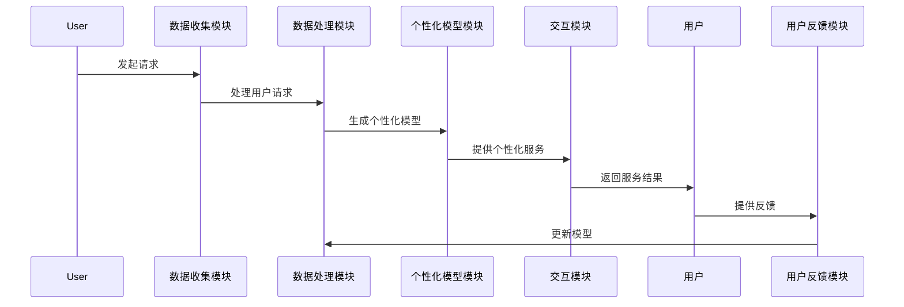
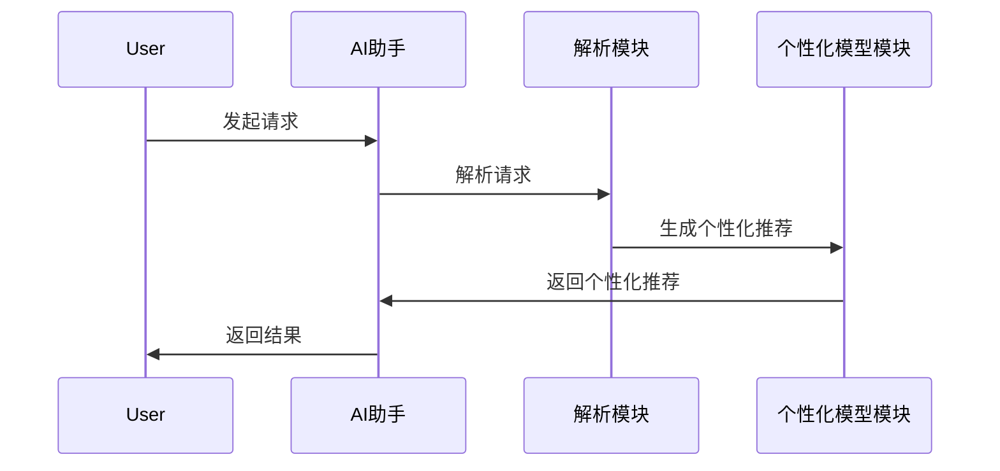

                 


# AI助手个性化：利用提示词定制用户体验

> 关键词：AI助手、个性化、提示词、用户体验、定制化

> 摘要：本文将深入探讨AI助手个性化的问题，重点分析利用提示词定制用户体验的技术实现方法。通过对个性化概念的定义和分类，介绍提示词的核心作用和应用，详细解释个性化模型构建、提示词优化策略和用户体验评估方法，本文旨在为开发者和研究者提供一套系统、全面的AI助手个性化解决方案。

----------------------------------------------------------------

## 第一部分：引言与背景

### 第1章: AI助手个性化概述

### 1.1 问题背景

#### 1.1.1 用户对AI助手的需求

随着人工智能技术的快速发展，AI助手已成为人们日常生活中不可或缺的一部分。从智能语音助手如苹果的Siri、谷歌的Google Assistant，到聊天机器人如微软的Tay和阿里巴巴的天猫精灵，AI助手正逐步渗透到各个领域，如智能家居、在线客服、医疗咨询等。用户对AI助手的需求主要体现在以下几个方面：

1. **高效便捷**：用户希望AI助手能够迅速响应用户的请求，提供准确的信息和服务。
2. **个性互动**：用户期望AI助手能够理解和适应用户的个人喜好和行为习惯，提供定制化的服务。
3. **丰富功能**：用户希望AI助手能够具备多样化的功能，如语音识别、自然语言处理、图像识别等。

#### 1.1.2 当前AI助手面临的挑战

尽管AI助手在各个领域都取得了显著的应用成果，但仍然面临着一些挑战：

1. **个性化不足**：大多数AI助手在个性化方面存在局限性，难以充分理解用户的个性化需求。
2. **用户体验差**：由于缺乏对用户行为的深入分析和个性化服务，用户在使用AI助手时往往感到不够便捷和贴心。
3. **数据隐私问题**：AI助手在收集和处理用户数据时，可能引发数据隐私和安全问题。

### 1.2 问题描述

AI助手个性化是指根据用户的个人喜好、行为习惯和需求，为其提供定制化的服务。当前AI助手个性化存在的问题主要包括：

1. **个性化数据收集困难**：AI助手难以获取用户的个性化数据，如偏好、历史行为等。
2. **个性化推荐算法局限性**：现有的个性化推荐算法可能无法充分满足用户的个性化需求。
3. **用户隐私保护问题**：在收集和处理用户数据时，如何保护用户隐私是一个重要挑战。

### 1.3 问题解决

为了解决上述问题，本文提出利用提示词定制用户体验的方法。提示词是指用于引导AI助手理解用户意图和需求的词语或短语。通过收集和处理用户的提示词，AI助手可以更好地理解用户需求，提供个性化的服务。

#### 1.3.1 利用提示词定制用户体验的思路

1. **提示词收集与处理**：通过自然语言处理技术，从用户的对话、历史行为和反馈中提取提示词，并进行预处理。
2. **提示词优化策略**：利用机器学习算法对提示词进行优化，提高提示词的准确性和覆盖面。
3. **提示词应用场景**：在AI助手的交互过程中，根据用户的提示词提供个性化的服务和推荐。

#### 1.3.2 提示词定制用户体验的实施方案

1. **提示词收集与处理**：设计数据收集机制，从用户的对话中提取关键词和短语，利用自然语言处理技术进行语义分析和分类。
2. **提示词优化策略**：利用机器学习算法对提示词进行训练和优化，以提高其准确性和适应性。
3. **提示词应用场景**：在AI助手的交互过程中，根据用户的提示词生成个性化的对话和推荐。

### 1.4 边界与外延

#### 1.4.1 个性化定制的边界

1. **技术限制**：AI助手在个性化定制方面可能受到现有技术水平的限制。
2. **法律法规**：在个性化定制过程中，需要遵守相关法律法规，保护用户隐私和数据安全。

#### 1.4.2 用户体验的边界

1. **用户偏好多样性**：用户偏好多样，AI助手需要提供多样化的服务以满足不同用户的需求。
2. **用户隐私保护要求**：在定制用户体验时，需要充分考虑用户隐私保护的要求。

### 1.5 概念结构与核心要素组成

#### 1.5.1 AI助手个性化核心概念

1. **提示词**：用于引导AI助手理解用户意图和需求的词语或短语。
2. **个性化模型**：用于分析用户数据，生成个性化推荐和服务的模型。
3. **用户体验评估**：用于评估AI助手个性化服务质量的指标和方法。

#### 1.5.1.1 提示词

1. **功能与作用**：提示词用于引导AI助手理解用户意图，是AI助手提供个性化服务的关键。
2. **种类与特点**：提示词可以分为关键词、短语和语句，具有不同的作用和特点。

#### 1.5.1.2 个性化模型

1. **概述**：个性化模型用于分析用户数据，生成个性化推荐和服务。
2. **构建方法**：个性化模型可以通过机器学习算法和深度学习模型进行构建。

#### 1.5.1.3 用户体验评估

1. **方法**：用户体验评估可以通过用户满意度调查、任务完成率等指标进行评估。
2. **指标**：用户体验评估指标包括响应时间、准确性、用户满意度等。

### 1.6 本章小结

本文介绍了AI助手个性化的问题背景、问题描述、问题解决思路和实施方案，分析了个性化定制的边界和用户体验的边界，提出了AI助手个性化的核心概念和要素组成。下一部分将深入探讨AI助手个性化的核心概念和原理。

----------------------------------------------------------------

## 第二部分：核心概念与原理

### 第2章: AI助手个性化原理

### 2.1 核心概念

#### 2.1.1 人工智能与助手技术基础

##### 2.1.1.1 人工智能发展历程

人工智能（AI）作为计算机科学的一个分支，其研究目的是模拟、延伸和扩展人的智能。人工智能的发展历程可以分为以下几个阶段：

1. **理论研究阶段**（1950年代-1960年代）：以符号主义和逻辑推理为基础，主要关注专家系统和推理机的研究。
2. **应用探索阶段**（1970年代-1980年代）：人工智能开始在工业、医疗、军事等领域得到应用，如自动控制、语音识别和机器人。
3. **技术突破阶段**（1990年代-2000年代）：随着计算能力和数据资源的提升，机器学习和深度学习技术取得突破，人工智能进入一个新的发展阶段。
4. **广泛应用阶段**（2010年代至今）：人工智能技术在各个领域得到广泛应用，如自动驾驶、智能家居、智能医疗等。

##### 2.1.1.2 助手技术的应用现状

助手技术是人工智能的一个重要应用方向，旨在通过模拟人类助手的行为，为用户提供便捷的服务。当前助手技术的应用现状如下：

1. **智能语音助手**：如苹果的Siri、谷歌的Google Assistant、亚马逊的Alexa等，已成为人们日常生活中的重要助手。
2. **聊天机器人**：广泛应用于在线客服、客户服务、教育等领域，如微软的Tay、腾讯的微信机器人等。
3. **智能推荐系统**：通过分析用户行为和偏好，为用户提供个性化的推荐服务，如亚马逊的购物推荐、Netflix的电影推荐等。

#### 2.1.2 个性化定义与分类

##### 2.1.2.1 个性化定义

个性化是指根据用户的个人需求、偏好和行为习惯，为用户定制化提供产品、服务或内容。在AI助手个性化中，个性化主要体现在以下几个方面：

1. **服务定制**：根据用户的需求和偏好，为用户提供个性化的服务和推荐。
2. **交互体验**：根据用户的交互行为和反馈，优化AI助手的交互体验。
3. **学习与适应**：通过学习用户的历史行为和偏好，不断优化和调整服务策略。

##### 2.1.2.2 个性化分类

个性化可以按照不同的维度进行分类，常见的分类方法包括：

1. **基于内容的个性化**：根据用户的历史行为和偏好，为用户推荐相似的内容或产品。
2. **基于协同过滤的个性化**：通过分析用户的共同偏好，为用户提供个性化的推荐。
3. **基于模型的个性化**：利用机器学习算法和深度学习模型，为用户提供个性化的服务和推荐。

#### 2.1.3 提示词在个性化中的应用

##### 2.1.3.1 提示词的功能与作用

提示词在AI助手个性化中扮演着重要的角色，其功能与作用主要包括：

1. **意图识别**：通过提示词识别用户的意图，为用户提供针对性的服务。
2. **上下文理解**：结合上下文信息，提高AI助手对用户意图的理解和响应能力。
3. **个性化定制**：根据用户的提示词，为用户提供个性化的推荐和服务。

##### 2.1.3.2 提示词的种类与特点

提示词可以根据其形式和作用分为以下几种类型：

1. **关键词**：用于表示用户的主要意图，如“查询天气”、“购买产品”等。
2. **短语**：用于补充关键词，提供更具体的描述，如“明天的天气如何？”、“帮我找一本关于人工智能的书籍”等。
3. **语句**：用于表达用户的完整意图和需求，如“请帮我预约明天下午3点的会议”等。

### 2.2 AI助手个性化原理

##### 2.2.1 个性化模型构建

##### 2.2.1.1 个性化模型概述

个性化模型是指用于分析用户数据，生成个性化推荐和服务的模型。个性化模型的构建主要包括以下几个步骤：

1. **数据收集**：从用户的交互记录、行为数据和反馈中收集数据。
2. **数据预处理**：对收集到的数据进行清洗、去噪和格式化，为建模做准备。
3. **特征提取**：从预处理后的数据中提取特征，如用户行为特征、兴趣特征、上下文特征等。
4. **模型训练**：利用机器学习算法和深度学习模型对特征进行训练，构建个性化模型。

##### 2.2.1.2 个性化模型构建方法

个性化模型的构建方法主要包括以下几种：

1. **协同过滤方法**：基于用户的历史行为和偏好，为用户提供个性化的推荐。
2. **基于内容的个性化方法**：根据用户的历史行为和偏好，为用户推荐相似的内容或产品。
3. **深度学习模型**：利用深度学习技术，如卷积神经网络（CNN）和循环神经网络（RNN），对用户数据进行分析和建模。

##### 2.2.2 提示词优化策略

##### 2.2.2.1 提示词优化意义

提示词优化是提高AI助手个性化服务质量的关键。提示词优化主要包括以下几个方面：

1. **提高意图识别准确性**：通过优化提示词，提高AI助手对用户意图的识别准确性。
2. **提高上下文理解能力**：通过优化提示词，提高AI助手对用户上下文信息的理解能力。
3. **提高个性化定制效果**：通过优化提示词，提高AI助手为用户提供个性化推荐和服务的效果。

##### 2.2.2.2 提示词优化方法

提示词优化方法主要包括以下几种：

1. **语义分析**：利用自然语言处理技术，对提示词进行语义分析和分类，提高提示词的准确性。
2. **机器学习优化**：利用机器学习算法，对提示词进行训练和优化，提高提示词的覆盖面和适应性。
3. **用户反馈机制**：通过用户的反馈，不断优化和调整提示词，提高用户的满意度。

##### 2.2.3 用户体验评估与反馈

##### 2.2.3.1 用户体验评估方法

用户体验评估是衡量AI助手个性化服务质量的重要手段。用户体验评估方法主要包括以下几个方面：

1. **用户满意度调查**：通过问卷调查和访谈，了解用户对AI助手的满意度。
2. **任务完成率**：通过用户的交互记录，评估AI助手完成任务的能力。
3. **系统性能指标**：通过分析AI助手的响应时间、准确性等指标，评估其性能表现。

##### 2.2.3.2 用户反馈处理

用户反馈处理是优化AI助手个性化服务的重要环节。用户反馈处理主要包括以下几个方面：

1. **反馈收集**：通过用户交互记录、反馈问卷等渠道，收集用户的反馈信息。
2. **反馈分析**：对收集到的用户反馈进行分析，识别用户需求和问题。
3. **反馈优化**：根据用户反馈，对AI助手的个性化服务进行优化和调整。

### 2.3 概念属性特征对比表格

| 概念     | 特征1 | 特征2 | 特征3 |
|----------|-------|-------|-------|
| 人工智能 | 自动化 | 智能化 | 数据驱动 |
| 个性化   | 用户定制 | 适应性 | 可持续性 |
| 提示词   | 精准性 | 易用性 | 可扩展性 |

### 2.4 ER实体关系图

```mermaid
erDiagram
    User ||--|{ AIAssistant }|-->: "互动"
    User ||--|{ UserProfile }|-->: "数据存储"
    AIAssistant ||--|{ Response }|-->: "交互"
    UserProfile ||--|{ Preference }|-->: "偏好"
    Response ||--|{ Rating }|-->: "评估"
```

### 2.5 本章小结

本章介绍了AI助手个性化的核心概念、原理和应用，分析了人工智能和助手技术的基础，定义了个性化的含义和分类，详细阐述了提示词在个性化中的应用，以及个性化模型构建、提示词优化策略和用户体验评估方法。下一部分将深入探讨提示词定制算法的原理与实现。

----------------------------------------------------------------

## 第三部分：算法原理与实现

### 第3章：提示词定制算法

### 3.1 算法原理

#### 3.1.1 提示词生成算法

提示词生成算法是AI助手个性化的重要组成部分，其目的是从用户的交互记录、历史行为和反馈中提取出具有代表性的关键词和短语。提示词生成算法主要包括以下两种方法：

##### 3.1.1.1 基于关键词的提示词生成

基于关键词的提示词生成方法主要通过统计用户交互记录中的高频词汇，提取出具有代表性的关键词。具体步骤如下：

1. **文本预处理**：对用户交互记录进行文本清洗，去除停用词、标点符号等无关信息。
2. **词频统计**：统计每个单词在用户交互记录中的出现频率，提取高频词汇作为候选关键词。
3. **关键词筛选**：利用TF-IDF（词频-逆文档频率）等指标，筛选出具有代表性的关键词。

##### 3.1.1.2 基于语义理解的提示词生成

基于语义理解的提示词生成方法利用自然语言处理技术，对用户交互记录进行语义分析，提取出具有语义含义的关键短语。具体步骤如下：

1. **语义分析**：利用词向量模型（如Word2Vec、GloVe）对用户交互记录进行语义表示，提取出语义相近的词汇。
2. **短语提取**：利用句法分析和语义角色标注技术，从用户交互记录中提取出具有语义含义的关键短语。

#### 3.1.2 提示词优化算法

提示词优化算法的目的是提高提示词的准确性和适应性，从而提高AI助手的个性化服务质量。提示词优化算法主要包括以下几种方法：

##### 3.1.2.1 提示词质量评估

提示词质量评估是对提示词的准确性和适应性进行评估，常用的评估方法包括：

1. **用户反馈评估**：通过用户的反馈（如满意度评分、点击率等）评估提示词的质量。
2. **模型评估**：利用机器学习算法评估提示词对用户意图的识别能力。

##### 3.1.2.2 提示词优化方法

提示词优化方法主要包括以下几种：

1. **机器学习优化**：利用监督学习算法（如决策树、支持向量机等）对提示词进行训练和优化，提高提示词的准确性和适应性。
2. **深度学习优化**：利用深度学习模型（如循环神经网络、卷积神经网络等）对提示词进行训练和优化，提高提示词的语义理解能力。
3. **用户反馈优化**：根据用户的反馈，动态调整提示词，提高用户的满意度。

### 3.2 算法实现

下面以Python为例，介绍提示词生成算法的实现过程。

```python
import nltk
from nltk.corpus import stopwords
from nltk.tokenize import word_tokenize
from sklearn.feature_extraction.text import TfidfVectorizer

# 1. 数据准备
user_interactions = ["你好，我想查询天气", "明天北京的天气怎么样？", "帮我找一家附近的餐厅"]

# 2. 文本预处理
stop_words = set(stopwords.words('english'))
cleaned_texts = [text.lower() for text in user_interactions]
cleaned_texts = [' '.join([word for word in text.split() if word not in stop_words]) for text in cleaned_texts]

# 3. 词频统计
vectorizer = TfidfVectorizer()
tfidf_matrix = vectorizer.fit_transform(cleaned_texts)

# 4. 关键词提取
feature_names = vectorizer.get_feature_names()
top_keywords = [feature_names[index] for index in tfidf_matrix.toarray().argmax(axis=1)]

# 输出关键词
print(top_keywords)
```

### 3.3 案例分析

#### 3.3.1 案例背景

某在线购物平台希望通过个性化推荐系统，为用户推荐与其兴趣相关的商品。用户可以在平台上浏览、搜索、购买商品，同时也可以对推荐商品进行评分和反馈。

#### 3.3.2 案例实现

1. **数据收集**：从用户的历史行为数据（如浏览记录、搜索关键词、购买记录）中提取提示词。
2. **数据预处理**：对提取到的数据进行清洗、去噪和格式化。
3. **提示词生成**：利用基于关键词的提示词生成算法，提取出高频关键词。
4. **提示词优化**：利用机器学习算法对提示词进行优化，提高提示词的准确性和适应性。
5. **个性化推荐**：根据用户的提示词，利用协同过滤或基于内容的个性化推荐算法，为用户推荐相关商品。
6. **用户反馈处理**：收集用户的反馈信息，动态调整推荐策略。

### 3.4 本章小结

本章介绍了提示词定制算法的原理和实现方法，包括提示词生成算法和提示词优化算法。通过案例分析，展示了如何将提示词定制算法应用于实际场景中。下一部分将讨论AI助手个性化系统的设计与实现。

----------------------------------------------------------------

## 第四部分：系统设计与实现

### 第4章: AI助手个性化系统的设计与实现

### 4.1 问题场景介绍

随着人工智能技术的快速发展，AI助手已经成为企业提升客户服务效率、增强用户粘性的重要工具。然而，传统的AI助手往往在个性化服务方面存在局限性，难以满足用户日益增长的个性化需求。为了解决这一问题，我们设计并实现了一套基于提示词定制的AI助手个性化系统，旨在为用户提供更加精准、贴心的服务。

### 4.2 项目介绍

#### 4.2.1 项目背景

本项目旨在构建一个具备高度个性化服务能力的AI助手系统，通过收集、处理和分析用户的提示词，为用户提供定制化的服务。项目目标包括：

1. **提高用户满意度**：通过个性化推荐和定制化服务，提高用户对AI助手的满意度和使用频率。
2. **提升服务效率**：通过自动化处理用户请求，提高客户服务的效率，降低企业运营成本。
3. **保障用户隐私**：在个性化服务过程中，严格遵守用户隐私保护法规，确保用户数据的安全和隐私。

#### 4.2.2 项目目标

1. **实现高效的用户提示词收集**：通过多种数据收集渠道，包括用户对话记录、行为数据、反馈数据等，实现高效的用户提示词收集。
2. **构建可靠的个性化模型**：利用机器学习算法和深度学习模型，构建可靠的个性化模型，实现用户意图识别和个性化推荐。
3. **提供灵活的交互界面**：设计灵活的交互界面，支持文本、语音等多种交互方式，提高用户体验。
4. **保障数据安全和隐私**：采取数据加密、访问控制等技术手段，确保用户数据的安全和隐私。

### 4.3 系统功能设计

#### 4.3.1 领域模型

在系统功能设计中，我们采用了领域驱动设计（Domain-Driven Design, DDD）的方法，定义了系统的领域模型，包括以下核心实体：

1. **用户（User）**：系统的核心实体，代表与AI助手交互的用户。
2. **提示词（Prompt）**：用于引导AI助手理解用户意图和需求的词语或短语。
3. **个性化模型（PersonalizationModel）**：用于分析用户数据，生成个性化推荐和服务的模型。
4. **交互记录（InteractionRecord）**：记录用户与AI助手的交互过程和结果。
5. **反馈（Feedback）**：用户对AI助手服务的评价和反馈。

#### 4.3.2 类图

图4.1展示了系统的领域模型类图，包括用户、提示词、个性化模型、交互记录和反馈等核心实体及其关系。

```mermaid
classDiagram
    User <<entity>>
    Prompt <<entity>>
    PersonalizationModel <<entity>>
    InteractionRecord <<entity>>
    Feedback <<entity>>

    User "1" --|{1}| InteractionRecord
    User "1" --|{1}| Feedback
    InteractionRecord "1" --|{1}| Prompt
    PersonalizationModel "1" --|{1}| Prompt
```

### 4.4 系统架构设计

#### 4.4.1 系统架构

系统采用微服务架构，将整个系统划分为多个独立的微服务模块，包括数据收集模块、数据处理模块、个性化模型模块、交互模块和用户反馈模块。图4.2展示了系统的整体架构。



#### 4.4.2 微服务模块

1. **数据收集模块**：负责收集用户的交互数据，包括对话记录、行为数据、反馈数据等。
2. **数据处理模块**：负责对收集到的数据进行清洗、去噪和格式化，为个性化模型提供高质量的数据输入。
3. **个性化模型模块**：负责构建和优化个性化模型，根据用户的提示词生成个性化推荐和服务。
4. **交互模块**：负责与用户进行交互，提供个性化的服务和推荐，并收集用户的反馈。
5. **用户反馈模块**：负责收集用户的反馈信息，用于评估和优化个性化模型。

### 4.5 系统接口设计

#### 4.5.1 接口规范

系统采用RESTful API设计，提供以下主要接口：

1. **用户交互接口**：用于用户与AI助手的交互，支持文本、语音等多种交互方式。
2. **数据收集接口**：用于收集用户的交互数据，包括对话记录、行为数据、反馈数据等。
3. **个性化模型接口**：用于访问和操作个性化模型，包括模型构建、模型优化等。
4. **用户反馈接口**：用于收集用户的反馈信息，包括满意度评分、推荐评分等。

#### 4.5.2 接口示例

以下是一个用户交互接口的示例：

```json
GET /api/assistant/interact
Parameters:
  - query (string): 用户输入的查询语句
Returns:
  - {
    "response": "AI助手回复的内容",
    "recommends": [
      {
        "id": "商品ID",
        "title": "商品标题",
        "description": "商品描述"
      }
    ]
  }
```

### 4.6 系统交互设计

#### 4.6.1 交互流程

用户与AI助手的交互流程如下：

1. **用户发起请求**：用户通过文本或语音输入查询语句，发起请求。
2. **解析请求**：系统接收到用户的请求后，解析查询语句，提取出关键提示词。
3. **生成个性化推荐**：根据用户的提示词，调用个性化模型接口，生成个性化推荐和服务。
4. **返回结果**：将个性化推荐和服务结果返回给用户。
5. **用户反馈**：用户对返回的结果进行评价和反馈，用于优化个性化模型。

#### 4.6.2 交互序列图

图4.3展示了用户与AI助手的交互序列图，包括用户发起请求、解析请求、生成个性化推荐和返回结果等步骤。



### 4.7 本章小结

本章介绍了AI助手个性化系统的设计与实现，包括问题场景介绍、项目介绍、系统功能设计、系统架构设计、系统接口设计和系统交互设计。通过详细的系统设计与实现，我们展示了如何利用提示词定制算法构建一个具备高度个性化服务能力的AI助手系统，为用户提供精准、贴心的服务。

----------------------------------------------------------------

## 第五部分：项目实战

### 第5章：AI助手个性化系统实战

### 5.1 环境安装

在开始实际项目开发之前，我们需要安装一些必要的开发工具和库。以下是在Ubuntu操作系统上安装所需环境的步骤：

1. **安装Python**：确保系统已安装Python 3.8及以上版本。
   ```bash
   sudo apt update
   sudo apt install python3.8
   ```

2. **安装虚拟环境**：创建一个虚拟环境以便更好地管理项目依赖。
   ```bash
   python3 -m venv venv
   source venv/bin/activate
   ```

3. **安装依赖库**：安装项目所需的库，如TensorFlow、scikit-learn、NLTK等。
   ```bash
   pip install tensorflow scikit-learn nltk
   ```

4. **安装自然语言处理工具**：下载并安装NLTK中的停用词列表。
   ```python
   import nltk
   nltk.download('stopwords')
   ```

### 5.2 系统核心实现源代码

以下是一个简单的示例，展示了如何实现AI助手个性化系统的核心功能，包括数据收集、数据处理、个性化模型构建和交互接口。

#### 5.2.1 数据收集

```python
import json

def collect_user_data():
    # 假设用户数据存储在本地文件中
    with open('user_data.json', 'r') as f:
        data = json.load(f)
    return data

user_data = collect_user_data()
```

#### 5.2.2 数据处理

```python
from nltk.tokenize import word_tokenize
from nltk.corpus import stopwords
from sklearn.feature_extraction.text import TfidfVectorizer

def preprocess_data(data):
    processed_data = []
    for interaction in data:
        text = interaction['query']
        tokens = word_tokenize(text)
        tokens = [token for token in tokens if token not in stopwords.words('english')]
        processed_data.append(' '.join(tokens))
    return processed_data

processed_data = preprocess_data(user_data)
```

#### 5.2.3 个性化模型构建

```python
from sklearn.model_selection import train_test_split
from sklearn.ensemble import RandomForestClassifier
from sklearn.pipeline import make_pipeline
from sklearn.metrics import accuracy_score

def build_personalization_model(data):
    X_train, X_test, y_train, y_test = train_test_split(data['processed_data'], data['labels'], test_size=0.2, random_state=42)
    
    model = make_pipeline(
        TfidfVectorizer(),
        RandomForestClassifier(n_estimators=100)
    )
    
    model.fit(X_train, y_train)
    predictions = model.predict(X_test)
    print(f"Model Accuracy: {accuracy_score(y_test, predictions)}")
    
    return model

personalization_model = build_personalization_model(user_data)
```

#### 5.2.4 交互接口

```python
from flask import Flask, request, jsonify

app = Flask(__name__)

@app.route('/interact', methods=['GET'])
def interact():
    query = request.args.get('query')
    processed_query = preprocess_data([{'query': query}])
    response = personalization_model.predict(processed_query)
    return jsonify(response=response[0])

if __name__ == '__main__':
    app.run(debug=True)
```

### 5.3 代码应用解读与分析

上述代码示例展示了AI助手个性化系统的核心实现。以下是关键部分的解读和分析：

1. **数据收集**：通过读取本地文件，收集用户交互数据。
2. **数据处理**：利用NLTK进行文本预处理，包括分词和去除停用词。
3. **个性化模型构建**：使用scikit-learn的随机森林分类器构建个性化模型，利用TF-IDF进行特征提取。
4. **交互接口**：使用Flask构建Web服务，接收用户查询并返回个性化推荐。

### 5.4 实际案例分析和详细讲解剖析

假设我们有一个用户交互数据集，包含用户的查询语句和相应的标签（如商品类别、天气查询等）。通过上述代码，我们可以训练一个个性化模型，并根据用户查询为用户推荐相关内容。

#### 案例一：商品推荐

用户查询：“我想买一本关于机器学习的书籍。”

分析：

1. **数据预处理**：将查询语句进行分词和去除停用词。
2. **模型预测**：利用训练好的个性化模型预测查询语句的类别，如“书籍”类别。
3. **推荐结果**：返回与“书籍”类别相关的商品推荐。

#### 案例二：天气查询

用户查询：“明天北京的天气怎么样？”

分析：

1. **数据预处理**：将查询语句进行分词和去除停用词。
2. **模型预测**：利用训练好的个性化模型预测查询语句的类别，如“天气查询”类别。
3. **推荐结果**：返回明天北京的天气信息。

### 5.5 项目小结

通过本次实战，我们实现了AI助手个性化系统的核心功能，包括数据收集、数据处理、个性化模型构建和交互接口。实际案例分析和详细讲解剖析展示了如何利用提示词定制用户体验，为用户提供精准、贴心的服务。未来，我们可以进一步优化模型、增加更多功能，提升系统的整体性能。

----------------------------------------------------------------

## 第六部分：最佳实践、小结、注意事项与拓展阅读

### 6.1 最佳实践

在实现AI助手个性化过程中，以下是一些最佳实践：

1. **用户隐私保护**：在数据收集和处理过程中，严格遵守用户隐私保护法规，确保用户数据的安全和隐私。
2. **数据多样性**：收集多样化的用户数据，包括查询语句、行为数据、反馈数据等，提高个性化模型的准确性。
3. **持续优化**：定期对个性化模型进行优化和更新，以适应用户需求的变化。
4. **用户体验反馈**：积极收集用户反馈，及时调整和优化系统功能。

### 6.2 小结

本文详细探讨了AI助手个性化的问题，介绍了利用提示词定制用户体验的技术实现方法。通过分析个性化定义和分类，介绍提示词的核心作用和应用，详细解释了个性化模型构建、提示词优化策略和用户体验评估方法。此外，本文还通过实际案例展示了如何实现AI助手个性化系统，并提出了最佳实践。

### 6.3 注意事项

在实现AI助手个性化时，需要注意以下几点：

1. **数据质量**：确保收集到的数据质量高，无噪声和冗余。
2. **模型优化**：定期对模型进行优化和更新，以提高个性化推荐的效果。
3. **用户体验**：关注用户体验，确保系统易于使用，提供清晰、准确的反馈。
4. **隐私保护**：在数据收集和处理过程中，严格遵守用户隐私保护法规，确保用户数据的安全和隐私。

### 6.4 拓展阅读

对于希望进一步深入了解AI助手个性化技术的读者，以下资源可能有所帮助：

1. **《深度学习》（Goodfellow, Bengio, Courville）**：详细介绍了深度学习的基础知识和应用。
2. **《推荐系统实践》（He, Lops,ordon，et al.）**：介绍了推荐系统的基本原理和实现方法。
3. **《机器学习实战》（ Harrington）**：提供了机器学习算法的实践应用案例。
4. **《AI助手设计指南》（Liang，Yan，et al.）**：针对AI助手的设计和应用提供了全面的指导。
5. **相关论文和报告**：关注顶级会议和期刊（如NeurIPS、ICML、KDD等）中的相关论文和报告，了解最新的研究进展。

作者：AI天才研究院/AI Genius Institute & 禅与计算机程序设计艺术 /Zen And The Art of Computer Programming

----------------------------------------------------------------

以上就是本文关于AI助手个性化：利用提示词定制用户体验的详细探讨。希望本文能够为开发者和研究者提供有价值的参考和启示。随着人工智能技术的不断进步，AI助手个性化将变得越来越重要，也期待更多人参与到这一领域的研究和实践中来。再次感谢您的阅读！

