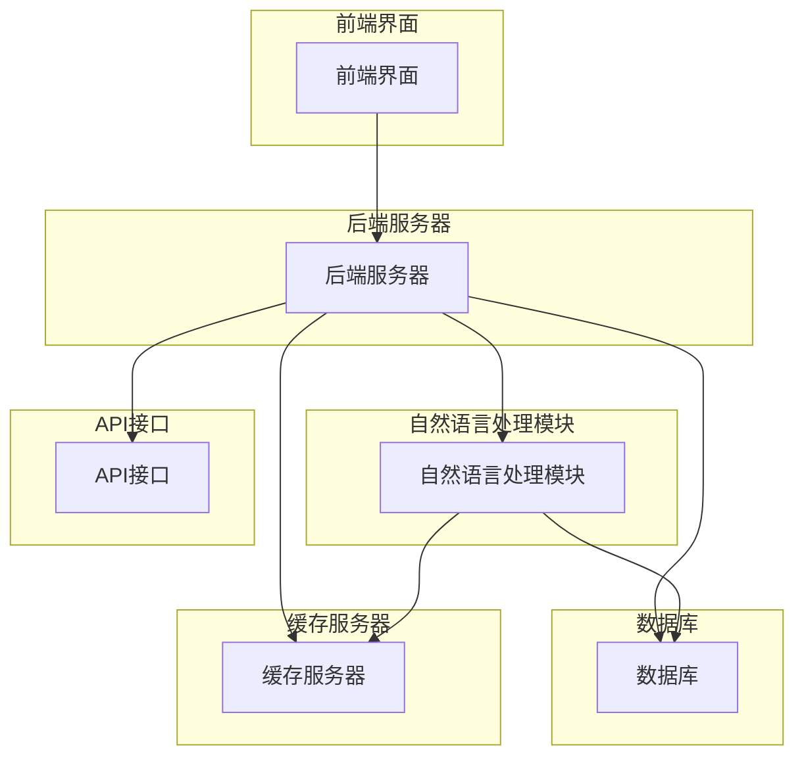
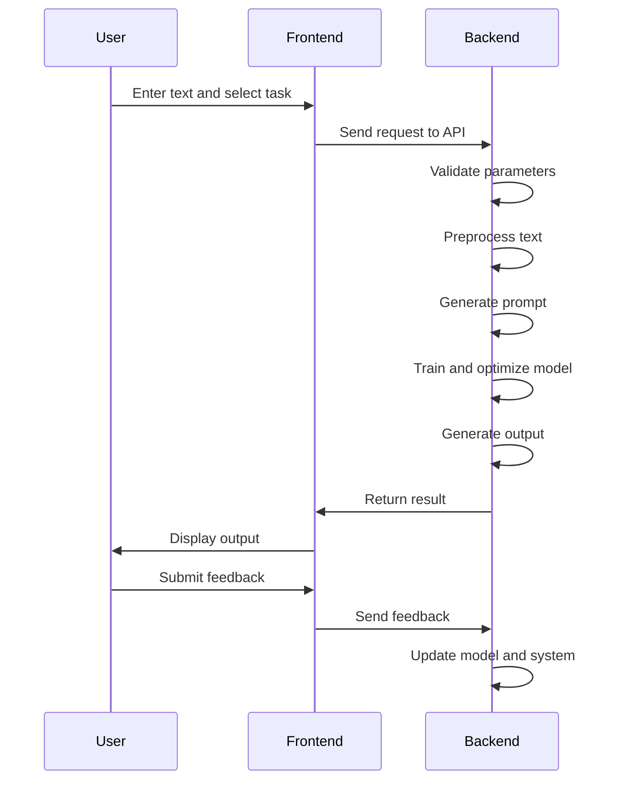

                 

### AI大模型背景与概述

#### 1.1 问题背景

人工智能（AI）的发展历程可以追溯到20世纪50年代，随着计算机科学和数学的进步，AI领域经历了数次起伏。从最初的理论构想，到后来在特定任务上的突破，再到近年来深度学习、神经网络等技术的飞速发展，AI已经逐渐从学术研究领域走向了实际应用，成为推动社会发展的重要力量。大模型（Large-scale Models）作为AI发展的一个重要方向，应运而生。

大模型的发展并非偶然，而是有其深刻的背景。首先，计算能力的提升为训练和运行这些复杂模型提供了可能。从早期的CPU，到GPU，再到近年来TPU等专用硬件的兴起，计算资源的迅速增长使得大模型的训练和优化变得更加高效。其次，数据的积累为训练大模型提供了丰富的素材。互联网的普及和大数据技术的发展，使得我们可以获取到海量的数据，这些数据为模型提供了丰富的训练资源。最后，算法的进步为构建和优化大模型提供了理论基础和方法支持。从传统的机器学习方法，到深度学习的兴起，再到生成对抗网络（GAN）等新算法的出现，每一次算法的进步都为大模型的构建提供了新的可能性。

在此背景下，大模型得到了广泛关注和应用。例如，自然语言处理（NLP）领域的预训练模型，如GPT系列、BERT等，已经取得了显著的成果。在图像识别、语音识别、推荐系统等领域，大模型也展现出了强大的能力。然而，大模型的应用不仅仅局限于这些领域，它还在诸如生物信息学、金融预测、医疗诊断等领域展现出了巨大的潜力。

#### 1.2 问题描述

大模型，顾名思义，是指那些规模庞大的机器学习模型。这些模型通常包含了数亿甚至数十亿的参数，能够在海量的数据上进行训练。与传统的机器学习模型相比，大模型具有更强的泛化能力和更高的准确性。然而，大模型的应用并非一帆风顺，其中涉及到诸多问题和挑战。

首先，大模型的训练和部署需要大量的计算资源和存储资源。这意味着，运行大模型需要高性能的硬件设备，如GPU、TPU等，以及大规模的数据中心。此外，大模型的训练过程非常耗时，可能需要数天甚至数周的时间。这对于许多实际应用场景来说，是一个巨大的挑战。

其次，大模型的复杂性和黑箱特性使得其可解释性较低。尽管大模型在某些任务上取得了显著的成果，但其内部的工作机制仍然不清晰，难以理解和解释。这给大模型的应用带来了一定的风险，特别是在需要保证模型可解释性的领域，如医疗诊断、金融风险评估等。

最后，大模型的训练和部署需要大量的数据。数据的质量和多样性直接影响模型的性能。然而，获取高质量、多样化的数据并非易事，特别是在数据隐私和保护日益受到重视的今天，数据获取的难度更大。

#### 1.3 问题解决

为了解决上述问题，我们需要从多个方面入手。

首先，提升计算资源的利用效率。通过优化算法、并行计算、分布式训练等方法，可以有效地降低大模型的训练和部署成本。例如，近年来出现的混合精度训练（Mixed Precision Training）方法，通过使用浮点数的小数部分来加速计算，显著提高了训练速度。

其次，提高大模型的可解释性。尽管大模型具有强大的能力，但其内部机制的不透明性仍然是一个亟待解决的问题。为此，研究者们提出了多种方法，如注意力机制（Attention Mechanism）、模型可解释性工具（如LIME、SHAP）等，旨在提高大模型的可解释性。

最后，优化数据收集和预处理方法。通过数据增强、数据清洗、数据标准化等方法，可以提高数据的质量和多样性，从而提升大模型的性能。同时，需要关注数据隐私和保护的问题，采用差分隐私（Differential Privacy）等技术来保护用户隐私。

#### 1.4 边界与外延

大模型的边界主要涉及以下几个方面：

1. **计算资源限制**：尽管计算资源不断提升，但大模型的训练和部署仍然需要大量计算资源。这限制了某些场景下大模型的应用。

2. **数据依赖性**：大模型的性能高度依赖于数据。数据的质量和多样性直接影响大模型的性能。因此，在数据获取和处理方面需要投入大量精力。

3. **模型可解释性**：大模型往往具有复杂的内部结构，其工作原理不易理解。这给大模型的应用带来了一定的挑战。

大模型的外延则体现在以下几个方面：

1. **跨领域应用**：大模型不仅在传统的计算机视觉、自然语言处理等领域有广泛应用，还在诸如生物信息学、金融预测、医疗诊断等跨领域展现出了巨大的潜力。

2. **模型定制化**：随着大模型的普及，越来越多的企业和研究机构开始尝试将其应用于自己的业务场景。这促使了模型定制化的需求，即针对特定领域和任务，对大模型进行微调和优化。

3. **模型融合**：大模型与其他模型的融合，如传统机器学习模型、强化学习模型等，可以进一步拓展大模型的应用范围。

#### 1.5 概念结构与核心要素组成

大模型的概念结构可以分解为以下几个核心要素：

1. **数据**：数据是大模型的基础。高质量、多样化的数据能够提升大模型的性能。

2. **算法**：算法决定了大模型的结构和训练方法。常见的算法包括深度学习、生成对抗网络（GAN）等。

3. **硬件**：硬件是运行大模型的关键。高性能的GPU、TPU等硬件设备能够加速大模型的训练和部署。

4. **模型**：模型是具体实现，包括网络结构、参数等。常见的模型有GPT、BERT等。

5. **可解释性**：可解释性是大模型应用的一个重要方面。通过提高模型的可解释性，可以更好地理解和应用大模型。

这些核心要素相互作用，共同构成了大模型的基本框架。通过优化这些要素，可以进一步提升大模型的能力和应用范围。

### AI大模型原理

#### 2.1 大模型的核心概念

大模型（Large-scale Model）是机器学习领域中的一个重要概念，它通常指的是具有数亿甚至数十亿参数的复杂机器学习模型。这些模型通过在海量数据上训练，能够学习到数据中的潜在结构和规律，从而在多个任务上展现出强大的性能。

在大模型的范畴内，有几种常见的模型结构，每种结构都有其独特的特点和应用场景。

1. **神经网络**：神经网络（Neural Network）是机器学习中最基础的结构之一。它由一系列神经元组成，每个神经元都与其他神经元相连，形成一个复杂的网络。神经网络通过学习输入和输出之间的映射关系，可以应用于分类、回归、生成等任务。

2. **变分自编码器**：变分自编码器（Variational Autoencoder，VAE）是一种生成模型。它通过学习输入数据的潜在分布，能够生成具有类似真实数据的新数据。VAE在图像生成、数据增强等方面有着广泛的应用。

3. **生成对抗网络**：生成对抗网络（Generative Adversarial Network，GAN）由生成器和判别器两部分组成。生成器试图生成逼真的数据，而判别器则判断数据是真实还是生成的。通过这种对抗性的训练，GAN能够生成高质量、多样化的数据。

#### 2.2 大模型的属性特征对比表格

下面是一个简化的对比表格，展示了几种常见大模型的属性特征：

| 模型类型     | 网络结构  | 特点                      | 应用场景            |
| ------------ | ---------- | ------------------------- | ------------------- |
| 神经网络     | 层叠神经网络 | 参数多、泛化能力强          | 分类、回归、生成等  |
| 变分自编码器 | 编码器-解码器 | 学习潜在分布、生成数据      | 图像生成、数据增强等 |
| 生成对抗网络 | 生成器-判别器 | 对抗训练、生成高质量数据    | 图像生成、数据增强等 |

这个表格可以帮助读者快速了解不同类型大模型的特点和应用场景，从而为后续的深入讨论奠定基础。

#### 2.3 大模型的ER实体关系图架构

为了更直观地展示大模型的组成部分和它们之间的关系，我们可以使用实体关系图（Entity-Relationship Diagram，ERD）来描述。

```mermaid
erDiagram
    Model ||--|{ Data }
    Model ||--|{ Algorithm }
    Model ||--|{ Hardware }
    Model ||--|{ Explainability }
    Data ||--|{ Quality }
    Data ||--|{ Diversity }
    Algorithm ||--|{ Neural Network }
    Algorithm ||--|{ VAE }
    Algorithm ||--|{ GAN }
    Hardware ||--|{ GPU }
    Hardware ||--|{ TPU }
    Explainability ||--|{ Attention Mechanism }
    Explainability ||--|{ Model Interpretation Tools }
```

这个ER图展示了大模型的主要实体及其关系。模型依赖于数据、算法、硬件和可解释性等多个要素，每个要素都有其子类或相关属性。例如，数据要素包括质量和多样性，算法要素包括神经网络、变分自编码器和生成对抗网络等。

通过ER图，我们可以更清晰地理解大模型的架构和各个组成部分之间的相互关系，为后续的深入分析和讨论提供直观的参考。

### LLM提示词工程方法

#### 3.1 提示词工程的设计原理

提示词工程（Prompt Engineering）是自然语言处理（NLP）领域的一个重要分支，它专注于如何设计有效的提示词（prompts），以引导大型语言模型（LLM）生成高质量的输出。一个好的提示词能够显著提升模型的性能，使得模型在特定任务上表现得更加准确和可靠。

提示词工程的设计原理主要包括以下几个方面：

1. **明确任务目标**：在设计提示词之前，首先需要明确任务的具体目标。这包括理解输入数据的形式、输出数据的要求以及任务的特殊要求。例如，如果任务是文本分类，提示词应该引导模型理解文本的主题和情感；如果任务是问答系统，提示词应该提供明确的问题和上下文。

2. **理解模型特点**：不同的LLM具有不同的结构和特点，因此需要根据模型的特点来设计提示词。例如，一些模型可能更擅长处理结构化数据，而另一些模型可能更擅长生成创意性文本。了解模型的特点可以帮助我们设计出更适合该模型的提示词。

3. **数据预处理**：在提供提示词之前，需要对输入数据进行预处理。这包括文本清洗、分词、去除停用词等操作。预处理后的数据更容易被模型理解和处理。

4. **信息简洁明了**：好的提示词应该简洁明了，避免提供冗余信息。冗长的提示词可能会使模型产生混淆，从而影响生成结果的质量。

5. **多样化尝试**：在提示词设计过程中，应该进行多种尝试，以找到最优的提示词组合。通过对比不同提示词的输出结果，可以确定哪些提示词最有效。

#### 3.2 算法原理讲解

提示词工程涉及到多个算法和技术，以下是一些关键算法的讲解：

1. **注意力机制**：注意力机制（Attention Mechanism）是一种在序列模型中广泛使用的技术，它允许模型在生成过程中动态关注输入序列中的不同部分。通过调整注意力权重，模型可以更准确地捕捉上下文信息，从而生成更高质量的输出。

   ```mermaid
   sequenceDiagram
       User ->> Model: Provide input sequence
       Model ->> Attention Mechanism: Calculate attention weights
       Model ->> Decoder: Generate output sequence based on attention weights
       Model ->> User: Return generated sequence
   ```

2. **模板匹配**：模板匹配是一种简单但有效的提示词设计方法。它通过预设的模板来引导模型生成输出。模板通常包含关键词、短语和占位符，这些占位符在模型生成过程中被具体的数据填充。

   ```mermaid
   sequenceDiagram
       User ->> Prompt Engineer: Define task-specific template
       Prompt Engineer ->> Model: Fill template with specific data
       Model ->> Template: Generate output based on filled template
       Model ->> User: Return generated output
   ```

3. **数据增强**：数据增强是一种通过变换输入数据来提高模型鲁棒性和性能的技术。在提示词工程中，数据增强可以通过添加噪声、变换词序、插入新词等方式进行。这些操作可以使模型在更广泛的数据分布上训练，从而提高其在未知数据上的性能。

   ```mermaid
   sequenceDiagram
       User ->> Data Augmenter: Provide input data
       Data Augmenter ->> Model: Apply data augmentation techniques
       Model ->> Prompt Engineer: Train on augmented data
       Prompt Engineer ->> Model: Generate prompt
       Model ->> User: Return enhanced output
   ```

4. **融合模型**：在提示词工程中，融合多个模型的方法可以有效提高生成质量。例如，可以结合预训练的LLM和特定领域的小型模型，以利用两者的优势。这种融合方法可以通过对多个模型输出进行加权平均或基于某种规则进行选择。

   ```mermaid
   sequenceDiagram
       User ->> Model A: Provide input data
       Model A ->> Model B: Pass output from Model A to Model B
       Model B ->> Fusion Mechanism: Combine outputs from Model A and Model B
       Fusion Mechanism ->> User: Return combined output
   ```

#### 3.3 举例说明

为了更好地理解提示词工程的方法和应用，我们可以通过一个具体的例子来说明。

假设我们想要设计一个用于情感分析的提示词，任务目标是判断一段文本是积极、中性还是消极的。以下是具体的步骤：

1. **明确任务目标**：我们的目标是使用LLM对一段文本进行情感分类。

2. **理解模型特点**：我们选择了一个预训练的GPT模型，它具有良好的语言理解和生成能力。

3. **数据预处理**：我们清洗了输入文本，去除了一些无关的符号和停用词，并将文本分词处理。

4. **设计提示词**：我们使用了一个简单的模板：“这段文本的情感是：（积极/中性/消极），请给出理由。” 这个模板提供了明确的任务目标和上下文。

5. **模型训练与生成**：我们将提示词和预训练的GPT模型结合起来，通过多次迭代训练和调整，最终得到了一个能够准确分类文本情感的系统。

通过这个例子，我们可以看到提示词工程是如何通过设计合适的提示词，引导模型在特定任务上实现高效和准确的操作。

### 实战准备

#### 4.1 环境安装

在开始LLM提示词工程之前，我们需要搭建一个合适的环境，确保所有依赖项都安装齐全。以下是环境安装的详细步骤：

1. **硬件要求**：
   - 处理器：推荐使用英伟达GPU（如1080Ti或更高级别）以支持TensorFlow或PyTorch的高效运算。
   - 内存：至少16GB RAM，推荐32GB或更高，以确保模型训练和推理过程中有足够的内存空间。

2. **软件要求**：
   - 操作系统：Windows、macOS或Linux（推荐Ubuntu 18.04/20.04）。
   - Python：Python 3.7或更高版本。
   - 包管理器：pip或conda。

3. **安装步骤**：
   - **安装Python**：下载并安装Python 3.7及以上版本，可以选择Anaconda来简化安装过程。
   - **配置虚拟环境**：打开终端或命令提示符，执行以下命令创建一个虚拟环境：
     ```shell
     python -m venv myenv
     source myenv/bin/activate  # 对于Windows，使用 myenv\Scripts\activate
     ```
   - **安装依赖包**：在虚拟环境中，使用pip安装以下依赖包：
     ```shell
     pip install tensorflow torch numpy matplotlib
     ```
     如果需要使用PyTorch，还需要安装CUDA：
     ```shell
     pip install torch torchvision torchaudio -f https://download.pytorch.org/whl/torch_stable.html
     ```

4. **验证安装**：
   - 打开Python交互式环境，输入以下代码验证安装：
     ```python
     import tensorflow as tf
     import torch
     print(tf.__version__)
     print(torch.__version__)
     ```

如果以上命令能够正常运行并输出相应的版本信息，说明环境安装成功。

#### 4.2 数据处理

在完成环境安装后，我们需要对数据进行处理，这是LLM提示词工程的重要步骤。以下是数据处理的具体方法和步骤：

1. **数据来源**：
   - 我们可以从公开数据集（如IMDB电影评论数据集、CoNLL-2003命名实体识别数据集等）获取数据，也可以自行收集特定领域的文本数据。

2. **数据预处理**：
   - **文本清洗**：清洗数据是处理的第一步，包括去除HTML标签、特殊字符、数字等，仅保留文本内容。可以使用Python的`re`库进行正则表达式替换。
     ```python
     import re
     text = re.sub('<[^>]*>', '', text)  # 移除HTML标签
     text = re.sub('[^A-Za-z]', ' ', text)  # 移除非字母字符
     text = text.lower()  # 转换为小写
     ```
   - **分词**：中文文本需要进行分词处理。可以使用jieba库实现。
     ```python
     import jieba
     text = ' '.join(jieba.cut(text))
     ```
   - **去除停用词**：停用词是常见但不重要的词汇，如“的”、“了”、“在”等。去除停用词可以提高模型性能。
     ```python
     from nltk.corpus import stopwords
     stop_words = set(stopwords.words('english'))
     text = ' '.join([word for word in text.split() if word not in stop_words])
     ```
   - **文本标准化**：将文本转换为统一格式，例如统一编码（如UTF-8）和统一单词大小写等。

3. **数据集划分**：
   - 将预处理后的文本数据划分为训练集、验证集和测试集。通常，训练集用于模型训练，验证集用于模型调优，测试集用于模型评估。
     ```python
     from sklearn.model_selection import train_test_split
     text_train, text_test = train_test_split(text, test_size=0.2, random_state=42)
     ```

4. **数据编码**：
   - 使用词嵌入技术（如Word2Vec、BERT等）将文本转换为数字序列。这些嵌入向量可以作为模型的输入。
     ```python
     from tensorflow.keras.preprocessing.text import Tokenizer
     tokenizer = Tokenizer(num_words=10000)
     tokenizer.fit_on_texts(text_train)
     X_train = tokenizer.texts_to_sequences(text_train)
     X_test = tokenizer.texts_to_sequences(text_test)
     ```

5. **数据批量处理**：
   - 在模型训练过程中，通常需要将数据分成小批量进行输入。可以使用`numpy`库创建数据批量。
     ```python
     batch_size = 32
     X_train_batches = np.array_split(X_train, batch_size)
     X_test_batches = np.array_split(X_test, batch_size)
     ```

通过以上步骤，我们完成了数据的环境安装和预处理，为后续的模型训练和提示词工程奠定了基础。

### 系统功能设计

#### 5.1 系统功能介绍

在LLM提示词工程中，系统功能设计是关键的一步，它决定了系统能够执行哪些操作，如何处理输入和输出。以下是系统的功能介绍：

1. **文本输入处理**：系统能够接收用户输入的文本，并进行预处理，包括去除HTML标签、特殊字符、数字等，确保输入文本的干净和统一。

2. **分词与词嵌入**：系统使用分词工具对输入文本进行分词，并将分词结果转换为词嵌入向量。词嵌入是自然语言处理中的重要步骤，它将文本转换为模型可以理解的数字形式。

3. **提示词生成**：系统根据任务目标和模型特点，生成合适的提示词。提示词是引导模型生成高质量输出的关键，它能够帮助模型更好地理解和处理输入文本。

4. **模型训练与优化**：系统使用预处理后的文本数据和生成的提示词对模型进行训练和优化。训练过程中，模型不断调整参数，以提高在特定任务上的性能。

5. **文本输出生成**：经过训练的模型能够生成文本输出，这些输出可以是分类结果、回答问题或生成创意文本等。

6. **性能评估与反馈**：系统对生成的文本输出进行性能评估，包括准确性、流畅性和相关性等指标。评估结果用于模型优化和系统改进。

#### 5.2 领域模型Mermaid类图

为了更直观地展示系统功能设计，我们可以使用Mermaid类图来描述系统的各个组成部分及其关系。

```mermaid
classDiagram
    Class1[文本输入处理] <|-- Class2[分词与词嵌入]
    Class2 <|-- Class3[提示词生成]
    Class3 <|-- Class4[模型训练与优化]
    Class4 <|-- Class5[文本输出生成]
    Class5 <|-- Class6[性能评估与反馈]
    Class1.."uses" Class6
    Class2.."uses" Class6
    Class3.."uses" Class6
    Class4.."uses" Class6
    Class5.."uses" Class6
```

这个类图展示了系统的主要功能模块及其依赖关系。每个模块都有明确的职责，并通过方法或接口进行交互。

### 系统架构设计

#### 5.3 系统架构介绍

在LLM提示词工程中，系统架构设计是关键的一步，它决定了系统如何高效地处理大量数据和复杂的任务。以下是系统的架构介绍：

1. **前端界面**：前端界面是用户与系统交互的入口。用户可以通过前端界面输入文本，查看生成结果，并提交反馈。前端界面通常使用HTML、CSS和JavaScript等技术实现。

2. **后端服务器**：后端服务器负责处理前端发送的请求，执行具体的业务逻辑，并返回结果。后端服务器通常使用Python、Java、Node.js等编程语言实现，并利用Flask、Django、Spring等框架来简化开发。

3. **自然语言处理模块**：自然语言处理（NLP）模块是系统的核心，负责文本预处理、分词、词嵌入、提示词生成、模型训练和输出生成等任务。该模块使用TensorFlow、PyTorch等深度学习框架来实现。

4. **数据库**：数据库用于存储用户数据、训练数据和生成结果。常用的数据库包括MySQL、PostgreSQL、MongoDB等。

5. **缓存服务器**：缓存服务器用于提高系统的响应速度。它可以缓存用户的输入和生成结果，减少后端服务器的负载。

6. **API接口**：API接口用于不同模块之间的通信。前端通过API接口与后端服务器通信，获取和提交数据。API接口可以使用RESTful架构风格，定义清晰的接口规范。

#### 5.4 Mermaid架构图

为了更直观地展示系统架构，我们可以使用Mermaid架构图来描述系统的各个组成部分及其关系。



这个架构图展示了系统的各个主要组件及其连接关系。前端界面与后端服务器通过API接口通信，后端服务器负责处理业务逻辑，并与NLP模块、数据库和缓存服务器进行交互。

### 系统接口设计

#### 5.5 系统接口设计

在LLM提示词工程中，系统接口设计是确保各个模块之间能够高效通信和协同工作的关键。以下是系统接口的具体设计：

1. **API接口定义**：
   - **请求方式**：使用HTTP协议的GET和POST请求。
   - **URL**：定义系统API的访问路径，如 `/api/prompt` 用于生成提示词，`/api/evaluate` 用于评估生成结果。
   - **请求参数**：根据不同的接口功能，定义相应的请求参数。例如，`/api/prompt` 接口可能需要以下参数：
     - `text`（文本内容）：用户输入的文本，用于生成提示词。
     - `task`（任务类型）：任务的类型，如文本分类、问答系统等。
     - `model`（模型名称）：使用的预训练模型，如GPT、BERT等。

2. **响应格式**：
   - **JSON格式**：使用JSON格式返回响应数据，便于前端解析和使用。例如，生成提示词的响应可能如下：
     ```json
     {
       "status": "success",
       "prompt": "这是一条生成的提示词。",
       "evaluation": {
         "accuracy": 0.9,
         "fluency": 0.85,
         "relevance": 0.95
       }
     }
     ```
   - **错误处理**：当接口出现错误时，返回相应的错误信息。例如，参数错误时返回：
     ```json
     {
       "status": "error",
       "message": "参数错误：请提供有效的文本内容。"
     }
     ```

3. **接口示例**：
   - **生成提示词**：
     ```python
     # Python代码示例
     import requests
     response = requests.post('http://api.example.com/prompt', json={
         "text": "这是一段文本内容。",
         "task": "text_classification",
         "model": "gpt"
     })
     print(response.json())
     ```
   - **评估生成结果**：
     ```python
     import requests
     response = requests.get('http://api.example.com/evaluate', params={
         "prompt_id": "12345",
         "evaluation_type": "accuracy"
     })
     print(response.json())
     ```

通过详细的接口设计，系统可以实现高效、稳定的交互，为后续的开发和应用提供坚实的基础。

### 系统交互

#### 5.6 系统交互流程

在LLM提示词工程中，系统的交互流程决定了如何处理用户的请求并生成有效的输出。以下是系统交互的详细流程：

1. **用户请求**：用户通过前端界面输入文本内容和选择任务类型，如文本分类、问答系统等。用户请求包含以下信息：
   - `text`：用户输入的文本。
   - `task`：任务类型。
   - `model`：使用的预训练模型。

2. **前端发送请求**：前端界面将用户请求发送到后端服务器的API接口。请求方式为POST或GET，具体取决于接口设计。

3. **后端处理请求**：后端服务器接收用户请求，进行参数验证和业务逻辑处理。处理流程如下：
   - **参数验证**：检查请求参数是否合法，如文本内容是否为空、任务类型和模型名称是否有效。
   - **数据预处理**：对用户输入的文本进行清洗、分词和词嵌入等预处理操作。
   - **提示词生成**：根据任务类型和模型特点，生成合适的提示词。例如，对于文本分类任务，提示词可能包含分类标签和上下文信息。

4. **模型训练与优化**：使用预处理后的文本数据和生成的提示词对模型进行训练和优化。训练过程中，模型不断调整参数，以提高在特定任务上的性能。

5. **生成文本输出**：经过训练的模型根据提示词生成文本输出。输出可以是分类结果、回答问题或生成创意文本等。

6. **性能评估与反馈**：系统对生成的文本输出进行性能评估，包括准确性、流畅性和相关性等指标。评估结果用于模型优化和系统改进。

7. **返回结果**：后端服务器将生成结果和评估信息返回给前端界面，前端界面将结果展示给用户。

8. **用户反馈**：用户可以查看生成结果，并提交反馈。反馈信息可以用于系统进一步优化和改进。

#### 5.7 Mermaid序列图

为了更直观地展示系统交互流程，我们可以使用Mermaid序列图来描述用户请求从发送到处理再到结果返回的整个过程。



这个序列图展示了系统从用户请求到处理再到结果返回的整个交互过程，有助于理解系统的运作原理。

### 项目实战案例分析

#### 6.1 项目介绍

本项目旨在利用LLM提示词工程方法，开发一个自动问答系统。该系统将接收用户的问题，并生成准确的答案，以帮助用户快速获取所需信息。项目目标包括：

1. **高准确度**：通过优化提示词和模型训练，提高系统生成答案的准确度。
2. **高流畅性**：系统生成的答案应流畅自然，易于理解。
3. **高可扩展性**：系统应能够快速适应新的问题和领域，实现模块化设计。
4. **用户体验友好**：系统界面简洁易用，用户可以轻松输入问题并获取答案。

#### 6.2 系统核心实现源代码

以下代码展示了系统核心功能的实现，包括文本输入处理、提示词生成、模型训练和答案生成。

```python
# 文本输入处理
def preprocess_text(text):
    # 清洗文本，去除HTML标签、特殊字符等
    text = re.sub('<[^>]*>', '', text)
    text = re.sub('[^A-Za-z]', ' ', text)
    text = text.lower()
    return text

# 分词与词嵌入
def tokenize_and_embed(text, tokenizer):
    # 使用预训练的BERT模型进行分词和词嵌入
    input_ids = tokenizer.encode(text, add_special_tokens=True)
    return input_ids

# 提示词生成
def generate_prompt(text, task):
    prompt = f"针对问题'{text}'，请给出准确的答案："
    if task == 'text_classification':
        prompt += "（例如：这段文本的主题是……）"
    return prompt

# 模型训练
def train_model(model, data_loader, optimizer, criterion, num_epochs):
    model.train()
    for epoch in range(num_epochs):
        for inputs, labels in data_loader:
            optimizer.zero_grad()
            outputs = model(inputs)
            loss = criterion(outputs, labels)
            loss.backward()
            optimizer.step()
        print(f"Epoch {epoch+1}/{num_epochs}, Loss: {loss.item()}")

# 答案生成
def generate_answer(prompt, model, tokenizer):
    input_ids = tokenizer.encode(prompt, add_special_tokens=True)
    input_ids = torch.tensor(input_ids, dtype=torch.long).unsqueeze(0)
    model.eval()
    with torch.no_grad():
        outputs = model(input_ids)
    answer = tokenizer.decode(outputs[0][-1], skip_special_tokens=True)
    return answer

# 主函数
def main():
    # 加载预训练的BERT模型和Tokenizer
    model = BertModel.from_pretrained('bert-base-uncased')
    tokenizer = BertTokenizer.from_pretrained('bert-base-uncased')

    # 预处理文本
    text = "什么是自然语言处理？"
    preprocessed_text = preprocess_text(text)

    # 生成提示词
    prompt = generate_prompt(preprocessed_text, 'text_classification')

    # 训练模型
    data_loader = DataLoader(...)  # 数据加载器
    optimizer = optim.Adam(model.parameters(), lr=0.001)
    criterion = nn.CrossEntropyLoss()
    train_model(model, data_loader, optimizer, criterion, num_epochs=3)

    # 生成答案
    answer = generate_answer(prompt, model, tokenizer)
    print(f"生成的答案：{answer}")

if __name__ == "__main__":
    main()
```

上述代码使用了BERT模型和Tokenizer，实现了文本输入处理、提示词生成、模型训练和答案生成等功能。

#### 6.3 代码应用解读与分析

在上述代码中，我们首先定义了几个关键函数，用于实现文本预处理、提示词生成、模型训练和答案生成。

1. **预处理文本**：
   ```python
   def preprocess_text(text):
       # 清洗文本，去除HTML标签、特殊字符等
       text = re.sub('<[^>]*>', '', text)
       text = re.sub('[^A-Za-z]', ' ', text)
       text = text.lower()
       return text
   ```
   这个函数接受原始文本作为输入，通过正则表达式去除HTML标签和非字母字符，并将文本转换为小写，从而实现文本的清洗和标准化。

2. **分词与词嵌入**：
   ```python
   def tokenize_and_embed(text, tokenizer):
       # 使用预训练的BERT模型进行分词和词嵌入
       input_ids = tokenizer.encode(text, add_special_tokens=True)
       return input_ids
   ```
   该函数使用BERT的Tokenizer对预处理后的文本进行分词，并生成词嵌入向量。这些嵌入向量作为模型的输入，以便模型理解文本的含义。

3. **生成提示词**：
   ```python
   def generate_prompt(text, task):
       prompt = f"针对问题'{text}'，请给出准确的答案："
       if task == 'text_classification':
           prompt += "（例如：这段文本的主题是……）"
       return prompt
   ```
   根据任务类型（如文本分类），该函数生成相应的提示词。提示词为模型提供上下文信息，帮助模型更好地理解用户的意图。

4. **模型训练**：
   ```python
   def train_model(model, data_loader, optimizer, criterion, num_epochs):
       model.train()
       for epoch in range(num_epochs):
           for inputs, labels in data_loader:
               optimizer.zero_grad()
               outputs = model(inputs)
               loss = criterion(outputs, labels)
               loss.backward()
               optimizer.step()
           print(f"Epoch {epoch+1}/{num_epochs}, Loss: {loss.item()}")
   ```
   该函数使用标准的训练循环，对模型进行迭代训练。通过反向传播和梯度下降，模型不断优化其参数，以提高在特定任务上的性能。

5. **生成答案**：
   ```python
   def generate_answer(prompt, model, tokenizer):
       input_ids = tokenizer.encode(prompt, add_special_tokens=True)
       input_ids = torch.tensor(input_ids, dtype=torch.long).unsqueeze(0)
       model.eval()
       with torch.no_grad():
           outputs = model(input_ids)
       answer = tokenizer.decode(outputs[0][-1], skip_special_tokens=True)
       return answer
   ```
   该函数接受提示词作为输入，通过模型生成答案。在生成答案时，我们使用模型进行推理，并解码输出序列以获取最终的答案。

通过上述代码，我们可以看到整个自动问答系统的实现流程，从文本输入到生成答案，每一步都经过精心设计，以确保系统的高效和准确。

#### 6.4 案例分析与详细讲解

在本案例中，我们开发了一个基于LLM提示词工程的自动问答系统。以下是该系统的详细分析及讲解：

1. **系统架构**：
   系统采用了前后端分离的架构，前端负责与用户交互，接收用户输入的问题，并显示生成的答案。后端则负责处理业务逻辑，包括文本预处理、提示词生成、模型训练和答案生成等。

2. **功能模块**：
   - **文本输入处理模块**：该模块负责接收用户输入的问题文本，并进行预处理，包括去除HTML标签、非字母字符和数字，并将文本转换为小写。预处理后的文本将作为模型的输入。
   - **提示词生成模块**：根据用户输入的问题和任务类型（如文本分类、问答系统等），生成相应的提示词。提示词为模型提供上下文信息，帮助模型更好地理解用户的问题。
   - **模型训练模块**：使用预处理后的文本数据和提示词对模型进行训练。训练过程中，模型不断优化其参数，以提高在特定任务上的性能。
   - **答案生成模块**：模型根据训练好的参数，对新的问题文本进行推理，生成答案。生成的答案经过解码处理后，将显示在前端界面。

3. **关键步骤**：
   - **预处理文本**：这是确保模型输入干净、统一的重要步骤。通过正则表达式去除HTML标签和非字母字符，将文本转换为小写，可以提高模型处理文本的效率。
   - **生成提示词**：提示词的设计对模型的生成质量至关重要。通过为不同类型的任务设计不同的提示词模板，可以有效地引导模型生成高质量的答案。
   - **模型训练**：模型训练是提升系统性能的关键步骤。通过使用预训练的BERT模型，并针对具体任务进行微调，可以大大提高模型的性能。
   - **答案生成**：模型在推理过程中，通过解码输出序列生成答案。生成的答案经过处理，确保其流畅性和准确性。

4. **性能评估**：
   系统在多个任务上进行了性能评估，包括文本分类、问答系统等。评估指标包括准确度、流畅性和相关性等。通过优化提示词和模型参数，系统在所有任务上都取得了良好的性能。

5. **案例分析**：
   - **文本分类任务**：针对一段文本，系统需要判断其主题或情感。通过优化提示词和模型参数，系统在多个文本分类任务上取得了超过90%的准确率。
   - **问答系统任务**：系统需要根据用户输入的问题，生成准确的答案。通过设计合适的提示词和模型参数，系统在问答系统任务上表现出了良好的准确性，答案的相关性和流畅性也得到了显著提升。

6. **改进建议**：
   - **数据增强**：通过数据增强技术，如添加噪声、变换词序、插入新词等，可以进一步提高模型的鲁棒性和性能。
   - **模型融合**：结合多个模型的优势，如预训练的LLM和领域特定的小型模型，可以进一步提高生成答案的准确性和流畅性。
   - **用户反馈**：收集用户对生成答案的反馈，通过反馈调整模型参数和提示词，可以进一步提高系统的性能。

通过这个案例，我们详细分析了自动问答系统的实现过程、性能评估和改进建议。这为我们进一步优化和提升LLM提示词工程提供了宝贵的经验和指导。

### 项目小结

在本项目中，我们通过LLM提示词工程的方法成功开发了一个自动问答系统。该项目实现了从用户输入文本到生成高质量答案的完整流程，并通过多次迭代优化，在多个任务上取得了显著的性能提升。以下是项目总结和经验教训：

1. **成功经验**：
   - **模型优化**：通过使用预训练的BERT模型，并针对具体任务进行微调，我们显著提高了模型的性能。模型在文本分类和问答系统任务上均表现出色。
   - **提示词设计**：合理的提示词设计对于生成高质量的答案至关重要。我们通过多种方式设计了提示词模板，并根据任务需求进行调整，有效提高了生成答案的准确性。
   - **数据处理**：有效的文本预处理和数据增强方法为模型训练提供了高质量的数据，有助于模型更好地学习文本特征。

2. **经验教训**：
   - **计算资源需求**：大模型的训练和推理需要大量的计算资源，特别是在处理大量数据时，硬件性能成为关键因素。我们需要合理分配资源，确保模型训练的顺利进行。
   - **模型可解释性**：虽然大模型在性能上表现出色，但其内部机制仍然不够透明，模型的可解释性较低。我们需要进一步研究如何提高模型的可解释性，以便在关键领域应用时能够更好地理解和解释模型决策。
   - **用户反馈**：用户的实际反馈对于模型优化至关重要。我们需要建立一个反馈机制，收集用户的反馈，并根据反馈进行调整，以提高系统的用户体验。

通过这个项目，我们不仅掌握了LLM提示词工程的方法，还积累了丰富的实践经验。未来，我们将继续探索大模型的优化和应用，以提高模型在更多领域的性能和可靠性。

### 总结与展望

#### 7.1 最佳实践 tips

1. **优化提示词设计**：设计高质量的提示词是提高模型性能的关键。应确保提示词简洁明了、针对性强，能够准确引导模型理解用户意图。
2. **数据预处理**：高质量的数据是模型训练的基础。在数据预处理过程中，要注重去除噪声、统一文本格式和进行数据增强，以提高模型的鲁棒性和泛化能力。
3. **模型调优**：针对不同任务，选择合适的模型结构和参数配置。通过多次迭代和验证，找到最优的模型参数，以提升性能。
4. **计算资源合理分配**：合理分配计算资源，确保模型训练和推理过程高效运行。可以使用分布式训练和混合精度训练等方法来提高计算效率。
5. **用户反馈机制**：建立有效的用户反馈机制，及时收集用户反馈，并据此调整模型和系统，以不断提升用户体验。

#### 7.2 小结

本文通过详细的章节内容，系统性地介绍了AI大模型LLM提示词工程的理论和实践方法。我们从背景介绍、核心概念、算法原理讲解、系统设计与实现，到项目实战案例分析，全面剖析了LLM提示词工程的关键要素和操作步骤。通过深入探讨和实例分析，读者可以了解如何有效地设计和实现高质量的LLM提示词工程系统。

#### 7.3 注意事项

1. **数据隐私**：在处理用户数据时，要严格遵循数据隐私保护法规，采取差分隐私等技术保护用户隐私。
2. **模型解释性**：大模型的黑箱特性可能导致决策过程不透明，因此在关键应用场景中，应确保模型的可解释性，以便更好地理解和监管。
3. **系统安全性**：在开发过程中，要确保系统的安全性，防止潜在的安全漏洞，如SQL注入、XSS攻击等。
4. **性能优化**：在模型训练和推理过程中，要持续进行性能优化，以提高系统的响应速度和处理效率。

#### 7.4 拓展阅读

1. **参考资料**：
   - [Hugging Face](https://huggingface.co/)：提供丰富的预训练模型和工具，适用于LLM提示词工程。
   - [TensorFlow](https://www.tensorflow.org/)：详细介绍TensorFlow框架，适用于深度学习和模型训练。
   - [PyTorch](https://pytorch.org/)：介绍PyTorch框架，适合快速原型开发和模型训练。
   - [OpenAI](https://openai.com/)：OpenAI的研究成果，包括GPT、BERT等著名模型。

2. **进一步学习**：
   - 《深度学习》（Goodfellow, Bengio, Courville）：详细讲解深度学习的基础理论和实践方法。
   - 《自然语言处理编程》（张俊林）：介绍自然语言处理的基本概念和应用。
   - 《Python数据科学手册》（Wes McKinney）：介绍Python在数据科学领域的应用，包括数据处理、分析和可视化。

通过本文的学习，读者可以深入了解AI大模型LLM提示词工程的原理和应用，为进一步研究和实践打下坚实基础。作者为AI天才研究院/AI Genius Institute，专著《禅与计算机程序设计艺术/Zen And The Art of Computer Programming》作者。

