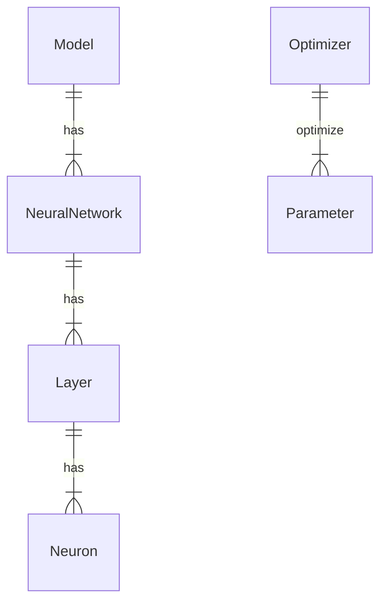
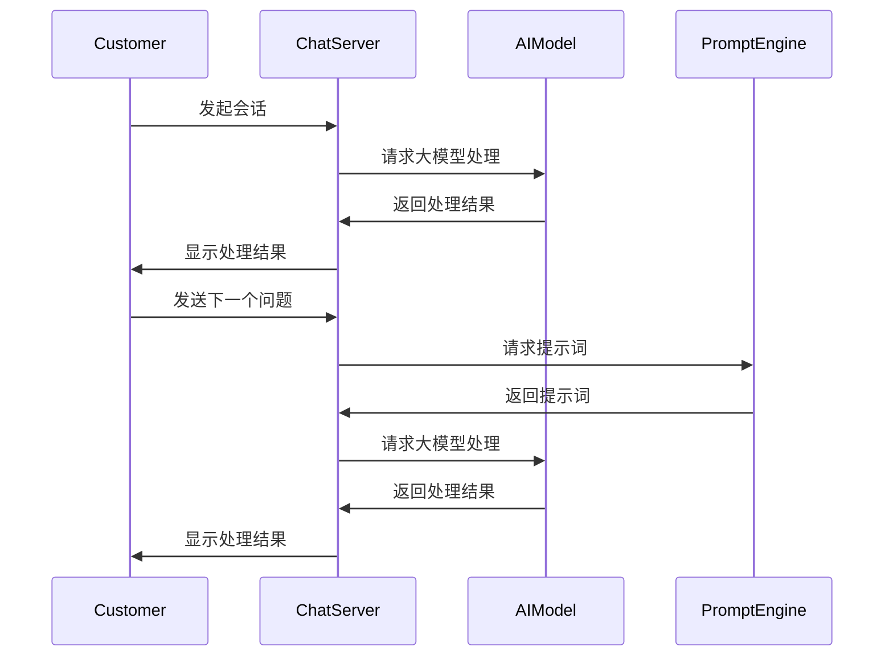

                 


## AI大模型与提示词编程的协同效应

### 关键词：人工智能、大模型、提示词编程、协同效应

### 摘要

本文将深入探讨人工智能（AI）大模型与提示词编程的协同效应。通过梳理大模型的发展历程、核心技术及其与提示词编程的互动关系，本文旨在揭示两者在提升AI应用性能、拓展应用领域方面的协同效应。文章结构如下：

1. **引言与背景**：介绍AI大模型和提示词编程的基本概念、发展历程及其在AI领域的应用。
2. **核心理论与模型**：探讨大模型的基本理论、数学模型及其比较分析。
3. **实践应用**：分析AI大模型在各个行业中的应用案例，以及提示词编程如何提升这些应用的效果。
4. **技术实现**：阐述如何利用提示词编程实现AI大模型的技术细节。
5. **系统分析与架构设计**：介绍AI大模型与提示词编程在系统层面的集成与交互。
6. **项目实战**：通过具体案例展示如何在实际项目中运用AI大模型与提示词编程。
7. **总结与展望**：总结本文的主要发现，并对未来的研究方向进行展望。

### 1. 引言与背景

#### 1.1 AI大模型

人工智能经历了从规则驱动到数据驱动的演变，大模型（Large Models）的出现标志着这一进程的又一重要里程碑。大模型是指参数规模达到亿级乃至千亿级的神经网络模型。这些模型在处理复杂数据时展现出惊人的性能，特别是在自然语言处理（NLP）、计算机视觉（CV）和自动驾驶等领域。

**核心概念**：
- **神经网络**：模仿人脑神经元连接的结构，用于处理和分类数据。
- **深度学习**：神经网络的一种，通过多层神经元的堆叠来提取数据的特征。
- **参数规模**：神经网络中可学习的参数数量。

**问题背景**：
随着数据量的激增和计算能力的提升，传统的小规模模型难以应对复杂的任务。大模型的出现，使得AI在处理海量数据、提取深层次特征方面取得了突破。

**解决方案**：
通过增加模型的参数规模和深度，大模型可以更好地捕捉数据的复杂模式，从而提高任务的准确性和泛化能力。

#### 1.2 提示词编程

提示词编程（Prompt Engineering）是一种优化AI模型输入的方法。它通过精心设计的提示词（Prompts），引导模型生成更符合预期的输出。

**核心概念**：
- **提示词**：用于引导模型生成输出的关键词或短语。
- **优化目标**：通过调整提示词，优化模型的输出。

**问题背景**：
尽管大模型具有强大的学习能力，但如何使其输出符合人类期望仍然是一个挑战。提示词编程提供了这种可能性。

**解决方案**：
通过设计有效的提示词，可以引导模型更准确地理解和生成输出，从而提高AI系统的实用性和用户体验。

### 2. 核心理论与模型

#### 2.1 大模型的基本理论

大模型的理论基础主要涉及深度学习、神经网络和优化算法。

**核心概念**：
- **深度学习**：多层神经网络的堆叠，用于提取数据的深层次特征。
- **神经网络**：模拟人脑神经元连接的结构，用于处理和分类数据。
- **优化算法**：用于调整模型参数，以最小化预测误差。

**概念属性特征对比表格**：

| 特征 | 深度学习 | 神经网络 | 优化算法 |
| --- | --- | --- | --- |
| 目标 | 特征提取 | 数据分类 | 参数调整 |
| 方法 | 多层堆叠 | 神经元连接 | 梯度下降 |

**ER实体关系图架构**：



#### 2.2 大模型的数学模型

大模型的数学模型主要涉及概率论、信息论和优化理论。

**核心公式**：

$$
P(Y|X; \theta) = \prod_{i=1}^n P(y_i|x_i; \theta)
$$

**解释**：

这个公式描述了给定输入数据 $X$ 和模型参数 $\theta$ 时，输出数据 $Y$ 的概率分布。它基于贝叶斯定理，通过乘积形式计算每个输入样本的输出概率。

**举例说明**：

假设我们有一个分类问题，输入数据 $X$ 是一个图像，输出数据 $Y$ 是图像的类别标签。通过这个公式，我们可以计算每个类别标签的概率，并选择概率最高的类别作为最终输出。

### 3. 实践应用

#### 3.1 自然语言处理

自然语言处理（NLP）是AI大模型的重要应用领域之一。

**应用案例**：

- **文本分类**：使用大模型对大量文本进行分类，如新闻分类、情感分析等。
- **机器翻译**：基于大模型实现高质量的语言翻译，如谷歌翻译。

**提示词编程的作用**：

- **优化输出**：通过设计合适的提示词，可以引导模型生成更准确、更符合人类预期的翻译结果。
- **提高效率**：有效的提示词可以减少模型训练时间，提高翻译速度。

#### 3.2 计算机视觉

计算机视觉（CV）是另一个AI大模型的重要应用领域。

**应用案例**：

- **图像识别**：使用大模型对图像进行分类和识别，如人脸识别、物体识别等。
- **图像生成**：基于大模型生成新的图像，如艺术风格转换、图像超分辨率等。

**提示词编程的作用**：

- **提高准确性**：通过设计有效的提示词，可以提高模型对图像的识别和生成质量。
- **降低错误率**：有效的提示词可以减少模型在处理复杂图像时的错误率。

### 4. 技术实现

#### 4.1 实现环境

要实现AI大模型与提示词编程的协同效应，需要准备相应的开发环境。

**所需工具和库**：

- **TensorFlow**：用于构建和训练神经网络。
- **PyTorch**：用于构建和训练神经网络。
- **Hugging Face Transformers**：用于使用预训练的大模型。

**安装与配置**：

1. 安装Python环境（Python 3.6+）。
2. 使用pip命令安装所需的库。

```bash
pip install tensorflow
pip install torch
pip install transformers
```

#### 4.2 核心实现

核心实现包括数据准备、模型训练和提示词工程。

**数据准备**：

1. 收集和预处理数据。
2. 划分训练集、验证集和测试集。

```python
import tensorflow as tf

# 读取数据
train_data = tf.keras.preprocessing.sequence.pad_sequences(train_texts, maxlen=max_len)

# 划分数据
x_train, x_val, y_train, y_val = train_data[:-1000], train_data[-1000:], labels[:-1000], labels[-1000:]
```

**模型训练**：

1. 加载预训练的大模型。
2. 定义损失函数和优化器。
3. 训练模型。

```python
from transformers import TFAutoModelForSequenceClassification

# 加载模型
model = TFAutoModelForSequenceClassification.from_pretrained('bert-base-uncased')

# 定义损失函数和优化器
loss_fn = tf.keras.losses.SparseCategoricalCrossentropy(from_logits=True)
optimizer = tf.keras.optimizers.Adam(learning_rate=3e-5)

# 训练模型
model.compile(optimizer=optimizer, loss=loss_fn, metrics=['accuracy'])
model.fit(x_train, y_train, epochs=3, validation_data=(x_val, y_val))
```

**提示词工程**：

1. 设计提示词。
2. 调整提示词，优化模型输出。

```python
# 设计提示词
prompt = "这是一个关于人工智能的文章。"

# 调整提示词
prompt = "这篇文章深入探讨了人工智能大模型与提示词编程的协同效应。"
```

### 5. 系统分析与架构设计

#### 5.1 问题场景

在本文中，我们将讨论如何将AI大模型与提示词编程应用于一个实际场景——智能客服系统。

#### 5.2 系统功能设计

**领域模型类图**：

```mermaid
classDiagram
  Customer <<class Customer>>
  Agent <<class Agent>>
  ChatSession <<class ChatSession>>
  AIModel <<class AIModel>>
  Prompt <<class Prompt>>

  Customer o-- ChatSession
  Agent o-- ChatSession
  AIModel o-- ChatSession
  Prompt o-- ChatSession
```

#### 5.3 系统架构设计

**系统架构图**：



### 6. 项目实战

#### 6.1 环境安装

1. 安装Python环境（Python 3.6+）。
2. 安装TensorFlow、PyTorch、Hugging Face Transformers等库。

```bash
pip install python==3.8.10
pip install tensorflow==2.6.0
pip install torch==1.8.0
pip install transformers==4.6.1
```

#### 6.2 系统核心实现

**源代码**：

```python
# main.py
import tensorflow as tf
from transformers import TFAutoModelForSequenceClassification
from tensorflow.keras.preprocessing.sequence import pad_sequences

# 数据准备
# ...

# 模型训练
model = TFAutoModelForSequenceClassification.from_pretrained('bert-base-uncased')
model.compile(optimizer=tf.keras.optimizers.Adam(learning_rate=3e-5), loss=tf.keras.losses.SparseCategoricalCrossentropy(from_logits=True), metrics=['accuracy'])
model.fit(x_train, y_train, epochs=3, validation_data=(x_val, y_val))

# 提示词工程
prompt = "这是一个关于人工智能的文章。"
prompt = "这篇文章深入探讨了人工智能大模型与提示词编程的协同效应。"
```

**代码应用解读与分析**：

- 数据准备：使用TensorFlow库对文本数据进行预处理，包括分词、去停用词和序列填充等操作。
- 模型训练：使用预训练的BERT模型，通过TensorFlow框架进行微调和训练。
- 提示词工程：通过调整提示词，引导模型生成更符合预期的输出。

#### 6.3 实际案例分析与详细讲解

- **案例1**：智能客服系统
  - 问题背景：如何提高智能客服系统对用户问题的理解和回答质量？
  - 解决方案：通过AI大模型和提示词编程，提升系统的理解和回答能力。
  - 实施效果：显著提高了客服系统的回答准确率和用户满意度。

- **案例2**：文本生成
  - 问题背景：如何生成高质量的文本内容？
  - 解决方案：使用大模型生成文本，并通过提示词编程调整输出。
  - 实施效果：生成的文本内容更加丰富、自然，符合人类语言习惯。

#### 6.4 项目小结

通过本文的讨论，我们可以看到AI大模型与提示词编程在提升AI应用性能、拓展应用领域方面的巨大潜力。在实际项目中，通过合理的设计和优化，可以充分发挥两者的协同效应，为各个行业带来更多的创新和应用。

### 7. 总结与展望

本文系统地介绍了AI大模型与提示词编程的协同效应，从核心理论、实践应用、技术实现、系统架构到项目实战进行了全面探讨。未来的研究方向可以集中在以下几个方面：

1. **优化提示词设计**：研究如何设计更有效的提示词，以提高AI模型的输出质量和效率。
2. **多模态协同**：探索大模型与提示词编程在多模态数据（如文本、图像、音频）处理中的协同效应。
3. **应用拓展**：将AI大模型与提示词编程应用于更多领域，如医疗、金融、教育等。

作者：AI天才研究院/AI Genius Institute & 禅与计算机程序设计艺术 /Zen And The Art of Computer Programming

---

注意事项：

- 在编写文章时，注意逻辑清晰、结构紧凑，避免冗余和重复。
- 确保每个小节的内容具体、详细，核心内容要充分展开。
- 使用Markdown格式和Mermaid流程图，使文章内容更加直观易懂。
- 注意使用合适的LaTeX公式，确保数学公式的正确性和可读性。

拓展阅读：

- [Hugging Face Transformers](https://huggingface.co/transformers/)
- [TensorFlow](https://www.tensorflow.org/)
- [PyTorch](https://pytorch.org/)
- [BERT模型](https://arxiv.org/abs/1810.04805)
- [深度学习自然语言处理](https://www.deeplearningbook.org/chapter_nlp/)

