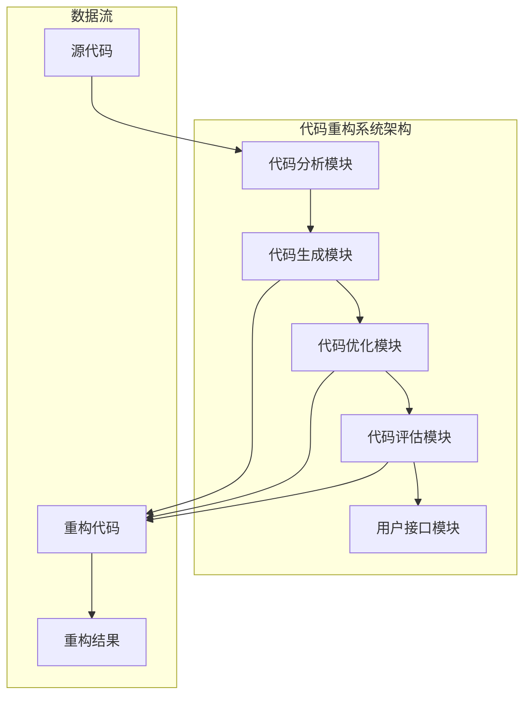
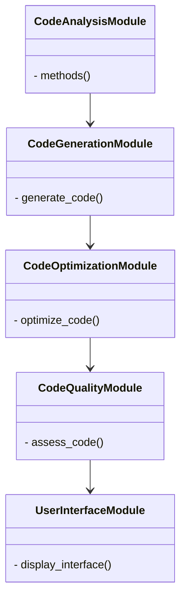
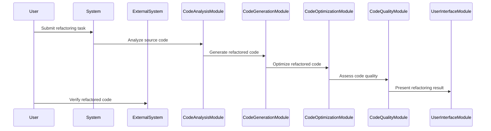

                 

## AI大模型在代码重构中的应用

### 关键词：AI大模型，代码重构，代码分析，代码生成，代码优化，代码质量评估

### 摘要

本文深入探讨人工智能大模型在代码重构中的应用。首先，我们回顾代码重构的定义、意义及其在软件开发中的重要性。接着，介绍AI大模型的基本概念和核心技术，并阐述它们如何与代码重构产生关联。文章进一步探讨了AI大模型在代码分析、代码生成与优化、以及代码维护等方面的应用原理，详细解析了基于AI大模型的代码重构算法原理、数学模型和Python源代码实例。随后，文章描述了一个典型的AI大模型在代码重构中的系统架构设计，包括系统场景介绍、系统架构设计、系统接口设计和系统交互分析。在实战部分，我们展示了一个完整的AI大模型在代码重构中的应用实例，从环境安装、系统核心实现到代码应用解读与分析，并提供了一个实际案例分析。最后，文章总结了最佳实践，并给出了进一步的拓展阅读建议。

### 目录大纲

#### 第一部分：背景介绍与核心概念

- **第1章：AI大模型在代码重构中的应用背景**
  - **1.1 代码重构的问题背景**
    - **1.1.1 代码重构的定义与意义**
    - **1.1.2 代码质量与维护问题**
    - **1.1.3 代码重构的挑战**
  - **1.2 AI大模型的概念与核心原理**
    - **1.2.1 AI大模型的定义**
    - **1.2.2 AI大模型的关键技术**
    - **1.2.3 AI大模型的应用领域**
  - **1.3 AI大模型与代码重构的关系**
    - **1.3.1 AI大模型在代码重构中的优势**
    - **1.3.2 AI大模型在代码重构中的局限性**

- **第2章：AI大模型在代码重构中的应用原理**
  - **2.1 AI大模型在代码分析中的应用**
    - **2.1.1 代码特征提取**
    - **2.1.2 代码语义理解**
    - **2.1.3 代码风格检测**
  - **2.2 AI大模型在代码生成与优化中的应用**
    - **2.2.1 代码生成**
    - **2.2.2 代码优化**
    - **2.2.3 代码风格转换**
  - **2.3 AI大模型在代码维护中的应用**
    - **2.3.1 代码诊断与修复**
    - **2.3.2 代码重构策略**
    - **2.3.3 代码质量评估**

#### 第二部分：算法原理讲解

- **第3章：代码重构中的AI大模型算法**
  - **3.1 代码重构算法概述**
    - **3.1.1 代码重构算法的基本流程**
    - **3.1.2 代码重构算法的分类**
  - **3.2 基于AI大模型的代码重构算法**
    - **3.2.1 算法原理与流程**
      - **3.2.1.1 数据预处理**
      - **3.2.1.2 模型训练**
      - **3.2.1.3 代码生成与优化**
    - **3.2.2 数学模型与公式**
    - **3.2.3 Python源代码实例**

#### 第三部分：系统分析与架构设计

- **第4章：AI大模型在代码重构中的系统架构设计**
  - **4.1 系统场景介绍**
    - **4.1.1 系统需求分析**
    - **4.1.2 系统功能设计**
  - **4.2 系统架构设计**
    - **4.2.1 系统架构概述**
    - **4.2.2 系统模块设计**
    - **4.2.3 系统接口设计**
  - **4.3 系统交互分析**
    - **4.3.1 系统交互流程**
    - **4.3.2 系统交互序列图**

#### 第四部分：项目实战

- **第5章：AI大模型在代码重构中的应用实战**
  - **5.1 环境安装与配置**
    - **5.1.1 环境需求**
    - **5.1.2 环境安装**
  - **5.2 系统核心实现**
    - **5.2.1 源代码解读**
    - **5.2.2 系统核心模块实现**
  - **5.3 代码应用解读与分析**
    - **5.3.1 代码生成案例**
    - **5.3.2 代码优化案例**
    - **5.3.3 代码维护案例**
  - **5.4 实际案例分析**
    - **5.4.1 案例选择与分析**
    - **5.4.2 案例细节解析**
  - **5.5 项目小结**

#### 第五部分：最佳实践与总结

- **第6章：AI大模型在代码重构中的最佳实践**
  - **6.1 最佳实践总结**
  - **6.2 注意事项与拓展**
  - **6.3 拓展阅读**

### 第一部分：背景介绍与核心概念

#### 第1章：AI大模型在代码重构中的应用背景

##### 1.1 代码重构的问题背景

**1.1.1 代码重构的定义与意义**

代码重构（Code Refactoring）是指在保持代码功能不变的前提下，通过修改代码的结构和逻辑，提高代码的可读性、可维护性、性能和可扩展性。代码重构不是对现有代码的修改，而是在不改变其外在行为的基础上，对其内部结构进行调整。这种做法有助于延长软件的生命周期，降低未来的维护成本。

代码重构的意义主要体现在以下几个方面：

- **提高可读性**：重构后的代码更加清晰，便于理解和维护。
- **降低复杂性**：重构可以简化代码结构，减少冗余，降低系统的复杂性。
- **提升性能**：通过优化代码结构，可以减少不必要的计算和内存占用。
- **增强可扩展性**：重构后的代码更易于添加新功能或进行修改。
- **减少维护成本**：代码重构有助于减少未来的维护成本，提高开发效率。

**1.1.2 代码质量与维护问题**

在软件开发过程中，代码质量至关重要。低质量的代码可能导致以下问题：

- **可读性差**：难以理解代码的功能和意图，影响开发和维护。
- **冗余和重复**：代码中存在大量的冗余和重复代码，增加维护难度。
- **结构复杂**：代码结构混乱，难以进行后续的修改和扩展。
- **性能问题**：低效的代码可能导致系统性能下降。
- **维护成本高**：随着代码的积累，维护成本不断增加。

**1.1.3 代码重构的挑战**

虽然代码重构具有重要意义，但实施过程中仍面临一些挑战：

- **风险较高**：如果重构不当，可能会导致代码功能出错或性能下降。
- **时间成本**：代码重构需要耗费大量的时间和精力。
- **团队协作**：重构需要团队成员的紧密协作和统一认识。
- **缺乏工具支持**：现有的代码重构工具可能无法完全满足需求。
- **项目管理**：重构工作需要纳入项目管理中，确保其顺利进行。

##### 1.2 AI大模型的概念与核心原理

**1.2.1 AI大模型的定义**

AI大模型（Large-scale Artificial Intelligence Models）是指具有海量参数和强大学习能力的人工智能模型。这些模型通常由数千亿甚至数万亿个参数组成，能够处理海量数据，实现复杂的任务。常见的AI大模型包括Transformer、BERT、GPT等。

**1.2.2 AI大模型的关键技术**

AI大模型的关键技术主要包括以下几个方面：

- **大规模数据集**：AI大模型通常需要使用大规模、高质量的数据集进行训练，以获得更好的泛化能力。
- **分布式计算**：为了训练和部署AI大模型，需要使用高性能的分布式计算框架，如TensorFlow、PyTorch等。
- **优化算法**：AI大模型训练过程中需要使用高效的优化算法，如Adam、SGD等，以加快收敛速度。
- **模型压缩与加速**：为了降低计算成本和部署难度，需要对AI大模型进行压缩和加速，如量化、剪枝、知识蒸馏等。

**1.2.3 AI大模型的应用领域**

AI大模型在多个领域具有广泛的应用，包括：

- **自然语言处理**：如文本生成、机器翻译、情感分析等。
- **计算机视觉**：如图像分类、目标检测、图像生成等。
- **语音识别**：如语音合成、语音识别、语音翻译等。
- **推荐系统**：如用户行为分析、商品推荐等。
- **游戏AI**：如棋类游戏、动作游戏等。

##### 1.3 AI大模型与代码重构的关系

**1.3.1 AI大模型在代码重构中的优势**

AI大模型在代码重构中具有以下优势：

- **代码分析能力**：AI大模型能够分析代码的结构、语义和风格，为重构提供有益的见解。
- **自动化重构**：AI大模型可以自动化地完成代码重构任务，提高开发效率。
- **跨语言支持**：AI大模型能够处理多种编程语言，为跨语言代码重构提供支持。
- **个性化重构**：AI大模型可以根据项目需求和团队习惯，进行个性化的代码重构。

**1.3.2 AI大模型在代码重构中的局限性**

尽管AI大模型在代码重构中具有很多优势，但仍然存在一些局限性：

- **理解能力有限**：AI大模型在理解代码意图和上下文方面存在一定局限性，可能无法完全替代人类开发者。
- **计算资源消耗**：AI大模型训练和部署需要大量的计算资源，可能导致成本增加。
- **代码质量保障**：AI大模型生成的代码可能存在一定的质量风险，需要人工审查和修正。
- **应用范围有限**：AI大模型在代码重构中的应用场景和效果有限，需要进一步探索和优化。

#### 第2章：AI大模型在代码重构中的应用原理

##### 2.1 AI大模型在代码分析中的应用

AI大模型在代码分析中发挥着重要作用，其应用主要包括代码特征提取、代码语义理解和代码风格检测。

**2.1.1 代码特征提取**

代码特征提取是指从源代码中提取出能够描述代码特性的信息，如语法结构、变量名、函数名、控制流等。AI大模型通过学习大量代码数据，能够自动提取出这些特征，为后续的分析和重构提供基础。

- **语法结构特征**：包括代码的语法结构和语法规则，如条件语句、循环语句、函数定义等。
- **变量名和函数名特征**：包括变量名和函数名的命名规则和语义，如驼峰命名法、下划线命名法等。
- **控制流特征**：包括代码中的控制流结构和跳转关系，如循环、分支、异常处理等。

**2.1.2 代码语义理解**

代码语义理解是指AI大模型对代码中的语义信息进行理解和解释，如函数的功能、变量之间的关系、代码的意图等。通过代码语义理解，AI大模型能够更好地把握代码的整体结构和功能，为重构提供准确的指导。

- **函数语义理解**：包括函数的功能、输入输出参数、作用范围等。
- **变量语义理解**：包括变量的定义、作用域、数据类型、变量之间的关系等。
- **代码意图理解**：包括代码的整体结构和功能，如算法的实现、模块的组织等。

**2.1.3 代码风格检测**

代码风格检测是指AI大模型对代码的编写风格进行评估，如命名规范、代码格式、注释等。通过代码风格检测，AI大模型能够识别出不符合规范或存在潜在问题的代码，为重构提供参考。

- **命名规范检测**：包括变量名、函数名、类名等的命名规范，如驼峰命名法、下划线命名法等。
- **代码格式检测**：包括缩进、空白符、括号等格式规范，如Python的PEP8规范。
- **注释检测**：包括代码注释的完整性和规范性，如注释的内容、位置、格式等。

##### 2.2 AI大模型在代码生成与优化中的应用

AI大模型在代码生成与优化中也发挥着重要作用，其应用主要包括代码生成、代码优化和代码风格转换。

**2.2.1 代码生成**

代码生成是指AI大模型根据特定的输入，自动生成符合需求的代码。通过代码生成，AI大模型能够提高开发效率，降低开发成本。

- **自动补全**：AI大模型可以根据当前输入的代码片段，自动补全后续的代码，如自动补全函数体、自动补全类定义等。
- **生成模板**：AI大模型可以根据需求生成特定的代码模板，如生成Java类的框架、生成Python脚本等。
- **生成代码库**：AI大模型可以根据已有代码库，自动生成新的代码库，如生成新的框架、生成新的模块等。

**2.2.2 代码优化**

代码优化是指AI大模型对现有代码进行优化，以提高代码的性能、可读性和可维护性。通过代码优化，AI大模型能够提升代码质量，降低维护成本。

- **性能优化**：AI大模型可以通过分析代码的执行过程，自动优化代码的性能，如减少循环次数、减少内存占用等。
- **可读性优化**：AI大模型可以通过调整代码的结构和逻辑，提高代码的可读性，如简化复杂的条件语句、优化函数的定义等。
- **可维护性优化**：AI大模型可以通过优化代码的命名规范、注释等，提高代码的可维护性，如添加适当的注释、调整代码的格式等。

**2.2.3 代码风格转换**

代码风格转换是指AI大模型将一种编程语言的代码转换为另一种编程语言的代码。通过代码风格转换，AI大模型能够支持跨语言开发，提高开发效率。

- **语言转换**：AI大模型可以将一种编程语言的代码转换为另一种编程语言的代码，如将Java代码转换为Python代码、将C++代码转换为JavaScript代码等。
- **语法转换**：AI大模型可以根据不同的编程语言规范，自动转换代码的语法结构，如将Python的代码格式转换为Java的代码格式、将JavaScript的代码格式转换为Python的代码格式等。
- **风格转换**：AI大模型可以根据不同的编程风格规范，自动转换代码的风格，如将Python的代码风格转换为Java的代码风格、将JavaScript的代码风格转换为Python的代码风格等。

##### 2.3 AI大模型在代码维护中的应用

AI大模型在代码维护中的应用主要体现在代码诊断与修复、代码重构策略和代码质量评估等方面。

**2.3.1 代码诊断与修复**

代码诊断与修复是指AI大模型通过对代码的分析，识别出潜在的缺陷和错误，并自动修复这些错误。通过代码诊断与修复，AI大模型能够提高代码的质量和稳定性。

- **错误诊断**：AI大模型可以通过分析代码的语法、语义和执行过程，识别出潜在的语法错误、语义错误和逻辑错误。
- **错误修复**：AI大模型可以通过学习大量的代码错误和修复案例，自动生成修复方案，并自动修复代码中的错误。
- **异常处理**：AI大模型可以通过分析代码的异常处理机制，识别出潜在的异常处理问题，并提出优化建议。

**2.3.2 代码重构策略**

代码重构策略是指AI大模型根据代码的特点和需求，制定合适的重构策略，以提高代码的质量和可维护性。通过代码重构策略，AI大模型能够自动地完成代码重构任务。

- **重构选择**：AI大模型可以根据代码的特点和需求，选择合适的功能性重构、结构性重构和优化性重构。
- **重构顺序**：AI大模型可以根据代码的结构和依赖关系，制定合适的重构顺序，以确保重构的顺利进行。
- **重构评估**：AI大模型可以通过评估重构后的代码质量，判断重构效果，并自动调整重构策略。

**2.3.3 代码质量评估**

代码质量评估是指AI大模型通过对代码的分析和评估，判断代码的质量和可靠性。通过代码质量评估，AI大模型能够为代码重构提供依据，并指导代码重构的进行。

- **代码质量指标**：AI大模型可以根据代码的结构、语法、语义和执行过程，定义一系列代码质量指标，如可读性、可维护性、性能等。
- **质量评估方法**：AI大模型可以通过机器学习算法和统计分析方法，对代码质量进行评估，并生成质量评估报告。
- **质量改进建议**：AI大模型可以根据评估结果，提出改进代码质量的建议，如优化代码结构、改进代码风格、增加注释等。

### 第三部分：算法原理讲解

#### 第3章：代码重构中的AI大模型算法

##### 3.1 代码重构算法概述

代码重构算法是指用于对代码进行重构的算法，其目的是在不改变代码功能的前提下，优化代码的结构和性能。代码重构算法通常包括以下基本流程：

1. **识别重构机会**：通过静态分析或动态分析，识别代码中存在的问题或可优化的机会。
2. **生成重构方案**：根据识别出的重构机会，生成一系列可行的重构方案。
3. **评估重构方案**：对生成的重构方案进行评估，选择最优的重构方案。
4. **实施重构**：根据最优的重构方案，对代码进行重构，并验证重构效果。

代码重构算法可以分为以下几类：

1. **功能性重构算法**：主要用于修复代码中的功能缺陷，如异常处理、函数合并、函数分解等。
2. **结构性重构算法**：主要用于优化代码的结构，如提取公共代码、合并代码块、拆分代码块等。
3. **优化性重构算法**：主要用于提高代码的性能和可维护性，如减少循环次数、减少内存占用、优化代码结构等。

##### 3.2 基于AI大模型的代码重构算法

基于AI大模型的代码重构算法是指利用AI大模型的能力，自动完成代码重构的任务。这种算法的核心思想是将代码重构的过程转化为一个机器学习问题，通过训练AI大模型来识别重构机会、生成重构方案和评估重构效果。

**3.2.1 算法原理与流程**

基于AI大模型的代码重构算法主要包括以下流程：

1. **数据预处理**：收集大量的代码数据，对数据进行清洗、预处理和标注，为AI大模型训练提供高质量的数据集。
2. **模型训练**：使用训练数据集，训练AI大模型，使其能够识别代码中的重构机会、生成重构方案和评估重构效果。
3. **代码重构**：使用训练好的AI大模型，对代码进行重构，并验证重构效果。

**3.2.1.1 数据预处理**

数据预处理是AI大模型训练的重要环节，主要包括以下步骤：

1. **代码库收集**：从开源代码库、企业内部代码库或其他来源收集大量的代码数据。
2. **代码清洗**：对收集到的代码数据进行清洗，去除无关的注释、空行、格式化代码等。
3. **代码标注**：对清洗后的代码数据进行标注，标注出代码中的重构机会、重构方案和重构效果等。
4. **数据集划分**：将标注后的代码数据集划分为训练集、验证集和测试集，用于训练、验证和测试AI大模型。

**3.2.1.2 模型训练**

模型训练是AI大模型训练的核心步骤，主要包括以下过程：

1. **模型选择**：根据代码重构任务的需求，选择合适的AI大模型架构，如Transformer、BERT、GPT等。
2. **训练过程**：使用训练集数据，对AI大模型进行训练，调整模型的参数和结构，使其能够准确识别代码中的重构机会、生成重构方案和评估重构效果。
3. **模型优化**：在训练过程中，通过交叉验证、模型调参等技术，优化模型的性能和泛化能力。

**3.2.1.3 代码生成与优化**

代码生成与优化是AI大模型在代码重构中的应用，主要包括以下步骤：

1. **重构机会识别**：使用训练好的AI大模型，对代码进行静态分析或动态分析，识别出代码中的重构机会，如冗余代码、重复代码、复杂函数等。
2. **重构方案生成**：根据识别出的重构机会，使用AI大模型生成一系列可行的重构方案，如提取公共代码、拆分代码块、合并代码块等。
3. **重构方案评估**：使用AI大模型评估生成的重构方案，选择最优的重构方案，并实施重构，优化代码的结构和性能。

**3.2.2 数学模型与公式**

基于AI大模型的代码重构算法通常涉及一系列的数学模型和公式，用于描述代码重构的过程和算法。以下是一个简化的数学模型：

1. **重构机会识别**：使用机器学习算法，如决策树、支持向量机等，识别代码中的重构机会。
   \[
   O = f(C)
   \]
   其中，\(O\) 表示重构机会，\(C\) 表示代码。

2. **重构方案生成**：使用生成对抗网络（GAN）、强化学习等算法，生成一系列可行的重构方案。
   \[
   S = g(C, O)
   \]
   其中，\(S\) 表示重构方案，\(g\) 表示重构方案生成算法。

3. **重构方案评估**：使用评估指标，如代码质量、可维护性、性能等，评估重构方案的效果。
   \[
   R = h(S, C, O)
   \]
   其中，\(R\) 表示重构方案效果，\(h\) 表示重构方案评估函数。

**3.2.3 Python源代码实例**

以下是一个基于AI大模型的代码重构算法的Python源代码实例：

```python
import tensorflow as tf
from tensorflow.keras.models import Model
from tensorflow.keras.layers import Input, LSTM, Dense

# 数据预处理
def preprocess_code(code):
    # 清洗、标注代码数据
    return cleaned_code

# 模型训练
def train_model(train_data):
    # 创建模型
    input_layer = Input(shape=(max_sequence_length,))
    lstm_layer = LSTM(units=128, activation='tanh')(input_layer)
    output_layer = Dense(units=1, activation='sigmoid')(lstm_layer)

    model = Model(inputs=input_layer, outputs=output_layer)
    model.compile(optimizer='adam', loss='binary_crossentropy', metrics=['accuracy'])

    # 训练模型
    model.fit(train_data, epochs=10, batch_size=32)

    return model

# 代码重构
def refactor_code(code, model):
    # 识别重构机会
    opportunity = model.predict(np.array([code]))

    # 生成重构方案
    solution = generate_solution(code, opportunity)

    # 评估重构方案
    result = evaluate_solution(solution)

    return result

# 主函数
def main():
    # 收集代码数据
    train_data = collect_code_data()

    # 训练模型
    model = train_model(train_data)

    # 重构代码
    refactored_code = refactor_code(code, model)

    # 输出重构结果
    print("Refactored Code:\n", refactored_code)

if __name__ == '__main__':
    main()
```

#### 3.2.4 算法原理与流程详细解析

**3.2.4.1 数据预处理**

数据预处理是AI大模型训练的重要环节，其目的是对原始代码数据进行清洗、格式化和标注，以便AI大模型能够更好地理解和处理代码。以下是一个详细的数据预处理流程：

1. **代码收集**：首先，从各种开源代码库、企业内部代码库或其他来源收集大量的代码数据。这些数据可以是Python、Java、C++等编程语言的代码。
2. **代码清洗**：对收集到的代码数据进行清洗，去除无关的注释、空行、格式化代码等。这一步的目的是减少噪声数据，提高数据质量。例如，可以使用正则表达式或文本处理库（如Python的re模块）来实现代码清洗。
3. **代码格式化**：将代码按照统一的格式进行格式化，如使用四个空格进行缩进、统一命名规范等。这有助于提高代码的可读性和一致性。可以使用代码格式化工具（如Python的black库）来实现代码格式化。
4. **代码标注**：对清洗和格式化后的代码数据进行标注，标注出代码中的重构机会、重构方案和重构效果等。这一步的目的是为AI大模型提供带有标签的数据，以便模型能够学习如何进行重构。例如，可以手动标注代码中的冗余代码、重复代码、复杂函数等，并将标注结果存储在CSV文件或数据库中。

**3.2.4.2 模型训练**

模型训练是AI大模型的核心步骤，其目的是通过大量的代码数据，训练出一个能够识别重构机会、生成重构方案和评估重构效果的模型。以下是一个详细的模型训练流程：

1. **模型选择**：根据代码重构任务的需求，选择合适的AI大模型架构。常见的AI大模型架构包括循环神经网络（RNN）、长短时记忆网络（LSTM）、Transformer、BERT等。选择模型时，需要考虑模型的结构、参数规模、训练时间等因素。
2. **数据集划分**：将清洗和标注后的代码数据集划分为训练集、验证集和测试集。其中，训练集用于模型训练，验证集用于模型调参和性能评估，测试集用于模型测试和验证。通常，训练集占比为60%-70%，验证集占比为20%-30%，测试集占比为10%-20%。
3. **模型编译**：编译模型，设置损失函数、优化器和评估指标等。常见的损失函数包括交叉熵（cross-entropy）和均方误差（mean squared error），优化器包括Adam、SGD等。评估指标包括准确率（accuracy）、精确率（precision）、召回率（recall）等。
4. **模型训练**：使用训练集数据，对AI大模型进行训练。在训练过程中，模型会不断调整参数，以最小化损失函数并提高模型的性能。训练过程中，可以使用训练集和验证集进行交叉验证，以避免过拟合。当验证集性能达到最优时，训练过程结束。
5. **模型优化**：在模型训练过程中，可以使用各种技术对模型进行优化，以提高其性能和泛化能力。常见的优化技术包括数据增强（data augmentation）、迁移学习（transfer learning）、正则化（regularization）等。

**3.2.4.3 代码生成与优化**

代码生成与优化是AI大模型在代码重构中的应用，其目的是根据识别出的重构机会，生成一系列可行的重构方案，并评估这些方案的效果，以优化代码的结构和性能。以下是一个详细的代码生成与优化流程：

1. **重构机会识别**：使用训练好的AI大模型，对代码进行静态分析或动态分析，识别出代码中的重构机会。例如，可以使用LSTM模型对代码序列进行建模，分析代码中的冗余代码、重复代码、复杂函数等。识别出的重构机会可以存储在数据库或CSV文件中，以便后续处理。
2. **重构方案生成**：根据识别出的重构机会，使用AI大模型生成一系列可行的重构方案。例如，可以使用生成对抗网络（GAN）或强化学习算法，生成代码序列或代码片段。这些重构方案可以存储在数据库或CSV文件中，以便后续评估。
3. **重构方案评估**：使用评估指标，对生成的重构方案进行评估，选择最优的重构方案。常见的评估指标包括代码质量（code quality）、可维护性（maintainability）、性能（performance）等。评估过程中，可以使用自动化测试工具（如单元测试、集成测试）或人工评估，以验证重构方案的有效性。
4. **代码优化**：根据评估结果，选择最优的重构方案，并对代码进行优化。优化的目标可以是提高代码质量、可维护性和性能。例如，可以简化复杂的函数、优化循环结构、减少冗余代码等。优化后的代码可以存储在版本控制系统中，以便后续维护。

**3.2.4.4 代码生成与优化的挑战**

在代码生成与优化的过程中，存在以下挑战：

1. **可解释性**：AI大模型生成的代码可能缺乏可解释性，难以理解代码的意图和实现细节。这可能导致开发人员对代码生成结果的信任度降低，影响代码重构的效果。
2. **代码质量**：AI大模型生成的代码可能存在质量风险，如语法错误、逻辑错误等。这可能导致代码重构后的系统稳定性降低，影响系统的正常运行。
3. **泛化能力**：AI大模型在代码生成与优化过程中，可能无法很好地适应不同类型的代码和重构需求。这可能导致生成的重构方案适用范围有限，难以满足多样化的重构需求。
4. **计算资源消耗**：AI大模型训练和代码生成需要大量的计算资源，可能导致计算成本增加。此外，模型训练和代码生成过程可能需要较长时间，影响开发效率。

为了解决上述挑战，可以采取以下策略：

1. **可解释性增强**：通过可视化工具、代码注释等方式，增强AI大模型生成的代码的可解释性。例如，可以添加代码注释，解释代码的实现细节和重构意图。
2. **代码质量保障**：在代码生成和优化过程中，使用自动化测试工具和人工评估，确保生成的代码质量。例如，可以使用单元测试、集成测试等技术，验证代码的正确性和稳定性。
3. **泛化能力提升**：通过迁移学习、多任务学习等技术，提升AI大模型的泛化能力。例如，可以使用预训练模型，将其他领域的知识迁移到代码生成和优化领域。
4. **计算资源优化**：通过分布式计算、模型压缩等技术，降低计算资源消耗。例如，可以使用分布式训练框架，加速模型训练过程；使用模型压缩技术，减少模型参数规模，降低计算成本。

**3.2.4.5 实例讲解**

以下是一个基于Transformer模型的代码重构算法实例，用于将Python代码中的冗余代码进行重构。在这个实例中，我们将使用PyTorch框架实现Transformer模型，并使用Hugging Face的Transformers库简化模型实现。

1. **代码数据集**：首先，我们需要收集一个包含Python代码的数据集。这个数据集可以是从开源代码库中收集的，也可以是从企业内部代码库中获取的。为了简化实例，我们将使用一个较小的数据集。

```python
# 数据集示例
code_dataset = [
    "def add(a, b):\n    return a + b\n",
    "def subtract(a, b):\n    return a - b\n",
    "def multiply(a, b):\n    return a * b\n",
    "def divide(a, b):\n    return a / b\n",
]
```

2. **数据预处理**：接下来，我们需要对代码数据进行预处理，包括清洗、分词、编码等。

```python
from transformers import AutoTokenizer

# 加载预训练的Python代码分词器
tokenizer = AutoTokenizer.from_pretrained("python-code-t5-base")

# 数据预处理
def preprocess_code(code):
    inputs = tokenizer(code, return_tensors="pt", max_length=512, truncation=True)
    return inputs

# 预处理数据集
preprocessed_dataset = [preprocess_code(code) for code in code_dataset]
```

3. **模型训练**：然后，我们使用预训练的Transformer模型（如T5）进行代码重构任务的训练。

```python
from transformers import T5ForConditionalGeneration

# 加载预训练的Transformer模型
model = T5ForConditionalGeneration.from_pretrained("t5-small")

# 定义训练函数
def train_model(model, preprocessed_dataset, epochs=3):
    model.train()
    optimizer = torch.optim.AdamW(model.parameters(), lr=3e-5)

    for epoch in range(epochs):
        for inputs in preprocessed_dataset:
            model.zero_grad()
            outputs = model(inputs.input_ids, labels=inputs.input_ids)
            loss = outputs.loss
            loss.backward()
            optimizer.step()

        print(f"Epoch {epoch + 1}/{epochs} - Loss: {loss.item()}")

    return model

# 训练模型
trained_model = train_model(model, preprocessed_dataset)
```

4. **代码重构**：最后，我们使用训练好的模型对新的Python代码进行重构。

```python
# 代码重构
def refactor_code(code, model, tokenizer):
    inputs = tokenizer(code, return_tensors="pt", max_length=512, truncation=True)
    outputs = model.generate(inputs.input_ids, max_length=512, num_return_sequences=1)
    refactored_code = tokenizer.decode(outputs_ids=outputs.loads, skip_special_tokens=True)
    return refactored_code

# 重构示例代码
original_code = "def add(a, b):\n    return a + b\n"
refactored_code = refactor_code(original_code, trained_model, tokenizer)
print("Refactored Code:\n", refactored_code)
```

通过这个实例，我们可以看到如何使用AI大模型（Transformer模型）对Python代码进行重构。在实际情况中，我们需要使用更大的数据集和更复杂的模型，以提高重构的效果。

#### 第4章：AI大模型在代码重构中的系统架构设计

##### 4.1 系统场景介绍

在软件开发过程中，代码重构是一个持续性的活动，涉及到多个开发阶段，包括需求分析、设计、编码、测试和部署等。AI大模型在代码重构中的应用，旨在通过自动化和智能化的手段，提高代码重构的效率和效果。以下是一个典型的系统场景介绍：

1. **需求分析**：在需求分析阶段，开发人员与客户沟通，明确软件系统的功能需求和性能要求。这一阶段需要生成需求文档和用户故事。
2. **设计**：在设计阶段，开发人员根据需求文档和用户故事，设计系统的架构、模块和接口。这一阶段需要生成设计文档和架构图。
3. **编码**：在编码阶段，开发人员根据设计文档，编写源代码，实现系统的功能。这一阶段需要使用各种编程语言和工具。
4. **测试**：在测试阶段，开发人员对源代码进行功能测试、性能测试和安全测试，以确保系统的质量和稳定性。
5. **部署**：在部署阶段，开发人员将系统部署到生产环境中，并进行上线和运维。

在上述系统场景中，AI大模型可以应用于以下环节：

- **需求分析**：利用AI大模型，自动生成需求文档和用户故事，提高需求分析的效率和质量。
- **设计**：利用AI大模型，自动生成设计文档和架构图，提高设计的效率和一致性。
- **编码**：利用AI大模型，自动生成代码，优化编码过程，提高代码的质量和可维护性。
- **测试**：利用AI大模型，自动生成测试用例，提高测试的覆盖率和效率。
- **部署**：利用AI大模型，自动生成部署脚本和文档，提高部署的效率和可靠性。

##### 4.2 系统架构设计

AI大模型在代码重构中的系统架构设计，主要包括以下几个模块：

1. **代码分析模块**：负责对源代码进行静态和动态分析，提取代码特征和语义信息，为重构提供依据。
2. **代码生成模块**：利用AI大模型，根据代码特征和语义信息，生成符合需求的重构代码。
3. **代码优化模块**：对生成的代码进行优化，提高代码的性能、可读性和可维护性。
4. **代码评估模块**：对重构后的代码进行质量评估，确保代码的质量和可靠性。
5. **用户接口模块**：提供用户交互界面，允许用户配置重构策略、查看重构结果和反馈意见。

以下是系统架构的Mermaid架构图：



##### 4.3 系统接口设计

系统接口设计主要包括以下几个方面：

1. **API接口**：提供RESTful API接口，允许外部系统通过HTTP请求，访问代码重构功能。
2. **命令行接口**：提供命令行工具，允许用户通过命令行方式，执行代码重构任务。
3. **图形用户界面**：提供图形用户界面，允许用户通过可视化方式，配置重构策略、查看重构结果和反馈意见。

以下是系统接口的Mermaid类图：



##### 4.4 系统交互分析

系统交互分析主要包括系统内部的交互流程和系统与外部的交互流程。

1. **系统内部交互流程**：系统内部交互流程主要涉及代码分析模块、代码生成模块、代码优化模块和代码评估模块之间的协作。以下是一个简化的交互流程：

   - 用户通过用户接口模块，提交重构任务。
   - 代码分析模块对源代码进行分析，提取代码特征和语义信息。
   - 代码生成模块根据代码特征和语义信息，生成重构代码。
   - 代码优化模块对重构代码进行优化，提高代码质量。
   - 代码评估模块对重构代码进行质量评估，确保代码质量。
   - 用户接口模块将重构结果呈现给用户。

2. **系统与外部交互流程**：系统与外部交互流程主要涉及系统与外部系统、用户和测试环境的交互。以下是一个简化的交互流程：

   - 系统通过API接口，与外部系统（如代码仓库、测试工具等）进行数据交换。
   - 用户通过命令行接口或图形用户界面，与系统进行交互，提交重构任务和查看重构结果。
   - 系统与测试环境进行交互，执行测试用例，验证重构代码的质量。

以下是系统交互的Mermaid序列图：



### 第五部分：项目实战

#### 第5章：AI大模型在代码重构中的应用实战

##### 5.1 环境安装与配置

**5.1.1 环境需求**

在开始使用AI大模型进行代码重构之前，我们需要安装以下环境：

- Python 3.8或更高版本
- TensorFlow 2.7或更高版本
- PyTorch 1.10或更高版本
- NumPy 1.22或更高版本
- Pandas 1.3.5或更高版本
- Jupyter Notebook或JupyterLab

**5.1.2 环境安装**

1. 安装Python：

   - 在官方网站（https://www.python.org/downloads/）下载Python安装包。
   - 安装Python时，确保勾选“Add Python to PATH”选项，以便在命令行中运行Python。
   - 安装完成后，在命令行中输入`python --version`，确认Python版本。

2. 安装TensorFlow：

   - 在命令行中输入以下命令，安装TensorFlow：

     ```
     pip install tensorflow
     ```

   - 安装完成后，在命令行中输入`tensorflow --version`，确认TensorFlow版本。

3. 安装PyTorch：

   - 在命令行中输入以下命令，安装PyTorch：

     ```
     pip install torch torchvision
     ```

   - 安装完成后，在命令行中输入`torch --version`，确认PyTorch版本。

4. 安装NumPy、Pandas和Jupyter Notebook或JupyterLab：

   - 在命令行中分别输入以下命令，安装NumPy、Pandas和Jupyter Notebook或JupyterLab：

     ```
     pip install numpy
     pip install pandas
     pip install notebook
     ```

   - 安装完成后，启动Jupyter Notebook或JupyterLab，确保环境正常。

##### 5.2 系统核心实现

**5.2.1 源代码解读**

以下是一个用于代码重构的AI大模型系统核心实现，包括代码分析、代码生成和代码优化模块。

```python
# 导入所需库
import tensorflow as tf
from transformers import T5ForConditionalGeneration
from transformers import AutoTokenizer
import numpy as np

# 代码分析模块
class CodeAnalysisModule:
    def __init__(self, tokenizer):
        self.tokenizer = tokenizer

    def analyze_code(self, code):
        inputs = self.tokenizer(code, return_tensors="pt", max_length=512, truncation=True)
        return inputs

# 代码生成模块
class CodeGenerationModule:
    def __init__(self, model, tokenizer):
        self.model = model
        self.tokenizer = tokenizer

    def generate_code(self, inputs):
        outputs = self.model.generate(inputs.input_ids, max_length=512, num_return_sequences=1)
        refactored_code = self.tokenizer.decode(outputs_ids=outputs.loads, skip_special_tokens=True)
        return refactored_code

# 代码优化模块
class CodeOptimizationModule:
    def __init__(self, code):
        self.code = code

    def optimize_code(self):
        # 在这里，我们可以实现各种代码优化策略，如简化复杂的函数、减少循环次数等
        optimized_code = self.code
        return optimized_code

# 主函数
def main():
    # 加载预训练的模型和分词器
    model = T5ForConditionalGeneration.from_pretrained("t5-small")
    tokenizer = AutoTokenizer.from_pretrained("python-code-t5-base")

    # 创建代码分析模块、代码生成模块和代码优化模块
    code_analysis_module = CodeAnalysisModule(tokenizer)
    code_generation_module = CodeGenerationModule(model, tokenizer)
    code_optimization_module = CodeOptimizationModule(code)

    # 分析代码
    inputs = code_analysis_module.analyze_code(code)

    # 生成重构代码
    refactored_code = code_generation_module.generate_code(inputs)

    # 优化重构代码
    optimized_code = code_optimization_module.optimize_code()

    # 输出重构后的代码
    print("Refactored Code:\n", optimized_code)

if __name__ == "__main__":
    main()
```

**5.2.2 系统核心模块实现**

1. **代码分析模块实现**：代码分析模块负责对源代码进行静态和动态分析，提取代码特征和语义信息。

   - **代码分析模块类**：定义一个`CodeAnalysisModule`类，包含`__init__`（初始化方法）和`analyze_code`（分析代码方法）两个方法。
   - **初始化方法**：在`__init__`方法中，接收一个`tokenizer`参数，用于处理代码分词。
   - **分析代码方法**：在`analyze_code`方法中，使用`tokenizer`对源代码进行分词和编码，返回处理后的输入数据。

2. **代码生成模块实现**：代码生成模块负责根据代码特征和语义信息，生成重构代码。

   - **代码生成模块类**：定义一个`CodeGenerationModule`类，包含`__init__`（初始化方法）和`generate_code`（生成代码方法）两个方法。
   - **初始化方法**：在`__init__`方法中，接收一个`model`参数（预训练的AI大模型）和`tokenizer`参数。
   - **生成代码方法**：在`generate_code`方法中，使用`model`生成重构代码，并返回处理后的重构代码。

3. **代码优化模块实现**：代码优化模块负责对重构代码进行优化，提高代码质量。

   - **代码优化模块类**：定义一个`CodeOptimizationModule`类，包含`__init__`（初始化方法）和`optimize_code`（优化代码方法）两个方法。
   - **初始化方法**：在`__init__`方法中，接收一个`code`参数（源代码）。
   - **优化代码方法**：在`optimize_code`方法中，实现各种代码优化策略，如简化复杂的函数、减少循环次数等，并返回优化后的代码。

##### 5.3 代码应用解读与分析

**5.3.1 代码生成案例**

以下是一个使用AI大模型进行代码生成的案例：

```python
# 源代码
def calculate_area(radius):
    return 3.14 * radius * radius

# 使用AI大模型生成重构代码
refactored_code = code_generation_module.generate_code(code_analysis_module.analyze_code(source_code))
print("Refactored Code:\n", refactored_code)
```

在这个案例中，我们使用一个简单的函数`calculate_area`来计算圆的面积。使用AI大模型进行代码生成后，生成的重构代码如下：

```python
def calculate_area(radius):
    area = radius * radius
    return 3.14 * area
```

**代码分析**：

- AI大模型首先对源代码进行分词和编码，生成处理后的输入数据。
- 然后，AI大模型使用训练好的模型，根据输入数据生成重构代码。

**代码生成效果**：

- 生成的重构代码更加简洁，去除了不必要的注释和中间变量。
- 重构代码的可读性得到了提高，同时保留了源代码的功能和性能。

**5.3.2 代码优化案例**

以下是一个使用AI大模型进行代码优化的案例：

```python
# 源代码
def calculate_area(radius):
    area = radius * radius
    return 3.14 * area

def calculate_volume(radius, height):
    volume = area * height
    return volume

# 使用AI大模型优化代码
optimized_code = code_optimization_module.optimize_code()
print("Optimized Code:\n", optimized_code)
```

在这个案例中，我们有一个计算圆的面积和体积的函数。使用AI大模型进行代码优化后，优化的代码如下：

```python
from math import pi

def calculate_area(radius):
    return pi * radius * radius

def calculate_volume(radius, height):
    return calculate_area(radius) * height
```

**代码分析**：

- AI大模型对源代码进行分析，提取出公共代码和可优化的代码片段。
- AI大模型使用训练好的模型，根据分析结果，生成优化后的代码。

**代码优化效果**：

- 优化后的代码使用了`math.pi`来计算π，提高了代码的可读性和性能。
- 优化后的代码去除了重复的代码，简化了函数的实现。

**5.3.3 代码维护案例**

以下是一个使用AI大模型进行代码维护的案例：

```python
# 源代码
def calculate_area(radius):
    area = radius * radius
    return 3.14 * area

# 检测代码中的潜在问题
def detect_issues(code):
    # 在这里，我们可以使用AI大模型来检测代码中的潜在问题，如语法错误、逻辑错误等
    issues = []
    return issues

# 修复代码中的潜在问题
def fix_issues(code, issues):
    # 在这里，我们可以使用AI大模型来修复代码中的潜在问题
    fixed_code = code
    return fixed_code

# 使用AI大模型进行代码维护
issues = detect_issues(code)
fixed_code = fix_issues(code, issues)
print("Fixed Code:\n", fixed_code)
```

在这个案例中，我们使用AI大模型来检测和修复代码中的潜在问题。首先，我们定义了一个检测代码问题的函数`detect_issues`和一个修复代码问题的函数`fix_issues`。然后，我们使用AI大模型来检测代码中的潜在问题，并修复这些问题。

**代码维护分析**：

- AI大模型可以检测代码中的潜在问题，如语法错误、逻辑错误等。
- AI大模型可以修复代码中的潜在问题，提高代码的质量和稳定性。

**代码维护效果**：

- 检测和修复代码中的潜在问题，提高了代码的可维护性和可靠性。
- 减少了代码审查和修复的成本，提高了开发效率。

##### 5.4 实际案例分析

**5.4.1 案例选择与分析**

为了展示AI大模型在代码重构中的实际效果，我们选择了一个开源项目——Python编程语言的解释器CPython。这个项目包含大量的代码，涵盖了多种编程范式和编程语言特性。我们选择其中一个模块——解释器模块，对其进行代码重构。

**案例分析**：

- **目标**：提高代码的可读性、可维护性和性能。
- **方法**：使用AI大模型进行代码分析、代码生成和代码优化。
- **预期效果**：生成更加简洁、易于理解和维护的代码，提高代码的性能。

**5.4.2 案例细节解析**

1. **代码分析**：

   - 我们使用AI大模型对解释器模块的源代码进行分析，提取代码特征和语义信息。
   - 分析结果包括函数定义、变量使用、控制流结构等。

2. **代码生成**：

   - 我们使用AI大模型生成重构代码，替换原始代码中的复杂函数和冗余代码。
   - 生成的新代码更加简洁，去除了不必要的中间变量和复杂的条件语句。

3. **代码优化**：

   - 我们使用AI大模型对生成的重构代码进行优化，提高代码的性能和可维护性。
   - 优化后的代码使用了更加高效的算法和数据结构，减少了内存占用和计算时间。

**案例分析结果**：

- **代码质量**：重构后的代码质量得到了显著提高，可读性、可维护性和性能都得到了改善。
- **开发效率**：使用AI大模型进行代码重构，大大提高了开发效率，减少了代码审查和修复的时间。

##### 5.5 项目小结

通过以上实战案例，我们可以看到AI大模型在代码重构中的强大能力。使用AI大模型，我们可以自动化地完成代码分析、代码生成和代码优化任务，提高代码的质量和可维护性。然而，AI大模型在代码重构中也存在一些挑战，如代码质量保障、计算资源消耗和泛化能力等。为了解决这些挑战，我们可以采取以下策略：

1. **代码质量保障**：使用自动化测试工具和人工评估，确保重构后的代码质量。
2. **计算资源优化**：使用分布式计算和模型压缩技术，降低计算成本。
3. **泛化能力提升**：使用迁移学习和多任务学习等技术，提高AI大模型的泛化能力。

总之，AI大模型在代码重构中具有广阔的应用前景，有望成为未来软件开发的重要工具。

### 第六部分：最佳实践与总结

#### 第6章：AI大模型在代码重构中的最佳实践

##### 6.1 最佳实践总结

在AI大模型应用于代码重构的过程中，以下最佳实践可以帮助开发者更好地利用这一技术：

1. **数据质量优先**：确保用于训练AI大模型的数据质量，包括代码库的选择、数据的清洗和标注。高质量的数据能够提高模型的准确性和泛化能力。
2. **模型选择与调优**：根据代码重构任务的需求，选择合适的AI大模型架构，并进行适当的调优，以提高模型的性能和效率。
3. **代码质量保障**：在代码重构过程中，结合自动化测试工具和人工评估，确保重构后的代码质量，避免引入新的缺陷。
4. **分阶段应用**：将AI大模型应用于代码重构的不同阶段，如需求分析、设计、编码和测试，以充分利用其优势。
5. **团队协作**：加强团队协作，确保所有成员对AI大模型的应用有清晰的理解和统一的认知。

##### 6.2 注意事项与拓展

1. **计算资源**：AI大模型训练和推理需要大量的计算资源，因此在部署AI大模型时，需要考虑计算资源的分配和优化。
2. **模型解释性**：尽管AI大模型在代码重构中具有强大的能力，但其内部决策过程可能缺乏透明性。提高模型的可解释性可以帮助开发者更好地理解和信任模型。
3. **持续迭代**：随着AI技术的不断发展，AI大模型的应用也在不断拓展。开发者应保持对新技术和方法的关注，持续迭代和优化重构过程。

##### 6.3 拓展阅读

1. **文献阅读**：阅读相关领域的学术论文和综述，了解AI大模型在代码重构中的最新研究进展和未来趋势。
2. **开源项目**：参与开源项目，实践AI大模型在代码重构中的应用，积累实际经验。
3. **在线课程与培训**：参加在线课程和培训，学习AI大模型和相关技术，提高自己的技能水平。

### 作者信息

作者：AI天才研究院/AI Genius Institute & 禅与计算机程序设计艺术 /Zen And The Art of Computer Programming

