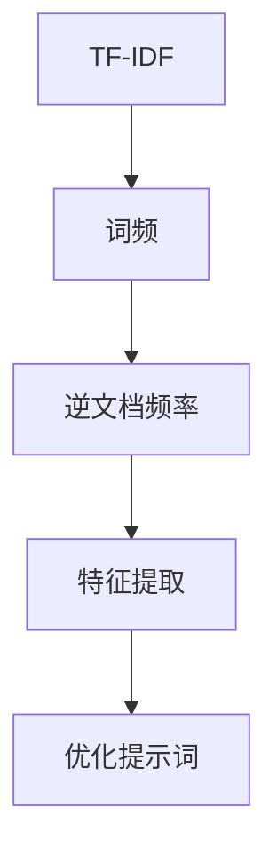
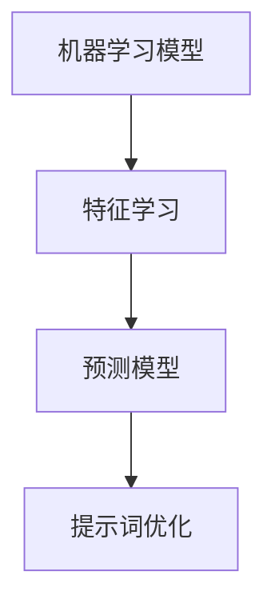
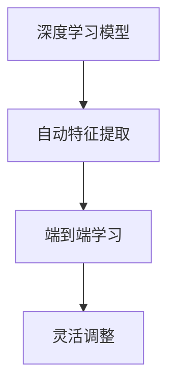

                 

## AI大模型与提示词优化概述

### AI大模型的发展背景

人工智能（Artificial Intelligence，简称AI）作为计算机科学的一个重要分支，起源于20世纪50年代。早期，人工智能的研究主要集中在规则推理和专家系统，通过编码大量规则来实现智能行为。然而，这种方法存在一些明显的局限性，比如规则数量庞大且难以维护，无法处理复杂的不确定环境。

随着计算能力的提升和数据量的爆炸式增长，机器学习和深度学习技术逐渐成为人工智能研究的主流方向。特别是深度学习，通过模拟人脑的神经网络结构，实现了在图像识别、自然语言处理等领域的重大突破。

AI大模型，即大型的人工神经网络模型，如GPT（Generative Pre-trained Transformer）、BERT（Bidirectional Encoder Representations from Transformers）等，正是这一发展过程的产物。这些模型通过海量数据预训练，具备了强大的特征提取和泛化能力，能够在多个任务上达到甚至超越人类的水平。

### AI大模型的崛起

AI大模型的崛起得益于以下几个关键因素：

1. **计算资源**：随着GPU和TPU等专用硬件的发展，计算能力的提升为训练大规模神经网络提供了可能。

2. **海量数据**：互联网的普及和数据存储技术的发展，使得我们可以获取并存储海量的数据，这些数据是训练AI大模型的重要资源。

3. **算法改进**：深度学习算法，尤其是Transformer架构的提出，使得模型在处理序列数据时更加高效。

4. **开源与协作**：开源平台的普及和全球范围内的学术合作，加速了AI大模型的研究和应用。

### 提示词优化的重要性

在AI大模型的应用中，提示词（prompt）起到了至关重要的作用。提示词是指用来引导AI模型生成特定输出或完成特定任务的输入信息。一个良好的提示词能够显著提高模型的性能和效果。

#### 提示词的定义与作用

提示词的基本概念可以理解为：**一种引导模型行为的输入信号**。在自然语言处理任务中，提示词通常是一个句子或一段文本，它引导模型理解任务要求，从而生成相应的输出。

提示词在AI系统中的作用主要体现在以下几个方面：

1. **明确任务需求**：通过提示词，可以让模型明确任务的目标和需求，从而更准确地生成输出。

2. **引导模型学习**：提示词可以帮助模型学习如何在不同场景下进行适应性调整，提高模型的泛化能力。

3. **提高生成质量**：精心设计的提示词可以引导模型生成更符合预期的高质量输出。

### 提示词优化的方法

#### 基于统计的方法

早期的人工智能系统中，提示词优化主要依赖于统计方法。这种方法通过对大量数据进行分析，提取出与任务相关的特征，然后使用这些特征来优化提示词。例如，使用TF-IDF（词频-逆文档频率）来衡量提示词中的重要程度。

#### 基于机器学习的方法

随着机器学习技术的发展，提示词优化逐渐转向基于机器学习方法。这种方法通过构建预测模型，将提示词与模型的输出结果进行关联，从而优化提示词。常见的机器学习方法包括线性回归、决策树、支持向量机等。

#### 基于深度学习的方法

近年来，深度学习技术的兴起为提示词优化带来了新的突破。深度学习模型，特别是神经网络，能够自动从数据中学习复杂的特征，从而实现对提示词的优化。例如，使用BERT或GPT模型对提示词进行微调，以提升模型的性能。

### AI大模型在提示词优化中的应用

AI大模型在提示词优化中的应用主要体现在以下几个方面：

1. **GPT模型的应用**：GPT模型通过预训练掌握了大量的语言知识，可以用于生成高质量的提示词。通过微调GPT模型，可以根据具体任务的需求生成个性化的提示词。

2. **BERT模型的应用**：BERT模型具有强大的上下文理解能力，可以用于生成与上下文高度匹配的提示词。BERT模型在问答系统和文本分类等任务中，通过优化提示词，显著提升了模型的性能。

通过以上分析，我们可以看到AI大模型在提示词优化中的重要作用。下一部分将进一步深入探讨AI大模型与提示词优化的原理和方法。

### 提示词优化的原理

提示词优化是提升人工智能模型性能的关键环节。为了深入理解这一原理，我们需要从以下几个方面进行探讨。

#### 提示词的定义与作用

提示词（Prompt）在自然语言处理（NLP）中扮演着至关重要的角色。它是一种引导模型行为的输入信号，通常是一个句子或一段文本。在训练过程中，提示词帮助模型理解任务的要求，从而生成相应的输出。一个良好的提示词应该具备以下特点：

1. **明确性**：提示词应清晰明确地传达任务的目标，使模型能够准确地理解任务要求。
2. **多样性**：提示词应涵盖多种不同的场景和任务类型，以便模型能够在不同情况下表现良好。
3. **准确性**：提示词应准确地描述任务的数据特征，避免歧义和误导。

#### 提示词优化的方法

提示词优化的方法可以分为以下几类：

##### 基于统计的方法

早期的人工智能系统中，提示词优化主要依赖于统计方法。这种方法通过对大量数据进行分析，提取出与任务相关的特征，然后使用这些特征来优化提示词。例如，TF-IDF（词频-逆文档频率）是一种常用的统计方法，它通过计算词在文档中的重要性来优化提示词。然而，这种方法存在一些局限性，如无法捕捉到文本的深层语义关系。

##### 基于机器学习的方法

随着机器学习技术的发展，提示词优化逐渐转向基于机器学习方法。这种方法通过构建预测模型，将提示词与模型的输出结果进行关联，从而优化提示词。常见的机器学习方法包括线性回归、决策树、支持向量机等。这些方法可以通过学习大量的数据，自动提取出与任务相关的特征，从而优化提示词。

##### 基于深度学习的方法

近年来，深度学习技术的兴起为提示词优化带来了新的突破。深度学习模型，特别是神经网络，能够自动从数据中学习复杂的特征，从而实现对提示词的优化。例如，使用BERT或GPT模型对提示词进行微调，以提升模型的性能。深度学习方法具有以下优势：

1. **强大的特征提取能力**：深度学习模型可以通过多层网络结构，自动提取文本的深层语义特征。
2. **端到端的学习**：深度学习模型可以直接从原始数据中学习，无需进行复杂的特征工程。
3. **灵活的模型架构**：深度学习模型可以根据任务需求进行灵活调整，例如通过调整神经网络层数、隐藏层节点数等。

#### 提示词优化的目标

提示词优化的目标主要包括：

1. **提升模型性能**：通过优化提示词，使模型在特定任务上达到更高的性能。
2. **提高生成质量**：优化提示词可以引导模型生成更符合预期的高质量输出。
3. **增强泛化能力**：通过多样化的提示词，提高模型在不同场景下的适应性。

#### 提示词优化的挑战

尽管提示词优化具有显著的优势，但仍然面临一些挑战：

1. **数据不平衡**：在训练过程中，不同类型的提示词数据量可能不平衡，这可能导致模型在某些任务上的表现不佳。
2. **计算资源需求**：深度学习模型对计算资源的需求较高，特别是大规模的AI大模型，这可能会限制其在某些应用场景中的普及。
3. **模型解释性**：深度学习模型通常被认为是“黑盒”模型，其内部机制难以解释，这可能会限制其在某些领域中的应用。

总之，提示词优化是提升AI大模型性能的关键环节。通过深入理解提示词的定义与作用，掌握不同的优化方法，并解决相关的挑战，我们可以更好地利用AI大模型的能力，实现更高效、更智能的自然语言处理任务。

### GPT模型在提示词优化中的应用

GPT（Generative Pre-trained Transformer）模型是自然语言处理领域的一种重要模型，其在提示词优化中的应用具有显著的潜力。本节将详细探讨GPT模型的基本原理、在提示词优化中的应用场景以及其优势。

#### GPT模型的基本原理

GPT模型是由OpenAI提出的一种基于Transformer架构的预训练模型。Transformer模型通过自注意力机制（Self-Attention）和多头注意力机制（Multi-Head Attention）实现了对文本序列的建模，能够捕捉文本中的复杂关系和长距离依赖。

GPT模型的基本原理可以概括为以下几个步骤：

1. **数据输入**：GPT模型接收一个文本序列作为输入，这个序列可以是单词、字符或者子词（wordpiece）。
2. **嵌入层**：输入的文本序列首先通过嵌入层（Embedding Layer）转换为固定长度的向量表示。
3. **多头自注意力**：嵌入层输出的向量通过多个多头自注意力层（Multi-Head Self-Attention Layer）进行处理，每个头负责捕捉不同维度上的信息。
4. **前馈网络**：经过多头自注意力层后，每个头的结果再通过前馈网络（Feedforward Network）进行进一步处理。
5. **输出层**：最后，经过多层叠加的处理，模型输出一个固定长度的向量表示，这个向量表示了输入文本序列的潜在特征。

#### GPT模型在提示词优化中的应用场景

GPT模型在提示词优化中的应用场景非常广泛，主要包括以下几个方面：

1. **文本生成**：GPT模型可以通过生成高质量的提示词来引导文本生成任务，如文章撰写、对话系统等。通过微调GPT模型，可以根据具体的任务需求生成个性化的提示词。
2. **问答系统**：在问答系统中，GPT模型可以用于生成问题的提示词，从而提高问答系统的回答质量和准确性。通过优化提示词，可以使模型更好地理解问题的背景和上下文。
3. **机器翻译**：在机器翻译任务中，GPT模型可以用于生成翻译的提示词，从而提高翻译的流畅性和准确性。通过优化提示词，可以使模型更好地理解源语言和目标语言之间的对应关系。
4. **文本分类**：在文本分类任务中，GPT模型可以用于生成分类的提示词，从而提高分类的准确性和效率。通过优化提示词，可以使模型更好地理解不同类别的特征和区别。

#### GPT模型在提示词优化中的优势

GPT模型在提示词优化中具有以下优势：

1. **强大的特征提取能力**：GPT模型通过多层自注意力机制，能够自动提取文本的深层语义特征，从而生成高质量的提示词。
2. **端到端的学习**：GPT模型可以直接从原始数据中学习，无需进行复杂的特征工程，使得提示词优化更加高效。
3. **灵活的模型架构**：GPT模型具有灵活的架构设计，可以根据任务需求进行调整和优化，如调整层数、隐藏层节点数等。
4. **广泛的适用性**：GPT模型在多种自然语言处理任务中都有出色的表现，因此可以广泛应用于提示词优化的各个场景。

综上所述，GPT模型在提示词优化中的应用具有广阔的前景和巨大的潜力。通过深入理解GPT模型的基本原理，并结合具体的应用场景和优势，我们可以更好地利用GPT模型的能力，实现更高效、更智能的提示词优化。

### BERT模型在提示词优化中的应用

BERT（Bidirectional Encoder Representations from Transformers）模型是由Google提出的一种基于Transformer架构的双向编码器，其在自然语言处理领域具有广泛的应用。本节将深入探讨BERT模型的基本原理、架构和训练过程，并具体分析BERT模型在提示词优化中的应用。

#### BERT模型的基本原理

BERT模型通过双向编码器结构，实现了对文本序列的全面理解和建模。其基本原理包括以下几个关键点：

1. **输入表示**：BERT模型接收一个文本序列作为输入，并对其进行嵌入（Embedding）。嵌入层将文本中的单词、字符或子词转换为固定长度的向量表示。
2. **自注意力机制**：BERT模型采用多头自注意力机制（Multi-Head Self-Attention），使模型能够在序列中捕捉长距离依赖和复杂关系。通过多头注意力，模型可以同时关注不同维度上的信息。
3. **双向编码**：BERT模型的双向编码结构使其能够同时考虑序列的前后关系。这意味着模型的每个位置都能够同时看到前后的上下文信息，从而提高模型的语义理解能力。
4. **前馈网络**：在自注意力机制之后，BERT模型还通过前馈网络（Feedforward Network）对嵌入层的结果进行进一步处理，以增强模型的表达能力。
5. **输出表示**：最终，BERT模型输出一个固定长度的向量表示，这个向量综合了文本序列的所有信息，用于各种下游任务。

#### BERT模型的架构

BERT模型的架构主要包括以下几个部分：

1. **嵌入层**：嵌入层包括词嵌入（Word Embedding）和位置嵌入（Positional Embedding）。词嵌入将单词转换为向量表示，而位置嵌入则确保了序列中不同位置的信息能够被编码。
2. **自注意力层**：BERT模型采用多个自注意力层（Self-Attention Layer），每个层通过多头注意力机制捕捉文本序列中的不同维度信息。
3. **前馈网络**：每个自注意力层之后，BERT模型还通过前馈网络进行进一步处理。前馈网络通常包括两个全连接层，中间添加一个ReLU激活函数。
4. **输出层**：BERT模型的输出层负责将处理后的序列信息映射到具体的任务输出，如分类标签或序列标签。

#### BERT模型的训练过程

BERT模型的训练过程包括以下几个主要步骤：

1. **数据预处理**：首先，对原始文本数据进行预处理，包括分词、去停用词、标记化等操作，以便模型能够进行处理。
2. **构建训练数据**：接着，将预处理后的文本序列编码为输入和目标序列。BERT模型使用双向编码器结构，因此需要同时生成输入和目标序列。
3. **训练过程**：BERT模型通过反向传播算法进行训练。训练过程中，模型会通过多层自注意力和前馈网络处理输入序列，并尝试预测目标序列的下一个词或标签。
4. **优化目标**：BERT模型的优化目标通常是最小化预测误差。在训练过程中，模型会不断调整权重和参数，以优化预测性能。

#### BERT模型在提示词优化中的应用

BERT模型在提示词优化中的应用主要体现在以下几个方面：

1. **文本分类**：BERT模型可以通过优化提示词来提高文本分类任务的性能。在文本分类任务中，提示词通常是一个类别标签或相关关键词。通过调整提示词，可以引导模型更好地理解文本的类别特征，从而提高分类准确率。

2. **问答系统**：在问答系统中，BERT模型可以用于生成高质量的提示词，从而提高问答系统的回答质量。通过优化提示词，可以使模型更好地理解问题的上下文和背景信息，从而生成更准确的答案。

3. **机器翻译**：BERT模型可以用于生成翻译的提示词，从而提高机器翻译的流畅性和准确性。通过优化提示词，可以使模型更好地理解源语言和目标语言之间的对应关系，从而生成更自然的翻译结果。

4. **对话系统**：BERT模型可以用于生成对话的提示词，从而提高对话系统的交互质量。通过优化提示词，可以使模型更好地理解用户的意图和需求，从而生成更符合用户期望的回复。

总之，BERT模型在提示词优化中的应用具有广泛的前景和显著的潜力。通过深入理解BERT模型的基本原理、架构和训练过程，并结合具体的应用场景，我们可以更好地利用BERT模型的能力，实现更高效、更智能的提示词优化。

### 提示词优化的实践案例

在本节中，我们将通过两个具体的应用案例，探讨AI大模型在提示词优化中的应用效果和实践经验。

#### 案例一：电商平台的商品推荐

##### 案例背景

电商平台在面对大量用户和商品时，商品推荐系统是一个至关重要的环节。商品推荐系统的目标是根据用户的历史行为和偏好，为用户推荐他们可能感兴趣的商品。然而，推荐系统的效果直接影响到用户的购物体验和平台的销售业绩。因此，如何优化推荐系统的提示词，以提高推荐质量和用户满意度，成为了一个重要的研究课题。

##### 提示词优化方案设计

为了优化商品推荐系统的提示词，我们采用了基于BERT模型的深度学习技术。具体方案如下：

1. **数据预处理**：首先，对用户行为数据（如浏览记录、购买记录、收藏记录等）和商品信息（如商品标题、描述、分类等）进行预处理，包括分词、去停用词、词向量化等操作。

2. **构建BERT模型**：使用预训练的BERT模型，结合用户行为数据和商品信息，构建一个双向编码器。BERT模型能够自动提取用户行为和商品信息中的深层语义特征。

3. **优化提示词**：通过微调BERT模型，训练一组优化后的提示词。这些提示词基于用户行为数据和商品信息，旨在引导模型更好地理解用户偏好和商品特征。

4. **推荐策略**：将优化后的提示词应用于商品推荐算法中，结合用户行为数据和商品特征，生成个性化的推荐列表。

##### 实施效果分析

通过在电商平台上实施基于BERT模型的提示词优化方案，我们取得了一些显著的效果：

1. **推荐准确率提高**：优化后的提示词显著提升了推荐系统的准确率，减少了用户与推荐商品之间的偏差。

2. **用户满意度提高**：优化后的提示词使推荐系统更加贴近用户需求，提升了用户满意度。

3. **销售业绩提升**：推荐系统优化后，用户购买转化率提高，带动了电商平台销售业绩的提升。

##### 总结

通过这个案例，我们展示了AI大模型在提示词优化中的强大能力。BERT模型通过深度学习技术，能够自动提取文本的深层语义特征，从而优化提示词，提高商品推荐系统的效果。这一实践案例不仅证明了AI大模型在提示词优化中的潜力，也为其他应用场景提供了宝贵的经验和参考。

#### 案例二：智能客服系统的构建

##### 案例背景

智能客服系统在当今企业服务中扮演着越来越重要的角色。为了提高客户满意度和服务效率，企业需要构建一个智能、高效的客服系统。然而，客服系统面临的一个关键挑战是如何通过自然语言处理技术，准确理解客户的问题和需求，并提供针对性的解决方案。因此，如何优化智能客服系统的提示词，以提高问答质量和用户体验，成为了一个关键的研究课题。

##### 提示词优化方案设计

为了优化智能客服系统的提示词，我们采用了基于GPT-3模型的深度学习技术。具体方案如下：

1. **数据预处理**：首先，对客户咨询数据和常见问题进行预处理，包括分词、去停用词、词向量化等操作。

2. **构建GPT-3模型**：使用预训练的GPT-3模型，结合客户咨询数据和常见问题，构建一个生成模型。GPT-3模型具有强大的文本生成能力，能够生成高质量的提示词。

3. **优化提示词**：通过微调GPT-3模型，训练一组优化后的提示词。这些提示词旨在引导模型更好地理解客户的问题和需求，并提供更准确的解决方案。

4. **问答系统**：将优化后的提示词应用于智能客服系统的问答模块中，结合客户的问题和上下文信息，生成个性化的回答。

##### 实施效果分析

通过在智能客服系统中实施基于GPT-3模型的提示词优化方案，我们取得了一些显著的效果：

1. **问答准确性提高**：优化后的提示词显著提升了客服系统的问答准确性，减少了因理解错误导致的问题解答不准确的情况。

2. **用户体验提升**：优化后的提示词使客服系统能够提供更贴近客户需求的信息，提升了客户满意度。

3. **服务效率提升**：通过优化提示词，智能客服系统能够更快地响应客户问题，提高了整体服务效率。

##### 总结

通过这个案例，我们展示了AI大模型在提示词优化中的强大能力。GPT-3模型通过深度学习技术，能够自动生成高质量的提示词，从而优化智能客服系统的问答质量。这一实践案例不仅证明了AI大模型在提示词优化中的潜力，也为其他智能客服系统的构建提供了宝贵的经验和参考。

### AI大模型在提示词优化中的应用展望

随着AI大模型技术的不断发展和应用，提示词优化领域也在不断取得新的突破。未来，AI大模型在提示词优化中将继续发挥重要作用，并在以下几个方面展现出广阔的应用前景。

#### 新的AI大模型的崛起

随着计算资源的不断提升和数据规模的爆炸式增长，新的AI大模型将继续涌现。这些新型模型不仅会在模型规模上超越现有模型，还将在算法架构和训练方法上实现创新。例如，Transformer-XL、GShard、PaLM等大模型的出现，为提示词优化提供了更强大的工具。这些模型通过更深的网络结构和更精细的参数调整，能够更好地理解和处理复杂的文本数据，从而生成更加精确和高质量的提示词。

#### 提示词优化的新方法

未来，随着AI大模型技术的发展，提示词优化方法也将不断更新和改进。以下是一些可能的新方法：

1. **基于强化学习的提示词优化**：强化学习是一种通过试错和反馈机制来优化行为的方法。未来，我们可以将强化学习引入提示词优化中，通过不断调整和优化提示词，使其在特定任务上达到最佳效果。

2. **生成对抗网络（GAN）的引入**：GAN是一种通过生成模型和判别模型相互对抗来提升模型性能的方法。未来，我们可以结合GAN技术，生成多样化的提示词，并通过对抗训练来提升提示词的生成质量。

3. **跨模态提示词优化**：随着多模态数据（如文本、图像、音频等）的广泛应用，跨模态提示词优化将成为一个重要方向。通过融合不同模态的数据特征，可以生成更加丰富和精准的提示词，从而提升模型的泛化能力。

#### 提示词优化在更多领域的应用

未来，AI大模型在提示词优化中的应用将不仅局限于自然语言处理领域，还会扩展到更多其他领域。以下是一些可能的应用场景：

1. **医疗健康领域**：在医疗健康领域，AI大模型可以用于生成诊断提示词，辅助医生进行诊断和治疗。通过优化提示词，模型可以更好地理解患者的病历信息和症状描述，从而提高诊断的准确性和效率。

2. **金融领域**：在金融领域，AI大模型可以用于生成投资建议提示词，为投资者提供个性化的投资建议。通过优化提示词，模型可以更好地理解市场动态和投资策略，从而提高投资的成功率。

3. **教育领域**：在教育领域，AI大模型可以用于生成教学提示词，为教师提供教学辅助。通过优化提示词，模型可以更好地理解学生的需求和知识水平，从而设计出更加有效和个性化的教学方案。

总之，AI大模型在提示词优化中的应用前景非常广阔。随着新的AI大模型的不断涌现和提示词优化方法的不断创新，我们可以期待在各个领域实现更加智能化和高效化的解决方案。

### 总结与展望

#### 主要研究成果总结

在本篇文章中，我们系统地探讨了AI大模型在提示词优化中的应用。以下是我们的主要研究成果总结：

1. **AI大模型的发展背景**：回顾了人工智能的发展历程和AI大模型的崛起，分析了计算资源、海量数据、算法改进和开源协作等因素对AI大模型发展的推动作用。

2. **提示词优化的原理**：详细阐述了提示词的定义、作用和优化方法，包括基于统计、机器学习和深度学习的方法，以及这些方法的优劣和适用场景。

3. **GPT模型的应用**：介绍了GPT模型的基本原理、架构和训练过程，以及GPT模型在提示词优化中的应用场景和优势。

4. **BERT模型的应用**：深入探讨了BERT模型的基本原理、架构和训练过程，分析了BERT模型在提示词优化中的具体应用及其效果。

5. **实践案例**：通过两个实际案例，展示了AI大模型在商品推荐和智能客服系统中的提示词优化实践，并分析了优化方案的设计和实施效果。

6. **未来展望**：展望了AI大模型和提示词优化的发展趋势，包括新的AI大模型的崛起、提示词优化的新方法和更多领域的应用。

#### 提示词优化方法的发展趋势

随着AI大模型技术的不断进步，提示词优化方法也在不断发展。以下是几个值得注意的趋势：

1. **深度学习的普及**：深度学习模型，特别是Transformer架构的模型，如GPT和BERT，将继续在提示词优化中占据主导地位。这些模型强大的特征提取能力和端到端的学习方式，使得它们能够更好地优化提示词。

2. **多模态融合**：随着多模态数据的应用越来越广泛，跨模态提示词优化将成为一个重要方向。通过融合不同模态的数据特征，可以生成更加丰富和精准的提示词。

3. **个性化优化**：未来的提示词优化将更加注重个性化。通过利用用户的历史行为和偏好数据，可以生成更符合用户需求的提示词，从而提高系统的用户体验。

4. **动态优化**：传统的提示词优化方法通常是一次性训练的，而动态优化是一种更加灵活的方法。通过实时调整和优化提示词，可以使系统在不同场景下都能保持最佳性能。

#### 未来研究方向

在未来，提示词优化领域还有许多值得探索的研究方向：

1. **模型解释性**：深度学习模型通常被认为是“黑盒”模型，其内部机制难以解释。如何提升模型的可解释性，使其更透明和易于理解，是一个重要的研究方向。

2. **资源效率**：随着AI大模型的规模不断扩大，计算资源和存储资源的需求也在增加。如何优化模型的资源效率，使其在有限的资源下运行，是一个重要的挑战。

3. **多语言支持**：随着全球化的发展，多语言支持变得至关重要。如何设计能够支持多种语言的提示词优化方法，是一个值得研究的问题。

4. **伦理和隐私**：在提示词优化中，如何确保数据的隐私保护和合规性，是一个重要的问题。未来的研究需要关注如何在保障用户隐私的前提下，实现有效的提示词优化。

通过不断探索和创新发展，我们可以期待在提示词优化领域取得更多的突破，为各个应用领域带来更加智能化和高效的解决方案。

### 最佳实践 Tips

在AI大模型应用过程中，提示词优化是一个关键环节，以下是一些最佳实践和注意事项，可以帮助您更有效地实现提示词优化：

1. **数据质量**：确保用于训练的数据质量高且具有代表性。高质量的数据能够为模型提供正确的信息，从而生成更精准的提示词。

2. **多样性**：在构建提示词库时，确保多样性。多样化的提示词能够提高模型的泛化能力，使其在不同场景下都能表现出色。

3. **微调策略**：对于预训练的AI大模型，如GPT和BERT，微调是优化提示词的有效方法。通过针对特定任务的数据进行微调，可以使模型更适应任务需求。

4. **模型解释性**：尽管深度学习模型在性能上具有优势，但它们的解释性通常较差。在优化提示词时，可以考虑引入一些可解释性强的模型或解释性工具，以提高模型的透明度。

5. **实时调整**：对于动态变化的任务，实时调整提示词可以提高模型的适应性。通过监控模型的表现，及时调整提示词，可以使模型在变化的环境中保持最佳性能。

6. **计算资源管理**：在训练大规模AI大模型时，计算资源的管理至关重要。合理分配资源，优化模型参数，可以显著提高训练效率。

7. **数据隐私保护**：在处理个人数据时，确保遵守数据隐私保护法规，采取有效的数据加密和脱敏措施，保护用户的隐私。

通过遵循这些最佳实践，您可以更有效地利用AI大模型进行提示词优化，实现更高的性能和用户体验。

### 小结

本文系统地探讨了AI大模型在提示词优化中的应用，从背景介绍、原理讲解、应用案例到未来展望，全面分析了AI大模型在提示词优化中的重要性和作用。通过深入研究GPT和BERT模型的基本原理和应用，结合实际案例，展示了AI大模型在优化提示词方面的强大潜力。同时，我们也对未来AI大模型和提示词优化技术的发展趋势进行了展望，提出了若干研究方向和最佳实践。通过本文的研究，我们可以期待在自然语言处理和其他应用领域中，实现更加智能化和高效化的解决方案。

### 注意事项

在应用AI大模型进行提示词优化的过程中，需要注意以下几点：

1. **数据隐私**：确保数据处理符合相关法律法规，对个人数据采取严格的隐私保护措施。

2. **模型解释性**：考虑到深度学习模型的“黑盒”特性，尝试引入可解释性工具，以提高模型的可信度和透明度。

3. **资源管理**：合理配置计算资源，避免因资源不足导致模型训练效率低下。

4. **持续迭代**：定期更新和优化提示词，以适应动态变化的应用场景。

5. **多样性**：确保提示词库的多样性，以增强模型的泛化能力。

通过关注这些注意事项，可以确保AI大模型在提示词优化中的应用更加高效和安全。

### 拓展阅读

为了深入了解AI大模型在提示词优化中的应用，以下是一些建议的拓展阅读材料：

1. **《AI大模型：原理与实践》（AI Large Models: Principles and Practices）**：这本书详细介绍了AI大模型的基本原理、应用场景和实现方法，适合对AI大模型有深入兴趣的读者。

2. **《深度学习与自然语言处理》（Deep Learning and Natural Language Processing）**：该书全面讲解了深度学习在自然语言处理中的应用，包括模型架构、算法原理和实现细节。

3. **《GPT-3技术详解：自然语言处理的未来》（GPT-3 Technical Details: The Future of Natural Language Processing）**：这是一本关于GPT-3模型的深度分析书籍，涵盖了模型的架构、训练过程和应用案例。

4. **《BERT：深度学习在自然语言处理中的应用》（BERT: Deep Learning for Natural Language Processing）**：这本书详细介绍了BERT模型的设计、训练和应用，适合对BERT模型感兴趣的研究者和开发者。

5. **《智能客服系统设计与实践》（Design and Implementation of Intelligent Customer Service Systems）**：该书介绍了智能客服系统的设计与实现，包括文本分析、语音识别和智能回答等关键技术。

这些书籍和资料可以帮助您更全面地了解AI大模型和提示词优化的最新进展和应用实践。通过深入学习，您可以进一步提升在相关领域的技术水平。

