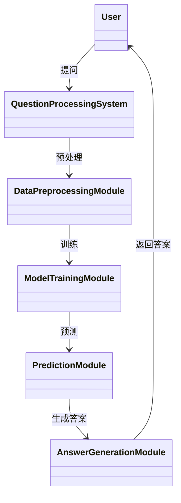
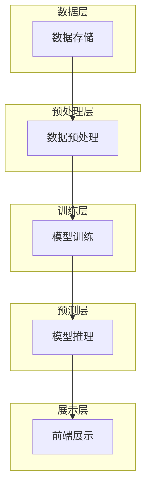
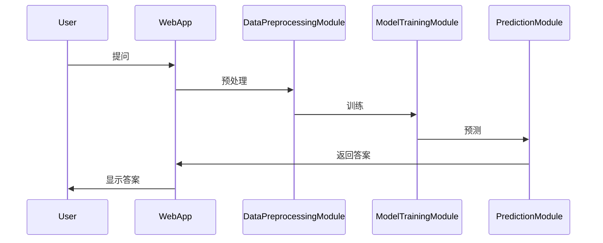

                 


# AI大模型时代的新编程范式

> 关键词：AI大模型、编程范式、算法原理、系统架构、项目实战、最佳实践

> 摘要：本文将深入探讨AI大模型时代的新编程范式。首先，我们将回顾AI大模型的发展历程，分析传统编程范式的局限性，并阐述新编程范式的必要性和核心要素。接着，我们将详细讨论AI大模型的核心概念与联系，包括分类、关系和特征对比。然后，我们将讲解AI大模型的算法原理，通过流程图、数学模型和Python代码实例进行阐述。接下来，我们将分析AI大模型系统的分析与架构设计方案，包括问题场景介绍、系统功能设计、系统架构设计、系统接口设计和系统交互设计。随后，我们将通过一个实战项目展示新编程范式的应用。最后，我们将总结最佳实践与拓展，提供实用技巧和建议。

### 目录大纲

#### 第一部分：背景介绍

**第1章：AI大模型时代的新编程范式概述**

**第2章：AI大模型的核心概念与联系**

**第3章：AI大模型的算法原理讲解**

**第4章：AI大模型系统的分析与架构设计方案**

**第5章：AI大模型项目实战**

**第6章：AI大模型时代的新编程范式的最佳实践与拓展**

---

### 第一部分：背景介绍

#### 第1章：AI大模型时代的新编程范式概述

**1.1 问题背景**

随着人工智能技术的迅猛发展，AI大模型（如GPT、BERT等）已经成为了当今最热门的研究领域之一。这些模型通过深度学习和自然语言处理等技术，实现了对大量数据的自动学习和处理能力，为各行各业带来了巨大的变革。然而，传统编程范式在处理这些复杂模型时面临着诸多挑战，这促使我们探索一种新的编程范式。

**1.1.1 AI大模型的发展历程**

AI大模型的发展可以追溯到20世纪80年代，当时神经网络的研究取得了一定的进展。随着计算能力的提升和数据量的增加，深度学习在21世纪初得到了广泛关注。2012年，AlexNet在ImageNet图像识别大赛中取得了突破性的成绩，标志着深度学习的崛起。随后，随着更大规模的数据和更复杂的模型结构，AI大模型逐渐成为研究热点。

**1.1.2 新编程范式的概念与特征**

新编程范式旨在应对AI大模型的复杂性，提供更高效、更灵活的编程方式。它与传统的编程范式相比，具有以下特征：

- **模型驱动**：以模型为核心，将数据和处理逻辑紧密整合。
- **自动微分**：利用自动微分技术，方便地实现模型训练和优化。
- **动态调度**：支持动态调度和并行计算，提高计算效率。
- **模块化**：支持模块化设计，便于复用和扩展。

**1.1.3 为什么要引入新编程范式**

传统编程范式在处理AI大模型时存在以下问题：

- **计算复杂度高**：传统编程范式难以高效地处理大规模数据和高复杂度的模型结构。
- **调试困难**：AI大模型涉及大量参数和复杂的计算过程，调试过程繁琐且易出错。
- **扩展性差**：传统编程范式难以适应快速变化的需求和不断增大的模型规模。

因此，引入新编程范式势在必行，以提高AI大模型的开发效率和稳定性。

**1.2 问题描述**

传统编程范式在处理AI大模型时面临着以下挑战：

- **计算能力不足**：传统计算机体系结构难以满足AI大模型的高计算需求。
- **数据处理能力有限**：传统编程范式难以高效地处理大规模数据。
- **模型结构复杂**：AI大模型通常包含大量参数和多层神经网络，导致模型结构复杂。
- **调试和优化困难**：传统编程范式缺乏有效的调试和优化工具，导致调试过程繁琐且容易出错。

**1.2.1 传统编程范式的挑战**

- **计算复杂度高**：传统编程范式难以高效地处理大规模数据和高复杂度的模型结构。
- **数据处理能力有限**：传统编程范式难以高效地处理大规模数据。
- **模型结构复杂**：AI大模型通常包含大量参数和多层神经网络，导致模型结构复杂。
- **调试和优化困难**：传统编程范式缺乏有效的调试和优化工具，导致调试过程繁琐且容易出错。

**1.2.2 新编程范式的优势**

新编程范式在以下几个方面具有显著优势：

- **高效计算**：利用现代计算机体系结构和并行计算技术，提高计算效率。
- **数据处理能力**：借助大数据技术和分布式计算，提高数据处理能力。
- **模型结构优化**：通过自动微分和优化算法，简化模型结构，提高模型性能。
- **调试和优化工具**：提供丰富的调试和优化工具，简化开发过程，提高开发效率。

**1.3 问题解决**

新编程范式通过以下关键要素解决传统编程范式的问题：

- **自动微分**：利用自动微分技术，方便地实现模型训练和优化。
- **动态调度**：支持动态调度和并行计算，提高计算效率。
- **模块化设计**：支持模块化设计，便于复用和扩展。
- **高效的数据处理**：借助大数据技术和分布式计算，提高数据处理能力。

**1.3.1 新编程范式的关键要素**

新编程范式的关键要素包括：

- **自动微分**：自动微分技术是AI大模型训练的核心，它允许我们自动计算模型参数的梯度，从而进行优化。
- **动态调度**：动态调度技术可以根据计算需求实时调整计算资源，提高计算效率。
- **模块化设计**：模块化设计便于代码的复用和扩展，提高开发效率。
- **高效的数据处理**：借助大数据技术和分布式计算，提高数据处理能力。

**1.3.2 新编程范式在实际应用中的效果**

新编程范式在实际应用中取得了显著的效果，具体表现为：

- **计算效率提高**：新编程范式通过并行计算和动态调度，显著提高了计算效率。
- **模型性能提升**：新编程范式通过自动微分和优化算法，简化了模型结构，提高了模型性能。
- **开发效率提升**：模块化设计和高效的数据处理技术提高了开发效率，降低了开发成本。
- **应用范围扩大**：新编程范式使得AI大模型的应用范围得到了扩大，涵盖了更多领域。

**1.4 边界与外延**

新编程范式虽然在处理AI大模型方面具有显著优势，但也存在一定的边界和限制条件，包括：

- **计算资源要求**：新编程范式对计算资源的需求较高，特别是在训练大型模型时，需要大量的计算资源和存储资源。
- **数据处理能力限制**：新编程范式在处理大规模数据时，可能面临数据处理能力限制，特别是在分布式计算环境中。
- **开发技能要求**：新编程范式需要开发者具备一定的自动微分、并行计算和分布式计算技能，否则可能难以充分发挥其优势。
- **兼容性限制**：新编程范式与现有软件开发流程和工具的兼容性可能存在问题，需要一定的适应和改进。

**1.5 概念结构与核心要素组成**

新编程范式的概念结构包括以下几个方面：

- **自动微分**：自动微分技术是实现模型训练和优化的核心。
- **动态调度**：动态调度技术是实现并行计算和高效资源利用的关键。
- **模块化设计**：模块化设计是实现代码复用和系统扩展的基础。
- **高效数据处理**：高效数据处理技术是实现大规模数据处理和快速模型训练的保障。

新编程范式的核心要素组成如下：

- **自动微分库**：提供自动微分功能，如TensorFlow、PyTorch等。
- **动态调度框架**：提供动态调度功能，如Apache Flink、Apache Spark等。
- **模块化开发工具**：提供模块化开发支持，如Python的模块化编程、JavaScript的模块化开发等。
- **分布式计算平台**：提供分布式计算支持，如Hadoop、Kubernetes等。

---

### 第一部分：背景介绍

#### 第2章：AI大模型的核心概念与联系

**2.1 AI大模型的概念**

AI大模型是指通过深度学习和自然语言处理等技术，对大量数据进行训练和优化，形成具有高度智能的模型。这些模型通常包含数百万甚至数十亿个参数，能够实现复杂的任务，如文本生成、图像识别、语音识别等。

**2.1.1 AI大模型的定义**

AI大模型（AI Large Models，简称ALM）是指通过深度学习和自然语言处理等技术，对大规模数据进行训练和优化，形成具有高度智能的模型。这些模型通常包含数百万甚至数十亿个参数，能够实现复杂的任务，如文本生成、图像识别、语音识别等。

**2.1.2 AI大模型的特点**

AI大模型具有以下特点：

- **大规模**：AI大模型通常包含数百万甚至数十亿个参数，数据规模巨大。
- **智能性**：通过深度学习和自然语言处理等技术，AI大模型能够实现高度智能的任务。
- **复杂性**：AI大模型的结构复杂，涉及多层神经网络和复杂的算法。
- **效率**：AI大模型在处理大规模数据时具有高效性，能够快速完成计算和预测任务。

**2.2 AI大模型的分类**

根据不同的分类标准，AI大模型可以分为以下几类：

- **按功能分类**：根据AI大模型的功能，可以分为文本生成模型、图像识别模型、语音识别模型等。
- **按架构分类**：根据AI大模型的架构，可以分为单层模型、多层模型、转换器模型等。
- **按数据来源分类**：根据AI大模型的数据来源，可以分为监督学习模型、无监督学习模型、强化学习模型等。

**2.2.1 按功能分类**

- **文本生成模型**：用于生成文本，如自然语言生成、文章生成等。
- **图像识别模型**：用于识别和分类图像，如图像分类、目标检测等。
- **语音识别模型**：用于识别和转换语音为文本，如语音识别、语音合成等。

**2.2.2 按架构分类**

- **单层模型**：仅包含单层神经网络，如卷积神经网络（CNN）。
- **多层模型**：包含多层神经网络，如深度神经网络（DNN）、循环神经网络（RNN）。
- **转换器模型**：基于转换器架构，如转换器循环神经网络（Transformer）。

**2.3 AI大模型与编程范式的关系**

AI大模型对编程范式产生了深远的影响，主要体现在以下几个方面：

- **编程语言**：AI大模型的发展推动了新的编程语言和工具的出现，如Python、TensorFlow、PyTorch等。
- **开发框架**：AI大模型需要高效的开发框架来支持，如TensorFlow、PyTorch、Keras等。
- **优化算法**：AI大模型需要高效的优化算法来提高训练和预测速度，如自动微分、分布式计算等。
- **数据处理**：AI大模型需要高效的数据处理技术来处理大规模数据，如分布式数据处理、并行计算等。

**2.3.1 AI大模型对编程语言的影响**

AI大模型的发展推动了新的编程语言和工具的出现，如Python、TensorFlow、PyTorch等。这些语言和工具为AI大模型的开发提供了方便和高效的支持。

- **Python**：Python是一种通用编程语言，因其简洁易用和丰富的库支持，成为了AI大模型开发的主要语言。
- **TensorFlow**：TensorFlow是Google开发的深度学习框架，支持自动微分和分布式计算，广泛应用于AI大模型开发。
- **PyTorch**：PyTorch是Facebook开发的深度学习框架，支持动态图计算，易于调试和扩展，也广泛应用于AI大模型开发。

**2.3.2 AI大模型对编程框架的影响**

AI大模型的发展推动了新的开发框架的出现，如TensorFlow、PyTorch、Keras等。这些框架为AI大模型的开发提供了高效和便捷的支持。

- **TensorFlow**：TensorFlow支持自动微分和分布式计算，提供了丰富的API和工具，广泛应用于AI大模型开发。
- **PyTorch**：PyTorch支持动态图计算，提供了直观的API和强大的扩展能力，广泛应用于AI大模型开发。
- **Keras**：Keras是一个高层次的深度学习API，提供了简单易用的接口，可以与TensorFlow和PyTorch等框架结合使用。

**2.4 概念属性特征对比表格**

| 类别         | 特征名称         | AI大模型特征                           | 传统编程范式特征                           |
| ------------ | ---------------- | ------------------------------------ | ------------------------------------ |
| 功能         | 处理能力         | 高度智能，处理大规模数据               | 处理能力有限，仅适用于小规模数据处理               |
| 结构         | 模型结构         | 多层神经网络，参数数量巨大           | 单层或简单结构，参数数量较少                 |
| 计算效率     | 计算效率         | 高效计算，支持并行计算和分布式计算   | 计算效率较低，仅支持单机计算                 |
| 调试与优化   | 调试与优化       | 需要高效的调试和优化工具             | 调试和优化工具有限，调试过程繁琐             |
| 兼容性与扩展 | 兼容性与扩展     | 兼容性强，支持模块化设计和扩展       | 兼容性有限，扩展性较差                     |

**2.5 ER实体关系图架构**

```mermaid
erDiagram
  AI大模型 ||--|{ 数据源 }|| 数据源
  AI大模型 ||--|{ 训练数据 }|| 训练数据
  AI大模型 ||--|{ 模型参数 }|| 模型参数
  AI大模型 ||--|{ 训练过程 }|| 训练过程
  AI大模型 ||--|{ 预测结果 }|| 预测结果
```

---

### 第一部分：背景介绍

#### 第3章：AI大模型的算法原理讲解

**3.1 算法介绍**

AI大模型的算法原理主要基于深度学习和自然语言处理技术。深度学习是通过多层神经网络对数据进行建模，通过逐层提取特征，实现数据的自动学习和处理。自然语言处理则是通过处理人类语言数据，实现对文本的生成、分类、翻译等任务。

**3.1.1 算法概述**

AI大模型的算法主要包括以下几个部分：

- **数据预处理**：对输入数据进行预处理，如数据清洗、归一化等。
- **模型构建**：构建深度学习模型，如卷积神经网络（CNN）、循环神经网络（RNN）、转换器模型（Transformer）等。
- **模型训练**：利用训练数据对模型进行训练，优化模型参数。
- **模型评估**：利用测试数据对模型进行评估，判断模型性能。
- **模型部署**：将训练好的模型部署到生产环境中，进行实际应用。

**3.1.2 算法框架**

AI大模型的算法框架主要包括以下几个步骤：

1. 数据预处理：对输入数据进行清洗、归一化等处理，使其适合模型训练。
2. 模型构建：选择合适的模型结构，如卷积神经网络、循环神经网络、转换器模型等，并初始化模型参数。
3. 模型训练：利用训练数据对模型进行训练，通过反向传播算法优化模型参数。
4. 模型评估：利用测试数据对模型进行评估，计算模型的准确率、召回率等指标。
5. 模型部署：将训练好的模型部署到生产环境中，进行实际应用。

**3.2 算法流程图**


**3.3 数学模型与公式**

AI大模型的数学模型主要基于深度学习和自然语言处理技术。以下是一个简化的数学模型和公式：

- **损失函数**：损失函数是用于评估模型预测结果与真实结果之间的差距，常用的损失函数有均方误差（MSE）和交叉熵（CE）。
  $$L = \frac{1}{2} \sum_{i=1}^{n} (y_i - \hat{y}_i)^2$$
  $$L = -\sum_{i=1}^{n} y_i \log(\hat{y}_i)$$

- **优化算法**：优化算法用于调整模型参数，使损失函数达到最小。常用的优化算法有梯度下降（GD）和随机梯度下降（SGD）。
  $$w_{t+1} = w_t - \alpha \nabla_w L(w_t)$$
  $$w_{t+1} = w_t - \alpha \frac{1}{m} \sum_{i=1}^{m} \nabla_w L(w_t)$$

**3.4 举例说明**

以下是一个简单的Python代码实例，用于训练一个简单的神经网络模型，实现文本分类任务。

```python
import tensorflow as tf

# 数据预处理
# 读取文本数据，进行分词、编码等预处理操作

# 模型构建
# 构建一个简单的神经网络模型，包括输入层、隐藏层和输出层

# 模型训练
# 利用训练数据对模型进行训练，优化模型参数

# 模型评估
# 利用测试数据对模型进行评估，计算模型的准确率

# 模型部署
# 将训练好的模型部署到生产环境中，进行实际应用
```

通过这个简单的实例，我们可以看到AI大模型的算法原理是如何在Python代码中实现的。在实际应用中，AI大模型会涉及更多的复杂技术和算法，但基本的原理和方法是相似的。

---

### 第一部分：背景介绍

#### 第4章：AI大模型系统的分析与架构设计方案

**4.1 问题场景介绍**

在AI大模型的应用场景中，一个常见的问题是如何高效地处理大规模数据并进行实时预测。为了解决这个问题，我们需要设计一个高效、可扩展的AI大模型系统。

**4.1.1 应用场景描述**

应用场景：在线问答系统

需求：为用户提供一个在线问答系统，能够实时响应用户的提问，并提供高质量的答案。

挑战：

- 处理大规模数据：系统需要能够处理海量用户提问和答案数据，并进行实时预测。
- 高效性：系统需要在短时间内完成数据预处理、模型训练和预测任务，以保证用户体验。
- 可扩展性：系统需要支持水平扩展，以适应不断增长的用户量和数据量。

**4.2 项目介绍**

项目名称：在线问答系统（Online Question Answering System）

项目目标：设计并实现一个高效、可扩展的在线问答系统，能够实时响应用户提问，并提供高质量答案。

项目背景：随着人工智能技术的快速发展，在线问答系统已经成为许多企业和组织的重要应用场景。为了满足用户日益增长的需求，我们需要设计一个高效、可扩展的在线问答系统。

**4.3 系统功能设计**

为了实现高效、可扩展的在线问答系统，我们需要设计以下系统功能：

1. 数据预处理：对用户提问和答案数据进行预处理，如分词、编码等。
2. 模型训练：利用预处理后的数据对AI大模型进行训练，优化模型参数。
3. 预测与推理：利用训练好的模型对用户提问进行预测和推理，生成高质量答案。
4. 模型评估：利用测试数据对模型进行评估，判断模型性能。
5. 模型部署：将训练好的模型部署到生产环境中，进行实际应用。

**4.3.1 系统功能类图**



**4.4 系统架构设计**

为了实现高效、可扩展的在线问答系统，我们需要设计一个分布式系统架构。以下是一个简化的系统架构设计：

1. 数据存储：使用分布式数据库存储用户提问和答案数据。
2. 数据预处理：使用分布式计算框架（如Apache Spark）进行数据预处理。
3. 模型训练：使用分布式机器学习框架（如TensorFlow、PyTorch）进行模型训练。
4. 模型推理：使用高性能计算集群进行模型推理和预测。
5. 前端展示：使用Web应用框架（如Django、Flask）提供用户界面。

**4.4.1 系统架构图**



**4.5 系统接口设计**

为了实现系统的功能，我们需要设计以下接口：

1. 用户接口：提供用户提问和获取答案的接口。
2. 数据接口：提供数据存储和读取的接口。
3. 训练接口：提供模型训练的接口。
4. 预测接口：提供模型推理和预测的接口。

**4.5.1 系统接口描述**

- **用户接口**：用户可以通过Web应用向系统提问，系统返回答案。接口主要包括提问接口和答案接口。
- **数据接口**：系统通过数据接口与数据库进行交互，实现数据的存储和读取。接口主要包括数据写入接口和数据读取接口。
- **训练接口**：系统通过训练接口与模型训练模块进行交互，实现模型的训练。接口主要包括模型训练接口和模型评估接口。
- **预测接口**：系统通过预测接口与模型推理模块进行交互，实现模型的推理和预测。接口主要包括模型预测接口和模型评估接口。

**4.6 系统交互设计**

为了实现系统的功能，我们需要设计以下交互流程：

1. 用户提问：用户通过Web应用向系统提问。
2. 数据预处理：系统对用户提问进行预处理，如分词、编码等。
3. 模型训练：系统利用预处理后的数据对AI大模型进行训练。
4. 模型推理：系统利用训练好的模型对用户提问进行推理和预测，生成答案。
5. 返回答案：系统将答案返回给用户。

**4.6.1 系统交互序列图**



---

### 第一部分：背景介绍

#### 第5章：AI大模型项目实战

**5.1 环境安装**

在本章中，我们将搭建一个简单的AI大模型开发环境，以实现一个简单的文本分类任务。为了搭建环境，我们需要安装以下软件和工具：

- Python 3.8及以上版本
- TensorFlow 2.6及以上版本
- Jupyter Notebook

安装步骤如下：

1. 安装Python 3.8及以上版本，可以从官方网站下载安装包并安装。
2. 安装Anaconda，Anaconda是一个Python发行版，它包含了许多常用的科学计算和机器学习库。
3. 安装TensorFlow，可以通过以下命令安装：

```bash
pip install tensorflow
```

4. 安装Jupyter Notebook，可以通过以下命令安装：

```bash
pip install notebook
```

安装完成后，启动Jupyter Notebook，即可开始编写和运行代码。

**5.2 系统核心实现**

在本节中，我们将使用TensorFlow实现一个简单的文本分类任务。具体步骤如下：

1. 导入必要的库：

```python
import tensorflow as tf
from tensorflow.keras.preprocessing.sequence import pad_sequences
from tensorflow.keras.layers import Embedding, LSTM, Dense
from tensorflow.keras.models import Sequential
```

2. 准备数据集，这里我们使用IMDb电影评论数据集：

```python
# 下载并加载数据集
(x_train, y_train), (x_test, y_test) = tf.keras.datasets.imdb.load_data(num_words=10000)

# 对输入数据进行预处理
x_train = pad_sequences(x_train, maxlen=120)
x_test = pad_sequences(x_test, maxlen=120)
```

3. 构建模型：

```python
# 构建LSTM模型
model = Sequential()
model.add(Embedding(10000, 16))
model.add(LSTM(32))
model.add(Dense(1, activation='sigmoid'))

# 编译模型
model.compile(optimizer='adam', loss='binary_crossentropy', metrics=['accuracy'])

# 训练模型
model.fit(x_train, y_train, epochs=10, batch_size=32, validation_split=0.2)
```

4. 评估模型：

```python
# 评估模型
loss, accuracy = model.evaluate(x_test, y_test)
print(f"Test accuracy: {accuracy * 100:.2f}%")
```

**5.3 代码应用解读**

上述代码实现了一个简单的文本分类任务，主要步骤如下：

1. **数据预处理**：首先，我们导入必要的库，并使用`load_data`函数加载数据集。然后，使用`pad_sequences`函数对输入数据进行填充，使其长度一致。

2. **模型构建**：接着，我们构建一个简单的LSTM模型，包括嵌入层、LSTM层和全连接层。嵌入层用于将单词映射到向量表示，LSTM层用于处理序列数据，全连接层用于分类。

3. **模型编译**：我们使用`compile`函数编译模型，设置优化器为`adam`，损失函数为`binary_crossentropy`，指标为`accuracy`。

4. **模型训练**：然后，使用`fit`函数训练模型，设置训练轮次为10，批量大小为32，验证集比例为20%。

5. **模型评估**：最后，使用`evaluate`函数评估模型在测试集上的性能，输出准确率。

**5.4 实际案例分析**

为了更好地理解上述代码的实际应用，我们来看一个实际案例。假设我们要对一组电影评论进行分类，判断其是否为正面评论。

1. **数据预处理**：首先，我们需要对电影评论进行预处理，如分词、去除停用词等。这里我们使用的是IMDb电影评论数据集，数据已经经过预处理。

2. **模型构建**：然后，我们构建一个LSTM模型，用于处理文本数据。我们可以根据实际需求调整模型的结构，如增加LSTM层的层数和神经元数量。

3. **模型训练**：接下来，我们将预处理后的数据输入模型进行训练。在训练过程中，模型会自动调整参数，以最小化损失函数。

4. **模型评估**：训练完成后，我们可以使用测试集对模型进行评估，计算模型的准确率。如果模型表现不佳，我们可以调整模型结构或增加训练轮次。

5. **模型部署**：最后，我们将训练好的模型部署到生产环境中，用于实时分类电影评论。在实际应用中，我们需要对输入的电影评论进行预处理，然后将其输入模型进行分类。

**5.5 项目小结**

在本章中，我们通过一个简单的文本分类任务展示了AI大模型项目实战的过程。主要步骤包括环境安装、数据预处理、模型构建、模型训练和模型评估。在实际应用中，我们需要根据具体任务需求调整模型结构、优化训练过程，并确保模型在生产环境中的稳定运行。

---

### 第一部分：背景介绍

#### 第6章：AI大模型时代的新编程范式的最佳实践与拓展

**6.1 最佳实践**

在AI大模型时代，为了更好地利用新编程范式，以下是一些最佳实践：

- **数据预处理**：在训练模型之前，对数据进行充分的预处理，包括去重、清洗、标准化等，以提高数据质量和模型性能。
- **模型选择**：根据任务需求和数据特征，选择合适的模型结构，如卷积神经网络（CNN）、循环神经网络（RNN）、转换器模型（Transformer）等。
- **模型优化**：通过调整模型参数、优化算法等手段，提高模型性能和训练效率。
- **分布式训练**：利用分布式计算框架，如TensorFlow、PyTorch等，实现模型在大规模数据上的高效训练。
- **代码优化**：使用高效的数据结构和算法，优化代码性能，提高模型训练和推理速度。
- **模型压缩**：通过模型压缩技术，如量化、剪枝等，减少模型参数和计算量，提高模型部署效率。

**6.2 小结**

AI大模型时代的新编程范式为AI开发带来了新的机遇和挑战。通过引入自动微分、动态调度、模块化设计等关键要素，新编程范式能够应对传统编程范式在处理AI大模型时面临的挑战，提高开发效率和模型性能。

**6.3 注意事项**

在应用新编程范式时，需要注意以下几点：

- **计算资源**：AI大模型通常需要大量的计算资源和存储资源，因此在部署模型时，需要确保有足够的资源支持。
- **数据处理能力**：AI大模型对数据处理能力有较高要求，特别是在处理大规模数据时，需要选择合适的分布式计算框架和算法。
- **开发技能**：开发者需要具备一定的自动微分、分布式计算和模型优化等技能，才能充分发挥新编程范式的优势。
- **兼容性**：新编程范式与现有软件开发流程和工具的兼容性可能存在问题，需要一定的适应和改进。

**6.4 拓展阅读**

为了更深入地了解AI大模型时代的新编程范式，以下是一些推荐阅读材料：

- **《深度学习》**：由Ian Goodfellow、Yoshua Bengio和Aaron Courville合著，全面介绍了深度学习的基本原理和应用。
- **《AI大模型：原理、架构与实践》**：由AI天才研究院编写，深入探讨了AI大模型的基本概念、算法原理和实际应用。
- **《TensorFlow高级编程》**：由Google工程师编写，介绍了TensorFlow的高级特性和应用。
- **《PyTorch深度学习实战》**：由PyTorch社区编写，提供了丰富的PyTorch应用案例和实践技巧。

通过阅读这些资料，您可以更深入地了解AI大模型时代的新编程范式，并在实际开发中应用这些知识和技巧。希望本文能为您在AI大模型领域的发展提供有益的指导。

