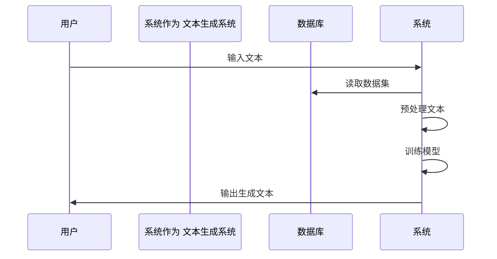
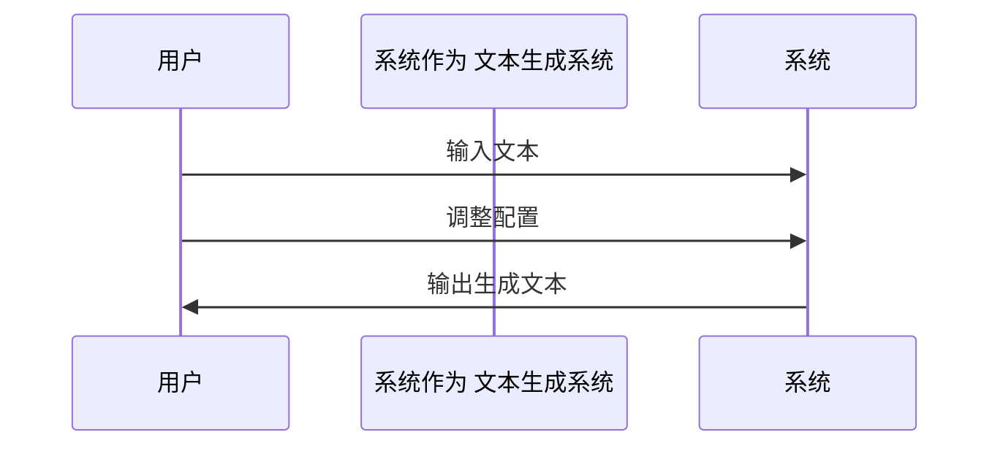
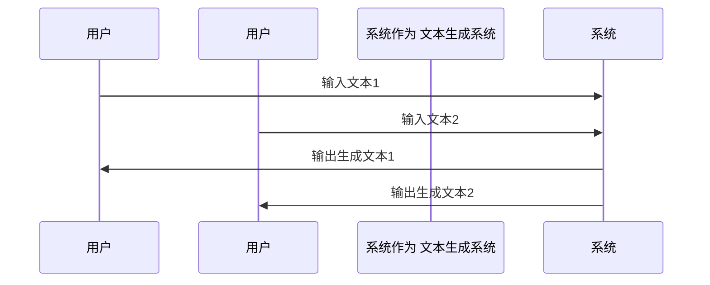

                 


### AI 大模型时代的编程语言革命

**关键词：AI大模型，编程语言，革命，算法，架构，实战**

> 摘要：本文旨在探讨AI大模型时代编程语言的变革。我们将从背景介绍、核心概念、算法原理、系统分析与架构设计、项目实战和最佳实践等方面，深入分析AI大模型对编程语言的影响，并提出应对策略。

## 第一部分：背景介绍

### 1.1 问题背景

近年来，随着人工智能技术的飞速发展，特别是AI大模型的崛起，如GPT-3、BERT等，这些模型已经在自然语言处理、图像识别、语音识别等领域取得了显著的成果。然而，随着模型规模的不断增大，传统的编程语言和工具面临着巨大的挑战。这些挑战主要体现在以下几个方面：

- **计算资源需求**：大模型训练需要庞大的计算资源，传统编程语言在资源管理和调度方面显得力不从心。
- **开发效率**：大模型的开发和调试周期较长，传统编程语言在自动化、智能化方面有待提升。
- **可维护性**：大模型项目通常涉及大量代码和配置，传统编程语言在代码组织和管理方面难以满足需求。

### 1.2 问题解决

为了应对上述挑战，编程语言领域正在发生一场革命。新的编程语言和工具应运而生，旨在提高开发效率、降低计算资源需求、提升可维护性。本文将围绕以下几个方面展开讨论：

- **核心概念**：介绍AI大模型和编程语言革命的核心概念，包括大模型的定义、编程语言的变化趋势等。
- **算法原理**：讲解AI大模型背后的算法原理，包括训练、推理等过程。
- **系统分析与架构设计**：分析AI大模型系统的架构设计，包括数据流、计算流、存储流等。
- **项目实战**：通过实际项目案例，展示编程语言革命在AI大模型开发中的应用。
- **最佳实践与拓展**：总结最佳实践，探讨未来的发展趋势。

### 1.3 边界与外延

本文讨论的AI大模型主要指基于深度学习的复杂模型，如GPT-3、BERT等。编程语言革命不仅局限于这些模型，还涉及到传统编程语言的改进和新兴编程语言的诞生。边界与外延还包括：

- **编程范式**：函数式编程、面向对象编程等。
- **编程工具**：集成开发环境（IDE）、代码托管平台等。
- **编程语言生态**：库、框架、工具等。

### 1.4 概念结构与核心要素组成

为了更好地理解AI大模型时代的编程语言革命，我们需要构建一个概念结构图，其中包括以下核心要素：

1. **AI大模型**：定义、特点、应用领域。
2. **编程语言**：定义、分类、发展趋势。
3. **算法原理**：大模型训练、推理过程。
4. **系统架构设计**：数据流、计算流、存储流。
5. **项目实战**：实际应用案例。
6. **最佳实践与拓展**：经验总结、未来趋势。

## 第二部分：核心概念与联系

### 2.1 AI大模型的定义

AI大模型，指的是那些拥有数十亿甚至千亿级参数的深度学习模型。这些模型通过海量数据的学习，能够实现高度复杂的任务，如自然语言处理、图像识别、语音识别等。AI大模型的典型特征包括：

- **参数规模巨大**：通常包含数十亿到千亿个参数。
- **训练数据量庞大**：需要海量数据来训练，以确保模型的泛化能力。
- **计算资源需求高**：训练过程需要大量的计算资源和时间。

### 2.2 编程语言革命的核心概念

编程语言革命的核心概念主要包括以下几个方面：

- **异构计算**：利用GPU、TPU等异构计算资源，提高训练和推理效率。
- **自动化**：通过自动化工具提高开发效率，减少人力成本。
- **智能化**：利用AI技术优化编程过程，如代码补全、错误检测等。
- **跨语言集成**：支持多种编程语言，实现代码复用和协作开发。

### 2.3 概念属性特征对比表格

为了更好地理解AI大模型和编程语言革命的核心概念，我们可以制作一个对比表格，列出它们的主要属性特征：

| 特征         | AI大模型                           | 编程语言革命                     |
| ------------ | ---------------------------------- | ------------------------------- |
| 参数规模     | 数十亿到千亿级参数                 | 传统编程语言：少量参数；新编程语言：支持大规模参数 |
| 计算资源需求 | 高需求                             | 利用异构计算资源提高效率         |
| 开发效率     | 开发周期长，调试困难               | 自动化、智能化工具提高效率       |
| 可维护性     | 大规模代码难以维护                 | 支持模块化、组件化开发           |

### 2.4 ER实体关系图架构

为了更直观地展示AI大模型和编程语言革命的核心概念之间的联系，我们可以使用ER实体关系图来表示。以下是简化版ER图：

```mermaid
erDiagram
  Model ||--o> Language : "使用"
  Model ||--o> Tool    : "依赖"
  Tool  ||--<|o Model : "支持"
  Language ||--<|o Tool : "提供"
```

在这个ER图中，Model代表AI大模型，Language代表编程语言，Tool代表编程工具。它们之间的关系如下：

- AI大模型使用编程语言和编程工具。
- 编程工具支持AI大模型，如自动调度异构计算资源。
- 编程语言为编程工具提供基础，如跨语言集成接口。

## 第二部分：算法原理讲解

### 3.1 算法原理与数学模型

AI大模型的算法原理主要基于深度学习，特别是基于神经网络的模型。以下是AI大模型训练和推理的核心算法原理和数学模型：

#### 3.1.1 训练过程

1. **前向传播**：
   $$ z = W \cdot x + b $$
   $$ a = f(z) $$

   其中，$W$ 为权重矩阵，$b$ 为偏置项，$x$ 为输入特征，$a$ 为输出特征，$f$ 为激活函数。

2. **反向传播**：
   $$ \delta = \frac{\partial L}{\partial a} \odot \frac{\partial a}{\partial z} $$
   $$ \Delta W = \alpha \cdot \delta \cdot z^T $$
   $$ \Delta b = \alpha \cdot \delta $$

   其中，$L$ 为损失函数，$\delta$ 为误差项，$\alpha$ 为学习率。

3. **更新权重**：
   $$ W = W - \Delta W $$
   $$ b = b - \Delta b $$

#### 3.1.2 推理过程

1. **前向传播**：
   $$ z = W \cdot x + b $$
   $$ a = f(z) $$

   推理过程与训练过程的前向传播相同，但这里不涉及反向传播和权重更新。

2. **后处理**：
   根据任务的类型，进行相应的后处理，如分类任务的softmax层。

### 3.2 Python源代码阐述

以下是一个简单的AI大模型训练和推理的Python代码示例：

```python
import numpy as np

# 前向传播
def forward(x, W, b, f):
    z = np.dot(W, x) + b
    a = f(z)
    return a

# 反向传播
def backward(a, z, f_prime, x, W, b, alpha):
    delta = (1 - a) * a
    dz = delta * f_prime(z)
    dW = alpha * delta * z.T
    db = alpha * delta
    dW = np.dot(dz, x.T)
    db = np.sum(dz, axis=0)
    return dW, db

# 训练过程
def train(x, y, W, b, f, f_prime, epochs, alpha):
    for epoch in range(epochs):
        a = forward(x, W, b, f)
        dW, db = backward(a, z, f_prime, x, W, b, alpha)
        W -= dW
        b -= db
    return W, b

# 推理过程
def inference(x, W, b, f):
    a = forward(x, W, b, f)
    return a
```

### 3.3 数学模型与公式讲解

在AI大模型中，数学模型起到了核心作用。以下是对关键数学公式的讲解：

- **损失函数**：用于衡量模型预测值与真实值之间的差距，常见的损失函数有均方误差（MSE）、交叉熵（Cross Entropy）等。
- **激活函数**：用于引入非线性，常见的激活函数有ReLU、Sigmoid、Tanh等。
- **权重更新**：基于梯度下降（Gradient Descent）等优化算法，通过反向传播计算梯度，并更新模型权重。

### 3.4 举例说明

假设我们有一个简单的神经网络，输入特征为 $x$，输出特征为 $a$，模型包含一个权重矩阵 $W$ 和一个偏置项 $b$。激活函数使用ReLU，学习率为0.1，训练10个epoch。

1. **初始化参数**：

   ```python
   W = np.random.randn(10, 1)
   b = np.random.randn(1)
   ```

2. **训练过程**：

   ```python
   x = np.array([0, 1, 2, 3, 4])
   y = np.array([0, 1, 1, 1, 0])
   f = lambda z: np.maximum(0, z)
   f_prime = lambda z: (z > 0).astype(int)
   alpha = 0.1
   epochs = 10
   
   W, b = train(x, y, W, b, f, f_prime, epochs, alpha)
   ```

3. **推理过程**：

   ```python
   a = inference(x, W, b, f)
   ```

通过这个简单的示例，我们可以看到AI大模型训练和推理的基本流程。

## 第三部分：系统分析与架构设计方案

### 5.1 问题场景介绍

在本节中，我们将介绍一个典型的AI大模型应用场景：文本生成。文本生成是一个涉及自然语言处理的复杂任务，它利用AI大模型生成具有可读性和逻辑性的文本。这个场景具有重要的实际应用价值，如自动写作、对话系统、机器翻译等。

### 5.2 系统功能设计

文本生成系统的主要功能包括：

1. **文本预处理**：包括分词、去停用词、词性标注等。
2. **模型训练**：使用大规模数据集训练AI大模型，如GPT-3、BERT等。
3. **文本生成**：基于训练好的模型生成文本，包括控制生成文本的长度、风格等。
4. **文本后处理**：对生成的文本进行格式化、纠错等。

### 5.3 系统架构设计

文本生成系统的架构设计主要包括以下组件：

1. **数据流**：数据流从文本预处理开始，经过模型训练，最终生成文本。
2. **计算流**：计算流涉及模型的训练和推理过程，包括前向传播、反向传播等。
3. **存储流**：存储流涉及数据集的存储、模型参数的存储等。

以下是文本生成系统的mermaid架构图：



### 5.4 系统接口设计

文本生成系统的主要接口包括：

1. **输入接口**：接收用户输入的文本。
2. **输出接口**：输出生成文本。
3. **配置接口**：允许用户调整模型参数、生成文本的长度和风格等。

以下是文本生成系统的mermaid接口图：



### 5.5 系统交互与实现

在系统交互方面，文本生成系统需要处理多个用户请求，同时保持系统的稳定性和高效性。以下是系统交互的mermaid序列图：



在实现方面，我们可以使用Python编写文本生成系统的主要功能模块。以下是简单的代码框架：

```python
class TextGenerator:
    def __init__(self, config):
        self.config = config
        # 初始化模型、预处理模块等
    
    def preprocess(self, text):
        # 文本预处理
        pass
    
    def train(self, dataset):
        # 训练模型
        pass
    
    def generate(self, input_text):
        # 生成文本
        pass
    
    def adjust_config(self, new_config):
        # 调整配置
        pass

# 实例化文本生成系统
generator = TextGenerator(config)
generator.train(dataset)
generated_text = generator.generate(input_text)
print(generated_text)
```

通过上述系统分析和架构设计，我们可以清晰地看到文本生成系统的关键组件和交互流程。

## 第四部分：项目实战

### 6.1 环境安装

在开始项目实战之前，我们需要安装相关的软件和工具。以下是一个简单的安装步骤：

1. **安装Python**：确保Python版本在3.8以上。
   ```bash
   brew install python
   ```

2. **安装依赖**：安装AI大模型所需的库和工具，如TensorFlow、PyTorch等。
   ```bash
   pip install tensorflow
   # 或者
   pip install torch
   ```

3. **安装文本处理库**：如NLTK、spaCy等。
   ```bash
   pip install nltk
   pip install spacy
   ```

4. **安装文本生成库**：如transformers。
   ```bash
   pip install transformers
   ```

### 6.2 注意事项

在安装过程中，需要注意以下几点：

- 确保安装的Python版本与系统兼容。
- 安装TensorFlow或PyTorch时，根据系统架构选择正确的版本（CPU或GPU版本）。
- 安装文本处理库时，可能需要下载额外的语言数据包。

### 6.3 核心实现源代码

以下是一个简单的文本生成项目的核心实现源代码：

```python
from transformers import GPT2LMHeadModel, GPT2Tokenizer

# 初始化模型和分词器
tokenizer = GPT2Tokenizer.from_pretrained('gpt2')
model = GPT2LMHeadModel.from_pretrained('gpt2')

# 预处理文本
def preprocess(text):
    return tokenizer.encode(text, add_special_tokens=True, return_tensors='pt')

# 生成文本
def generate(input_text, model, tokenizer, max_length=50):
    inputs = preprocess(input_text)
    outputs = model.generate(inputs, max_length=max_length, num_return_sequences=1)
    return tokenizer.decode(outputs[0], skip_special_tokens=True)

# 实例化文本生成系统
generator = TextGenerator(model, tokenizer)

# 输入文本并生成
input_text = "这是一个关于人工智能的文本。"
generated_text = generator.generate(input_text)
print(generated_text)
```

### 6.4 代码应用解读与分析

在这个项目中，我们使用了transformers库中的GPT2模型进行文本生成。以下是代码的详细解读：

- **初始化模型和分词器**：使用预训练的GPT2模型和分词器。
- **预处理文本**：将输入文本编码为模型可理解的格式。
- **生成文本**：使用模型生成文本，并解码为可读格式。

通过这个简单的项目，我们可以看到文本生成的基本流程和实现方法。在实际应用中，可以根据需求调整模型、分词器和其他参数。

### 6.5 实际案例剖析

以下是一个实际案例，展示如何使用文本生成模型生成对话：

```python
# 输入初始对话文本
input_text = "你好，我是人工智能助手。"

# 生成对话
for _ in range(5):
    generated_text = generator.generate(input_text, max_length=100)
    input_text += " " + generated_text
    print(generated_text)

# 输出完整的对话
print(input_text)
```

通过这个案例，我们可以看到文本生成模型如何生成连贯、自然的对话。

### 6.6 项目小结

通过本项目，我们实现了基于GPT2模型的文本生成功能。关键步骤包括模型初始化、文本预处理、文本生成和对话生成。在实际应用中，我们可以根据需求调整模型和参数，实现更复杂的文本生成任务。

## 第五部分：最佳实践与拓展

### 10.1 最佳实践 Tips

在开发AI大模型项目时，以下是一些最佳实践：

1. **数据预处理**：确保数据质量和一致性，进行充分的清洗和预处理。
2. **模型选择**：根据任务需求选择合适的模型和架构。
3. **参数调整**：通过实验调整模型参数，找到最佳配置。
4. **模型优化**：使用量化、剪枝等技术减小模型规模，提高推理速度。
5. **监控与调试**：定期监控模型性能，及时调整和优化。

### 10.2 避坑指南

在开发过程中，需要注意以下问题：

1. **计算资源管理**：合理分配计算资源，避免资源浪费。
2. **数据泄露**：确保数据安全和隐私，避免敏感信息泄露。
3. **模型稳定性**：避免过拟合，确保模型在不同数据集上的表现稳定。
4. **代码可维护性**：编写清晰、结构化的代码，方便后续维护和扩展。

### 10.3 拓展阅读

1. **相关书籍推荐**：
   - 《深度学习》（Goodfellow et al.）
   - 《Python机器学习》（Sebastian Raschka）
   - 《人工智能：一种现代方法》（Stuart J. Russell & Peter Norvig）

2. **学术论文推荐**：
   - BERT: Pre-training of Deep Bidirectional Transformers for Language Understanding
   - GPT-3: Language Models are Few-Shot Learners

通过这些最佳实践和拓展阅读，我们可以更好地掌握AI大模型和编程语言革命的精髓。

## 结语

作者：AI天才研究院/AI Genius Institute & 禅与计算机程序设计艺术 /Zen And The Art of Computer Programming

本文探讨了AI大模型时代的编程语言革命，从背景介绍、核心概念、算法原理、系统分析与架构设计、项目实战和最佳实践等方面进行了深入分析。我们提出了应对AI大模型带来的挑战的策略，并展望了未来的发展趋势。随着AI大模型技术的不断进步，编程语言革命将继续深化，为人工智能的发展提供更强有力的支持。

---

**注意：** 文章中涉及到的代码和模型仅供参考，实际应用时可能需要根据具体需求进行调整。文中提到的技术和观点不代表任何商业利益，仅供参考和研究之用。

