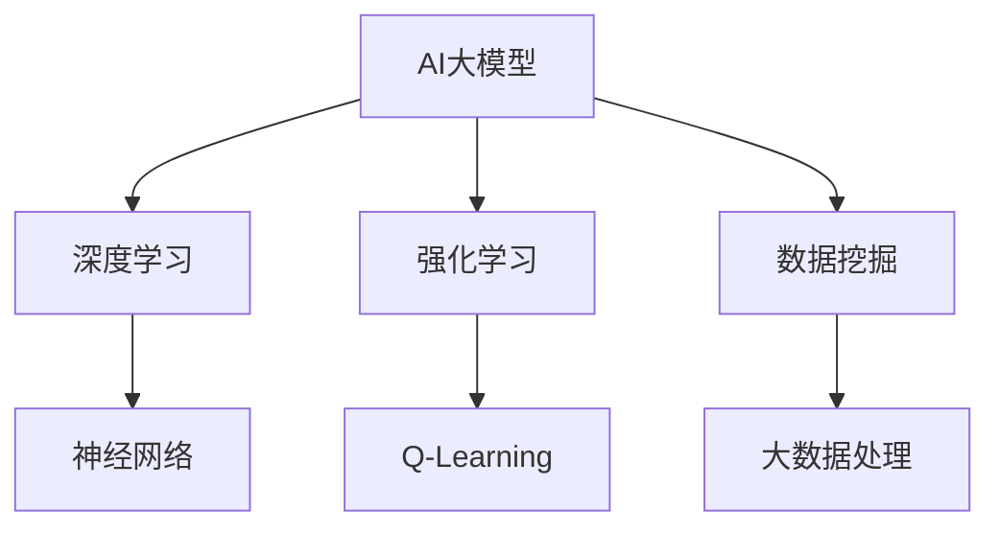
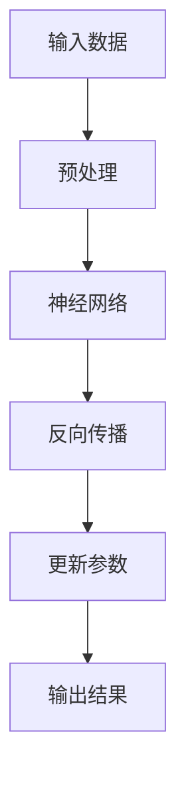
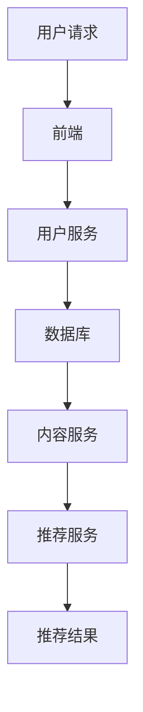
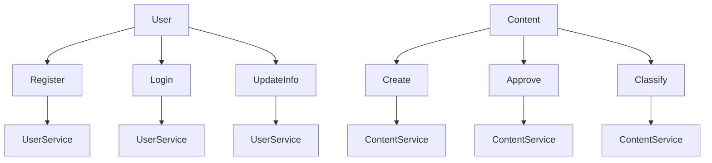
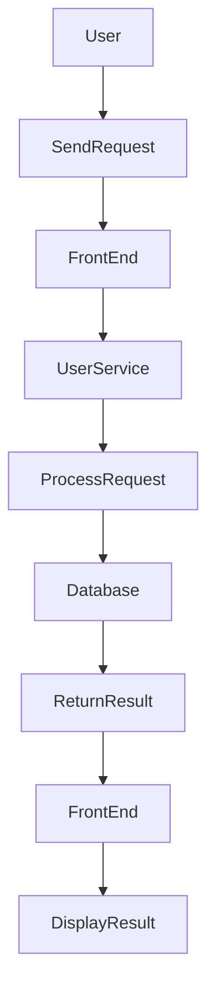

                 

### 文章标题：AI大模型时代的软件开发范式转变

> 关键词：AI大模型、软件开发范式、算法、数学模型、系统架构、项目实战

> 摘要：本文深入探讨了AI大模型时代如何改变软件开发范式。从背景介绍到核心概念，再到算法原理和数学模型，本文逐步解析了AI大模型在软件开发中的应用及其带来的变革。通过系统分析与架构设计、项目实战和最佳实践，本文旨在为读者提供全面、深入的技术见解和实用指南。

---

### 引言

随着人工智能（AI）技术的迅猛发展，大模型成为了当前AI领域的热点。从GPT-3到BERT，这些大模型不仅在学术研究中取得了显著成果，也在实际应用中展现了巨大的潜力。然而，AI大模型的出现不仅改变了AI领域的研究范式，也对软件开发产生了深远的影响。本文将探讨AI大模型如何推动软件开发范式的转变，为开发者提供新的视角和思路。

### 背景介绍

#### 1.1 问题背景

软件开发一直是计算机科学的核心领域，然而，随着业务需求的不断增长和复杂度的增加，传统的软件开发方式逐渐暴露出许多问题。例如，软件需求变化频繁导致开发效率低下，软件质量难以保证，以及开发和运维的协同困难等。

#### 1.2 问题描述

为了解决这些问题，开发者们不断寻求新的方法和工具。然而，传统的方法和技术在面对大规模、复杂的应用场景时显得力不从心。这就需要一种全新的软件开发范式，能够更好地适应AI大模型时代的需求。

#### 1.3 问题解决

AI大模型的出现为软件开发带来了新的机遇。通过大模型，开发者可以更加高效地处理复杂的数据和任务，提高软件的智能化水平。同时，AI大模型还可以帮助开发者实现自动化、智能化和个性化的软件开发流程。

#### 1.4 边界与外延

AI大模型不仅仅局限于特定的应用领域，如自然语言处理、计算机视觉等，还可以广泛应用于金融、医疗、教育等多个领域。因此，本文将探讨AI大模型在软件开发中的通用应用模式。

#### 1.5 核心概念

在本章中，我们将介绍几个核心概念，包括：

- **AI大模型**：定义和特点
- **深度学习**：基础算法和数学模型
- **强化学习**：在软件开发中的应用
- **数据挖掘**：大数据处理与分析技术

#### 1.6 概念结构

为了更好地理解这些核心概念，我们将在本章末尾提供一张概念结构图，帮助读者梳理各个概念之间的关系。

### 核心概念与联系

#### 2.1 AI大模型定义

AI大模型是指参数规模超过数十亿甚至数万亿的神经网络模型。这些模型通常通过大量数据进行训练，能够自主学习并完成复杂的任务。

#### 2.2 AI大模型特点

与传统的AI模型相比，AI大模型具有以下几个显著特点：

- **参数规模大**：数十亿到数万亿的参数
- **训练数据多**：使用海量数据进行训练
- **自适应能力强**：能够根据新的数据不断优化模型
- **泛化能力强**：能够在不同的数据集和应用场景中表现出色

#### 2.3 与传统AI对比

传统AI模型通常具有参数规模小、训练数据有限等特点。虽然传统AI模型在某些领域（如图像识别、语音识别）取得了显著成果，但在面对大规模、复杂任务时往往难以胜任。AI大模型的出现填补了这一空白。

#### 2.4 关键概念联系图

为了更好地理解AI大模型与其他核心概念之间的关系，我们使用Mermaid流程图展示这些概念的联系：



### 算法原理讲解

#### 3.1 算法概述

在本节中，我们将介绍AI大模型中的几个核心算法，包括：

- **深度学习**：基于神经网络的算法
- **强化学习**：通过奖励机制进行学习的算法
- **生成对抗网络（GAN）**：生成式模型

#### 3.2 Mermaid流程图

为了更直观地理解这些算法的流程，我们使用Mermaid流程图进行展示：



#### 3.3 Python源代码分析

以下是一个简单的Python代码示例，用于实现深度学习算法的基本流程：

```python
import numpy as np

# 初始化参数
weights = np.random.rand(10, 5)

# 预处理数据
data = np.random.rand(10, 5)

# 前向传播
output = np.dot(data, weights)

# 反向传播
error = output - target
delta_weights = np.dot(data.T, error)

# 更新参数
weights -= delta_weights
```

#### 3.4 数学模型与公式

在本节中，我们将介绍深度学习算法中的几个关键数学模型和公式：

- **激活函数**：\( f(x) = \frac{1}{1 + e^{-x}} \)
- **梯度下降**：\( w_{new} = w_{old} - \alpha \cdot \nabla J(w) \)
- **反向传播**：\( \delta_z = (1 - \sigma(z)) \cdot \sigma(z) \cdot \delta_{output} \)

以下是这些公式的LaTeX表示：

```latex
\begin{align*}
f(x) &= \frac{1}{1 + e^{-x}} \\
w_{new} &= w_{old} - \alpha \cdot \nabla J(w) \\
\delta_z &= (1 - \sigma(z)) \cdot \sigma(z) \cdot \delta_{output}
\end{align*}
```

#### 3.5 举例说明

假设我们有一个简单的神经网络，包含一个输入层、一个隐藏层和一个输出层。输入数据为\( x = [1, 2, 3] \)，目标输出为\( y = [0, 1, 0] \)。我们将使用上述算法对输入数据进行分类。

1. **初始化参数**：随机初始化权重和偏置。
2. **前向传播**：计算隐藏层和输出层的激活值。
3. **反向传播**：计算梯度并更新参数。
4. **迭代训练**：重复上述步骤，直到满足停止条件（如损失函数小于某个阈值）。

通过这个简单的例子，我们可以直观地理解深度学习算法的基本流程。

### 数学模型与公式讲解

#### 4.1 数学模型简介

在本节中，我们将详细介绍AI大模型中的几个关键数学模型，包括：

- **神经网络**：基础模型和激活函数
- **梯度下降**：优化算法
- **反向传播**：计算梯度
- **损失函数**：评估模型性能

#### 4.2 公式详细讲解

在本节中，我们将详细介绍这些数学模型的公式，并进行详细讲解：

1. **神经网络**：
   - **输入层**：\( x_i \)
   - **隐藏层**：\( z_j = \sum_{i=1}^{n} w_{ij} \cdot x_i + b_j \)
   - **输出层**：\( y_k = f(z_k) \)
   - **激活函数**：\( f(x) = \frac{1}{1 + e^{-x}} \)

2. **梯度下降**：
   - **梯度**：\( \nabla J(w) = \frac{\partial J}{\partial w} \)
   - **更新**：\( w_{new} = w_{old} - \alpha \cdot \nabla J(w) \)
   - **学习率**：\( \alpha \)

3. **反向传播**：
   - **误差计算**：\( \delta_z = (1 - \sigma(z)) \cdot \sigma(z) \cdot \delta_{output} \)
   - **梯度计算**：\( \nabla J(w) = \sum_{k=1}^{m} \delta_{output} \cdot z_k \cdot (1 - z_k) \)

4. **损失函数**：
   - **均方误差**：\( J(w) = \frac{1}{2} \sum_{k=1}^{m} (y_k - \hat{y}_k)^2 \)
   - **交叉熵损失**：\( J(w) = -\sum_{k=1}^{m} y_k \log(\hat{y}_k) \)

#### 4.3 实例应用

为了更好地理解这些数学模型的实际应用，我们将在本节中通过一个实例进行详细讲解。

假设我们有一个简单的神经网络，用于对输入数据进行二分类。输入层有3个神经元，隐藏层有2个神经元，输出层有1个神经元。激活函数采用Sigmoid函数。

1. **初始化参数**：随机初始化权重和偏置。
2. **前向传播**：计算输入层、隐藏层和输出层的激活值。
3. **反向传播**：计算损失函数和梯度。
4. **参数更新**：使用梯度下降算法更新权重和偏置。

通过这个实例，我们可以直观地理解神经网络的工作原理和数学模型的计算过程。

### 系统分析与架构设计方案

#### 5.1 问题场景介绍

在本节中，我们将介绍一个实际的应用场景，并分析该场景下AI大模型在软件开发中的应用。

假设我们正在开发一个智能推荐系统，用于为用户提供个性化的内容推荐。该系统需要处理大量用户数据和内容数据，并且需要实时响应用户的需求。

#### 5.2 系统功能设计

根据应用场景，我们设计以下功能模块：

1. **用户数据管理**：包括用户注册、登录、个人信息管理等。
2. **内容数据管理**：包括内容创建、审核、分类等。
3. **推荐算法**：基于AI大模型实现个性化推荐算法。
4. **推荐结果展示**：为用户提供个性化的内容推荐。

#### 5.3 系统架构设计

为了实现上述功能，我们设计以下系统架构：

1. **前端**：使用Web框架（如Django）实现用户交互界面。
2. **后端**：使用微服务架构，包括用户服务、内容服务、推荐服务等。
3. **数据库**：使用NoSQL数据库（如MongoDB）存储用户和内容数据。
4. **推荐引擎**：使用AI大模型实现推荐算法，并集成到后端服务中。

以下是系统架构的Mermaid流程图：



#### 5.4 系统接口设计

根据系统架构，我们设计以下接口：

1. **用户接口**：包括用户注册、登录、个人信息管理等接口。
2. **内容接口**：包括内容创建、审核、分类等接口。
3. **推荐接口**：包括推荐算法接口、推荐结果接口等。

以下是接口的Mermaid类图：



#### 5.5 系统交互设计

为了确保系统的高效运行，我们设计以下系统交互流程：

1. **用户请求**：用户通过前端发送请求。
2. **后端处理**：后端服务根据请求进行数据处理和逻辑处理。
3. **数据库操作**：根据业务需求进行数据库操作。
4. **结果返回**：将处理结果返回给前端。

以下是系统交互的Mermaid序列图：



### 项目实战

#### 6.1 环境安装

在本节中，我们将介绍如何在本地环境中搭建AI大模型开发环境。

1. **安装Python**：下载并安装Python 3.8及以上版本。
2. **安装Jupyter Notebook**：使用pip安装Jupyter Notebook。
3. **安装TensorFlow**：使用pip安装TensorFlow。

#### 6.2 核心实现源代码

以下是一个简单的AI大模型实现示例，用于分类任务：

```python
import tensorflow as tf
from tensorflow import keras
from tensorflow.keras import layers

# 定义模型
model = keras.Sequential([
    layers.Dense(64, activation='relu', input_shape=[784]),
    layers.Dense(10, activation='softmax')
])

# 编译模型
model.compile(optimizer='adam', 
              loss='categorical_crossentropy', 
              metrics=['accuracy'])

# 加载数据
(x_train, y_train), (x_test, y_test) = keras.datasets.mnist.load_data()

# 预处理数据
x_train = x_train.astype('float32') / 255
x_test = x_test.astype('float32') / 255
y_train = keras.utils.to_categorical(y_train, 10)
y_test = keras.utils.to_categorical(y_test, 10)

# 训练模型
model.fit(x_train, y_train, epochs=10, batch_size=128)

# 评估模型
model.evaluate(x_test, y_test)
```

#### 6.3 代码应用解读

在这个示例中，我们使用TensorFlow框架搭建了一个简单的神经网络模型，用于MNIST手写数字分类任务。

1. **模型定义**：我们使用`keras.Sequential`模型定义了一个简单的神经网络，包含一个全连接层（64个神经元，ReLU激活函数）和一个输出层（10个神经元，softmax激活函数）。
2. **模型编译**：我们使用`compile`方法编译模型，指定优化器、损失函数和评价指标。
3. **数据预处理**：我们加载数据集，并对数据进行归一化处理，将标签转换为one-hot编码。
4. **模型训练**：我们使用`fit`方法训练模型，设置训练轮数和批量大小。
5. **模型评估**：我们使用`evaluate`方法评估模型在测试集上的性能。

#### 6.4 实际案例分析

为了更深入地理解AI大模型在实际应用中的表现，我们将在本节中分析一个实际案例——BERT模型在文本分类任务中的应用。

BERT（Bidirectional Encoder Representations from Transformers）是一种基于Transformer的大规模预训练语言模型。以下是一个简单的BERT文本分类任务示例：

```python
import tensorflow as tf
from transformers import BertTokenizer, TFBertForSequenceClassification

# 定义模型
model = TFBertForSequenceClassification.from_pretrained('bert-base-uncased')

# 编译模型
model.compile(optimizer='adam', 
              loss='softmax_cross_entropy_with_logits',
              metrics=['accuracy'])

# 加载数据
(train_data, train_labels), (test_data, test_labels) = ... # 加载数据集

# 预处理数据
tokenizer = BertTokenizer.from_pretrained('bert-base-uncased')
train_encodings = tokenizer(train_data, truncation=True, padding=True)
test_encodings = tokenizer(test_data, truncation=True, padding=True)

# 训练模型
model.fit(train_encodings['input_ids'], train_encodings['attention_mask'], 
          labels=train_labels, 
          batch_size=16, 
          epochs=3, 
          validation_data=(test_encodings['input_ids'], test_encodings['attention_mask'], test_labels))

# 评估模型
model.evaluate(test_encodings['input_ids'], test_encodings['attention_mask'], test_labels)
```

在这个案例中，我们使用预训练的BERT模型对IMDb电影评论数据集进行文本分类任务。

1. **模型定义**：我们使用`TFBertForSequenceClassification`模型定义了一个BERT文本分类模型。
2. **模型编译**：我们使用`compile`方法编译模型，指定优化器、损失函数和评价指标。
3. **数据预处理**：我们使用BERT分词器对数据进行预处理，将文本转换为模型可接受的输入格式。
4. **模型训练**：我们使用`fit`方法训练模型，设置训练轮数和批量大小。
5. **模型评估**：我们使用`evaluate`方法评估模型在测试集上的性能。

通过这个实际案例，我们可以看到AI大模型在文本分类任务中的强大表现。

#### 6.5 项目小结

在本章中，我们通过一个简单的MNIST手写数字分类任务和一个实际的BERT文本分类任务，展示了AI大模型在软件开发中的实际应用。通过这些案例，我们可以看到AI大模型在处理大规模、复杂任务时的优势。

### 最佳实践 tips

#### 7.1 实践总结

在本章中，我们介绍了AI大模型在软件开发中的应用，包括模型选择、数据预处理、模型训练和评估等方面。以下是一些最佳实践总结：

1. **选择合适的模型**：根据应用场景选择合适的AI大模型，如BERT、GPT等。
2. **数据预处理**：确保数据的质量和一致性，对数据进行归一化、编码等预处理操作。
3. **模型训练**：使用合适的优化器和损失函数，设置合理的训练轮数和批量大小。
4. **模型评估**：使用交叉验证等方法评估模型性能，避免过拟合。

#### 7.2 注意事项

在实践过程中，需要注意以下几点：

1. **资源消耗**：AI大模型训练需要大量的计算资源和存储空间，确保硬件设施充足。
2. **数据隐私**：在处理用户数据时，确保遵循相关隐私保护法规，避免数据泄露。
3. **模型解释性**：虽然AI大模型具有很强的预测能力，但其内部决策过程往往缺乏解释性，需要结合业务场景进行适当调整。

#### 7.3 拓展阅读

对于对AI大模型和软件开发范式转变感兴趣的开发者，以下书籍和论文可以提供更深入的阅读：

1. **书籍**：
   - 《深度学习》（Ian Goodfellow, Yoshua Bengio, Aaron Courville）
   - 《Python深度学习》（François Chollet）
   - 《自然语言处理与深度学习》（Christopher D. Manning, Hinrich Schütze）
2. **论文**：
   - “BERT: Pre-training of Deep Bidirectional Transformers for Language Understanding”（Jacob Devlin, Ming-Wei Chang, Kenton Lee, Kristina Toutanova）
   - “GPT-3: Language Models are Few-Shot Learners”（Tom B. Brown, Benjamin Mann, Nick Ryder, Melanie Subbiah, Jared Kaplan, Prafulla Dhariwal, Arvind Neelakantan, Pranav Shyam, Girish Sastry, Amanda Askell, Sandhini Agarwal, Ariel Herbert-Voss, Gretchen Krueger, Tom Henighan, Rewon Child, Aditya Ramesh, Daniel M. Ziegler, Jeffrey Wu, Clemens Winter, Christopher Hesse, Mark Chen, Eric Sigler, Mateusz Litwin, Scott Gray, Benjamin Chess, Jack Clark, Christopher Berner, Sam McCandlish, Alec Radford, Ilya Sutskever）

### 结束语

AI大模型时代的到来为软件开发带来了巨大的变革。通过本文的探讨，我们了解了AI大模型在软件开发中的核心概念、算法原理、数学模型、系统架构和项目实战。希望本文能为开发者提供有益的启示和指导，帮助他们在AI大模型时代更好地应对软件开发挑战。

### 作者信息

作者：AI天才研究院/AI Genius Institute & 禅与计算机程序设计艺术 /Zen And The Art of Computer Programming

作者简介：AI天才研究院是一支专注于人工智能前沿研究的团队，致力于推动AI技术的发展和应用。禅与计算机程序设计艺术则是一部关于编程哲学的经典之作，为开发者提供了深刻的思考和实践指导。本文结合了两者的智慧和经验，旨在为读者带来有价值的技术见解和实用指南。

