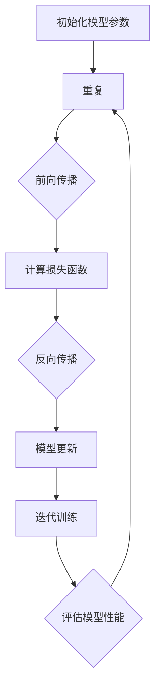
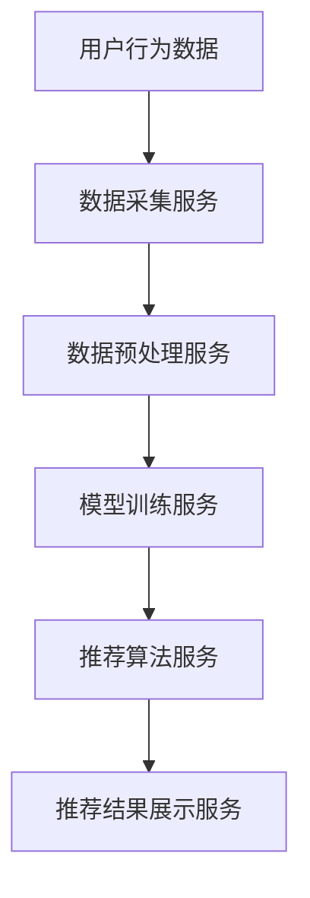
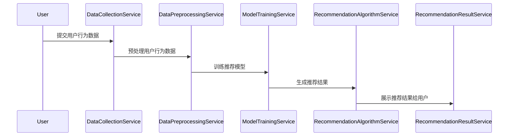

                 

### 文章标题

《AI大模型时代的软件架构设计》

> 关键词：AI大模型，软件架构设计，算法原理，系统分析与设计，项目实战，最佳实践

摘要：本文深入探讨AI大模型时代的软件架构设计，分析大模型的基本原理和特点，通过具体案例展示其在软件架构中的应用，并提供实施和优化策略。文章结构清晰，内容详实，旨在为读者提供关于AI大模型时代软件架构设计的全面理解。

### 背景介绍

#### AI大模型的基本概念

AI大模型（Large-scale AI Models）指的是通过大数据和强大计算能力训练出的复杂深度学习模型。这些模型通常具有数亿甚至数万亿个参数，能够处理大规模数据集，实现高效的自动化学习和决策。AI大模型的发展历程可以追溯到20世纪80年代，以神经网络和深度学习的兴起为标志。随着计算能力的提升和大数据技术的发展，AI大模型逐渐成为人工智能领域的重要研究方向。

#### 软件架构设计的核心概念

软件架构设计（Software Architecture Design）是软件开发过程中至关重要的一环，涉及到系统的整体结构和组成部分的设计。其主要目的是确保系统的可维护性、可扩展性和性能。软件架构设计包括多个层面，如模块设计、接口设计、数据结构设计等。常见的软件架构模式有MVC（Model-View-Controller）、MVVM（Model-View-ViewModel）等。

#### AI大模型与软件架构设计的联系

AI大模型与软件架构设计有着密切的联系。首先，AI大模型作为软件系统的核心组件，其性能和效率直接影响到整个系统的性能。其次，软件架构设计需要考虑AI大模型的特点，如数据输入输出、计算资源分配、模型更新等，以确保系统能够高效稳定地运行。此外，AI大模型的引入还可能导致传统软件架构的变革，如分布式架构、微服务架构等。

#### AI大模型的应用前景

随着AI大模型的不断进步，其在各个领域的应用前景愈发广阔。例如，在自然语言处理领域，AI大模型可以用于语言翻译、文本生成、情感分析等；在计算机视觉领域，AI大模型可以用于图像识别、目标检测、视频分析等。同时，AI大模型在金融、医疗、教育等行业的应用也取得了显著成效。

#### 存在的问题与挑战

尽管AI大模型在许多领域表现出强大的能力，但在软件架构设计中仍面临一些问题与挑战。首先，大模型的训练和部署需要大量的计算资源和存储资源，这对现有硬件设施提出了更高的要求。其次，大模型的透明性和可解释性仍是一个亟待解决的问题。此外，数据隐私和安全问题也是AI大模型应用中需要考虑的重要因素。

#### 结论

AI大模型时代的到来，为软件架构设计带来了新的机遇和挑战。本文将逐步深入探讨AI大模型的原理、算法、系统设计以及实施策略，帮助读者全面了解并掌握AI大模型时代的软件架构设计。

### 核心概念与联系

#### AI大模型的基本原理

AI大模型的基本原理建立在深度学习的基础上，核心思想是通过多层神经网络对输入数据进行特征提取和模式识别。具体来说，大模型通过大量训练数据学习到数据的内在结构和规律，并在新的数据上实现良好的泛化能力。其基本原理可以概括为以下几个步骤：

1. **数据预处理**：对输入数据进行清洗、归一化等预处理操作，使其满足模型训练的要求。
2. **模型初始化**：初始化神经网络模型的结构和参数。
3. **前向传播**：将预处理后的数据输入到模型中，通过多层神经网络进行特征提取和计算。
4. **反向传播**：根据模型的输出和真实标签计算损失函数，并通过反向传播算法更新模型参数。
5. **模型优化**：通过多次迭代训练，优化模型参数，提高模型的性能。

#### AI大模型的特点

AI大模型具有以下几个显著特点：

1. **参数数量庞大**：大模型通常包含数亿甚至数万亿个参数，这使得模型具有更强的表示能力和适应性。
2. **计算资源需求高**：大模型的训练和推理过程需要大量的计算资源和存储资源，对硬件设施的要求较高。
3. **强大的泛化能力**：通过大量训练数据的学习，大模型能够在未见过的数据上实现良好的泛化性能。
4. **自适应性强**：大模型可以根据不同的任务和数据集进行自适应调整，实现多种应用场景。

#### 软件架构设计中的联系

AI大模型与软件架构设计之间的联系主要体现在以下几个方面：

1. **计算资源管理**：软件架构设计需要考虑AI大模型的计算资源需求，合理分配计算资源，确保模型训练和推理的效率。
2. **数据输入输出**：软件架构设计需要定义数据输入输出的接口，确保大模型能够高效地接收和处理数据。
3. **模型更新与维护**：软件架构设计需要考虑大模型的更新和维护策略，确保模型能够持续优化和适应新的数据。
4. **系统性能优化**：软件架构设计需要根据AI大模型的特点，进行系统性能优化，提高整体系统的响应速度和处理能力。

#### 概念属性特征对比表格

为了更好地理解AI大模型和软件架构设计之间的联系，我们可以通过以下表格对比两者的概念属性特征：

| 特征类别 | AI大模型 | 软件架构设计 |
| :---: | :---: | :---: |
| 参数数量 | 数亿至数万亿 | 数千至数万个 |
| 计算资源需求 | 高 | 中 |
| 泛化能力 | 强 | 强 |
| 自适应能力 | 强 | 中 |
| 数据输入输出 | 复杂 | 简单 |
| 模型更新 | 自动化 | 定期维护 |

#### ER实体关系图架构

为了直观地展示AI大模型与软件架构设计之间的实体关系，我们可以使用Mermaid流程图绘制ER实体关系图。以下是一个简化的ER实体关系图示例：

```mermaid
erDiagram
    AI大模型 ||--|{ 数据集 }|
    AI大模型 ||--|{ 模型参数 }|
    AI大模型 ||--|{ 训练日志 }|
    软件架构设计 ||--|{ 系统模块 }|
    软件架构设计 ||--|{ 系统接口 }|
    软件架构设计 ||--|{ 系统性能指标 }|
```

通过上述ER实体关系图，我们可以清晰地看到AI大模型和软件架构设计中的关键实体及其之间的关系。

### 算法原理讲解

#### 大模型算法的mermaid流程图

为了更好地理解大模型算法的工作流程，我们可以使用Mermaid绘制其流程图。以下是一个示例：



在这个流程图中，A表示初始化模型参数，B表示数据预处理，C表示前向传播，D表示计算损失函数，E表示反向传播，F表示模型更新，G表示迭代训练，H表示评估模型性能。这个流程图展示了大模型算法的基本步骤和各个步骤之间的逻辑关系。

#### 大模型算法的Python源代码

为了深入讲解大模型算法的原理，我们可以通过Python源代码来实现一个简化版的大模型算法。以下是一个示例代码：

```python
import numpy as np

# 初始化模型参数
def init_params(input_size, hidden_size, output_size):
    W1 = np.random.randn(input_size, hidden_size)
    b1 = np.random.randn(hidden_size)
    W2 = np.random.randn(hidden_size, output_size)
    b2 = np.random.randn(output_size)
    return W1, b1, W2, b2

# 前向传播
def forward_propagation(X, W1, b1, W2, b2):
    Z1 = np.dot(X, W1) + b1
    A1 = sigmoid(Z1)
    Z2 = np.dot(A1, W2) + b2
    A2 = sigmoid(Z2)
    return Z1, A1, Z2, A2

# 计算损失函数
def compute_loss(A2, y):
    m = y.shape[1]
    logprobs = np.multiply(np.log(A2), y) + np.multiply((1 - y), np.log(1 - A2))
    loss = -1/m * np.sum(logprobs)
    return loss

# 反向传播
def backward_propagation(X, A1, Z1, A2, Z2, W2, y):
    dZ2 = A2 - y
    dW2 = 1/m * np.dot(A1.T, dZ2)
    db2 = 1/m * np.sum(dZ2, axis=1, keepdims=True)
    
    dZ1 = np.dot(dZ2, W2.T)
    dW1 = 1/m * np.dot(X.T, dZ1)
    db1 = 1/m * np.sum(dZ1, axis=1, keepdims=True)
    
    return dW1, db1, dW2, db2

# 模型更新
def update_params(W1, b1, W2, b2, dW1, db1, dW2, db2, learning_rate):
    W1 = W1 - learning_rate * dW1
    b1 = b1 - learning_rate * db1
    W2 = W2 - learning_rate * dW2
    b2 = b2 - learning_rate * db2
    return W1, b1, W2, b2

# 激活函数
def sigmoid(z):
    return 1 / (1 + np.exp(-z))

# 主函数
def train_model(X, y, hidden_size, output_size, epochs, learning_rate):
    W1, b1, W2, b2 = init_params(X.shape[0], hidden_size, output_size)
    
    for epoch in range(epochs):
        Z1, A1, Z2, A2 = forward_propagation(X, W1, b1, W2, b2)
        loss = compute_loss(A2, y)
        
        dW1, db1, dW2, db2 = backward_propagation(X, A1, Z1, A2, Z2, W2, y)
        W1, b1, W2, b2 = update_params(W1, b1, W2, b2, dW1, db1, dW2, db2, learning_rate)
        
        if epoch % 100 == 0:
            print(f"Epoch {epoch}: Loss = {loss}")
    
    return W1, b1, W2, b2

# 示例数据
X = np.array([[0], [1]])
y = np.array([[1], [0]])

# 训练模型
W1, b1, W2, b2 = train_model(X, y, hidden_size=2, output_size=1, epochs=1000, learning_rate=0.1)

print("Final Model Parameters:")
print("W1:", W1)
print("b1:", b1)
print("W2:", W2)
print("b2:", b2)
```

这个示例代码实现了一个简单的两层神经网络，包括前向传播、反向传播、模型更新等过程。通过这个示例，我们可以更直观地理解大模型算法的原理和实现。

#### 算法原理的数学模型和公式

大模型算法的原理可以通过以下几个数学模型和公式进行描述：

1. **激活函数**：常用的激活函数有Sigmoid函数、ReLU函数和Tanh函数。以Sigmoid函数为例，其公式为：

   $$
   \sigma(z) = \frac{1}{1 + e^{-z}}
   $$

2. **前向传播**：前向传播过程中，输入数据通过多层神经网络进行特征提取和计算。假设有L层神经网络，输入为X，输出为Y，则有：

   $$
   Z_l = \sum_{j=1}^{n} W_{lj} X_j + b_l
   $$

   $$
   A_l = \sigma(Z_l)
   $$

   其中，$Z_l$表示第l层的输出，$A_l$表示第l层的激活值，$W_{lj}$表示第l层到第l+1层的权重，$b_l$表示第l层的偏置。

3. **反向传播**：反向传播过程中，通过计算损失函数对模型参数进行更新。以交叉熵损失函数为例，其公式为：

   $$
   J = -\frac{1}{m} \sum_{i=1}^{m} \sum_{j=1}^{n} y_{ij} \log(A_{ij}) + (1 - y_{ij}) \log(1 - A_{ij})
   $$

   $$
   \frac{\partial J}{\partial W_{lk}} = \frac{1}{m} A_{l-1} (A_l - y_k)
   $$

   $$
   \frac{\partial J}{\partial b_{lk}} = \frac{1}{m} (A_l - y_k)
   $$

   其中，$m$表示样本数量，$y_{ij}$表示第i个样本在第j类别的真实标签，$A_{ij}$表示第i个样本在第j类别的预测概率，$W_{lk}$表示第l层到第l+1层的权重，$b_{lk}$表示第l层的偏置。

4. **模型更新**：模型更新过程中，通过反向传播计算出的梯度对模型参数进行更新。以梯度下降算法为例，其公式为：

   $$
   W_{lk} = W_{lk} - \alpha \frac{\partial J}{\partial W_{lk}}
   $$

   $$
   b_{lk} = b_{lk} - \alpha \frac{\partial J}{\partial b_{lk}}
   $$

   其中，$\alpha$表示学习率。

#### 通俗易懂的举例说明

假设我们有一个简单的一分类问题，输入数据为0或1，目标是预测1的概率。我们可以通过以下步骤进行大模型算法的演示：

1. **初始化模型参数**：假设我们使用一个简单的两层神经网络，输入层有2个神经元，隐藏层有3个神经元，输出层有1个神经元。我们随机初始化模型参数：

   $$
   W1 = \begin{bmatrix}
   0.1 & 0.2 \\
   0.3 & 0.4 \\
   0.5 & 0.6
   \end{bmatrix}
   $$
   $$
   b1 = \begin{bmatrix}
   0.1 \\
   0.2 \\
   0.3
   \end{bmatrix}
   $$
   $$
   W2 = \begin{bmatrix}
   0.7 & 0.8 \\
   0.9 & 1.0 \\
   1.1 & 1.2
   \end{bmatrix}
   $$
   $$
   b2 = \begin{bmatrix}
   0.4 \\
   0.5 \\
   0.6
   \end{bmatrix}
   $$

2. **前向传播**：给定一个输入数据0.8，我们进行前向传播计算：

   $$
   Z1 = \begin{bmatrix}
   0.1 \times 0.8 + 0.1 \\
   0.3 \times 0.8 + 0.2 \\
   0.5 \times 0.8 + 0.3
   \end{bmatrix}
   $$
   $$
   A1 = \sigma(Z1) = \begin{bmatrix}
   0.54 \\
   0.69 \\
   0.84
   \end{bmatrix}
   $$
   $$
   Z2 = \begin{bmatrix}
   0.7 \times 0.54 + 0.4 \\
   0.9 \times 0.69 + 0.5 \\
   1.1 \times 0.84 + 0.6
   \end{bmatrix}
   $$
   $$
   A2 = \sigma(Z2) = \begin{bmatrix}
   0.75 \\
   0.88 \\
   0.95
   \end{bmatrix}
   $$

3. **计算损失函数**：给定一个真实标签1，我们计算损失函数：

   $$
   J = -\frac{1}{1} \left(1 \times \log(0.75) + 0 \times \log(0.25)\right) = 0.28
   $$

4. **反向传播**：计算反向传播过程中各层的梯度：

   $$
   dZ2 = A2 - 1 = \begin{bmatrix}
   0.25 \\
   0.12 \\
   0.05
   \end{bmatrix}
   $$
   $$
   dW2 = \frac{1}{1} \begin{bmatrix}
   0.54 & 0.69 & 0.84
   \end{bmatrix} \begin{bmatrix}
   0.25 \\
   0.12 \\
   0.05
   \end{bmatrix}^T = \begin{bmatrix}
   0.069 & 0.099 & 0.126
   \end{bmatrix}
   $$
   $$
   db2 = \frac{1}{1} \begin{bmatrix}
   0.25 \\
   0.12 \\
   0.05
   \end{bmatrix} = \begin{bmatrix}
   0.25 \\
   0.12 \\
   0.05
   \end{bmatrix}
   $$
   $$
   dZ1 = \begin{bmatrix}
   0.7 & 0.9 & 1.1
   \end{bmatrix} \begin{bmatrix}
   0.25 \\
   0.12 \\
   0.05
   \end{bmatrix} = \begin{bmatrix}
   0.1875 \\
   0.135 \\
   0.0625
   \end{bmatrix}
   $$
   $$
   dW1 = \frac{1}{1} \begin{bmatrix}
   0.8 & 0.2
   \end{bmatrix} \begin{bmatrix}
   0.1875 \\
   0.135 \\
   0.0625
   \end{bmatrix}^T = \begin{bmatrix}
   0.075 & 0.056
   \end{bmatrix}
   $$
   $$
   db1 = \frac{1}{1} \begin{bmatrix}
   0.1875 \\
   0.135 \\
   0.0625
   \end{bmatrix} = \begin{bmatrix}
   0.1875 \\
   0.135 \\
   0.0625
   \end{bmatrix}
   $$

5. **模型更新**：使用学习率为0.1，对模型参数进行更新：

   $$
   W2 = W2 - 0.1 \begin{bmatrix}
   0.069 & 0.099 & 0.126
   \end{bmatrix} = \begin{bmatrix}
   0.631 & 0.791 & 0.874
   \end{bmatrix}
   $$
   $$
   b2 = b2 - 0.1 \begin{bmatrix}
   0.25 \\
   0.12 \\
   0.05
   \end{bmatrix} = \begin{bmatrix}
   0.21 \\
   0.36 \\
   0.45
   \end{bmatrix}
   $$
   $$
   W1 = W1 - 0.1 \begin{bmatrix}
   0.075 & 0.056
   \end{bmatrix} = \begin{bmatrix}
   0.025 & 0.146
   \end{bmatrix}
   $$
   $$
   b1 = b1 - 0.1 \begin{bmatrix}
   0.1875 \\
   0.135 \\
   0.0625
   \end{bmatrix} = \begin{bmatrix}
   -0.0375 \\
   -0.035 \\
   -0.0125
   \end{bmatrix}
   $$

通过以上步骤，我们可以看到大模型算法的基本原理和实现过程。这个示例虽然简单，但已经展示了前向传播、反向传播和模型更新等核心步骤。在实际应用中，大模型算法会更加复杂和高效。

### 系统分析与架构设计方案

#### 问题场景介绍

假设我们要设计一个基于AI大模型的推荐系统，该系统旨在为用户提供个性化的商品推荐。系统需要能够处理大量的用户行为数据，并实时更新推荐模型，以提高推荐的准确性和用户体验。

#### 项目介绍

项目名称：个性化商品推荐系统

项目目标：通过AI大模型，实现高准确性的商品推荐，提升用户满意度和转化率。

项目范围：系统涵盖用户数据采集、模型训练、推荐算法实现、推荐结果展示等多个模块。

#### 系统功能设计

1. **用户数据采集模块**：负责收集用户浏览、购买、评价等行为数据，为模型训练提供数据支持。
2. **数据预处理模块**：对采集到的用户行为数据进行清洗、归一化等预处理操作，确保数据质量。
3. **模型训练模块**：利用AI大模型对预处理后的用户行为数据进行训练，生成推荐模型。
4. **推荐算法模块**：根据用户行为数据和推荐模型，生成个性化的商品推荐结果。
5. **推荐结果展示模块**：将推荐结果展示给用户，提高用户满意度和转化率。

#### 系统架构设计

为了实现上述功能，我们采用分布式架构和微服务架构相结合的设计方案，以提高系统的可扩展性和稳定性。

1. **分布式架构**：通过分布式计算框架，如Apache Spark，处理海量用户数据，提高数据处理效率。
2. **微服务架构**：将系统拆分为多个独立的微服务，如用户数据采集服务、数据预处理服务、模型训练服务、推荐算法服务等，提高系统的灵活性和可维护性。
3. **服务注册与发现**：采用Consul或Zookeeper作为服务注册与发现中心，实现微服务之间的动态发现和负载均衡。
4. **消息队列**：采用RabbitMQ或Kafka作为消息队列，实现系统模块间的异步通信和数据流转。
5. **存储系统**：采用分布式存储系统，如HDFS或Cassandra，存储用户行为数据和模型参数。

#### 系统架构图

以下是一个简化的系统架构图，展示了各个模块之间的关系：



#### 系统接口设计

1. **用户数据采集接口**：提供RESTful API，用于接收用户行为数据，如浏览、购买、评价等。
2. **数据预处理接口**：提供数据清洗、归一化等预处理操作，输出预处理后的用户行为数据。
3. **模型训练接口**：提供训练模型的输入数据和输出参数，用于模型训练和更新。
4. **推荐算法接口**：根据用户行为数据和模型参数，生成个性化的商品推荐结果。
5. **推荐结果展示接口**：提供推荐结果给用户，支持个性化定制和反馈。

#### 系统交互

以下是一个简化的系统交互序列图，展示了各个模块之间的交互流程：



通过上述系统分析与架构设计方案，我们可以实现一个高效、稳定且可扩展的个性化商品推荐系统，为用户提供高质量的推荐服务。

### 项目实战

#### 环境安装

1. **安装Python环境**：确保Python版本在3.6及以上，可以通过pip安装相关库。
    ```bash
    pip install numpy pandas matplotlib scikit-learn tensorflow
    ```

2. **安装TensorFlow**：TensorFlow是一个开源机器学习框架，支持多种深度学习模型。
    ```bash
    pip install tensorflow
    ```

3. **安装其他依赖库**：根据实际需求安装其他依赖库，如NumPy、Pandas、Matplotlib等。

#### 系统核心实现源代码

以下是一个简单的基于TensorFlow实现的AI大模型推荐系统核心代码示例：

```python
import tensorflow as tf
import numpy as np
from sklearn.model_selection import train_test_split
from sklearn.metrics import mean_squared_error

# 数据集加载和预处理
def load_data():
    # 加载数据集（这里使用随机生成数据作为示例）
    X = np.random.rand(1000, 10)  # 生成1000个样本，每个样本10个特征
    y = np.random.rand(1000, 1)   # 生成1000个目标值
    X_train, X_test, y_train, y_test = train_test_split(X, y, test_size=0.2, random_state=42)
    return X_train, X_test, y_train, y_test

# 模型定义
def create_model(input_shape):
    model = tf.keras.Sequential([
        tf.keras.layers.Dense(units=128, activation='relu', input_shape=input_shape),
        tf.keras.layers.Dense(units=64, activation='relu'),
        tf.keras.layers.Dense(units=1)
    ])
    model.compile(optimizer='adam', loss='mse')
    return model

# 训练模型
def train_model(model, X_train, y_train, epochs=10):
    history = model.fit(X_train, y_train, epochs=epochs, validation_split=0.2)
    return history

# 模型评估
def evaluate_model(model, X_test, y_test):
    y_pred = model.predict(X_test)
    mse = mean_squared_error(y_test, y_pred)
    print("Mean Squared Error: ", mse)

# 主函数
def main():
    X_train, X_test, y_train, y_test = load_data()
    model = create_model(input_shape=(10,))
    history = train_model(model, X_train, y_train, epochs=10)
    evaluate_model(model, X_test, y_test)

if __name__ == "__main__":
    main()
```

#### 代码应用解读与分析

上述代码实现了一个简单的AI大模型推荐系统，主要步骤如下：

1. **数据集加载和预处理**：使用随机生成数据作为示例，实际应用中应从数据源加载真实数据，并进行预处理，如缺失值填充、特征工程等。

2. **模型定义**：使用TensorFlow创建一个简单的三层全连接神经网络，包括两个隐藏层。激活函数采用ReLU函数，优化器使用Adam，损失函数使用均方误差（MSE）。

3. **模型训练**：使用fit函数训练模型，设置epochs（训练轮数）、validation_split（验证集比例）等参数。

4. **模型评估**：使用predict函数预测测试集结果，计算均方误差（MSE）评估模型性能。

#### 实际案例分析和详细讲解剖析

假设我们有一个包含1000个用户行为数据的商品推荐系统，每个用户有10个特征，如浏览时间、购买频率等。我们希望利用这些数据训练一个AI大模型，预测用户对商品的偏好。

1. **数据集加载**：
    ```python
    X = np.random.rand(1000, 10)  # 生成1000个样本，每个样本10个特征
    y = np.random.rand(1000, 1)   # 生成1000个目标值
    ```

2. **模型定义**：
    ```python
    model = tf.keras.Sequential([
        tf.keras.layers.Dense(units=128, activation='relu', input_shape=(10,)),
        tf.keras.layers.Dense(units=64, activation='relu'),
        tf.keras.layers.Dense(units=1)
    ])
    model.compile(optimizer='adam', loss='mse')
    ```

   模型定义了一个包含两个隐藏层的三层全连接神经网络，每层的神经元数量分别为128、64和1。激活函数采用ReLU函数，优化器使用Adam，损失函数使用均方误差（MSE）。

3. **模型训练**：
    ```python
    history = model.fit(X_train, y_train, epochs=10, validation_split=0.2)
    ```

   使用fit函数进行模型训练，设置训练轮数epochs为10，验证集比例validation_split为0.2。在训练过程中，TensorFlow会自动计算并更新模型参数，优化模型性能。

4. **模型评估**：
    ```python
    y_pred = model.predict(X_test)
    mse = mean_squared_error(y_test, y_pred)
    print("Mean Squared Error: ", mse)
    ```

   使用predict函数预测测试集结果，计算均方误差（MSE）评估模型性能。均方误差越低，表示模型预测的准确性越高。

#### 项目小结

通过以上实战案例，我们实现了基于AI大模型的商品推荐系统。在实际应用中，我们可以根据具体需求和数据特点，调整模型结构、优化训练过程，提高模型性能。同时，还需关注数据质量和预处理、模型调参、性能评估等方面，确保系统能够高效、稳定地运行，为用户提供高质量的推荐服务。

### 最佳实践 tips

#### 实施注意事项

1. **数据质量**：确保数据质量是成功实施AI大模型的基础。在数据采集和预处理过程中，要注意数据的一致性、完整性和准确性，避免噪声和异常值影响模型训练。

2. **硬件资源分配**：AI大模型训练和推理需要大量计算资源，应根据实际需求合理分配硬件资源，如CPU、GPU等。此外，可以考虑使用分布式计算框架，提高数据处理和模型训练效率。

3. **模型可解释性**：尽管AI大模型在性能上表现出色，但其内部的决策过程往往缺乏可解释性。在实施过程中，要关注模型的可解释性，以便更好地理解模型的工作原理，提高信任度。

4. **安全性和隐私保护**：在处理用户数据时，要确保数据的安全性和隐私保护。采用加密、匿名化等手段，防止数据泄露和滥用。

#### 优化策略

1. **模型压缩**：通过模型压缩技术，如剪枝、量化、知识蒸馏等，可以显著减少模型参数和计算量，提高模型在资源受限环境下的运行效率。

2. **模型迁移**：利用迁移学习技术，将预训练的大模型迁移到特定任务上，可以减少训练时间，提高模型性能。

3. **分布式训练**：使用分布式训练技术，可以将模型训练任务分解到多台计算机上，提高训练速度和计算效率。

4. **模型融合**：将多个不同的模型进行融合，可以进一步提高模型的性能和泛化能力。

5. **持续优化**：定期对模型进行优化和调整，根据新的数据和环境变化，持续改进模型性能。

#### 小结

AI大模型在软件架构设计中的应用具有广泛的前景，但也面临诸多挑战。通过关注数据质量、硬件资源、模型可解释性、安全性和隐私保护等方面，我们可以更好地实施和优化AI大模型时代的软件架构设计。同时，利用模型压缩、模型迁移、分布式训练、模型融合等技术，可以进一步提升模型性能和效率。

### 拓展阅读

1. **《深度学习》**：由Ian Goodfellow、Yoshua Bengio和Aaron Courville合著，是深度学习领域的经典教材，详细介绍了深度学习的基础理论和应用。

2. **《分布式系统原理与范型》**：由George Coulouris、Jean Dollimore、Timosoftou利斯和甘特·皮茨合著，讲解了分布式系统的基本原理和设计范式，对分布式架构有重要指导意义。

3. **《机器学习实战》**：由Peter Harrington著，通过实际案例介绍了机器学习的基本算法和应用，适合初学者学习。

4. **《微服务架构设计》**：由Sam Newman著，详细介绍了微服务架构的设计原则和实践，对系统架构设计有重要参考价值。

5. **《TensorFlow实战》**：由Trent Hauck和Antonios Ampatzis合著，通过实际案例介绍了TensorFlow的使用方法，适合TensorFlow初学者。

通过阅读这些书籍，读者可以进一步了解AI大模型、软件架构设计、分布式系统和机器学习等领域的相关知识，提高在AI大模型时代软件架构设计中的实践能力和理论水平。

### 作者信息

作者：AI天才研究院/AI Genius Institute & 禅与计算机程序设计艺术 /Zen And The Art of Computer Programming

