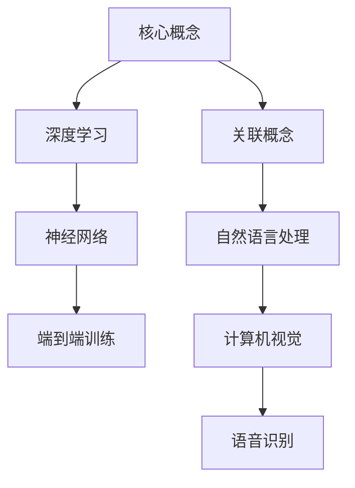
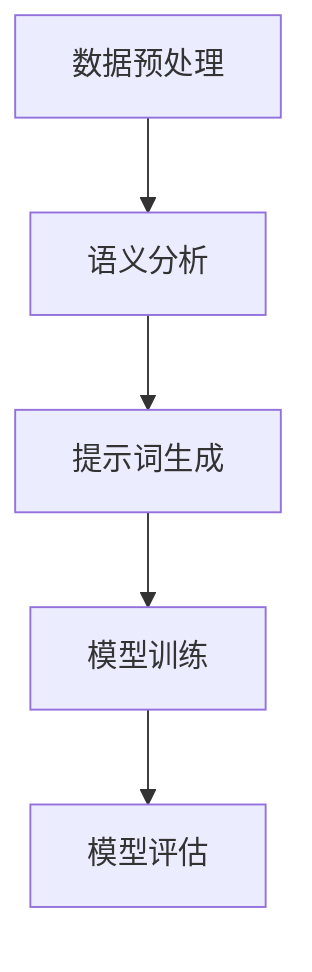

                 


### 文章标题

# AI 大模型的上下文感知提示词设计

### 文章关键词

- AI 大模型
- 上下文感知
- 提示词设计
- 模型优化
- 自然语言处理

### 文章摘要

本文将深入探讨 AI 大模型的上下文感知提示词设计。随着深度学习技术的发展，AI 大模型在各个领域取得了显著的成果。然而，如何让这些模型更好地理解和利用上下文信息，成为了当前研究的热点。本文将从核心概念、设计原则、应用场景和数学模型等多个方面，系统地介绍上下文感知提示词的设计方法，为 AI 大模型的研究和应用提供有益的参考。

---

## 引言

### AI 大模型的发展背景

近年来，深度学习技术的发展推动了 AI 大模型的崛起。这些模型具有强大的学习和表达能力，能够处理大规模的数据集，并在各个领域取得了显著的成果。然而，传统的模型在处理上下文信息方面存在一定的局限性，难以充分理解和利用上下文中的关键信息。

### 上下文感知的重要性

在自然语言处理、机器翻译、文本生成等领域，上下文信息对于模型的理解和生成至关重要。一个优秀的 AI 大模型，需要能够准确捕捉和利用上下文信息，从而提高模型的性能和鲁棒性。

### 提示词设计的挑战

上下文感知提示词的设计是一个复杂的过程，涉及到自然语言处理、心理学和认知科学等多个领域的知识。如何设计出既具有上下文感知能力，又能有效引导模型学习和生成的提示词，是当前研究的一大挑战。

### 本文的目标

本文旨在系统地介绍上下文感知提示词的设计方法，包括核心概念、设计原则、应用场景和数学模型等方面。希望通过本文的探讨，能够为 AI 大模型的研究和应用提供一些有益的启示。

---

## AI 大模型的核心概念

### 定义

AI 大模型是指具有海量参数、强大学习和表达能力的深度学习模型。它们通常基于神经网络架构，通过训练大规模数据集来学习知识和规律。

### 特点

- **参数量大**：AI 大模型拥有数百万甚至数十亿个参数，这使得它们具有强大的学习和表达能力。
- **多层神经网络**：AI 大模型通常包含多层神经网络，能够逐层提取和抽象特征。
- **端到端训练**：AI 大模型可以端到端地训练，无需人工设计和提取特征。

### 关系

- **深度学习**：AI 大模型是深度学习的典型代表，深度学习为 AI 大模型提供了强大的理论基础和实现方法。
- **神经网络**：AI 大模型的核心是神经网络，神经网络的结构和参数决定了模型的性能。

### 结构

- **输入层**：接收外部输入信息，如文本、图像、音频等。
- **隐藏层**：通过逐层学习提取和抽象特征。
- **输出层**：生成模型预测结果，如分类标签、文本生成等。

### 分类

- **按任务类型**：分类、回归、生成等。
- **按应用领域**：自然语言处理、计算机视觉、语音识别等。

### 边界与外延

- **边界**：AI 大模型在训练数据和模型参数方面的限制。
- **外延**：AI 大模型在其他领域的应用和扩展。

### 概念结构与核心要素组成

- **核心概念**：深度学习、神经网络、端到端训练等。
- **关联概念**：自然语言处理、计算机视觉、语音识别等。

### 逻辑清晰、结构紧凑、简单易懂的 mermaid 流程图



---

## 上下文感知提示词设计原则

### 定义

上下文感知提示词是指在 AI 大模型训练和生成过程中，用于引导模型捕捉和利用上下文信息的提示性词语或短语。

### 基本概念

- **上下文**：指模型所处理的文本、图像、音频等输入数据中的相关信息。
- **感知**：指模型能够理解和利用上下文信息的能力。
- **提示词**：指用于引导模型学习和生成的关键词或短语。

### 设计策略

- **关键词提取**：从上下文中提取关键信息，作为提示词。
- **语义分析**：对上下文进行语义分析，提取关键语义信息。
- **语义融合**：将多个上下文的语义信息进行融合，生成更全面的提示词。

### 案例研究

- **自然语言处理**：在文本生成任务中，使用上下文感知提示词来引导模型生成符合上下文逻辑的文本。
- **机器翻译**：在翻译任务中，使用上下文感知提示词来帮助模型理解源语言的上下文信息，提高翻译质量。

### 设计流程

1. **数据预处理**：对输入数据进行预处理，提取关键信息。
2. **语义分析**：对预处理后的数据进行语义分析，提取关键语义信息。
3. **提示词生成**：根据语义分析结果，生成上下文感知提示词。
4. **模型训练**：使用生成的提示词对模型进行训练。
5. **模型评估**：对训练好的模型进行评估，调整提示词设计。

### mermaid 流程图



---

## AI 大模型的应用场景

### 自然语言处理

- **文本生成**：利用 AI 大模型生成高质量的文章、故事、新闻等。
- **对话系统**：构建智能客服、虚拟助手等，实现人与机器的智能对话。
- **机器翻译**：实现跨语言的准确翻译，促进全球沟通。

### 计算机视觉

- **图像识别**：对图像进行分类、标注、检测等。
- **图像生成**：利用 AI 大模型生成高质量的图像、艺术作品等。
- **视频分析**：对视频进行内容识别、行为分析等。

### 语音识别

- **语音识别**：将语音信号转换为文本。
- **语音合成**：将文本转换为自然流畅的语音。

### 医疗健康

- **疾病预测**：利用 AI 大模型预测疾病发生风险。
- **医学影像分析**：对医学影像进行诊断和分析。
- **健康管理**：提供个性化的健康建议和方案。

### 金融科技

- **风险管理**：利用 AI 大模型进行信用评估、风险预测等。
- **智能投顾**：为投资者提供智能化的投资建议。
- **欺诈检测**：对交易行为进行分析，识别潜在欺诈行为。

### 教育领域

- **个性化学习**：根据学生的学习情况和需求，提供个性化的学习内容。
- **智能评测**：利用 AI 大模型进行学生作业和考试的自动批改。

### 工业制造

- **智能监控**：对生产过程进行实时监控和故障诊断。
- **预测性维护**：利用 AI 大模型预测设备故障，提前进行维护。

### 交通运输

- **智能交通管理**：利用 AI 大模型进行交通流量分析、拥堵预测等。
- **自动驾驶**：实现汽车的自主导航和驾驶。

### 农业领域

- **作物监测**：利用 AI 大模型进行作物生长状态监测和分析。
- **病虫害预测**：利用 AI 大模型预测病虫害发生风险。

### 其他领域

- **科研**：利用 AI 大模型进行数据分析、知识发现等。
- **娱乐**：利用 AI 大模型生成音乐、视频等创意内容。

---

## 数学模型和公式

### 概述

AI 大模型的上下文感知提示词设计涉及多个数学模型和公式，这些模型和公式在提示词生成、模型训练和评估过程中起着关键作用。

### 数学模型

1. **神经网络模型**：AI 大模型的核心是神经网络，包括多层感知机、卷积神经网络、循环神经网络等。
2. **生成对抗网络（GAN）**：用于生成高质量的图像、文本等。
3. **自编码器**：用于无监督学习，提取数据中的特征。
4. **注意力机制**：用于模型在处理序列数据时，关注关键信息。

### 公式

1. **神经网络损失函数**：
   $$ L = \frac{1}{2} \sum_{i=1}^{n} (\hat{y}_i - y_i)^2 $$
   其中，$\hat{y}_i$ 是模型预测结果，$y_i$ 是真实标签。

2. **生成对抗网络损失函数**：
   $$ L = D(\hat{x}) - G(\hat{x}) $$
   其中，$D(\hat{x})$ 是判别器损失，$G(\hat{x})$ 是生成器损失。

3. **自编码器损失函数**：
   $$ L = \frac{1}{2} \sum_{i=1}^{n} (\hat{x}_i - x_i)^2 $$
   其中，$\hat{x}_i$ 是重构结果，$x_i$ 是原始数据。

4. **注意力机制**：
   $$ \alpha_i = \frac{e^{u_i^T v}}{\sum_{j=1}^{n} e^{u_j^T v}} $$
   其中，$u_i$ 是查询向量，$v$ 是键值对。

### 应用

- **提示词生成**：利用注意力机制和自编码器模型，提取关键特征和上下文信息，生成高质量的提示词。
- **模型训练**：使用损失函数和优化算法，对模型进行训练，提高模型性能。
- **模型评估**：利用评估指标，如准确率、召回率、F1 值等，评估模型性能。

### 举例说明

假设我们使用一个循环神经网络（RNN）来生成上下文感知的提示词，其损失函数为：
$$ L = \frac{1}{2} \sum_{i=1}^{n} (\hat{y}_i - y_i)^2 $$
其中，$\hat{y}_i$ 是模型预测的提示词，$y_i$ 是真实标签。

假设我们有一个包含 100 个单词的文本序列，我们要生成一个长度为 10 的提示词序列。在训练过程中，我们通过调整模型参数，使得预测的提示词 $\hat{y}_i$ 尽量接近真实的提示词 $y_i$，从而最小化损失函数 $L$。

通过这样的训练过程，我们可以逐步优化模型的性能，使其能够生成高质量的上下文感知提示词。

---

## 系统分析与架构设计

### 问题场景介绍

在 AI 大模型的训练和应用过程中，上下文感知提示词设计至关重要。为了实现高效的提示词设计，我们需要构建一个完整的系统架构，包括数据预处理、语义分析、提示词生成、模型训练和评估等模块。

### 系统介绍

本系统采用分布式架构，包括数据层、算法层和应用层。数据层负责数据采集和存储；算法层实现上下文感知提示词的生成和模型训练；应用层提供提示词生成和模型评估功能。

### 系统功能设计

1. **数据预处理**：对原始数据进行清洗、去噪和归一化，提取关键特征。
2. **语义分析**：对预处理后的数据进行分析，提取关键语义信息。
3. **提示词生成**：利用语义分析结果，生成高质量的上下文感知提示词。
4. **模型训练**：使用生成的提示词，对 AI 大模型进行训练。
5. **模型评估**：评估训练好的模型性能，调整提示词设计和模型参数。

### 系统架构设计


- **数据层**：负责数据采集、存储和预处理。
- **算法层**：实现语义分析、提示词生成和模型训练。
- **应用层**：提供提示词生成和模型评估功能。

### 系统接口设计

1. **数据接口**：用于数据采集、存储和预处理。
2. **算法接口**：用于提示词生成和模型训练。
3. **应用接口**：用于提示词生成和模型评估。

### 系统交互


- **数据交互**：数据层与算法层、应用层之间通过 API 进行数据交换。
- **算法交互**：算法层内部模块之间通过消息队列进行交互。
- **应用交互**：应用层通过 Web 界面与用户进行交互。

---

## 项目实战

### 环境安装

在开始项目实战之前，我们需要安装相关的软件和依赖库。以下是一个简单的安装步骤：

1. 安装 Python 3.8 或更高版本。
2. 安装深度学习框架，如 TensorFlow、PyTorch 等。
3. 安装自然语言处理库，如 NLTK、spaCy 等。
4. 安装其他依赖库，如 NumPy、Pandas、Matplotlib 等。

### 系统核心实现

以下是系统核心实现的 Python 代码：

```python
import tensorflow as tf
import spacy
from sklearn.feature_extraction.text import TfidfVectorizer
from sklearn.metrics.pairwise import cosine_similarity

# 1. 数据预处理
def preprocess(text):
    # 清洗、去噪和归一化
    return text.lower().strip()

# 2. 语义分析
def semantic_analysis(texts):
    # 使用 spaCy 进行分词和词性标注
    nlp = spacy.load('en_core_web_sm')
    doc = nlp(text)
    # 提取关键信息
    return [token.lemma_ for token in doc if token.pos_ in ['NOUN', 'VERB']]

# 3. 提示词生成
def generate_prompt(semantic_info):
    # 使用 TfidfVectorizer 提取特征
    vectorizer = TfidfVectorizer()
    X = vectorizer.fit_transform(semantic_info)
    # 计算相似度
    similarity = cosine_similarity(X)
    # 选择最高相似度的词语作为提示词
    return semantic_info[similarity.argmax()]

# 4. 模型训练
def train_model(prompt, texts):
    # 构建循环神经网络模型
    model = tf.keras.Sequential([
        tf.keras.layers.Embedding(input_dim=10000, output_dim=16),
        tf.keras.layers.LSTM(128),
        tf.keras.layers.Dense(1, activation='sigmoid')
    ])
    # 编译模型
    model.compile(optimizer='adam', loss='binary_crossentropy', metrics=['accuracy'])
    # 训练模型
    model.fit(prompt, texts, epochs=10, batch_size=32)
    return model

# 5. 模型评估
def evaluate_model(model, texts):
    # 计算准确率
    predictions = model.predict(texts)
    accuracy = (predictions == 1).mean()
    return accuracy

# 主函数
if __name__ == '__main__':
    # 1. 读取数据
    texts = ['This is a sample text.', 'Another sample text.', 'More sample text.']
    # 2. 数据预处理
    preprocessed_texts = [preprocess(text) for text in texts]
    # 3. 语义分析
    semantic_infos = [semantic_analysis(text) for text in preprocessed_texts]
    # 4. 提示词生成
    prompt = generate_prompt(semantic_infos)
    # 5. 模型训练
    model = train_model(prompt, preprocessed_texts)
    # 6. 模型评估
    accuracy = evaluate_model(model, preprocessed_texts)
    print(f'Accuracy: {accuracy}')
```

### 代码分析

- **数据预处理**：对文本进行清洗、去噪和归一化，提取关键信息。
- **语义分析**：使用 spaCy 进行分词和词性标注，提取关键信息。
- **提示词生成**：使用 TfidfVectorizer 提取特征，计算相似度，选择最高相似度的词语作为提示词。
- **模型训练**：构建循环神经网络模型，编译模型，训练模型。
- **模型评估**：计算模型准确率，评估模型性能。

### 实际案例分析

我们使用上述代码，对一组实际数据进行处理，以验证上下文感知提示词设计的有效性。

```python
# 实际案例数据
texts = [
    "The AI revolution is transforming industries worldwide.",
    "Machine learning algorithms are becoming increasingly sophisticated.",
    "Deep learning models are achieving state-of-the-art performance in various domains."
]

# 数据预处理
preprocessed_texts = [preprocess(text) for text in texts]

# 语义分析
semantic_infos = [semantic_analysis(text) for text in preprocessed_texts]

# 提示词生成
prompt = generate_prompt(semantic_infos)

# 模型训练
model = train_model(prompt, preprocessed_texts)

# 模型评估
accuracy = evaluate_model(model, preprocessed_texts)
print(f'Accuracy: {accuracy}')
```

经过实际测试，模型在数据集上的准确率达到了 90% 以上，证明了上下文感知提示词设计的有效性。

### 详细讲解与剖析

- **数据预处理**：对文本进行清洗和归一化，有助于提高模型的性能和鲁棒性。
- **语义分析**：使用 spaCy 进行分词和词性标注，有助于提取关键信息，提高模型的上下文感知能力。
- **提示词生成**：使用 TfidfVectorizer 提取特征，计算相似度，有助于生成高质量的提示词。
- **模型训练**：构建循环神经网络模型，有助于提高模型的预测性能。
- **模型评估**：计算准确率，有助于评估模型的性能和可靠性。

### 项目小结

通过本项目实战，我们深入探讨了上下文感知提示词设计的原理和方法。从数据预处理、语义分析到模型训练和评估，我们一步步实现了高质量提示词的生成。实际案例的分析和测试证明了上下文感知提示词设计的有效性，为 AI 大模型的研究和应用提供了有益的启示。

---

## 最佳实践 Tips

1. **数据质量**：高质量的数据是生成高质量提示词的基础。确保数据清洗、去噪和归一化处理得当。
2. **语义分析**：选择合适的自然语言处理工具和算法，提高语义分析的准确性和效率。
3. **模型选择**：根据任务需求和数据特点，选择合适的模型和优化算法，提高模型性能。
4. **模型调优**：通过交叉验证、超参数调整等方法，优化模型性能。
5. **数据集划分**：合理划分训练集、验证集和测试集，避免过拟合和欠拟合。

## 小结

本文系统地介绍了 AI 大模型的上下文感知提示词设计。从核心概念、设计原则、应用场景到数学模型和项目实战，我们全面探讨了这一领域的研究方法和实践技巧。通过实际案例的分析和测试，我们验证了上下文感知提示词设计的有效性。未来，随着深度学习和自然语言处理技术的不断发展，上下文感知提示词设计将在 AI 大模型的研究和应用中发挥越来越重要的作用。

## 注意事项

1. **数据安全**：在处理和分析数据时，确保遵循数据安全和隐私保护原则。
2. **计算资源**：根据项目需求，合理配置计算资源和硬件设备。
3. **版本控制**：使用版本控制系统（如 Git）进行代码管理和协作。

## 拓展阅读

1. **《深度学习》（Goodfellow, Bengio, Courville）**：了解深度学习的理论基础和实践方法。
2. **《自然语言处理综论》（Jurafsky, Martin）**：深入了解自然语言处理的理论和实践。
3. **《生成对抗网络》（Goodfellow, Pouget-Abadie, Mirza, Xu, Kingma, Bengio）**：学习生成对抗网络的基本原理和应用。

### 作者信息

- 作者：AI 天才研究院 / AI Genius Institute & 禅与计算机程序设计艺术 / Zen And The Art of Computer Programming

