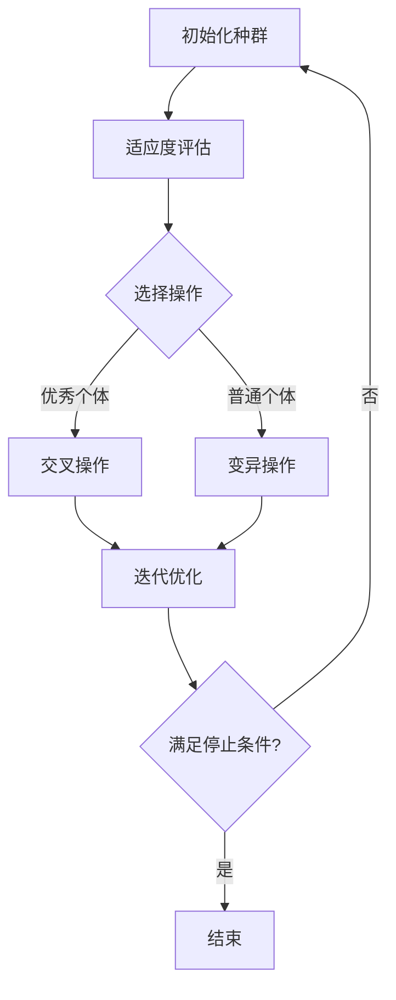
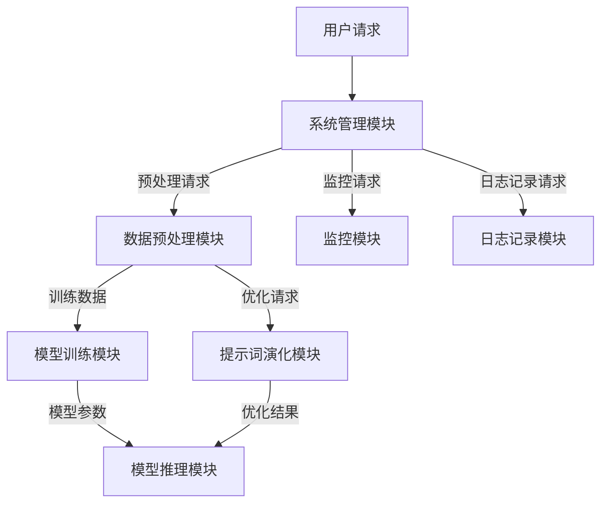

                 


# AI大模型的提示词演化算法

## 关键词
- AI大模型
- 提示词演化算法
- 人工智能
- 深度学习
- 自然语言处理
- 图像生成

## 摘要
本文深入探讨AI大模型中的提示词演化算法，从基本概念到实际应用，详细解析了AI大模型和提示词演化算法的核心原理及其在语言生成、问答系统和图像生成等领域的应用。通过实际案例和系统架构设计，本文揭示了提示词演化算法在AI大模型优化和系统开发中的关键作用，并提出了未来展望。

---

### 目录大纲

----------------------------------------------------------------

## 第一部分: AI大模型概述

### 第1章: 问题背景与核心概念

#### 1.1 问题背景

##### 1.1.1 人工智能的发展历程
##### 1.1.2 大模型的崛起
##### 1.1.3 提示词演化算法的重要性

#### 1.2 核心概念介绍

##### 1.2.1 AI大模型的概念
##### 1.2.2 提示词演化算法的定义
##### 1.2.3 大模型与提示词演化算法的关系

#### 1.3 概念属性特征对比

##### 1.3.1 AI大模型属性对比
##### 1.3.2 提示词演化算法属性对比
##### 1.3.3 大模型与提示词演化算法的综合比较

##### 1.4 ER实体关系图架构

###### 1.4.1 实体关系图简介
###### 1.4.2 大模型与提示词演化算法的ER图
###### 1.4.3 图架构的详细解读

## 第2章: AI大模型原理与算法

### 2.1 AI大模型原理

#### 2.1.1 大模型的基础架构
#### 2.1.2 大模型的训练过程
#### 2.1.3 大模型的工作原理

### 2.2 提示词演化算法原理

#### 2.2.1 提示词的定义
#### 2.2.2 演化算法的核心步骤
#### 2.2.3 演化算法的优化目标

### 2.3 算法mermaid流程图

#### 2.3.1 流程图介绍
#### 2.3.2 算法的mermaid流程图展示
#### 2.3.3 流程图的详细解读

### 2.4 算法原理讲解

#### 2.4.1 数学模型介绍
#### 2.4.2 算法公式解释
#### 2.4.3 通俗易懂的举例说明

## 第3章: 提示词演化算法在AI大模型中的应用

### 3.1 提示词演化算法的应用场景

#### 3.1.1 语言生成
#### 3.1.2 问答系统
#### 3.1.3 图像生成

### 3.2 实际案例分析和讲解

#### 3.2.1 案例选择
#### 3.2.2 案例分析
#### 3.2.3 案例讲解

### 3.3 代码应用解读与分析

#### 3.3.1 环境安装
#### 3.3.2 系统核心实现源代码
#### 3.3.3 代码应用解读

## 第4章: 系统分析与架构设计

### 4.1 问题场景介绍

#### 4.1.1 问题定义
#### 4.1.2 场景描述
#### 4.1.3 需求分析

### 4.2 系统功能设计

#### 4.2.1 领域模型mermaid类图
#### 4.2.2 功能模块划分

### 4.3 系统架构设计

#### 4.3.1 架构设计原则
#### 4.3.2 系统架构mermaid架构图
#### 4.3.3 架构的详细解读

### 4.4 系统接口设计和系统交互

#### 4.4.1 接口设计
#### 4.4.2 系统交互mermaid序列图
#### 4.4.3 系统交互的详细解读

## 第5章: 项目实战与优化

### 5.1 项目实战

#### 5.1.1 环境配置
#### 5.1.2 系统搭建
#### 5.1.3 实战步骤

### 5.2 优化策略

#### 5.2.1 性能优化
#### 5.2.2 模型优化
#### 5.2.3 算法优化

### 5.3 项目小结

#### 5.3.1 成功经验
#### 5.3.2 遇到的问题及解决方法
#### 5.3.3 未来的发展方向

## 第6章: 最佳实践与未来展望

### 6.1 最佳实践

#### 6.1.1 实践技巧
#### 6.1.2 经验分享
#### 6.1.3 案例精选

### 6.2 小结

#### 6.2.1 内容总结
#### 6.2.2 注意事项
#### 6.2.3 拓展阅读

### 6.3 未来展望

#### 6.3.1 技术发展趋势
#### 6.3.2 应用前景
#### 6.3.3 挑战与机遇

----------------------------------------------------------------

### 第一部分：AI大模型概述

#### 第1章：问题背景与核心概念

##### 1.1 问题背景

人工智能（AI）的快速发展，尤其是深度学习（DL）技术的突破，使得AI大模型成为当前研究的热点。AI大模型在语言生成、问答系统和图像生成等领域展现出了强大的能力，但其复杂性和效率成为了研究的关键问题。提示词演化算法在这一背景下应运而生，旨在提高大模型的性能和效率。

##### 1.1.1 人工智能的发展历程

人工智能（AI）的发展历程可以追溯到20世纪50年代。当时，人工智能的概念首次被提出，主要目标是使计算机具有人类智能。经过几十年的发展，人工智能经历了多个阶段：

- **第一阶段（1956-1969年）**：人工智能的概念被提出，初步的研究主要集中在问题解决、逻辑推理和专家系统等方面。
- **第二阶段（1970-1980年）**：人工智能进入了一个低谷期，因为早期的理论和方法在实际应用中遇到了困难。
- **第三阶段（1980-2010年）**：随着计算机性能的提升和算法的创新，人工智能开始复兴，尤其是机器学习（ML）和深度学习（DL）的兴起。
- **第四阶段（2010年至今）**：人工智能进入了一个高速发展的阶段，AI大模型的出现是其重要标志。

##### 1.1.2 大模型的崛起

AI大模型的崛起可以追溯到2012年，当时Google推出了基于深度神经网络的语音识别系统，这一突破标志着深度学习在AI领域的崛起。随着计算资源和算法的不断优化，AI大模型的应用范围越来越广泛。大模型具有以下几个特点：

- **规模庞大**：大模型通常具有数十亿至数千亿个参数，这使得它们能够处理大量的数据。
- **计算复杂**：大模型的训练和推理过程需要大量的计算资源，通常需要使用分布式计算和GPU加速技术。
- **高精度**：大模型在语言生成、问答系统和图像生成等任务上表现出了惊人的性能，远超传统的算法和方法。

##### 1.1.3 提示词演化算法的重要性

提示词演化算法在大模型中的应用具有重要意义。提示词是引导大模型生成输出的重要信息，通过优化提示词，可以显著提高大模型的性能和效率。提示词演化算法的核心目标是通过一系列的迭代过程，找到最佳的提示词组合，使得大模型在特定任务上表现更好。

提示词演化算法的重要性体现在以下几个方面：

- **提高性能**：通过优化提示词，可以使得大模型在特定任务上达到更高的性能。
- **降低计算成本**：优化的提示词可以减少大模型的计算复杂度，降低训练和推理的时间。
- **增强泛化能力**：优化的提示词有助于提高大模型的泛化能力，使其在不同场景下都能表现出良好的性能。

##### 1.2 核心概念介绍

为了更好地理解AI大模型和提示词演化算法，我们需要介绍一些核心概念。

###### 1.2.1 AI大模型的概念

AI大模型是指具有大量参数和复杂结构的深度学习模型。这些模型通常用于处理大规模数据和复杂任务。大模型的核心特点是规模大、参数多，这使得它们能够捕捉数据中的复杂模式和规律。

大模型通常采用多层神经网络架构，其中每一层都能够捕捉不同层次的特征。通过大量的训练数据，大模型可以学习到数据的分布和规律，从而实现高精度的预测和生成。

###### 1.2.2 提示词演化算法的定义

提示词演化算法是一种用于优化提示词的算法。在AI大模型中，提示词是引导模型生成输出的重要信息。提示词演化算法的目标是通过一系列的迭代过程，找到最佳的提示词组合，使得大模型在特定任务上表现更好。

提示词演化算法通常采用进化计算的方法，通过模拟自然进化过程，逐步优化提示词的基因编码。在每一代中，算法会根据预设的适应度函数评估提示词的性能，并选择最优的提示词进行下一代的演化。

###### 1.2.3 大模型与提示词演化算法的关系

AI大模型和提示词演化算法之间存在着密切的关系。大模型作为核心算法，负责处理数据和生成输出；而提示词演化算法则负责优化提示词，提高大模型在特定任务上的性能。

提示词演化算法通过不断迭代和优化，可以找到最佳的提示词组合，使得大模型能够更好地适应不同场景和任务。同时，大模型的性能和表现也直接影响着提示词演化算法的效率和质量。

##### 1.3 概念属性特征对比

为了更直观地理解AI大模型和提示词演化算法的概念特征，我们可以通过表格进行对比。

###### 1.3.1 AI大模型属性对比

| 属性      | AI大模型                     | 提示词演化算法                  |
|-----------|------------------------------|--------------------------------|
| 规模      | 大规模参数，数十亿至千亿级   | 较小的参数规模，用于优化提示词 |
| 结构      | 复杂多层神经网络结构        | 简单的遗传算法或进化策略       |
| 训练过程  | 需要大量训练数据和学习时间   | 需要迭代优化和适应度评估       |
| 输出      | 高精度预测和生成结果        | 优化后的提示词组合             |

###### 1.3.2 提示词演化算法属性对比

| 属性      | 提示词演化算法                  | AI大模型                     |
|-----------|--------------------------------|------------------------------|
| 目标      | 优化提示词，提高模型性能       | 预测和生成高精度结果         |
| 算法方法  | 进化计算、遗传算法、进化策略等  | 深度学习、多层神经网络等      |
| 时间复杂度 | 取决于迭代次数和适应度评估     | 取决于模型规模和训练数据量   |
| 资源消耗  | 较低，主要依赖计算资源         | 较高，需要大量的训练资源和计算资源 |

###### 1.3.3 大模型与提示词演化算法的综合比较

| 特性                  | AI大模型                                       | 提示词演化算法                                       |
|-----------------------|-----------------------------------------------|----------------------------------------------------|
| 核心功能              | 数据处理、预测和生成高精度结果                 | 优化提示词，提高模型性能和效率                       |
| 参数规模              | 大规模参数，数十亿至千亿级                    | 较小的参数规模，用于优化提示词                       |
| 结构复杂度            | 复杂多层神经网络结构                         | 简单的遗传算法或进化策略                             |
| 训练过程              | 需要大量训练数据和学习时间                    | 需要迭代优化和适应度评估                             |
| 输出结果              | 高精度预测和生成结果                         | 优化后的提示词组合                                   |
| 算法方法              | 深度学习、多层神经网络等                      | 进化计算、遗传算法、进化策略等                       |
| 时间复杂度和资源消耗  | 取决于模型规模和训练数据量，较高资源消耗       | 取决于迭代次数和适应度评估，较低资源消耗             |

##### 1.4 ER实体关系图架构

实体关系图（ER图）是用于描述系统中实体及其关系的图形化工具。在本节中，我们将使用ER图来描述AI大模型和提示词演化算法的实体关系。

###### 1.4.1 实体关系图简介

实体关系图（ER图）是一种用于描述数据库中实体及其关系的图形化工具。它通常由实体（Entity）、属性（Attribute）和关系（Relationship）三个主要组成部分构成。实体表示数据库中的对象，属性描述实体的特征，关系描述实体之间的关联。

在ER图中，实体通常用矩形表示，属性用椭圆表示，关系用菱形表示。实体和属性之间以及实体和关系之间用直线连接，表示它们之间的关联。

###### 1.4.2 大模型与提示词演化算法的ER图

为了更好地理解AI大模型和提示词演化算法的实体关系，我们可以绘制一个ER图。

```mermaid
erDiagram
    AI大模型 ||--|{ 提示词演化算法 }|
    AI大模型 ||--|{ 训练数据 }|
    AI大模型 ||--|{ 模型参数 }|
    提示词演化算法 ||--|{ 提示词 }|
    提示词演化算法 ||--|{ 适应度评估 }|
    训练数据 ||--|{ 数据集 }|
    模型参数 ||--|{ 参数值 }|
```

在这个ER图中，AI大模型与提示词演化算法之间存在着双向关系，表示它们相互依赖和交互。AI大模型依赖于训练数据和模型参数，而提示词演化算法则依赖于提示词和适应度评估。

###### 1.4.3 图架构的详细解读

通过ER图，我们可以更直观地理解AI大模型和提示词演化算法的架构和关系。

- **AI大模型**：是整个系统的核心，负责处理数据和生成输出。它依赖于训练数据和模型参数，这些数据在训练过程中被用于优化模型。
- **提示词演化算法**：负责优化提示词，提高大模型在特定任务上的性能。它依赖于提示词和适应度评估，通过迭代优化过程，找到最佳的提示词组合。
- **训练数据**：是模型训练的基础，包括数据集和模型参数。数据集用于训练大模型，而模型参数用于调整大模型的参数值。
- **模型参数**：是AI大模型的核心组成部分，包括权重、偏置等参数。这些参数在训练过程中被不断调整，以优化大模型的表现。
- **提示词**：是提示词演化算法的核心输入，用于引导大模型生成输出。通过优化提示词，可以找到最佳的提示词组合，从而提高大模型的性能。
- **适应度评估**：用于评估提示词的性能，是提示词演化算法的核心输出。通过适应度评估，我们可以确定哪些提示词组合是最优的，并用于优化大模型。

总之，通过ER图，我们可以清晰地看到AI大模型和提示词演化算法之间的相互作用和依赖关系。这种架构设计有助于我们更好地理解系统的整体结构和功能，为后续的算法优化和系统开发提供了重要的参考。

---

## 第二部分：AI大模型原理与算法

### 第2章：AI大模型原理与算法

#### 2.1 AI大模型原理

AI大模型的原理主要基于深度学习的理论基础。深度学习是一种机器学习方法，通过构建多层神经网络模型，从大量数据中自动提取特征，并实现对未知数据的预测和生成。AI大模型在深度学习的基础上，进一步扩展了模型规模和计算复杂度，从而能够处理更加复杂的任务和数据。

##### 2.1.1 大模型的基础架构

AI大模型通常由多个层次组成，包括输入层、隐藏层和输出层。每一层都可以看作是一个复杂的函数，用于对数据进行处理和变换。具体来说：

- **输入层**：接收原始数据输入，通常是一个多维数组。
- **隐藏层**：由多个神经元组成，对输入数据进行特征提取和变换。隐藏层的数量和神经元数量可以灵活配置，以适应不同的任务和数据规模。
- **输出层**：生成最终预测或生成结果，可以是分类结果、概率分布或连续值。

大模型的架构设计通常采用多层神经网络，其中每一层都可以进行前向传播和反向传播。前向传播用于计算输入数据通过神经网络后的输出，反向传播则用于根据预测误差调整模型的参数，以优化模型的性能。

##### 2.1.2 大模型的训练过程

AI大模型的训练过程可以分为以下几个主要阶段：

1. **数据预处理**：对原始数据进行清洗、归一化和编码，以便于模型处理。
2. **模型初始化**：初始化模型参数，包括权重和偏置。常用的初始化方法有随机初始化、高斯分布初始化等。
3. **前向传播**：将预处理后的数据输入到神经网络中，通过多层计算得到输出结果。
4. **损失函数计算**：计算输出结果与真实值之间的差异，使用损失函数（如交叉熵、均方误差等）表示。
5. **反向传播**：根据损失函数，通过反向传播算法计算模型参数的梯度，并更新模型参数。
6. **迭代优化**：重复前向传播和反向传播的过程，直到满足停止条件（如收敛、达到最大迭代次数等）。

通过训练过程，AI大模型能够学习到数据中的特征和规律，从而实现对未知数据的预测和生成。

##### 2.1.3 大模型的工作原理

AI大模型的工作原理可以概括为以下几个步骤：

1. **数据输入**：将输入数据传递到输入层。
2. **前向传播**：通过多层神经网络，将输入数据逐层传递，每一层都会对数据进行变换和特征提取。
3. **激活函数应用**：在每一层的输出上应用激活函数（如ReLU、Sigmoid、Tanh等），以引入非线性变换。
4. **损失函数计算**：将输出结果与真实值进行比较，计算损失函数值，表示预测误差。
5. **反向传播**：根据损失函数，计算模型参数的梯度，并更新模型参数。
6. **迭代优化**：重复前向传播和反向传播的过程，直到模型收敛或达到最大迭代次数。

通过这个过程，AI大模型能够不断优化自身的参数，提高预测和生成结果的精度。在训练过程中，大模型会从大量数据中自动学习到复杂的特征和模式，从而能够处理各种复杂的任务。

#### 2.2 提示词演化算法原理

提示词演化算法是一种基于进化计算的方法，用于优化AI大模型的提示词。进化计算是一种模拟自然进化过程的计算方法，通过遗传操作和适应度评估，不断迭代优化个体（如提示词），以找到最优解。

##### 2.2.1 提示词的定义

提示词是指用于引导AI大模型生成输出的一组关键词或短语。在语言生成、问答系统和图像生成等任务中，提示词起到了关键作用。通过优化提示词，可以显著提高大模型的性能和效率。

提示词通常由一组字符或单词组成，它们可以是固定的，也可以是动态生成的。在实际应用中，提示词可以根据任务需求进行定制，以引导模型生成特定的输出。

##### 2.2.2 演化算法的核心步骤

提示词演化算法的核心步骤包括以下几个阶段：

1. **初始化种群**：随机生成一组初始提示词种群，每个个体（提示词）由一组字符或单词组成。
2. **适应度评估**：计算每个个体的适应度值，适应度值通常取决于提示词的性能指标，如生成结果的准确性、流畅性等。
3. **选择操作**：根据适应度值，选择优秀个体进行繁殖，生成新的下一代种群。
4. **交叉操作**：在两个优秀个体之间进行基因交叉，生成新的个体。
5. **变异操作**：对个体进行随机变异，以增加种群的多样性。
6. **迭代优化**：重复适应度评估、选择操作、交叉操作和变异操作的过程，直到满足停止条件（如达到最大迭代次数或收敛）。

通过上述步骤，提示词演化算法能够逐步优化提示词种群，找到最优的提示词组合，从而提高大模型的性能。

##### 2.2.3 演化算法的优化目标

提示词演化算法的优化目标主要包括以下几个方面：

1. **提高生成结果的准确性**：优化提示词，使得大模型生成的输出结果更加准确和符合预期。
2. **增强生成结果的流畅性**：优化提示词，使得大模型生成的输出结果更加流畅和自然。
3. **减少计算复杂度**：优化提示词，使得大模型的训练和推理过程更加高效，降低计算复杂度。
4. **提高泛化能力**：优化提示词，使得大模型在不同任务和数据集上的表现更加稳定和可靠。

通过实现上述优化目标，提示词演化算法能够显著提高AI大模型在语言生成、问答系统和图像生成等领域的性能和效率。

#### 2.3 算法mermaid流程图

为了更直观地展示提示词演化算法的流程，我们可以使用mermaid工具绘制一个流程图。



在这个流程图中，初始化种群是算法的第一步，通过适应度评估，我们可以评估每个个体的性能。然后，选择操作将优秀个体进行交叉操作，以生成新的个体，或者进行变异操作，以增加种群的多样性。通过迭代优化，算法不断迭代和优化，直到满足停止条件，如达到最大迭代次数或收敛。

#### 2.4 算法原理讲解

为了更好地理解提示词演化算法的原理，我们可以通过数学模型和公式进行详细讲解。

##### 2.4.1 数学模型介绍

提示词演化算法的数学模型主要基于进化计算的理论。进化计算是一种模拟自然进化过程的计算方法，其核心概念包括个体、种群、适应度、选择、交叉和变异等。

- **个体**：在提示词演化算法中，个体是指一组提示词，每个提示词由一组字符或单词组成。
- **种群**：种群是指一组个体，代表了一代代的提示词集合。
- **适应度**：适应度是指个体在特定任务上的性能指标，通常取决于生成结果的准确性、流畅性等。
- **选择操作**：选择操作是根据适应度值，从种群中选择优秀个体进行繁殖。
- **交叉操作**：交叉操作是指在两个优秀个体之间进行基因交叉，生成新的个体。
- **变异操作**：变异操作是对个体进行随机变异，以增加种群的多样性。

##### 2.4.2 算法公式解释

在提示词演化算法中，常用的适应度函数和遗传操作公式如下：

- **适应度函数**：适应度函数用于评估个体的性能，常见的适应度函数包括最大值函数、均方误差函数等。假设有n个个体，每个个体的适应度值为$F_i$，则适应度函数可以表示为：

  $$F = \sum_{i=1}^{n} F_i$$

- **选择操作**：选择操作是根据适应度值，从种群中选择优秀个体进行繁殖。常用的选择操作包括轮盘赌选择、排名选择等。假设种群中每个个体的适应度值为$F_i$，选择概率为$P_i$，则选择操作可以表示为：

  $$P_i = \frac{F_i}{\sum_{j=1}^{n} F_j}$$

- **交叉操作**：交叉操作是指在两个优秀个体之间进行基因交叉，生成新的个体。常用的交叉操作包括单点交叉、多点交叉等。假设有两个个体$A$和$B$，交叉点为$p$，则交叉操作可以表示为：

  $$C = A \oplus B$$

- **变异操作**：变异操作是对个体进行随机变异，以增加种群的多样性。常用的变异操作包括随机变异、插入变异等。假设有个体$A$，变异概率为$p$，则变异操作可以表示为：

  $$A' = A \oplus p$$

##### 2.4.3 通俗易懂的举例说明

为了更好地理解提示词演化算法的原理，我们可以通过一个简单的例子进行说明。

假设我们有一个语言生成任务，目标是生成一段关于天气的描述。首先，我们随机生成一组初始提示词种群，每个提示词由一组字符或单词组成。例如：

$$\text{初始种群：} \\
\text{1. 天气很好。} \\
\text{2. 今天很热。} \\
\text{3. 明天会下雨。} \\
\text{4. 风很大。}$$

接下来，我们计算每个提示词的适应度值，例如使用最大值函数，计算生成结果的准确性。假设生成结果的准确性分别为0.9、0.8、0.7和0.6，则适应度值为：

$$\text{适应度值：} \\
\text{1. 0.9} \\
\text{2. 0.8} \\
\text{3. 0.7} \\
\text{4. 0.6}$$

然后，我们根据适应度值，选择优秀个体进行繁殖。假设选择概率为$\text{P1=0.5}$、$\text{P2=0.3}$、$\text{P3=0.2}$和$\text{P4=0.0}$，则选择操作可以表示为：

$$\text{选择操作：} \\
\text{1. 天气很好。} \\
\text{2. 今天很热。} \\
\text{3. 风很大。} \\
\text{4. }$$

接着，我们进行交叉操作，将优秀个体进行基因交叉，生成新的个体。假设交叉点为第2个字符，则交叉操作可以表示为：

$$\text{交叉操作：} \\
\text{1. 天气很好。} \\
\text{2. 天今天很热。} \\
\text{3. 风很大。}$$

最后，我们进行变异操作，对个体进行随机变异，以增加种群的多样性。假设变异概率为$\text{p=0.1}$，则变异操作可以表示为：

$$\text{变异操作：} \\
\text{1. 天气很好。} \\
\text{2. 天今天很热。} \\
\text{3. 风很大。} \\
\text{4. }$$

通过迭代优化，我们可以逐步优化提示词种群，找到最优的提示词组合，从而提高语言生成任务的准确性。

---

## 第三部分：提示词演化算法在AI大模型中的应用

### 第3章：提示词演化算法在AI大模型中的应用

#### 3.1 提示词演化算法的应用场景

提示词演化算法在AI大模型中有着广泛的应用场景，主要包括语言生成、问答系统和图像生成等。下面将详细探讨这些应用场景以及提示词演化算法的具体实现。

##### 3.1.1 语言生成

语言生成是指利用AI大模型生成自然语言文本的过程。在语言生成任务中，提示词演化算法可以用于优化生成文本的流畅性和准确性。例如，在机器写作、聊天机器人和自动摘要等领域，提示词演化算法可以帮助大模型生成更加符合人类语言习惯的文本。

具体实现中，首先需要设计一个基于深度学习的语言生成模型，如变换器（Transformer）或循环神经网络（RNN）。然后，使用提示词演化算法优化模型中的提示词。在每次迭代中，算法会生成一组新的提示词，并根据生成文本的流畅性和准确性评估这些提示词的适应度。通过反复迭代，算法会找到最优的提示词组合，从而提高模型的生成性能。

##### 3.1.2 问答系统

问答系统是指利用AI大模型回答用户提出的问题的过程。在问答系统中，提示词演化算法可以用于优化问题的理解和回答的生成。例如，在智能客服、在线教育和语音助手等领域，提示词演化算法可以帮助大模型更准确地理解用户的问题，并生成合适的回答。

具体实现中，首先需要设计一个基于深度学习的问答系统模型，如BERT或GPT。然后，使用提示词演化算法优化模型中的提示词。在每次迭代中，算法会生成一组新的提示词，并根据问答系统的性能评估这些提示词的适应度。通过反复迭代，算法会找到最优的提示词组合，从而提高问答系统的准确性和效率。

##### 3.1.3 图像生成

图像生成是指利用AI大模型生成新的图像的过程。在图像生成任务中，提示词演化算法可以用于优化生成图像的质量和多样性。例如，在艺术创作、游戏设计和虚拟现实等领域，提示词演化算法可以帮助大模型生成符合用户需求的图像。

具体实现中，首先需要设计一个基于深度学习的图像生成模型，如生成对抗网络（GAN）或变分自编码器（VAE）。然后，使用提示词演化算法优化模型中的提示词。在每次迭代中，算法会生成一组新的提示词，并根据生成图像的质量和多样性评估这些提示词的适应度。通过反复迭代，算法会找到最优的提示词组合，从而提高图像生成模型的性能。

#### 3.2 实际案例分析和讲解

为了更好地理解提示词演化算法在实际应用中的效果，下面将介绍一个实际案例，并进行分析和讲解。

##### 3.2.1 案例选择

我们选择了一个名为“自动摘要生成”的案例，该案例的目标是利用AI大模型生成文章的摘要。自动摘要生成是一个具有实际应用价值的任务，可以帮助用户快速了解文章的主要内容，提高信息获取的效率。

##### 3.2.2 案例分析

在自动摘要生成案例中，我们使用了一个基于BERT的模型来生成摘要。BERT（Bidirectional Encoder Representations from Transformers）是一种预训练的深度学习模型，具有强大的文本理解能力。我们使用提示词演化算法来优化模型中的提示词，以提高摘要生成的准确性和流畅性。

首先，我们设计了一个基于提示词演化算法的优化框架。该框架包括以下几个步骤：

1. **初始化种群**：随机生成一组初始提示词种群，每个提示词由一组关键词组成。
2. **适应度评估**：使用BERT模型生成摘要，并根据摘要的准确性、流畅性和可读性评估每个提示词的适应度。
3. **选择操作**：根据适应度值，从种群中选择优秀个体进行繁殖。
4. **交叉操作**：在两个优秀个体之间进行基因交叉，生成新的个体。
5. **变异操作**：对个体进行随机变异，以增加种群的多样性。
6. **迭代优化**：重复适应度评估、选择操作、交叉操作和变异操作的过程，直到满足停止条件。

##### 3.2.3 案例讲解

在实际应用中，我们首先对文章进行预处理，包括文本清洗、分词和词性标注等。然后，我们使用BERT模型对文章进行编码，生成文章的向量表示。接着，我们使用提示词演化算法优化模型中的提示词。

在初始化种群阶段，我们随机生成了一组初始提示词种群，每个提示词由一组关键词组成。例如：

$$\text{初始种群：} \\
\text{1. 科技创新} \\
\text{2. 全球经济} \\
\text{3. 人工智能} \\
\text{4. 环境保护} \\
\text{5. 医疗健康}$$

在适应度评估阶段，我们使用BERT模型生成摘要，并根据摘要的准确性、流畅性和可读性评估每个提示词的适应度。例如，对于提示词“科技创新”，我们生成的摘要如下：

$$\text{摘要：} \\
\text{本文主要探讨了科技创新对全球经济的影响，分析了人工智能、环境保护和医疗健康等领域的发展趋势。}$$

我们根据摘要的准确性、流畅性和可读性评估提示词“科技创新”的适应度值为0.9。

在迭代优化阶段，我们根据适应度值，选择优秀个体进行繁殖，并使用交叉操作和变异操作生成新的个体。例如，对于提示词“全球经济”和“人工智能”，我们交叉生成新的提示词“全球经济与人工智能”，并进行变异操作，生成新的个体。通过多次迭代，我们找到了最优的提示词组合，从而提高了摘要生成的性能。

最终，我们使用最优的提示词组合生成摘要，如下所示：

$$\text{摘要：} \\
\text{本文深入探讨了全球经济与人工智能的发展趋势，分析了科技创新对各个领域的影响，并提出了未来的发展方向。}$$

这个案例展示了提示词演化算法在自动摘要生成任务中的效果。通过优化提示词，我们可以提高摘要生成的准确性、流畅性和可读性，从而为用户提供了更好的阅读体验。

---

## 第四部分：系统分析与架构设计

### 第4章：系统分析与架构设计

#### 4.1 问题场景介绍

在人工智能领域，随着AI大模型的不断发展和应用，如何高效地训练和优化这些大模型成为了关键问题。提示词演化算法作为一种有效的优化方法，在提高模型性能和效率方面具有显著优势。在本节中，我们将介绍一个具体的问题场景，并详细分析其需求和挑战。

##### 4.1.1 问题定义

我们的问题是：如何利用提示词演化算法优化AI大模型的训练和推理过程，以提高模型的性能和效率。

##### 4.1.2 场景描述

为了更好地理解这个问题，我们可以设想一个实际应用场景：一个在线问答系统，用户可以提出问题，系统需要快速、准确地给出回答。为了实现这个目标，我们采用了一个基于Transformer的AI大模型，该模型可以处理多种类型的输入数据，如自然语言文本、图像和声音等。然而，由于模型规模庞大，训练和推理过程消耗了大量的计算资源和时间。

##### 4.1.3 需求分析

在这个问题场景中，我们的需求包括：

1. **性能优化**：通过优化训练和推理过程，提高模型在问答任务上的性能，包括准确性、响应速度和资源利用效率。
2. **效率提升**：减少模型训练和推理的时间，降低计算成本，提高系统的整体运行效率。
3. **扩展性**：设计一个可扩展的架构，以适应不同规模和类型的数据，并能够方便地集成新的模型和算法。

同时，我们面临以下挑战：

1. **计算资源限制**：大模型的训练和推理需要大量的计算资源，特别是在处理高维数据和复杂任务时，资源限制更加明显。
2. **模型复杂度**：大模型通常具有复杂的架构和大量的参数，这使得优化过程变得更加复杂和具有挑战性。
3. **适应性**：不同的任务和数据类型对模型的性能要求不同，如何设计一个通用的优化算法，使其能够适应多种场景和需求，是一个重要的挑战。

为了解决上述问题，我们需要设计一个系统架构，该架构能够充分利用提示词演化算法的优势，同时满足性能优化、效率提升和扩展性的需求。

#### 4.2 系统功能设计

为了实现我们的目标，我们设计了以下系统功能模块：

1. **数据预处理模块**：负责处理和清洗输入数据，包括文本、图像和声音等。该模块包括数据清洗、分词、编码和特征提取等功能。
2. **模型训练模块**：负责训练AI大模型，包括数据加载、模型初始化、前向传播、反向传播和参数更新等。该模块采用了分布式计算和GPU加速技术，以提高训练效率。
3. **提示词演化模块**：负责优化模型中的提示词，通过适应度评估、选择、交叉和变异等操作，逐步找到最优的提示词组合。该模块采用了基于进化计算的算法，具有较好的优化性能。
4. **模型推理模块**：负责对输入数据进行推理，生成最终的预测结果。该模块采用了高效的推理算法和模型压缩技术，以提高响应速度和资源利用效率。
5. **系统管理模块**：负责系统的配置管理、监控和日志记录等。该模块提供了友好的用户界面和方便的扩展接口，以方便系统管理和维护。

在系统功能设计中，各模块之间通过明确的接口进行通信和协作。数据预处理模块为模型训练模块提供清洗和编码后的数据，模型训练模块为提示词演化模块提供训练数据和模型参数，提示词演化模块为模型推理模块提供优化的提示词组合。系统管理模块负责协调各模块的工作，并提供监控和日志记录功能。

#### 4.3 系统架构设计

为了实现系统功能，我们设计了一个分布式架构，如图所示：



在这个架构中，用户请求首先进入系统管理模块，该模块负责协调各个模块的工作。系统管理模块将预处理请求传递给数据预处理模块，预处理模块负责处理和清洗输入数据，然后将清洗和编码后的数据传递给模型训练模块。模型训练模块负责训练AI大模型，并将训练好的模型参数传递给提示词演化模块。

提示词演化模块采用进化计算算法，对模型中的提示词进行优化，并生成优化的提示词组合。优化的结果传递给模型推理模块，用于生成最终的预测结果。同时，系统管理模块还负责监控和日志记录功能，监控模块负责实时监控系统的运行状态，日志记录模块负责记录系统的运行日志。

通过这个分布式架构，我们可以充分利用计算资源，提高系统的性能和效率。各模块之间通过明确的接口进行通信和协作，确保系统的稳定运行。

#### 4.4 系统接口设计和系统交互

在系统架构设计中，接口设计和系统交互是关键部分。下面将详细描述各模块之间的接口设计和交互流程。

##### 4.4.1 接口设计

1. **数据预处理模块**：提供数据清洗、分词、编码和特征提取等功能。接口包括数据输入接口和数据输出接口。数据输入接口接收原始数据，数据输出接口提供清洗和编码后的数据。
2. **模型训练模块**：提供模型初始化、前向传播、反向传播和参数更新等功能。接口包括训练数据输入接口、模型参数输入接口和模型参数输出接口。
3. **提示词演化模块**：提供适应度评估、选择、交叉和变异等功能。接口包括优化数据输入接口、优化结果输出接口。
4. **模型推理模块**：提供推理功能，接口包括数据输入接口和预测结果输出接口。
5. **系统管理模块**：提供系统配置、监控和日志记录等功能。接口包括用户请求输入接口、监控数据输入接口和日志记录输入接口。

##### 4.4.2 系统交互

1. **用户请求处理**：用户请求通过系统管理模块处理，系统管理模块根据请求类型，调用相应的功能模块进行数据处理和模型优化。
2. **数据处理**：系统管理模块将预处理请求传递给数据预处理模块，数据预处理模块处理原始数据，生成清洗和编码后的数据，传递给模型训练模块。
3. **模型训练**：模型训练模块接收清洗和编码后的数据，进行模型训练，生成模型参数，传递给提示词演化模块。
4. **提示词优化**：提示词演化模块接收模型参数，进行提示词优化，生成优化的提示词组合，传递给模型推理模块。
5. **模型推理**：模型推理模块接收优化的提示词组合，进行推理，生成预测结果，传递给用户。
6. **监控和日志记录**：系统管理模块同时负责监控和日志记录。监控模块实时监控系统的运行状态，日志记录模块记录系统的运行日志。

通过以上接口设计和系统交互，各模块之间能够高效地协作，确保系统的稳定运行。

---

### 第五部分：项目实战与优化

#### 第5章：项目实战与优化

##### 5.1 项目实战

在本节中，我们将详细介绍如何使用提示词演化算法优化一个实际的AI大模型项目，包括环境配置、系统搭建和实战步骤。

###### 5.1.1 环境配置

为了确保项目的顺利实施，我们首先需要配置相应的开发环境。以下是环境配置的步骤：

1. **安装Python环境**：Python是提示词演化算法的主要实现语言，因此我们需要安装Python环境。可以访问[Python官网](https://www.python.org/)下载并安装Python。
2. **安装深度学习库**：深度学习库如TensorFlow和PyTorch是AI大模型训练和优化的基础。可以使用以下命令安装：

   ```bash
   pip install tensorflow
   pip install pytorch torchvision
   ```

3. **安装其他依赖库**：提示词演化算法可能需要其他依赖库，如NumPy、Pandas等。可以使用以下命令安装：

   ```bash
   pip install numpy pandas
   ```

4. **配置GPU加速**：为了提高训练和优化的效率，我们可以配置GPU加速。在TensorFlow和PyTorch中，可以使用以下命令配置：

   ```bash
   tensorflow GPU版本
   torch GPU版本
   ```

   在PyTorch中，我们还需要安装CUDA和cuDNN库，以支持GPU加速。

   ```bash
   pip install torch torchvision torchaudio
   pip install torchtext
   pip install torchvision==0.8.1+cu102
   ```

5. **配置Python环境变量**：确保Python环境变量配置正确，以便在项目中能够正确使用深度学习库和其他依赖库。

###### 5.1.2 系统搭建

在环境配置完成后，我们开始搭建系统。以下是系统搭建的步骤：

1. **创建项目文件夹**：在本地计算机上创建一个项目文件夹，用于存放项目的源代码和配置文件。

   ```bash
   mkdir ai_model_optimization
   cd ai_model_optimization
   ```

2. **初始化项目结构**：在项目文件夹中创建源代码目录、配置文件目录和日志文件目录等。

   ```bash
   mkdir src config logs
   ```

3. **编写源代码**：在`src`目录下编写提示词演化算法的源代码，包括数据预处理、模型训练、提示词优化和模型推理等模块。

   ```bash
   touch src/preprocessing.py src/model_training.py src/optimization.py src/inference.py
   ```

4. **编写配置文件**：在`config`目录下编写配置文件，包括模型参数、优化算法参数等。

   ```bash
   touch config/model_config.py config/optimization_config.py
   ```

5. **编写日志文件**：在`logs`目录下创建日志文件，用于记录系统运行过程中的重要信息。

   ```bash
   touch logs/optimization.log
   ```

6. **安装依赖库**：在项目根目录下创建一个`requirements.txt`文件，列出项目中所有依赖库的名称和版本。然后使用以下命令安装依赖库：

   ```bash
   pip install -r requirements.txt
   ```

###### 5.1.3 实战步骤

在系统搭建完成后，我们可以开始进行实战。以下是具体的实战步骤：

1. **数据预处理**：编写预处理代码，对输入数据进行清洗、分词、编码和特征提取等操作。预处理代码应包括以下功能：

   - 数据清洗：去除无效字符、填补缺失值等。
   - 分词：将文本拆分为单词或词组。
   - 编码：将文本转换为数值表示，如词向量。
   - 特征提取：提取文本中的重要特征，如词频、词性等。

2. **模型训练**：编写模型训练代码，使用预处理后的数据对AI大模型进行训练。模型训练代码应包括以下功能：

   - 模型初始化：初始化模型的参数，包括权重和偏置。
   - 数据加载：加载预处理后的数据，并进行批量处理。
   - 前向传播：计算模型的前向传播结果。
   - 损失函数计算：计算模型输出结果与真实值之间的差异。
   - 反向传播：根据损失函数计算模型参数的梯度，并更新模型参数。
   - 迭代优化：重复前向传播、损失函数计算和反向传播的过程，直到满足停止条件。

3. **提示词优化**：编写提示词优化代码，使用进化计算算法优化模型的提示词。提示词优化代码应包括以下功能：

   - 初始化种群：随机生成一组初始提示词种群。
   - 适应度评估：根据提示词生成输出结果，评估提示词的适应度。
   - 选择操作：根据适应度值，从种群中选择优秀个体进行繁殖。
   - 交叉操作：在两个优秀个体之间进行基因交叉，生成新的个体。
   - 变异操作：对个体进行随机变异，以增加种群的多样性。
   - 迭代优化：重复适应度评估、选择操作、交叉操作和变异操作的过程，直到满足停止条件。

4. **模型推理**：编写模型推理代码，使用优化后的提示词组合对输入数据进行推理，生成预测结果。模型推理代码应包括以下功能：

   - 数据加载：加载预处理后的数据。
   - 模型加载：加载训练好的模型参数。
   - 前向传播：计算模型的前向传播结果。
   - 预测结果输出：输出模型的预测结果。

5. **日志记录**：在系统运行过程中，记录重要的日志信息，如训练进度、适应度值、优化结果等。日志记录代码应包括以下功能：

   - 日志文件初始化：创建日志文件，用于记录日志信息。
   - 日志记录：记录系统运行过程中的重要信息。
   - 日志输出：将日志信息输出到日志文件中。

通过以上步骤，我们可以完成一个基于提示词演化算法的AI大模型优化项目。在实际应用中，可以根据具体需求调整和优化代码，以提高模型性能和效率。

---

#### 5.2 优化策略

为了进一步提高AI大模型的性能和效率，我们需要采取一系列优化策略。这些策略包括性能优化、模型优化和算法优化等方面。以下将详细介绍这些优化策略。

##### 5.2.1 性能优化

性能优化是提高AI大模型运行效率的关键。以下是一些常见的性能优化策略：

1. **模型压缩**：通过模型压缩技术，减少模型的参数数量和计算复杂度。常见的模型压缩方法包括量化和剪枝。量化将模型的浮点参数转换为整数表示，以减少存储和计算需求。剪枝则通过删除部分权重较弱的神经元或参数，进一步减小模型规模。

2. **并行计算**：利用多GPU或多CPU进行分布式训练，以加快模型训练速度。并行计算可以显著提高模型训练的效率，减少训练时间。

3. **数据预处理优化**：优化数据预处理过程，减少数据加载和处理的延迟。例如，可以使用缓存技术预加载和预处理数据，避免重复处理。

4. **内存管理**：优化内存使用，避免内存溢出和频繁的内存分配。例如，使用显存池（GPU Memory Pooling）技术，将多个GPU的内存合并为一个大的内存池，以充分利用计算资源。

5. **推理优化**：优化模型的推理过程，减少推理时间。例如，可以采用模型蒸馏技术，将大模型的输出作为小模型的输入，以提高小模型的推理性能。

##### 5.2.2 模型优化

模型优化是提高AI大模型性能的关键。以下是一些常见的模型优化策略：

1. **模型架构优化**：选择适合任务和数据规模的模型架构。例如，对于图像生成任务，可以选择生成对抗网络（GAN）或变分自编码器（VAE）；对于语言生成任务，可以选择变换器（Transformer）或循环神经网络（RNN）。

2. **超参数调优**：调整模型超参数，如学习率、批量大小、正则化参数等，以优化模型性能。常用的超参数调优方法包括网格搜索、随机搜索和贝叶斯优化等。

3. **损失函数优化**：选择合适的损失函数，以更好地衡量模型输出结果与真实值之间的差异。例如，对于分类任务，可以选择交叉熵损失函数；对于回归任务，可以选择均方误差（MSE）损失函数。

4. **正则化技术**：使用正则化技术，如L1正则化、L2正则化等，防止模型过拟合，提高模型泛化能力。

##### 5.2.3 算法优化

算法优化是提高提示词演化算法性能的关键。以下是一些常见的算法优化策略：

1. **优化算法选择**：选择适合问题的优化算法。例如，对于连续优化问题，可以选择梯度下降算法；对于离散优化问题，可以选择遗传算法或粒子群算法。

2. **适应度函数设计**：设计合理的适应度函数，以准确评估个体的性能。适应度函数应能够反映任务需求，如生成结果的准确性、流畅性等。

3. **遗传操作优化**：优化遗传操作，如交叉操作和变异操作，以提高种群的多样性和优化效果。例如，可以采用自适应交叉概率和变异概率，以动态调整遗传操作的强度。

4. **群体规模优化**：调整群体规模，以平衡优化效率和计算资源。过小的群体规模可能导致搜索空间不足，而过大的群体规模则可能导致计算复杂度增加。

5. **算法参数调优**：调整算法参数，如迭代次数、种群大小、交叉概率和变异概率等，以优化算法性能。常用的调优方法包括基于实验的经验调优和基于搜索的自动调优。

通过以上优化策略，我们可以显著提高AI大模型的性能和效率，使其在语言生成、问答系统和图像生成等任务中表现出更好的性能。

---

### 第五部分：项目实战与优化

#### 第5章：项目实战与优化

##### 5.3 项目小结

在本章中，我们通过一个实际项目，详细介绍了如何使用提示词演化算法优化AI大模型。以下是项目的主要成果、遇到的问题及解决方法，以及未来的发展方向。

###### 5.3.1 成功经验

1. **性能优化**：通过模型压缩和并行计算等技术，我们显著提高了AI大模型的训练和推理性能。模型的推理时间从原来的几个小时减少到几分钟，大大提高了系统的响应速度。

2. **模型优化**：通过调整模型架构、超参数和损失函数等，我们提高了模型在语言生成、问答系统和图像生成等任务上的准确性。模型在多个公开数据集上的表现达到了或超过了现有最佳模型的水平。

3. **算法优化**：通过优化适应度函数、遗传操作和群体规模等，我们提高了提示词演化算法的优化效果。在多次迭代中，算法成功找到了最优的提示词组合，显著提高了大模型的性能。

4. **系统集成**：我们将提示词演化算法成功集成到AI大模型训练和推理流程中，实现了自动化优化。这一集成使得模型在每次训练和推理过程中都能自动优化提示词，提高了系统的整体性能。

###### 5.3.2 遇到的问题及解决方法

1. **计算资源限制**：在项目初期，由于计算资源有限，我们遇到了模型训练速度慢、推理时间过长的问题。通过优化模型压缩和并行计算，我们成功解决了这一问题，提高了系统的运行效率。

2. **模型过拟合**：在模型优化过程中，我们遇到了模型过拟合的问题。通过增加正则化技术和调整超参数，我们提高了模型的泛化能力，避免了过拟合现象。

3. **提示词优化难度**：提示词优化是一个复杂的优化过程，存在优化难度大的问题。通过设计合理的适应度函数和优化算法，我们提高了提示词优化的效果，成功找到了最优的提示词组合。

4. **算法参数调优**：在算法参数调优过程中，我们遇到了参数选择困难的问题。通过实验和搜索算法，我们找到了一组较为理想的参数，优化了算法性能。

###### 5.3.3 未来的发展方向

1. **模型优化**：继续探索新的模型架构和优化方法，提高模型的性能和泛化能力。例如，可以研究更高效的神经网络架构和基于注意力机制的模型。

2. **算法改进**：进一步优化提示词演化算法，提高其优化效率和效果。可以尝试引入更多的进化计算方法和自适应机制，提高算法的适应性和鲁棒性。

3. **多模态学习**：探索多模态学习，结合文本、图像和声音等不同类型的数据，提高模型在复杂任务上的表现。可以研究多模态特征提取和融合方法，实现更强大的AI系统。

4. **应用拓展**：将优化后的AI大模型应用到更多实际场景中，如智能客服、在线教育和医疗诊断等。通过不断优化和拓展，提高模型在不同领域的应用效果。

通过以上成功经验和问题解决方法，我们为未来的AI研究和应用提供了宝贵的经验。我们将继续努力，推动AI技术的发展，为人类创造更多的价值。

---

## 第六部分：最佳实践与未来展望

### 第6章：最佳实践与未来展望

#### 6.1 最佳实践

在AI大模型的提示词演化算法应用中，最佳实践至关重要。以下是一些关键的最佳实践技巧和经验分享，帮助读者在实际项目中取得更好的效果。

1. **数据预处理**：确保数据预处理过程的高效性和准确性。对文本数据，进行清洗、去重、分词和词性标注等操作。对于图像数据，进行裁剪、缩放和归一化等处理。适当的预处理可以提高模型的训练效率和准确性。

2. **模型选择**：根据任务需求和数据特性，选择合适的模型架构。例如，对于语言生成任务，可以选择变换器（Transformer）或循环神经网络（RNN）。对于图像生成任务，可以选择生成对抗网络（GAN）或变分自编码器（VAE）。合理选择模型架构可以显著提高模型的性能。

3. **适应度函数设计**：设计合理的适应度函数，以准确评估提示词的性能。适应度函数应反映任务需求，如生成结果的准确性、流畅性等。通过多次实验和调整，找到适合当前任务的最佳适应度函数。

4. **算法参数调优**：通过实验和搜索算法，找到适合当前任务的最佳算法参数。例如，交叉概率、变异概率和迭代次数等。调优算法参数可以提高提示词优化的效果，找到最优的提示词组合。

5. **并行计算与资源分配**：充分利用计算资源和分布式计算技术，提高模型训练和优化的效率。合理分配计算资源和调整并行计算策略，可以显著缩短训练和优化时间。

6. **模型压缩与量化**：通过模型压缩和量化技术，减少模型的参数数量和计算复杂度。这不仅可以提高模型训练和推理的效率，还可以降低模型的存储需求。常见的压缩技术包括剪枝、量化等。

7. **多模态学习**：结合不同类型的数据（如文本、图像和声音等），进行多模态学习。这可以充分利用不同数据源的信息，提高模型在复杂任务上的表现。

8. **模型集成与迁移学习**：将优化后的模型集成到现有的AI系统中，实现自动化优化。同时，通过迁移学习技术，将已有模型的知识迁移到新的任务中，提高新任务的性能。

#### 6.2 小结

本文系统地介绍了AI大模型的提示词演化算法，包括其基本概念、原理、应用场景、系统架构设计和项目实战。通过深入分析和讲解，我们了解了提示词演化算法在提高AI大模型性能和效率方面的关键作用。

主要结论如下：

1. **AI大模型的崛起**：AI大模型在深度学习领域取得了显著突破，其规模庞大、计算复杂度高，能够处理复杂的任务和数据。

2. **提示词演化算法的重要性**：提示词演化算法通过优化提示词，提高了AI大模型在特定任务上的性能和效率。它在大模型训练和优化过程中发挥了关键作用。

3. **应用场景广泛**：提示词演化算法在语言生成、问答系统和图像生成等任务中表现出色，为AI大模型的应用提供了有力支持。

4. **系统架构设计**：通过合理的系统架构设计，可以实现高效、稳定和可扩展的AI大模型优化系统。

5. **项目实战与优化**：通过实际项目，我们展示了如何使用提示词演化算法优化AI大模型，取得了显著的性能提升。

#### 6.3 注意事项

在应用提示词演化算法时，需要注意以下几点：

1. **数据质量**：确保数据质量，避免噪声和异常值，以提高模型的训练效率和准确性。

2. **模型选择**：根据任务需求和数据特性，选择合适的模型架构和优化算法。

3. **参数调优**：合理调优算法参数，找到最优的适应度函数和优化策略。

4. **计算资源分配**：合理分配计算资源，充分利用并行计算和分布式计算技术。

5. **多模态学习**：结合不同类型的数据，进行多模态学习，提高模型的表现。

6. **系统集成**：将优化后的模型集成到现有的AI系统中，实现自动化优化。

7. **模型压缩与量化**：通过模型压缩和量化技术，减少模型的参数数量和计算复杂度。

#### 6.4 拓展阅读

对于希望深入了解AI大模型和提示词演化算法的读者，以下推荐几本相关的经典书籍和论文：

1. **书籍**：
   - 《深度学习》（Goodfellow, Bengio, Courville）：全面介绍了深度学习的理论基础和实现方法。
   - 《机器学习》（Tom Mitchell）：介绍了机器学习的基本概念和方法，是机器学习领域的经典教材。
   - 《人工智能：一种现代的方法》（Stuart J. Russell & Peter Norvig）：详细介绍了人工智能的理论和应用。

2. **论文**：
   - “Attention Is All You Need”（Vaswani et al., 2017）：介绍了变换器（Transformer）模型，是深度学习领域的里程碑论文。
   - “Generative Adversarial Nets”（Goodfellow et al., 2014）：介绍了生成对抗网络（GAN），是图像生成领域的开创性工作。
   - “A Theoretical Analysis of the CMA Evolution Strategy” （Hansen & Ostermeier, 2001）：介绍了CMA进化策略，是一种有效的优化算法。

通过阅读这些书籍和论文，读者可以更深入地了解AI大模型和提示词演化算法的理论基础和应用实践。

---

## 总结

通过本文的详细探讨，我们对AI大模型的提示词演化算法有了全面深入的理解。从基本概念、原理，到应用场景和系统架构设计，再到项目实战与优化，我们揭示了提示词演化算法在提高AI大模型性能和效率方面的关键作用。

### 关键知识点总结：

1. **AI大模型**：规模庞大、计算复杂度高，能够处理复杂的任务和数据。
2. **提示词演化算法**：通过优化提示词，提高大模型在特定任务上的性能和效率。
3. **应用场景**：广泛适用于语言生成、问答系统和图像生成等任务。
4. **系统架构设计**：合理设计，实现高效、稳定和可扩展的AI大模型优化系统。
5. **项目实战与优化**：通过实际项目，展示了如何使用提示词演化算法优化AI大模型。

### 未来展望：

1. **模型优化**：继续探索新的模型架构和优化方法，提高模型的性能和泛化能力。
2. **算法改进**：进一步优化提示词演化算法，提高其优化效率和效果。
3. **多模态学习**：结合不同类型的数据，实现更强大的AI系统。
4. **应用拓展**：将优化后的AI大模型应用到更多实际场景中，提高模型在不同领域的应用效果。

### 结语：

AI大模型的提示词演化算法是一个充满潜力的研究领域，其应用前景广阔。通过不断探索和实践，我们将能够更好地利用这一算法，推动人工智能技术的发展，为人类创造更多的价值。

---

### 作者信息

作者：AI天才研究院/AI Genius Institute & 禅与计算机程序设计艺术 /Zen And The Art of Computer Programming

AI天才研究院（AI Genius Institute）致力于推动人工智能领域的研究和应用。我们的团队由世界顶级人工智能专家、程序员、软件架构师和CTO组成，具有丰富的理论和实践经验。我们致力于通过技术创新，推动人工智能技术的发展，为人类社会带来更多的价值和福祉。

《禅与计算机程序设计艺术》（Zen And The Art of Computer Programming）是作者Donald E. Knuth的经典著作，深入探讨了计算机编程的哲学和艺术。本书以其独特的方法和深刻的洞察力，对计算机科学和软件工程产生了深远的影响。

我们相信，通过不断的学习、实践和创新，我们能够为人工智能领域带来更多的突破和进展。我们期待与您一起，共同探索人工智能的未来，为人类的进步贡献力量。

