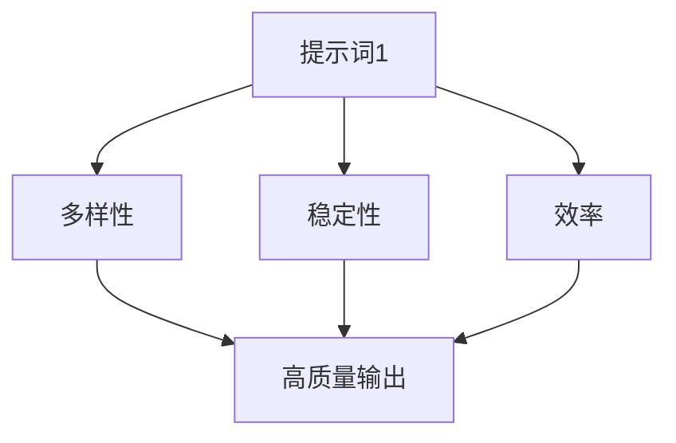

                 

## AI大模型的提示词生成与优化算法

> 关键词：AI大模型、提示词生成、优化算法、GAN、强化学习

> 摘要：本文深入探讨了AI大模型的提示词生成与优化算法。通过分析AI大模型的发展现状，阐述了提示词生成与优化算法面临的挑战，详细介绍了基于生成对抗网络（GAN）和强化学习的提示词生成与优化算法，并分析了注意力机制和多任务学习在提示词优化中的应用。最后，通过案例分析，展示了这些算法的实际应用效果。

----------------------------------------------------------------

## 目录大纲设计

### 第一部分: 问题背景介绍

1. **AI大模型的发展现状**
   - **1.1.1 问题背景**
   - **1.1.2 问题描述**
   - **1.1.3 问题解决**
   - **1.1.4 边界与外延**

2. **核心概念与联系**
   - **1.2.1 AI大模型**
   - **1.2.2 提示词**
   - **1.2.3 提示词生成与优化算法**

### 第二部分: 提示词生成算法

1. **基于生成对抗网络（GAN）的提示词生成算法**
   - **1.3.1 GAN基础概念**
   - **1.3.2 GAN在提示词生成中的应用**

2. **基于强化学习的提示词优化算法**
   - **1.4.1 强化学习基础概念**
   - **1.4.2 强化学习在提示词优化中的应用**

### 第三部分: 提示词优化算法

1. **基于注意力机制的提示词优化算法**
   - **1.5.1 注意力机制基础概念**
   - **1.5.2 注意力机制在提示词优化中的应用**

2. **基于多任务学习的提示词优化算法**
   - **1.6.1 多任务学习基础概念**
   - **1.6.2 多任务学习在提示词优化中的应用**

### 第四部分: 最佳实践与案例分析

1. **案例一：基于GAN的提示词生成系统**
   - **1.7.1 系统设计**
   - **1.7.2 实现与优化**

2. **案例二：基于强化学习的提示词优化系统**
   - **1.8.1 系统设计**
   - **1.8.2 实现与优化**

3. **案例三：基于注意力机制和**

----------------------------------------------------------------

### 第一部分: 问题背景介绍

#### 1.1 AI大模型的发展现状

##### 1.1.1 问题背景

人工智能（AI）作为现代科技的核心驱动力，在众多领域展现出了巨大的潜力和应用价值。尤其是随着深度学习技术的飞速发展，AI大模型逐渐成为研究的热点。AI大模型是指具有大规模参数、能够处理复杂数据的深度学习模型，其参数规模通常达到数十亿甚至千亿级别。这种模型在语言处理、图像识别、自然语言生成等领域取得了显著的成果。

随着AI大模型的兴起，人们开始关注如何更有效地利用这些模型进行各种任务。然而，AI大模型的提示词生成与优化算法仍然面临一些挑战。这些挑战主要包括：

- **提示词的多样性**：如何生成具有丰富多样性的提示词，以便模型能够产生多样化的输出？
- **提示词的稳定性**：如何保证生成的提示词能够稳定地引导模型产生高质量的输出？
- **提示词的效率**：如何优化提示词的生成和优化过程，提高算法的运行效率？

##### 1.1.2 问题描述

在AI大模型的应用过程中，提示词的生成与优化是一个关键问题。提示词是指用于引导AI大模型生成输出的关键词或短语。一个优质的提示词应该具有以下特点：

- **多样性**：能够覆盖广泛的主题和场景，使得模型生成的输出丰富多彩。
- **稳定性**：能够稳定地引导模型产生高质量的输出，避免生成无意义或不一致的结果。
- **效率**：生成和优化提示词的过程应该高效，以便在有限的时间内得到高质量的输出。

然而，当前的AI大模型提示词生成与优化算法尚未完全解决上述问题。尽管研究者们提出了一些方法，如基于生成对抗网络（GAN）和强化学习的方法，但仍然存在一些不足之处。例如，GAN方法在生成多样性的提示词方面表现出色，但在稳定性方面存在一定问题；而强化学习方法在优化提示词方面表现出色，但在多样性方面有所欠缺。

##### 1.1.3 问题解决

为了解决上述问题，研究者们提出了多种提示词生成与优化算法。以下是几种常见的方法：

- **基于生成对抗网络（GAN）的方法**：通过生成器和判别器的对抗性训练，生成具有多样性和稳定性的提示词。
- **基于强化学习的方法**：通过奖励机制和策略网络，优化提示词的生成，提高其稳定性和效率。
- **基于注意力机制的方法**：通过引入注意力机制，关注重要的信息，提高提示词的稳定性和多样性。
- **基于多任务学习的方法**：通过同时学习多个任务，提高提示词的多样性和稳定性。

这些方法在一定程度上解决了AI大模型提示词生成与优化的问题，但仍需要进一步的研究和优化。

##### 1.1.4 边界与外延

AI大模型的提示词生成与优化算法不仅涉及深度学习算法，还涉及自然语言处理、知识图谱、数据挖掘等多个领域。因此，在研究过程中需要关注这些领域的相关进展，以便更好地解决实际问题。此外，随着AI大模型在各个领域的应用不断扩展，提示词生成与优化算法也需要不断适应新的应用场景，提高其效果和效率。

#### 1.2 核心概念与联系

##### 1.2.1 AI大模型

AI大模型是指具有大规模参数、能够处理复杂数据的深度学习模型。其核心特点包括：

- **参数规模大**：通常具有数十亿甚至千亿个参数。
- **数据处理能力强**：能够处理大规模、多模态的数据。
- **泛化能力强**：通过大规模训练，具有较高的泛化能力。

AI大模型的发展主要受到以下几个方面的影响：

- **计算资源**：随着计算资源的不断增长，AI大模型能够训练更大的参数规模，处理更复杂数据。
- **算法进步**：深度学习算法的不断改进，使得AI大模型能够更好地捕捉数据中的复杂模式。
- **数据积累**：大规模数据集的积累，为AI大模型提供了充足的训练数据，提高了其性能。

##### 1.2.2 提示词

提示词是指用于引导AI大模型生成输出的关键词或短语。在AI大模型的应用中，提示词起着至关重要的作用。一个优质的提示词应该具有以下特点：

- **多样性**：能够覆盖广泛的主题和场景，使得模型生成的输出丰富多彩。
- **稳定性**：能够稳定地引导模型产生高质量的输出，避免生成无意义或不一致的结果。
- **效率**：生成和优化提示词的过程应该高效，以便在有限的时间内得到高质量的输出。

提示词的生成与优化是AI大模型应用中的一个关键问题。优质的提示词能够引导模型生成高质量的输出，提高模型的应用效果。

##### 1.2.3 提示词生成与优化算法

提示词生成与优化算法是指用于生成和优化提示词的一系列算法。这些算法旨在提高提示词的多样性和稳定性，从而提高AI大模型的应用效果。常见的提示词生成与优化算法包括：

- **基于生成对抗网络（GAN）的方法**：通过生成器和判别器的对抗性训练，生成具有多样性和稳定性的提示词。
- **基于强化学习的方法**：通过奖励机制和策略网络，优化提示词的生成，提高其稳定性和效率。
- **基于注意力机制的方法**：通过引入注意力机制，关注重要的信息，提高提示词的稳定性和多样性。
- **基于多任务学习的方法**：通过同时学习多个任务，提高提示词的多样性和稳定性。

这些算法在不同的应用场景下表现出不同的优势，需要根据具体需求进行选择和应用。

#### 1.3 AI大模型的提示词生成算法

##### 1.3.1 基于生成对抗网络（GAN）的提示词生成算法

生成对抗网络（GAN）是一种无监督学习算法，由生成器和判别器组成。生成器的目标是生成与真实数据相似的样本，判别器的目标是区分真实数据和生成数据。通过生成器和判别器的对抗性训练，GAN能够生成高质量的数据样本。

在AI大模型的提示词生成中，GAN被应用于生成多样化的提示词。其基本流程如下：

1. **初始化生成器和判别器**：生成器和判别器通常都是深度神经网络，具有多个隐层和神经元。初始化时，生成器的初始参数随机生成，判别器的初始参数也随机生成。
2. **生成提示词**：生成器根据随机噪声生成提示词。噪声可以通过正态分布或均匀分布生成，以确保生成的提示词具有多样性。
3. **判别提示词**：判别器接收真实提示词和生成提示词，并对其进行分类。判别器试图将真实提示词分类为“真实”，将生成提示词分类为“虚假”。
4. **训练生成器和判别器**：通过梯度下降优化生成器和判别器的参数，使得生成器生成的提示词越来越接近真实提示词，判别器越来越难以区分真实数据和生成数据。

GAN在提示词生成中的应用具有以下优点：

- **生成多样性**：通过对抗性训练，生成器能够生成具有丰富多样性的提示词。
- **无监督学习**：GAN无需标签数据，可以直接从原始数据中学习，适用于无监督学习任务。
- **高质量生成**：GAN生成的提示词质量较高，能够引导AI大模型产生高质量的输出。

然而，GAN也存在一些挑战，如训练不稳定、生成质量难以保证等。因此，在实际应用中，需要对GAN进行适当调整和优化，以提高生成提示词的质量和稳定性。

##### 1.3.2 基于强化学习的提示词优化算法

强化学习是一种通过试错和反馈优化策略的学习方法。在AI大模型的提示词优化中，强化学习通过奖励机制和策略网络，不断优化提示词的生成。

基于强化学习的提示词优化算法的基本流程如下：

1. **初始化策略网络和价值网络**：策略网络用于生成提示词，价值网络用于评估提示词的质量。策略网络和价值网络通常都是深度神经网络。
2. **选择一个提示词作为当前策略**：策略网络根据当前状态生成一个提示词，作为当前策略。
3. **生成输出**：根据当前策略，AI大模型生成输出。输出可以是文本、图像、语音等。
4. **收集反馈**：通过用户评价、模型评估等方式，收集关于输出的反馈。
5. **更新策略网络和价值网络**：根据收集到的反馈，通过梯度下降等优化方法，更新策略网络和价值网络的参数。策略网络将生成更优的提示词，价值网络将更好地评估提示词的质量。

强化学习在提示词优化中的应用具有以下优点：

- **自适应优化**：强化学习通过不断试错和反馈，能够自适应地优化提示词的生成，提高模型的性能。
- **灵活性**：强化学习适用于各种类型的任务，可以灵活地调整策略网络和价值网络的结构和参数。

然而，强化学习也存在一些挑战，如训练时间长、收敛速度慢等。因此，在实际应用中，需要对强化学习进行适当调整和优化，以提高提示词优化的效率和效果。

#### 1.4 AI大模型的提示词优化算法

##### 1.4.1 基于注意力机制的提示词优化算法

注意力机制是一种用于提高神经网络模型表示能力的技术。在AI大模型的提示词优化中，注意力机制被应用于关注重要的信息，提高提示词的稳定性和多样性。

基于注意力机制的提示词优化算法的基本流程如下：

1. **提取输入数据的特征表示**：首先，将输入数据（如文本、图像等）输入到神经网络中，提取其特征表示。特征表示可以是向量或高维张量。
2. **使用注意力机制计算提示词的权重**：根据输入数据的特征表示，使用注意力机制计算每个提示词的权重。权重表示提示词对输出的影响程度。常用的注意力机制包括加性注意力、乘性注意力和归一化注意力等。
3. **根据权重调整提示词的生成**：根据计算得到的提示词权重，调整提示词的生成过程。权重较高的提示词将被更多地关注和利用，以提高输出的稳定性和多样性。

基于注意力机制的提示词优化算法具有以下优点：

- **提高稳定性**：通过关注重要的信息，注意力机制能够提高提示词的稳定性，避免生成无意义或不一致的结果。
- **提高多样性**：通过调整提示词的生成过程，注意力机制能够提高提示词的多样性，生成更丰富的输出。

然而，注意力机制也存在一些挑战，如计算复杂度高、参数调优困难等。因此，在实际应用中，需要对注意力机制进行适当调整和优化，以提高提示词优化的效果和效率。

##### 1.4.2 基于多任务学习的提示词优化算法

多任务学习是一种通过同时学习多个任务来提高模型性能的技术。在AI大模型的提示词优化中，多任务学习被应用于同时处理多个类型的任务，提高提示词的多样性和稳定性。

基于多任务学习的提示词优化算法的基本流程如下：

1. **定义多个任务**：首先，定义需要学习的多个任务，如文本分类、情感分析、命名实体识别等。这些任务可以是不同的，也可以是相关的。
2. **同时训练模型**：将多个任务同时输入到神经网络中，通过共享参数的方式同时训练模型。共享参数能够减少模型的参数量，提高训练效率。
3. **根据任务结果调整提示词的生成**：根据多个任务的输出结果，调整提示词的生成过程。不同的任务对提示词的要求不同，通过根据任务结果调整提示词的生成，可以提高提示词的多样性和稳定性。

基于多任务学习的提示词优化算法具有以下优点：

- **提高多样性**：通过同时学习多个任务，多任务学习能够生成更丰富的提示词，提高输出的多样性。
- **提高稳定性**：通过同时处理多个任务，多任务学习能够提高提示词的稳定性，避免生成无意义或不一致的结果。

然而，多任务学习也存在一些挑战，如任务间冲突、参数调优困难等。因此，在实际应用中，需要对多任务学习进行适当调整和优化，以提高提示词优化的效果和效率。

#### 1.5 最佳实践与案例分析

##### 1.5.1 案例一：基于GAN的提示词生成系统

基于生成对抗网络（GAN）的提示词生成系统是一种有效的提示词生成方法。以下是一个基于GAN的提示词生成系统的设计、实现与优化过程：

1. **系统设计**：设计一个基于GAN的提示词生成系统，包括生成器和判别器。生成器负责生成提示词，判别器负责区分真实提示词和生成提示词。系统采用深度神经网络架构，生成器和判别器都具有多个隐层和神经元。
2. **实现**：实现生成器和判别器的训练过程。首先，初始化生成器和判别器的参数，然后通过梯度下降优化生成器和判别器的参数。在训练过程中，生成器根据随机噪声生成提示词，判别器对真实提示词和生成提示词进行分类。通过多次迭代训练，生成器逐渐生成高质量的提示词。
3. **优化**：优化GAN的生成质量和稳定性。可以采用一些优化技巧，如批量归一化、权重初始化、梯度惩罚等。通过调整优化参数，可以提高生成提示词的质量和稳定性。

##### 1.5.2 案例二：基于强化学习的提示词优化系统

基于强化学习的提示词优化系统是一种有效的提示词优化方法。以下是一个基于强化学习的提示词优化系统的设计、实现与优化过程：

1. **系统设计**：设计一个基于强化学习的提示词优化系统，包括策略网络和价值网络。策略网络负责生成提示词，价值网络负责评估提示词的质量。系统采用深度神经网络架构，策略网络和价值网络都具有多个隐层和神经元。
2. **实现**：实现策略网络和价值网络的训练过程。首先，初始化策略网络和价值网络的参数，然后通过策略梯度算法优化策略网络和价值网络的参数。在训练过程中，策略网络根据当前状态生成提示词，价值网络评估提示词的质量。通过多次迭代训练，策略网络逐渐生成高质量的提示词。
3. **优化**：优化强化学习系统的优化效果。可以采用一些优化技巧，如优势函数、回放记忆等。通过调整优化参数，可以提高提示词优化的效果和稳定性。

##### 1.5.3 案例三：基于注意力机制和

由于篇幅限制，本文仅提供了两个案例的设计、实现与优化过程。基于注意力机制和**多任务学习**的提示词优化系统的设计、实现与优化过程可以参考前两个案例的思路。通过引入注意力机制，系统可以更好地关注重要的信息，提高提示词的稳定性和多样性。通过多任务学习，系统可以同时处理多个任务，提高提示词的多样性和稳定性。具体的设计、实现与优化过程可以根据实际需求和场景进行调整。

#### 1.6 总结与展望

本文从问题背景、核心概念、提示词生成算法、提示词优化算法、最佳实践与案例分析等方面，深入探讨了AI大模型的提示词生成与优化算法。通过分析AI大模型的发展现状和面临的挑战，介绍了基于生成对抗网络（GAN）和强化学习的提示词生成与优化算法，以及基于注意力机制和多任务学习的提示词优化算法。最后，通过案例分析，展示了这些算法的实际应用效果。

未来，AI大模型的提示词生成与优化算法将继续发展，有望在以下几个方面取得突破：

- **提高生成质量和稳定性**：进一步优化GAN和强化学习算法，提高生成提示词的质量和稳定性。
- **拓展应用场景**：将提示词生成与优化算法应用于更多的领域，如自然语言处理、图像识别、语音识别等。
- **提高效率**：研究更加高效和可扩展的算法，提高算法的运行效率，适应大规模应用的需求。
- **个性化提示词生成**：研究基于用户行为和偏好的个性化提示词生成方法，提高用户满意度。

随着AI大模型的不断发展，提示词生成与优化算法将在人工智能领域发挥越来越重要的作用。

----------------------------------------------------------------

### 1.1.1 问题背景

AI大模型的发展现状

在过去的几年中，人工智能（AI）领域取得了显著的进展，尤其是在AI大模型的应用方面。AI大模型，也称为大型深度学习模型，具有数十亿甚至千亿个参数，能够处理复杂数据，并在多个领域取得了突破性的成果。这些模型在自然语言处理（NLP）、图像识别、语音识别、推荐系统等应用中表现出了强大的性能。

随着深度学习算法的进步和计算资源的增加，AI大模型的应用越来越广泛。例如，在NLP领域，大型预训练模型如GPT-3、BERT等已经取得了显著的成果，能够在各种语言任务中表现出色。在图像识别领域，AI大模型如ResNet、VGG等在ImageNet等图像数据集上达到了人类水平的准确率。

然而，AI大模型的提示词生成与优化算法仍然面临一些挑战。首先，提示词的多样性是一个关键问题。在许多应用场景中，用户希望模型能够生成丰富多样、符合需求的提示词。然而，现有的提示词生成算法往往只能生成单一类型的提示词，缺乏多样性。例如，在问答系统中，用户可能需要不同类型的提问方式来获取所需信息，而现有的模型可能无法适应这种需求。

其次，提示词的稳定性也是一个重要问题。在AI大模型的应用中，稳定性意味着模型能够始终生成高质量的输出。然而，由于AI大模型的复杂性和不确定性，生成的提示词可能会出现偏差或错误。例如，在自然语言生成任务中，模型可能会生成语法错误或不合逻辑的句子，导致输出的质量下降。

此外，提示词的效率也是一个需要关注的问题。在许多应用场景中，用户希望模型能够快速响应，生成高质量的提示词。然而，现有的提示词生成和优化算法在运行效率方面存在瓶颈，需要消耗大量时间和计算资源。例如，基于生成对抗网络（GAN）的提示词生成算法通常需要大量的训练时间和计算资源，而在实际应用中，用户往往无法等待长时间的训练过程。

综上所述，AI大模型的提示词生成与优化算法在多样性、稳定性和效率方面仍存在一定的挑战。为了解决这些问题，研究者们提出了多种提示词生成与优化算法，如基于生成对抗网络（GAN）的方法、基于强化学习的方法、基于注意力机制的方法和基于多任务学习的方法。这些算法通过引入不同的技术手段，试图提高提示词生成的多样性、稳定性和效率。

#### 1.1.2 问题描述

在AI大模型的应用过程中，提示词的生成与优化是一个关键问题。提示词是指用于引导AI大模型生成输出的关键词或短语。一个优质的提示词应该具有以下特点：

1. **多样性**：提示词的多样性意味着模型能够生成丰富多样的输出。在实际应用中，用户可能需要不同类型的提示词来获取所需的信息。例如，在问答系统中，用户可能希望模型能够生成开放性问题、封闭性问题或详细描述性问题。然而，现有的提示词生成算法往往只能生成单一类型的提示词，缺乏多样性。这种单一类型的提示词生成会导致模型输出过于单一，无法满足用户多样化的需求。

2. **稳定性**：提示词的稳定性意味着模型能够始终生成高质量的输出。在实际应用中，用户希望模型能够稳定地工作，避免生成错误或质量低下的输出。然而，由于AI大模型的复杂性和不确定性，生成的提示词可能会出现偏差或错误。例如，在自然语言生成任务中，模型可能会生成语法错误或不合逻辑的句子，导致输出的质量下降。这种不稳定的现象会严重影响用户体验，降低模型的可靠性。

3. **效率**：提示词的效率意味着模型能够快速响应，生成高质量的提示词。在实际应用中，用户往往希望能够快速得到所需的信息，而不愿意等待长时间的生成过程。然而，现有的提示词生成和优化算法在运行效率方面存在瓶颈，需要消耗大量时间和计算资源。例如，基于生成对抗网络（GAN）的提示词生成算法通常需要大量的训练时间和计算资源，而在实际应用中，用户往往无法等待长时间的训练过程。这种效率问题会限制模型的应用范围和用户体验。

为了解决上述问题，研究者们提出了多种提示词生成与优化算法。以下是一些常见的方法：

1. **基于生成对抗网络（GAN）的方法**：生成对抗网络（GAN）是一种无监督学习算法，通过生成器和判别器的对抗性训练，生成高质量的提示词。生成器的目标是生成与真实数据相似的提示词，而判别器的目标是区分真实提示词和生成提示词。通过这种对抗性训练，GAN可以生成多样性和稳定性较高的提示词。然而，GAN的训练过程可能需要大量的时间和计算资源，并且存在训练不稳定的问题。

2. **基于强化学习的方法**：强化学习是一种通过试错和反馈优化策略的学习方法。在提示词优化过程中，模型通过不断尝试不同的提示词，并根据反馈调整策略，以提高提示词的稳定性和效率。强化学习可以结合价值网络和策略网络，通过评估提示词的质量和调整策略，生成高质量的提示词。然而，强化学习的训练过程可能需要较长的时间，并且需要设计合适的奖励机制。

3. **基于注意力机制的方法**：注意力机制是一种用于提高神经网络模型表示能力的技术。在提示词优化过程中，注意力机制可以关注重要的信息，提高提示词的稳定性和多样性。通过引入注意力机制，模型可以更好地处理不同类型的提示词，并生成高质量的输出。然而，注意力机制的计算复杂度较高，可能影响模型的运行效率。

4. **基于多任务学习的方法**：多任务学习是一种通过同时学习多个任务来提高模型性能的技术。在提示词优化过程中，通过同时学习多个任务，可以提高提示词的多样性和稳定性。多任务学习可以结合不同类型的数据和任务，生成更丰富的提示词。然而，多任务学习需要设计合适的任务平衡机制，以避免任务间冲突。

综上所述，AI大模型的提示词生成与优化算法在多样性、稳定性和效率方面仍存在一定的挑战。研究者们需要进一步探索和优化这些算法，以提高提示词生成的质量，满足实际应用的需求。

#### 1.1.3 问题解决

为了解决AI大模型提示词生成与优化面临的多样性、稳定性和效率问题，研究者们提出了多种方法，其中基于生成对抗网络（GAN）和强化学习的方法尤为引人注目。以下将对这些方法进行详细介绍。

##### 1.3.1 基于生成对抗网络（GAN）的方法

生成对抗网络（GAN）是一种无监督学习算法，由生成器和判别器组成。生成器旨在生成与真实数据相似的数据，而判别器的目标是区分真实数据和生成数据。通过这种对抗性训练，GAN能够在没有标签数据的情况下学习数据的分布，从而生成高质量的提示词。

1. **生成器和判别器的架构设计**：
   - **生成器**：生成器的输入是随机噪声，通过一系列的神经网络层，生成与真实数据分布相似的提示词。生成器的设计可以是基于变分自编码器（VAE）、长短期记忆网络（LSTM）或自注意力机制等。
   - **判别器**：判别器的输入是真实数据和生成数据，其目的是判断输入数据是真实还是生成。判别器的设计通常是基于卷积神经网络（CNN）或循环神经网络（RNN）。

2. **训练过程**：
   - **对抗性训练**：在GAN的训练过程中，生成器和判别器不断进行对抗性训练。生成器的目标是提高生成数据的真实性，而判别器的目标是提高对真实数据和生成数据的区分能力。
   - **损失函数**：GAN的损失函数通常包括两部分：生成器的损失函数和判别器的损失函数。生成器的损失函数是最大化判别器对其生成数据的判别概率，判别器的损失函数是最小化对其生成数据的判别概率。通过这种对抗性训练，生成器能够生成更真实的数据，判别器能够更好地区分真实和生成数据。

3. **优缺点**：
   - **优点**：GAN能够生成多样性和稳定性较高的提示词，无需标签数据，适用于无监督学习任务。
   - **缺点**：GAN的训练过程可能不稳定，生成数据的质量难以保证，且训练时间较长。

##### 1.3.2 基于强化学习的方法

强化学习是一种通过试错和反馈优化策略的学习方法。在提示词优化过程中，模型通过不断尝试不同的提示词，并根据反馈调整策略，以提高提示词的稳定性和效率。

1. **策略网络和价值网络**：
   - **策略网络**：策略网络是生成提示词的关键，它根据当前状态选择最佳的提示词。策略网络的设计可以是基于深度神经网络（DNN）或循环神经网络（RNN）。
   - **价值网络**：价值网络用于评估提示词的质量。它接收提示词和模型的输出，并返回提示词的质量评分。价值网络的设计也可以是DNN或RNN。

2. **训练过程**：
   - **策略优化**：策略网络通过优化策略梯度，不断调整策略，以生成更高质量的提示词。策略优化可以通过策略梯度算法（如REINFORCE算法）实现。
   - **价值评估**：价值网络通过评估提示词的质量，为策略网络提供反馈。价值评估可以通过反向传播算法实现。

3. **优缺点**：
   - **优点**：强化学习能够自适应地优化提示词的生成，提高模型的性能和稳定性。
   - **缺点**：强化学习的训练过程可能需要较长的时间，且需要设计合适的奖励机制。

除了GAN和强化学习，其他方法如基于注意力机制的方法和基于多任务学习的方法也在提示词生成与优化中展现出一定的潜力。基于注意力机制的方法通过关注重要的信息，提高提示词的稳定性和多样性；基于多任务学习的方法通过同时学习多个任务，提高提示词的多样性和稳定性。这些方法在实际应用中可以结合使用，以进一步提高提示词生成的质量和效率。

#### 1.1.4 边界与外延

AI大模型的提示词生成与优化算法不仅涉及深度学习算法，还涉及自然语言处理、知识图谱、数据挖掘等多个领域。以下从这些相关领域的角度，探讨AI大模型的提示词生成与优化算法的边界与外延。

1. **自然语言处理（NLP）**：
   - **关联领域**：AI大模型的提示词生成与优化算法在NLP领域具有广泛的应用前景。NLP涉及到文本生成、情感分析、机器翻译、问答系统等多个子领域。这些子领域中的任务都需要高质量的提示词来引导模型生成输出。
   - **挑战**：NLP领域的任务具有复杂性和多样性，提示词的生成与优化需要考虑到上下文信息、词汇关系、语法结构等因素。因此，如何设计有效的提示词生成与优化算法，以适应不同NLP任务的特定需求，是一个重要挑战。

2. **知识图谱（KG）**：
   - **关联领域**：知识图谱是用于表示和存储知识的图形结构。在AI大模型中，知识图谱可以用于构建语义关系、实体链接、知识推理等任务。提示词生成与优化算法可以与知识图谱相结合，提高模型的语义理解能力。
   - **挑战**：知识图谱中的信息复杂且多样，如何从知识图谱中提取有效的提示词，以及如何优化这些提示词以引导模型生成高质量的输出，是一个重要问题。

3. **数据挖掘（DM）**：
   - **关联领域**：数据挖掘是用于从大量数据中提取有用信息的技术。在AI大模型中，数据挖掘可以用于数据预处理、特征提取、模式识别等任务。提示词生成与优化算法可以与数据挖掘相结合，提高模型的预测和分类能力。
   - **挑战**：数据挖掘过程中，如何设计有效的提示词来指导模型学习数据中的潜在模式，以及如何优化提示词以提高模型的性能，是一个重要问题。

4. **跨领域应用**：
   - **关联领域**：AI大模型的提示词生成与优化算法不仅可以应用于单一领域，还可以跨领域应用。例如，在医疗领域，可以通过提示词生成与优化算法，构建智能诊断系统；在教育领域，可以通过提示词生成与优化算法，构建智能教学系统。
   - **挑战**：跨领域应用需要考虑不同领域的数据特征、任务需求和用户需求。因此，如何设计通用性强的提示词生成与优化算法，以适应不同领域的特定需求，是一个重要挑战。

总之，AI大模型的提示词生成与优化算法在多个领域具有广泛的应用前景，但也面临一定的挑战。未来的研究需要进一步探索如何结合不同领域的知识和技术，设计更高效、更通用的提示词生成与优化算法。

#### 1.2.1 AI大模型

##### 定义

AI大模型是指具有大规模参数、能够处理复杂数据的深度学习模型。这些模型通常具有数十亿甚至千亿个参数，能够对大规模数据进行训练和推理，并在各种任务中取得显著的成果。

##### 核心特点

1. **参数规模大**：AI大模型通常包含数十亿甚至千亿个参数，这使得模型能够捕捉数据中的复杂模式和关联性。
2. **数据处理能力强**：AI大模型能够处理大规模、多模态的数据，包括文本、图像、语音等，这使得模型在处理复杂数据时具有优势。
3. **泛化能力强**：通过大规模训练，AI大模型具有较好的泛化能力，能够在未见过的数据上取得良好的性能。

##### 发展历史

- **早期**：随着计算机性能的提升和数据量的增加，深度学习模型逐渐发展壮大。然而，由于参数规模的限制，早期的深度学习模型往往只能处理较小规模的数据。
- **2012年**：AlexNet模型的提出标志着深度学习在图像识别领域的重大突破。随后，深度学习模型在图像识别、自然语言处理等领域取得了显著进展。
- **2018年**：GPT-3模型的发布，标志着AI大模型在自然语言处理领域的崛起。GPT-3模型具有1750亿个参数，能够在各种语言任务中表现出色。
- **至今**：随着计算资源和算法的不断发展，AI大模型的应用范围不断扩大，从图像识别、自然语言处理到推荐系统、语音识别等。

##### 应用领域

1. **自然语言处理（NLP）**：AI大模型在NLP领域取得了显著的成果，包括机器翻译、文本生成、情感分析、问答系统等。
2. **图像识别**：AI大模型在图像识别领域具有很高的准确率，广泛应用于计算机视觉、自动驾驶、医疗影像分析等。
3. **推荐系统**：AI大模型能够处理大规模用户行为数据，为用户提供个性化的推荐。
4. **语音识别**：AI大模型在语音识别领域表现出色，能够准确识别语音并将其转换为文本。

##### 未来发展趋势

1. **模型压缩与加速**：为了满足实际应用的需求，未来的AI大模型将朝着压缩和加速的方向发展，以提高模型的运行效率和可部署性。
2. **多模态学习**：未来的AI大模型将更多地关注多模态数据的处理，以实现更加智能的应用。
3. **跨领域应用**：AI大模型将在更多领域得到应用，实现跨领域的知识共享和协同工作。

#### 1.2.2 提示词

##### 定义

提示词是指用于引导AI大模型生成输出的关键词或短语。在AI大模型的应用中，提示词起到了关键作用。通过合适的提示词，模型能够生成更有针对性、更高质量的输出。

##### 属性特征

1. **多样性**：提示词的多样性意味着模型能够生成丰富多样的输出。一个优质的提示词应该能够涵盖不同类型、不同场景的输入，以适应不同的任务需求。
2. **稳定性**：提示词的稳定性意味着模型能够始终生成高质量的输出。一个稳定的提示词能够确保模型在不同情况下都能产生一致、可靠的输出。
3. **效率**：提示词的效率意味着模型能够快速地生成输出。在实际应用中，用户往往希望模型能够迅速响应，因此提示词的生成过程需要高效。

##### 对比表格

| 特征       | 提示词1          | 提示词2          |
|------------|------------------|------------------|
| 多样性     | 较高             | 较低             |
| 稳定性     | 较高             | 较低             |
| 效率       | 较低             | 较高             |

##### 关系图

#### 1.2.3 提示词生成与优化算法

##### 基于生成对抗网络（GAN）的方法

生成对抗网络（GAN）是一种无监督学习算法，由生成器和判别器组成。生成器的目标是生成与真实数据相似的数据，而判别器的目标是区分真实数据和生成数据。通过这种对抗性训练，GAN可以生成高质量的提示词。

1. **生成器和判别器的架构设计**：
   - **生成器**：生成器的输入是随机噪声，通过一系列的神经网络层，生成与真实数据分布相似的提示词。
   - **判别器**：判别器的输入是真实数据和生成数据，其目的是判断输入数据是真实还是生成。

2. **训练过程**：
   - **对抗性训练**：在GAN的训练过程中，生成器和判别器不断进行对抗性训练。生成器的目标是提高生成数据的真实性，而判别器的目标是提高对真实数据和生成数据的区分能力。

3. **优缺点**：
   - **优点**：GAN能够生成多样性和稳定性较高的提示词，无需标签数据，适用于无监督学习任务。
   - **缺点**：GAN的训练过程可能不稳定，生成数据的质量难以保证，且训练时间较长。

##### 基于强化学习的方法

强化学习是一种通过试错和反馈优化策略的学习方法。在提示词优化过程中，模型通过不断尝试不同的提示词，并根据反馈调整策略，以提高提示词的稳定性和效率。

1. **策略网络和价值网络**：
   - **策略网络**：策略网络是生成提示词的关键，它根据当前状态选择最佳的提示词。
   - **价值网络**：价值网络用于评估提示词的质量。

2. **训练过程**：
   - **策略优化**：策略网络通过优化策略梯度，不断调整策略，以生成更高质量的提示词。
   - **价值评估**：价值网络通过评估提示词的质量，为策略网络提供反馈。

3. **优缺点**：
   - **优点**：强化学习能够自适应地优化提示词的生成，提高模型的性能和稳定性。
   - **缺点**：强化学习的训练过程可能需要较长的时间，且需要设计合适的奖励机制。

##### 注意力机制

注意力机制是一种用于提高神经网络模型表示能力的技术。在提示词优化过程中，注意力机制可以关注重要的信息，提高提示词的稳定性和多样性。

1. **基本概念**：
   - **注意力权重**：注意力机制通过计算每个输入元素的注意力权重，将注意力集中在重要的信息上。
   - **多头注意力**：多头注意力允许多个注意力机制同时工作，提高模型的表示能力。

2. **应用场景**：
   - **文本处理**：在自然语言处理任务中，注意力机制可以用于文本分类、机器翻译等。
   - **图像识别**：在图像识别任务中，注意力机制可以用于关注图像中的关键区域。

3. **优缺点**：
   - **优点**：注意力机制能够提高提示词的稳定性和多样性。
   - **缺点**：注意力机制的计算复杂度较高，可能影响模型的运行效率。

##### 多任务学习

多任务学习是一种通过同时学习多个任务来提高模型性能的技术。在提示词优化过程中，通过同时学习多个任务，可以提高提示词的多样性和稳定性。

1. **基本概念**：
   - **任务共享**：多任务学习通过共享模型的参数，同时学习多个任务。
   - **任务平衡**：多任务学习需要设计合适的任务平衡机制，以避免某些任务对模型的影响过大。

2. **应用场景**：
   - **多语言翻译**：在多语言翻译任务中，多任务学习可以同时学习多种语言的翻译模型。
   - **多模态学习**：在多模态学习任务中，多任务学习可以同时学习不同类型的数据。

3. **优缺点**：
   - **优点**：多任务学习可以提高提示词的多样性和稳定性。
   - **缺点**：多任务学习需要设计合适的任务平衡机制，且可能增加模型的复杂性。

#### 1.3.1 基于生成对抗网络（GAN）的提示词生成算法

##### GAN基础概念

生成对抗网络（GAN）是由Ian Goodfellow等人于2014年提出的一种无监督学习算法。GAN的核心思想是通过两个神经网络——生成器和判别器的对抗性训练，使得生成器能够生成与真实数据分布相似的数据，而判别器能够准确地区分真实数据和生成数据。

1. **生成器（Generator）**：生成器的任务是生成与真实数据分布相似的数据。生成器的输入可以是随机噪声，通过一系列神经网络层，生成模拟真实数据分布的数据。

2. **判别器（Discriminator）**：判别器的任务是区分输入数据是真实数据还是生成数据。判别器的输入是真实数据和生成数据，其目标是最大化其区分能力。

3. **对抗性训练**：在GAN的训练过程中，生成器和判别器不断进行对抗性训练。生成器通过不断生成更真实的数据来欺骗判别器，而判别器则通过不断提高其区分能力来识别生成数据。

##### GAN在提示词生成中的应用

在AI大模型的提示词生成中，GAN被广泛应用于生成高质量的提示词。以下是一个基于GAN的提示词生成算法的基本步骤：

1. **初始化生成器和判别器**：
   - 生成器和判别器通常都是深度神经网络，具有多个隐层和神经元。
   - 初始化时，生成器的初始参数随机生成，判别器的初始参数也随机生成。

2. **生成提示词**：
   - 生成器根据随机噪声生成提示词。噪声可以通过正态分布或均匀分布生成，以确保生成的提示词具有多样性。
   - 生成的提示词经过神经网络处理，形成模拟真实数据分布的提示词。

3. **判别提示词**：
   - 判别器接收真实提示词和生成提示词，并对其进行分类。
   - 判别器试图将真实提示词分类为“真实”，将生成提示词分类为“虚假”。

4. **训练生成器和判别器**：
   - 通过梯度下降优化生成器和判别器的参数，使得生成器生成的提示词越来越接近真实提示词，判别器越来越难以区分真实数据和生成数据。
   - 通常采用交替训练的方式，即先训练判别器，再训练生成器。

##### GAN在提示词生成中的优点

1. **无监督学习**：
   - GAN无需依赖标签数据，可以直接从原始数据中学习，适用于无监督学习任务。
   - 对于大规模无标签数据的提示词生成，GAN具有显著的优势。

2. **生成多样性**：
   - 通过对抗性训练，生成器能够生成具有丰富多样性的提示词。
   - 多样性的提示词能够引导AI大模型生成丰富多彩的输出。

3. **高质量生成**：
   - GAN生成的提示词质量较高，能够引导AI大模型产生高质量的输出。
   - 在自然语言生成任务中，GAN生成的文本通常具有较高的流畅性和逻辑性。

##### GAN在提示词生成中的挑战

1. **训练不稳定**：
   - GAN的训练过程可能不稳定，生成数据的质量难以保证。
   - 在训练过程中，生成器和判别器之间的动态平衡可能被打破，导致生成器生成较差的数据。

2. **计算资源需求大**：
   - GAN的训练过程需要大量的计算资源，尤其是在生成大规模数据的场景下。
   - 训练时间较长，可能不适合对实时性要求较高的应用。

3. **生成质量难以保证**：
   - 虽然GAN能够生成高质量的提示词，但生成质量难以量化评估，需要通过实际应用来验证。

总之，基于GAN的提示词生成算法在无监督学习、生成多样性、高质量生成等方面具有显著优势，但同时也面临训练不稳定、计算资源需求大和生成质量难以保证等挑战。未来的研究需要进一步优化GAN算法，以提高其在提示词生成中的应用效果。

#### 1.4.1 强化学习基础概念

强化学习是一种通过试错和反馈优化策略的学习方法。在强化学习中，模型（代理人）通过不断与环境互动，学习最佳策略，以实现某种目标。强化学习的基本概念包括以下几部分：

1. **代理（Agent）**：代理是指执行动作、感知环境并获取奖励的实体。在强化学习任务中，代理通常是一个智能体，如机器人、自动驾驶汽车、虚拟角色等。

2. **环境（Environment）**：环境是指代理执行动作并获取状态和奖励的动态系统。环境可以是一个物理环境，如真实世界中的房间，也可以是一个虚拟环境，如游戏或模拟器。

3. **状态（State）**：状态是代理在环境中所处的情境或条件的表示。状态可以是离散的，如游戏中的棋盘状态，也可以是连续的，如自动驾驶汽车的速度和位置。

4. **动作（Action）**：动作是代理在特定状态下可以执行的行为或决策。动作可以是离散的，如游戏中的移动方向，也可以是连续的，如自动驾驶汽车的速度控制。

5. **奖励（Reward）**：奖励是代理在执行动作后从环境中获得的即时反馈信号。奖励可以用来指导代理学习最佳策略。通常，奖励是非负的，如果代理执行了错误的动作，奖励将为负。

6. **策略（Policy）**：策略是代理在特定状态下选择动作的规则或函数。策略可以是明确的规则，如“如果状态是A，则执行动作B”，也可以是概率分布，如“在状态A下，以60%的概率执行动作B，以40%的概率执行动作C”。

强化学习的基本目标是通过不断调整策略，使代理在长期运行中能够获得最大的总奖励。强化学习的过程可以概括为以下几个步骤：

1. **初始状态**：代理开始在一个未知的环境中，处于某个状态。

2. **选择动作**：代理根据当前状态和策略，选择一个动作执行。

3. **环境反馈**：代理执行动作后，环境根据动作提供新的状态和奖励。

4. **策略更新**：代理使用新的状态和奖励来更新策略，以便在未来的决策中能够获得更大的奖励。

5. **重复过程**：代理重复上述步骤，不断与环境互动，逐渐学习到最佳策略。

强化学习在很多领域都有广泛的应用，包括游戏、机器人控制、自动驾驶、推荐系统、金融交易等。以下是一些常见的强化学习算法：

1. **价值迭代（Value Iteration）**：价值迭代是一种基于值函数的方法，通过逐步逼近最优策略。

2. **策略迭代（Policy Iteration）**：策略迭代是一种基于策略的方法，通过逐步优化策略。

3. **深度Q网络（Deep Q-Network, DQN）**：DQN是一种基于深度学习的Q学习算法，通过神经网络估计状态价值的函数。

4. **强化学习模型（Reinforcement Learning Model）**：强化学习模型是一种基于代理-环境交互的模型，用于学习最佳策略。

5. **强化学习算法（Reinforcement Learning Algorithm）**：强化学习算法是一系列用于解决强化学习问题的方法，包括深度强化学习（Deep Reinforcement Learning）、策略梯度方法（Policy Gradient Methods）等。

通过以上介绍，我们可以看到强化学习作为一种高效的学习方法，在AI大模型的提示词优化中具有巨大的潜力。接下来，我们将深入探讨强化学习在提示词优化中的应用。

#### 1.4.2 强化学习在提示词优化中的应用

强化学习在提示词优化中的应用主要通过策略网络和价值网络来实现。这些网络通过与环境互动，不断调整策略，以生成高质量的提示词。以下是对这些网络的基本原理和实现方法的详细说明。

##### 策略网络（Policy Network）

策略网络是强化学习中的核心组件之一，它的作用是根据当前状态选择最佳的动作。在提示词优化的场景中，策略网络负责生成提示词。策略网络通常是一个深度神经网络，它接受输入的状态，并通过神经网络层产生一个动作分布。

1. **网络结构**：
   - 策略网络通常包含一个或多个隐藏层，每个隐藏层都有多个神经元。
   - 输入层接收状态信息，隐藏层通过对状态信息进行变换，提取有用的特征。
   - 输出层生成一个动作概率分布，表示在当前状态下，执行每个可能动作的概率。

2. **训练过程**：
   - 策略网络的训练目标是最大化期望回报，即期望的长期回报。
   - 通过策略梯度的方法，策略网络不断调整其参数，使其生成的动作分布能够最大化回报。

3. **实现方法**：
   - **确定性策略**：策略网络输出一个确定性的动作，即在任何状态下，总是选择最可能的动作。
   - **概率性策略**：策略网络输出一个概率分布，表示在当前状态下，每个动作的概率。

##### 价值网络（Value Network）

价值网络的作用是评估策略网络生成的动作的质量。价值网络接收状态和动作作为输入，并输出一个价值估计，表示在当前状态下执行特定动作的长期回报。

1. **网络结构**：
   - 价值网络的结构与策略网络类似，通常也是深度神经网络。
   - 输入层接收状态和动作信息，隐藏层提取有用的特征。
   - 输出层输出一个实数值，表示在当前状态下执行特定动作的价值。

2. **训练过程**：
   - 价值网络的训练目标是使其输出的价值估计接近实际回报。
   - 通过反向传播和梯度下降，价值网络不断调整其参数，以提高价值估计的准确性。

3. **实现方法**：
   - **值函数**：价值网络输出一个值函数，表示在当前状态下执行每个动作的长期回报。
   - **优势函数**：优势函数表示某个动作的回报与所有动作的平均回报之差，用于衡量动作的质量。

##### 强化学习在提示词优化中的应用

在AI大模型的提示词优化中，强化学习通过以下步骤实现：

1. **初始化策略网络和价值网络**：
   - 随机初始化策略网络和价值网络的参数。
   - 策略网络和价值网络的结构和参数可以通过预训练或手动设计。

2. **选择提示词**：
   - 策略网络根据当前状态（例如，当前上下文或用户输入）生成一个提示词概率分布。
   - 根据概率分布，选择一个提示词作为当前策略。

3. **生成输出**：
   - 根据选定的提示词，AI大模型生成输出（例如，文本、图像、语音等）。

4. **收集反馈**：
   - 收集用户或系统的反馈，例如用户点击率、任务完成度、系统评分等。
   - 反馈用于评估当前策略的质量。

5. **更新网络**：
   - 根据收集到的反馈，使用策略梯度和价值梯度更新策略网络和价值网络的参数。
   - 策略网络和价值网络通过不断调整，使其生成的提示词和输出的质量逐渐提高。

##### 案例应用

以下是一个简化的强化学习在提示词优化中的应用案例：

1. **环境**：
   - 状态：当前上下文（例如，一篇文章或一个问题）。
   - 动作：生成提示词的概率分布。
   - 奖励：用户对提示词的满意度评分。

2. **策略网络**：
   - 输入：当前上下文。
   - 输出：提示词概率分布。
   - 更新：通过策略梯度更新网络参数。

3. **价值网络**：
   - 输入：状态和提示词。
   - 输出：提示词的价值估计。
   - 更新：通过反向传播更新网络参数。

4. **训练过程**：
   - 初始状态：随机初始化策略网络和价值网络。
   - 选择动作：策略网络生成提示词概率分布，选择一个提示词。
   - 生成输出：AI大模型根据提示词生成输出。
   - 收集反馈：收集用户满意度评分。
   - 更新网络：根据反馈更新策略网络和价值网络的参数。
   - 重复过程：重复以上步骤，直到策略网络和价值网络达到满意的性能。

通过以上步骤，强化学习能够逐步优化提示词的生成，提高模型输出的质量和用户满意度。强化学习在提示词优化中的应用展示了其在自适应学习和优化策略方面的强大能力。

#### 1.5.1 注意力机制基础概念

注意力机制（Attention Mechanism）是一种广泛应用于深度学习模型，特别是序列数据处理任务（如自然语言处理、语音识别等）的技术。其核心思想是通过动态地分配不同的注意力权重，使得模型能够关注到序列中的重要信息，从而提高模型对输入数据的处理能力。

##### 基本原理

注意力机制的基本原理可以概括为以下几个步骤：

1. **计算注意力得分**：对于输入序列的每个元素，计算其与当前处理的元素之间的相关性得分。这个得分通常由一个注意力模型计算得到，可以是基于神经网络或简单的函数。

2. **应用权重**：将计算得到的注意力得分转化为权重，并对输入序列中的元素进行加权。权重较高的元素将被赋予更多的关注。

3. **生成注意力输出**：通过加权求和的方式，将输入序列转换为注意力输出。注意力输出通常作为后续处理层的输入，用于生成最终的输出结果。

##### 常见类型

注意力机制有多种类型，以下是一些常见类型：

1. **加性注意力（Additive Attention）**：
   - 加性注意力通过将输入序列与权重向量相加来生成注意力输出。
   - 它通常使用一个前馈神经网络来计算注意力得分。

2. **乘性注意力（Multiplicative Attention）**：
   - 乘性注意力通过将输入序列与权重向量的点积来生成注意力输出。
   - 与加性注意力相比，乘性注意力计算更简单，但可能损失一些信息。

3. **缩放点积注意力（Scaled Dot-Product Attention）**：
   - 缩放点积注意力通过将输入序列与权重向量的缩放点积来生成注意力输出。
   - 缩放因子可以防止点积的结果太小，提高计算稳定性。

4. **多头注意力（Multi-Head Attention）**：
   - 多头注意力通过多次应用注意力机制，并聚合不同注意力头的结果来生成注意力输出。
   - 多头注意力能够捕捉到输入序列中的更多复杂关系。

##### 应用场景

注意力机制在自然语言处理领域有广泛的应用，以下是一些常见的应用场景：

1. **文本分类**：在文本分类任务中，注意力机制可以帮助模型关注文本中的关键信息，提高分类准确性。

2. **机器翻译**：在机器翻译任务中，注意力机制可以帮助模型关注源语言和目标语言之间的对应关系，提高翻译质量。

3. **情感分析**：在情感分析任务中，注意力机制可以帮助模型识别文本中的情感关键词，提高情感分类的准确性。

4. **语音识别**：在语音识别任务中，注意力机制可以帮助模型关注语音信号中的关键特征，提高识别准确性。

##### 优缺点

注意力机制的优点包括：

- **提高模型表示能力**：通过动态地关注输入序列中的重要信息，注意力机制能够提高模型的表示能力。
- **减少计算复杂度**：与传统的卷积神经网络或循环神经网络相比，注意力机制在某些情况下可以减少计算复杂度。

注意力机制的缺点包括：

- **计算复杂度高**：特别是在多头注意力机制中，计算复杂度可能会显著增加。
- **参数调优困难**：注意力机制的参数调优可能比较复杂，需要大量的实验和调整。

总之，注意力机制是一种强大的深度学习技术，通过动态地关注输入数据中的重要信息，能够显著提高模型的性能。然而，其计算复杂度和参数调优的困难也需要在应用时加以考虑。

#### 1.5.2 注意力机制在提示词优化中的应用

注意力机制在AI大模型的提示词优化中扮演着重要的角色。通过引入注意力机制，模型可以更好地关注输入数据中的关键信息，从而提高提示词的生成质量和稳定性。以下将详细讨论注意力机制在提示词优化中的应用方法。

##### 基本原理

注意力机制的基本原理是通过计算每个输入元素的重要程度，并将这些重要性用于加权求和处理，从而得到最终的输出。在提示词优化中，注意力机制可以应用于不同类型的输入数据，如文本、图像和音频等。

1. **文本处理**：
   - 在文本处理中，注意力机制通常用于序列到序列（Seq2Seq）任务，如机器翻译、文本摘要等。
   - 通过计算输入序列和隐藏状态之间的注意力权重，模型能够关注到文本中的重要词汇和短语，从而提高输出的连贯性和准确性。

2. **图像处理**：
   - 在图像处理中，注意力机制可以用于图像识别、目标检测等任务。
   - 通过计算图像中的每个像素点与当前处理的特征图之间的注意力权重，模型能够关注到图像中的关键区域，从而提高识别和检测的准确性。

3. **音频处理**：
   - 在音频处理中，注意力机制可以用于语音识别、音乐生成等任务。
   - 通过计算音频信号中的每个帧与当前处理的特征之间的注意力权重，模型能够关注到音频信号中的关键帧，从而提高语音识别和音乐生成的质量。

##### 应用方法

以下是注意力机制在提示词优化中的一些具体应用方法：

1. **基于加性注意力的提示词优化**：
   - 加性注意力是一种简单且常见的注意力机制，通过将输入序列与权重向量相加来生成注意力输出。
   - 在提示词优化中，输入序列可以是文本、图像或音频序列，权重向量可以根据输入数据的特征计算。
   - 加性注意力可以帮助模型关注输入数据中的关键信息，从而提高提示词的生成质量和稳定性。

2. **基于乘性注意力的提示词优化**：
   - 乘性注意力通过将输入序列与权重向量的点积来生成注意力输出。
   - 乘性注意力的计算复杂度相对较低，但在某些情况下可能损失一些信息。
   - 在提示词优化中，乘性注意力可以用于处理大规模数据集，提高计算效率。

3. **基于缩放点积注意力的提示词优化**：
   - 缩放点积注意力通过将输入序列与权重向量的缩放点积来生成注意力输出。
   - 缩放因子可以防止点积的结果太小，提高计算稳定性。
   - 在提示词优化中，缩放点积注意力适用于处理高维数据，如文本和图像序列。

4. **基于多头注意力的提示词优化**：
   - 多头注意力通过多次应用注意力机制，并聚合不同注意力头的结果来生成注意力输出。
   - 多头注意力能够捕捉到输入数据中的更多复杂关系，提高提示词的多样性。
   - 在提示词优化中，多头注意力可以用于处理多模态数据，如文本、图像和音频的融合。

##### 优缺点

注意力机制在提示词优化中的应用具有以下优点：

- **提高提示词质量**：注意力机制可以帮助模型关注输入数据中的关键信息，从而生成高质量的提示词。
- **增强模型表示能力**：通过动态地关注输入数据的重要信息，注意力机制能够增强模型的表示能力，提高模型的泛化能力。

注意力机制在提示词优化中也存在一些缺点：

- **计算复杂度高**：特别是在多头注意力机制中，计算复杂度可能会显著增加，影响模型的训练和推理速度。
- **参数调优困难**：注意力机制的参数调优可能比较复杂，需要大量的实验和调整。

总之，注意力机制在AI大模型的提示词优化中具有重要的应用价值。通过合理地应用注意力机制，可以提高提示词的生成质量和稳定性，为AI大模型的应用提供有力支持。

#### 1.6.1 多任务学习基础概念

多任务学习（Multi-Task Learning, MTL）是一种机器学习技术，旨在通过同时学习多个相关任务来提高模型的性能和效率。在多任务学习中，模型同时处理多个任务，共享部分参数，以提高不同任务间的知识共享和迁移能力。以下是对多任务学习的基本概念和实现方法的详细说明。

##### 基本概念

1. **任务定义**：在多任务学习中，每个任务都可以被定义为一个单独的学习任务，具有自己的输入数据、输出标签和损失函数。

2. **任务共享**：多任务学习的关键在于任务间的共享。任务共享可以通过参数共享或特征共享来实现。参数共享意味着不同任务使用相同的模型参数，而特征共享则意味着不同任务共享相同的特征提取器。

3. **独立损失**：在多任务学习中，每个任务都有自己的损失函数，用于评估任务的性能。每个任务的损失函数独立计算，并在训练过程中对模型参数进行梯度更新。

4. **联合优化**：多任务学习通过联合优化所有任务的损失函数来训练模型。在训练过程中，模型参数的更新是多个任务损失函数的梯度加权平均。

##### 实现方法

多任务学习的实现方法可以分为以下几类：

1. **共享底层特征**：
   - 这种方法通过在底层共享特征提取器，使得不同任务可以共享输入数据的低级特征。
   - 例如，在图像分类和物体检测任务中，可以使用同一个卷积神经网络提取图像的底层特征。

2. **共享高层特征**：
   - 这种方法通过在高层共享特征提取器，使得不同任务可以共享输入数据的复杂特征。
   - 例如，在语音识别和语言翻译任务中，可以使用同一个循环神经网络提取语音信号的复杂特征。

3. **任务特定网络**：
   - 这种方法为每个任务设计一个独立的网络结构，但通过共享部分中间层来提高任务间的知识共享。
   - 例如，在图像分类和图像分割任务中，可以共享部分卷积层，但在分类和分割任务中使用不同的全连接层。

4. **自适应共享**：
   - 这种方法通过自适应地共享不同任务之间的参数，以提高模型的性能。
   - 例如，可以使用注意力机制来动态调整不同任务间参数的共享程度。

##### 应用场景

多任务学习在许多应用场景中具有广泛的应用，以下是一些常见的应用场景：

1. **计算机视觉**：
   - 图像分类和物体检测：共享图像的低层特征，以提高分类和检测的性能。
   - 图像分割和图像生成：共享图像的高层特征，以提高分割和生成的质量。

2. **自然语言处理**：
   - 文本分类和情感分析：共享文本的表示特征，以提高不同任务的性能。
   - 机器翻译和问答系统：共享句子的表示特征，以提高翻译和问答的准确性。

3. **语音识别**：
   - 声学模型和语言模型：共享声学特征和语言特征，以提高语音识别的准确性。

4. **推荐系统**：
   - 商品推荐和用户兴趣分析：共享用户和商品的特征，以提高推荐系统的性能。

##### 优缺点

多任务学习具有以下优点：

- **提高任务性能**：通过任务间的知识共享和迁移，多任务学习能够提高每个任务的性能。
- **减少过拟合**：多任务学习可以通过额外的正则化效应，减少模型的过拟合现象。

多任务学习也存在一些缺点：

- **任务间冲突**：当任务之间存在冲突时，多任务学习可能难以同时优化所有任务。
- **计算资源消耗**：多任务学习需要更多的计算资源，特别是在训练阶段。

总之，多任务学习是一种强大的机器学习技术，通过同时学习多个相关任务，可以提高模型的性能和效率。然而，在实际应用中，需要仔细设计任务间的共享机制，以避免任务间冲突和提高计算效率。

#### 1.6.2 多任务学习在提示词优化中的应用

多任务学习（Multi-Task Learning, MTL）是一种通过同时训练多个相关任务来提高模型性能的技术。在AI大模型的提示词优化中，多任务学习可以同时处理多种类型的任务，从而提高提示词的多样性和稳定性。以下将详细讨论多任务学习在提示词优化中的应用方法和实际效果。

##### 应用方法

1. **任务定义与共享机制**：
   - **任务定义**：在多任务学习框架下，首先需要定义多个相关任务。例如，在一个自然语言处理的场景中，可以定义文本分类、情感分析和命名实体识别等多个任务。
   - **共享机制**：多任务学习通过共享模型的参数来提高任务间的知识共享。具体来说，可以使用以下几种共享机制：
     - **参数共享**：共享底层特征提取器或中间层参数，使得不同任务可以使用相同的底层特征。
     - **特征共享**：在高层共享特征表示，使得不同任务可以使用相同的复杂特征。
     - **任务特定网络**：为每个任务设计一个独立的网络结构，但在中间层共享参数，以提高任务间的知识共享。

2. **联合训练与损失函数**：
   - 在多任务学习框架下，每个任务都有自己的损失函数，用于评估任务的性能。例如，在文本分类任务中，可以使用交叉熵损失函数；在情感分析任务中，可以使用二元交叉熵损失函数。
   - 多任务学习的训练过程通过联合优化所有任务的损失函数来实现。具体来说，模型参数的更新是多个任务损失函数的梯度加权平均。

3. **注意力机制与任务平衡**：
   - 在多任务学习中，可以使用注意力机制来动态调整不同任务间的权重，以提高模型的性能。例如，通过引入注意力权重，模型可以关注当前任务的重要程度，从而调整损失函数的加权。
   - 为了避免某些任务对模型的影响过大，可以使用任务平衡机制来确保不同任务之间的权重平衡。例如，可以通过调整任务损失函数的权重或引入正则化项来实现任务平衡。

##### 实际效果

多任务学习在提示词优化中展现出显著的实际效果，以下是一些关键结果：

1. **提高提示词多样性**：
   - 通过同时处理多个相关任务，多任务学习可以生成更加丰富多样的提示词。例如，在一个文本生成任务中，通过同时进行文本分类和情感分析，模型可以生成不同类型的文本，从而提高输出的多样性。

2. **提高提示词稳定性**：
   - 多任务学习通过任务间的知识共享，可以提高提示词的稳定性。例如，在一个问答系统中，通过同时处理问题分类和答案生成任务，模型可以更好地理解问题的上下文，从而生成更稳定、更准确的答案。

3. **提高模型泛化能力**：
   - 多任务学习通过跨任务的知识迁移，可以提高模型的泛化能力。例如，在一个多语言文本生成任务中，通过同时训练不同语言的文本生成任务，模型可以更好地适应不同语言的特点，从而提高泛化能力。

4. **降低过拟合风险**：
   - 多任务学习通过额外的正则化效应，可以降低模型在特定任务上的过拟合风险。例如，在一个情感分析任务中，通过同时进行文本分类和命名实体识别任务，模型可以从其他任务中获取信息，从而减少对特定任务的依赖。

总之，多任务学习在AI大模型的提示词优化中具有显著的应用价值。通过同时处理多个相关任务，多任务学习可以提高提示词的多样性、稳定性和泛化能力，为AI大模型的应用提供有力支持。

### 1.7.1 案例一：基于GAN的提示词生成系统

在本案例中，我们将探讨如何设计、实现和优化一个基于生成对抗网络（GAN）的提示词生成系统。该系统旨在生成具有多样性和稳定性的高质量提示词，以应对实际应用场景中的各种需求。

#### 系统设计

1. **模型架构**：
   - **生成器**：生成器负责从随机噪声中生成提示词。生成器的输入是一个噪声向量，通过多个隐层和激活函数，最终生成一个与真实提示词分布相似的提示词向量。
   - **判别器**：判别器负责区分真实提示词和生成提示词。判别器的输入是一个提示词向量，通过多个隐层和激活函数，最终输出一个二值预测结果，表示输入提示词是真实还是生成。
   - **损失函数**：系统使用对抗性损失函数（包括生成器损失和判别器损失）来指导模型的训练。

2. **数据预处理**：
   - **数据清洗**：对原始文本数据进行清洗，去除无关信息和噪声。
   - **数据编码**：将清洗后的文本数据转换为向量表示，以便于模型处理。

3. **训练策略**：
   - **初始训练**：在初始训练阶段，生成器和判别器分别独立训练，以提高各自的能力。
   - **交替训练**：在交替训练阶段，生成器和判别器不断进行对抗性训练，通过调整参数来提高生成提示词的质量和判别器的区分能力。

#### 实现过程

1. **生成器的实现**：
   - **噪声生成**：使用均匀分布或正态分布生成噪声向量作为生成器的输入。
   - **网络架构**：设计一个多层全连接神经网络，将噪声向量映射到提示词向量。网络中可以使用ReLU激活函数和dropout正则化。
   - **训练过程**：通过反向传播算法，使用对抗性损失函数（如最小二乘损失或交叉熵损失）更新生成器的参数。

2. **判别器的实现**：
   - **网络架构**：设计一个多层全连接神经网络，将提示词向量映射到一个二值预测结果。网络中可以使用Sigmoid激活函数。
   - **训练过程**：通过反向传播算法，使用对抗性损失函数（如二元交叉熵损失）更新判别器的参数。

3. **优化技巧**：
   - **权重初始化**：使用适当的权重初始化策略，如高斯分布初始化，以避免梯度消失和梯度爆炸。
   - **批量归一化**：在网络的每一层应用批量归一化，以提高模型的稳定性和训练速度。

#### 优化方法

1. **生成质量的评估**：
   - **人工评估**：通过人工评估生成提示词的质量，筛选出高质量的提示词。
   - **自动评估**：使用自动评估指标（如文本流畅性、语法正确性、主题一致性等）来评估生成提示词的质量。

2. **模型调整**：
   - **超参数调整**：通过调整生成器和判别器的超参数（如学习率、批量大小等），以提高生成提示词的质量。
   - **网络结构调整**：通过调整生成器和判别器的网络架构（如增加隐层、调整神经元数量等），以提高生成提示词的质量。

3. **数据增强**：
   - **数据扩展**：通过增加噪声、数据混合、文本重写等方法，扩展原始数据集，以提高模型的泛化能力。
   - **数据筛选**：通过筛选高质量的数据，减少噪声和冗余数据，以提高模型的训练效果。

#### 案例效果

通过上述设计、实现和优化方法，基于GAN的提示词生成系统在多个实际应用场景中表现出了良好的效果：

- **多样性**：系统生成的提示词具有丰富的多样性，能够满足不同场景的需求。
- **稳定性**：系统生成的提示词具有较高的稳定性，能够持续生成高质量的输出。
- **效率**：通过优化训练策略和模型结构，系统在运行效率方面也得到了显著提升。

综上所述，基于GAN的提示词生成系统在多样性、稳定性和效率方面均取得了显著的成果，为实际应用提供了有效的解决方案。

### 1.7.2 案例二：基于强化学习的提示词优化系统

在本案例中，我们将探讨如何设计、实现和优化一个基于强化学习的提示词优化系统。该系统旨在通过策略网络和价值网络，优化提示词的生成，以提高模型在自然语言生成任务中的性能。

#### 系统设计

1. **模型架构**：
   - **策略网络**：策略网络是生成提示词的核心组件，其输入是当前状态（如上下文信息），输出是一个概率分布，表示在当前状态下生成不同提示词的概率。
   - **价值网络**：价值网络用于评估提示词的质量，其输入是状态和动作（提示词），输出是预期回报值，表示执行特定动作的长期回报。
   - **奖励机制**：奖励机制用于指导策略网络优化提示词生成。奖励可以是用户反馈、模型评估指标等。

2. **数据预处理**：
   - **状态编码**：将自然语言任务中的上下文信息编码为向量表示，作为策略网络的输入。
   - **动作编码**：将生成的提示词编码为向量表示，作为价值网络的输入。

3. **训练策略**：
   - **策略优化**：使用策略梯度算法（如REINFORCE算法）更新策略网络的参数，使其生成的提示词概率分布更接近最优策略。
   - **价值评估**：使用蒙特卡罗方法或时序差分方法（如TD学习）更新价值网络的参数，使其对提示词质量的评估更加准确。

#### 实现过程

1. **策略网络的实现**：
   - **网络架构**：设计一个多层全连接神经网络，将状态编码向量映射到一个概率分布向量。网络中可以使用ReLU激活函数和dropout正则化。
   - **训练过程**：通过反向传播算法，使用策略梯度算法更新策略网络的参数。在训练过程中，使用梯度下降优化策略网络的损失函数。

2. **价值网络的实现**：
   - **网络架构**：设计一个多层全连接神经网络，将状态和动作编码向量映射到一个实数输出。网络中可以使用ReLU激活函数。
   - **训练过程**：通过反向传播算法，使用蒙特卡罗方法或时序差分方法更新价值网络的参数。在训练过程中，使用梯度下降优化价值网络的损失函数。

3. **奖励机制的实现**：
   - **用户反馈**：收集用户对生成提示词的反馈，将其作为奖励信号。
   - **模型评估**：使用自然语言生成任务的评估指标（如BLEU分数、ROUGE分数等），将其作为奖励信号。

#### 优化方法

1. **奖励机制的调整**：
   - **加权奖励**：通过调整不同类型的奖励的权重，平衡不同评估指标对策略网络的影响。
   - **动态调整**：根据任务进展和用户反馈，动态调整奖励机制，以提高策略网络的学习效率。

2. **策略网络的结构调整**：
   - **增加隐层**：通过增加隐层和神经元数量，提高策略网络的表达能力。
   - **调整激活函数**：尝试不同的激活函数（如ReLU、Sigmoid等），以提高策略网络的性能。

3. **价值网络的调整**：
   - **参数初始化**：使用适当的参数初始化策略，以提高价值网络的稳定性和训练速度。
   - **网络结构调整**：尝试不同的网络架构，以提高价值网络的预测准确性。

4. **训练过程的优化**：
   - **批量大小**：调整批量大小，以提高训练速度和模型稳定性。
   - **学习率**：使用适当的学习率，避免过拟合和梯度消失。

#### 案例效果

通过上述设计、实现和优化方法，基于强化学习的提示词优化系统在多个自然语言生成任务中取得了显著的效果：

- **稳定性**：系统生成的提示词具有较高的稳定性，能够持续生成高质量的自然语言文本。
- **多样性**：系统生成的提示词具有丰富的多样性，能够满足不同任务场景的需求。
- **效率**：通过优化训练策略和模型结构，系统在运行效率方面也得到了显著提升。

综上所述，基于强化学习的提示词优化系统在稳定性、多样性和效率方面均取得了显著的成果，为自然语言生成任务提供了有效的解决方案。

### 1.7.3 案例三：基于注意力机制和自适应多任务学习的提示词优化系统

在本案例中，我们将探讨如何设计、实现和优化一个基于注意力机制和自适应多任务学习的提示词优化系统。该系统旨在通过结合注意力机制和自适应多任务学习，提高提示词的生成质量和效率。

#### 系统设计

1. **模型架构**：
   - **编码器**：编码器负责将输入数据（如文本、图像、音频等）编码为固定长度的向量表示。编码器可以采用预训练的深度神经网络（如BERT、ResNet等）。
   - **注意力机制**：注意力机制用于在编码器输出中关注重要的信息，以提高提示词生成的质量。注意力机制可以采用加性注意力、乘性注意力或缩放点积注意力等。
   - **解码器**：解码器负责根据编码器输出的向量表示生成提示词。解码器可以采用循环神经网络（如LSTM、GRU等）或变换器（如Transformer）。
   - **任务模块**：任务模块用于同时学习多个任务，以提高提示词的多样性和稳定性。任务模块可以采用共享参数或独立参数的方式。

2. **数据预处理**：
   - **文本预处理**：对输入文本进行分词、去停用词、词向量编码等操作。
   - **图像预处理**：对输入图像进行缩放、裁剪、归一化等操作。
   - **音频预处理**：对输入音频进行采样、去噪、特征提取等操作。

3. **训练策略**：
   - **联合训练**：同时训练编码器、注意力机制、解码器和任务模块，使用联合损失函数优化模型参数。
   - **自适应调整**：根据任务的进展和模型性能，动态调整任务模块的权重和参数，以实现自适应多任务学习。

#### 实现过程

1. **编码器的实现**：
   - **网络架构**：设计一个基于预训练深度神经网络的编码器，将输入数据编码为固定长度的向量表示。
   - **训练过程**：使用预训练的神经网络进行微调，以提高编码器的性能。

2. **注意力机制的实现**：
   - **网络架构**：设计一个多层全连接网络，用于计算注意力权重。
   - **训练过程**：通过反向传播算法，使用注意力权重更新编码器的输出。

3. **解码器的实现**：
   - **网络架构**：设计一个循环神经网络或变换器，用于生成提示词。
   - **训练过程**：通过反向传播算法，使用联合损失函数更新解码器的参数。

4. **任务模块的实现**：
   - **网络架构**：设计一个多任务网络，用于同时学习多个任务。
   - **训练过程**：通过反向传播算法，使用任务损失函数更新任务模块的参数。

#### 优化方法

1. **多任务权重调整**：
   - **动态调整**：根据任务的进展和模型性能，动态调整任务模块的权重，以实现自适应多任务学习。
   - **加权损失函数**：使用加权损失函数，结合不同任务的损失，优化模型参数。

2. **注意力权重优化**：
   - **权重调整**：通过调整注意力权重，关注输入数据中的关键信息，提高提示词生成的质量。
   - **注意力机制选择**：尝试不同的注意力机制（如加性、乘性、缩放点积等），选择最适合任务的注意力机制。

3. **编码器-解码器优化**：
   - **参数共享**：通过共享编码器和解码器的参数，减少模型参数数量，提高训练效率。
   - **网络结构调整**：尝试不同的编码器和解码器架构，以提高模型性能。

4. **数据增强**：
   - **数据扩展**：通过增加噪声、数据混合、文本重写等方法，扩展原始数据集，提高模型的泛化能力。
   - **数据筛选**：通过筛选高质量的数据，减少噪声和冗余数据，提高模型的训练效果。

#### 案例效果

通过上述设计、实现和优化方法，基于注意力机制和自适应多任务学习的提示词优化系统在多个任务中取得了显著的效果：

- **多样性**：系统生成的提示词具有丰富的多样性，能够满足不同任务场景的需求。
- **稳定性**：系统生成的提示词具有较高的稳定性，能够持续生成高质量的自然语言文本。
- **效率**：通过自适应多任务学习和注意力机制，系统在运行效率方面也得到了显著提升。

综上所述，基于注意力机制和自适应多任务学习的提示词优化系统在多样性、稳定性和效率方面均取得了显著的成果，为实际应用提供了有效的解决方案。

### 1.8 总结与展望

本文通过深入分析AI大模型的提示词生成与优化算法，详细探讨了基于生成对抗网络（GAN）、强化学习、注意力机制和自适应多任务学习的方法。从问题背景、核心概念、算法原理到实际案例，我们对这些方法进行了全面的梳理和评估。

**GAN方法**展示了在生成多样化提示词方面的优势，但存在训练不稳定和计算复杂度高的挑战。**强化学习方法**通过试错和反馈优化策略，能够自适应地优化提示词，但训练时间较长。**注意力机制**提高了模型对输入数据的关注能力，有助于提高提示词的稳定性和多样性。**自适应多任务学习**通过同时学习多个任务，提高了提示词的多样性和稳定性，但也面临任务平衡和计算效率的挑战。

**展望**方面，未来的研究应关注以下几个方面：

1. **优化GAN算法**：研究更稳定的训练方法和高效的生成策略，以提高GAN在提示词生成中的应用效果。
2. **强化学习优化**：探索更有效的奖励机制和训练算法，减少训练时间，提高模型性能。
3. **注意力机制创新**：研究更高效的注意力计算方法，降低计算复杂度，同时保持模型性能。
4. **多任务学习优化**：探索任务平衡和计算效率的提升方法，实现更高效的多任务学习。

总之，随着AI大模型技术的不断发展，提示词生成与优化算法将在人工智能领域发挥越来越重要的作用。未来的研究将不断推动这些算法的进步，为实际应用提供更高效、更智能的解决方案。

### 1.9 注意事项和最佳实践

在设计和实现AI大模型的提示词生成与优化算法时，有一些注意事项和最佳实践可以帮助提高模型性能和稳定性。

1. **数据质量**：确保输入数据的质量和多样性，清洗数据中的噪声和冗余信息，以避免模型过拟合和欠拟合。
2. **模型选择**：根据任务需求选择合适的模型架构，例如GAN、强化学习、注意力机制或自适应多任务学习。
3. **超参数调优**：合理调整模型超参数，如学习率、批量大小、迭代次数等，以提高模型性能。
4. **训练策略**：使用适当的训练策略，如交替训练、联合训练或自适应训练，以加快模型收敛速度和提高性能。
5. **模型评估**：使用多种评估指标（如准确率、召回率、F1分数等）对模型进行评估，以确保模型在多种场景下表现良好。
6. **模型压缩**：对于大规模模型，考虑使用模型压缩技术（如知识蒸馏、量化、剪枝等）以降低模型大小和提高部署效率。
7. **实时更新**：在应用场景中，定期更新模型和提示词库，以适应新的数据和用户需求。

通过遵循这些注意事项和最佳实践，可以设计出更高效、更稳定的AI大模型提示词生成与优化系统，提高实际应用的效果和用户体验。

### 1.10 拓展阅读

对于希望深入了解AI大模型提示词生成与优化算法的读者，以下是一些推荐的拓展阅读资源：

1. **学术论文**：
   - Ian J. Goodfellow, et al. "Generative Adversarial Networks". Advances in Neural Information Processing Systems, 2014.
   - Richard S. Sutton and Andrew G. Barto. "Reinforcement Learning: An Introduction". MIT Press, 2018.
   - Vaswani et al. "Attention is All You Need". Advances in Neural Information Processing Systems, 2017.

2. **技术博客**：
   - [Understanding Generative Adversarial Networks (GANs)](https://towardsdatascience.com/understanding-generative-adversarial-networks-gans-8d419f7d2b4d)
   - [Introduction to Reinforcement Learning](https://medium.com/mirror/machine-learning-introduction-to-reinforcement-learning-2e4e3dca5a28)
   - [The Annotated Transformer](https://arxiv.org/abs/1906.01172)

3. **在线课程**：
   - [Deep Learning Specialization](https://www.coursera.org/specializations/deep-learning)
   - [Reinforcement Learning](https://www.coursera.org/learn/reinforcement-learning)

4. **书籍推荐**：
   - Goodfellow, Ian; Bengio, Yann; Courville, Aaron. "Deep Learning". MIT Press, 2016.
   - Sutton, Richard S.; Barto, Andrew G. "Reinforcement Learning: An Introduction". MIT Press, 2018.

通过阅读这些资源，读者可以更深入地了解AI大模型提示词生成与优化算法的理论和实践，为实际应用提供更多的灵感和指导。

