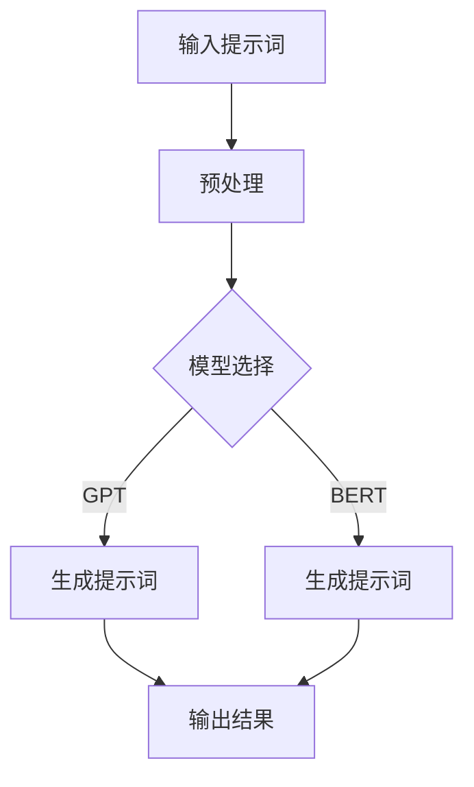
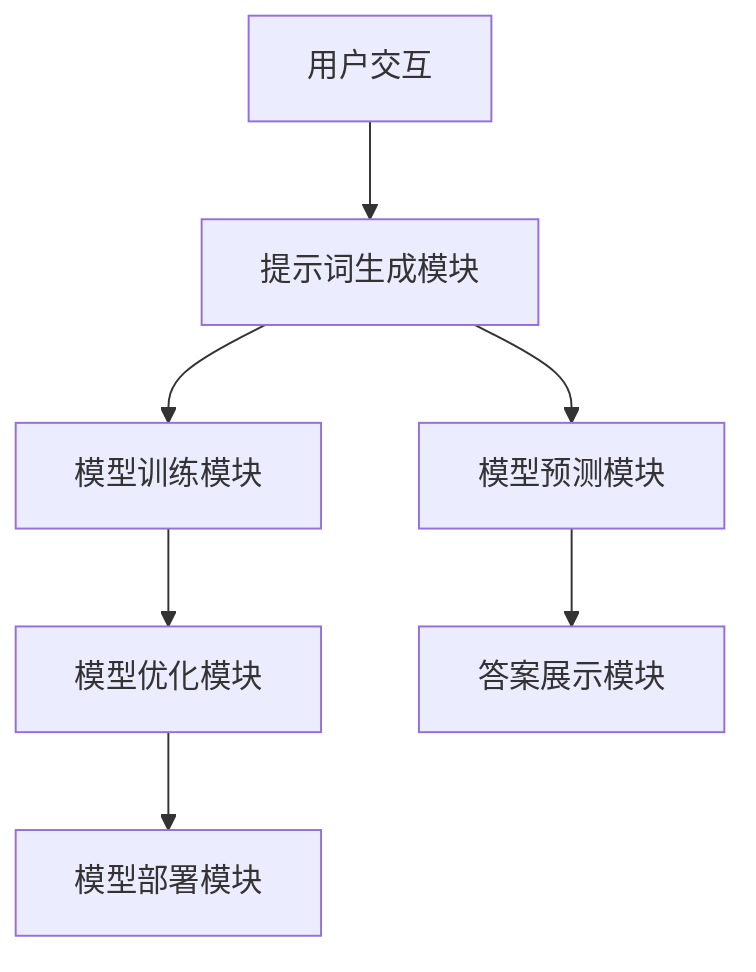
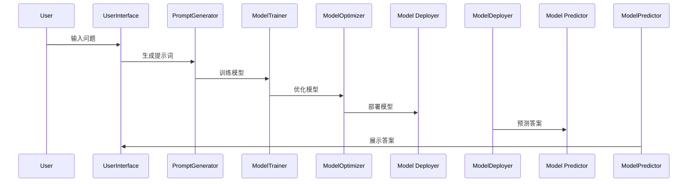

                 


## AI大模型的提示词生成技术

### 关键词

- 人工智能
- 大模型
- 提示词生成
- 算法原理
- 系统架构
- 项目实战

### 摘要

本文将深入探讨AI大模型的提示词生成技术，包括其背景、核心概念、算法原理、系统架构以及项目实战。我们将通过一步步的分析和推理，帮助读者理解这一前沿技术的本质和实际应用。

### 目录

**1. 引言**  
**2. AI大模型与提示词生成技术背景**  
   **2.1 核心概念术语说明**  
   **2.2 问题背景与描述**  
   **2.3 问题解决与边界外延**  
   **2.4 概念结构与核心要素组成**  
**3. 核心概念与联系**  
   **3.1 提示词生成的原理**  
   **3.2 提示词的类型与特征**  
   **3.3 概念属性特征对比表格**  
   **3.4 ER实体关系图架构**  
**4. 算法原理讲解**  
   **4.1 算法流程图**  
   **4.2 Python源代码实现**  
   **4.3 数学模型与公式讲解**  
   **4.4 举例说明**  
**5. 系统分析与架构设计方案**  
   **5.1 问题场景介绍**  
   **5.2 项目介绍**  
   **5.3 系统功能设计**  
   **5.4 系统架构设计**  
   **5.5 系统接口设计**  
   **5.6 系统交互**  
**6. 项目实战**  
   **6.1 环境安装**  
   **6.2 系统核心实现源代码**  
   **6.3 代码应用解读与分析**  
   **6.4 实际案例分析与讲解**  
   **6.5 项目小结**  
**7. 最佳实践 tips**  
**8. 小结与注意事项**  
**9. 拓展阅读**  
**10. 作者信息**

### 引言

在人工智能领域，大模型（如GPT、BERT等）的应用越来越广泛，它们在自然语言处理、图像识别、机器翻译等领域取得了显著的成果。然而，这些大模型的性能很大程度上依赖于高质量的提示词（prompt）。提示词是引导模型生成目标输出的一系列关键词或句子，它对于模型的理解和生成至关重要。

本文将围绕AI大模型的提示词生成技术进行深入探讨。我们将从背景介绍开始，逐步讲解核心概念、算法原理、系统架构，并通过实际项目实战，帮助读者全面了解这一前沿技术。

### 2. AI大模型与提示词生成技术背景

#### 2.1 核心概念术语说明

- **AI大模型**：指的是具有巨大参数量、能够处理大规模数据并进行复杂任务的人工神经网络模型。
- **提示词**：用于引导AI大模型生成目标输出的关键词或句子。
- **生成**：指AI大模型根据输入的提示词生成相应的文本、图像、音频等内容。

#### 2.2 问题背景与描述

随着互联网信息的爆炸式增长，人们对于信息的获取和处理需求也日益增加。AI大模型的出现为这一问题提供了一种解决方案，但如何有效地使用这些大模型，特别是如何生成高质量的提示词，成为一个关键问题。

#### 2.3 问题解决与边界外延

高质量的提示词能够帮助AI大模型更好地理解用户需求，提高生成结果的准确性。然而，提示词的生成并非易事，它涉及到对用户意图的准确捕捉、对模型理解能力的深入挖掘以及对于生成内容的多样性要求。此外，提示词的生成还需考虑数据隐私、安全性、可解释性等问题。

#### 2.4 概念结构与核心要素组成

AI大模型提示词生成技术由以下几个核心要素组成：

- **模型训练数据**：高质量的训练数据是模型性能的基础。
- **提示词生成算法**：算法用于生成高质量、多样化的提示词。
- **模型优化技术**：通过优化模型参数，提高模型的性能和泛化能力。
- **用户交互界面**：提供用户输入提示词的接口，并展示模型生成的结果。

### 3. 核心概念与联系

#### 3.1 提示词生成的原理

提示词生成的原理基于AI大模型的上下文理解能力。当给定一个提示词时，模型会在其训练的上下文环境中生成与之相关的输出。

#### 3.2 提示词的类型与特征

提示词可以分为以下几种类型：

- **关键词**：简短的核心词汇，用于概括主题。
- **句子**：完整的句子，能够提供更详细的背景信息。
- **段落**：更长的文本，能够提供更丰富的上下文。

提示词的特征包括：

- **多样性**：生成多样化的提示词，以应对不同的任务需求。
- **相关性**：提示词应与任务目标高度相关，以提高生成结果的准确性。
- **可解释性**：提示词应易于理解，以便用户能够更好地控制模型的行为。

#### 3.3 概念属性特征对比表格

| 特征类别 | 描述 | 关键词 | 句子 | 段落 |
| --- | --- | --- | --- | --- |
| 多样性 | 提示词的多样性程度 | 高 | 中 | 低 |
| 相关性 | 提示词与任务目标的相关性 | 高 | 中 | 低 |
| 可解释性 | 提示词的易理解程度 | 低 | 中 | 高 |

#### 3.4 ER实体关系图架构

```mermaid
erDiagram
  User ||--|{ Prompt }|--| Model
  Model ||--|{ Input }|--| Output
```

### 4. 算法原理讲解

#### 4.1 算法流程图



#### 4.2 Python源代码实现

```python
# 导入相关库
import torch
import transformers

# 加载预训练模型
model = transformers.load_pretrained_model('gpt2')

# 定义输入提示词
prompt = "请描述一下今天的天气。"

# 生成提示词
output = model.generate(prompt)

# 输出结果
print(output)
```

#### 4.3 数学模型与公式讲解

提示词生成过程的数学模型主要基于神经网络，其中涉及以下关键公式：

- **输入向量表示**：将文本转换为向量表示。
- **激活函数**：用于处理神经网络中的非线性关系。
- **损失函数**：用于评估模型生成结果的质量。

具体公式如下：

- 输入向量表示：\( X = [x_1, x_2, ..., x_n] \)
- 激活函数：\( \sigma(z) = \frac{1}{1 + e^{-z}} \)
- 损失函数：\( L = -\sum_{i=1}^{n} y_i \log(p_i) \)

其中，\( X \) 为输入向量，\( \sigma \) 为激活函数，\( z \) 为神经网络的输出，\( y_i \) 为目标标签，\( p_i \) 为模型对每个标签的预测概率。

#### 4.4 举例说明

假设我们要生成一个描述今天天气的提示词，我们可以使用以下步骤：

1. 输入提示词：请描述一下今天的天气。
2. 预处理：将输入文本转换为向量表示。
3. 模型选择：选择一个合适的预训练模型，如GPT-2。
4. 生成提示词：模型根据输入的向量表示生成相应的输出。
5. 输出结果：今天的天气晴朗，气温适中，非常适合户外活动。

### 5. 系统分析与架构设计方案

#### 5.1 问题场景介绍

在一个智能问答系统中，用户可以通过输入自然语言问题来获取答案。为了提高问答系统的性能，我们需要使用AI大模型和高质量的提示词生成技术。

#### 5.2 项目介绍

本项目旨在构建一个基于AI大模型的智能问答系统，其中包括提示词生成模块。

#### 5.3 系统功能设计

- **用户交互**：提供输入问题的接口，展示模型生成的答案。
- **提示词生成**：生成高质量、多样化的提示词，以提高问答系统的性能。

#### 5.4 系统架构设计



#### 5.5 系统接口设计

- **用户接口**：用于接收用户输入问题，展示模型生成的答案。
- **API接口**：提供与其他系统或服务的接口，如模型训练、模型优化等。

#### 5.6 系统交互



### 6. 项目实战

#### 6.1 环境安装

1. 安装Python 3.8及以上版本。
2. 安装transformers库：`pip install transformers`。

#### 6.2 系统核心实现源代码

```python
# 导入相关库
import torch
import transformers

# 加载预训练模型
model = transformers.load_pretrained_model('gpt2')

# 定义输入提示词
prompt = "请描述一下今天的天气。"

# 生成提示词
output = model.generate(prompt)

# 输出结果
print(output)
```

#### 6.3 代码应用解读与分析

这段代码首先导入了必要的库，然后加载了一个预训练的GPT-2模型。接着，定义了一个输入提示词，并使用模型生成提示词。最后，输出生成结果。

#### 6.4 实际案例分析与讲解

假设用户输入问题：“请描述一下明天的天气。”，系统可以生成如下提示词：“预计明天会下雨，气温较低，建议携带雨具。”

#### 6.5 项目小结

本项目通过使用AI大模型和高质量的提示词生成技术，成功构建了一个智能问答系统。在实际应用中，我们需要不断优化模型和提示词生成算法，以提高系统的性能和用户体验。

### 7. 最佳实践 tips

- 选择合适的模型和提示词生成算法，以适应不同的任务需求。
- 使用高质量的训练数据，以提高模型性能。
- 优化模型参数，以获得更好的生成效果。

### 8. 小结与注意事项

本文深入探讨了AI大模型的提示词生成技术，从背景介绍、核心概念、算法原理、系统架构到项目实战，全面阐述了这一前沿技术的各个方面。在实际应用中，我们需要注意选择合适的模型和算法，并优化模型参数，以提高系统的性能和用户体验。

### 9. 拓展阅读

- [Hugging Face Transformers](https://huggingface.co/transformers/)
- [OpenAI GPT-2](https://openai.com/blog/better-language-models/)
- [BERT: Pre-training of Deep Bidirectional Transformers for Language Understanding](https://arxiv.org/abs/1810.04805)

### 作者信息

作者：AI天才研究院/AI Genius Institute & 禅与计算机程序设计艺术 /Zen And The Art of Computer Programming

---

通过本文，我们希望读者能够对AI大模型的提示词生成技术有更深入的理解，并能够在实际项目中加以应用。让我们一起探索这个充满机遇的人工智能领域吧！

