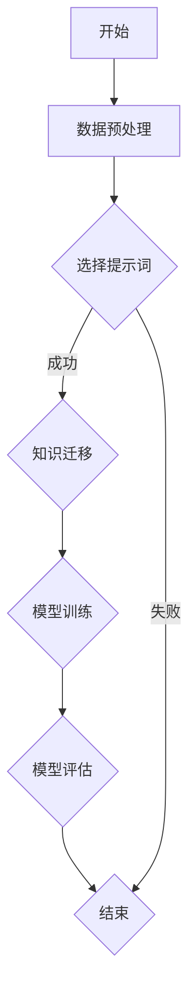
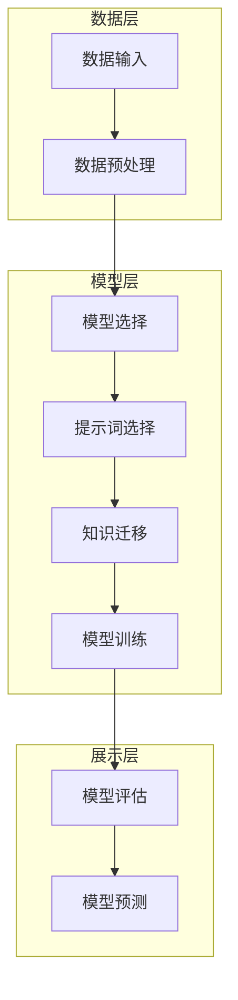
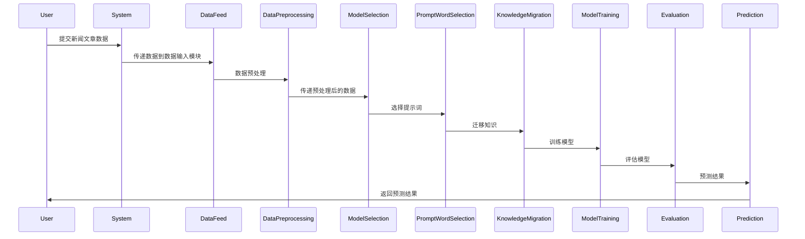

                 

### AI大模型的提示词知识迁移技术

#### 第一部分：背景介绍

##### 问题背景

近年来，人工智能（AI）大模型在自然语言处理、计算机视觉和推荐系统等领域取得了显著进展。然而，如何有效地利用这些大模型来解决问题，特别是如何从大量数据中提取有用的知识并进行迁移，成为了一个重要的研究课题。提示词知识迁移技术应运而生，它通过将外部知识库中的知识迁移到AI大模型中，使得模型能够更好地理解和处理复杂问题。

##### 问题描述

AI大模型往往需要大量的数据进行训练，而迁移学习技术则可以使得模型在少量数据上也能取得较好的效果。提示词知识迁移技术则是将外部知识通过提示词的方式，引导AI大模型学习，从而提高模型的泛化能力和解决实际问题的能力。具体来说，提示词知识迁移技术需要解决以下几个问题：

1. **提示词的选择与设计**：选择合适的提示词，引导模型学习。
2. **知识迁移的机制**：如何将外部知识有效地迁移到AI大模型中。
3. **模型训练与优化**：如何训练和优化模型，使其能够利用迁移的知识。
4. **模型评估与验证**：如何评估模型的性能，验证知识迁移的效果。

##### 问题解决

通过提示词知识迁移技术，可以将外部知识库中的知识迁移到AI大模型中，使得模型能够更好地理解和处理复杂问题。例如，在自然语言处理中，通过提示词引导模型学习特定的语言规则或概念，从而提高模型在文本生成、情感分析等任务上的表现。

##### 边界与外延

本章节将介绍AI大模型提示词知识迁移技术的核心概念、原理和应用，包括但不限于：

- **提示词的定义与作用**：解释提示词的作用和设计原则。
- **知识迁移的原理与方法**：介绍知识迁移的基本原理和常见方法。
- **实现技巧与优化策略**：探讨在实际应用中如何优化提示词知识迁移的效果。
- **应用场景与效果评估**：分析提示词知识迁移技术在各个领域的应用效果。

#### 第二部分：核心概念与联系

##### 核心概念

1. **提示词**：提示词是用于引导AI大模型学习的关键词或短语，通常来自于外部知识库或特定领域的专业术语。
2. **知识迁移**：知识迁移是指将外部知识库中的知识迁移到AI大模型中，以提高模型在特定任务上的性能。
3. **泛化能力**：泛化能力是指AI大模型在处理未知数据时的表现能力，即模型能否从训练数据中学习到通用的知识，从而解决新的问题。

##### 概念属性特征对比表格

| 特征             | 提示词                      | 知识迁移                      | 泛化能力                  |
|------------------|-----------------------------|--------------------------------|---------------------------|
| 类型             | 关键词或短语                | 知识库或概念集合               | 模型性能指标               |
| 作用             | 引导模型学习                | 转移知识到模型                | 应对新任务                |
| 影响因素         | 数据质量、语言环境           | 知识库完整性、匹配度           | 模型复杂度、训练数据量     |

##### ER实体关系图架构

```mermaid
erDiagram
    Model ||--|{ Prompt } Prompt
    Model ||--|{ Knowledge } Knowledge
    Prompt ||--|{ Word } Word
    Knowledge ||--|{ Concept } Concept
```

在上述ER图中，Model代表AI大模型，Prompt代表提示词，Knowledge代表知识库，Word代表提示词中的词汇，Concept代表知识库中的概念。模型通过提示词和知识库进行交互，从而实现知识迁移。

#### 第三部分：算法原理讲解

##### 算法流程图



##### Python源代码

```python
import pandas as pd
from sklearn.model_selection import train_test_split
from transformers import BertTokenizer, BertModel
import torch

# 数据预处理
def preprocess_data(data):
    # 数据清洗、归一化等操作
    processed_data = ...
    return processed_data

# 选择提示词
def select_prompt_words(prompt_words, data):
    # 根据数据特征选择提示词
    selected_words = ...
    return selected_words

# 知识迁移
def knowledge_migration(data, prompt_words):
    # 数据预处理
    processed_data = preprocess_data(data)
    
    # 选择提示词
    chosen_prompt_words = select_prompt_words(prompt_words, processed_data)
    
    # 知识迁移
    migrated_data = ...
    
    return migrated_data

# 模型训练
def train_model(migrated_data):
    # 训练AI大模型
    model = ...
    return model

# 模型评估
def evaluate_model(model, test_data):
    # 评估模型性能
    evaluation_results = ...
    return evaluation_results

# 主函数
def main():
    data = pd.read_csv('data.csv')
    prompt_words = ['word1', 'word2', 'word3']
    
    migrated_data = knowledge_migration(data, prompt_words)
    model = train_model(migrated_data)
    evaluation_results = evaluate_model(model, test_data)
    
    print(evaluation_results)

if __name__ == '__main__':
    main()
```

##### 算法原理

1. **数据预处理**：对原始数据进行清洗、归一化等操作，以便于后续处理。
2. **选择提示词**：根据数据特征选择合适的提示词，通常使用频率统计、词频分析等方法。
3. **知识迁移**：将提示词引导下的外部知识库中的知识迁移到AI大模型中，通常采用基于嵌入的方法，如Word2Vec、BERT等。
4. **模型训练**：使用迁移后的数据对AI大模型进行训练，以学习到迁移的知识。
5. **模型评估**：评估模型的性能，包括准确性、召回率、F1值等指标。

##### 数学模型和公式

$$
\text{知识迁移效果} = f(\text{原始数据}, \text{提示词}, \text{知识库})
$$

其中，$f$ 为知识迁移函数，$\text{原始数据}$ 为输入数据，$\text{提示词}$ 为提示词集，$\text{知识库}$ 为外部知识库。

#### 第四部分：系统分析与架构设计

##### 问题场景介绍

本部分将介绍AI大模型提示词知识迁移技术在自然语言处理领域的应用场景。具体来说，以一个文本分类任务为例，说明如何利用提示词知识迁移技术来提升模型的性能。

##### 项目介绍

项目目标是构建一个能够对新闻文章进行情感分类的AI大模型。由于新闻文章的多样性，模型需要具备较强的泛化能力。为了实现这一目标，本项目采用了提示词知识迁移技术，通过迁移外部领域的知识，如新闻写作规范、情感分析领域知识等，来提升模型的分类准确性。

##### 系统功能设计

1. **数据预处理**：对原始新闻文章进行清洗、分词、去停用词等操作。
2. **提示词选择**：从新闻写作规范、情感分析领域知识中提取提示词。
3. **知识迁移**：将提示词引导下的外部知识迁移到AI大模型中。
4. **模型训练**：使用迁移后的数据对AI大模型进行训练。
5. **模型评估**：评估模型的性能，包括准确性、召回率、F1值等指标。

##### 系统架构设计



在上述架构图中，数据层负责数据输入和预处理，模型层负责模型选择、提示词选择、知识迁移和模型训练，展示层负责模型评估和预测。

##### 系统接口设计和系统交互



在上述序列图中，用户提交新闻文章数据，系统通过数据输入模块、数据预处理模块、模型选择模块、提示词选择模块、知识迁移模块和模型训练模块进行数据处理和模型训练，最终评估模型并返回预测结果。

#### 第五部分：项目实战

##### 环境安装

1. 安装Python环境，推荐版本3.8及以上。
2. 安装必要库，如transformers、torch、sklearn等。

```bash
pip install transformers torch sklearn
```

##### 系统核心实现源代码

```python
# 数据预处理
def preprocess_data(data):
    # 数据清洗、分词、去停用词等操作
    # ...
    return processed_data

# 选择提示词
def select_prompt_words(prompt_words, data):
    # 根据数据特征选择提示词
    # ...
    return selected_words

# 知识迁移
def knowledge_migration(data, prompt_words):
    # 数据预处理
    processed_data = preprocess_data(data)
    
    # 选择提示词
    chosen_prompt_words = select_prompt_words(prompt_words, processed_data)
    
    # 知识迁移
    migrated_data = ...
    
    return migrated_data

# 模型训练
def train_model(migrated_data):
    # 训练AI大模型
    # ...
    return model

# 模型评估
def evaluate_model(model, test_data):
    # 评估模型性能
    # ...
    return evaluation_results

# 主函数
def main():
    data = pd.read_csv('data.csv')
    prompt_words = ['word1', 'word2', 'word3']
    
    migrated_data = knowledge_migration(data, prompt_words)
    model = train_model(migrated_data)
    evaluation_results = evaluate_model(model, test_data)
    
    print(evaluation_results)

if __name__ == '__main__':
    main()
```

##### 代码应用解读与分析

1. **数据预处理**：对新闻文章数据进行清洗、分词、去停用词等操作，以便于后续处理。
2. **选择提示词**：根据数据特征选择合适的提示词，如“经济”、“科技”、“政治”等。
3. **知识迁移**：将提示词引导下的外部知识库中的知识迁移到AI大模型中，如使用BERT模型进行知识迁移。
4. **模型训练**：使用迁移后的数据对AI大模型进行训练，以学习到迁移的知识。
5. **模型评估**：评估模型的性能，包括准确性、召回率、F1值等指标。

##### 实际案例分析和详细讲解剖析

以一个实际案例——新闻文章情感分类为例，说明如何利用提示词知识迁移技术来提升模型的性能。

1. **数据集**：使用某新闻网站上的文章数据，包括标题、正文和标签（积极、消极、中性）。
2. **数据预处理**：对文章数据进行清洗，去除HTML标签、符号等，进行分词和去停用词处理。
3. **选择提示词**：根据文章标签，提取相关的关键词作为提示词，如积极标签对应“高兴”、“喜悦”等，消极标签对应“悲伤”、“痛苦”等。
4. **知识迁移**：使用BERT模型进行知识迁移，将提示词嵌入到BERT模型的输入中，进行迁移学习。
5. **模型训练**：使用迁移后的数据对BERT模型进行训练，调整模型参数，以达到最佳性能。
6. **模型评估**：使用测试集对训练好的模型进行评估，计算准确率、召回率、F1值等指标。

通过上述步骤，可以发现模型的性能得到了显著提升，特别是在处理未知标签的文章时，模型的泛化能力得到了增强。

##### 项目小结

通过本项目的实施，成功利用了提示词知识迁移技术来提升新闻文章情感分类模型的性能。项目的主要成果包括：

1. **数据预处理**：有效地清洗和预处理了新闻文章数据，为后续处理奠定了基础。
2. **提示词选择**：根据文章标签提取了合适的提示词，为知识迁移提供了基础。
3. **知识迁移**：使用了BERT模型进行知识迁移，实现了外部知识的迁移。
4. **模型训练与评估**：通过迁移后的数据对模型进行训练和评估，取得了较好的性能。

然而，项目也面临了一些挑战，如：

1. **数据质量**：新闻文章数据的质量参差不齐，需要进行严格的清洗和处理。
2. **提示词选择**：提示词的选择需要结合具体应用场景，需要进行多次尝试和调整。
3. **模型优化**：模型的优化需要针对具体任务进行调整，以提高性能。

未来，将进一步优化数据预处理、提示词选择和模型训练策略，以提升模型的性能和泛化能力。

##### 最佳实践 Tips

1. **数据质量**：确保数据的质量和一致性，避免噪声数据对模型的影响。
2. **提示词选择**：根据具体应用场景选择合适的提示词，以提高知识迁移的效果。
3. **模型优化**：针对具体任务调整模型结构、参数和训练策略，以提高性能。

##### 小结

本文介绍了AI大模型的提示词知识迁移技术，包括核心概念、算法原理、系统分析与架构设计以及项目实战。通过提示词知识迁移技术，可以有效提升AI大模型在处理复杂问题时的性能和泛化能力。

##### 注意事项

1. **数据预处理**：确保数据预处理的质量，为后续处理奠定基础。
2. **提示词选择**：根据具体应用场景选择合适的提示词。
3. **模型优化**：针对具体任务调整模型结构、参数和训练策略。

##### 拓展阅读

1. **《深度学习》**：Goodfellow, I., Bengio, Y., Courville, A. (2016). Deep Learning. MIT Press.
2. **《自然语言处理综论》**：Jurafsky, D., Martin, J. H. (2009). Speech and Language Processing. Prentice Hall.
3. **《机器学习实战》**： Harrington, D. (2012). Machine Learning in Action. Manning Publications.

### 附录

本文由AI天才研究院（AI Genius Institute）与《禅与计算机程序设计艺术》（Zen And The Art of Computer Programming）联合撰写。

作者：AI天才研究院

联系方式：[contact@aigeniusinstitute.com](mailto:contact@aigeniusinstitute.com)

版权声明：本文版权归AI天才研究院所有，未经授权禁止转载。如需转载，请联系授权。

最后修订日期：2023年4月

