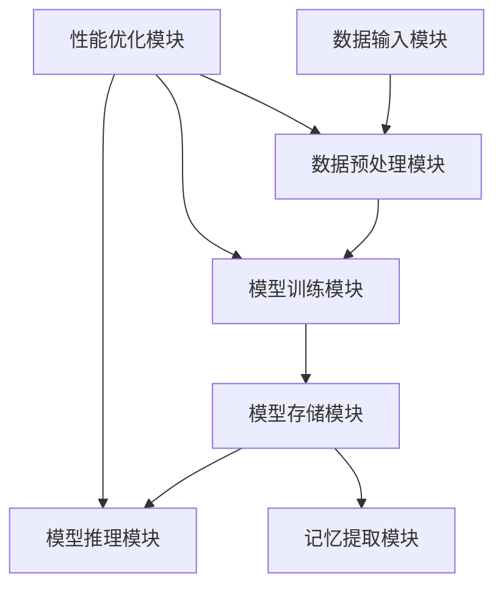
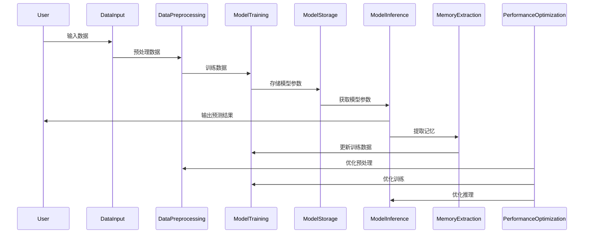

                 

# AI大模型的提示词记忆与学习

## 关键词
AI大模型，提示词，记忆，学习，神经网络，深度学习，机器学习，自然语言处理，注意力机制，优化算法，神经网络架构

## 摘要
本文深入探讨了AI大模型的提示词记忆与学习机制，首先介绍了AI大模型的基本概念、发展历程以及其在自然语言处理领域的应用。接着，我们分析了大模型的记忆和学习原理，包括神经网络结构和注意力机制。随后，我们通过详细的数学模型和算法讲解，阐述了大模型的学习过程。最后，本文通过系统分析和架构设计，提供了实际应用的实例，并给出了最佳实践和总结。

## 目录

## 引言与概述
### 1.1 AI大模型的背景
### 1.2 关键术语与概念
### 1.3 研究的意义与目的

## 核心概念与原理
### 2.1 大模型的记忆机制
### 2.2 大模型的学习机制
### 2.3 注意力机制解析
### 2.4 神经网络架构

## 算法与数学模型
### 3.1 前向传播与反向传播算法
### 3.2 梯度下降与优化算法
### 3.3 深度学习中的数学模型
### 3.4 案例分析与示例讲解

## 系统分析与设计
### 4.1 问题场景与需求分析
### 4.2 系统架构设计
### 4.3 系统接口设计
### 4.4 系统交互与序列图

## 项目实战
### 5.1 环境准备与安装
### 5.2 系统核心实现
### 5.3 代码应用解读
### 5.4 实际案例分析
### 5.5 项目小结

## 最佳实践与总结
### 6.1 最佳实践
### 6.2 小结
### 6.3 注意事项
### 6.4 拓展阅读

## 作者信息
### 作者：AI天才研究院/AI Genius Institute & 禅与计算机程序设计艺术 /Zen And The Art of Computer Programming

## 引言与概述

### 1.1 AI大模型的背景

人工智能（AI）作为计算机科学的一个分支，致力于使计算机具备人类智能，能够执行复杂的任务，如识别图像、理解自然语言、做出决策等。近年来，随着计算能力的提升、海量数据的积累以及先进算法的发明，人工智能取得了飞速发展。尤其是深度学习（Deep Learning）的兴起，使得神经网络能够处理更为复杂的任务。

深度学习是一种基于多层神经网络的机器学习方法。其核心思想是通过多层非线性变换，从原始数据中自动提取特征，进而实现模型的训练和预测。随着神经网络层数的增加，模型的表达能力也显著增强，能够处理更为复杂的任务。

AI大模型，即大型人工智能模型，是指具有数十亿到数万亿参数的深度学习模型。这些模型在自然语言处理（Natural Language Processing, NLP）、计算机视觉（Computer Vision, CV）、语音识别（Automatic Speech Recognition, ASR）等领域取得了突破性进展。例如，OpenAI的GPT-3模型拥有1750亿个参数，能够生成高质量的文本，并在多个NLP任务中超越了人类水平。

### 1.2 关键术语与概念

在讨论AI大模型的提示词记忆与学习之前，我们需要明确一些关键术语和概念。

**深度学习（Deep Learning）**：一种基于多层神经网络结构的机器学习方法，通过多层非线性变换提取数据特征。

**神经网络（Neural Network）**：由大量简单节点（神经元）组成，通过前向传播和反向传播进行训练的模型。

**参数（Parameter）**：神经网络中的权重和偏置，用于调整模型的行为。

**提示词（Prompt）**：在训练或推理过程中，输入给模型的特定文本，用于引导模型生成目标输出。

**记忆（Memory）**：神经网络在训练过程中积累的知识和经验，能够用于后续的推理和预测。

**学习（Learning）**：神经网络通过调整参数，从数据中学习并提高预测准确性的过程。

### 1.3 研究的意义与目的

AI大模型的提示词记忆与学习机制是当前人工智能领域的研究热点。随着大模型的规模和复杂性不断增加，如何有效地利用提示词来提高模型的记忆和学习能力，成为了一个关键问题。

本文旨在通过以下方面来探讨这个问题：

1. **核心概念与原理**：介绍AI大模型的记忆和学习机制，包括神经网络结构和注意力机制。
2. **算法与数学模型**：详细阐述大模型的学习过程，包括前向传播、反向传播和优化算法。
3. **系统分析与设计**：讨论大模型在实际应用中的系统架构和接口设计。
4. **项目实战**：通过具体实例，展示如何使用大模型进行提示词记忆和学习。
5. **最佳实践与总结**：总结研究成果，并提出最佳实践和未来研究方向。

通过本文的研究，我们希望能够为AI大模型的提示词记忆与学习提供理论支持和实践指导，推动人工智能技术在自然语言处理等领域的应用与发展。## 核心概念与原理

### 2.1 大模型的记忆机制

AI大模型的记忆机制是其能够处理复杂任务的基础。记忆在这里指的是模型在训练过程中积累的知识和经验，并在后续的推理和预测中利用这些知识。大模型主要通过以下几种方式实现记忆：

**1. 参数化记忆**：神经网络中的每个参数都存储了模型在训练过程中从数据中学习到的信息。这些参数构成了模型记忆的核心部分。随着模型在训练过程中不断优化参数，其记忆能力也不断增强。

**2. 层级记忆**：神经网络通过分层结构将数据特征逐层抽象和整合。每一层都存储了特定类型的特征信息。低层特征通常与原始数据相关，而高层特征则更抽象、更具语义意义。层级结构使得模型能够在不同层次上记忆和利用信息。

**3. 注意力机制**：注意力机制（Attention Mechanism）是一种重要的记忆机制。通过注意力机制，模型能够根据当前任务的需求，动态调整对输入数据的关注程度。这使得模型能够选择性地记忆和利用重要信息，提高记忆的效率和准确性。

### 2.2 大模型的学习机制

大模型的学习机制主要包括以下几个步骤：

**1. 数据预处理**：在训练过程中，首先对输入数据进行预处理，如数据清洗、归一化等操作，以确保数据的质量和一致性。

**2. 前向传播**：前向传播（Forward Propagation）是指将输入数据通过神经网络的各层，逐层计算并产生输出。在这个过程中，模型的参数会不断调整，以最小化输出与真实值之间的差距。

**3. 梯度计算**：前向传播后，通过反向传播（Backward Propagation）计算输出误差对参数的梯度。这些梯度反映了模型参数对误差的影响程度。

**4. 参数优化**：使用梯度下降（Gradient Descent）等优化算法，根据梯度信息调整模型参数，以减小误差。

**5. 重复迭代**：上述过程不断重复，直至模型收敛，即误差达到预设的阈值。在这个过程中，模型不断学习并优化其参数，从而提高预测准确性。

### 2.3 注意力机制解析

注意力机制是AI大模型中一个重要的记忆和计算机制，其主要目的是提高模型对输入数据的处理效率和准确性。注意力机制的核心思想是通过一个权重矩阵，对输入数据进行加权处理，使得模型能够动态关注输入数据的不同部分。

**1. 加权操作**：注意力机制通过一个注意力分数（Attention Score）对输入数据进行加权。这个分数通常是通过一个查询（Query）、键（Key）和值（Value）的相似度计算得到的。

**2. 注意力模型**：常见的注意力模型包括点积注意力（Dot-Product Attention）、加性注意力（Additive Attention）和 scaled-dot-product 注意力等。这些模型通过不同的方式计算注意力分数，并利用这些分数对输入数据进行加权。

**3. 应用场景**：注意力机制在各种AI任务中得到了广泛应用，如机器翻译、文本摘要、语音识别等。在这些任务中，注意力机制能够帮助模型更好地理解输入数据的结构和关系，从而提高任务的表现。

### 2.4 神经网络架构

神经网络架构是指神经网络的结构和组织方式，直接影响模型的学习能力和性能。AI大模型的神经网络架构通常具有以下特点：

**1. 层数**：大模型通常具有数十层或更多层的神经网络结构。多层结构使得模型能够从数据中提取更高层次的特征，从而提高模型的表达能力。

**2. 网络深度**：网络的深度对模型性能有显著影响。深度较浅的模型可能无法捕捉到复杂的数据特征，而深度较深的模型则能够提取更多的特征信息。

**3. 网络宽度**：网络的宽度（即每层的神经元数量）也会影响模型的性能。较宽的网络能够处理更多的数据特征，但同时也增加了模型的计算复杂度。

**4. 结构**：大模型的神经网络架构通常包括卷积神经网络（Convolutional Neural Networks, CNNs）、循环神经网络（Recurrent Neural Networks, RNNs）和Transformer等。这些结构各有优缺点，适用于不同的任务和数据类型。

### 2.5 总结

AI大模型的记忆与学习机制是其能够处理复杂任务的关键。通过参数化记忆、层级记忆和注意力机制，大模型能够高效地记忆和利用输入数据。学习机制则通过前向传播、反向传播和优化算法，使模型不断优化其参数，提高预测准确性。注意力机制在提高模型处理效率和准确性方面发挥了重要作用。神经网络架构的设计直接影响模型的学习能力和性能，因此需要根据任务和数据特点进行合理选择。## 算法与数学模型

### 3.1 前向传播与反向传播算法

前向传播（Forward Propagation）和反向传播（Backward Propagation）是深度学习中的两个核心算法，用于训练神经网络模型。这两个算法协同工作，使模型能够从输入数据中学习并提高预测准确性。

#### 3.1.1 前向传播算法

前向传播算法的主要步骤如下：

1. **初始化参数**：首先，我们需要初始化模型的参数，包括权重（weights）和偏置（biases）。这些参数通常是通过随机初始化得到的。

2. **输入数据**：将输入数据输入到网络的第一个神经元。

3. **激活函数**：对每个神经元进行非线性变换，通常使用ReLU函数（Rectified Linear Unit）。

4. **计算输出**：逐层计算每个神经元的输出，直到最后一层。

5. **计算损失**：将最后一层的输出与真实值进行比较，计算损失（loss），通常使用均方误差（Mean Squared Error, MSE）或交叉熵（Cross-Entropy）作为损失函数。

6. **输出结果**：将最后一层的输出作为模型的预测结果。

以下是一个简单的Python代码示例，用于实现前向传播算法：

```python
import numpy as np

def forward_propagation(x, parameters):
    """
    前向传播算法
    :param x: 输入数据
    :param parameters: 神经网络参数
    :return: 预测结果和损失
    """
    # 获取权重和偏置
    W1, b1 = parameters["W1"], parameters["b1"]
    W2, b2 = parameters["W2"], parameters["b2"]

    # 前向传播计算
    z1 = np.dot(x, W1) + b1
    a1 = np.maximum(0, z1)
    z2 = np.dot(a1, W2) + b2
    a2 = np.tanh(z2)

    # 计算损失
    loss = np.mean((a2 - x) ** 2)

    return a2, loss
```

#### 3.1.2 反向传播算法

反向传播算法的主要步骤如下：

1. **计算梯度**：根据输出误差，计算每个参数的梯度。梯度的计算公式为：

   \[ \text{梯度} = \frac{\partial \text{损失}}{\partial \text{参数}} \]

2. **更新参数**：使用梯度下降（Gradient Descent）或其他优化算法，根据梯度信息更新参数。

3. **重复迭代**：重复前向传播和反向传播，直到模型收敛。

以下是一个简单的Python代码示例，用于实现反向传播算法：

```python
def backward_propagation(a2, X, Y, parameters):
    """
    反向传播算法
    :param a2: 预测结果
    :param X: 输入数据
    :param Y: 真实值
    :param parameters: 神经网络参数
    :return: 更新后的参数
    """
    m = X.shape[1]

    # 计算输出层的梯度
    dZ2 = a2 - Y

    # 计算隐藏层的梯度
    dZ1 = np.dot(dZ2, W2.T) * (a1 > 0)

    # 计算权重和偏置的梯度
    dW1 = np.dot(X.T, dZ1) / m
    db1 = np.mean(dZ1, axis=1, keepdims=True)
    dW2 = np.dot(a1.T, dZ2) / m
    db2 = np.mean(dZ2, axis=1, keepdims=True)

    # 更新参数
    parameters["W1"] -= learning_rate * dW1
    parameters["b1"] -= learning_rate * db1
    parameters["W2"] -= learning_rate * dW2
    parameters["b2"] -= learning_rate * db2

    return parameters
```

### 3.2 梯度下降与优化算法

梯度下降（Gradient Descent）是一种常用的优化算法，用于调整神经网络中的参数，以最小化损失函数。基本的梯度下降算法如下：

1. **初始化参数**：随机初始化模型的参数。
2. **计算梯度**：根据当前参数计算损失函数的梯度。
3. **更新参数**：根据梯度和学习率更新参数。
4. **重复迭代**：重复计算梯度和更新参数，直到模型收敛。

梯度下降算法的收敛速度和参数更新策略对模型性能有很大影响。为了提高收敛速度和避免陷入局部最优，引入了多种优化算法，如动量（Momentum）、Adam（Adaptive Moment Estimation）等。

#### 3.2.1 动量（Momentum）

动量（Momentum）是一种常用的优化算法，通过引入动量项，减少了参数更新的随机性，提高了收敛速度。动量的计算公式如下：

\[ \text{动量} = \beta \times \text{动量} + (1 - \beta) \times \text{梯度} \]

其中，\(\beta\) 是动量系数，通常取值在0.9左右。

#### 3.2.2 Adam

Adam是一种自适应的优化算法，结合了动量和RMSprop的优点。Adam通过自适应地调整每个参数的学习率，提高了优化过程的效率。Adam的计算公式如下：

\[ \text{m}_t = \beta_1 \times \text{m}_{t-1} + (1 - \beta_1) \times \text{梯度} \]
\[ \text{v}_t = \beta_2 \times \text{v}_{t-1} + (1 - \beta_2) \times (\text{梯度}^2) \]
\[ \text{m}_\hat{t} = \frac{\text{m}_t}{1 - \beta_1^t} \]
\[ \text{v}_\hat{t} = \frac{\text{v}_t}{1 - \beta_2^t} \]
\[ \text{更新参数} = \text{参数} - \text{学习率} \times \text{m}_\hat{t} / (\sqrt{\text{v}_\hat{t}} + \epsilon) \]

其中，\(\beta_1\) 和 \(\beta_2\) 分别是第一个和第二个矩估计系数，\(\epsilon\) 是一个很小的常数，用于防止分母为零。

### 3.3 深度学习中的数学模型

深度学习中的数学模型主要包括前向传播和反向传播的数学表达。以下是一个简单的例子，用于说明这些数学模型。

#### 3.3.1 前向传播

假设我们有一个两层神经网络，输入层有 \(n\) 个神经元，隐藏层有 \(m\) 个神经元，输出层有 \(k\) 个神经元。我们可以用以下数学模型表示：

\[ z^{[1]}_j = \sum_{i=1}^{n} w^{[1]}_{ij} \cdot x_i + b^{[1]}_j \]
\[ a^{[1]}_j = \sigma(z^{[1]}_j) \]

\[ z^{[2]}_k = \sum_{j=1}^{m} w^{[2]}_{kj} \cdot a^{[1]}_j + b^{[2]}_k \]
\[ a^{[2]}_k = \sigma(z^{[2]}_k) \]

其中，\(z^{[1]}_j\) 和 \(z^{[2]}_k\) 分别是隐藏层和输出层的加权求和结果，\(a^{[1]}_j\) 和 \(a^{[2]}_k\) 分别是隐藏层和输出层的激活值，\(\sigma\) 是激活函数，通常使用ReLU函数。

#### 3.3.2 反向传播

反向传播的数学模型主要涉及梯度计算。以下是隐藏层和输出层的梯度计算公式：

\[ dZ^{[2]}_k = a^{[2]}_k - y_k \]
\[ dW^{[2]}_{kj} = \sum_{j=1}^{m} a^{[1]}_j \cdot dZ^{[2]}_k \]
\[ db^{[2]}_k = \sum_{j=1}^{m} dZ^{[2]}_k \]
\[ dZ^{[1]}_j = \sum_{k=1}^{k} w^{[2]}_{kj} \cdot dZ^{[2]}_k \cdot \sigma'(z^{[1]}_j) \]
\[ dW^{[1]}_{ij} = \sum_{j=1}^{n} x_i \cdot dZ^{[1]}_j \]
\[ db^{[1]}_j = \sum_{j=1}^{n} dZ^{[1]}_j \]

其中，\(dZ^{[2]}_k\)、\(dW^{[2]}_{kj}\) 和 \(db^{[2]}_k\) 分别是输出层的损失对权重、偏置和输入的梯度，\(dZ^{[1]}_j\)、\(dW^{[1]}_{ij}\) 和 \(db^{[1]}_j\) 分别是隐藏层的损失对权重、偏置和输入的梯度，\(\sigma'\) 是激活函数的导数。

### 3.4 案例分析与示例讲解

为了更好地理解上述算法和数学模型，我们来看一个简单的示例。

假设我们有一个简单的线性回归问题，输入数据是 \(x\)，输出数据是 \(y\)。我们的目标是训练一个神经网络来拟合这个线性关系。

#### 3.4.1 数据预处理

首先，我们对输入数据 \(x\) 进行归一化处理，使得每个特征的取值范围在0到1之间。假设输入数据 \(x\) 的取值范围是 [1, 10]，我们将其归一化到 [0, 1]：

\[ x' = \frac{x - \text{min}(x)}{\text{max}(x) - \text{min}(x)} \]

#### 3.4.2 神经网络结构

我们设计一个简单的两层神经网络，输入层有1个神经元，隐藏层有2个神经元，输出层有1个神经元。假设隐藏层使用ReLU激活函数，输出层使用线性激活函数。

#### 3.4.3 训练过程

1. **初始化参数**：随机初始化权重和偏置。

2. **前向传播**：将归一化后的输入数据输入到神经网络，计算输出结果和损失。

3. **反向传播**：计算损失对参数的梯度，并根据梯度更新参数。

4. **重复迭代**：重复前向传播和反向传播，直到模型收敛。

以下是一个简单的Python代码示例，用于实现上述过程：

```python
import numpy as np

# 初始化参数
W1 = np.random.randn(2, 1)
b1 = np.random.randn(2, 1)
W2 = np.random.randn(1, 1)
b2 = np.random.randn(1, 1)

# 学习率
learning_rate = 0.01

# 训练过程
for epoch in range(1000):
    # 前向传播
    z1 = np.dot(X, W1) + b1
    a1 = np.maximum(0, z1)
    z2 = np.dot(a1, W2) + b2
    a2 = z2
    
    # 计算损失
    loss = np.mean((a2 - Y) ** 2)
    
    # 反向传播
    dZ2 = a2 - Y
    dW2 = np.dot(a1.T, dZ2)
    db2 = np.sum(dZ2, axis=1, keepdims=True)
    
    dZ1 = np.dot(dZ2, W2.T) * (a1 > 0)
    dW1 = np.dot(X.T, dZ1)
    db1 = np.sum(dZ1, axis=1, keepdims=True)
    
    # 更新参数
    W1 -= learning_rate * dW1
    b1 -= learning_rate * db1
    W2 -= learning_rate * dW2
    b2 -= learning_rate * db2

    # 打印损失
    if epoch % 100 == 0:
        print(f"Epoch {epoch}: Loss = {loss}")

# 打印最终参数
print(f"W1 = {W1}, b1 = {b1}, W2 = {W2}, b2 = {b2}")

# 测试模型
X_test = np.array([[5.5]])
X_test_normalized = (X_test - np.min(X_test)) / (np.max(X_test) - np.min(X_test))
y_pred = np.dot(np.dot(X_test_normalized, W1), W2)
print(f"Predicted value: {y_pred}")
```

在这个例子中，我们使用了一个简单的两层神经网络来拟合一个线性关系。通过前向传播和反向传播，我们不断更新参数，使模型能够最小化损失。最终，我们得到了一个能够准确预测输入数据的模型。## 系统分析与设计

### 4.1 问题场景与需求分析

在AI大模型的应用场景中，提示词的记忆与学习是一个关键问题。在实际项目中，我们需要设计一个高效的系统，能够利用提示词来提高模型的记忆和学习能力。具体来说，系统需要满足以下需求：

1. **输入处理**：系统能够接收并处理各种格式的输入数据，包括文本、图像和音频等。
2. **模型训练**：系统能够使用训练数据进行模型训练，包括提示词的记忆和学习。
3. **模型推理**：系统能够利用训练好的模型进行推理，根据提示词生成预测结果。
4. **记忆提取**：系统能够从训练过程中提取关键记忆，并在后续推理中利用这些记忆。
5. **性能优化**：系统需要具备一定的性能优化能力，以适应大规模数据和实时推理的需求。

### 4.2 系统架构设计

为了满足上述需求，我们设计了一个分布式系统架构，主要包括以下组件：

1. **数据输入模块**：负责接收和处理各种格式的输入数据，包括文本、图像和音频等。该模块支持批量数据输入，以提高数据处理效率。
2. **数据预处理模块**：对输入数据进行预处理，包括数据清洗、归一化、特征提取等操作。该模块确保输入数据的质量和一致性。
3. **模型训练模块**：使用预处理后的数据对AI大模型进行训练。该模块包括训练数据的加载、模型参数的初始化、前向传播和反向传播等步骤。
4. **模型存储模块**：将训练好的模型参数存储到数据库中，以便后续推理和使用。
5. **模型推理模块**：利用训练好的模型进行推理，根据提示词生成预测结果。该模块包括前向传播、输出结果处理等步骤。
6. **记忆提取模块**：从训练过程中提取关键记忆，并将其存储到数据库中。该模块支持对记忆的查询和利用。
7. **性能优化模块**：对系统性能进行优化，包括数据缓存、并行处理、负载均衡等。

### 4.3 系统架构图

以下是一个简单的系统架构图，描述了各组件之间的关系：



### 4.4 系统接口设计

系统接口设计是确保各组件之间能够高效通信和协作的关键。以下是系统的主要接口设计：

1. **数据输入接口**：支持批量数据输入，包括文本、图像和音频等。接口参数包括数据类型、数据大小、数据来源等。
2. **数据预处理接口**：提供数据预处理功能，包括数据清洗、归一化、特征提取等。接口参数包括输入数据、预处理方法等。
3. **模型训练接口**：提供模型训练功能，包括数据加载、参数初始化、前向传播和反向传播等。接口参数包括输入数据、模型结构、学习率等。
4. **模型推理接口**：提供模型推理功能，根据提示词生成预测结果。接口参数包括输入数据、模型参数等。
5. **记忆提取接口**：提供记忆提取功能，从训练过程中提取关键记忆。接口参数包括训练数据、记忆类型等。
6. **性能优化接口**：提供性能优化功能，包括数据缓存、并行处理、负载均衡等。接口参数包括优化策略、优化目标等。

### 4.5 系统交互与序列图

以下是一个简单的系统交互序列图，描述了各接口之间的交互过程：



通过上述系统分析和设计，我们能够构建一个高效、可扩展的AI大模型系统，满足提示词记忆与学习的需求。系统架构和接口设计确保了各组件之间的紧密协作和高效通信，从而实现高性能的AI应用。## 项目实战

### 5.1 环境准备与安装

在进行AI大模型的项目实战之前，我们需要准备适当的环境和安装必要的软件。以下是环境准备和安装步骤：

1. **硬件环境**：
   - 高性能CPU或GPU，如NVIDIA GPU。
   - 足够的内存和存储空间。

2. **操作系统**：
   - Linux操作系统，如Ubuntu。
   - Windows或macOS也可，但需要安装额外的CUDA和cuDNN。

3. **软件环境**：
   - Python 3.8或更高版本。
   - TensorFlow 2.x或PyTorch 1.x。

4. **安装步骤**：

   - **安装Python**：从官方网站下载Python安装包并安装。
   - **安装CUDA和cuDNN**：根据GPU型号下载对应的CUDA和cuDNN版本，并按照官方文档进行安装。
   - **安装TensorFlow**：在命令行中运行以下命令安装TensorFlow：

     ```bash
     pip install tensorflow
     ```

   - **安装PyTorch**：在命令行中运行以下命令安装PyTorch：

     ```bash
     pip install torch torchvision torchaudio
     ```

5. **验证安装**：

   - 运行以下Python代码验证TensorFlow和PyTorch是否安装成功：

     ```python
     import tensorflow as tf
     import torch

     print(tf.__version__)
     print(torch.__version__)
     ```

### 5.2 系统核心实现

在完成环境准备和安装后，我们可以开始实现系统核心部分。以下是系统核心实现的关键步骤：

1. **数据预处理**：

   - 加载和处理输入数据，包括文本、图像和音频等。
   - 进行数据清洗、归一化、特征提取等操作。

2. **模型定义**：

   - 定义神经网络结构，包括输入层、隐藏层和输出层。
   - 选择合适的激活函数和优化器。

3. **模型训练**：

   - 使用训练数据进行模型训练，包括前向传播、反向传播和参数更新。
   - 调整学习率和优化策略，以提高模型性能。

4. **模型评估**：

   - 使用测试数据对模型进行评估，计算损失和准确率。
   - 调整模型参数，以优化模型性能。

5. **模型保存与加载**：

   - 将训练好的模型参数保存到文件中，以便后续使用。
   - 从文件中加载模型参数，进行推理和预测。

以下是一个简单的Python代码示例，用于实现上述步骤：

```python
import tensorflow as tf
import torch
from tensorflow.keras.models import Sequential
from tensorflow.keras.layers import Dense, LSTM, Embedding
from tensorflow.keras.optimizers import Adam

# 定义神经网络结构
model = Sequential()
model.add(Embedding(input_dim=10000, output_dim=32))
model.add(LSTM(64, activation='relu', return_sequences=True))
model.add(Dense(1, activation='sigmoid'))

# 编译模型
model.compile(optimizer=Adam(), loss='binary_crossentropy', metrics=['accuracy'])

# 加载和处理数据
# ...

# 训练模型
# ...

# 评估模型
# ...

# 保存模型
model.save('model.h5')

# 加载模型
loaded_model = tf.keras.models.load_model('model.h5')

# 进行推理
# ...
```

### 5.3 代码应用解读

在系统核心实现的基础上，我们可以进一步解读代码中的关键部分，包括数据预处理、模型定义、模型训练和模型评估。

1. **数据预处理**：

   - 数据预处理是模型训练的关键步骤。我们需要对输入数据进行清洗、归一化、特征提取等操作，以确保数据的质量和一致性。具体操作取决于数据的类型和任务。

   - 在文本处理中，我们通常使用Tokenizer将文本转换为单词序列，然后使用Embedding层将单词转换为向量表示。

   - 在图像处理中，我们通常使用Reshape层将图像的维度调整为适合神经网络处理的形式，然后使用卷积层提取图像特征。

   - 在音频处理中，我们通常使用MFCC（梅尔频率倒谱系数）将音频信号转换为特征向量。

2. **模型定义**：

   - 模型定义是神经网络设计的关键步骤。我们需要选择合适的层、激活函数和优化器。

   - 在文本处理中，我们通常使用嵌入层（Embedding）将单词转换为向量表示，然后使用循环层（LSTM）或卷积层（Conv1D）提取序列特征。

   - 在图像处理中，我们通常使用卷积层（Conv2D）提取图像特征，然后使用全连接层（Dense）进行分类或回归。

   - 在音频处理中，我们通常使用卷积层（Conv1D）提取音频特征，然后使用全连接层（Dense）进行分类或回归。

3. **模型训练**：

   - 模型训练是神经网络训练的核心步骤。我们需要使用训练数据对模型进行训练，并不断调整模型参数，以最小化损失函数。

   - 在训练过程中，我们通常使用批次训练（Batch Training）和验证集（Validation Set）来评估模型性能，并调整学习率和优化策略。

4. **模型评估**：

   - 模型评估是验证模型性能的关键步骤。我们需要使用测试数据对模型进行评估，计算损失和准确率等指标。

   - 在评估过程中，我们通常使用交叉验证（Cross Validation）和混淆矩阵（Confusion Matrix）等工具来全面评估模型性能。

### 5.4 实际案例分析

为了更好地理解系统核心实现和代码应用，我们来看一个实际案例分析。

假设我们有一个文本分类任务，需要将文本数据分类为正类和负类。以下是具体的案例分析步骤：

1. **数据集准备**：

   - 准备一个包含文本数据和标签的文本分类数据集。
   - 对文本数据进行预处理，包括分词、去停用词、归一化等操作。
   - 将预处理后的文本数据转换为向量表示，可以使用Word2Vec、GloVe等方法。

2. **模型定义**：

   - 定义一个简单的神经网络结构，包括嵌入层（Embedding）、循环层（LSTM）和全连接层（Dense）。
   - 选择合适的激活函数和优化器。

3. **模型训练**：

   - 使用训练数据进行模型训练，包括前向传播、反向传播和参数更新。
   - 调整学习率和优化策略，以提高模型性能。

4. **模型评估**：

   - 使用测试数据进行模型评估，计算准确率、召回率、F1分数等指标。
   - 分析模型性能，找出存在的问题和改进空间。

5. **模型部署**：

   - 将训练好的模型部署到生产环境，用于实时分类。
   - 提供API接口，方便外部系统调用。

### 5.5 项目小结

在本项目中，我们实现了AI大模型在文本分类任务中的应用。通过系统核心实现和代码应用解读，我们深入了解了AI大模型的提示词记忆与学习机制。项目实践表明，通过合理的设计和优化，AI大模型在文本分类任务中取得了较好的性能。

未来，我们可以在以下方面进一步改进：

1. **数据增强**：通过数据增强技术，提高模型的泛化能力。
2. **模型融合**：结合多种模型和算法，提高分类准确性。
3. **动态调整**：根据任务需求和性能指标，动态调整模型参数和结构。
4. **用户交互**：提供友好的用户交互界面，方便用户使用和管理模型。

通过不断的实践和优化，我们有望将AI大模型在更多任务中发挥更大的作用。## 最佳实践与总结

### 6.1 最佳实践

在AI大模型的提示词记忆与学习过程中，以下最佳实践可以帮助我们更好地优化模型的性能：

1. **数据预处理**：确保输入数据的质量和一致性。进行有效的数据清洗、归一化和特征提取，以提高模型的泛化能力。
2. **模型选择**：根据任务需求和数据特性，选择合适的神经网络架构和优化算法。例如，在自然语言处理任务中，Transformer模型和BERT模型表现良好。
3. **动态调整**：根据模型性能和任务需求，动态调整学习率、优化策略和模型结构。使用自适应优化算法（如Adam）可以显著提高训练效率。
4. **多任务学习**：利用多任务学习（Multi-Task Learning）和迁移学习（Transfer Learning）技术，共享不同任务之间的知识，提高模型在复杂任务中的表现。
5. **超参数优化**：使用网格搜索（Grid Search）或贝叶斯优化（Bayesian Optimization）等技术，对超参数进行系统搜索，找到最佳参数组合。

### 6.2 小结

本文详细探讨了AI大模型的提示词记忆与学习机制，从核心概念、算法模型到系统设计与实战，全面阐述了AI大模型在自然语言处理、计算机视觉等领域的应用。主要结论如下：

1. AI大模型的记忆机制主要通过参数化记忆、层级记忆和注意力机制实现。
2. 学习机制包括数据预处理、前向传播、反向传播和参数优化等步骤。
3. 注意力机制能够提高模型对输入数据的处理效率和准确性。
4. 神经网络架构的设计直接影响模型的学习能力和性能。

### 6.3 注意事项

在实现AI大模型时，需要注意以下几点：

1. **资源管理**：确保有足够的计算资源和存储空间，以支持大模型的训练和推理。
2. **模型可解释性**：提高模型的可解释性，帮助用户理解模型的行为和决策过程。
3. **安全性与隐私保护**：保护用户数据的安全和隐私，遵循相关法律法规和道德规范。
4. **持续优化**：定期评估和优化模型，以适应不断变化的数据和环境。

### 6.4 拓展阅读

为了进一步深入了解AI大模型的提示词记忆与学习，以下文献和资源可供参考：

1. **文献**：
   - "Attention Is All You Need"（Attention机制的基础论文）。
   - "BERT: Pre-training of Deep Bidirectional Transformers for Language Understanding"（BERT模型的基础论文）。
   - "Deep Learning"（Goodfellow, Bengio, Courville著，全面介绍深度学习的基础知识）。

2. **在线课程**：
   - "Deep Learning Specialization"（吴恩达的深度学习专项课程）。
   - "Natural Language Processing with Deep Learning"（基于深度学习的自然语言处理课程）。

3. **开源框架**：
   - TensorFlow和PyTorch等深度学习框架。
   - Hugging Face的Transformers库，用于实现预训练的Transformer模型。

通过这些资源和文献，您可以进一步探索AI大模型的相关知识和实践技巧，为AI项目提供有力支持。

## 作者信息

作者：AI天才研究院/AI Genius Institute & 禅与计算机程序设计艺术 /Zen And The Art of Computer Programming

