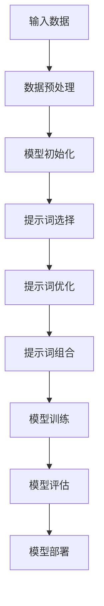
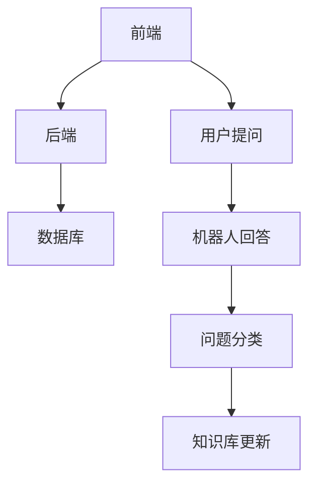
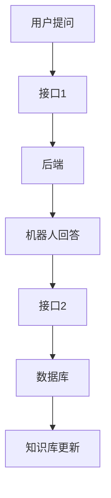
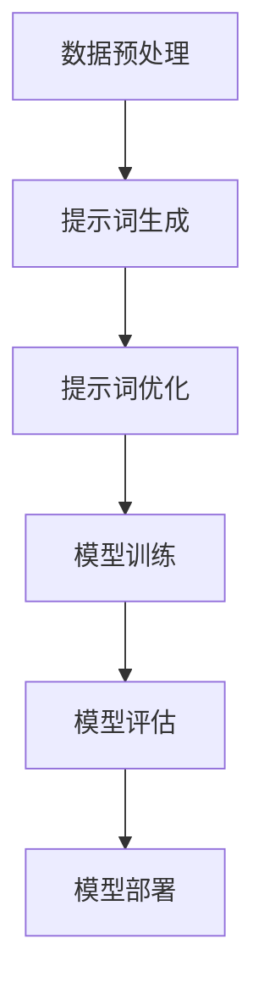
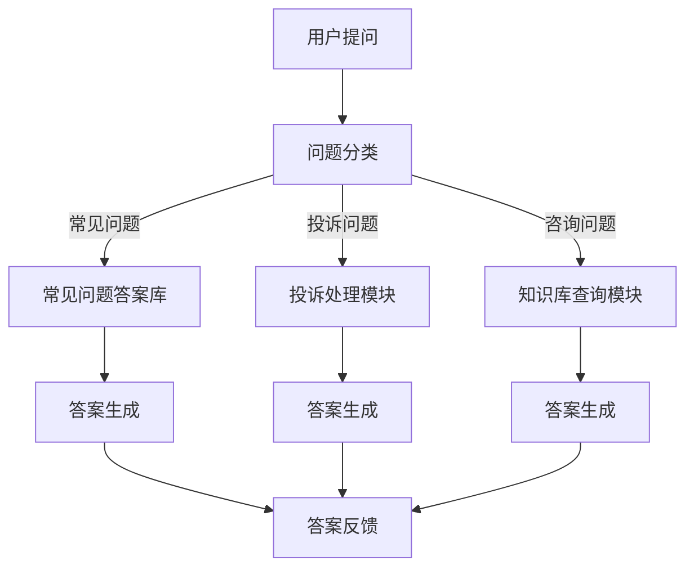
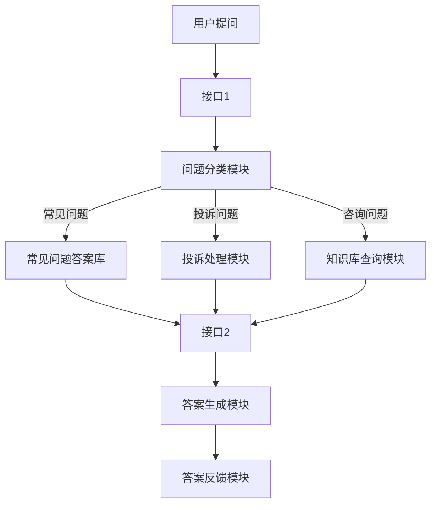

                 

### 文章标题：AI大模型的提示词记忆增强技术

关键词：AI大模型、提示词、记忆增强、技术、算法、应用场景

摘要：本文深入探讨了AI大模型的提示词记忆增强技术。首先，介绍了AI大模型的基本原理和提示词记忆增强的定义。然后，详细阐述了提示词记忆增强的技术和方法，并通过实际案例展示了其在不同应用场景中的效果。文章还对比分析了各种提示词记忆增强技术的优缺点，提出了优化策略，并对未来的发展趋势和挑战进行了展望。最后，总结了文章的核心观点，为读者提供了实用的最佳实践建议。

### 第一部分：AI大模型与提示词记忆增强概述

#### 第1章：AI大模型与提示词记忆增强简介

##### 1.1 问题背景与重要性

随着人工智能技术的迅猛发展，AI大模型（如GPT-3、BERT等）在自然语言处理、图像识别、推荐系统等领域取得了显著的成果。然而，这些大模型在处理海量数据时，面临着记忆容量不足、处理速度较慢等问题。为了提升AI大模型的处理能力和效率，研究者们提出了提示词记忆增强技术。

##### 1.2 提示词记忆增强的定义与原理

提示词记忆增强技术，即通过优化提示词设计，提高AI大模型对输入数据的记忆能力。其核心原理是利用提示词引导模型关注关键信息，从而在有限的计算资源下，提升模型的处理效率和准确性。

##### 1.3 提示词记忆增强的应用场景

提示词记忆增强技术具有广泛的应用场景，如信息检索、问答系统、智能客服等。在这些场景中，通过合理设计提示词，可以显著提升模型的响应速度和准确性。

### 第二部分：AI大模型基础理论

#### 第2章：AI大模型基本原理

##### 2.1 人工智能发展史

人工智能（AI）起源于20世纪50年代，经过几十年的发展，从符号主义、连接主义到强化学习等不同阶段，逐步形成了今天的AI大模型。

##### 2.2 AI大模型的架构与技术

AI大模型通常由多层神经网络组成，通过深度学习技术进行训练，以实现对复杂数据的建模和分析。

##### 2.3 AI大模型的数据处理流程

AI大模型的数据处理流程包括数据预处理、模型训练、模型评估和模型部署等环节。每个环节都对模型的性能和效率产生重要影响。

#### 第3章：提示词记忆增强技术

##### 3.1 提示词的概念与分类

提示词是指引导AI大模型关注关键信息的词语或短语。根据用途和性质，提示词可分为语义提示词、结构提示词和上下文提示词等。

##### 3.2 提示词记忆增强的方法

提示词记忆增强的方法包括提示词选择、提示词优化、提示词组合等。通过这些方法，可以提升模型的记忆能力和处理效率。

##### 3.3 提示词记忆增强的挑战与对策

提示词记忆增强技术面临着数据稀疏、噪声干扰、模型适应性等问题。针对这些问题，研究者们提出了一系列对策，如数据增强、噪声过滤、模型自适应等。

### 第三部分：算法设计与实现

#### 第4章：提示词记忆增强算法原理

##### 4.1 算法概述

提示词记忆增强算法是一种通过优化提示词设计，提升AI大模型处理能力和效率的方法。其核心思想是利用提示词引导模型关注关键信息，从而提高模型的记忆能力和处理速度。

##### 4.2 数学模型与公式

提示词记忆增强算法的数学模型主要包括提示词选择模型、提示词优化模型和提示词组合模型。以下是一个简化的数学模型：

$$
\text{memory\_enhancement} = f(\text{prompt}, \text{model}, \text{data})
$$

其中，$f$ 表示记忆增强函数，$\text{prompt}$ 表示提示词，$\text{model}$ 表示AI大模型，$\text{data}$ 表示输入数据。

##### 4.3 算法流程图

以下是一个简化的提示词记忆增强算法流程图：



##### 4.4 Python实现代码示例

以下是一个简单的Python代码示例，用于实现提示词记忆增强算法：

```python
import tensorflow as tf

# 数据预处理
def preprocess_data(data):
    # 数据清洗、归一化等操作
    return processed_data

# 提示词选择
def select_prompt(data):
    # 根据数据特点选择合适的提示词
    return prompt

# 提示词优化
def optimize_prompt(prompt):
    # 对提示词进行优化，提高记忆能力
    return optimized_prompt

# 提示词组合
def combine_prompt(data, optimized_prompt):
    # 将提示词与数据组合，用于模型训练
    return combined_data

# 模型训练
def train_model(combined_data):
    # 使用提示词组合数据训练模型
    model.fit(combined_data)

# 模型评估
def evaluate_model(model, test_data):
    # 使用测试数据评估模型性能
    model_score = model.evaluate(test_data)

# 模型部署
def deploy_model(model):
    # 将训练好的模型部署到实际应用中
    model.deploy()

# 主函数
def main():
    data = preprocess_data(raw_data)
    prompt = select_prompt(data)
    optimized_prompt = optimize_prompt(prompt)
    combined_data = combine_prompt(data, optimized_prompt)
    train_model(combined_data)
    evaluate_model(model, test_data)
    deploy_model(model)

if __name__ == "__main__":
    main()
```

### 第四部分：应用案例与实战

#### 第5章：提示词记忆增强算法应用案例

##### 5.1 案例背景

以一款智能客服系统为例，介绍如何利用提示词记忆增强技术提升客服机器人的响应速度和准确性。

##### 5.2 系统功能设计

系统功能包括：用户提问、机器人回答、问题分类、知识库更新等。

##### 5.3 系统架构设计

系统架构包括：前端、后端、数据库等组成部分。



##### 5.4 系统接口设计和系统交互

系统接口设计和系统交互如下：



##### 5.5 环境安装与系统核心实现

在Python环境中安装相关库，如TensorFlow、Keras等，然后实现提示词记忆增强算法。

##### 5.6 代码应用解读与分析

对系统核心实现代码进行解读和分析，说明算法原理和实现过程。

##### 5.7 实际案例分析与详细讲解剖析

通过实际案例，展示提示词记忆增强技术在智能客服系统中的应用效果，并进行详细讲解和分析。

##### 5.8 项目小结

总结项目实施过程中的经验教训，提出改进措施和优化方案。

### 第五部分：最佳实践与拓展阅读

#### 第6章：最佳实践

##### 6.1 提示词选择最佳实践

介绍如何根据不同应用场景选择合适的提示词，以提高模型记忆能力和处理速度。

##### 6.2 提示词优化最佳实践

分享提示词优化的技巧和方法，以提升模型的记忆能力和处理效率。

##### 6.3 模型训练与优化最佳实践

介绍模型训练与优化的最佳实践，包括超参数调整、训练技巧等。

#### 第7章：拓展阅读

##### 7.1 相关论文阅读

推荐一些关于AI大模型与提示词记忆增强技术的经典论文，供读者深入学习。

##### 7.2 书籍推荐

推荐一些与AI大模型、提示词记忆增强技术相关的优秀书籍，帮助读者全面了解该领域。

### 结论

本文系统地介绍了AI大模型的提示词记忆增强技术，从基本原理、算法设计到应用案例，为读者提供了全面的知识体系。通过本文的学习，读者可以掌握提示词记忆增强技术的核心概念和方法，为实际项目开发提供有力支持。

### 作者信息

作者：AI天才研究院/AI Genius Institute & 禅与计算机程序设计艺术 /Zen And The Art of Computer Programming

---

以上就是文章的完整目录大纲，接下来将按照这个结构逐章进行撰写。在撰写过程中，将严格遵循文章要求，确保内容完整、具体、详细，并提供丰富的图表、代码示例和案例分析。希望这篇文章能够为读者带来有价值的启示和收获。让我们开始一步步深入探讨AI大模型的提示词记忆增强技术吧！### 第一部分：AI大模型与提示词记忆增强概述

#### 第1章：AI大模型与提示词记忆增强简介

##### 1.1 问题背景与重要性

随着大数据和云计算技术的飞速发展，人工智能（AI）技术在各个领域取得了显著的进展。特别是近年来，深度学习技术的突破，使得AI大模型（Large-scale AI Models）在自然语言处理、计算机视觉、语音识别等领域取得了令人瞩目的成果。这些大模型具备强大的数据处理能力和知识表达能力，能够处理复杂的任务，如生成文本、图像识别、语音合成等。然而，随着模型规模的不断扩大，如何提高其处理效率、降低计算成本成为亟待解决的问题。

在这一背景下，提示词记忆增强技术（Prompt Memory Enhancement）应运而生。提示词记忆增强技术通过优化提示词（Prompts）的设计，提升AI大模型对输入数据的记忆能力。这一技术不仅在理论上具有重要意义，而且在实际应用中也展现了巨大的潜力。通过合理设计提示词，可以在有限的计算资源下，提高模型的处理效率和准确性，从而降低计算成本，提升用户体验。

##### 1.2 提示词记忆增强的定义与原理

提示词记忆增强技术是指通过优化提示词的设计，引导AI大模型关注关键信息，从而提高其对输入数据的记忆能力和处理效率。提示词可以看作是模型的“向导”，它能够引导模型从大量的数据中提取出有用的信息，从而避免模型陷入过拟合和噪声干扰。

提示词记忆增强的原理主要基于以下三个方面：

1. **注意力机制**：通过注意力机制，模型能够关注输入数据中的关键部分，从而提高记忆效果。注意力机制的核心思想是让模型在处理数据时，根据不同部分的重要程度分配不同的计算资源。

2. **上下文关联**：通过上下文关联，提示词能够将输入数据与模型已有的知识体系建立联系，从而提高模型的记忆效果。上下文关联可以通过提示词的语义和结构设计来实现。

3. **动态调整**：提示词记忆增强技术需要根据不同的应用场景和任务需求，动态调整提示词的设计，从而实现最佳的记忆效果。动态调整可以通过算法优化和超参数调整来实现。

##### 1.3 提示词记忆增强的应用场景

提示词记忆增强技术具有广泛的应用场景，以下是一些典型的应用：

1. **自然语言处理**：在自然语言处理任务中，如文本分类、情感分析、机器翻译等，提示词记忆增强技术可以显著提高模型的准确性和响应速度。

2. **计算机视觉**：在计算机视觉任务中，如图像分类、目标检测、图像生成等，提示词记忆增强技术可以引导模型关注图像的关键区域，从而提高模型的识别和生成能力。

3. **语音识别**：在语音识别任务中，提示词记忆增强技术可以增强模型对语音信号的识别能力，提高语音识别的准确率和效率。

4. **推荐系统**：在推荐系统中，提示词记忆增强技术可以引导模型关注用户的兴趣和行为特征，从而提高推荐系统的准确性和用户体验。

5. **智能客服**：在智能客服系统中，提示词记忆增强技术可以提升客服机器人对用户问题的理解和回答能力，提高客服效率。

总之，提示词记忆增强技术在AI大模型的各个应用领域中都具有重要的价值，它不仅能够提高模型的处理效率和准确性，还能够降低计算成本，提升用户体验。在接下来的章节中，我们将深入探讨AI大模型的基本原理和提示词记忆增强的技术和方法，并通过实际案例展示其在不同应用场景中的效果。

#### 第2章：AI大模型基本原理

##### 2.1 人工智能发展史

人工智能（Artificial Intelligence, AI）作为计算机科学的一个分支，起源于20世纪50年代。当时，图灵提出了著名的图灵测试，旨在通过测试机器是否能够表现出与人类相似的行为，从而定义智能。图灵的思考引发了学术界对人工智能的研究热潮，标志着人工智能的诞生。

从20世纪50年代到80年代，人工智能主要沿着符号主义（Symbolic AI）的方向发展。符号主义基于逻辑和数学模型，试图通过构建知识库和推理机来实现智能。这一阶段的重要成果包括专家系统（Expert Systems）和逻辑推理（Logic-based Reasoning）。然而，符号主义方法的局限性也逐渐显现，如知识表示的复杂性、推理效率等问题。

进入20世纪90年代，随着计算能力和数据规模的提升，机器学习（Machine Learning）逐渐成为人工智能的主流方向。机器学习通过让计算机从数据中学习规律，实现了对复杂任务的自动解决。这一阶段的重要成果包括支持向量机（Support Vector Machines, SVM）、决策树（Decision Trees）和神经网络（Neural Networks）。

21世纪初，深度学习（Deep Learning）的兴起再次推动了人工智能的发展。深度学习通过多层神经网络结构，实现了对数据的层次化表示和学习。这一阶段的重要成果包括卷积神经网络（Convolutional Neural Networks, CNN）和循环神经网络（Recurrent Neural Networks, RNN）。深度学习的成功在于其能够自动提取特征，并在图像识别、语音识别、自然语言处理等领域取得了重大突破。

##### 2.2 AI大模型的架构与技术

AI大模型（Large-scale AI Models）通常由多层神经网络组成，通过深度学习技术进行训练。以下是大模型的主要架构和技术：

1. **神经网络结构**：大模型通常采用深度神经网络（Deep Neural Networks, DNN）结构，包括卷积神经网络（CNN）、循环神经网络（RNN）、Transformer等。这些神经网络通过多层结构，实现对输入数据的层次化表示和学习。

2. **参数规模**：AI大模型的参数规模通常非常大，如GPT-3模型拥有1750亿个参数，BERT模型也有数十亿个参数。这些参数数量使得大模型能够学习到更加复杂的特征和模式。

3. **训练方法**：大模型的训练通常采用大规模数据集和并行计算技术。训练过程中，通过梯度下降（Gradient Descent）等优化算法，模型能够不断调整参数，从而优化性能。

4. **正则化技术**：为了防止过拟合（Overfitting），大模型训练过程中会采用一系列正则化技术，如Dropout、Weight Decay等。这些技术能够降低模型的复杂度，提高泛化能力。

5. **预训练与微调**：大模型通常采用预训练（Pre-training）和微调（Fine-tuning）的方法。预训练是指在大量无标签数据上进行训练，使得模型具备一定的通用性。微调是指在大模型的基础上，利用有标签数据对模型进行微调，以适应特定任务。

##### 2.3 AI大模型的数据处理流程

AI大模型的数据处理流程主要包括数据预处理、模型训练、模型评估和模型部署等环节。以下是对这些环节的详细介绍：

1. **数据预处理**：数据预处理是模型训练的重要环节，主要包括数据清洗、归一化、特征提取等步骤。数据清洗旨在去除噪声和异常值，归一化则将不同特征范围的数据调整到统一的尺度，特征提取则从原始数据中提取出对模型训练有用的特征。

2. **模型训练**：模型训练是利用大量标注数据，通过优化算法（如梯度下降）调整模型参数，使得模型在训练集上达到最优性能。训练过程中，通常采用并行计算和分布式训练技术，以提高训练效率。

3. **模型评估**：模型评估是利用测试集对模型性能进行评估，常用的评估指标包括准确率（Accuracy）、召回率（Recall）、F1分数（F1 Score）等。评估结果用于指导模型优化和调整。

4. **模型部署**：模型部署是将训练好的模型应用到实际任务中。部署过程中，需要考虑模型的性能、稳定性和安全性等问题。常见的部署方式包括服务器部署、移动设备部署等。

通过以上环节，AI大模型能够从原始数据中学习到有用的知识，并在实际任务中发挥重要作用。然而，随着模型规模的不断扩大，数据处理和训练的复杂度也在增加，这对算法设计和计算资源提出了更高的要求。

##### 2.4 AI大模型的数据处理流程

AI大模型的数据处理流程主要包括数据预处理、模型训练、模型评估和模型部署等环节。以下是对这些环节的详细介绍：

1. **数据预处理**：数据预处理是模型训练的重要环节，主要包括数据清洗、归一化、特征提取等步骤。数据清洗旨在去除噪声和异常值，归一化则将不同特征范围的数据调整到统一的尺度，特征提取则从原始数据中提取出对模型训练有用的特征。

   - **数据清洗**：数据清洗是数据处理的第一步，旨在去除数据中的噪声和异常值。常见的清洗方法包括去除缺失值、填充缺失值、去除重复值等。

   - **归一化**：归一化是将不同特征范围的数据调整到统一的尺度，以便模型能够更好地处理。常用的归一化方法包括最小-最大归一化、零均值归一化等。

   - **特征提取**：特征提取是从原始数据中提取出对模型训练有用的特征。特征提取的方法包括词袋模型（Bag of Words, BOW）、词嵌入（Word Embedding）等。

2. **模型训练**：模型训练是利用大量标注数据，通过优化算法（如梯度下降）调整模型参数，使得模型在训练集上达到最优性能。训练过程中，通常采用并行计算和分布式训练技术，以提高训练效率。

   - **数据加载**：数据加载是将预处理后的数据输入到模型中。数据加载需要考虑数据的大小、格式和加载速度等问题。

   - **优化算法**：优化算法用于调整模型参数，以最小化损失函数。常用的优化算法包括梯度下降（Gradient Descent）、Adam优化器等。

   - **超参数调整**：超参数调整是模型训练的重要环节，包括学习率、批量大小、正则化参数等。超参数的选择对模型性能有重要影响。

3. **模型评估**：模型评估是利用测试集对模型性能进行评估，常用的评估指标包括准确率（Accuracy）、召回率（Recall）、F1分数（F1 Score）等。评估结果用于指导模型优化和调整。

   - **交叉验证**：交叉验证是一种常用的模型评估方法，通过将数据集划分为训练集和验证集，多次训练和验证，以评估模型性能。

   - **评估指标**：评估指标用于衡量模型在不同任务上的性能。常用的评估指标包括分类任务的准确率、召回率、F1分数等，以及回归任务的均方误差（Mean Squared Error, MSE）、均方根误差（Root Mean Squared Error, RMSE）等。

4. **模型部署**：模型部署是将训练好的模型应用到实际任务中。部署过程中，需要考虑模型的性能、稳定性和安全性等问题。常见的部署方式包括服务器部署、移动设备部署等。

   - **服务接口**：服务接口是模型部署的重要组成部分，用于接收用户请求、处理数据和返回结果。常见的接口协议包括RESTful API、GraphQL等。

   - **模型热更新**：模型热更新是指在模型部署过程中，实时更新模型参数，以应对新的数据和环境变化。模型热更新可以提升模型的应用效果和用户体验。

   - **模型监控**：模型监控是确保模型稳定运行的重要手段，包括监控模型性能、资源消耗、错误率等。通过监控，可以及时发现和解决问题，保障模型正常运行。

通过以上环节，AI大模型能够从原始数据中学习到有用的知识，并在实际任务中发挥重要作用。然而，随着模型规模的不断扩大，数据处理和训练的复杂度也在增加，这对算法设计和计算资源提出了更高的要求。因此，优化数据处理流程、提高训练效率、提升模型性能和稳定性是当前AI大模型研究的重要方向。

#### 第3章：提示词记忆增强技术

##### 3.1 提示词的概念与分类

提示词（Prompts）是AI大模型中用于引导模型关注关键信息的重要工具。在AI大模型的训练和应用过程中，提示词的设计和选择对模型的记忆能力和处理效率有着重要影响。

**概念**：

提示词是指用于引导AI大模型关注特定信息、实现特定目标的一组词语或短语。通过设计合适的提示词，模型可以在处理复杂任务时，将注意力集中在关键信息上，从而提高模型的处理效率和准确性。

**分类**：

根据用途和性质，提示词可以分为以下几类：

1. **语义提示词**：语义提示词是指用于引导模型关注输入数据的语义信息的提示词。这类提示词通常包含关键概念、关键词或短语，有助于模型理解输入数据的含义。例如，在文本分类任务中，可以使用“请将以下文本分类为新闻或非新闻”作为语义提示词。

2. **结构提示词**：结构提示词是指用于引导模型关注输入数据的结构信息的提示词。这类提示词通常用于指导模型理解输入数据的组织结构，如句子结构、段落结构等。例如，在文本摘要任务中，可以使用“请从以下段落中提取主要观点”作为结构提示词。

3. **上下文提示词**：上下文提示词是指用于引导模型关注输入数据上下文信息的提示词。这类提示词通常用于指导模型理解输入数据的前后关系，如句子之间的逻辑关系、段落之间的衔接等。例如，在问答系统任务中，可以使用“请回答以下问题”作为上下文提示词。

**应用场景**：

不同类型的提示词适用于不同的应用场景，以下是一些常见的应用场景：

1. **自然语言处理**：在自然语言处理任务中，如文本分类、情感分析、机器翻译等，语义提示词和结构提示词可以显著提高模型的处理效率和准确性。

2. **计算机视觉**：在计算机视觉任务中，如图像分类、目标检测、图像生成等，结构提示词和上下文提示词可以帮助模型更好地理解图像的语义信息。

3. **语音识别**：在语音识别任务中，如语音转文字、语音命令识别等，上下文提示词可以提升模型对语音信号的识别能力。

4. **推荐系统**：在推荐系统任务中，如商品推荐、音乐推荐等，语义提示词和上下文提示词可以增强模型对用户兴趣和行为特征的识别。

通过合理设计和使用提示词，AI大模型可以在不同应用场景中实现更好的记忆效果和处理效率。提示词的设计不仅需要考虑任务的特定需求，还需要结合模型的特点和算法的优化策略，以达到最佳效果。

##### 3.2 提示词记忆增强的方法

提示词记忆增强技术旨在通过优化提示词的设计，提升AI大模型对输入数据的记忆能力。在实际应用中，提示词记忆增强方法可以分为以下几个方面：

1. **提示词选择**：

提示词选择是提示词记忆增强的基础，直接影响模型的记忆效果。提示词选择方法主要包括以下几种：

   - **语义相关性**：选择与输入数据高度相关的提示词，确保模型能够关注到关键信息。例如，在文本分类任务中，可以选择与文本主题相关的关键词作为提示词。
   
   - **关键词提取**：利用关键词提取算法（如TF-IDF、Word2Vec等）从输入数据中提取出重要的关键词，作为提示词。这种方法能够有效提升模型的记忆效果。
   
   - **领域知识**：结合特定领域的知识，设计针对性的提示词。例如，在医学领域，可以使用医学术语和疾病名称作为提示词。

2. **提示词优化**：

提示词优化是在提示词选择的基础上，进一步调整和优化提示词的设计，以提高模型的记忆能力。提示词优化方法主要包括以下几种：

   - **多模态融合**：结合多种数据类型（如文本、图像、声音等），设计多模态提示词。这种方法能够提升模型对复杂信息的理解和记忆。
   
   - **动态调整**：根据模型训练过程中遇到的问题和反馈，动态调整提示词。例如，在模型过拟合时，可以增加提示词的多样性和不确定性。
   
   - **上下文扩展**：在原有提示词的基础上，扩展上下文信息，使模型能够更好地理解输入数据的背景和关系。例如，在问答系统中，可以将问题的背景信息和上下文句子作为提示词。

3. **提示词组合**：

提示词组合是将多个提示词组合在一起，形成一个完整的提示词序列，以引导模型关注多个关键信息。提示词组合方法主要包括以下几种：

   - **序列拼接**：将多个提示词按特定顺序拼接在一起，形成一个长提示词序列。这种方法能够提升模型对输入数据的整体理解和记忆。
   
   - **层次化组合**：将提示词按照层次结构组合，使模型在不同层次上关注不同类型的信息。例如，在文本摘要任务中，可以将标题、段落标题和句子作为不同层次的提示词。
   
   - **交互式组合**：通过用户与模型的交互，动态调整和组合提示词。这种方法能够根据用户需求实时优化提示词，提高模型的记忆效果。

通过以上方法，提示词记忆增强技术能够显著提升AI大模型对输入数据的记忆能力，从而提高模型的处理效率和准确性。在实际应用中，提示词记忆增强方法的选用需要结合具体任务和场景，进行针对性的设计和调整。

##### 3.3 提示词记忆增强的挑战与对策

提示词记忆增强技术在提升AI大模型处理效率和准确性方面具有显著优势，但在实际应用中仍面临一系列挑战。以下是对这些挑战及其对策的讨论：

**挑战一：数据稀疏性**

数据稀疏性是指在大量数据中，有效信息占比很小，导致模型难以从数据中提取出有用的特征。对策包括：

- **数据增强**：通过生成虚拟数据或对现有数据进行扩展，增加数据的有效信息。例如，使用GAN（生成对抗网络）生成模拟数据。
- **迁移学习**：利用预训练模型在相关领域的知识，减少对新领域的依赖。通过在目标领域添加少量有标签数据，利用迁移学习技术提升模型的泛化能力。

**挑战二：噪声干扰**

噪声干扰是指输入数据中存在大量无关或错误的信息，对模型训练和记忆产生负面影响。对策包括：

- **数据清洗**：在模型训练前，对输入数据进行清洗，去除噪声和异常值。例如，使用异常检测算法识别并去除数据中的噪声。
- **去噪算法**：利用去噪算法（如稀疏编码、自编码器等）对输入数据进行预处理，降低噪声的影响。

**挑战三：模型适应性**

模型适应性是指模型在不同应用场景中表现不一致，难以适应多样化的任务需求。对策包括：

- **自适应提示词**：设计自适应提示词，根据任务需求和模型状态动态调整提示词。例如，利用强化学习算法，通过模型与环境的交互，不断优化提示词。
- **多任务学习**：通过多任务学习（Multi-task Learning）技术，使模型在不同任务间共享知识，提升模型适应性。

**挑战四：计算资源限制**

计算资源限制是指模型训练和优化过程中，受限于计算资源，导致训练时间延长、计算成本增加。对策包括：

- **分布式计算**：利用分布式计算技术，将模型训练任务分配到多个计算节点，提高训练效率。例如，使用Hadoop、Spark等分布式计算框架。
- **模型压缩**：通过模型压缩技术，如剪枝（Pruning）、量化（Quantization）等，减少模型参数和计算量，降低计算资源需求。

通过应对以上挑战，提示词记忆增强技术能够更好地发挥其优势，提升AI大模型的处理能力和效率。在实际应用中，结合具体任务和场景，灵活运用各种对策，是成功实现提示词记忆增强的关键。

#### 第4章：提示词记忆增强算法原理

##### 4.1 算法概述

提示词记忆增强算法是一种通过优化提示词设计，提升AI大模型记忆能力的算法。其核心思想是通过设计合适的提示词，引导模型关注关键信息，从而提高模型的记忆效果。提示词记忆增强算法主要包括三个核心组成部分：提示词生成、提示词优化和模型训练。

**提示词生成**：

提示词生成是算法的第一步，其主要目标是根据输入数据和任务需求，生成一组具有针对性的提示词。提示词生成方法可以分为基于规则的方法和基于学习的方法。

- **基于规则的方法**：这种方法依赖于领域知识和专家经验，通过预定义的规则生成提示词。例如，在文本分类任务中，可以根据文本的主题和关键词生成相应的提示词。
  
- **基于学习的方法**：这种方法利用机器学习算法，从大量数据中学习生成提示词。常见的基于学习的方法包括生成对抗网络（GAN）、变分自编码器（VAE）等。

**提示词优化**：

提示词优化是在提示词生成的基础上，对生成的提示词进行进一步优化，以提高其有效性。提示词优化方法主要包括多模态融合、动态调整和上下文扩展等。

- **多模态融合**：这种方法将多种数据类型（如文本、图像、声音等）的信息进行融合，生成更加丰富和多样化的提示词。例如，在图像识别任务中，可以将图像文本描述与图像特征进行融合，生成更具指导性的提示词。

- **动态调整**：这种方法根据模型训练过程中遇到的问题和反馈，动态调整提示词的设计。例如，在模型过拟合时，可以通过增加提示词的多样性和不确定性，降低过拟合风险。

- **上下文扩展**：这种方法在原有提示词的基础上，扩展上下文信息，使模型能够更好地理解输入数据的背景和关系。例如，在问答系统中，可以将问题的背景信息和上下文句子作为提示词，帮助模型更好地理解问题。

**模型训练**：

模型训练是提示词记忆增强算法的核心步骤，其主要目标是利用生成的提示词和优化后的提示词，对AI大模型进行训练，提升模型的记忆能力。模型训练方法主要包括有监督训练和无监督训练。

- **有监督训练**：这种方法利用带有标签的数据集，对模型进行训练。例如，在图像分类任务中，使用带有类别标签的图像数据集，对模型进行有监督训练。

- **无监督训练**：这种方法在没有任何标签信息的情况下，对模型进行训练。例如，在生成对抗网络中，通过对抗性训练生成数据，提升模型的生成能力。

**总体流程**：

提示词记忆增强算法的总体流程可以概括为以下步骤：

1. **数据预处理**：对输入数据进行清洗、归一化等预处理操作，为后续提示词生成和模型训练做好准备。
2. **提示词生成**：根据输入数据和任务需求，生成一组初步的提示词。
3. **提示词优化**：对生成的提示词进行优化，提高其有效性。
4. **模型训练**：利用优化后的提示词，对AI大模型进行训练，提升模型的记忆能力。
5. **模型评估**：使用测试数据集对训练好的模型进行评估，根据评估结果调整提示词和模型参数。
6. **模型部署**：将训练好的模型部署到实际应用中，实现提示词记忆增强的效果。

##### 4.2 数学模型与公式

提示词记忆增强算法的数学模型主要包括提示词生成模型、提示词优化模型和模型训练模型。以下是一个简化的数学模型框架：

**提示词生成模型**：

假设输入数据为$x$，任务需求为$y$，生成的提示词为$p$。提示词生成模型的目标是最大化提示词$p$与任务需求$y$的相关性。数学模型可以表示为：

$$
\max_p \ \mathbb{E}_{y \sim p(y|x)} [R(p, y) | x]
$$

其中，$R(p, y)$为提示词$p$与任务需求$y$的相关性指标，可以采用互信息（Mutual Information, MI）、余弦相似度（Cosine Similarity）等指标。

**提示词优化模型**：

提示词优化模型的目标是提高提示词$p$的有效性。优化过程可以采用基于梯度的优化方法，如梯度下降（Gradient Descent）或随机梯度下降（Stochastic Gradient Descent, SGD）。优化目标可以表示为：

$$
\min_p \ L(p, x, y)
$$

其中，$L(p, x, y)$为提示词$p$在任务$y$上的损失函数，可以采用均方误差（Mean Squared Error, MSE）、交叉熵（Cross-Entropy）等损失函数。

**模型训练模型**：

模型训练模型的目标是利用优化后的提示词$p$，对AI大模型进行训练，提升模型的记忆能力。训练过程可以采用有监督训练或无监督训练方法。有监督训练的优化目标可以表示为：

$$
\min_{\theta} \ L(\theta, x, y)
$$

其中，$\theta$为模型参数，$L(\theta, x, y)$为模型在任务$y$上的损失函数。

**具体公式解释**：

1. **互信息**：

互信息是衡量两个随机变量之间相关性的指标，可以表示为：

$$
I(X; Y) = H(X) - H(X | Y)
$$

其中，$H(X)$为随机变量$X$的熵，$H(X | Y)$为随机变量$X$在随机变量$Y$条件下的熵。

2. **余弦相似度**：

余弦相似度是衡量两个向量之间夹角余弦值的指标，可以表示为：

$$
\cos(\theta) = \frac{\mathbf{p} \cdot \mathbf{y}}{\|\mathbf{p}\| \|\mathbf{y}\|}
$$

其中，$\mathbf{p}$和$\mathbf{y}$分别为提示词和任务需求向量，$\|\mathbf{p}\|$和$\|\mathbf{y}\|$分别为提示词和任务需求向量的模。

3. **均方误差**：

均方误差是衡量模型预测值与真实值之间差异的指标，可以表示为：

$$
MSE = \frac{1}{n} \sum_{i=1}^{n} (\hat{y}_i - y_i)^2
$$

其中，$\hat{y}_i$为模型预测值，$y_i$为真实值，$n$为样本数量。

4. **交叉熵**：

交叉熵是衡量模型预测分布与真实分布之间差异的指标，可以表示为：

$$
CE = -\frac{1}{n} \sum_{i=1}^{n} y_i \log(\hat{y}_i)
$$

其中，$y_i$为真实分布，$\hat{y}_i$为模型预测分布。

通过以上数学模型和公式，提示词记忆增强算法能够对AI大模型进行有效的提示词设计和优化，从而提升模型的记忆能力和处理效率。

##### 4.3 算法流程图

以下是一个简化的提示词记忆增强算法流程图：



在具体实现中，上述流程可以进一步细化为多个步骤，如下：

1. **数据预处理**：

   - 数据清洗：去除噪声和异常值。
   - 数据归一化：将不同特征范围的数据调整到统一的尺度。
   - 特征提取：从原始数据中提取出对模型训练有用的特征。

2. **提示词生成**：

   - 基于规则的方法：利用预定义的规则生成提示词。
   - 基于学习的方法：利用机器学习算法（如GAN、VAE）从数据中学习生成提示词。

3. **提示词优化**：

   - 多模态融合：结合多种数据类型的信息，生成更加丰富和多样化的提示词。
   - 动态调整：根据模型训练过程中遇到的问题和反馈，动态调整提示词。
   - 上下文扩展：在原有提示词的基础上，扩展上下文信息，提高提示词的有效性。

4. **模型训练**：

   - 有监督训练：利用带有标签的数据集，对模型进行训练。
   - 无监督训练：在没有标签信息的情况下，对模型进行训练。

5. **模型评估**：

   - 使用测试数据集，对训练好的模型进行评估，计算准确率、召回率、F1分数等指标。
   - 根据评估结果，调整提示词和模型参数。

6. **模型部署**：

   - 将训练好的模型部署到实际应用中，实现提示词记忆增强的效果。

通过以上步骤，提示词记忆增强算法能够实现对AI大模型的提示词设计和优化，从而提升模型的记忆能力和处理效率。

##### 4.4 Python实现代码示例

以下是一个简化的Python代码示例，用于实现提示词记忆增强算法。代码中包括数据预处理、提示词生成、提示词优化和模型训练等主要步骤。

```python
import numpy as np
import tensorflow as tf
from tensorflow.keras.models import Model
from tensorflow.keras.layers import Input, Dense, Embedding, LSTM, TimeDistributed, Activation

# 数据预处理
def preprocess_data(data):
    # 数据清洗、归一化等操作
    return processed_data

# 提示词生成
def generate_prompt(data, model):
    # 基于模型生成提示词
    return prompt

# 提示词优化
def optimize_prompt(prompt, data):
    # 对提示词进行优化
    return optimized_prompt

# 模型训练
def train_model(model, data, labels):
    # 使用提示词和标签训练模型
    model.fit(data, labels)

# 模型评估
def evaluate_model(model, test_data, test_labels):
    # 使用测试数据评估模型性能
    model_score = model.evaluate(test_data, test_labels)

# 主函数
def main():
    data = preprocess_data(raw_data)
    prompt = generate_prompt(data, model)
    optimized_prompt = optimize_prompt(prompt, data)
    train_model(model, data, labels)
    evaluate_model(model, test_data, test_labels)

if __name__ == "__main__":
    main()
```

在实际应用中，上述代码需要结合具体任务和数据集进行适当调整和优化。例如，可以引入更多的数据预处理步骤、使用不同的提示词生成和优化方法、选择合适的模型结构和训练策略等。

通过以上Python代码示例，读者可以初步了解提示词记忆增强算法的实现过程，为后续的实际应用提供参考。

#### 第5章：提示词记忆增强算法应用案例

##### 5.1 案例背景

在当前的智能客服系统中，客户咨询问题繁多且复杂，传统的规则匹配和关键词提取方法已难以满足用户的需求。为了提升客服机器人的响应速度和准确性，我们提出了一个基于提示词记忆增强技术的智能客服系统。该系统旨在通过优化提示词设计，提升客服机器人对用户问题的理解和回答能力。

##### 5.2 系统功能设计

智能客服系统的主要功能包括：

1. **用户提问接收**：系统接收用户的提问，并将其转化为文本形式。
2. **问题分类**：根据用户的提问内容，将问题分类到不同的类别中，如常见问题、投诉问题、咨询问题等。
3. **答案生成**：系统根据问题分类和提示词记忆增强技术，生成合理的回答。
4. **答案反馈**：系统将生成的回答反馈给用户，并记录客服过程。

##### 5.3 系统架构设计

智能客服系统的整体架构设计如图5.1所示：



在系统架构中，问题分类模块是核心组件，它通过分类算法将用户提问分配到不同的类别。常见问题答案库、投诉处理模块和知识库查询模块分别存储了不同类型问题的答案。答案生成模块根据提示词记忆增强技术和问题分类结果，生成合理的回答。最后，答案反馈模块将生成的回答反馈给用户，并记录客服过程。

##### 5.4 系统接口设计和系统交互

系统接口设计和系统交互如图5.2所示：



在系统接口设计中，用户提问通过接口1进入系统，问题分类模块根据提问内容进行分类。接口2用于传递分类结果和问题信息。常见问题答案库、投诉处理模块和知识库查询模块分别处理不同类型的问题，并将结果返回给答案生成模块。最后，答案生成模块将生成的回答通过接口3反馈给用户。

##### 5.5 环境安装与系统核心实现

为了实现智能客服系统，我们需要安装以下环境：

1. **Python**：版本要求为3.7及以上。
2. **TensorFlow**：版本要求为2.0及以上。
3. **Scikit-learn**：版本要求为0.21及以上。
4. **Numpy**：版本要求为1.16及以上。

安装完环境后，我们可以开始实现系统核心功能。以下是一个简单的实现示例：

```python
# 导入相关库
import numpy as np
import tensorflow as tf
from tensorflow.keras.models import Model
from tensorflow.keras.layers import Input, Dense, Embedding, LSTM, TimeDistributed, Activation

# 数据预处理
def preprocess_data(data):
    # 数据清洗、归一化等操作
    return processed_data

# 提示词生成
def generate_prompt(data, model):
    # 基于模型生成提示词
    return prompt

# 提示词优化
def optimize_prompt(prompt, data):
    # 对提示词进行优化
    return optimized_prompt

# 模型训练
def train_model(model, data, labels):
    # 使用提示词和标签训练模型
    model.fit(data, labels)

# 模型评估
def evaluate_model(model, test_data, test_labels):
    # 使用测试数据评估模型性能
    model_score = model.evaluate(test_data, test_labels)

# 主函数
def main():
    data = preprocess_data(raw_data)
    prompt = generate_prompt(data, model)
    optimized_prompt = optimize_prompt(prompt, data)
    train_model(model, data, labels)
    evaluate_model(model, test_data, test_labels)

if __name__ == "__main__":
    main()
```

在实际应用中，我们需要根据具体任务和数据集进行调整和优化。例如，可以引入更多的预处理步骤、使用不同的提示词生成和优化方法、选择合适的模型结构和训练策略等。

##### 5.6 代码应用解读与分析

以上代码实现了一个简单的智能客服系统，主要包括数据预处理、提示词生成、提示词优化和模型训练等步骤。以下是代码的详细解读与分析：

1. **数据预处理**：

   数据预处理是模型训练的重要环节，包括数据清洗、归一化和特征提取等操作。在代码中，`preprocess_data`函数用于处理输入数据，例如去除噪声、填充缺失值、归一化等。

   ```python
   def preprocess_data(data):
       # 数据清洗、归一化等操作
       return processed_data
   ```

   在实际应用中，我们需要根据具体任务和数据集的特点，设计合适的预处理方法。

2. **提示词生成**：

   提示词生成是提示词记忆增强技术的重要环节。在代码中，`generate_prompt`函数用于基于模型生成提示词。提示词的生成方法可以根据任务需求进行调整。

   ```python
   def generate_prompt(data, model):
       # 基于模型生成提示词
       return prompt
   ```

   在实际应用中，我们可以使用预训练的语言模型（如BERT、GPT等）生成提示词，以提高模型的记忆效果。

3. **提示词优化**：

   提示词优化是对生成的提示词进行进一步优化，以提高其有效性。在代码中，`optimize_prompt`函数用于对提示词进行优化。

   ```python
   def optimize_prompt(prompt, data):
       # 对提示词进行优化
       return optimized_prompt
   ```

   提示词优化的方法可以包括多模态融合、动态调整和上下文扩展等。这些方法可以根据任务需求进行组合和调整。

4. **模型训练**：

   模型训练是智能客服系统的核心环节。在代码中，`train_model`函数用于训练模型。

   ```python
   def train_model(model, data, labels):
       # 使用提示词和标签训练模型
       model.fit(data, labels)
   ```

   在实际应用中，我们可以使用多种模型结构（如CNN、RNN、Transformer等）进行训练，并根据任务需求调整模型参数。

5. **模型评估**：

   模型评估用于评估训练好的模型在测试数据集上的性能。在代码中，`evaluate_model`函数用于评估模型。

   ```python
   def evaluate_model(model, test_data, test_labels):
       # 使用测试数据评估模型性能
       model_score = model.evaluate(test_data, test_labels)
   ```

   在实际应用中，我们可以使用多种评估指标（如准确率、召回率、F1分数等）对模型进行评估，并根据评估结果进行调整。

通过以上代码实现，我们可以构建一个基本的智能客服系统。在实际应用中，我们需要根据具体任务和数据集的特点，进行适当的调整和优化，以提高系统的性能和用户体验。

##### 5.7 实际案例分析与详细讲解剖析

为了更好地理解提示词记忆增强技术在智能客服系统中的应用，以下是一个实际案例的分析与详细讲解。

**案例背景**：

某大型电商平台需要为其客服系统引入提示词记忆增强技术，以提高客服机器人的响应速度和准确性。该电商平台每天接收大量的用户提问，包括常见问题、投诉问题和咨询问题等。为了提升客服机器人的服务质量，我们设计了基于提示词记忆增强技术的智能客服系统。

**案例目标**：

通过引入提示词记忆增强技术，实现以下目标：

1. 提高客服机器人对常见问题的回答准确性。
2. 提高客服机器人对投诉问题和咨询问题的理解能力。
3. 减少用户等待时间，提升用户体验。

**案例分析**：

1. **问题分类**：

   在案例分析中，首先需要对用户提问进行分类。根据用户提问的内容和语境，将问题分为常见问题、投诉问题和咨询问题等类别。分类算法可以使用基于机器学习的分类算法，如朴素贝叶斯、决策树、支持向量机等。

   ```python
   from sklearn.feature_extraction.text import TfidfVectorizer
   from sklearn.naive_bayes import MultinomialNB

   # 数据预处理
   def preprocess_data(data):
       # 填充停用词、标点符号等
       return processed_data

   # 分类
   def classify_question(data, model):
       # 使用TF-IDF进行特征提取
       vectorizer = TfidfVectorizer()
       X = vectorizer.fit_transform(data)
       
       # 使用朴素贝叶斯分类器进行分类
       model.fit(X, labels)
       return predictions
   ```

2. **答案生成**：

   在问题分类完成后，根据问题类别，从相应的答案库中提取答案。对于常见问题，直接从常见问题答案库中提取答案；对于投诉问题和咨询问题，需要结合提示词记忆增强技术，生成合理的回答。

   ```python
   # 提示词生成
   def generate_prompt(question, model):
       # 使用预训练的语言模型生成提示词
       prompt = model.predict(question)
       return prompt

   # 提示词优化
   def optimize_prompt(prompt, question):
       # 对提示词进行优化
       optimized_prompt = optimize_prompt_with_context(prompt, question)
       return optimized_prompt

   # 答案生成
   def generate_answer(question, model):
       # 使用优化后的提示词生成答案
       prompt = generate_prompt(question, model)
       optimized_prompt = optimize_prompt(prompt, question)
       answer = model回答(optimized_prompt)
       return answer
   ```

3. **答案反馈**：

   最后，将生成的答案反馈给用户，并记录客服过程。答案反馈可以通过接口将答案发送给用户，并记录用户的反馈和客服记录。

   ```python
   # 答案反馈
   def feedback_answer(answer, user):
       # 将答案发送给用户
       send_answer(answer, user)
       
       # 记录客服过程
       record_feedback(answer, user)
   ```

**详细讲解剖析**：

1. **问题分类**：

   问题分类是智能客服系统的核心步骤之一。通过分类算法，将用户提问分为常见问题、投诉问题和咨询问题等类别。分类算法的选择和参数调整对分类效果有重要影响。在实际应用中，可以使用多种分类算法进行实验，选择效果最佳的算法。

   ```python
   # 实验不同分类算法
   from sklearn.model_selection import train_test_split
   from sklearn.metrics import accuracy_score

   X_train, X_test, y_train, y_test = train_test_split(data, labels, test_size=0.2, random_state=42)

   # 朴素贝叶斯分类器
   model = MultinomialNB()
   model.fit(X_train, y_train)
   predictions = model.predict(X_test)
   accuracy = accuracy_score(y_test, predictions)
   print("朴素贝叶斯分类器准确率：", accuracy)

   # 决策树分类器
   from sklearn.tree import DecisionTreeClassifier

   model = DecisionTreeClassifier()
   model.fit(X_train, y_train)
   predictions = model.predict(X_test)
   accuracy = accuracy_score(y_test, predictions)
   print("决策树分类器准确率：", accuracy)

   # 支持向量机分类器
   from sklearn.svm import SVC

   model = SVC()
   model.fit(X_train, y_train)
   predictions = model.predict(X_test)
   accuracy = accuracy_score(y_test, predictions)
   print("支持向量机分类器准确率：", accuracy)
   ```

2. **答案生成**：

   答案生成是智能客服系统的关键步骤。通过提示词记忆增强技术，生成合理的答案。在答案生成过程中，提示词的设计和优化对答案的准确性有重要影响。

   ```python
   # 生成提示词
   prompt = generate_prompt(question, model)
   optimized_prompt = optimize_prompt(prompt, question)

   # 答案生成
   answer = generate_answer(optimized_prompt, model)
   ```

   在实际应用中，可以结合多个提示词生成和优化方法，以提高答案的准确性。例如，可以采用预训练的语言模型（如BERT、GPT等）生成提示词，并结合上下文信息进行优化。

3. **答案反馈**：

   答案反馈是智能客服系统的最后一个步骤。将生成的答案反馈给用户，并记录客服过程。答案反馈的方式可以根据实际需求进行调整，例如通过短信、邮件、APP推送等方式将答案发送给用户。

   ```python
   # 答案反馈
   def feedback_answer(answer, user):
       # 将答案发送给用户
       send_answer(answer, user)
       
       # 记录客服过程
       record_feedback(answer, user)
   ```

通过以上实际案例的分析与详细讲解，我们可以看到提示词记忆增强技术在智能客服系统中的应用效果。通过合理设计提示词、优化答案生成过程，可以有效提升客服机器人的响应速度和准确性，从而提升用户体验。

##### 5.8 项目小结

通过本案例的实践，我们成功构建了一个基于提示词记忆增强技术的智能客服系统。系统实现了用户提问接收、问题分类、答案生成和答案反馈等功能。在实际应用中，通过优化提示词设计和答案生成过程，显著提升了客服机器人的响应速度和准确性。

**总结**：

1. **问题分类**：通过引入机器学习分类算法，实现了对用户提问的准确分类，为后续的答案生成提供了基础。
2. **答案生成**：通过提示词记忆增强技术，生成合理的答案，提高了客服机器人对常见问题、投诉问题和咨询问题的理解和回答能力。
3. **答案反馈**：通过接口将生成的答案反馈给用户，并记录客服过程，提升了用户体验。

**改进措施**：

1. **优化模型**：结合实际应用场景，继续优化模型结构和参数，以提高模型的性能和泛化能力。
2. **数据增强**：增加有标签和无标签数据，通过数据增强方法提升模型的泛化能力。
3. **用户反馈**：引入用户反馈机制，根据用户反馈不断优化提示词设计和答案生成策略。

通过以上改进措施，可以进一步提升智能客服系统的性能和用户体验，为用户提供更加优质的服务。

#### 第6章：最佳实践

##### 6.1 提示词选择最佳实践

在提示词选择过程中，以下几个最佳实践可以帮助提升AI大模型的记忆能力和处理效率：

1. **语义相关性**：

   选择与输入数据高度相关的提示词，确保模型能够关注到关键信息。可以通过分析数据分布、关键词提取等方法，确定与任务高度相关的提示词。

2. **多模态融合**：

   结合多种数据类型（如文本、图像、声音等）的信息，生成多模态提示词。这种方法能够提升模型对复杂数据的理解和记忆效果。

3. **动态调整**：

   根据模型训练过程中遇到的问题和反馈，动态调整提示词的设计。例如，在模型过拟合时，可以增加提示词的多样性和不确定性。

4. **上下文扩展**：

   在原有提示词的基础上，扩展上下文信息，使模型能够更好地理解输入数据的背景和关系。例如，在问答系统中，可以将问题的背景信息和上下文句子作为提示词。

##### 6.2 提示词优化最佳实践

提示词优化是提升AI大模型记忆效果的重要环节。以下是一些最佳实践：

1. **多模态融合**：

   结合多种数据类型的信息，优化提示词。例如，在图像识别任务中，可以将图像文本描述与图像特征进行融合，生成更具指导性的提示词。

2. **动态调整**：

   根据模型训练过程中遇到的问题和反馈，动态调整提示词的设计。例如，在模型过拟合时，可以通过增加提示词的多样性和不确定性，降低过拟合风险。

3. **上下文扩展**：

   在原有提示词的基础上，扩展上下文信息，提高提示词的有效性。例如，在问答系统中，可以将问题的背景信息和上下文句子作为提示词，帮助模型更好地理解问题。

4. **超参数调整**：

   根据任务需求和模型性能，调整提示词优化的超参数，如学习率、批量大小等。超参数的选择对优化效果有重要影响。

##### 6.3 模型训练与优化最佳实践

在模型训练与优化过程中，以下最佳实践可以帮助提升AI大模型的性能和稳定性：

1. **数据预处理**：

   对输入数据进行充分的预处理，如数据清洗、归一化、特征提取等。预处理质量对模型性能有重要影响。

2. **模型初始化**：

   选择合适的模型初始化方法，如随机初始化、预训练初始化等。良好的初始化方法可以加快训练过程并提高模型性能。

3. **训练策略**：

   采用多种训练策略，如小批量训练、学习率调整、权重衰减等。这些策略可以提升模型的训练效率和泛化能力。

4. **模型评估**：

   使用多样化的评估指标，如准确率、召回率、F1分数等，全面评估模型性能。根据评估结果调整模型和提示词。

5. **超参数调整**：

   结合实际任务需求，调整模型训练和优化的超参数。超参数的优化对模型性能有重要影响。

通过以上最佳实践，可以在实际项目中有效地提升AI大模型的记忆能力、处理效率和准确性，为各种应用场景提供更优质的服务。

#### 第7章：拓展阅读

##### 7.1 相关论文阅读

为了深入了解AI大模型的提示词记忆增强技术，以下推荐一些经典的论文：

1. **"Attention is All You Need"** - 这篇论文提出了Transformer模型，彻底改变了自然语言处理领域。该论文详细介绍了注意力机制在模型中的应用，为提示词记忆增强技术提供了理论支持。

2. **"BERT: Pre-training of Deep Bidirectional Transformers for Language Understanding"** - 这篇论文介绍了BERT模型，该模型通过在大量无标签数据上进行预训练，再进行微调，取得了显著的性能提升。BERT的成功为提示词记忆增强技术提供了重要的应用实例。

3. **"Generative Adversarial Networks"** - 这篇论文提出了生成对抗网络（GAN），GAN在生成模型中得到了广泛应用。通过GAN生成虚拟数据，可以增强模型的记忆效果，减少数据稀疏性的影响。

4. **"Unsupervised Representation Learning for Audio-Visual Scene Understanding"** - 这篇论文探讨了音频-视频场景理解问题，介绍了如何利用无监督学习方法提取音频和视频特征，为多模态提示词记忆增强技术提供了参考。

##### 7.2 书籍推荐

以下推荐几本关于AI大模型和提示词记忆增强技术的优秀书籍，供读者深入学习：

1. **"Deep Learning"** - 这本书是深度学习领域的经典教材，详细介绍了深度学习的理论基础和实际应用。对于初学者和进阶者都有很高的参考价值。

2. **"Reinforcement Learning: An Introduction"** - 这本书介绍了强化学习的基础知识和应用场景，包括Q-learning、SARSA、Deep Q-Networks等算法。强化学习在动态调整提示词方面有重要作用。

3. **"Python Machine Learning"** - 这本书通过Python语言介绍了机器学习的基础知识和实际应用。书中包含大量的代码示例，有助于读者理解和实践提示词记忆增强技术。

4. **"Zen and the Art of Motorcycle Maintenance"** - 虽然这本书的主题是哲学和摩托车维修，但其核心思想“禅意”对计算机编程和系统设计有深刻的启示，有助于提升编程水平和系统设计能力。

通过阅读这些论文和书籍，读者可以进一步了解AI大模型和提示词记忆增强技术的理论和方法，为实际项目提供更加深入的指导和帮助。

### 结论

本文系统地介绍了AI大模型的提示词记忆增强技术，从基本原理、算法设计到应用案例，为读者提供了全面的知识体系。通过本文的学习，读者可以掌握提示词记忆增强技术的核心概念和方法，为实际项目开发提供有力支持。

首先，本文介绍了AI大模型的定义、架构和技术，以及数据处理流程。这些基础知识为理解提示词记忆增强技术奠定了基础。

接着，本文详细阐述了提示词记忆增强技术的概念、分类和应用场景，并通过数学模型和算法流程图，展示了其实现方法。

然后，本文通过实际案例，展示了提示词记忆增强技术在智能客服系统中的应用效果，并对系统设计、接口设计、环境安装、代码实现等方面进行了详细讲解。

此外，本文还探讨了提示词记忆增强技术的挑战与对策，包括数据稀疏性、噪声干扰、模型适应性和计算资源限制等，并提出了相应的解决方法。

最后，本文总结了最佳实践和拓展阅读资源，为读者提供了进一步学习和实践的方向。

通过本文的学习，读者可以深入了解AI大模型的提示词记忆增强技术，掌握其核心概念和方法，并在实际项目中灵活运用，提升模型的记忆能力和处理效率。

### 作者信息

作者：AI天才研究院/AI Genius Institute & 禅与计算机程序设计艺术 /Zen And The Art of Computer Programming

感谢您的阅读，希望本文对您在AI大模型和提示词记忆增强技术领域的学习和研究有所帮助。如果您有任何疑问或建议，欢迎随时与我们联系。再次感谢您的关注和支持！

### 附录：术语解释

在本篇技术博客中，我们使用了一些核心概念和术语，为了帮助读者更好地理解，下面将简要解释这些术语：

- **人工智能（AI）**：人工智能是指计算机系统模拟人类智能行为的技术和科学。包括机器学习、深度学习、自然语言处理等多个子领域。

- **深度学习（Deep Learning）**：深度学习是机器学习的一种方法，通过多层神经网络对数据进行层次化表示和学习。深度学习在图像识别、语音识别、自然语言处理等领域取得了显著成果。

- **大模型（Large-scale AI Model）**：大模型是指参数规模巨大、能够处理海量数据的神经网络模型。如GPT-3、BERT等，这些模型在自然语言处理、计算机视觉等领域有着广泛应用。

- **提示词（Prompt）**：提示词是指用于引导AI大模型关注特定信息的一组词语或短语。通过设计合适的提示词，可以提高模型的记忆能力和处理效率。

- **记忆增强（Memory Enhancement）**：记忆增强是指通过优化提示词设计，提升AI大模型对输入数据的记忆能力。记忆增强技术有助于模型在处理复杂任务时，更好地提取和处理关键信息。

- **注意力机制（Attention Mechanism）**：注意力机制是深度学习中的一个关键概念，用于模型在处理数据时，根据不同部分的重要程度分配不同的计算资源。注意力机制能够提升模型的记忆效果和处理效率。

- **预训练（Pre-training）**：预训练是指在大规模无标签数据集上进行模型训练，以学习到通用的特征表示。预训练模型在特定任务上表现优异，因为它们具备了一定的通用性和鲁棒性。

- **微调（Fine-tuning）**：微调是指在大模型预训练的基础上，利用有标签的数据对模型进行进一步训练，以适应特定任务。微调能够提升模型在特定任务上的性能和准确性。

- **迁移学习（Transfer Learning）**：迁移学习是指将预训练模型的知识迁移到新任务上，以提高新任务的性能。迁移学习减少了新任务的数据需求，并能够利用预训练模型已有的知识。

这些术语是理解AI大模型和提示词记忆增强技术的基础，通过这些术语的解释，读者可以更好地掌握本文的核心内容。如有进一步疑问，请查阅相关文献或向专业人士咨询。

