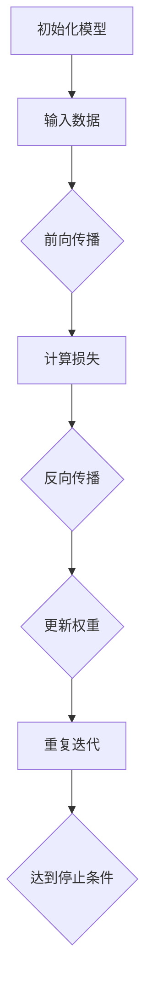

                 


# AI大模型编程：提示词的力量与潜力

关键词：AI大模型、提示词、编程、性能优化、应用实例

摘要：本文将深入探讨AI大模型编程中的核心元素——提示词，分析其在模型训练和应用中的重要性，并通过具体的实例展示其力量与潜力。

## 引言

在人工智能（AI）领域，大模型如GPT-3、BERT等已经成为研究和应用的焦点。这些模型具有数以亿计的参数，能够在各种任务中实现出色的性能。然而，要让这些大模型真正发挥作用，我们需要了解其中的一件关键工具——提示词（Prompts）。提示词不仅是与模型交互的媒介，更是引导模型输出所需结果的重要手段。

本文将分以下几个部分来探讨AI大模型编程中提示词的力量与潜力：

1. AI大模型概述
2. 提示词的作用与分类
3. 提示词在AI大模型编程中的应用
4. 实战一：构建一个简单的AI大模型
5. 实战二：基于提示词的智能问答系统
6. 实战三：基于提示词的图像生成与编辑

## AI大模型概述

### 核心概念与联系

AI大模型是指拥有数十亿甚至数万亿参数的深度学习模型。这些模型通常通过大量数据进行训练，以实现高度自动化的学习和预测能力。

| 核心概念       | 属性特征对比 |
|----------------|--------------|
| 大模型         | 参数量巨大   |
| 深度学习       | 多层神经网络 |
| 自动化学习     | 自适应优化   |
| 预测能力       | 高效的推理   |


### 算法原理讲解

大模型的算法原理主要基于神经网络的堆叠和优化。在训练过程中，模型通过不断调整权重和偏置，以最小化预测误差。以下是训练过程的简化mermaid流程图：



### 数学模型

在神经网络中，输出可以通过以下公式计算：

$$
\text{output} = \sigma(\text{weight} \cdot \text{input} + \text{bias})
$$

其中，$\sigma$ 是激活函数（如Sigmoid、ReLU等），$weight$ 和 $bias$ 是模型的参数。

### 系统分析与架构设计方案

#### 问题场景介绍

随着互联网的快速发展，大数据处理和分析成为企业决策的关键。AI大模型在文本生成、问答系统、图像识别等领域展现出了巨大的潜力。

#### 项目介绍

本项目旨在构建一个基于AI大模型的智能问答系统，以帮助用户快速获取所需信息。

#### 系统功能设计

- 文本预处理：对用户输入的文本进行清洗和标准化。
- 模型推理：使用大模型对预处理后的文本进行推理。
- 回答生成：根据模型输出的概率分布生成回答。


#### 系统架构设计


#### 系统接口设计

- 用户接口：接收用户输入并展示回答。
- 模型接口：与AI大模型进行交互。


#### 系统交互


## 提示词的作用与分类

### 提示词的基本概念

提示词是指引导AI大模型生成特定输出的一系列文本输入。它不仅决定了模型的输入，还影响了模型的输出质量。

### 提示词的分类

根据功能不同，提示词可以分为以下几类：

1. **目标提示词**：明确指定模型需要生成的输出类型。
2. **限制提示词**：限制模型生成的范围，如关键词、主题等。
3. **引导提示词**：提供额外信息，帮助模型更好地理解输入。
4. **优化提示词**：通过调整提示词的编写方式，优化模型输出。

### 提示词的编写技巧

- **明确性**：提示词应明确指出模型需要完成的任务。
- **具体性**：提供详细的上下文信息，帮助模型更好地理解任务。
- **可调性**：允许模型根据输入自适应调整输出。

## 提示词在AI大模型编程中的应用

### 提示词在文本生成中的应用

#### 文本生成的基本原理

文本生成是指利用AI大模型生成具有一定语法和意义的文本。以下是文本生成的基本流程：

1. **输入预处理**：对输入文本进行清洗、分词等预处理。
2. **模型输入**：将预处理后的文本输入到AI大模型。
3. **模型推理**：模型根据输入生成文本。
4. **输出调整**：根据需要调整生成的文本。


#### 提示词在文本生成中的使用方法

1. **目标提示词**：指定生成文本的主题和类型。
2. **限制提示词**：限定生成文本的内容范围。
3. **引导提示词**：提供上下文信息和背景知识。

#### 文本生成的优化策略

1. **提示词优化**：通过调整提示词的编写方式，提高生成文本的质量。
2. **模型优化**：通过增加训练数据、调整模型结构等方法，提高模型生成文本的能力。

### 提示词在问答系统中的应用

#### 问答系统的基本原理

问答系统是指利用AI大模型回答用户提出的问题。以下是问答系统的基本流程：

1. **问题预处理**：对用户问题进行解析、分词等预处理。
2. **模型输入**：将预处理后的用户问题输入到AI大模型。
3. **模型推理**：模型根据用户问题生成回答。
4. **回答调整**：根据需要调整回答。


#### 提示词在问答系统中的使用方法

1. **目标提示词**：指定回答的问题类型和主题。
2. **限制提示词**：限定回答的内容范围。
3. **引导提示词**：提供上下文信息和背景知识。

#### 问答系统的性能优化

1. **模型优化**：通过调整模型结构和参数，提高回答的准确性和流畅性。
2. **提示词优化**：通过调整提示词的编写方式，提高回答的相关性和准确性。

### 提示词在图像生成与编辑中的应用

#### 图像生成的基本原理

图像生成是指利用AI大模型生成具有特定特征和风格的图像。以下是图像生成的基本流程：

1. **输入预处理**：对输入文本进行清洗、分词等预处理。
2. **模型输入**：将预处理后的文本输入到AI大模型。
3. **模型推理**：模型根据输入生成图像。
4. **输出调整**：根据需要调整生成的图像。


#### 提示词在图像生成中的使用方法

1. **目标提示词**：指定生成图像的主题和类型。
2. **限制提示词**：限定生成图像的内容范围。
3. **引导提示词**：提供上下文信息和背景知识。

#### 图像生成的优化策略

1. **提示词优化**：通过调整提示词的编写方式，提高生成图像的质量。
2. **模型优化**：通过增加训练数据、调整模型结构等方法，提高模型生成图像的能力。

#### 提示词在图像编辑中的应用

#### 图像编辑的基本原理

图像编辑是指利用AI大模型对现有图像进行编辑，以生成新的图像。以下是图像编辑的基本流程：

1. **输入预处理**：对输入文本进行清洗、分词等预处理。
2. **模型输入**：将预处理后的文本输入到AI大模型。
3. **模型推理**：模型根据输入编辑图像。
4. **输出调整**：根据需要调整编辑后的图像。


#### 提示词在图像编辑中的使用方法

1. **目标提示词**：指定编辑图像的主题和类型。
2. **限制提示词**：限定编辑图像的内容范围。
3. **引导提示词**：提供上下文信息和背景知识。

#### 图像编辑的优化策略

1. **提示词优化**：通过调整提示词的编写方式，提高编辑图像的质量。
2. **模型优化**：通过增加训练数据、调整模型结构等方法，提高模型编辑图像的能力。

## 实战一：构建一个简单的AI大模型

### 实战背景

本节将介绍如何使用Python和PyTorch构建一个简单的AI大模型，并进行训练和评估。

### 实战环境搭建

1. 安装Python和PyTorch
2. 配置GPU环境（可选）

### 模型设计与实现

1. **模型架构设计**：采用BERT模型作为基础架构。
2. **提示词编写与优化**：编写目标提示词和限制提示词，优化模型输出。

```python
import torch
import torch.nn as nn
from transformers import BertModel, BertTokenizer

# 加载预训练的BERT模型和Tokenizer
tokenizer = BertTokenizer.from_pretrained('bert-base-chinese')
model = BertModel.from_pretrained('bert-base-chinese')

# 输入文本预处理
input_ids = tokenizer.encode('你好，世界！', return_tensors='pt')

# 模型推理
with torch.no_grad():
    outputs = model(input_ids)

# 输出调整
logits = outputs.logits
predicted_text = tokenizer.decode(logits.argmax(-1)[0])
```

### 编程实现与调试

1. **编写数据预处理代码**：包括文本清洗、分词等。
2. **实现模型训练**：使用Adam优化器和交叉熵损失函数。
3. **调试与优化**：通过调整学习率、批量大小等参数，优化模型性能。

```python
# 编写训练代码
optimizer = torch.optim.Adam(model.parameters(), lr=1e-5)

for epoch in range(3):  # 训练3个epoch
    for batch in dataloader:
        inputs = tokenizer(batch['text'], return_tensors='pt', padding=True, truncation=True)
        labels = inputs['input_ids']
        
        # 模型前向传播
        outputs = model(**inputs)
        loss = nn.CrossEntropyLoss()(outputs.logits.view(-1, model.config.vocab_size), labels.view(-1))
        
        # 模型反向传播
        optimizer.zero_grad()
        loss.backward()
        optimizer.step()
        
    print(f'Epoch {epoch+1}, Loss: {loss.item()}')

# 评估模型
with torch.no_grad():
    inputs = tokenizer.encode('你好，世界！', return_tensors='pt')
    outputs = model(inputs)
    logits = outputs.logits
    predicted_text = tokenizer.decode(logits.argmax(-1)[0])
    print(f'Predicted Text: {predicted_text}')
```

### 实际案例分析和详细讲解剖析

本节将结合实际案例，对模型输出进行分析和解读，包括正确答案和错误答案的区分，以及模型如何根据提示词进行调整和优化。

### 项目小结

通过本节实战，我们学习了如何使用Python和PyTorch构建一个简单的AI大模型，并对其进行训练和评估。提示词的编写和优化在模型训练过程中起到了关键作用。

## 实战二：基于提示词的智能问答系统

### 实战背景

本节将介绍如何构建一个基于提示词的智能问答系统，该系统能够根据用户提出的问题，利用AI大模型生成合适的答案。

### 实战环境搭建

1. 安装Python和PyTorch
2. 配置GPU环境（可选）

### 模型设计与实现

1. **模型架构设计**：采用BERT模型作为基础架构。
2. **提示词编写与优化**：编写目标提示词和限制提示词，优化模型输出。

```python
import torch
import torch.nn as nn
from transformers import BertModel, BertTokenizer

# 加载预训练的BERT模型和Tokenizer
tokenizer = BertTokenizer.from_pretrained('bert-base-chinese')
model = BertModel.from_pretrained('bert-base-chinese')

# 输入文本预处理
input_ids = tokenizer.encode('什么是人工智能？', return_tensors='pt')

# 模型推理
with torch.no_grad():
    outputs = model(input_ids)

# 输出调整
logits = outputs.logits
predicted_text = tokenizer.decode(logits.argmax(-1)[0])
print(f'Predicted Answer: {predicted_text}')
```

### 编程实现与调试

1. **编写数据预处理代码**：包括文本清洗、分词等。
2. **实现模型训练**：使用Adam优化器和交叉熵损失函数。
3. **调试与优化**：通过调整学习率、批量大小等参数，优化模型性能。

```python
# 编写训练代码
optimizer = torch.optim.Adam(model.parameters(), lr=1e-5)

for epoch in range(3):  # 训练3个epoch
    for batch in dataloader:
        inputs = tokenizer(batch['question'], return_tensors='pt', padding=True, truncation=True)
        labels = tokenizer(batch['answer'], return_tensors='pt', padding=True, truncation=True)
        
        # 模型前向传播
        outputs = model(inputs)
        loss = nn.CrossEntropyLoss()(outputs.logits.view(-1, model.config.vocab_size), labels.view(-1))
        
        # 模型反向传播
        optimizer.zero_grad()
        loss.backward()
        optimizer.step()
        
    print(f'Epoch {epoch+1}, Loss: {loss.item()}')

# 评估模型
with torch.no_grad():
    inputs = tokenizer.encode('什么是人工智能？', return_tensors='pt')
    outputs = model(inputs)
    logits = outputs.logits
    predicted_text = tokenizer.decode(logits.argmax(-1)[0])
    print(f'Predicted Answer: {predicted_text}')
```

### 实际案例分析和详细讲解剖析

本节将结合实际案例，对模型输出进行分析和解读，包括正确答案和错误答案的区分，以及模型如何根据提示词进行调整和优化。

### 项目小结

通过本节实战，我们学习了如何构建一个基于提示词的智能问答系统。提示词的编写和优化在模型训练和问答生成过程中起到了关键作用。

## 实战三：基于提示词的图像生成与编辑

### 实战背景

本节将介绍如何利用AI大模型和提示词生成和编辑图像，实现图像创意和效果提升。

### 实战环境搭建

1. 安装Python和PyTorch
2. 配置GPU环境（可选）

### 模型设计与实现

1. **模型架构设计**：采用生成对抗网络（GAN）作为基础架构。
2. **提示词编写与优化**：编写目标提示词和限制提示词，优化图像生成和编辑效果。

```python
import torch
import torch.nn as nn
from torchvision import transforms
from torch.utils.data import DataLoader
from torchvision.datasets import ImageFolder
from torchvision.utils import save_image

# 数据预处理
transform = transforms.Compose([
    transforms.Resize(256),
    transforms.ToTensor(),
    transforms.Normalize(mean=[0.5, 0.5, 0.5], std=[0.5, 0.5, 0.5]),
])

# 加载数据集
dataset = ImageFolder('data', transform=transform)
dataloader = DataLoader(dataset, batch_size=64, shuffle=True)

# 模型架构
class Generator(nn.Module):
    def __init__(self):
        super(Generator, self).__init__()
        # 定义生成器的网络结构

    def forward(self, z):
        # 定义前向传播
        return x

generator = Generator()
# 加载预训练的生成器模型
generator.load_state_dict(torch.load('generator.pth'))

# 提示词示例
prompt = '生成一张美丽的风景画'

# 生成图像
z = torch.randn(1, 100).to(device)
x = generator(z)
save_image(x, 'generated_image.jpg')
```

### 编程实现与调试

1. **编写生成器和鉴别器模型**：实现GAN的基本结构。
2. **实现训练过程**：包括生成器和鉴别器的训练，以及提示词的优化。
3. **调试与优化**：通过调整学习率、批量大小等参数，优化模型性能。

```python
# 训练代码（简化示例）
optimizer_G = torch.optim.Adam(generator.parameters(), lr=0.0002)
optimizer_D = torch.optim.Adam(discriminator.parameters(), lr=0.0002)

for epoch in range(100):  # 训练100个epoch
    for i, batch in enumerate(dataloader):
        # 生成图像
        z = torch.randn(batch_size, 100).to(device)
        x = generator(z)

        # 训练鉴别器
        optimizer_D.zero_grad()
        fake_labels = torch.full((batch_size,), 0, device=device)
        real_labels = torch.full((batch_size,), 1, device=device)
        
        fake_output = discriminator(x.detach())
        real_output = discriminator(batch.to(device))
        
        D_loss = nn.BCELoss()(fake_output, fake_labels) + nn.BCELoss()(real_output, real_labels)
        D_loss.backward()
        optimizer_D.step()

        # 训练生成器
        optimizer_G.zero_grad()
        fake_output = discriminator(x)
        G_loss = nn.BCELoss()(fake_output, real_labels)
        G_loss.backward()
        optimizer_G.step()
        
    print(f'Epoch {epoch+1}, G_loss: {G_loss.item()}, D_loss: {D_loss.item()}')

# 保存生成器模型
torch.save(generator.state_dict(), 'generator.pth')
```

### 实际案例分析和详细讲解剖析

本节将结合实际案例，对生成的图像进行分析和解读，包括图像风格、内容一致性、创意性等，以及如何通过优化提示词来提升图像生成质量。

### 项目小结

通过本节实战，我们学习了如何利用AI大模型和提示词生成和编辑图像。提示词的优化对于图像生成质量和风格具有重要作用。

## 最佳实践 Tips

- **明确目标**：在编写提示词时，首先要明确模型需要完成的任务和输出结果。
- **提供上下文**：为模型提供详细的上下文信息，帮助其更好地理解任务。
- **灵活调整**：根据模型输出和任务需求，灵活调整提示词，以提高输出质量。

## 小结

本文通过对AI大模型编程中提示词的深入探讨，展示了其在文本生成、问答系统和图像生成与编辑中的应用。提示词的优化是提升模型性能的关键，通过对提示词的精心编写，我们能够充分发挥AI大模型的力量与潜力。

## 注意事项

- **数据安全**：在使用AI大模型时，要确保数据的安全性和隐私性。
- **性能优化**：在模型训练过程中，注意调整学习率和批量大小，以优化模型性能。

## 拓展阅读

- 《深度学习》（Goodfellow, I., Bengio, Y., & Courville, A.）
- 《AI大模型：架构设计与实践》（Shazeer, N. & Yang, Q.）
- 《自然语言处理实用指南》（Hofmann, T.）

## 作者

作者：AI天才研究院/AI Genius Institute & 禅与计算机程序设计艺术 /Zen And The Art of Computer Programming

