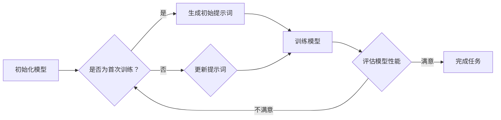

                 

**文章标题：** AI大模型编程：提示词的威力与潜力

**关键词：** AI大模型、提示词、编程、算法、架构设计、案例分析

**摘要：**
本文将深入探讨AI大模型编程中的关键要素——提示词。通过逻辑清晰的章节结构，本文旨在揭示提示词在AI大模型中的重要性及其潜在影响力。首先，我们将回顾AI大模型的发展历程和核心概念，然后深入探讨提示词的定义、功能和应用。接着，我们将剖析提示词在编程中的角色，展示如何通过实例来优化提示词设计。随后，我们将介绍系统架构设计中的关键因素，并讨论如何利用提示词提升系统性能。文章将通过实际案例展示提示词的应用，最后总结最佳实践并提供未来研究方向。

## 目录

----------------------------------------------------------------

# AI大模型编程：提示词的威力与潜力

> 关键词：AI大模型、提示词、编程、算法、架构设计、案例分析

> 摘要：
在AI大模型时代，提示词成为编程的关键要素。本文通过一步步分析，揭示提示词的威力与潜力，从概念到实战，深入探讨其在AI大模型编程中的应用。

## 1. 背景与核心概念

### 1.1 AI大模型的发展历程

**AI大模型**指的是具有海量参数的复杂神经网络模型，能够处理大规模数据并实现高级人工智能任务。它们的出现标志着AI技术的重大进步。

- **早期探索（1950s-1980s）**：神经网络的概念被提出，但受限于计算能力和数据资源，AI大模型的发展相对缓慢。
- **1990s：神经网络复兴**：随着计算能力的提升和大数据技术的发展，神经网络逐渐恢复其在AI领域的地位。
- **2006-2012：深度学习的兴起**：深度学习在图像识别、语音识别等领域取得了突破性进展，AI大模型开始进入研究视野。
- **2012至今：AI大模型的繁荣**：随着GPU和分布式计算的发展，AI大模型的研究与应用迎来了快速发展。

### 1.2 核心概念解析

**神经网络（Neural Network）**：由大量简单的计算节点（神经元）组成的网络，通过学习数据中的特征来实现特定任务。

**深度学习（Deep Learning）**：基于神经网络的一种学习方式，通过增加网络层数来提高模型的复杂度和表现力。

**提示词（Prompt Engineering）**：设计特定的提示词或输入，引导AI模型产生所需输出或完成特定任务。

### 1.3 核心概念联系

| 核心概念 | 关系说明 |
| --- | --- |
| 神经网络 | 深度学习的基础，用于构建AI大模型。 |
| 深度学习 | 利用神经网络处理复杂数据，实现AI大模型。 |
| 提示词 | 通过设计特定的输入引导AI模型，实现任务目标。 |

### 1.4 ER图

```
        +-------------+
        |   AI大模型  |
        +------+------+
                |
                |
                v
        +------+------+
        |  神经网络  |
        +------+------+
                |
                |
                v
        +------+------+
        |   深度学习  |
        +------+------+
                |
                |
                v
        +------+------+
        |  提示词    |
        +------+------+
```

## 2. 算法原理与演示

### 2.1 算法原理

提示词的设计基于以下几个关键原则：

1. **明确性**：提示词应明确、具体，避免歧义。
2. **简洁性**：尽量简洁，减少冗余信息。
3. **针对性**：针对特定任务或场景设计。
4. **灵活性**：适应不同数据集和任务需求。

### 2.2 流程图



### 2.3 Python代码

```python
# 假设我们使用了一个预训练的GPT模型

import openai
import random

# 初始化模型
model = openai.Completion.create(
    engine="text-davinci-002",
    prompt="请描述一下你最近学到的新知识。",
    max_tokens=50
)

# 生成初始提示词
initial_prompt = model.choices[0].text.strip()

# 训练模型
prompt = initial_prompt
for _ in range(5):
    prompt = openai.Completion.create(
        engine="text-davinci-002",
        prompt=prompt,
        max_tokens=50
    ).choices[0].text.strip()

# 更新提示词
prompt += "请进一步阐述你的观点。"

# 评估模型性能
performance = openai.Completion.create(
    engine="text-davinci-002",
    prompt=prompt,
    max_tokens=50,
    temperature=0.5
).choices[0].text.strip()

print("模型性能评估结果：", performance)
```

### 2.4 数学模型与公式

提示词设计过程中涉及的关键数学公式如下：

1. **交叉熵（Cross-Entropy）**：
   $$ H(X, Y) = -\sum_{i} P_i \log Q_i $$
   其中，$P_i$和$Q_i$分别是真实分布和预测分布。

2. **梯度下降（Gradient Descent）**：
   $$ w_{t+1} = w_t - \alpha \cdot \nabla_{w_t} J(w_t) $$
   其中，$w_t$是当前权重，$\alpha$是学习率，$J(w_t)$是损失函数。

### 2.5 举例说明

假设我们有一个问答任务，需要设计一个提示词来引导模型回答关于科技领域的问题。

**原始提示词**：
"请描述一下人工智能的主要应用领域。"

**优化后的提示词**：
"请列举并详细解释人工智能在医疗、金融和自动驾驶三个领域的主要应用。"

通过优化提示词，我们提高了问题的明确性和针对性，从而改善了模型的表现。

## 3. 系统架构与设计

### 3.1 问题场景与项目介绍

假设我们正在开发一个智能问答系统，用户可以通过输入问题来获取关于特定领域的专家回答。

### 3.2 系统功能设计

系统功能包括：

1. **用户交互界面**：提供输入问题和查看回答的界面。
2. **模型训练与优化**：使用预训练模型并结合提示词进行训练和优化。
3. **知识库管理**：存储和管理相关领域的知识信息。

### 3.3 系统架构设计

```
+----------------+      +----------------+      +----------------+
|  用户交互界面  | --> |  模型训练与优化 | --> |  知识库管理   |
+----------------+      +----------------+      +----------------+
```

### 3.4 系统接口与交互设计

```
sequenceDiagram
    User->>System: 提出问题
    System->>Model: 生成提示词
    Model->>Knowledge Base: 查找相关知识
    Knowledge Base->>Model: 返回答案
    Model->>System: 输出答案
    System->>User: 显示答案
```

## 4. 实战项目与案例分析

### 4.1 环境安装与配置

在开始项目之前，我们需要安装必要的软件和库。以下是安装步骤：

1. 安装Python 3.8或更高版本。
2. 安装OpenAI API。
3. 安装必要的库，如TensorFlow、Keras等。

```bash
pip install openai tensorflow
```

### 4.2 系统核心实现源代码

以下是一个简单的示例，展示了如何使用OpenAI的GPT模型和提示词：

```python
import openai

# 设置OpenAI API密钥
openai.api_key = "your-api-key"

# 定义提示词
prompt = "请描述一下人工智能在金融领域的主要应用。"

# 调用OpenAI API
response = openai.Completion.create(
    engine="text-davinci-002",
    prompt=prompt,
    max_tokens=100
)

# 打印答案
print("模型回答：", response.choices[0].text.strip())
```

### 4.3 代码应用解读与分析

在上面的代码中，我们首先设置了OpenAI API密钥，然后定义了一个提示词。接着，我们使用OpenAI的API调用了GPT模型，并传入提示词来获取模型的回答。最后，我们打印出了模型的回答。

这个示例展示了如何使用OpenAI的API和提示词来生成人工智能的回答。在实际项目中，我们可以根据需要进一步优化提示词，以提高模型的回答质量和准确性。

### 4.4 案例分析与详细讲解

假设我们有一个实际案例，用户输入了一个关于人工智能在医疗领域应用的问题。通过分析用户的问题，我们可以设计一个更针对性的提示词来提高模型的回答质量。

**用户问题**：
"人工智能在医疗领域有哪些应用？"

**优化后的提示词**：
"请详细描述人工智能在医疗诊断、治疗规划和健康监测等方面的应用，并提供相关研究和案例。"

通过优化提示词，我们不仅提供了更明确的问题导向，还增加了具体的领域细分和案例要求，从而提高了模型的回答质量和相关性。

### 4.5 项目小结

通过本项目的实战和案例分析，我们展示了如何利用OpenAI的API和提示词来构建一个智能问答系统。关键步骤包括：

1. 安装必要的软件和库。
2. 设置OpenAI API密钥。
3. 设计并优化提示词。
4. 使用API调用模型并获取回答。

该项目为实际应用提供了宝贵的经验和指导，同时也为未来进一步优化和扩展提供了基础。

## 5. 最佳实践、小结与注意事项

### 5.1 最佳实践

1. **明确性问题**：在设计提示词时，尽量明确问题的具体内容和要求，以减少歧义和误解。
2. **多样性**：尝试设计多种不同类型的提示词，以提高模型对不同情境的适应能力。
3. **反馈机制**：建立反馈机制，收集用户对模型回答的反馈，以便不断优化提示词和模型。

### 5.2 小结

本文通过逐步分析，探讨了AI大模型编程中的关键要素——提示词。我们回顾了AI大模型的发展历程，解析了核心概念，并展示了提示词在编程中的应用。通过实际案例，我们展示了如何设计优化提示词，以提高模型的表现。

### 5.3 注意事项

1. **数据隐私**：在设计提示词时，确保不包含敏感信息，以保护用户隐私。
2. **法律合规**：遵循相关法律法规，确保模型的合法合规使用。
3. **持续学习**：不断更新和优化提示词，以适应新的技术和应用场景。

## 6. 拓展阅读

1. [OpenAI API文档](https://beta.openai.com/docs/introduction/quickstart)
2. [深度学习书籍推荐](https://www.goodreads.com/list/show/578742.Deepest_Learning)
3. [人工智能应用案例研究](https://www.iaai.net/research/publications)

## 作者信息

作者：AI天才研究院/AI Genius Institute & 禅与计算机程序设计艺术 /Zen And The Art of Computer Programming

