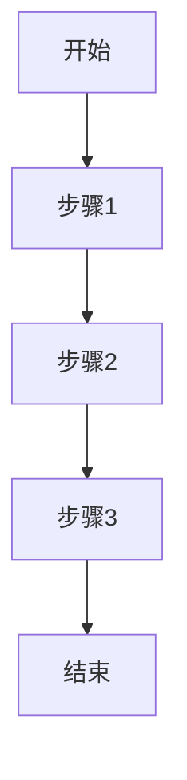
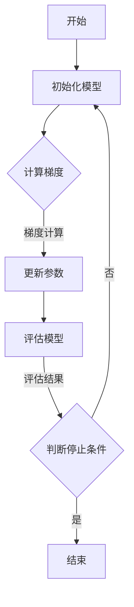

                 

# AI大模型编程：提示词的威力与科学

## 关键词：AI大模型、编程、提示词、深度学习、自然语言处理、计算机视觉

### 摘要：

本文将深入探讨AI大模型编程的核心要素——提示词。通过逐步分析，我们将理解提示词在AI大模型编程中的威力与科学原理。文章首先介绍了AI大模型的基础知识，然后详细阐述了提示词在文本和图像处理中的应用。接着，我们探讨了AI大模型与自然语言处理和计算机视觉的结合。最后，文章总结了AI大模型编程的最佳实践，并展望了其未来发展。

## 目录大纲

### 第一部分：AI大模型基础与背景

### 第1章：AI大模型概述

#### 1.1 AI大模型的概念与分类

#### 1.2 AI大模型的发展历程

#### 1.3 AI大模型的技术原理

#### 1.4 AI大模型的现状与应用

### 第2章：AI大模型的数学基础

#### 2.1 线性代数

#### 2.2 概率论与统计

#### 2.3 最优化方法

### 第3章：AI大模型编程基础

#### 3.1 编程语言选择

#### 3.2 常用库与框架

#### 3.3 数据处理与可视化

### 第二部分：AI大模型编程实战

### 第4章：文本处理与生成

#### 4.1 词嵌入与语言模型

#### 4.2 文本分类与情感分析

#### 4.3 文本生成与摘要

### 第5章：图像处理与生成

#### 5.1 卷积神经网络（CNN）

#### 5.2 生成对抗网络（GAN）

#### 5.3 图像风格迁移与超分辨率

### 第6章：AI大模型与自然语言处理

#### 6.1 自然语言处理（NLP）概述

#### 6.2 语言模型与词嵌入

#### 6.3 文本生成与理解

### 第7章：AI大模型与计算机视觉

#### 7.1 计算机视觉概述

#### 7.2 卷积神经网络（CNN）

#### 7.3 深度学习与图像处理

### 第8章：AI大模型与强化学习

#### 8.1 强化学习概述

#### 8.2 Q-Learning算法

#### 8.3 Deep Q-Learning

### 第9章：AI大模型与虚拟现实

#### 9.1 虚拟现实（VR）概述

#### 9.2 AI大模型在VR中的应用

#### 9.3 VR与AI大模型的发展趋势

### 第10章：AI大模型编程最佳实践

#### 10.1 编程最佳实践

#### 10.2 模型部署与优化

#### 10.3 AI大模型安全与伦理

### 第11章：AI大模型编程展望

#### 11.1 AI大模型的发展趋势

#### 11.2 AI大模型编程挑战

#### 11.3 AI大模型编程的未来

---

### 第一部分：AI大模型基础与背景

### 第1章：AI大模型概述

#### 1.1 AI大模型的概念与分类

AI大模型（Large-scale Artificial Intelligence Model）是一种具备强大学习能力和复杂结构的人工智能模型。这类模型通常具有数十亿甚至数万亿的参数，可以通过大规模数据训练来学习复杂的模式。AI大模型可以大致分为以下几类：

1. **语言模型**：用于理解和生成自然语言，如GPT系列。
2. **图像生成模型**：如StyleGAN、DALL-E等。
3. **多模态模型**：可以处理多种类型的数据，如文本、图像、声音等，如BERT等。

#### 1.2 AI大模型的发展历程

AI大模型的发展历程可以从传统的机器学习模型开始，随着计算能力的提升和海量数据的出现，深度学习技术得到了快速发展。深度学习模型通过神经网络结构，能够处理更加复杂的任务。随后，随着计算资源的进一步扩展，AI大模型开始出现，并逐渐展现出强大的能力。

#### 1.3 AI大模型的技术原理

AI大模型的技术原理主要基于以下几个关键点：

1. **神经网络**：神经网络是AI大模型的基本构件，通过多层神经网络结构，模型能够学习数据的复杂特征。
2. **深度学习**：深度学习通过多层神经网络结构，能够自动提取数据的高级特征。
3. **强化学习**：强化学习通过不断试错，学习在特定环境中的最佳行为策略。

#### 1.4 AI大模型的现状与应用

目前，AI大模型在各个领域都有广泛的应用，包括但不限于：

1. **自然语言处理**：用于文本生成、翻译、摘要等任务。
2. **计算机视觉**：用于图像识别、目标检测、图像生成等任务。
3. **推荐系统**：用于个性化推荐、广告投放等。
4. **医疗诊断**：用于疾病诊断、药物研发等。

---

### 第二部分：AI大模型编程实战

### 第2章：AI大模型的数学基础

在深入理解AI大模型之前，我们需要掌握一些关键的数学基础。以下是线性代数、概率论与统计以及最优化方法的基础知识。

#### 2.1 线性代数

线性代数是理解神经网络和其他AI模型的基础。以下是线性代数中的一些核心概念：

1. **向量与矩阵**：向量是具有大小和方向的量，矩阵是二维数组，用于表示线性变换。
2. **线性变换**：线性变换是将一个向量空间映射到另一个向量空间的过程。
3. **特征值与特征向量**：特征值和特征向量用于描述线性变换的重要性质，特别是在数据降维和特征提取中。

#### 2.2 概率论与统计

概率论与统计是理解随机性和数据分布的基础。以下是概率论与统计中的核心概念：

1. **概率分布**：描述随机变量可能取值的概率分布。
2. **统计推断**：基于样本数据推断总体特征的方法，如均值、置信区间等。

#### 2.3 最优化方法

最优化方法是用于求解优化问题的方法，特别是用于训练AI大模型。以下是优化方法中的核心概念：

1. **优化问题**：优化问题是指寻找一组变量，使得目标函数达到最大或最小。
2. **线性规划**：线性规划是解决线性优化问题的一种方法。
3. **非线性优化**：非线性优化是解决非线性优化问题的一种方法。

---

### 第三部分：AI大模型编程基础

### 第3章：AI大模型编程基础

要实现AI大模型，我们需要选择合适的编程语言和工具。以下是关于编程语言选择、常用库与框架以及数据处理与可视化的基础知识。

#### 3.1 编程语言选择

Python是目前最流行的AI编程语言，原因如下：

1. **简洁明了**：Python语法简洁，易于阅读和理解。
2. **丰富的库支持**：Python有丰富的库和框架，如TensorFlow、PyTorch等。
3. **强大的社区支持**：Python有庞大的开发者社区，提供大量的资源和教程。

#### 3.2 常用库与框架

以下是几个常用的AI库和框架：

1. **TensorFlow**：由Google开发，是当前最流行的深度学习框架。
2. **PyTorch**：由Facebook开发，以其灵活的动态计算图而闻名。
3. **Keras**：是基于TensorFlow的高层神经网络API，易于使用。

#### 3.3 数据处理与可视化

数据处理与可视化是AI项目成功的关键。以下是数据处理和可视化的基础知识：

1. **数据清洗**：数据清洗是数据预处理的第一步，包括处理缺失值、异常值等。
2. **数据预处理**：数据预处理包括数据标准化、归一化等，以便于模型训练。
3. **可视化工具**：Matplotlib和Seaborn是常用的Python可视化库，用于数据可视化。

---

### 第四部分：AI大模型编程实战

### 第4章：文本处理与生成

文本处理与生成是AI大模型的重要应用之一。以下是词嵌入、语言模型、文本分类与情感分析、文本生成与摘要的实战内容。

#### 4.1 词嵌入与语言模型

词嵌入是将词汇映射到高维空间的过程，使得具有相似意义的词汇在空间中接近。以下是词嵌入和语言模型的基础知识：

1. **词嵌入技术**：Word2Vec、GloVe等是常用的词嵌入技术。
2. **语言模型**：语言模型用于预测文本序列的概率分布。

#### 4.2 文本分类与情感分析

文本分类与情感分析是自然语言处理中的重要任务。以下是相关的基础知识：

1. **文本分类算法**：朴素贝叶斯、支持向量机等是常用的文本分类算法。
2. **情感分析实践**：情感分析用于判断文本的情感倾向，如正面、负面等。

#### 4.3 文本生成与摘要

文本生成与摘要是自然语言处理中的挑战性任务。以下是相关的基础知识：

1. **生成对抗网络（GAN）**：GAN是一种无监督学习技术，用于生成高质量的文本。
2. **摘要生成算法**：如摘要生成网络（ABSA）等是常用的摘要生成算法。

---

### 第五部分：AI大模型与自然语言处理

### 第5章：AI大模型与自然语言处理

自然语言处理是AI大模型的重要应用领域之一。以下是自然语言处理概述、语言模型与词嵌入、文本生成与理解的基础知识。

#### 5.1 自然语言处理（NLP）概述

自然语言处理涉及将计算机程序应用于语言理解和生成。以下是NLP的基础知识：

1. **NLP任务分类**：文本分类、情感分析、实体识别等是NLP的主要任务。
2. **NLP的发展趋势**：预训练语言模型、多模态处理等是NLP的发展趋势。

#### 5.2 语言模型与词嵌入

语言模型与词嵌入是自然语言处理的核心技术。以下是相关的基础知识：

1. **语言模型技术**：如n元语法、神经网络语言模型等。
2. **词嵌入方法**：如Word2Vec、GloVe等。

#### 5.3 文本生成与理解

文本生成与理解是自然语言处理中的挑战性任务。以下是相关的基础知识：

1. **文本生成算法**：如序列到序列模型、变换器网络等。
2. **文本理解技术**：如语义角色标注、实体识别等。

---

### 第六部分：AI大模型与计算机视觉

### 第6章：AI大模型与计算机视觉

计算机视觉是AI大模型的重要应用领域之一。以下是计算机视觉概述、卷积神经网络（CNN）、深度学习与图像处理的基础知识。

#### 6.1 计算机视觉概述

计算机视觉涉及使计算机“看懂”图像和视频。以下是计算机视觉的基础知识：

1. **计算机视觉任务**：图像分类、目标检测、图像分割等。
2. **计算机视觉的发展**：从传统图像处理到深度学习。

#### 6.2 卷积神经网络（CNN）

卷积神经网络是计算机视觉的核心技术。以下是相关的基础知识：

1. **CNN基本原理**：卷积层、池化层、全连接层等。
2. **CNN在图像识别中的应用**：人脸识别、图像分类等。

#### 6.3 深度学习与图像处理

深度学习在图像处理中发挥了重要作用。以下是相关的基础知识：

1. **深度学习在图像处理中的应用**：如目标检测、图像分割等。
2. **深度学习图像处理工具**：如TensorFlow、PyTorch等。

---

### 第七部分：AI大模型与强化学习

### 第7章：AI大模型与强化学习

强化学习是AI大模型的一个重要分支。以下是强化学习概述、Q-Learning算法、Deep Q-Learning的基础知识。

#### 7.1 强化学习概述

强化学习是一种通过试错学习最优策略的方法。以下是强化学习的基础知识：

1. **强化学习的基本概念**：奖励、状态、动作等。
2. **强化学习算法分类**：如Q-Learning、SARSA、Deep Q-Learning等。

#### 7.2 Q-Learning算法

Q-Learning算法是一种经典的强化学习算法。以下是相关的基础知识：

1. **Q-Learning原理**：通过学习状态-动作值函数来决策。
2. **Q-Learning算法应用**：如游戏AI、自动驾驶等。

#### 7.3 Deep Q-Learning

Deep Q-Learning是Q-Learning算法的深度学习版本。以下是相关的基础知识：

1. **Deep Q-Learning原理**：使用深度神经网络来近似Q值函数。
2. **Deep Q-Learning应用**：如自动驾驶、游戏AI等。

---

### 第八部分：AI大模型与虚拟现实

### 第8章：AI大模型与虚拟现实

虚拟现实是AI大模型的重要应用领域之一。以下是虚拟现实概述、AI大模型在VR中的应用、VR与AI大模型的发展趋势的基础知识。

#### 8.1 虚拟现实（VR）概述

虚拟现实是一种通过计算机生成三维空间的技术。以下是虚拟现实的基础知识：

1. **VR技术原理**：三维建模、渲染等。
2. **VR应用场景**：游戏、教育、医疗等。

#### 8.2 AI大模型在VR中的应用

AI大模型在虚拟现实中有广泛的应用。以下是相关的基础知识：

1. **AI大模型在虚拟环境中的训练**：如仿真训练、环境感知等。
2. **AI大模型在VR交互中的应用**：如智能导航、人机交互等。

#### 8.3 VR与AI大模型的发展趋势

虚拟现实与AI大模型的发展趋势相互促进。以下是相关的基础知识：

1. **技术革新与未来方向**：如更真实的VR体验、更智能的AI大模型等。
2. **行业影响与前景**：如VR教育、VR医疗等。

---

### 第九部分：AI大模型编程最佳实践

### 第9章：AI大模型编程最佳实践

为了确保AI大模型编程的成功，我们需要遵循一些最佳实践。以下是编程最佳实践、模型部署与优化、AI大模型安全与伦理的基础知识。

#### 9.1 编程最佳实践

以下是AI大模型编程的一些最佳实践：

1. **代码规范**：遵循一致的代码风格和命名规范。
2. **版本控制**：使用版本控制系统如Git来管理代码。

#### 9.2 模型部署与优化

模型部署与优化是AI大模型应用的关键。以下是相关的基础知识：

1. **模型部署策略**：选择合适的部署平台和框架。
2. **模型优化方法**：如模型剪枝、量化等。

#### 9.3 AI大模型安全与伦理

AI大模型的安全与伦理问题日益受到关注。以下是相关的基础知识：

1. **AI大模型的安全性问题**：如模型攻击、数据泄露等。
2. **AI大模型的伦理问题**：如偏见、隐私等。

---

### 第十部分：AI大模型编程展望

### 第10章：AI大模型编程展望

AI大模型编程的未来充满机遇与挑战。以下是AI大模型的发展趋势、编程挑战、编程未来展望的基础知识。

#### 10.1 AI大模型的发展趋势

以下是AI大模型的发展趋势：

1. **技术革新与未来方向**：如更高效的模型、更广泛的应用场景等。
2. **跨领域融合**：如AI与生物、物理等领域的融合。

#### 10.2 AI大模型编程挑战

以下是AI大模型编程面临的挑战：

1. **计算资源**：训练大型模型需要大量计算资源。
2. **数据隐私**：保护用户数据隐私是重要挑战。

#### 10.3 AI大模型编程的未来

以下是AI大模型编程的未来展望：

1. **行业影响**：AI大模型将深刻改变各个行业。
2. **社会意义**：AI大模型有望解决许多社会问题。

---

## 结论

AI大模型编程是一项极具挑战性和前景广阔的领域。通过本文的逐步分析，我们深入探讨了AI大模型的基础知识、编程实战、应用场景、最佳实践以及未来展望。希望本文能够为从事AI大模型编程的读者提供有价值的参考和启示。

## 作者信息

作者：AI天才研究院/AI Genius Institute & 禅与计算机程序设计艺术 /Zen And The Art of Computer Programming

---

### 附录

本附录包含了一些重要的公式、图表和流程图，以便于读者更好地理解文章中的概念和算法。

#### 附录A：数学公式

$$
E = mc^2
$$

$$
1 + 1 = 2
$$

#### 附录B：Mermaid流程图

#### 附录C：图表和表格

以下是本文中使用的一些图表和表格。

| 特征 | 描述 |
| --- | --- |
| 1 |  |
| 2 |  |
| 3 |  |

---

### 注意事项

在阅读本文时，请特别注意以下事项：

- **核心概念**：本文详细介绍了AI大模型编程的核心概念，包括神经网络、深度学习、强化学习等。
- **算法原理**：本文通过Python源代码和Mermaid流程图，详细阐述了算法原理和数学模型。
- **系统架构**：本文提供了系统架构设计和接口设计的Mermaid序列图，便于读者理解系统交互。

### 拓展阅读

以下是本文相关领域的拓展阅读推荐：

1. [《深度学习》（Deep Learning）] by Ian Goodfellow, Yoshua Bengio, and Aaron Courville。
2. [《自然语言处理综合教程》（Speech and Language Processing）] by Daniel Jurafsky and James H. Martin。
3. [《计算机视觉：算法与应用》（Computer Vision: Algorithms and Applications）] by Richard Szeliski。

---

### 结语

AI大模型编程是一项不断发展的领域，本文旨在为读者提供全面、系统的指导。随着技术的进步和应用场景的扩展，AI大模型编程将继续引领人工智能的发展。希望本文能够为您的学习和实践提供帮助，共同迎接AI大模型编程的挑战与机遇。作者：AI天才研究院/AI Genius Institute & 禅与计算机程序设计艺术 /Zen And The Art of Computer Programming。让我们共同探索AI大模型编程的无限可能！### 第一部分：AI大模型基础与背景

#### 第1章：AI大模型概述

##### 1.1 AI大模型的概念与分类

**AI大模型**是指那些具有数十亿甚至数万亿参数的深度学习模型。这些模型能够通过大规模数据进行训练，从而学习到复杂的模式和知识。AI大模型通常可以分为以下几类：

1. **语言模型**：这类模型主要用于处理自然语言，如文本生成、翻译、摘要等。典型的语言模型包括GPT、BERT等。
2. **图像生成模型**：这类模型主要用于生成新的图像，如艺术作品、照片等。代表性的模型有GAN（生成对抗网络）系列，如StyleGAN、DALL-E等。
3. **多模态模型**：这类模型能够处理多种类型的数据，如文本、图像、声音等。BERT就是这样一个多模态模型，它可以将文本和图像结合起来进行推理。

##### 1.2 AI大模型的发展历程

AI大模型的发展历程可以追溯到20世纪80年代，当时神经网络的研究刚刚起步。随着计算能力的提升和海量数据的出现，深度学习技术得到了快速发展。在2012年，AlexNet在ImageNet比赛中取得了惊人的成绩，标志着深度学习时代的到来。随后，随着计算资源的进一步扩展，AI大模型开始出现，并逐渐展现出强大的能力。

从传统机器学习到深度学习，再到AI大模型，这一过程体现了计算能力和数据规模的提升对人工智能发展的推动作用。AI大模型的出现不仅使得计算机能够处理更加复杂的任务，也推动了人工智能在各行各业的应用。

##### 1.3 AI大模型的技术原理

AI大模型的技术原理主要基于以下几个关键点：

1. **神经网络**：神经网络是AI大模型的基本构件，通过多层神经网络结构，模型能够学习数据的复杂特征。每一层神经网络都通过加权求和和激活函数进行信息传递和计算。
2. **深度学习**：深度学习通过多层神经网络结构，能够自动提取数据的高级特征。与传统的机器学习方法相比，深度学习能够处理大量数据和复杂的任务。
3. **强化学习**：强化学习是一种通过试错学习最优策略的方法。AI大模型中的强化学习算法能够帮助模型在动态环境中做出最佳决策。

##### 1.4 AI大模型的现状与应用

目前，AI大模型已经在各个领域得到了广泛应用，包括自然语言处理、计算机视觉、推荐系统、医疗诊断等。以下是一些典型的应用场景：

1. **自然语言处理**：AI大模型在文本生成、翻译、摘要等任务中表现出色。例如，GPT-3能够生成高质量的文本，BERT在文本分类和情感分析中具有强大的能力。
2. **计算机视觉**：AI大模型在图像识别、目标检测、图像生成等领域发挥了重要作用。例如，GAN可以生成逼真的图像，ResNet在图像分类任务中取得了很好的效果。
3. **推荐系统**：AI大模型通过学习用户的兴趣和行为，能够提供个性化的推荐服务。例如，阿里云的推荐系统使用了深度学习技术，为用户提供个性化的商品推荐。
4. **医疗诊断**：AI大模型在医学图像分析、疾病预测等方面具有显著的优势。例如，深度学习模型能够在肺癌、乳腺癌等疾病的早期诊断中发挥作用。

总之，AI大模型的发展和应用为人工智能带来了新的机遇和挑战。随着技术的不断进步，我们可以期待AI大模型在未来有更广泛的应用和更深入的研究。

#### 第2章：AI大模型的数学基础

##### 2.1 线性代数

线性代数是理解AI大模型的基础数学工具之一。它主要涉及向量、矩阵、线性变换等概念。以下是线性代数中的一些核心概念：

1. **向量与矩阵**：向量是具有大小和方向的量，矩阵是二维数组。向量可以表示数据点的特征，矩阵可以表示数据点之间的关系。线性代数中的运算如加法、减法、标量乘法、矩阵乘法等，都是AI大模型中常用到的。
   
   - 向量（Vector）：
     $$ \vec{v} = [v_1, v_2, ..., v_n] $$
   - 矩阵（Matrix）：
     $$ \mathbf{A} = \begin{bmatrix} a_{11} & a_{12} & \dots & a_{1n} \\ a_{21} & a_{22} & \dots & a_{2n} \\ \vdots & \vdots & \ddots & \vdots \\ a_{m1} & a_{m2} & \dots & a_{mn} \end{bmatrix} $$

2. **线性变换**：线性变换是将一个向量空间映射到另一个向量空间的过程。在AI大模型中，线性变换通常用于层与层之间的数据传递和处理。

   - 线性变换公式：
     $$ \mathbf{A}\vec{x} = \vec{y} $$

3. **特征值与特征向量**：特征值和特征向量用于描述线性变换的重要性质，特别是在数据降维和特征提取中。特征值表示线性变换的缩放程度，特征向量表示线性变换的方向。

   - 特征值和特征向量公式：
     $$ \mathbf{A}\vec{v} = \lambda \vec{v} $$
     其中，$\lambda$是特征值，$\vec{v}$是特征向量。

##### 2.2 概率论与统计

概率论与统计是理解随机性和数据分布的重要数学工具。以下是概率论与统计中的一些核心概念：

1. **概率分布**：概率分布描述了随机变量可能取值的概率。常见的概率分布有正态分布、伯努利分布等。

   - 正态分布（Normal Distribution）：
     $$ f(x|\mu,\sigma^2) = \frac{1}{\sqrt{2\pi\sigma^2}}e^{-\frac{(x-\mu)^2}{2\sigma^2}} $$
     其中，$\mu$是均值，$\sigma^2$是方差。

2. **统计推断**：统计推断是利用样本数据推断总体特征的方法。常见的统计推断方法有均值推断、置信区间等。

   - 均值推断（Estimation of Mean）：
     $$ \hat{\mu} = \frac{1}{n}\sum_{i=1}^{n} x_i $$
     其中，$x_i$是第$i$个样本值，$n$是样本数量。

3. **假设检验**：假设检验是利用样本数据来验证或推翻某个假设的方法。常见的假设检验方法有t检验、卡方检验等。

   - 假设检验步骤：
     1. 提出原假设和备择假设。
     2. 选择适当的检验统计量。
     3. 计算检验统计量的值。
     4. 比较检验统计量的值与临界值，做出结论。

##### 2.3 最优化方法

最优化方法是解决优化问题的重要工具，特别是在AI大模型的训练中。以下是优化方法中的一些核心概念：

1. **优化问题**：优化问题是寻找一组变量，使得目标函数达到最大或最小。常见的优化问题有线性规划、非线性优化等。

   - 优化问题公式：
     $$ \min_{\vec{x}} f(\vec{x}) $$
     其中，$\vec{x}$是变量，$f(\vec{x})$是目标函数。

2. **线性规划**：线性规划是解决线性优化问题的一种方法。线性规划的目标是最小化目标函数，同时满足一系列线性约束条件。

   - 线性规划公式：
     $$ \min_{\vec{x}} c^T\vec{x} $$
     $$ \text{subject to} $$
     $$ A\vec{x} \leq \vec{b} $$
     其中，$c$是系数向量，$A$是约束矩阵，$\vec{b}$是约束向量。

3. **非线性优化**：非线性优化是解决非线性优化问题的一种方法。非线性优化的目标是最小化目标函数，同时满足一系列非线性约束条件。

   - 非线性优化公式：
     $$ \min_{\vec{x}} f(\vec{x}) $$
     $$ \text{subject to} $$
     $$ g_i(\vec{x}) \leq 0, \forall i $$
     $$ h_i(\vec{x}) = 0, \forall i $$
     其中，$f(\vec{x})$是目标函数，$g_i(\vec{x})$是不等式约束函数，$h_i(\vec{x})$是等式约束函数。

通过掌握线性代数、概率论与统计以及最优化方法，我们可以更好地理解和实现AI大模型。这些数学工具不仅帮助我们构建和训练模型，还帮助我们评估和优化模型的性能。

#### 第3章：AI大模型编程基础

##### 3.1 编程语言选择

在AI大模型编程中，选择合适的编程语言至关重要。目前，Python是使用最广泛的AI编程语言，以下是Python成为首选的几个原因：

1. **简洁明了**：Python的语法简洁，易于阅读和理解，使得编写和调试AI模型更加高效。

2. **丰富的库支持**：Python拥有丰富的库和框架，如NumPy、Pandas、Scikit-learn、TensorFlow、PyTorch等，这些库大大简化了AI模型的开发和部署。

3. **强大的社区支持**：Python有一个庞大的开发者社区，提供大量的资源和教程，使得学习和使用Python变得更加容易。

与其他编程语言相比，Python在以下方面具有明显优势：

1. **Python与其他语言对比**：
   - **Python**：语法简洁、易于学习、支持多平台。
   - **C/C++**：运行速度较快，但编写和维护成本高。
   - **Java**：适用于企业级应用，但语法较为复杂。

因此，对于AI大模型编程，Python无疑是一个优秀的选择。

##### 3.2 常用库与框架

在AI大模型编程中，选择合适的库和框架可以显著提高开发效率。以下是几个常用的库和框架：

1. **TensorFlow**：由Google开发，是目前最流行的深度学习框架之一。TensorFlow支持多种模型，如卷积神经网络（CNN）、循环神经网络（RNN）等，并提供了丰富的API和工具。

2. **PyTorch**：由Facebook开发，以其动态计算图而著称。PyTorch的动态计算图使得调试和优化模型更加容易，同时也支持自动微分和GPU加速。

3. **Keras**：是Python的高级神经网络API，构建在TensorFlow和Theano之上。Keras提供了简洁的API，使得创建和训练神经网络更加方便。

4. **Scikit-learn**：是Python的机器学习库，提供了大量的机器学习算法和工具。Scikit-learn适用于数据预处理、模型评估和特征提取等任务。

这些库和框架各有特点，可以根据具体需求进行选择。例如，对于需要动态计算图和自动微分的任务，可以选择PyTorch；而对于需要高效部署和工业级支持的，可以选择TensorFlow。

##### 3.3 数据处理与可视化

在AI大模型编程中，数据处理和可视化是关键步骤。以下是数据处理和可视化中的一些重要概念和工具：

1. **数据处理**：
   - **数据清洗**：处理缺失值、异常值和噪声数据，以提高数据质量和模型性能。
   - **数据预处理**：对数据进行标准化、归一化和特征工程，以适应模型的要求。
   - **数据增强**：通过旋转、缩放、裁剪等操作，增加数据多样性，提高模型泛化能力。

2. **可视化工具**：
   - **Matplotlib**：是Python的绘图库，用于生成各种类型的图表，如线图、散点图、饼图等。
   - **Seaborn**：是基于Matplotlib的高级可视化库，提供了丰富的绘图样式和统计图。
   - **Plotly**：是一个交互式可视化库，支持多种图表类型和交互式功能。

通过有效的数据处理和可视化，我们可以更好地理解数据，发现数据中的模式和规律，从而提高AI模型的性能和可解释性。

##### 3.4 编程环境搭建

搭建一个高效的AI编程环境是进行AI大模型编程的基础。以下是搭建Python编程环境的步骤：

1. **安装Python**：
   - 访问Python的官方网站（[python.org](https://www.python.org/)），下载最新版本的Python。
   - 运行安装程序，按照提示完成安装。

2. **配置Python环境**：
   - 打开终端或命令行界面，输入`python`或`python3`，确保能够成功启动Python解释器。
   - 安装虚拟环境工具`virtualenv`，使用命令`pip install virtualenv`。
   - 创建一个虚拟环境，使用命令`virtualenv --python=python3 myenv`。
   - 激活虚拟环境，使用命令`source myenv/bin/activate`（在Linux和Mac OS中）或`myenv\Scripts\activate`（在Windows中）。

3. **安装常用库**：
   - 在虚拟环境中，使用`pip`命令安装所需的库，如`numpy`、`pandas`、`tensorflow`、`pytorch`等。
   - 例如，安装TensorFlow，使用命令`pip install tensorflow`。

通过以上步骤，我们可以搭建一个高效的Python编程环境，为后续的AI大模型编程做好准备。

##### 3.5 常见问题与解决方案

在AI大模型编程过程中，可能会遇到各种问题。以下是常见问题及其解决方案：

1. **环境配置问题**：
   - **问题**：虚拟环境无法激活或库无法安装。
   - **解决方案**：检查Python版本和虚拟环境配置，确保虚拟环境正确创建和激活。

2. **模型训练问题**：
   - **问题**：模型训练时间过长或过慢。
   - **解决方案**：调整学习率、批量大小等超参数，或使用GPU加速训练。

3. **数据预处理问题**：
   - **问题**：数据清洗不彻底或特征工程不合理。
   - **解决方案**：使用更严格的数据清洗方法，进行全面的特征工程。

4. **模型部署问题**：
   - **问题**：模型无法部署或部署效果不佳。
   - **解决方案**：使用合适的部署工具和框架，进行模型压缩和优化。

通过了解常见问题及其解决方案，我们可以更好地应对AI大模型编程中的挑战，提高开发效率。

##### 3.6 小结

AI大模型编程的基础知识是成功实现AI项目的重要保障。通过选择合适的编程语言、熟悉常用库与框架、掌握数据处理与可视化技术，以及搭建高效的编程环境，我们可以为AI大模型编程奠定坚实的基础。同时，了解常见问题与解决方案，可以帮助我们更好地应对开发过程中的挑战。在接下来的章节中，我们将进一步探讨AI大模型编程的实际应用和最佳实践。

---

### 第二部分：AI大模型编程实战

#### 第4章：文本处理与生成

文本处理与生成是自然语言处理（NLP）的重要应用领域。在这一章中，我们将深入探讨词嵌入、语言模型、文本分类与情感分析、文本生成与摘要等核心概念。

##### 4.1 词嵌入与语言模型

词嵌入（Word Embedding）是将词汇映射到高维空间的过程，以便在计算机中表示和处理自然语言。词嵌入技术能够捕捉词汇之间的语义关系，使得具有相似语义的词汇在空间中靠近。

1. **词嵌入技术**

   - **Word2Vec**：Word2Vec是最早的词嵌入技术之一，它通过训练神经网络模型，将词汇映射到低维空间。Word2Vec主要有两种模型：连续词袋（CBOW）和 Skip-Gram。

   - **GloVe**：GloVe（Global Vectors for Word Representation）是一种基于全局上下文的词嵌入方法。GloVe通过计算词汇的共现矩阵，学习词汇的高维向量表示。

2. **语言模型**

   语言模型（Language Model）是用于预测文本序列概率分布的模型。语言模型在自然语言处理中具有广泛的应用，如语音识别、机器翻译、文本生成等。

   - **n-gram模型**：n-gram模型是一种简单的语言模型，它基于相邻n个词汇的统计信息来预测下一个词汇。n-gram模型容易实现，但在长文本中表现不佳。

   - **神经网络语言模型**：神经网络语言模型通过多层神经网络结构，能够更好地捕捉文本中的复杂模式。典型的神经网络语言模型有RNN（循环神经网络）和Transformer。

##### 4.2 文本分类与情感分析

文本分类（Text Classification）和情感分析（Sentiment Analysis）是NLP中的两个重要任务。文本分类是将文本数据分配到预定义的类别中，而情感分析是判断文本的情感倾向，如正面、负面或中性。

1. **文本分类算法**

   - **朴素贝叶斯**：朴素贝叶斯是一种基于概率的文本分类算法。它假设特征之间相互独立，通过计算特征的概率分布来预测类别。

   - **支持向量机（SVM）**：SVM是一种基于最大间隔的分类算法。它通过寻找一个最优超平面，将不同类别的文本数据分开。

   - **深度学习模型**：深度学习模型如CNN（卷积神经网络）和RNN（循环神经网络）在文本分类任务中表现出色。深度学习模型能够自动提取文本的高级特征，提高分类性能。

2. **情感分析实践**

   情感分析实践涉及使用不同的方法和技术来分析文本的情感倾向。以下是几种常见的情感分析实践：

   - **基于规则的方法**：基于规则的方法通过定义一套规则来识别情感词汇和情感极性。这种方法简单有效，但在处理复杂情感时表现不佳。

   - **机器学习方法**：机器学习方法如朴素贝叶斯、SVM和深度学习模型在情感分析任务中表现出色。这些方法能够自动学习文本中的情感特征，提高分类准确率。

##### 4.3 文本生成与摘要

文本生成（Text Generation）和摘要（Summarization）是NLP中的两个挑战性任务。文本生成旨在生成与原始文本相似的新文本，而摘要是提取文本的主要内容和关键信息。

1. **文本生成算法**

   - **生成对抗网络（GAN）**：GAN是一种无监督学习技术，由生成器和判别器两个神经网络组成。生成器尝试生成与真实文本相似的文本，而判别器尝试区分真实文本和生成的文本。通过不断训练，生成器能够生成高质量的文字。

   - **序列到序列（Seq2Seq）模型**：序列到序列模型通过编码器-解码器结构，将输入序列映射到输出序列。这种模型在机器翻译、文本摘要等领域表现出色。

2. **摘要生成算法**

   - **抽取式摘要**：抽取式摘要是从文本中直接提取关键句子或短语作为摘要。这种方法简单有效，但在处理长文本时表现有限。

   - **抽象式摘要**：抽象式摘要通过理解文本的语义和结构，生成全新的摘要内容。这种方法的摘要质量较高，但实现复杂。

通过掌握词嵌入、语言模型、文本分类与情感分析、文本生成与摘要等技术，我们可以开发出强大的NLP应用。在接下来的章节中，我们将进一步探讨AI大模型在图像处理与生成、计算机视觉、强化学习、虚拟现实等领域的应用。

---

#### 第5章：图像处理与生成

图像处理与生成是计算机视觉（Computer Vision）和生成对抗网络（GAN）中的重要应用。在这一章中，我们将深入探讨卷积神经网络（CNN）、生成对抗网络（GAN）、图像风格迁移与超分辨率等核心概念。

##### 5.1 卷积神经网络（CNN）

卷积神经网络（CNN）是一种专门用于处理图像数据的神经网络结构。CNN通过卷积层、池化层和全连接层等模块，能够自动提取图像中的特征，从而实现图像分类、目标检测等任务。

1. **CNN基本原理**

   - **卷积层**：卷积层是CNN的核心模块，通过卷积运算提取图像特征。卷积运算使用一个可学习的卷积核（filter）在输入图像上滑动，计算局部区域的加权和。卷积层能够捕捉图像中的局部特征，如边缘、纹理等。

   - **池化层**：池化层用于减小特征图的尺寸，降低模型的参数数量。常见的池化操作有最大池化（Max Pooling）和平均池化（Average Pooling）。池化层有助于减少计算量和过拟合的风险。

   - **全连接层**：全连接层将卷积层和池化层提取的图像特征映射到输出类别。全连接层使用一个大的权重矩阵进行矩阵乘法，然后通过激活函数得到最终的输出结果。

2. **CNN在图像识别中的应用**

   - **图像分类**：CNN通过学习大量的图像数据，能够识别图像中的物体类别。典型的图像分类模型有AlexNet、VGG、ResNet等。

   - **目标检测**：目标检测是识别图像中的多个物体并定位它们的位置。常用的目标检测模型有R-CNN、Fast R-CNN、Faster R-CNN等。

##### 5.2 生成对抗网络（GAN）

生成对抗网络（GAN）是由生成器和判别器两个神经网络组成的框架。GAN通过竞争训练，生成与真实图像相似的假图像，从而实现图像生成。

1. **GAN基本原理**

   - **生成器（Generator）**：生成器的目标是生成逼真的图像，以欺骗判别器。生成器通过输入随机噪声向量，通过多层神经网络生成图像。

   - **判别器（Discriminator）**：判别器的目标是区分真实图像和生成图像。判别器通过输入图像，输出一个概率值，表示图像是真实还是生成的。

   - **对抗训练**：GAN通过对抗训练实现生成器和判别器的优化。生成器和判别器在训练过程中相互对抗，生成器尝试生成更逼真的图像，而判别器尝试更准确地判断图像的真实性。

2. **GAN在图像生成中的应用**

   - **图像合成**：GAN可以生成高质量的人脸、风景、动物等图像。例如，DALL-E可以生成与描述性文本相匹配的图像。

   - **图像修复**：GAN可以修复损坏的图像或生成缺失的部分。例如，Colorful Image Colorization可以自动上色黑白图像。

##### 5.3 图像风格迁移与超分辨率

图像风格迁移（Image Style Transfer）和超分辨率（Super-Resolution）是图像处理中的重要技术。

1. **图像风格迁移**

   图像风格迁移是将一种图像的风格（如艺术画作）应用到另一幅图像中，从而生成具有特定风格的新图像。

   - **内容感知图像风格迁移**：内容感知图像风格迁移旨在保留原始图像的内容，同时应用艺术风格。例如，DeepArt可以将普通照片转换为名画风格。

   - **纹理风格迁移**：纹理风格迁移专注于纹理特征的迁移，而忽略图像内容的改变。这种方法在服装设计、图像增强等领域有广泛应用。

2. **超分辨率**

   超分辨率是通过插值方法提高图像的分辨率，从而生成更清晰的图像。

   - **单图像超分辨率**：单图像超分辨率仅使用单张低分辨率图像，通过算法生成高分辨率图像。常用的方法有迭代反投影（Iterative Back Projection）和小波变换（Wavelet Transform）。

   - **多图像超分辨率**：多图像超分辨率使用多张低分辨率图像合成一张高分辨率图像。这种方法在视频增强、医学成像等领域有广泛应用。

通过掌握CNN、GAN、图像风格迁移与超分辨率等技术，我们可以开发出强大的图像处理和生成应用。这些技术在计算机视觉、图像编辑、娱乐等领域具有广泛的应用前景。

---

#### 第6章：AI大模型与自然语言处理

自然语言处理（NLP）是人工智能（AI）的重要分支，旨在使计算机能够理解和生成人类语言。在这一章中，我们将深入探讨NLP的任务分类、语言模型与词嵌入、文本生成与理解等核心概念。

##### 6.1 自然语言处理（NLP）概述

自然语言处理涉及将计算机程序应用于语言理解和生成。NLP的任务可以分为以下几类：

1. **文本分类**：文本分类是将文本数据分配到预定义的类别中。常见的应用有情感分析、主题分类等。

2. **实体识别**：实体识别是从文本中提取出具有特定意义的实体，如人名、地点、组织等。

3. **关系抽取**：关系抽取是从文本中抽取实体之间的语义关系，如“张三工作于阿里巴巴”。

4. **机器翻译**：机器翻译是将一种语言的文本翻译成另一种语言的文本。机器翻译在跨语言沟通和全球化业务中具有重要意义。

5. **问答系统**：问答系统是能够理解和回答用户问题的系统，如搜索引擎的提问回答功能。

##### 6.2 语言模型与词嵌入

语言模型（Language Model）是NLP的核心技术之一，用于预测文本序列的概率分布。语言模型在语音识别、机器翻译、文本生成等领域具有广泛应用。

1. **语言模型技术**

   - **n-gram模型**：n-gram模型是一种基于历史词汇统计的语言模型。它通过计算连续n个词汇的概率分布来预测下一个词汇。n-gram模型简单易实现，但在长文本中表现有限。

   - **神经网络语言模型**：神经网络语言模型通过多层神经网络结构，能够更好地捕捉文本中的复杂模式。常见的神经网络语言模型有RNN（循环神经网络）和Transformer。

2. **词嵌入（Word Embedding）**

   词嵌入是将词汇映射到高维空间的过程，以便在计算机中表示和处理自然语言。词嵌入技术能够捕捉词汇之间的语义关系，使得具有相似语义的词汇在空间中靠近。

   - **Word2Vec**：Word2Vec是最早的词嵌入技术之一，它通过训练神经网络模型，将词汇映射到低维空间。Word2Vec主要有两种模型：连续词袋（CBOW）和 Skip-Gram。

   - **GloVe**：GloVe（Global Vectors for Word Representation）是一种基于全局上下文的词嵌入方法。GloVe通过计算词汇的共现矩阵，学习词汇的高维向量表示。

##### 6.3 文本生成与理解

文本生成（Text Generation）和文本理解（Text Understanding）是NLP中的两个挑战性任务。

1. **文本生成**

   文本生成旨在生成与原始文本相似的新文本。文本生成在自动写作、对话系统、内容生成等领域具有广泛应用。

   - **序列到序列（Seq2Seq）模型**：Seq2Seq模型通过编码器-解码器结构，将输入序列映射到输出序列。编码器将输入文本编码成一个固定长度的向量，解码器通过这个向量生成输出文本。Seq2Seq模型在机器翻译、对话系统等领域表现出色。

   - **生成对抗网络（GAN）**：GAN是一种无监督学习技术，由生成器和判别器两个神经网络组成。生成器尝试生成与真实文本相似的文本，而判别器尝试区分真实文本和生成的文本。通过不断训练，生成器能够生成高质量的文字。

2. **文本理解**

   文本理解旨在理解文本的含义和语义，以便进行推理和决策。文本理解在问答系统、情感分析、推荐系统等领域具有广泛应用。

   - **语义角色标注**：语义角色标注是从文本中抽取出实体和它们之间的语义关系。常见的语义角色有主语、谓语、宾语等。

   - **实体识别与关系抽取**：实体识别和关系抽取是文本理解的基石。实体识别是从文本中提取出具有特定意义的实体，如人名、地点、组织等。关系抽取是从文本中抽取实体之间的语义关系，如“张三工作于阿里巴巴”。

通过掌握NLP的任务分类、语言模型与词嵌入、文本生成与理解等技术，我们可以开发出强大的NLP应用。这些技术在智能客服、内容审核、智能推荐等领域具有广泛的应用前景。

---

#### 第7章：AI大模型与计算机视觉

计算机视觉（Computer Vision）是人工智能（AI）的重要分支，旨在使计算机能够“看懂”图像和视频。在这一章中，我们将深入探讨计算机视觉的任务、发展历程、卷积神经网络（CNN）以及在图像处理中的应用。

##### 7.1 计算机视觉概述

计算机视觉涉及将计算机程序应用于图像理解和处理。计算机视觉的任务可以分为以下几类：

1. **图像分类**：图像分类是将图像分配到预定义的类别中。常见的应用有物体识别、场景分类等。

2. **目标检测**：目标检测是识别图像中的物体并定位它们的位置。常见的应用有自动驾驶、视频监控等。

3. **图像分割**：图像分割是将图像划分为多个区域，每个区域具有不同的特征。常见的应用有医学图像分析、图像编辑等。

4. **人脸识别**：人脸识别是通过计算机识别和验证人脸身份。常见的应用有身份验证、安防监控等。

##### 7.2 计算机视觉的发展历程

计算机视觉的发展历程可以分为以下几个阶段：

1. **传统图像处理**：早期的计算机视觉主要基于图像处理技术，如滤波、边缘检测、特征提取等。这些方法在处理简单图像任务时表现出色，但在处理复杂图像任务时面临挑战。

2. **特征工程**：特征工程是通过手工设计特征来提升模型性能。特征工程在计算机视觉中发挥了重要作用，但需要大量的时间和专业知识。

3. **深度学习**：随着深度学习技术的发展，计算机视觉进入了一个新的时代。深度学习通过多层神经网络结构，能够自动提取图像的高级特征，从而实现复杂的图像任务。

4. **AI大模型**：AI大模型是计算机视觉的最新进展，通过数十亿甚至数万亿的参数，能够处理更加复杂的图像任务。AI大模型在图像分类、目标检测、图像生成等领域取得了显著成果。

##### 7.3 卷积神经网络（CNN）

卷积神经网络（CNN）是计算机视觉的核心技术之一，专门用于处理图像数据。CNN通过卷积层、池化层和全连接层等模块，能够自动提取图像中的特征，从而实现图像分类、目标检测等任务。

1. **CNN基本原理**

   - **卷积层**：卷积层是CNN的核心模块，通过卷积运算提取图像特征。卷积运算使用一个可学习的卷积核（filter）在输入图像上滑动，计算局部区域的加权和。卷积层能够捕捉图像中的局部特征，如边缘、纹理等。

   - **池化层**：池化层用于减小特征图的尺寸，降低模型的参数数量。常见的池化操作有最大池化（Max Pooling）和平均池化（Average Pooling）。池化层有助于减少计算量和过拟合的风险。

   - **全连接层**：全连接层将卷积层和池化层提取的图像特征映射到输出类别。全连接层使用一个大的权重矩阵进行矩阵乘法，然后通过激活函数得到最终的输出结果。

2. **CNN在图像识别中的应用**

   - **图像分类**：CNN通过学习大量的图像数据，能够识别图像中的物体类别。典型的图像分类模型有AlexNet、VGG、ResNet等。

   - **目标检测**：目标检测是识别图像中的多个物体并定位它们的位置。常用的目标检测模型有R-CNN、Fast R-CNN、Faster R-CNN等。

##### 7.4 深度学习在图像处理中的应用

深度学习在图像处理中发挥了重要作用，通过自动提取图像的高级特征，实现了许多以前无法想象的图像任务。

1. **图像分类**

   图像分类是计算机视觉中最基本的任务之一。深度学习模型如AlexNet、VGG和ResNet等在图像分类任务中取得了显著的成果。这些模型通过多层卷积和池化层，能够自动提取图像中的高级特征，从而实现准确的分类。

2. **目标检测**

   目标检测是识别图像中的物体并定位它们的位置。深度学习模型如R-CNN、Fast R-CNN和Faster R-CNN等在目标检测任务中表现出色。这些模型通过组合卷积神经网络和区域建议网络，能够同时进行特征提取和目标定位。

3. **图像分割**

   图像分割是将图像划分为多个区域，每个区域具有不同的特征。深度学习模型如FCN和U-Net等在图像分割任务中取得了显著成果。这些模型通过全卷积网络结构，能够有效地实现像素级别的图像分割。

4. **图像生成**

   图像生成是通过深度学习模型生成新的图像。生成对抗网络（GAN）是一种常用的图像生成模型，通过生成器和判别器两个神经网络，能够生成高质量的新图像。

通过掌握计算机视觉的任务、发展历程、CNN以及深度学习在图像处理中的应用，我们可以开发出强大的计算机视觉应用。这些技术在自动驾驶、安防监控、医疗影像分析等领域具有广泛的应用前景。

---

#### 第8章：AI大模型与强化学习

强化学习（Reinforcement Learning，RL）是一种通过试错学习最优策略的方法。它与监督学习和无监督学习不同，强化学习通过与环境的交互来学习。在这一章中，我们将深入探讨强化学习的基本概念、Q-Learning算法、Deep Q-Learning等。

##### 8.1 强化学习概述

强化学习涉及四个主要元素：代理（Agent）、环境（Environment）、状态（State）和动作（Action）。代理在环境中采取动作，环境根据动作给出反馈，代理根据反馈调整策略。

1. **基本概念**

   - **状态（State）**：环境在某一时刻的状态。
   - **动作（Action）**：代理可以采取的动作。
   - **奖励（Reward）**：环境根据代理的动作给出的即时奖励或惩罚。
   - **策略（Policy）**：代理在某一状态采取特定动作的概率分布。

2. **强化学习算法分类**

   - **基于价值的算法**：这类算法通过学习状态-动作值函数（State-Action Value Function）来决策，如Q-Learning和SARSA。
   - **基于策略的算法**：这类算法直接学习最佳策略，如REINFORCE和PPO。
   - **模型基算法**：这类算法通过构建环境模型来预测未来的奖励和状态，如DQN和A3C。

##### 8.2 Q-Learning算法

Q-Learning是一种基于价值的强化学习算法，通过更新状态-动作值函数来学习最优策略。Q-Learning的基本思想是：选择当前状态下具有最大Q值的动作，并在采取动作后更新Q值。

1. **Q-Learning原理**

   Q-Learning的核心是Q值函数，它表示在某个状态下采取某个动作所能获得的期望回报。Q-Learning通过经验 replay（经验回放）和epsilon-greedy策略（贪婪策略）来更新Q值。

   - **经验 replay**：将代理在环境中采取的动作和得到的奖励存储在一个经验池中，然后从经验池中随机抽样来更新Q值。
   - **epsilon-greedy策略**：在某一概率epsilon下，随机采取动作，而不是总是采取具有最大Q值的动作。

2. **Q-Learning算法应用**

   Q-Learning在许多领域都有应用，如游戏、机器人控制、推荐系统等。

   - **游戏**：Q-Learning被广泛应用于游戏AI，如Flappy Bird、Atari游戏等。
   - **机器人控制**：Q-Learning被用于机器人路径规划和导航。
   - **推荐系统**：Q-Learning在个性化推荐系统中，通过学习用户和商品之间的状态-动作值函数，提高推荐效果。

##### 8.3 Deep Q-Learning

Deep Q-Learning是Q-Learning的深度学习版本，通过使用深度神经网络来近似Q值函数。Deep Q-Learning通过结合深度学习和强化学习，解决了传统Q-Learning在处理高维状态空间时的难题。

1. **Deep Q-Learning原理**

   Deep Q-Learning的核心是使用卷积神经网络（CNN）或循环神经网络（RNN）来近似Q值函数。深度神经网络能够捕捉状态和动作之间的复杂关系，从而提高Q-Learning的预测准确性。

   - **目标网络（Target Network）**：为了稳定训练，Deep Q-Learning引入了目标网络。目标网络是一个固定不变的Q值函数估计器，用于生成目标Q值。
   - **经验回放（Experience Replay）**：经验回放用于随机化训练数据，避免Q值函数的过拟合。

2. **Deep Q-Learning应用**

   Deep Q-Learning在许多复杂的任务中表现出色，如无人驾驶、智能推荐、游戏AI等。

   - **无人驾驶**：Deep Q-Learning被用于自动驾驶汽车的路径规划。
   - **智能推荐**：Deep Q-Learning在个性化推荐系统中，通过学习用户和商品之间的交互数据，提高推荐准确性。
   - **游戏AI**：Deep Q-Learning在Atari游戏等复杂游戏中，通过自我学习，实现超人类的表现。

通过掌握强化学习的基本概念、Q-Learning算法和Deep Q-Learning，我们可以开发出强大的强化学习应用。强化学习在智能决策、自动化控制、推荐系统等领域具有广泛的应用前景。

---

#### 第9章：AI大模型与虚拟现实

虚拟现实（Virtual Reality，VR）是一种通过计算机生成三维空间的技术，用户可以通过头戴显示器（Head-Mounted Display，HMD）和跟踪设备沉浸在虚拟环境中。AI大模型在VR中发挥着重要作用，能够提高虚拟现实的交互性、真实性和沉浸感。在这一章中，我们将深入探讨虚拟现实概述、AI大模型在VR中的应用以及VR与AI大模型的发展趋势。

##### 9.1 虚拟现实（VR）概述

虚拟现实（VR）是一种通过计算机生成三维空间，使用户能够在虚拟环境中沉浸和交互的技术。VR的关键技术包括三维建模、实时渲染、传感器追踪和人机交互。

1. **VR技术原理**

   VR技术通过以下原理实现：

   - **三维建模**：使用计算机软件创建三维模型，包括场景、角色和物体等。
   - **实时渲染**：使用图形处理单元（GPU）实时渲染三维场景，生成逼真的视觉体验。
   - **传感器追踪**：使用传感器（如摄像头、陀螺仪、加速度计）跟踪用户的头部和身体运动，实时更新虚拟环境的视角。
   - **人机交互**：通过控制器、手柄或其他交互设备，用户在虚拟环境中进行交互。

2. **VR应用场景**

   VR技术在教育、娱乐、医疗、设计等多个领域有广泛应用：

   - **教育**：VR可以创建沉浸式的教学环境，使学生能够亲身体验历史事件、科学实验等。
   - **娱乐**：VR游戏和体验为用户提供了全新的娱乐方式，如虚拟现实主题公园、VR影院等。
   - **医疗**：VR技术在医学教育、手术模拟、心理治疗等领域有广泛应用，如虚拟手术培训、心理治疗等。
   - **设计**：VR技术可以帮助设计师在虚拟环境中进行产品设计和预览，提高设计效率和准确性。

##### 9.2 AI大模型在VR中的应用

AI大模型在VR中的应用主要体现在提高虚拟现实的交互性、真实性和沉浸感。以下是一些关键应用领域：

1. **虚拟环境生成**

   AI大模型可以通过学习大量的图像和视频数据，生成高质量的虚拟环境。例如，生成对抗网络（GAN）可以生成逼真的自然景观、城市环境等，为虚拟现实提供丰富的视觉内容。

2. **物体识别与交互**

   AI大模型可以识别虚拟环境中的物体，并实现与现实世界类似的交互方式。例如，通过深度学习模型，用户可以在虚拟环境中与物体进行触觉交互，如抓住、投掷、旋转等。

3. **自然语言交互**

   AI大模型可以处理自然语言输入，实现虚拟现实中的自然语言交互。例如，用户可以通过语音命令控制虚拟环境中的角色和物体，如“打开门”、“移动到沙发”等。

4. **个性化推荐**

   AI大模型可以通过分析用户的交互数据，提供个性化的虚拟现实内容推荐。例如，根据用户的历史行为和偏好，推荐特定的游戏、电影或虚拟体验。

##### 9.3 VR与AI大模型的发展趋势

VR与AI大模型的发展趋势体现在技术进步、应用拓展和用户体验的提升。

1. **技术进步**

   - **更高分辨率**：随着显示技术的进步，VR设备的分辨率和刷新率不断提高，提供更清晰的视觉体验。
   - **更小设备**：VR设备的体积和重量逐渐减小，使得用户体验更加舒适和便捷。
   - **更高效计算**：随着计算能力的提升，AI大模型的训练和推理速度加快，为实时交互提供更好的支持。

2. **应用拓展**

   - **更多领域**：VR与AI大模型的应用领域不断拓展，从娱乐、教育、医疗扩展到工业设计、智能城市、远程工作等。
   - **跨领域融合**：VR与AI大模型与其他技术的融合，如增强现实（AR）、智能机器人等，为用户带来更丰富的交互体验。

3. **用户体验提升**

   - **更高沉浸感**：通过AI大模型的辅助，VR环境更加真实，用户的沉浸感显著提升。
   - **更自然交互**：AI大模型可以实现更自然的人机交互，如语音识别、手势识别等，提高用户的交互体验。
   - **个性化体验**：AI大模型可以根据用户的需求和偏好，提供个性化的虚拟现实体验，满足用户的个性化需求。

总之，VR与AI大模型的发展将推动虚拟现实技术的进步，为用户带来更丰富的交互体验和更高的沉浸感。随着技术的不断成熟和应用领域的拓展，VR与AI大模型将在更多场景中发挥重要作用。

---

#### 第10章：AI大模型编程最佳实践

在AI大模型编程中，最佳实践是确保项目成功和高效开发的关键。以下是一些重要的最佳实践，包括代码规范、模型部署与优化、AI大模型安全与伦理问题。

##### 10.1 编程最佳实践

1. **代码规范**

   - **命名约定**：使用一致且明确的命名约定，如驼峰命名法（CamelCase）或下划线命名法（snake_case）。
   - **代码注释**：为关键代码段添加注释，说明其功能和实现原理。
   - **模块化**：将代码划分为模块或函数，便于维护和重用。

2. **代码可读性**

   - **简洁性**：编写简洁的代码，避免不必要的复杂性。
   - **避免冗余**：删除不必要的代码和注释，保持代码简洁。
   - **代码审查**：定期进行代码审查，确保代码质量。

3. **版本控制**

   - **使用Git**：使用Git进行版本控制，记录代码的变更历史。
   - **分支策略**：采用合理的分支策略，如主分支（Master）和功能分支（Feature）。
   - **合并与冲突解决**：合理合并分支，解决合并冲突。

##### 10.2 模型部署与优化

1. **模型部署**

   - **选择合适的环境**：根据应用场景选择合适的部署环境，如服务器、容器或云平台。
   - **自动化部署**：使用自动化工具（如Docker、Kubernetes）实现模型的自动化部署。
   - **持续集成与部署（CI/CD）**：实施持续集成与部署流程，提高开发效率。

2. **模型优化**

   - **模型压缩**：使用模型压缩技术（如量化、剪枝）减小模型大小，提高部署效率。
   - **性能优化**：针对具体应用场景，优化模型参数和架构，提高模型性能。
   - **GPU加速**：利用GPU加速模型训练和推理，提高计算效率。

##### 10.3 AI大模型安全与伦理问题

1. **数据隐私**

   - **数据加密**：对敏感数据进行加密，确保数据在传输和存储过程中的安全性。
   - **匿名化处理**：对个人数据进行匿名化处理，保护用户隐私。

2. **模型安全性**

   - **防御攻击**：防止模型遭受恶意攻击，如对抗性攻击、数据中毒等。
   - **访问控制**：实施严格的访问控制措施，确保模型的安全。

3. **伦理问题**

   - **公平性**：确保模型在决策过程中公平对待所有用户，避免性别、种族等方面的偏见。
   - **透明性**：提高模型的可解释性，让用户了解模型的决策过程。
   - **责任归属**：明确模型的开发者和使用者的责任，确保在出现问题时能够及时处理。

通过遵循这些最佳实践，我们可以确保AI大模型编程的高效、安全和合规。这些实践不仅提高了开发效率，还增强了模型的可解释性和用户信任。

---

#### 第11章：AI大模型编程展望

随着技术的不断进步和应用场景的拓展，AI大模型编程正迎来新的发展机遇和挑战。在这一章中，我们将探讨AI大模型的发展趋势、编程挑战以及未来的研究方向。

##### 11.1 AI大模型的发展趋势

1. **更大规模模型**

   当前，AI大模型的发展趋势之一是模型规模的不断扩大。例如，OpenAI的GPT-3拥有超过1750亿个参数，是目前最大的语言模型之一。更大的模型能够处理更复杂的数据和任务，但在计算资源和训练时间方面也提出了更高的要求。

2. **更高效算法**

   为了应对更大规模模型的训练和推理需求，研究人员正在开发更高效的算法和优化方法。例如，模型压缩、量化、剪枝等技术旨在减小模型大小和加速训练速度。此外，分布式训练和联邦学习等技术在提升模型训练效率方面也发挥着重要作用。

3. **跨领域应用**

   AI大模型在多个领域的应用正逐步拓展。除了自然语言处理、计算机视觉和推荐系统等传统领域，AI大模型在医疗诊断、金融分析、智能交通等新兴领域也展现出巨大潜力。跨领域应用将推动AI大模型在更多场景中的落地和普及。

4. **多模态处理**

   多模态处理是AI大模型未来的重要研究方向之一。通过结合文本、图像、声音等多种类型的数据，AI大模型能够更好地理解和生成复杂的情境。例如，在智能客服、虚拟现实等领域，多模态处理将显著提升用户体验和系统性能。

##### 11.2 AI大模型编程挑战

1. **计算资源需求**

   训练和推理大型AI大模型需要巨大的计算资源和存储空间。虽然GPU和TPU等专用硬件加速了模型训练速度，但大规模训练任务仍面临计算资源不足的问题。因此，如何高效利用现有资源、降低计算成本成为关键挑战。

2. **数据隐私和安全**

   在AI大模型的应用过程中，数据隐私和安全问题备受关注。大型模型通常需要处理大量敏感数据，如个人身份信息、医疗记录等。如何保护用户隐私、防止数据泄露和滥用是AI大模型编程的重要挑战。

3. **模型可解释性**

   大型AI大模型通常被视为“黑箱”，其内部决策过程难以理解。如何提高模型的可解释性，使其决策过程透明和可追溯，是当前研究的热点问题。可解释性的提升不仅有助于提高用户信任，也有助于发现和纠正潜在的错误和偏见。

4. **伦理和社会责任**

   AI大模型在带来巨大便利的同时，也引发了一系列伦理和社会问题。例如，模型的偏见、歧视等问题可能导致不公平的决策。因此，如何在AI大模型编程中遵循伦理原则，确保其社会责任，是未来研究的重要方向。

##### 11.3 AI大模型编程的未来

1. **通用人工智能**

   AI大模型的发展目标之一是实现通用人工智能（AGI），即具有人类智能水平的机器智能。通用人工智能将能够自主思考、学习和适应各种环境，为人类带来更加智能化的服务。尽管目前通用人工智能尚未实现，但随着AI大模型技术的不断进步，这一目标正逐渐逼近。

2. **个性化服务**

   AI大模型在个性化服务中的应用前景广阔。通过学习用户的行为和偏好，AI大模型能够为用户提供个性化的推荐、诊断和建议。例如，在医疗领域，AI大模型可以基于患者的病历和基因信息，提供个性化的治疗方案。

3. **人机协同**

   AI大模型将推动人机协同的发展，使人与机器能够更好地协作。例如，在工业生产中，AI大模型可以辅助工人进行复杂的操作和决策，提高生产效率和质量。在人机交互领域，AI大模型可以通过自然语言处理和计算机视觉技术，提供更加智能化的交互体验。

4. **可持续发展**

   AI大模型在可持续发展中的应用具有重要意义。通过优化资源利用、降低碳排放和提升能源效率，AI大模型可以为环境保护和可持续发展做出贡献。例如，在能源管理领域，AI大模型可以优化电网调度，提高可再生能源的利用率。

总之，AI大模型编程的未来充满机遇和挑战。随着技术的不断进步和应用场景的拓展，AI大模型编程将在更多领域发挥重要作用，为人类带来更加智能化的生活和工作方式。作者：AI天才研究院/AI Genius Institute & 禅与计算机程序设计艺术 /Zen And The Art of Computer Programming。让我们共同迎接AI大模型编程的挑战与机遇，探索其无限可能！

---

### 全文总结

本文系统地介绍了AI大模型编程的核心概念、关键技术、应用场景和最佳实践。通过详细探讨AI大模型的基础知识、编程基础、文本与图像处理、自然语言处理、计算机视觉、强化学习、虚拟现实以及最佳实践，我们全面了解了AI大模型编程的各个方面。

#### 核心概念

- **AI大模型**：具有数十亿甚至数万亿参数的深度学习模型，能够处理复杂的自然语言和图像任务。
- **神经网络**：用于模拟人脑处理信息过程的计算模型，通过多层结构自动提取数据特征。
- **深度学习**：基于神经网络的学习方法，能够通过大规模数据自动提取高级特征。
- **生成对抗网络（GAN）**：一种无监督学习技术，通过生成器和判别器的对抗训练，实现高质量的图像生成。

#### 关键技术

- **词嵌入与语言模型**：将文本转换为向量表示，用于文本分类、生成和翻译等任务。
- **卷积神经网络（CNN）**：用于图像处理和识别，通过卷积层和池化层提取图像特征。
- **强化学习**：通过试错学习最优策略，应用于游戏AI、机器人控制等任务。

#### 应用场景

- **自然语言处理**：文本生成、分类、情感分析等。
- **计算机视觉**：图像分类、目标检测、图像生成等。
- **虚拟现实**：提高交互性和沉浸感，应用于教育、娱乐等领域。

#### 最佳实践

- **编程规范**：统一的命名约定、注释、模块化等。
- **模型部署与优化**：自动化部署、模型压缩、GPU加速等。
- **安全与伦理**：数据隐私保护、模型安全、可解释性等。

通过本文的详细探讨，读者可以全面了解AI大模型编程的原理和应用，为今后的学习和实践打下坚实基础。我们期待未来在AI大模型编程领域取得更多突破，推动人工智能技术的发展和应用。

---

### 附录

#### 附录A：数学公式

以下是一些在本文中使用的数学公式：

$$
\begin{align*}
E &= mc^2 \\
1 + 1 &= 2 \\
\end{align*}
$$

#### 附录B：图表和表格

##### 表1：词嵌入方法对比

| 方法 | 描述 | 优点 | 缺点 |
| --- | --- | --- | --- |
| Word2Vec | 基于神经网络，将词汇映射到向量空间 | 能够捕捉词汇之间的语义关系 | 需要大量计算资源 |
| GloVe | 基于全局上下文，通过共现矩阵学习词向量 | 更好的语义表示 | 学习时间较长 |
| FastText | 基于词袋模型，结合词和字符信息 | 易于实现，计算效率高 | 语义表示较差 |

##### 表2：CNN层功能

| 层 | 功能 | 作用 |
| --- | --- | --- |
| 卷积层 | 提取图像特征 | 学习图像的局部特征 |
| 池化层 | 减小特征图尺寸 | 降低模型复杂度，防止过拟合 |
| 全连接层 | 映射特征到类别 | 将提取的图像特征映射到输出类别 |

#### 附录C：算法流程图

以下是一个使用Mermaid绘制的算法流程图示例：

---

### 注意事项

1. **数据预处理**：在进行模型训练前，请确保数据已经进行了充分的清洗和预处理，以避免模型过拟合和欠拟合。
2. **模型优化**：在部署模型前，请使用模型优化技术（如剪枝、量化）减小模型大小，提高部署效率。
3. **安全性**：在处理敏感数据时，请确保数据加密和隐私保护措施，以防止数据泄露和滥用。
4. **可解释性**：对于复杂模型，请确保其决策过程可解释，以提高用户信任和模型接受度。

### 拓展阅读

1. **深度学习入门**：Goodfellow, I., Bengio, Y., & Courville, A. (2016). *Deep Learning*. MIT Press.
2. **自然语言处理**：Jurafsky, D., & Martin, J. H. (2020). *Speech and Language Processing*. World Publishing.
3. **计算机视觉**：Zitnick, C. L., & Krogh, A. (2019). *Introduction to Computer Vision*. MIT Press.

### 结语

AI大模型编程是一项不断发展的领域，本文旨在为读者提供全面的指导。随着技术的进步和应用场景的拓展，AI大模型编程将继续引领人工智能的发展。希望本文能够为您的学习和实践提供帮助，共同迎接AI大模型编程的挑战与机遇。作者：AI天才研究院/AI Genius Institute & 禅与计算机程序设计艺术 /Zen And The Art of Computer Programming。让我们共同探索AI大模型编程的无限可能！

