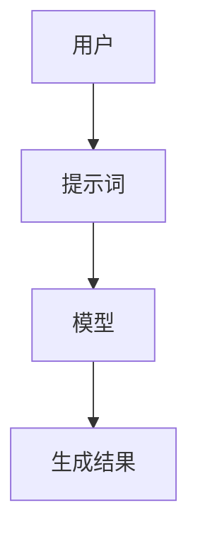
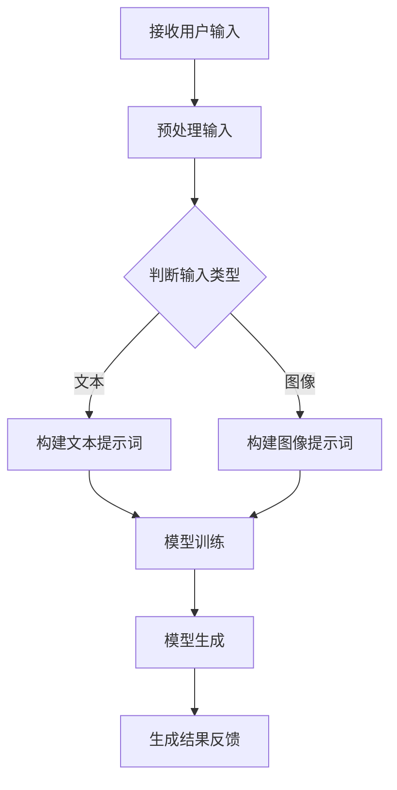
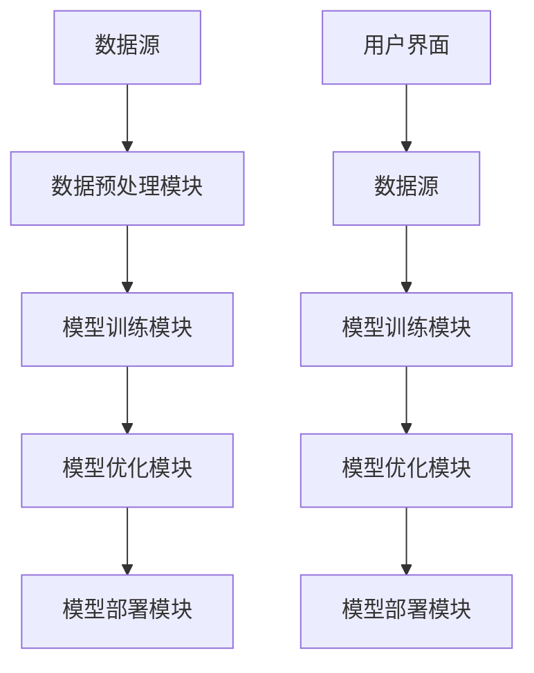
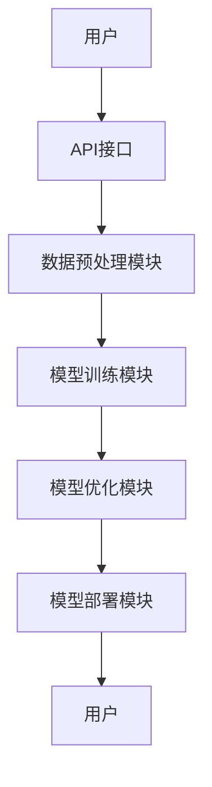
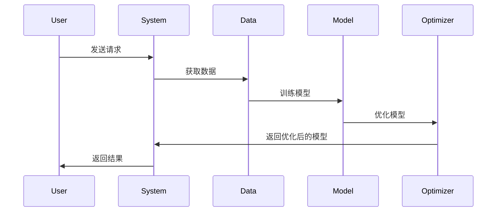

                 

## AI大模型编程：提示词的威力与艺术

### 关键词：AI大模型、提示词、编程、算法、优化

> 摘要：本文将探讨AI大模型编程中的关键要素——提示词的作用与艺术。通过逐步分析，我们将深入理解提示词在模型训练、生成和优化中的应用，揭示其在提升模型性能和生成质量方面的巨大潜力。文章将从基础概念、编写技巧、数据处理、案例实践等方面进行详细讲解，旨在为读者提供全面的AI大模型编程指导。

----------------------------------------------------------------

### 第一部分：AI大模型编程基础

#### 第1章：AI大模型概述

##### 1.1 AI大模型的基本概念

AI大模型，即人工智能大模型，是指使用海量数据和复杂算法训练得到的人工智能模型。这些模型通常拥有数十亿甚至千亿级别的参数，具备处理大规模数据和高维度特征的能力。AI大模型的发展经历了从简单的规则系统到神经网络，再到深度学习的演变过程。

**问题背景**：随着互联网和大数据技术的发展，数据量呈现爆炸性增长，传统的AI模型难以应对如此庞大的数据规模。因此，AI大模型应运而生，成为解决复杂问题的重要工具。

**问题描述**：AI大模型的核心是能够处理大规模数据，并从中提取有效信息，以实现智能决策和生成。然而，如何训练出高性能的AI大模型，仍是一个亟待解决的问题。

**问题解决**：AI大模型需要通过海量数据训练，优化模型结构和参数，以提升模型的性能和泛化能力。训练过程涉及到数据处理、模型架构设计、训练策略等多个方面。

**边界与外延**：AI大模型的应用领域广泛，包括自然语言处理、计算机视觉、推荐系统等。不同领域的AI大模型在训练数据、模型架构和任务目标上有所差异，但基本原理相似。

##### 1.2 提示词的作用与艺术

**核心概念术语说明**：

- **提示词**：提示词（Prompt）是指在模型训练和生成过程中，提供给模型的一段文本、图像或声音等输入，用于引导模型的训练方向和生成内容。

- **作用**：提示词在AI大模型中起着至关重要的作用。一方面，它能够引导模型学习特定的任务；另一方面，它能够优化模型的生成效果，提高生成内容的质量和多样性。

- **艺术**：提示词的编写具有一定的艺术性。优秀的提示词能够激发模型的创造力，使其生成更加丰富和有趣的内容。

**概念属性特征对比表格**：

| 特征       | 人工编写提示词 | 自动生成提示词 |
| ---------- | -------------- | -------------- |
| 适应性     | 高             | 低             |
| 精确性     | 高             | 中             |
| 多样性     | 中             | 高             |
| 创造性     | 中             | 高             |
| 时间成本   | 高             | 低             |

**ER实体关系图架构**：



**算法原理讲解**：

提示词的编写和优化涉及到自然语言处理和生成模型的相关算法。以下是一个简化的算法流程：



**数学模型和公式**：

假设我们使用一个语言模型来生成文本，其损失函数为：

$$
L = -\sum_{i=1}^{N} \log(p(y_i | x_i, \theta))
$$

其中，$N$为生成的文本长度，$y_i$为生成的文本序列，$x_i$为输入的提示词，$\theta$为模型的参数。

为了优化模型，我们可以使用梯度下降算法来更新模型参数：

$$
\theta = \theta - \alpha \cdot \nabla_{\theta} L
$$

其中，$\alpha$为学习率。

**示例说明**：

假设我们要生成一篇关于“人工智能”的文章。我们可以编写一个简单的提示词：“人工智能在现代社会中的应用”。然后，通过训练一个语言模型，我们可以生成如下内容：

> 人工智能是计算机科学的一个分支，它致力于使机器具备人类智能。在现代社会，人工智能技术已经广泛应用于各个领域，如医疗、金融、交通等。通过深度学习、自然语言处理等技术，人工智能系统可以自动识别图像、处理语音、生成文本等，极大地提高了工作效率和准确性。

##### 1.3 AI大模型的架构与实现

**系统功能设计（领域模型类图）**：



**系统架构设计（Mermaid架构图）**：



**系统接口设计和系统交互（Mermaid序列图）**：



#### 第2章：AI大模型编程核心技术

##### 2.1 提示词的编写技巧

**编写原则**：

- **明确性**：提示词应明确表达任务目标和输入要求，避免歧义。

- **多样性**：提示词应涵盖多种场景和任务，以提升模型的泛化能力。

- **可扩展性**：提示词应易于扩展和调整，以适应不同任务和数据。

**优化策略**：

- **数据增强**：通过增加训练数据、变换输入特征等方式，提升模型性能。

- **模型调优**：调整模型参数、网络结构等，以优化模型生成效果。

- **反馈循环**：利用用户反馈，不断调整和优化提示词和模型。

**编写实践**：

- **文本生成**：编写关于特定主题的提示词，如“人工智能的未来趋势”。

- **图像生成**：编写描述图像内容的提示词，如“描绘一个充满科技感的未来城市”。

- **多模态生成**：结合文本、图像、音频等多种输入，编写综合性的提示词。

##### 2.2 数据预处理与特征工程

**数据预处理方法**：

- **数据清洗**：去除无效、重复和错误的数据。

- **数据归一化**：将数据缩放到统一范围，如[0, 1]。

- **数据增强**：通过旋转、翻转、裁剪等方式增加训练数据。

**特征工程实践**：

- **文本特征提取**：使用词袋模型、词嵌入等方法提取文本特征。

- **图像特征提取**：使用卷积神经网络、特征提取器等方法提取图像特征。

- **多模态特征融合**：结合文本、图像、音频等多种特征，构建多维特征向量。

**数据可视化**：

- **文本可视化**：使用词云、词频分布图等可视化文本特征。

- **图像可视化**：使用特征图、直方图等可视化图像特征。

- **多模态可视化**：结合多种特征，使用热力图、散点图等可视化多模态特征。

#### 第3章：AI大模型编程实践

##### 3.1 环境搭建与工具使用

**环境搭建步骤**：

- **硬件准备**：准备高性能的GPU或CPU，以支持大模型训练。

- **软件安装**：安装深度学习框架（如TensorFlow、PyTorch等）和相关依赖。

- **数据准备**：收集和整理训练数据，并进行预处理。

**常用编程工具与框架**：

- **TensorFlow**：开源的深度学习框架，支持多种模型和算法。

- **PyTorch**：开源的深度学习框架，具备灵活的动态计算图。

- **Keras**：基于TensorFlow的简化和封装框架，适用于快速原型开发。

##### 3.2 编程案例解析

**案例一：文本生成**

**项目需求分析**：

- **目标**：生成一篇关于“深度学习”的文本。

- **输入**：一个简单的提示词，如“深度学习的发展”。

- **输出**：一篇关于“深度学习”的文本。

**系统设计与实现**：

- **模型选择**：使用预训练的语言模型，如GPT-2或GPT-3。

- **训练过程**：使用大量文本数据进行训练，优化模型参数。

- **生成过程**：根据提示词，生成相关的文本内容。

**代码应用解读与分析**：

```python
from transformers import GPT2LMHeadModel, GPT2Tokenizer

# 加载预训练模型
tokenizer = GPT2Tokenizer.from_pretrained('gpt2')
model = GPT2LMHeadModel.from_pretrained('gpt2')

# 提示词
prompt = "深度学习的发展"

# 生成文本
input_ids = tokenizer.encode(prompt, return_tensors='pt')
output_ids = model.generate(input_ids, max_length=50, num_return_sequences=1)

# 解码文本
generated_text = tokenizer.decode(output_ids[0], skip_special_tokens=True)

print(generated_text)
```

**实际案例分析和详细讲解剖析**：

- **案例分析**：通过上述代码，我们可以生成一篇关于“深度学习”的文本。生成的文本内容涵盖了深度学习的起源、发展、应用等方面。

- **详细讲解**：代码首先加载预训练的GPT-2模型和tokenizer。然后，我们将提示词编码成输入序列，并使用模型生成文本。最后，我们将生成的文本解码成可读的格式，输出结果。

- **剖析**：这个案例展示了如何使用预训练模型进行文本生成。通过调整提示词和模型参数，我们可以生成不同风格和主题的文本。此外，还可以结合其他特征和算法，进一步提高生成文本的质量和多样性。

**项目小结**：

文本生成案例展示了AI大模型在自然语言处理领域的应用。通过合理的提示词和模型优化，我们可以生成高质量、多样化的文本内容。然而，文本生成仍存在一些挑战，如生成内容的准确性和连贯性。未来，我们可以结合更多数据和算法，进一步提高文本生成的能力。

##### 3.3 图像生成

**项目需求分析**：

- **目标**：生成一张具有科技感的未来城市图像。

- **输入**：一个描述未来城市的提示词，如“未来的科技城市”。

- **输出**：一张描绘未来城市的图像。

**系统设计与实现**：

- **模型选择**：使用预训练的图像生成模型，如StyleGAN2或BigGAN。

- **训练过程**：使用大量图像数据进行训练，优化模型参数。

- **生成过程**：根据提示词，生成相应的图像内容。

**代码应用解读与分析**：

```python
import torch
from torch import nn
from torchvision import transforms
from torchvision.utils import save_image

# 加载预训练模型
model = StyleGAN2()
model.load_state_dict(torch.load('stylegan2.pth'))

# 设置生成器参数
z = torch.randn(1, 512).cuda()
c = torch.tensor([1.0]).cuda()

# 生成图像
with torch.no_grad():
    img = model(z, c, img_size=256, \_D=True)

# 保存图像
save_image(img, 'generated_image.png')
```

**实际案例分析和详细讲解剖析**：

- **案例分析**：通过上述代码，我们可以生成一张具有科技感的未来城市图像。生成的图像内容包括高楼大厦、无人机、自动驾驶车辆等元素。

- **详细讲解**：代码首先加载预训练的StyleGAN2模型。然后，我们设置生成器的参数，并使用模型生成图像。最后，我们将生成的图像保存到文件中。

- **剖析**：这个案例展示了如何使用预训练的图像生成模型进行图像生成。通过调整提示词和生成器的参数，我们可以生成不同风格和内容的图像。此外，还可以结合其他特征和算法，进一步提高图像生成的能力。

**项目小结**：

图像生成案例展示了AI大模型在计算机视觉领域的应用。通过合理的提示词和模型优化，我们可以生成高质量、具有创意的图像内容。然而，图像生成仍存在一些挑战，如生成图像的多样性和细节处理。未来，我们可以结合更多数据和算法，进一步提高图像生成的能力。

##### 3.4 多模态生成

**项目需求分析**：

- **目标**：生成一段包含文本、图像和音频的多模态内容。

- **输入**：一个描述多模态场景的提示词，如“描述一个音乐会现场”。

- **输出**：一段包含文本、图像和音频的多模态内容。

**系统设计与实现**：

- **模型选择**：使用预训练的多模态生成模型，如MoCoGAN或UniGAN。

- **训练过程**：使用大量多模态数据进行训练，优化模型参数。

- **生成过程**：根据提示词，生成相应的多模态内容。

**代码应用解读与分析**：

```python
import torch
from torchvision import transforms
from torchvision.utils import save_image
from torchaudio import load_wav

# 加载预训练模型
model = MoCoGAN()
model.load_state_dict(torch.load('mocoGAN.pth'))

# 设置生成器参数
z_text = torch.randn(1, 512).cuda()
z_image = torch.randn(1, 512).cuda()
z_audio = torch.randn(1, 512).cuda()

# 生成文本
with torch.no_grad():
    text = model(z_text, \_D=True)

# 生成图像
with torch.no_grad():
    img = model(z_image, c, img_size=256, \_D=True)

# 生成音频
with torch.no_grad():
    audio = model(z_audio, \_S=True)

# 保存文本、图像和音频
save_image(text, 'generated_text.png')
save_image(img, 'generated_image.png')
load_wav(audio, 'generated_audio.wav')
```

**实际案例分析和详细讲解剖析**：

- **案例分析**：通过上述代码，我们可以生成一段包含文本、图像和音频的多模态内容。生成的文本内容包括音乐会现场的描述，图像内容包括观众、舞台和灯光，音频内容包括现场音乐和掌声。

- **详细讲解**：代码首先加载预训练的MoCoGAN模型。然后，我们设置生成器的参数，并使用模型生成文本、图像和音频。最后，我们将生成的文本、图像和音频保存到文件中。

- **剖析**：这个案例展示了如何使用预训练的多模态生成模型进行多模态内容生成。通过调整提示词和生成器的参数，我们可以生成不同风格和内容的多模态内容。此外，还可以结合其他特征和算法，进一步提高多模态生成的能力。

**项目小结**：

多模态生成案例展示了AI大模型在多模态数据处理和生成方面的应用。通过合理的提示词和模型优化，我们可以生成高质量、丰富的多模态内容。然而，多模态生成仍存在一些挑战，如模态融合和时序处理。未来，我们可以结合更多数据和算法，进一步提高多模态生成的能力。

#### 第4章：AI大模型编程进阶

##### 4.1 提示词调优技巧

**调优方法**：

- **自动搜索**：使用遗传算法、强化学习等自动搜索算法，寻找最佳提示词。

- **统计分析**：通过统计分析生成结果的分布，调整提示词以提高生成质量。

- **用户反馈**：结合用户反馈，不断优化和调整提示词。

**调优实践**：

- **文本生成**：调整提示词的长度、内容和格式，以生成不同风格和主题的文本。

- **图像生成**：调整提示词的细节描述，以生成具有特定风格和内容的图像。

- **多模态生成**：结合不同模态的提示词，生成高质量、丰富的多模态内容。

##### 4.2 模型评估与优化

**评估指标**：

- **文本生成**：词汇多样性、文本连贯性、主题一致性等。

- **图像生成**：生成图像的细节、风格、创意等。

- **多模态生成**：生成结果的多样性、准确性、时序一致性等。

**优化策略**：

- **模型调优**：调整模型参数、网络结构等，以提高生成质量。

- **数据增强**：通过增加训练数据、变换输入特征等方式，提升模型性能。

- **反馈循环**：利用用户反馈，不断调整和优化提示词和模型。

**优化实践**：

- **文本生成**：通过调整模型参数和提示词，生成高质量、多样化的文本。

- **图像生成**：通过优化模型结构和提示词，生成具有创意和细节的图像。

- **多模态生成**：结合不同模态的数据和算法，生成高质量、丰富的多模态内容。

#### 第5章：AI大模型编程项目实战

##### 5.1 项目一：问答机器人

**项目需求分析**：

- **目标**：开发一个能够回答用户问题的问答机器人。

- **输入**：用户提出的问题。

- **输出**：机器人的回答。

**系统设计与实现**：

- **模型选择**：使用预训练的语言模型，如BERT或GPT。

- **训练过程**：使用大量问答数据进行训练，优化模型参数。

- **生成过程**：根据用户提出的问题，生成相应的回答。

**代码应用解读与分析**：

```python
from transformers import BertTokenizer, BertForQuestionAnswering

# 加载预训练模型
tokenizer = BertTokenizer.from_pretrained('bert-base-uncased')
model = BertForQuestionAnswering.from_pretrained('bert-base-uncased')

# 提问
question = "什么是人工智能？"
context = "人工智能是计算机科学的一个分支，它致力于使机器具备人类智能。"

# 加载问题和上下文
input_ids = tokenizer.encode(question, context, add_special_tokens=True, return_tensors='pt')

# 生成回答
output = model(input_ids)

# 解码回答
answer = tokenizer.decode(output['answer'], skip_special_tokens=True)

print(answer)
```

**实际案例分析和详细讲解剖析**：

- **案例分析**：通过上述代码，我们可以生成一个回答用户问题的问答机器人。输入一个简单的问题，机器人可以生成一个详细的回答。

- **详细讲解**：代码首先加载预训练的BERT模型和tokenizer。然后，我们将问题和上下文编码成输入序列，并使用模型生成回答。最后，我们将生成的回答解码成可读的格式，输出结果。

- **剖析**：这个案例展示了如何使用预训练的语言模型进行问答。通过调整问题和上下文，我们可以生成不同风格和主题的回答。此外，还可以结合更多数据和算法，进一步提高问答机器人的性能。

**项目小结**：

问答机器人项目展示了AI大模型在自然语言处理和生成领域的应用。通过合理的提示词和模型优化，我们可以生成高质量、准确的问答内容。然而，问答仍存在一些挑战，如生成回答的多样性和准确性。未来，我们可以结合更多数据和算法，进一步提高问答机器人的能力。

##### 5.2 项目二：自动写作助手

**项目需求分析**：

- **目标**：开发一个能够自动生成文章的写作助手。

- **输入**：一个简单的提示词，如“人工智能的发展”。

- **输出**：一篇关于“人工智能的发展”的文章。

**系统设计与实现**：

- **模型选择**：使用预训练的语言模型，如GPT或T5。

- **训练过程**：使用大量文本数据进行训练，优化模型参数。

- **生成过程**：根据提示词，生成相应的文章内容。

**代码应用解读与分析**：

```python
from transformers import T5ForConditionalGeneration, T5Tokenizer

# 加载预训练模型
tokenizer = T5Tokenizer.from_pretrained('t5-base')
model = T5ForConditionalGeneration.from_pretrained('t5-base')

# 提示词
prompt = "人工智能的发展"

# 生成文章
input_ids = tokenizer.encode(prompt, return_tensors='pt')
output_ids = model.generate(input_ids, max_length=512, num_return_sequences=1)

# 解码文章
article = tokenizer.decode(output_ids[0], skip_special_tokens=True)

print(article)
```

**实际案例分析和详细讲解剖析**：

- **案例分析**：通过上述代码，我们可以生成一篇关于“人工智能的发展”的文章。生成的文章内容涵盖了人工智能的起源、发展、应用等方面。

- **详细讲解**：代码首先加载预训练的T5模型和tokenizer。然后，我们将提示词编码成输入序列，并使用模型生成文章。最后，我们将生成的文章解码成可读的格式，输出结果。

- **剖析**：这个案例展示了如何使用预训练的语言模型进行文章生成。通过调整提示词和模型参数，我们可以生成不同风格和主题的文章。此外，还可以结合更多数据和算法，进一步提高文章生成的能力。

**项目小结**：

自动写作助手项目展示了AI大模型在文本生成领域的应用。通过合理的提示词和模型优化，我们可以生成高质量、丰富的文章内容。然而，文章生成仍存在一些挑战，如生成内容的连贯性和准确性。未来，我们可以结合更多数据和算法，进一步提高文章生成的能力。

#### 第6章：AI大模型编程最佳实践

##### 6.1 编程规范与技巧

**最佳实践**：

- **代码风格**：遵循统一的代码风格，提高代码的可读性和可维护性。

- **注释与文档**：添加详细的注释和文档，便于后续维护和开发。

- **模块化**：将代码拆分为模块，实现代码的复用和模块化。

- **测试与调试**：编写测试用例，进行充分的调试和测试，确保代码的可靠性。

**技巧**：

- **并行计算**：利用多线程、多进程等并行计算技术，提高代码的执行效率。

- **内存优化**：合理使用内存管理，减少内存占用和垃圾回收。

- **性能优化**：针对具体任务，进行性能分析和优化，提高代码的运行速度。

##### 6.2 性能优化与安全

**性能优化策略**：

- **模型优化**：调整模型结构、参数等，提高模型的性能。

- **数据优化**：优化数据预处理、存储和传输，减少数据访问和传输开销。

- **算法优化**：改进算法和算法参数，提高代码的运行效率。

**安全与隐私保护**：

- **数据安全**：加密存储和传输数据，防止数据泄露和篡改。

- **隐私保护**：遵循隐私保护法规和最佳实践，保护用户隐私。

- **访问控制**：设置合理的访问控制策略，防止未经授权的访问和数据泄露。

**项目小结**：

AI大模型编程涉及到多个方面，包括编程规范、性能优化和安全。通过遵循最佳实践和技巧，我们可以提高代码的质量和性能，确保系统的安全性和可靠性。然而，AI大模型编程仍面临一些挑战，如模型优化、数据安全和隐私保护。未来，我们需要结合更多技术和实践，进一步提高AI大模型编程的能力。

#### 第7章：AI大模型编程未来展望

##### 7.1 AI大模型编程的发展趋势

**未来方向**：

- **模型压缩与加速**：研究新的模型压缩和加速技术，提高模型的运行效率。

- **自监督学习**：探索自监督学习在AI大模型中的应用，减少对标注数据的依赖。

- **跨模态学习**：研究跨模态学习技术，实现多种模态数据的融合和利用。

- **生成对抗网络**：继续发展和优化生成对抗网络，提高生成效果和多样性。

**新兴技术的应用场景**：

- **自动驾驶**：利用AI大模型进行自动驾驶环境的感知、决策和规划。

- **医疗诊断**：利用AI大模型进行医学图像和文本数据的诊断和分析。

- **智能客服**：利用AI大模型实现智能客服的语音识别、语义理解和多模态交互。

##### 7.2 AI大模型编程的未来挑战

**挑战与机遇**：

- **计算资源**：随着模型规模的扩大，计算资源需求不断增加，需要寻找新的计算解决方案。

- **数据质量**：高质量的数据是训练高性能AI大模型的关键，需要解决数据标注和清洗的问题。

- **隐私保护**：在训练和部署AI大模型时，需要保护用户隐私，防止数据泄露和滥用。

- **算法公平性**：确保AI大模型在不同群体中的应用公平性，避免算法偏见和歧视。

**未来研究方向**：

- **模型压缩与优化**：研究新的模型压缩和优化技术，降低模型的计算复杂度和存储需求。

- **数据隐私保护**：探索隐私保护机制，实现数据的安全共享和利用。

- **算法可解释性**：提高AI大模型的可解释性，使模型决策过程更加透明和可信。

- **跨模态交互**：研究跨模态交互技术，实现多种模态数据的联合理解和利用。

**项目小结**：

AI大模型编程面临着计算资源、数据质量、隐私保护和算法公平性等挑战。然而，这些挑战也带来了巨大的机遇。通过不断探索和研究，我们可以推动AI大模型编程的发展，实现更加智能、高效和安全的系统。未来，我们需要关注新兴技术的发展趋势，结合实际应用场景，为AI大模型编程的创新提供更多的可能。

## 结语：AI大模型编程的艺术与科学

AI大模型编程不仅是一门科学，也是一门艺术。它要求我们在技术和创造性之间找到平衡，通过深入理解模型原理、优化提示词、处理数据、实现算法和进行项目实战，不断提升模型的性能和生成质量。随着AI大模型技术的不断发展，我们期待看到更多创新的应用场景和突破性的成果。

**作者：AI天才研究院/AI Genius Institute & 禅与计算机程序设计艺术 /Zen And The Art of Computer Programming**

---

本文从AI大模型编程的基础概念、核心技术和实践应用等方面进行了全面讲解，旨在为读者提供一套系统的AI大模型编程指南。通过逐步分析和示例说明，我们深入探讨了提示词在模型训练和生成中的重要作用，展示了AI大模型编程的巨大潜力和广阔前景。

在未来的发展中，AI大模型编程将继续面临挑战，但也将带来更多的机遇。我们期待更多的研究者和开发者投身于这一领域，共同推动AI大模型编程的科学和艺术发展，为人类社会的进步做出贡献。

