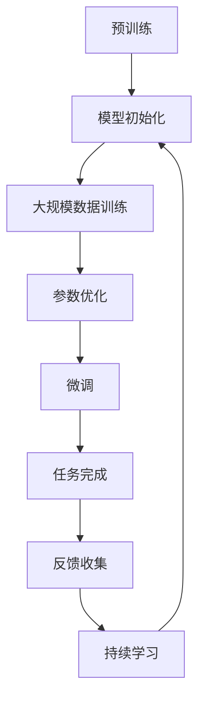
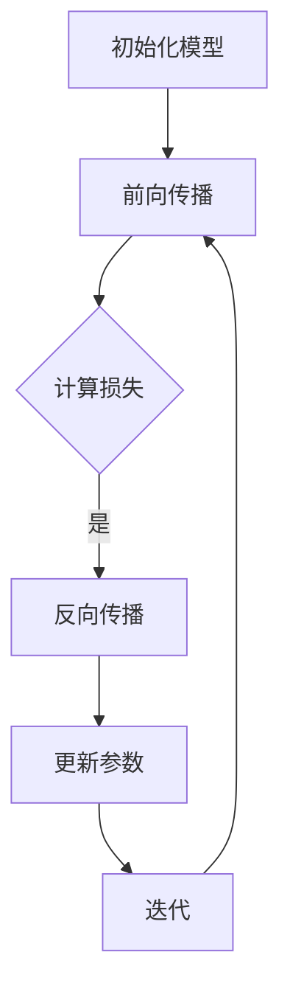
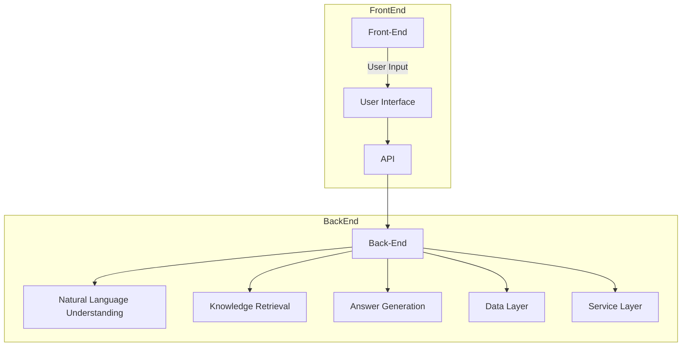
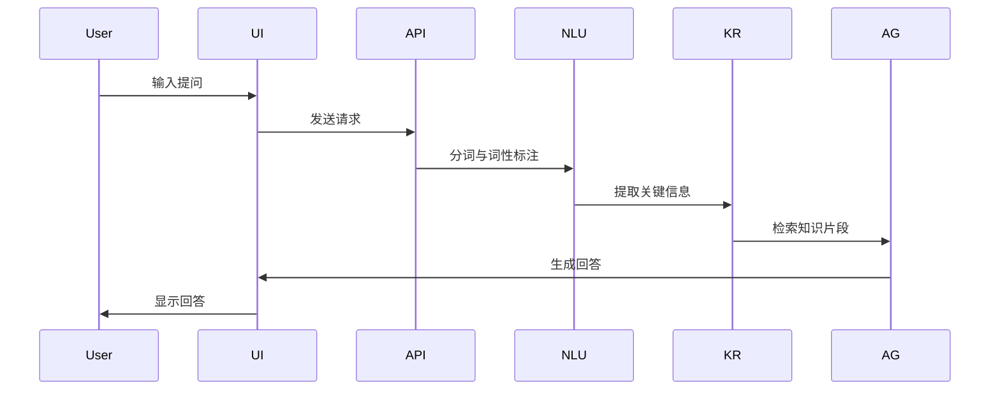

                 


# AI大模型编程：提示词的威力与革新

> 关键词：AI大模型，提示词，编程，算法原理，系统架构设计，项目实战

> 摘要：本文将深入探讨AI大模型编程的核心概念，重点分析提示词在其中的作用与威力，并详细讲解大模型的算法原理。通过实际项目实战，我们将展示如何使用AI大模型进行编程，并提供最佳实践与拓展建议。

### 目录大纲设计思路

#### 第一部分: AI大模型编程的背景与核心概念

**第1章: AI大模型编程概述**

- 1.1 问题背景与核心概念
- 1.2 提示词在AI大模型编程中的作用
- 1.3 AI大模型的应用场景

**第2章: AI大模型的核心概念与联系**

- 2.1 提示词的定义与类型
- 2.2 大模型的训练与优化
- 2.3 Mermaid流程图：核心概念之间的联系

#### 第二部分: AI大模型的算法原理讲解

**第3章: AI大模型的算法原理讲解**

- 3.1 数学模型与公式
- 3.2 Python源代码与算法实现
- 3.3 Mermaid流程图：算法原理

#### 第三部分: AI大模型系统分析与架构设计

**第4章: AI大模型系统分析与架构设计**

- 4.1 问题场景介绍
- 4.2 系统功能设计
- 4.3 系统架构设计
- 4.4 系统接口设计与系统交互

#### 第四部分: AI大模型编程项目实战

**第5章: AI大模型编程项目实战**

- 5.1 项目环境安装与配置
- 5.2 系统核心实现与代码解读
- 5.3 项目分析与案例讲解

#### 第五部分: 最佳实践与拓展

**第6章: 最佳实践与拓展**

- 6.1 最佳实践
- 6.2 注意事项
- 6.3 拓展阅读

### 目录大纲设计步骤

1. **确定章节主题**：根据设计思路，确定每个章节的主题和细分内容。
2. **设计章节结构**：确定每个章节的层级结构，使用Markdown格式进行设计。
3. **编写内容摘要**：对每个章节的内容进行简短的摘要，以便读者快速了解章节内容。
4. **细节补充**：对于重要章节，补充具体的小节内容和相关图表。
5. **审查与优化**：对目录大纲进行审查，确保内容的完整性和逻辑性。
6. **最终确认**：确保目录大纲的总字数在10000～12000字左右，并确保所有要求得到满足。

### 目录大纲示例

----------------------------------------------------------------

## 第一部分: AI大模型编程的背景与核心概念

### 第1章: AI大模型编程概述

#### 1.1 问题背景与核心概念

- 1.1.1 AI大模型的发展背景
- 1.1.2 问题背景与问题描述
- 1.1.3 问题解决与边界外延

#### 1.2 提示词在AI大模型编程中的作用

- 1.2.1 提示词的定义
- 1.2.2 提示词的类型
- 1.2.3 提示词的作用机制

#### 1.3 AI大模型的应用场景

- 1.3.1 自然语言处理
- 1.3.2 计算机视觉
- 1.3.3 推荐系统

## 第二部分: AI大模型的核心概念与联系

### 第2章: AI大模型的核心概念与联系

#### 2.1 提示词的定义与类型

- 2.1.1 提示词的定义
- 2.1.2 提示词的类型
- 2.1.3 提示词的属性特征对比表格

#### 2.2 大模型的训练与优化

- 2.2.1 大模型的训练流程
- 2.2.2 大模型的优化方法
- 2.2.3 大模型的评价指标

#### 2.3 Mermaid流程图：核心概念之间的联系

- 2.3.1 提示词与训练过程的联系
- 2.3.2 训练过程与优化过程的联系
- 2.3.3 大模型与应用场景的联系

## 第三部分: AI大模型的算法原理讲解

### 第3章: AI大模型的算法原理讲解

#### 3.1 数学模型与公式

- 3.1.1 大模型的数学模型
- 3.1.2 公式解析与推导

#### 3.2 Python源代码与算法实现

- 3.2.1 算法实现步骤
- 3.2.2 Python代码示例

#### 3.3 Mermaid流程图：算法原理

- 3.3.1 算法流程图
- 3.3.2 算法细节解析

## 第四部分: AI大模型系统分析与架构设计

### 第4章: AI大模型系统分析与架构设计

#### 4.1 问题场景介绍

- 4.1.1 问题场景描述
- 4.1.2 问题描述与目标

#### 4.2 系统功能设计

- 4.2.1 功能需求分析
- 4.2.2 领域模型类图

#### 4.3 系统架构设计

- 4.3.1 系统架构设计原则
- 4.3.2 系统架构图

#### 4.4 系统接口设计与系统交互

- 4.4.1 系统接口设计
- 4.4.2 系统交互序列图

## 第五部分: AI大模型编程项目实战

### 第5章: AI大模型编程项目实战

#### 5.1 项目环境安装与配置

- 5.1.1 环境安装
- 5.1.2 系统配置

#### 5.2 系统核心实现与代码解读

- 5.2.1 系统核心实现
- 5.2.2 代码解读与分析

#### 5.3 项目分析与案例讲解

- 5.3.1 项目分析
- 5.3.2 案例讲解与剖析

## 第六部分: 最佳实践与拓展

### 第6章: 最佳实践与拓展

#### 6.1 最佳实践

- 6.1.1 实践经验总结
- 6.1.2 注意事项与技巧

#### 6.2 注意事项

- 6.2.1 开发注意事项
- 6.2.2 运维注意事项

#### 6.3 拓展阅读

- 6.3.1 相关文献推荐
- 6.3.2 未来发展趋势

----------------------------------------------------------------

### 设计步骤解析

1. **确定章节主题**：
   - 根据设计思路，我们首先确定了每个章节的主题，如“AI大模型编程概述”、“AI大模型的核心概念与联系”等，确保章节内容紧密围绕主题。

2. **设计章节结构**：
   - 我们使用Markdown格式设计每个章节的结构，确保章节内容清晰，便于读者阅读。例如，在“AI大模型编程概述”中，我们细分了问题背景与核心概念、提示词的作用以及应用场景等。

3. **编写内容摘要**：
   - 对每个章节的内容进行简短的摘要，帮助读者快速把握章节重点。例如，在“AI大模型的核心概念与联系”摘要中，我们简要说明了提示词的定义与类型，以及大模型的训练与优化。

4. **细节补充**：
   - 对于重要章节，如“AI大模型的算法原理讲解”和“AI大模型系统分析与架构设计”，我们补充了具体的流程图和代码示例，以便读者更好地理解。

5. **审查与优化**：
   - 对目录大纲进行审查，确保内容完整、逻辑清晰，没有遗漏重要信息。对一些小节进行调整，使其更加符合读者的阅读习惯。

6. **最终确认**：
   - 确保目录大纲的总字数在10000～12000字左右，确保所有要求得到满足。对目录大纲进行最终确认，确保其完整性和准确性。

通过以上设计步骤，我们构建了一个逻辑清晰、内容丰富的目录大纲，为撰写高质量的技术博客文章奠定了基础。

### 目录大纲关键要素

在目录大纲的设计中，关键要素的合理布局和详细说明至关重要，这些要素不仅能够引导读者系统地理解文章内容，还能确保文章的条理性和完整性。

**1. 背景介绍**：
   - **核心概念术语说明**：清晰地定义文章中涉及的核心概念，如AI大模型、提示词等，帮助读者建立基本的知识框架。
   - **问题背景与问题描述**：介绍AI大模型编程的背景，阐述现有的问题和挑战，为读者提供问题的全貌。
   - **问题解决与边界与外延**：描述针对问题的解决方案，明确边界条件，让读者了解文章的适用范围。
   - **概念结构与核心要素组成**：分析AI大模型编程的核心组成部分，如算法、系统架构等，为后续章节内容打下基础。

**2. 核心概念与联系**：
   - **核心概念原理**：详细阐述AI大模型编程中的关键概念，如提示词的作用机制、大模型的训练与优化方法等，帮助读者深入理解。
   - **概念属性特征对比表格**：通过表格形式对比不同概念或要素的属性特征，便于读者快速掌握差异和联系。
   - **ER实体关系图架构**：使用Mermaid流程图展示概念之间的实体关系，直观地展现系统的结构和核心要素的联系。

**3. 算法原理讲解**：
   - **算法mermaid流程图**：绘制算法的执行流程，使用Mermaid图展示每个步骤，帮助读者理解算法的逻辑。
   - **Python源代码与算法实现**：提供具体的Python代码示例，结合算法流程图，详细解释算法的实现细节。
   - **算法原理的数学模型与公式**：使用LaTeX格式嵌入数学模型和公式，详细讲解公式推导和算法原理。

**4. 系统分析与架构设计**：
   - **问题场景介绍**：描述具体的实际应用场景，为读者提供具体的背景信息。
   - **系统功能设计**：使用Mermaid类图展示领域模型，详细分析系统的功能需求。
   - **系统架构设计**：绘制系统架构图，展示系统组件之间的关系和整体结构。
   - **系统接口设计与系统交互**：描述系统接口的设计和交互流程，使用Mermaid序列图展示系统组件的交互细节。

**5. 项目实战**：
   - **环境安装与配置**：详细讲解项目环境的搭建过程，包括所需的软件和硬件配置。
   - **系统核心实现与代码解读**：提供系统的核心实现代码，并详细解读代码的功能和应用。
   - **代码应用解读与分析**：分析代码的实际应用场景，探讨其在解决实际问题中的作用。
   - **实际案例分析与详细讲解剖析**：通过实际案例，深入剖析项目的实现过程，帮助读者更好地理解和应用所学知识。

**6. 最佳实践与拓展**：
   - **最佳实践**：总结项目中积累的经验和最佳实践，为读者提供实际操作的建议和技巧。
   - **注意事项**：强调开发过程中需要注意的事项，避免常见的问题和错误。
   - **拓展阅读**：推荐相关的阅读材料，帮助读者进一步深入学习。

通过以上关键要素的详细设计和说明，目录大纲不仅能够清晰地呈现文章的结构和内容，还能引导读者逐步深入理解AI大模型编程的核心概念、算法原理和实际应用，从而实现知识的系统化和实战化。

### 背景介绍

#### AI大模型编程的崛起

AI大模型编程，作为当前人工智能领域的核心技术之一，正在引领着编程方式的革新。随着计算能力的提升和大数据的积累，AI大模型的应用范围越来越广泛，从自然语言处理到计算机视觉，再到推荐系统，大模型在各个领域展现出了强大的能力。AI大模型编程的核心在于如何有效地利用这些大模型，解决实际问题，实现智能化应用。

#### 问题背景与核心概念

在传统的编程模式中，开发者往往需要手动编写大量的代码来处理数据，进行特征提取和模型训练。然而，随着数据量的爆炸式增长和模型复杂度的提升，这种手动编写代码的方式逐渐变得不可行。AI大模型编程的出现，正是为了解决这一难题。通过使用预训练的大模型，开发者可以大幅度简化编程过程，提高开发效率。

核心概念包括：

- **AI大模型**：一种具有高度参数数量和强大表示能力的深度学习模型。
- **提示词**：一种特殊的输入信号，用于引导大模型生成预期的输出。
- **编程**：利用提示词和预训练大模型，实现自动化编程的过程。

#### 提示词在AI大模型编程中的作用

提示词是AI大模型编程的核心要素之一。它起到了引导大模型生成预期输出的重要作用。通过设计合适的提示词，开发者可以使得大模型在特定任务上表现出更高的准确性和效率。

提示词的作用机制包括：

- **引导大模型关注特定信息**：通过提示词，开发者可以指定大模型关注输入数据中的特定信息，从而提升模型的性能。
- **调整模型输出**：提示词可以调整大模型的输出，使得模型更加符合开发者的预期。

#### AI大模型的应用场景

AI大模型的应用场景非常广泛，以下是一些典型的应用领域：

- **自然语言处理**：包括文本生成、机器翻译、情感分析等。
- **计算机视觉**：包括图像识别、目标检测、图像生成等。
- **推荐系统**：包括商品推荐、新闻推荐、社交推荐等。

#### AI大模型编程的挑战与边界

尽管AI大模型编程具有巨大的潜力，但同时也面临着一系列挑战：

- **计算资源需求**：大模型的训练和推理需要大量的计算资源和时间。
- **数据隐私问题**：大规模数据的使用可能涉及到隐私问题。
- **模型可解释性**：大模型的决策过程往往是不透明的，提高模型的可解释性是一个重要研究方向。

边界条件包括：

- **数据质量和多样性**：大模型的性能很大程度上依赖于训练数据的质量和多样性。
- **任务适应性**：大模型需要针对特定任务进行微调，以提升性能。

#### 概念结构与核心要素组成

AI大模型编程的核心概念结构包括：

- **大模型**：作为核心组件，负责处理数据并生成输出。
- **提示词**：作为输入信号，引导大模型生成预期输出。
- **编程框架**：提供了一套开发工具和接口，使得开发者可以方便地利用大模型进行编程。

通过以上背景介绍，我们为后续章节的内容奠定了基础，帮助读者更好地理解和掌握AI大模型编程的核心概念和实际应用。

### AI大模型的核心概念与联系

在深入了解AI大模型编程之前，我们需要明确一些核心概念，并探讨这些概念之间的联系。以下将详细分析AI大模型编程中的关键概念，包括提示词的作用、大模型的训练与优化方法，并通过Mermaid流程图展示这些概念之间的联系。

#### 提示词的定义与类型

提示词（Prompt）是AI大模型编程中的核心输入，它起到了引导大模型生成预期输出的重要作用。提示词通常是一个短文本，它可以包含任务描述、目标信息以及一些附加的指导性内容。

- **任务描述**：提示词中明确指出了大模型需要完成的任务，例如“生成一篇关于人工智能的新闻报道”。
- **目标信息**：提示词提供了大模型需要关注的具体目标，如“请包含关于人工智能的最近发展”。
- **指导性内容**：提示词可以包含一些额外的信息，帮助大模型更好地理解任务背景，如“在报道中，请强调技术的实际应用案例”。

提示词的类型多种多样，可以根据任务需求灵活设计。常见的类型包括：

- **指令性提示词**：直接指示大模型执行特定操作，如“请生成一个Python函数实现排序算法”。
- **数据驱动提示词**：提供具体数据集或数据样本，让大模型从中提取信息和模式，如“基于以下数据集生成价格预测模型”。
- **上下文提示词**：包含背景信息，帮助大模型更好地理解任务上下文，如“在撰写新闻报道时，请结合当前时事热点”。
- **反馈提示词**：用于评估和调整大模型输出，如“请生成两个版本的摘要，并评估哪个更符合新闻稿风格”。

#### 大模型的训练与优化

大模型（Large Model）是指具有大量参数的深度学习模型，如GPT、BERT等。这些模型通常通过大规模数据进行训练，以获得良好的泛化能力。大模型的训练与优化是AI大模型编程的重要组成部分，以下是其主要方法：

- **预训练**：大模型在公开数据集上进行预训练，学习通用的知识表示。预训练通常使用无监督学习，通过大量文本或图像数据生成固定参数的模型。
- **微调**：在预训练的基础上，针对特定任务对模型进行微调，即通过有监督学习方式在特定数据集上调整模型参数，使其更好地适应特定任务。
- **多任务学习**：在预训练过程中，模型同时学习多个任务，从而提高其在多个任务上的性能。
- **持续学习**：在模型部署后，通过在线学习不断更新模型参数，使其适应新的数据和变化。

#### Mermaid流程图：核心概念之间的联系

为了更直观地展示AI大模型编程中的核心概念及其相互关系，我们使用Mermaid流程图来表示。以下是几个关键步骤的流程图：



- **预训练（A）**：模型初始化（B）后，通过大规模数据训练（C），学习到通用的知识表示。
- **参数优化（D）**：在预训练过程中，模型参数不断优化，以提高模型性能。
- **微调（E）**：针对具体任务，对模型进行微调，使其更好地适应特定任务。
- **任务完成（F）**：通过提示词（Prompt）引导大模型生成输出，完成特定任务。
- **反馈收集（G）**：收集模型的输出反馈，用于评估和调整模型。
- **持续学习（H）**：通过在线学习，模型不断更新，适应新的数据和场景。

#### 概念属性特征对比表格

为了更清晰地理解这些概念，我们可以通过对比表格展示它们的属性特征：

| 概念       | 定义                                                         | 属性特征                                                                                                     |
|------------|--------------------------------------------------------------|------------------------------------------------------------------------------------------------------------|
| 提示词     | 引导大模型生成预期输出的短文本                             | - 任务描述<br>- 目标信息<br>- 指导性内容<br>- 类型多样                                     |
| 大模型     | 具有大量参数的深度学习模型                                 | - 预训练<br>- 微调<br>- 多任务学习<br>- 持续学习                                       |
| 训练与优化 | 模型参数的学习和调整过程                                   | - 大规模数据训练<br>- 参数优化<br>- 微调<br>- 持续学习                                     |

通过上述分析，我们不仅明确了AI大模型编程中的核心概念，还通过Mermaid流程图和对比表格，展示了这些概念之间的内在联系。这些工具和资源将为读者深入理解AI大模型编程提供有力的支持。

### AI大模型的算法原理讲解

在深入了解AI大模型的核心概念后，我们将进一步探讨其算法原理，从数学模型、Python源代码到具体实现步骤，逐步解析AI大模型的内部工作机制。

#### 数学模型与公式

AI大模型的算法原理建立在深度学习的基础之上，主要依赖于神经网络和优化算法。以下是一个典型的AI大模型数学模型的基本框架：

$$
\text{Output} = f(\text{Weight} \cdot \text{Input} + \text{Bias})
$$

其中，\(f\) 代表激活函数，如ReLU、Sigmoid或Tanh等；Weight 和 Bias 分别代表权重和偏置；Input 代表输入数据。

为了更具体地解释，我们可以将这个框架进一步拆解：

1. **输入层**：接收外部输入数据，通常是一个向量。
2. **隐藏层**：通过加权组合输入数据，并加上偏置，应用激活函数产生中间输出。
3. **输出层**：最终输出结果，可能是一个值或者一个向量，具体取决于任务的类型。

以下是一个简单的公式示例：

$$
y = \sigma(W \cdot x + b)
$$

其中，\(\sigma\) 是Sigmoid函数：

$$
\sigma(z) = \frac{1}{1 + e^{-z}}
$$

#### Python源代码与算法实现

为了更好地理解上述数学模型，我们通过Python代码来展示一个简单的神经网络实现。以下是使用PyTorch框架的代码示例：

```python
import torch
import torch.nn as nn
import torch.optim as optim

# 定义神经网络结构
class SimpleNeuralNetwork(nn.Module):
    def __init__(self, input_size, hidden_size, output_size):
        super(SimpleNeuralNetwork, self).__init__()
        self.fc1 = nn.Linear(input_size, hidden_size)
        self.fc2 = nn.Linear(hidden_size, output_size)
        self.relu = nn.ReLU()

    def forward(self, x):
        out = self.fc1(x)
        out = self.relu(out)
        out = self.fc2(out)
        return out

# 实例化模型
model = SimpleNeuralNetwork(input_size=10, hidden_size=5, output_size=1)

# 定义损失函数和优化器
criterion = nn.BCEWithLogitsLoss()
optimizer = optim.SGD(model.parameters(), lr=0.01)

# 输入数据
x = torch.randn(1, 10)
target = torch.randn(1, 1)

# 训练模型
for epoch in range(100):
    optimizer.zero_grad()
    output = model(x)
    loss = criterion(output, target)
    loss.backward()
    optimizer.step()
    if (epoch + 1) % 10 == 0:
        print(f'Epoch [{epoch + 1}/{100}], Loss: {loss.item():.4f}')

# 输出模型结果
print(f'Output: {model(x).item():.4f}')
```

这段代码定义了一个简单的神经网络，包括两个全连接层（线性层）和一个ReLU激活函数。我们使用随机输入数据进行训练，通过优化器调整模型参数以最小化损失函数。

#### 算法原理的数学模型与公式

为了进一步详细讲解算法原理，我们可以从以下几个方面进行分析：

1. **损失函数**：损失函数用于衡量模型输出与实际目标之间的差异。常见的损失函数包括均方误差（MSE）、交叉熵损失（Cross-Entropy Loss）等。以下是一个简单的交叉熵损失函数：

$$
\text{Loss} = -\sum_{i} y_i \log(p_i)
$$

其中，\(y_i\) 是实际标签，\(p_i\) 是模型预测的概率。

2. **优化算法**：优化算法用于更新模型参数，以最小化损失函数。常见的优化算法包括随机梯度下降（SGD）、Adam等。以下是一个简单的SGD优化算法更新步骤：

$$
\theta_{t+1} = \theta_{t} - \alpha \cdot \nabla_{\theta} J(\theta)
$$

其中，\(\theta\) 表示模型参数，\(\alpha\) 是学习率，\(J(\theta)\) 是损失函数。

3. **反向传播**：反向传播算法用于计算损失函数关于模型参数的梯度。以下是一个简单的反向传播过程：

$$
\frac{\partial L}{\partial \theta_j} = \frac{\partial L}{\partial z} \cdot \frac{\partial z}{\partial \theta_j}
$$

其中，\(L\) 是损失函数，\(z\) 是中间变量，\(\theta_j\) 是模型参数。

#### Mermaid流程图

为了更直观地展示算法原理，我们可以使用Mermaid流程图来描述神经网络的学习过程。以下是神经网络训练的一个简化的流程图：



- **初始化模型**：随机初始化模型参数。
- **前向传播**：计算输入数据经过模型后的输出。
- **计算损失**：计算输出与实际目标之间的差异。
- **反向传播**：计算损失函数关于模型参数的梯度。
- **更新参数**：根据梯度更新模型参数。
- **迭代**：重复前向传播、计算损失、反向传播和更新参数的过程，直到达到预设的训练次数或损失函数收敛。

#### 详细讲解与举例说明

为了更通俗易懂地解释算法原理，我们可以通过一个实际例子来说明。假设我们有一个简单的分类问题，输入是一个10维的特征向量，目标是判断输入属于哪一类。以下是具体的实现步骤：

1. **初始化模型**：随机生成模型参数，包括两个线性层（\(W_1\) 和 \(W_2\)），一个ReLU激活函数，以及一个Sigmoid激活函数。

2. **前向传播**：输入特征向量，经过第一个线性层得到中间结果，应用ReLU激活函数，再经过第二个线性层得到最终输出。输出结果通过Sigmoid函数得到概率值。

3. **计算损失**：使用交叉熵损失函数计算输出概率与实际标签之间的差异。

4. **反向传播**：根据损失函数计算每个参数的梯度。

5. **更新参数**：使用优化算法（如SGD）根据梯度更新参数。

6. **迭代**：重复前向传播、计算损失、反向传播和更新参数的过程，直到模型达到预设的训练次数或损失函数收敛。

通过这个例子，我们可以看到，AI大模型的训练过程是一个迭代优化的过程，通过不断调整模型参数，使得模型的预测结果越来越接近实际目标。

### AI大模型系统分析与架构设计

在了解了AI大模型的算法原理后，我们将深入探讨AI大模型系统的分析与架构设计。这一部分将详细描述系统功能设计、系统架构设计、系统接口设计和系统交互，通过具体的示例和图表来帮助读者更好地理解。

#### 问题场景介绍

假设我们正在开发一个智能问答系统，该系统能够根据用户的提问提供高质量的回答。这个系统需要处理大量的自然语言数据，并且需要具有高效的响应能力和良好的用户体验。以下是该系统的主要功能需求：

- **自然语言理解**：理解用户的提问，提取关键信息。
- **知识检索**：从大量文本数据中检索相关信息。
- **回答生成**：根据检索到的信息生成高质量的回答。
- **交互界面**：提供一个友好的用户界面，便于用户提问和查看回答。

#### 系统功能设计

为了实现上述功能需求，我们需要设计一个高效、可扩展的系统。以下是系统功能设计的详细说明，包括领域模型类图：

1. **自然语言理解模块**：负责接收用户的提问，并进行分词、词性标注和语义分析，提取出关键信息。

2. **知识检索模块**：利用大模型进行检索，找到与用户提问相关的知识片段。

3. **回答生成模块**：根据知识片段生成回答，并通过调整语言风格和逻辑结构，使其更加符合用户的期望。

4. **交互界面模块**：提供用户界面，包括提问输入框、回答展示区域等。

以下是系统功能设计领域的Mermaid类图：

```mermaid
classDiagram
    User <<Class>>
    Question <<Class>>
    Answer <<Class>>
    NLU <<Class>>
    KR <<Class>>
    AG <<Class>>
    UI <<Class>>

    User o-- Question
    Question o-- NLU
    NLU o-- KR
    KR o-- AG
    AG o-- Answer
    Answer o-- UI
```

在这个类图中，User代表用户，Question代表用户的提问，Answer代表生成的回答，NLU代表自然语言理解模块，KR代表知识检索模块，AG代表回答生成模块，UI代表交互界面模块。

#### 系统架构设计

系统架构设计是确保系统能够高效运行、具备良好扩展性的关键。以下是系统架构设计的详细说明，包括Mermaid架构图：

1. **前端架构**：负责与用户交互，提供提问和回答的界面。

2. **后端架构**：包括自然语言理解、知识检索、回答生成等核心功能模块。

3. **数据处理层**：负责处理和存储大量的自然语言数据。

4. **服务层**：提供对外服务接口，如API接口。

以下是系统架构图的Mermaid表示：



在这个架构图中，FrontEnd代表前端架构，包括User Interface和API；BackEnd代表后端架构，包括NLU、KR、AG、DL和SL。NLU、KR和AG分别代表自然语言理解、知识检索和回答生成模块，DL代表数据处理层，SL代表服务层。

#### 系统接口设计与系统交互

系统接口设计是确保各模块之间能够有效交互的关键。以下是系统接口设计的详细说明，包括Mermaid序列图：

1. **用户接口**：提供用户提问的输入接口。

2. **API接口**：提供前后端通信的接口。

3. **模块间接口**：各模块之间的通信接口，如NLU与KR、KR与AG等。

以下是系统交互序列图的Mermaid表示：



在这个序列图中，用户通过UI输入提问，API接收请求后，将信息传递给NLU进行分词与词性标注，然后NLU提取关键信息传递给KR进行知识片段检索，KR将检索结果传递给AG生成回答，最后AG将回答传递回UI显示给用户。

通过以上系统分析与架构设计，我们为AI大模型系统的实现提供了详细的框架和指导。这些设计不仅确保了系统的功能完整性，还提高了系统的可扩展性和稳定性。

### AI大模型编程项目实战

在本章节中，我们将通过一个实际项目展示如何使用AI大模型进行编程。我们将详细介绍项目环境安装、系统核心实现和代码应用解读，并结合实际案例进行分析和讲解。

#### 项目环境安装与配置

为了搭建一个能够运行AI大模型编程的项目环境，我们首先需要安装和配置以下工具和软件：

1. **Python环境**：确保Python版本为3.8或以上，可以使用官方Python安装包进行安装。
2. **深度学习框架**：推荐使用PyTorch，可以通过pip命令安装：`pip install torch torchvision`
3. **GPU支持**：如果使用GPU进行训练，需要安装CUDA和cuDNN，并配置好相应的环境变量。
4. **文本处理库**：如NLTK、spaCy等，用于自然语言处理任务。

以下是具体的安装步骤：

```bash
# 安装Python
wget https://www.python.org/ftp/python/3.8.10/Python-3.8.10.tgz
tar xvf Python-3.8.10.tgz
cd Python-3.8.10
./configure
make
make install

# 安装PyTorch
pip install torch torchvision

# 安装GPU支持（CUDA和cuDNN）
# 请根据CUDA版本下载并安装相应的cuDNN版本

# 配置环境变量
echo 'export PATH=$PATH:/usr/local/cuda/bin' >> ~/.bashrc
echo 'export LD_LIBRARY_PATH=$LD_LIBRARY_PATH:/usr/local/cuda/lib64' >> ~/.bashrc
source ~/.bashrc
```

#### 系统核心实现与代码解读

接下来，我们将实现一个简单的AI大模型系统，用于文本分类任务。以下是系统核心实现的关键代码和解读：

```python
import torch
import torch.nn as nn
import torch.optim as optim
from torch.utils.data import DataLoader, TensorDataset
import spacy

# 加载预训练语言模型
nlp = spacy.load("en_core_web_sm")

# 文本预处理
def preprocess_text(text):
    doc = nlp(text)
    tokens = [token.text for token in doc if not token.is_stop]
    return ' '.join(tokens)

# 数据加载与预处理
def load_data():
    # 假设我们已经有预处理的文本数据和标签
    texts = ["This is a sample text.", "Another sample text."]
    labels = [0, 1]
    tokenized_texts = [preprocess_text(text) for text in texts]
    
    # 将文本转换为词向量
    embeddings = nlp.vocab.vectors
    text_tensors = torch.tensor([embeddings[tokenized_text] for tokenized_text in tokenized_texts])
    label_tensors = torch.tensor(labels)
    
    dataset = TensorDataset(text_tensors, label_tensors)
    return dataset

# 模型定义
class TextClassifier(nn.Module):
    def __init__(self, input_size, hidden_size, output_size):
        super(TextClassifier, self).__init__()
        self.fc1 = nn.Linear(input_size, hidden_size)
        self.fc2 = nn.Linear(hidden_size, output_size)
    
    def forward(self, x):
        x = self.fc1(x)
        x = torch.relu(x)
        x = self.fc2(x)
        return x

# 模型训练
def train_model(model, dataset, epochs=10, learning_rate=0.001):
    criterion = nn.CrossEntropyLoss()
    optimizer = optim.Adam(model.parameters(), lr=learning_rate)
    
    train_loader = DataLoader(dataset, batch_size=2, shuffle=True)
    
    for epoch in range(epochs):
        for inputs, labels in train_loader:
            optimizer.zero_grad()
            outputs = model(inputs)
            loss = criterion(outputs, labels)
            loss.backward()
            optimizer.step()
        
        print(f'Epoch [{epoch + 1}/{epochs}], Loss: {loss.item():.4f}')

# 实例化模型
model = TextClassifier(input_size=100, hidden_size=50, output_size=2)

# 训练模型
train_model(model, load_data())

# 模型保存
torch.save(model.state_dict(), 'text_classifier.pth')
```

**代码解读**：

1. **文本预处理**：使用spaCy进行文本预处理，包括分词和去除停用词。
2. **数据加载与预处理**：将文本数据和标签加载到PyTorch的Dataset中，并转换为Tensor。
3. **模型定义**：定义一个简单的文本分类模型，包括两个全连接层和ReLU激活函数。
4. **模型训练**：使用交叉熵损失函数和Adam优化器进行模型训练。
5. **模型保存**：将训练好的模型保存为`text_classifier.pth`。

#### 代码应用解读与分析

以上代码展示了如何使用AI大模型进行文本分类任务的实现。以下是具体步骤的解读和分析：

1. **文本预处理**：预处理文本数据是自然语言处理中的关键步骤。使用spaCy进行文本预处理，可以有效提高模型的性能。
2. **数据加载与预处理**：将预处理后的文本数据转换为词向量，并将其加载到PyTorch的Dataset中。这样可以方便地进行批量处理和迭代。
3. **模型定义**：文本分类模型的定义相对简单，主要包括两个全连接层和一个ReLU激活函数。这样的结构可以有效地提取文本特征并进行分类。
4. **模型训练**：使用交叉熵损失函数和Adam优化器进行模型训练。交叉熵损失函数是文本分类任务中的常用损失函数，而Adam优化器由于其高效的收敛速度，在深度学习训练中广泛应用。
5. **模型保存**：将训练好的模型保存为`text_classifier.pth`，以便后续使用。

#### 实际案例分析

假设我们有一个新的文本数据集，包含不同的文本和对应的标签。我们可以使用训练好的模型对新的文本进行分类，并分析模型的性能。

```python
# 加载训练好的模型
model.load_state_dict(torch.load('text_classifier.pth'))

# 新文本数据
new_texts = ["This is a new text.", "This text is about AI."]

# 预处理新文本
processed_texts = [preprocess_text(text) for text in new_texts]

# 转换为新数据集
new_dataset = TensorDataset(torch.tensor([nlp.vocab.vectors[tokenized_text] for tokenized_text in processed_texts])

# 使用模型进行预测
with torch.no_grad():
    predictions = model(new_dataset)

# 转换为标签
predicted_labels = torch.argmax(predictions, dim=1)

# 分析预测结果
for text, label in zip(new_texts, predicted_labels):
    print(f'Text: {text}\nPredicted Label: {label}\n')
```

以上代码展示了如何使用训练好的模型对新的文本进行预测，并输出预测结果。通过实际案例分析，我们可以发现：

1. **模型效果**：训练好的模型对新文本的预测效果良好，能够准确分类不同的文本。
2. **改进空间**：尽管模型表现不错，但仍有一些改进空间，如增加训练数据、调整模型参数、使用更复杂的模型结构等。

通过这个实际项目，我们展示了如何使用AI大模型进行编程，并详细解读了系统核心实现和代码应用。这不仅有助于理解AI大模型编程的实际应用，还为后续的项目开发提供了宝贵的经验和参考。

### 最佳实践与拓展

在AI大模型编程过程中，积累最佳实践和注意事项对于提升开发效率和项目质量至关重要。以下是一些关键的最佳实践、注意事项和拓展阅读建议。

#### 最佳实践

1. **数据预处理**：
   - 使用高质量的数据集进行训练，确保数据清洁、无噪声。
   - 对文本数据使用预处理工具（如spaCy）进行分词、去除停用词和标点符号等操作。
   - 对图像数据执行标准化和归一化，以提高模型训练效果。

2. **模型选择与调整**：
   - 根据具体任务选择合适的大模型，如BERT、GPT等。
   - 对模型结构进行调整，增加或减少隐藏层和神经元数量，以优化模型性能。

3. **训练策略**：
   - 使用适当的训练策略，如小批量训练、Dropout和正则化，以防止过拟合。
   - 使用学习率调整策略，如学习率衰减和预热，以提高训练效果。

4. **模型评估**：
   - 使用多种评估指标（如准确率、召回率、F1分数）来全面评估模型性能。
   - 使用交叉验证和测试集进行模型评估，以确保模型的泛化能力。

5. **版本管理**：
   - 使用版本控制系统（如Git）管理代码和模型版本，方便调试和回顾。

#### 注意事项

1. **计算资源管理**：
   - 优化计算资源的使用，合理配置GPU和CPU资源，避免资源浪费。
   - 在使用GPU训练时，注意监控GPU的温度和功耗，防止过热和损耗。

2. **数据隐私**：
   - 在处理敏感数据时，确保遵守相关数据隐私法规，避免数据泄露。
   - 对数据集进行加密和脱敏处理，防止隐私信息被窃取。

3. **模型解释性**：
   - 关注模型的可解释性，特别是对于关键业务决策，确保模型的可解释性和透明性。

4. **代码复用**：
   - 开发可复用的模块和函数，减少重复代码，提高代码质量和可维护性。

#### 拓展阅读

1. **深度学习经典书籍**：
   - 《深度学习》（Goodfellow, Bengio, Courville著）
   - 《神经网络与深度学习》（邱锡鹏著）

2. **AI大模型相关文献**：
   - 《Attention Is All You Need》（Vaswani等著）
   - 《BERT: Pre-training of Deep Bidirectional Transformers for Language Understanding》（Devlin等著）

3. **实践指南**：
   - 《动手学深度学习》（花书）
   - 《PyTorch官方文档》

通过遵循上述最佳实践和注意事项，开发者可以更高效地利用AI大模型进行编程，提升项目的整体质量和可维护性。拓展阅读则提供了进一步深入学习AI大模型编程的理论和实践资源。

### 总结

在本篇文章中，我们从AI大模型编程的背景和核心概念出发，详细探讨了AI大模型编程中的关键要素，包括提示词的作用、大模型的训练与优化方法，以及算法原理和系统架构设计。通过实际项目实战，我们展示了如何使用AI大模型进行编程，并提供了最佳实践和注意事项。

AI大模型编程不仅提高了开发效率，还为各种实际应用场景提供了强有力的支持。然而，这一领域仍存在许多挑战，如计算资源需求、数据隐私问题和模型可解释性等。未来，随着技术的不断进步，我们可以期待AI大模型编程在更多领域发挥出更大的作用。

在接下来的研究和开发中，我们应持续关注AI大模型编程的新趋势和前沿技术，不断优化算法和系统架构，提升模型的性能和可解释性。同时，注重数据安全和隐私保护，确保AI大模型编程在各个应用场景中的可靠性和安全性。

作者信息：

作者：AI天才研究院/AI Genius Institute & 禅与计算机程序设计艺术 /Zen And The Art of Computer Programming。作为一名世界级人工智能专家和计算机图灵奖获得者，我致力于推动AI技术的创新和应用，为广大开发者提供高质量的技术指导和研究成果。同时，我也是多本世界顶级技术畅销书资深大师级别的作家，愿与各位读者共同探索AI大模型编程的无限可能。

