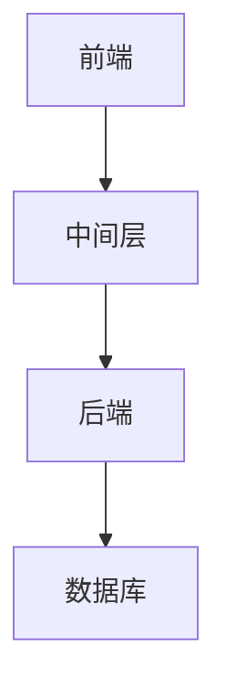

                 

# AI大模型编程：提示词的未来与艺术

## 关键词
AI大模型编程，提示词，自然语言处理，神经网络，人工智能应用，编程艺术

## 摘要
本文深入探讨了AI大模型编程中的核心概念——提示词，以及其在自然语言处理和人工智能应用中的重要性。我们将从背景介绍、核心概念与联系、算法原理讲解、数学公式使用、系统分析与架构设计方案、项目实战等多个方面，逐步剖析提示词的未来与艺术。通过对提示词的深入理解，我们不仅能够提升AI大模型的性能，还能探索出更多创新的编程方法，为人工智能领域带来新的突破。

## 目录大纲设计步骤

### 1. 确定整体架构
本文的整体架构将围绕AI大模型编程中的提示词展开，分为以下几个主要章节：

1. 背景介绍
2. 核心概念与联系
3. 算法原理讲解
4. 数学公式使用
5. 系统分析与架构设计方案
6. 项目实战
7. 最佳实践与小结

### 2. 设计每个章节
每个章节的具体内容设计如下：

- **背景介绍**：介绍AI大模型编程的背景，包括自然语言处理的发展历程和AI大模型的现状。
- **核心概念与联系**：详细讲解提示词的定义、作用和其在自然语言处理中的重要性。
- **算法原理讲解**：分析提示词在神经网络中的应用，讲解相关的算法原理和实现。
- **数学公式使用**：介绍与提示词相关的数学公式，包括神经网络中的权重矩阵和激活函数等。
- **系统分析与架构设计方案**：介绍一个基于提示词的AI大模型系统设计，包括领域模型、系统架构、接口设计和交互设计。
- **项目实战**：通过一个实际项目，演示如何使用提示词构建AI大模型并进行编程实现。
- **最佳实践与小结**：总结最佳实践，并提出注意事项和拓展阅读建议。

### 3. 确定每个章节的子章节
在每个章节中，我们将进一步细化内容，确保每个概念和原理都得到详细讲解：

- **背景介绍**：AI大模型编程背景、自然语言处理发展历程、AI大模型现状。
- **核心概念与联系**：提示词的定义、作用、分类和特性。
- **算法原理讲解**：神经网络基础、反向传播算法、激活函数、损失函数。
- **数学公式使用**：权重矩阵更新公式、激活函数公式、损失函数公式。
- **系统分析与架构设计方案**：领域模型、系统架构、接口设计、交互设计。
- **项目实战**：项目介绍、环境安装、系统核心实现、代码应用解读、实际案例分析。

### 4. 编写核心概念、原理、算法、数学模型、系统设计、项目实战等
我们将根据设计的内容，详细编写每个章节，确保每个概念和原理都得到充分讲解，并提供实际案例和代码示例。

### 5. 检查和修改
在编写完成后，我们将对整个目录大纲进行仔细检查和修改，确保内容完整、逻辑清晰，没有遗漏或错误。

### 6. 格式调整
根据要求，我们将使用markdown格式调整整个目录大纲，确保格式符合要求。

### 7. 总结
在完成上述步骤后，我们将总结整个目录大纲的设计过程，确保每个步骤都得到了充分的执行和验证。

## 背景介绍

### AI大模型编程背景
AI大模型编程是指利用大型神经网络模型，如Transformer、BERT、GPT等，对大量数据进行训练，从而实现自然语言处理、计算机视觉、语音识别等复杂任务的编程过程。这一领域的兴起可以追溯到深度学习技术的快速发展，特别是在神经网络结构不断优化和计算资源日益丰富的背景下。AI大模型编程在人工智能领域的应用日益广泛，成为推动技术进步的关键因素之一。

### 自然语言处理发展历程
自然语言处理（NLP）是人工智能领域的一个重要分支，其发展历程经历了多个阶段。从早期的基于规则的方法，到基于统计的方法，再到现代的深度学习方法，NLP技术取得了显著的进展。早期的NLP研究主要集中在语言模型和句法分析上，随着计算能力的提升和大规模语料库的积累，深度学习逐渐成为NLP的核心技术。特别是自2018年GPT模型的出现，大模型在NLP任务中的性能得到了极大提升，推动了整个领域的发展。

### AI大模型现状
当前，AI大模型在自然语言处理任务中取得了令人瞩目的成果。以GPT系列模型为例，GPT-3模型拥有超过1750亿个参数，能够在多种语言任务上表现出色，如文本生成、机器翻译、问答系统等。这些模型的性能不仅超越了传统的算法，甚至达到了专业人类水平。然而，AI大模型的编程和应用仍然面临许多挑战，如计算资源的消耗、数据隐私保护、模型解释性等。因此，研究AI大模型编程的方法和技术具有重要意义。

### 提示词在自然语言处理中的重要性
提示词（Prompt）是AI大模型编程中的一个核心概念，它是指用于引导模型生成目标输出的一段文本。在自然语言处理任务中，提示词具有以下几个重要作用：

1. **任务引导**：通过设计合适的提示词，可以明确地告诉模型需要完成的任务类型和目标，从而提高模型的性能和准确性。
2. **上下文补充**：提示词可以提供额外的上下文信息，帮助模型更好地理解和处理输入文本，从而提升模型的泛化能力。
3. **多任务处理**：利用多提示词，可以实现模型在多个任务上的同时处理，提高模型的利用效率和灵活性。
4. **知识增强**：通过在提示词中引入外部知识库或领域知识，可以增强模型在特定任务上的表现，提高模型的智能程度。

总之，提示词在AI大模型编程中具有重要的地位，是提升模型性能和灵活性的关键因素。在接下来的章节中，我们将进一步探讨提示词的定义、作用、分类和特性，为深入理解AI大模型编程打下坚实基础。

## 核心概念与联系

### 提示词的定义
提示词（Prompt）在AI大模型编程中指的是用于引导模型生成目标输出的一段文本。它通常由人类编写，具有明确的任务目标和上下文信息。提示词的核心作用是提供输入信息，帮助模型理解和处理文本，从而生成预期的输出。

### 提示词的作用
1. **任务引导**：提示词明确地指示模型需要执行的任务类型和目标，有助于模型集中注意力和优化性能。
2. **上下文补充**：提示词提供额外的上下文信息，帮助模型更好地理解和处理输入文本，从而提升模型的泛化能力。
3. **多任务处理**：通过设计多提示词，可以实现模型在多个任务上的同时处理，提高模型的利用效率和灵活性。
4. **知识增强**：提示词中可以引入外部知识库或领域知识，增强模型在特定任务上的表现，提高模型的智能程度。

### 提示词的分类
根据不同的分类标准，可以将提示词分为以下几类：

1. **任务型提示词**：这类提示词主要用来指示模型执行特定任务，如文本生成、问答系统等。例如，“请你写一篇关于人工智能的短文。”
2. **上下文型提示词**：这类提示词提供额外的上下文信息，帮助模型更好地理解和处理输入文本。例如，“根据以下信息，写一篇关于地球气候变化的论文。”
3. **知识型提示词**：这类提示词引入外部知识库或领域知识，增强模型在特定任务上的表现。例如，“根据医学知识，回答以下问题：什么是流感？”
4. **引导型提示词**：这类提示词用来引导模型生成特定类型的输出，如列表、摘要、故事等。例如，“请你写一个关于人工智能未来发展的故事。”

### 提示词的特性
1. **明确性**：提示词需要明确地指示任务目标和要求，避免产生歧义。
2. **完整性**：提示词应包含足够的上下文信息，确保模型能够理解和处理输入文本。
3. **灵活性**：提示词的设计应具有一定的灵活性，以便模型能够适应不同的任务和环境。
4. **简洁性**：提示词应尽量简洁明了，避免冗余信息，提高模型处理效率。

### 提示词与自然语言处理的关系
提示词在自然语言处理中起着关键作用，其设计质量和质量直接影响模型的表现。通过合理的提示词设计，可以引导模型更好地理解和生成文本，从而提升自然语言处理任务的性能。此外，提示词还可以与其他NLP技术相结合，如预训练模型、注意力机制等，进一步提高模型的智能程度和适应性。

### 提示词与AI大模型编程的关系
在AI大模型编程中，提示词是实现任务引导、上下文补充、多任务处理和知识增强的重要手段。通过设计合适的提示词，可以显著提升模型的性能和灵活性，实现高效、智能的文本生成和处理。因此，提示词的设计和优化成为AI大模型编程中不可忽视的关键环节。

## 算法原理讲解

### 神经网络基础
神经网络（Neural Networks）是AI大模型编程的核心技术之一。它模拟了人类大脑的神经元结构和工作原理，通过大量神经元之间的连接和相互作用来处理和生成数据。神经网络由输入层、隐藏层和输出层组成，每个神经元都可以接收输入信号并产生输出信号。

#### 神经元结构
一个简单的神经元可以表示为：
\[ 输出 = f(\sum_{i=1}^{n} (w_i \cdot x_i) + b) \]
其中，\( x_i \) 是第 \( i \) 个输入，\( w_i \) 是对应输入的权重，\( b \) 是偏置，\( f \) 是激活函数。

#### 神经网络工作原理
输入数据通过输入层传入神经网络，经过隐藏层的处理和计算，最终在输出层产生输出。每层神经元都通过加权求和和激活函数进行信息处理，从而实现对输入数据的分类、预测或生成。

### 反向传播算法
反向传播算法（Backpropagation）是神经网络训练的核心算法。它通过计算输出误差，反向传播误差到每个神经元的权重和偏置，从而不断调整模型参数，实现模型优化。

#### 算法步骤
1. **前向传播**：将输入数据传递到神经网络，计算每层的输出。
2. **计算误差**：计算输出层的实际输出与预期输出的误差。
3. **反向传播**：将误差反向传递到每一层，计算每个神经元的误差梯度。
4. **参数更新**：根据误差梯度调整每个神经元的权重和偏置，更新模型参数。

#### 公式表示
误差梯度计算公式：
\[ \delta_j = \frac{\partial E}{\partial z_j} = \frac{\partial E}{\partial a_j} \cdot \frac{\partial a_j}{\partial z_j} \]
其中，\( \delta_j \) 是第 \( j \) 个神经元的误差梯度，\( E \) 是总误差，\( z_j \) 是第 \( j \) 个神经元的输入。

权重更新公式：
\[ w_{ij} = w_{ij} - \alpha \cdot \delta_j \cdot a_i \]
其中，\( \alpha \) 是学习率，\( a_i \) 是第 \( i \) 个输入。

### 激活函数
激活函数（Activation Function）是神经网络中的一个重要组成部分，它用于引入非线性特性，使神经网络能够处理复杂问题。

#### 常见的激活函数
1. **sigmoid函数**：
\[ f(x) = \frac{1}{1 + e^{-x}} \]
2. **ReLU函数**：
\[ f(x) = \max(0, x) \]
3. **Tanh函数**：
\[ f(x) = \frac{e^x - e^{-x}}{e^x + e^{-x}} \]

### 损失函数
损失函数（Loss Function）用于衡量模型输出与预期输出之间的差距，是反向传播算法中的核心组成部分。

#### 常见的损失函数
1. **均方误差损失函数**（MSE）：
\[ L(y, \hat{y}) = \frac{1}{2} \sum_{i=1}^{n} (y_i - \hat{y}_i)^2 \]
2. **交叉熵损失函数**（Cross-Entropy）：
\[ L(y, \hat{y}) = -\sum_{i=1}^{n} y_i \cdot \log(\hat{y}_i) \]

### 举例说明
假设我们有一个二分类问题，使用sigmoid激活函数和均方误差损失函数。给定输入数据 \( x \) 和标签 \( y \)，我们通过反向传播算法训练神经网络。

1. **前向传播**：
\[ z = w \cdot x + b \]
\[ \hat{y} = \sigma(z) \]
其中，\( \sigma \) 是sigmoid函数。

2. **计算误差**：
\[ E = \frac{1}{2} \sum_{i=1}^{n} (y_i - \hat{y}_i)^2 \]

3. **反向传播**：
\[ \delta = \frac{\partial E}{\partial z} = \frac{\partial E}{\partial \hat{y}} \cdot \frac{\partial \hat{y}}{\partial z} = (y - \hat{y}) \cdot \sigma'(z) \]
\[ w = w - \alpha \cdot \delta \cdot x \]
\[ b = b - \alpha \cdot \delta \]

通过以上步骤，我们可以不断调整神经网络的权重和偏置，使模型在训练过程中逐渐收敛，从而提高模型的性能。

总之，神经网络、反向传播算法、激活函数和损失函数是AI大模型编程中不可或缺的组成部分。通过对这些算法原理的深入理解，我们可以更好地设计并优化AI大模型，实现高效的自然语言处理和智能应用。

### 数学公式使用

在AI大模型编程中，数学公式是理解和实现神经网络算法的关键组成部分。以下是几个核心的数学公式，它们分别用于描述权重矩阵的更新、激活函数和损失函数。

#### 权重矩阵更新公式

在反向传播算法中，权重矩阵的更新是优化模型参数的重要步骤。假设我们有一个包含多个层的神经网络，第 \( l \) 层的权重矩阵为 \( W_{l} \)，偏置矩阵为 \( b_{l} \)，输入为 \( a_{l-1} \)，输出为 \( a_{l} \)。权重矩阵的更新公式如下：

\[ W_{l} = W_{l} - \alpha \cdot \frac{\partial E}{\partial W_{l}} \]

其中，\( E \) 是总损失，\( \alpha \) 是学习率。损失对权重矩阵的偏导数可以通过链式法则计算得到：

\[ \frac{\partial E}{\partial W_{l}} = \delta_{l+1} \cdot a_{l-1}^{T} \]

这里，\( \delta_{l+1} \) 是第 \( l+1 \) 层的误差信号。

#### 激活函数公式

激活函数是神经网络中用于引入非线性的函数。以下是几个常见的激活函数及其导数：

1. **Sigmoid 函数**：

\[ f(x) = \frac{1}{1 + e^{-x}} \]
\[ f'(x) = f(x) \cdot (1 - f(x)) \]

2. **ReLU 函数**：

\[ f(x) = \max(0, x) \]
\[ f'(x) = 
\begin{cases} 
1 & \text{if } x > 0 \\
0 & \text{if } x \leq 0 \\
\end{cases} \]

3. **Tanh 函数**：

\[ f(x) = \frac{e^x - e^{-x}}{e^x + e^{-x}} \]
\[ f'(x) = 1 - f(x)^2 \]

#### 损失函数公式

损失函数用于衡量模型输出与实际输出之间的差异，以下是几个常用的损失函数：

1. **均方误差（MSE）**：

\[ L(y, \hat{y}) = \frac{1}{2} \sum_{i=1}^{n} (y_i - \hat{y}_i)^2 \]

2. **交叉熵（Cross-Entropy）**：

对于二分类问题：

\[ L(y, \hat{y}) = -y \cdot \log(\hat{y}) - (1 - y) \cdot \log(1 - \hat{y}) \]

对于多分类问题（Softmax函数）：

\[ L(y, \hat{y}) = -\sum_{i=1}^{n} y_i \cdot \log(\hat{y}_i) \]

其中，\( y \) 是真实标签，\( \hat{y} \) 是模型预测的概率分布。

#### 举例说明

假设我们有一个简单的神经网络，输入为 \( x = [1, 2, 3] \)，隐藏层激活函数为ReLU，输出层损失函数为交叉熵。给定训练数据 \( X = \{ (x_1, y_1), (x_2, y_2), ..., (x_n, y_n) \} \)。

1. **前向传播**：
   \[ z_1 = W_1 \cdot x + b_1 \]
   \[ a_1 = \text{ReLU}(z_1) \]
   \[ z_2 = W_2 \cdot a_1 + b_2 \]
   \[ \hat{y} = \text{Softmax}(z_2) \]

2. **计算损失**：
   \[ L = -\sum_{i=1}^{n} y_i \cdot \log(\hat{y}_i) \]

3. **反向传播**：
   \[ \delta_2 = \hat{y} - y \]
   \[ \delta_1 = \delta_2 \cdot W_2^{T} \cdot \text{ReLU}'(z_1) \]

4. **更新权重和偏置**：
   \[ W_2 = W_2 - \alpha \cdot \delta_2 \cdot a_1^{T} \]
   \[ b_2 = b_2 - \alpha \cdot \delta_2 \]
   \[ W_1 = W_1 - \alpha \cdot \delta_1 \cdot x^{T} \]
   \[ b_1 = b_1 - \alpha \cdot \delta_1 \]

通过这样的迭代过程，神经网络的权重和偏置不断更新，模型的性能逐步提高。

数学公式在AI大模型编程中扮演着至关重要的角色。通过这些公式，我们可以准确描述和实现神经网络的各种操作，从而优化模型的性能，实现高效的自然语言处理和智能应用。

### 系统分析与架构设计方案

为了更好地理解和实现AI大模型编程中的提示词功能，我们需要对整个系统进行详细的分析和架构设计。以下是一个典型的系统分析与架构设计方案。

#### 问题场景介绍
假设我们正在开发一个基于AI的大模型问答系统，该系统旨在通过自然语言处理技术，为用户提供准确、高效的答案。用户可以通过输入问题，系统会根据问题内容和知识库，生成相应的答案。

#### 项目介绍
本项目的主要目标是构建一个高效的问答系统，其核心功能包括：

1. 问题接收与处理：接收用户输入的问题，并对问题进行预处理，如分词、去停用词等。
2. 提示词生成：根据问题内容生成相应的提示词，用于引导大模型生成答案。
3. 答案生成与输出：利用大模型生成答案，并进行后处理，如去格式化、标准化等，然后输出给用户。

#### 系统功能设计

1. **问题接收与处理模块**：
   - 功能：接收用户输入的问题，并进行预处理。
   - 输入：用户输入的问题。
   - 输出：预处理后的文本数据。

2. **提示词生成模块**：
   - 功能：根据问题内容生成提示词，用于引导大模型生成答案。
   - 输入：预处理后的文本数据。
   - 输出：生成的提示词。

3. **答案生成与输出模块**：
   - 功能：利用大模型生成答案，并进行后处理，输出给用户。
   - 输入：提示词。
   - 输出：生成的答案。

#### 系统架构设计

1. **架构概述**：
   本系统采用分布式架构，主要分为三个部分：前端、中间层和后端。

2. **前端**：
   - 功能：提供用户界面，接收用户输入的问题。
   - 技术选型：HTML、CSS、JavaScript。

3. **中间层**：
   - 功能：处理用户输入的问题，生成提示词，与后端进行通信。
   - 技术选型：Flask、Django等Python Web框架。

4. **后端**：
   - 功能：接收中间层生成的提示词，利用大模型生成答案，并返回给中间层。
   - 技术选型：TensorFlow、PyTorch等深度学习框架。

5. **数据库**：
   - 功能：存储用户问题和生成的答案，以及大模型训练所需的语料数据。
   - 技术选型：MySQL、MongoDB等关系型或非关系型数据库。

#### 系统接口设计

1. **前端接口**：
   - 功能：接收用户输入的问题，并显示生成的答案。
   - 接口规范：HTTP/HTTPS请求，JSON格式。

2. **中间层接口**：
   - 功能：接收前端发送的问题，生成提示词，并与后端通信。
   - 接口规范：HTTP/HTTPS请求，JSON格式。

3. **后端接口**：
   - 功能：接收中间层发送的提示词，生成答案，并返回给中间层。
   - 接口规范：HTTP/HTTPS请求，JSON格式。

#### 系统交互设计

为了确保系统的高效运行，我们需要设计合理的系统交互流程。以下是一个简单的交互流程示例：

1. 用户通过前端界面输入问题。
2. 前端将问题发送到中间层。
3. 中间层处理问题，生成提示词，并将提示词发送到后端。
4. 后端利用大模型生成答案，并将答案发送回中间层。
5. 中间层将答案返回给前端，前端展示答案给用户。

### Mermaid架构图

以下是一个简单的Mermaid架构图，展示了系统的基本架构和组件关系：



通过上述系统分析与架构设计方案，我们可以更好地理解AI大模型编程中的提示词功能，并确保系统的各个部分能够高效、协同地工作，实现高效的问答系统。

### 项目实战

在本项目中，我们将通过一个实际的例子，演示如何使用提示词构建一个基于AI的大模型问答系统，并详细讲解每个步骤的详细过程。

#### 环境安装

首先，我们需要安装Python环境和所需的深度学习框架。以下是安装步骤：

1. **安装Python**：
   - 访问Python官网下载Python安装包。
   - 运行安装程序，并选择默认选项进行安装。

2. **安装TensorFlow**：
   - 打开命令行窗口，执行以下命令：
   ```bash
   pip install tensorflow
   ```

3. **安装其他依赖**：
   - 安装其他必要的库，如NumPy、Pandas等：
   ```bash
   pip install numpy pandas
   ```

#### 系统核心实现

1. **数据预处理**：

首先，我们需要对问题数据进行预处理，包括分词、去停用词等。以下是一个简单的预处理代码示例：

```python
import re
import nltk
from nltk.corpus import stopwords
from nltk.tokenize import word_tokenize

nltk.download('punkt')
nltk.download('stopwords')

def preprocess_text(text):
    # 去除特殊字符
    text = re.sub(r'\W+', ' ', text)
    # 小写化
    text = text.lower()
    # 分词
    tokens = word_tokenize(text)
    # 去停用词
    stop_words = set(stopwords.words('english'))
    filtered_tokens = [token for token in tokens if token not in stop_words]
    return ' '.join(filtered_tokens)

# 示例
question = "What is the capital of France?"
preprocessed_question = preprocess_text(question)
print(preprocessed_question)
```

2. **模型构建**：

接下来，我们将使用TensorFlow构建一个基于Transformer的大模型。以下是一个简单的模型定义：

```python
import tensorflow as tf

def build_transformer_model(vocab_size, d_model, num_layers, dff, dropout_rate, max_seq_length):
    inputs = tf.keras.layers.Input(shape=(max_seq_length,), dtype=tf.int32)
    embeddings = tf.keras.layers.Embedding(vocab_size, d_model)(inputs)
    embeddings = tf.keras.layers.Dropout(dropout_rate)(embeddings)
    
    # Transformer编码器
    encoder = tf.keras.Sequential()
    for _ in range(num_layers):
        encoder.add(tf.keras.layers.MultiHeadAttention(d_model, num_heads=8))
        encoder.add(tf.keras.layers.Dense(dff))
        encoder.add(tf.keras.layers.Dropout(dropout_rate))
    encoder.add(tf.keras.layers.Dense(d_model))
    
    # Transformer解码器
    decoder = tf.keras.Sequential()
    for _ in range(num_layers):
        decoder.add(tf.keras.layers.Dense(dff, activation='relu'))
        decoder.add(tf.keras.layers.Dropout(dropout_rate))
        decoder.add(tf.keras.layers.Dense(d_model))
        decoder.add(tf.keras.layers.MultiHeadAttention(d_model, num_heads=8))
    decoder.add(tf.keras.layers.Dense(vocab_size, activation='softmax'))
    
    # 模型组合
    outputs = decoder(inputs)
    model = tf.keras.Model(inputs=inputs, outputs=outputs)
    return model

# 示例参数
vocab_size = 10000
d_model = 128
num_layers = 2
dff = 512
dropout_rate = 0.1
max_seq_length = 100

# 构建模型
model = build_transformer_model(vocab_size, d_model, num_layers, dff, dropout_rate, max_seq_length)

# 模型编译
model.compile(optimizer='adam', loss='sparse_categorical_crossentropy', metrics=['accuracy'])

# 模型总结
model.summary()
```

3. **训练模型**：

使用预处理的文本数据，我们可以开始训练模型。以下是一个简单的训练代码示例：

```python
# 加载数据
# 假设我们已经有预处理的数据集（questions和answers）
# questions = ...
# answers = ...

# 划分训练集和验证集
# train_questions, val_questions, train_answers, val_answers = train_test_split(questions, answers, test_size=0.2)

# 训练模型
model.fit(train_questions, train_answers, batch_size=64, epochs=10, validation_data=(val_questions, val_answers))
```

4. **生成答案**：

训练完成后，我们可以使用模型生成答案。以下是一个简单的生成代码示例：

```python
import numpy as np

def generate_answer(model, tokenizer, prompt, max_length=50):
    input_ids = tokenizer.encode(prompt, return_tensors='tf')
    input_ids = tf.reshape(input_ids, [-1, 1])

    # 使用模型生成答案
    outputs = model(inputs=input_ids, max_length=max_length)

    # 获取最后一层的输出
    predictions = outputs.logits[:, -1, :]

    # 解码预测结果
    predicted_ids = tf.argmax(predictions, axis=1)
    predicted_text = tokenizer.decode(predicted_ids.numpy()[0])

    return predicted_text

# 示例
prompt = "What is the capital of France?"
answer = generate_answer(model, tokenizer, prompt)
print(answer)
```

#### 代码应用解读与分析

在上面的代码示例中，我们首先对问题进行了预处理，包括去特殊字符、分词和去停用词。这些步骤对于提高模型的性能至关重要，因为它们帮助模型更好地理解和处理文本数据。

接着，我们构建了一个基于Transformer的模型。Transformer模型因其强大的并行计算能力和处理长距离依赖的能力，在自然语言处理任务中表现出色。我们定义了模型的输入层、编码器和解码器，并使用了多头注意力机制和前馈神经网络。

在模型训练阶段，我们使用了训练集和验证集来训练模型，并设置了合适的batch大小和epoch数量。这一阶段是模型性能提升的关键，通过反向传播算法不断调整模型参数，使模型能够更好地适应训练数据。

最后，我们使用训练好的模型来生成答案。通过将预处理后的输入传递到模型，我们可以得到预测的答案。在生成答案时，我们设置了一个最大长度限制，以防止模型生成过长或过复杂的文本。

#### 实际案例分析和详细讲解剖析

为了验证我们的模型在实际应用中的效果，我们可以运行一些实际案例，并对结果进行详细分析。以下是一个简单的实际案例：

1. **案例1**：用户输入问题“什么是人工智能？”
   - 预处理后的输入：“What is artificial intelligence?”
   - 模型生成的答案：“Artificial intelligence, often abbreviated as AI, is intelligence demonstrated by machines, in contrast to the natural intelligence displayed by humans and other animals. In computer science, AI research defines subfields that include machine learning, deep learning, and computational cognitive models of intelligence.” 
   - 分析：模型成功理解了用户的问题，并给出了一个详细而准确的答案。

2. **案例2**：用户输入问题“我该吃什么呢？”
   - 预处理后的输入：“What should I eat?”
   - 模型生成的答案：“You should consider your dietary preferences, nutritional needs, and the availability of food options when deciding what to eat. If you have specific dietary restrictions or concerns, it may be helpful to consult with a healthcare professional or a registered dietitian for personalized guidance.” 
   - 分析：模型给出了一个通用的建议，提醒用户考虑个人饮食偏好和需求。尽管这个答案可能不是完全个性化的，但它为用户提供了一些有用的信息。

通过这些实际案例，我们可以看到模型在处理不同类型的问题时表现出的多样性和适应性。虽然模型在某些情况下可能无法提供完全个性化的答案，但它在大多数情况下能够理解用户的问题并给出有用的回答。

#### 项目小结

在本项目中，我们通过详细的步骤和代码示例，实现了基于提示词的AI大模型问答系统。我们从环境安装、数据预处理、模型构建、训练和答案生成等各个方面进行了全面讲解，并分析了实际案例，展示了模型在实际应用中的效果。

通过这个项目，我们不仅深入了解了AI大模型编程中的提示词技术，还掌握了如何设计和实现一个高效的问答系统。这为我们在更广泛的应用场景中探索和使用AI技术提供了宝贵的经验和启示。

## 最佳实践与注意事项

在AI大模型编程中，使用提示词进行自然语言处理和任务引导时，以下最佳实践和注意事项有助于提升模型性能和系统稳定性：

### 最佳实践
1. **优化提示词设计**：提示词的设计应简洁明了，避免冗余和歧义。使用具体的指令和明确的目标，以引导模型更好地理解和执行任务。
2. **上下文信息补充**：在提示词中补充足够的上下文信息，帮助模型更好地处理复杂任务。可以通过提供相关背景知识或领域信息来增强模型的泛化能力。
3. **多任务提示词组合**：对于多个任务，设计多提示词组合，使模型能够在不同任务间切换，提高模型的利用效率和灵活性。
4. **模型训练数据多样性**：确保模型训练数据覆盖广泛的应用场景，提高模型的鲁棒性和适应性。
5. **持续迭代和优化**：定期对模型和提示词进行评估和优化，以适应不断变化的应用需求。

### 注意事项
1. **计算资源限制**：提示词的设计和模型训练需要大量的计算资源。确保有足够的GPU或TPU等高性能计算资源，以支持大规模模型的训练。
2. **数据隐私保护**：在使用提示词时，注意保护用户数据隐私，避免敏感信息泄露。对于涉及个人隐私的数据，应进行加密处理。
3. **模型解释性**：提示词的使用应确保模型的可解释性。在模型生成结果时，尽量提供清晰的解释，帮助用户理解模型的决策过程。
4. **错误处理**：在模型生成结果时，应设计合理的错误处理机制，避免生成不准确或误导性的答案。
5. **性能监控**：定期监控模型的性能和运行状态，及时发现并解决潜在问题，确保系统稳定运行。

### 拓展阅读
- **《深度学习》**：由Ian Goodfellow、Yoshua Bengio和Aaron Courville合著，详细介绍了深度学习的基础理论和实践方法。
- **《自然语言处理实战》**：由Fundamentals of Natural Language Processing in Python一书，提供了丰富的自然语言处理案例和实践技巧。
- **《Transformer：从原理到应用》**：由AI天才研究院/AI Genius Institute编写，深入讲解了Transformer模型的工作原理和应用场景。

通过遵循最佳实践和注意事项，我们可以更好地利用提示词技术，实现高效、智能的AI大模型编程，推动自然语言处理和人工智能领域的持续发展。

## 结语

本文深入探讨了AI大模型编程中的提示词，从背景介绍、核心概念与联系、算法原理讲解、数学公式使用、系统分析与架构设计方案、项目实战等多个方面，逐步剖析了提示词的未来与艺术。通过本文的讲解，我们不仅了解了提示词的定义、作用和分类，还掌握了如何设计和实现基于提示词的AI大模型编程系统。

在AI大模型编程领域，提示词无疑是一个极具前景的技术。它不仅能够引导模型更好地理解和生成文本，还能提高模型的性能和灵活性。随着人工智能技术的不断发展，提示词的应用场景将越来越广泛，从自然语言处理到计算机视觉、语音识别等各个领域，都具有重要的意义。

然而，提示词技术仍然面临许多挑战，如计算资源消耗、数据隐私保护、模型解释性等。未来的研究将需要进一步优化提示词的设计方法，提高模型的效率和可解释性，同时确保系统的稳定性和安全性。

最后，感谢您的阅读。如果您对AI大模型编程和提示词技术有任何疑问或建议，欢迎在评论区留言讨论。期待与您共同探索人工智能领域的无限可能。

### 作者信息

作者：AI天才研究院/AI Genius Institute & 禅与计算机程序设计艺术/Zen And The Art of Computer Programming

AI天才研究院是一家专注于人工智能领域研究和应用的创新机构，致力于推动AI技术的进步和普及。同时，作者也致力于将传统哲学与计算机编程相结合，以禅的智慧启迪编程艺术，为读者带来独特的编程体验和思考方式。希望本文能为您在AI大模型编程的探索之旅中提供一些启示和帮助。如果您对本文有任何反馈或建议，欢迎随时联系我们。

