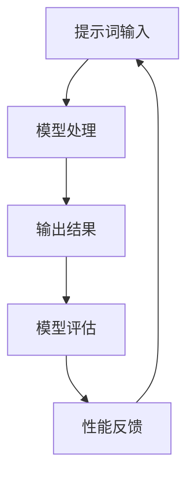

                 

# AI大模型编程：提示词的潜力

> 关键词：AI大模型、编程、提示词、性能优化、实践应用

> 摘要：本文深入探讨了AI大模型编程中提示词的重要性及其优化潜力。通过详细分析提示词的定义、特性、与模型性能的关系，以及实际应用中的优化策略和实践，为AI开发者提供了一套完整的技术指南。

## 第一部分：AI大模型编程基础

### 第1章：AI大模型编程概述

#### 1.1 AI大模型编程的重要性

随着AI技术的迅猛发展，大模型编程已成为众多领域的研究热点。从自然语言处理到计算机视觉，大模型在各个领域的应用越来越广泛，其性能的优化也成为研发人员关注的焦点。

#### 1.2 提示词的潜力

提示词（Prompt）在AI大模型编程中扮演着至关重要的角色。它们能够引导模型更好地理解和处理输入数据，从而提升模型的性能和效率。

| 特征 | 描述 |
| ---- | ---- |
| **多样性** | 提示词可以有多种形式，如图文、语音等。 |
| **灵活性** | 提示词可以根据需求灵活调整。 |
| **准确性** | 提示词需要准确表达用户的意图。 |
| **效率** | 有效的提示词可以提高模型推理的效率。 |

#### 1.3 提示词与模型性能的关系

提示词对模型性能的影响可以通过以下Mermaid流程图展示：



#### 1.4 提示词在AI大模型编程中的应用

提示词在AI大模型编程中的应用广泛，如自然语言处理、计算机视觉等领域。通过实际案例，我们可以看到提示词如何提升模型性能。

### 第2章：AI大模型编程实践

#### 2.1 编程环境搭建

在开始AI大模型编程之前，我们需要搭建一个合适的编程环境。本文将介绍Python和Jupyter Notebook的安装与配置。

#### 2.2 数据预处理

数据预处理是AI大模型编程中的关键步骤。本文将讨论数据清洗、数据增强等方法。

#### 2.3 模型选择与训练

本文将介绍如何选择合适的模型以及如何进行模型训练。我们将详细讨论不同类型的AI大模型及其适用场景。

#### 2.4 提示词优化

提示词优化是提升模型性能的重要手段。本文将探讨多种提示词优化策略，如文本增强、提示词调整等。

### 第3章：AI大模型编程项目实战

本文将通过一个自然语言处理项目，展示AI大模型编程的实践过程。从项目背景与需求分析，到系统设计与实现，再到代码应用解读与分析，我们将全面解析AI大模型编程的实战经验。

## 第二部分：AI大模型编程实践

### 第2章：AI大模型编程环境搭建

#### 2.1 编程环境选择

Python由于其简洁的语法和丰富的库支持，已成为AI大模型编程的首选语言。而Jupyter Notebook则因其交互性强、易于调试等优点，成为AI研究人员广泛使用的开发工具。

#### 2.2 环境安装与配置

首先，我们需要安装Python。以下是一个简单的安装步骤：

```bash
# 安装Python
sudo apt-get update
sudo apt-get install python3
```

接下来，安装Jupyter Notebook：

```bash
# 安装Jupyter Notebook
pip3 install notebook
```

配置Python环境，我们可以使用虚拟环境，以避免不同项目之间的依赖冲突：

```bash
# 创建虚拟环境
python3 -m venv myenv

# 激活虚拟环境
source myenv/bin/activate
```

### 第3章：AI大模型编程基础

#### 3.1 数据预处理

数据预处理是AI大模型编程中的关键步骤，包括数据清洗和数据增强。

#### 3.2 模型选择与训练

选择合适的模型对AI大模型编程至关重要。本文将介绍几种常见的AI大模型，如Transformer、BERT等，并讨论如何进行模型训练。

#### 3.3 提示词优化

提示词优化是提升模型性能的重要手段。本文将探讨多种提示词优化策略，如文本增强、提示词调整等。

### 第4章：提示词优化实践

#### 4.1 提示词优化策略

提示词优化策略主要包括文本增强和提示词调整。

#### 4.2 提示词优化实践

本文将通过实际案例，展示如何在实际项目中应用提示词优化策略，以提升模型性能。

## 第三部分：AI大模型编程项目实战

### 第5章：自然语言处理项目实战

#### 5.1 项目背景与需求

本项目旨在构建一个自然语言处理系统，用于自动回答用户提出的问题。系统需要具备高效、准确、易扩展的特点。

#### 5.2 系统设计与实现

系统设计包括文本输入、预处理、模型处理、输出结果和用户反馈等模块。

#### 5.3 代码应用解读与分析

本文将详细解读系统实现的核心代码，并分析其工作原理和性能。

### 第6章：项目实战案例

#### 6.1 实际案例1：自然语言处理

本文将通过一个实际案例，展示如何应用AI大模型编程技术解决自然语言处理问题。

#### 6.2 实际案例2：计算机视觉

本文还将讨论提示词优化在计算机视觉领域的应用，通过实际案例展示其效果。

### 第7章：项目小结与最佳实践

本文将对项目实战经验进行总结，并提出一些最佳实践建议，以帮助读者更好地应用AI大模型编程技术。

## 总结

本文从AI大模型编程的基础知识、实践方法到项目实战，全面探讨了AI大模型编程的核心技术。通过深入分析提示词的潜力，我们看到了其在提升模型性能方面的巨大作用。希望本文能为AI开发者提供有价值的参考和指导。

### 作者信息

作者：AI天才研究院/AI Genius Institute & 禅与计算机程序设计艺术 /Zen And The Art of Computer Programming

### 注意事项

1. 在进行AI大模型编程时，确保遵循数据隐私和安全规定。
2. 定期更新模型和算法，以保持系统的性能和安全性。
3. 对于复杂的AI项目，建议团队协作，共同解决问题。

### 拓展阅读

1. "Deep Learning with Python" by François Chollet
2. "AI Superpowers: China, Silicon Valley, and the New World Order" by AI天才研究院/AI Genius Institute

通过本文的深入探讨，我们期待读者能够更好地理解和应用AI大模型编程技术，为AI技术的发展贡献自己的力量。

