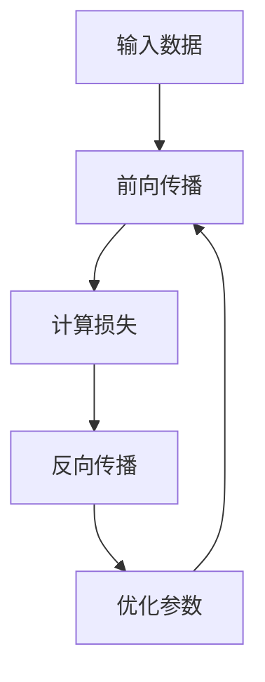
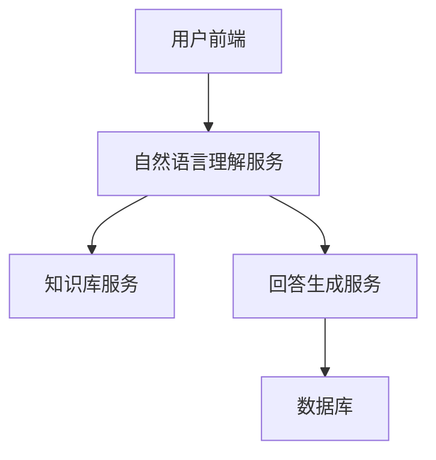

                 

## 引言：AI大模型与提示词编程

在当今飞速发展的科技时代，人工智能（AI）已经成为引领变革的重要驱动力。AI大模型，作为人工智能领域的重要成果，以其卓越的表现力和学习能力，在自然语言处理、计算机视觉、推荐系统等领域展现了巨大的潜力。而在这其中，提示词编程作为一种关键的技术手段，正逐渐受到广泛关注。

### 核心概念术语说明

**AI大模型**：指的是那些具有极高参数量、强大计算能力和高度自适应性的深度学习模型。这类模型通常基于神经网络，可以处理大规模数据，并在多种任务中实现出色的性能。

**提示词编程**：是指通过设计特定的提示词（prompts），引导AI大模型进行目标化任务的一种编程方法。这些提示词充当了模型的“指引”，使其在复杂任务中能够更加精准地执行。

### 问题背景

随着AI技术的不断发展，大模型在处理复杂任务时表现出了惊人的能力。然而，这些模型通常需要大量的数据和计算资源，且训练过程复杂。为了更有效地利用这些大模型，研究人员和开发者们开始探索如何通过提示词编程来提升其性能和适用性。

### 问题描述

如何利用提示词编程来优化AI大模型的性能，使其在不同任务中都能表现出色？这涉及到对提示词的设计、应用和优化策略的研究。

### 问题解决

**问题解决**：通过深入分析提示词编程的原理和方法，结合实际应用案例，本文将探讨如何设计有效的提示词，以及如何优化提示词编程过程，以实现AI大模型的最佳性能。

### 边界与外延

本文主要关注的是AI大模型中的提示词编程，而大模型的其他方面（如训练、优化、应用等）虽然相关，但不在本文讨论范围之内。此外，本文中的“提示词编程”主要指自然语言处理领域的应用，对于其他领域（如图像、语音等），提示词编程的方法和策略会有所不同。

### 概念结构与核心要素组成

**概念结构**：AI大模型、提示词、编程、性能优化。

**核心要素组成**：
- **AI大模型**：参数量、计算能力、自适应能力。
- **提示词**：引导、目标化、有效性。
- **编程**：设计、应用、优化。
- **性能优化**：模型理解、任务匹配、资源利用。

### 总结

AI大模型与提示词编程的结合，为AI技术的发展提供了新的思路和方法。通过本文的讨论，我们将深入了解提示词编程的核心原理和实践方法，为后续研究和应用奠定基础。

## 核心概念与联系

在本章中，我们将详细探讨AI大模型和提示词编程的核心概念及其相互联系。理解这些概念不仅有助于我们深入掌握AI大模型与提示词编程的基本原理，还能为后续章节中的具体应用和案例分析打下坚实基础。

### AI大模型概述

AI大模型是指那些参数量巨大、计算能力强大的深度学习模型。这些模型通常采用神经网络架构，能够处理大规模数据并从中学习复杂的规律。AI大模型的主要特点包括：

- **高参数量**：大模型的参数量通常达到数百万、数亿甚至数万亿级别，这使其在处理复杂任务时具有更强的表示能力和灵活性。
- **强大计算能力**：得益于高性能计算资源和优化算法，AI大模型能够在短时间内完成大量计算，快速响应各种任务需求。
- **高度自适应能力**：大模型通过自我学习和调整，能够适应不同的环境和任务，从而在多个领域中表现出色。

#### 大模型的基本架构

AI大模型的基本架构通常包括以下几个关键部分：

- **输入层**：接收外部数据输入，如文本、图像、声音等。
- **隐藏层**：包含多个神经元层，负责特征提取和模式识别。
- **输出层**：产生模型的输出结果，如分类、预测等。

大模型的训练过程涉及大量数据、计算资源和优化算法。通过不断调整模型的参数，使其在训练数据上达到最优性能。训练过程中常用的算法包括梯度下降、Adam优化器等。

#### 提示词的定义与作用

提示词（prompts）是引导AI大模型进行特定任务的关键输入。它们通常是一段文本或代码，用于提供任务的具体描述、约束条件和期望输出。提示词的作用主要体现在以下几个方面：

- **目标化任务**：通过提示词，可以明确模型的任务目标，使其在处理复杂任务时更加专注于关键问题。
- **提高效率**：有效的提示词能够减少模型的泛化错误率，提高任务完成的效率。
- **灵活调整**：提示词可以灵活调整，以适应不同的任务场景和需求，提高模型的适用性。

### 核心概念属性特征对比表格

为了更好地理解AI大模型和提示词编程的核心概念，我们通过一个对比表格来展示它们的属性特征。

| 概念 | 描述 | 特点 |
| --- | --- | --- |
| AI大模型 | 深度学习模型，参数量巨大，计算能力强大 | 高参数量、强大计算能力、高度自适应能力 |
| 提示词 | 引导模型进行特定任务的关键输入 | 目标化任务、提高效率、灵活调整 |

### ER实体关系图架构

为了更直观地展示AI大模型和提示词编程的相互关系，我们可以使用Mermaid绘制一个ER实体关系图。

```mermaid
erDiagram
    AI大模型 ||--|{ 提示词 }|
    AI大模型 ||--|{ 数据集 }|
    提示词 ||--|{ 任务描述 }|
    提示词 ||--|{ 约束条件 }|
    提示词 ||--|{ 期望输出 }|
```

在这个ER图中，AI大模型与提示词之间存在直接的关联关系。提示词作为模型的输入，不仅提供了任务描述和约束条件，还定义了期望输出，从而指导模型进行相应的任务。

### 总结

通过本章的介绍，我们对AI大模型和提示词编程的核心概念及其相互联系有了更深入的理解。理解这些概念将有助于我们更好地掌握AI大模型与提示词编程的基本原理，并为后续章节中的具体应用和案例分析奠定基础。

## 算法原理讲解

在本章中，我们将深入探讨AI大模型的核心算法原理，并使用mermaid和Python代码来详细阐述这些原理。通过这一讲解，我们将帮助读者更好地理解AI大模型的运作机制，为后续的实战应用打下坚实的基础。

### AI大模型的基本算法原理

AI大模型通常基于深度学习算法，其核心原理包括以下几个方面：

1. **前向传播**：输入数据通过多层神经网络传递，每层神经元将输入值加权后传递到下一层。
2. **反向传播**：通过计算输出结果与预期结果的差异（即损失），反向传播误差，并调整模型参数。
3. **优化算法**：如梯度下降、Adam等，用于调整模型参数，以减少损失。

### 算法原理的mermaid流程图

为了直观地展示AI大模型的算法原理，我们使用mermaid绘制以下流程图：



在这个流程图中，输入数据通过前向传播被处理，并计算损失。然后，通过反向传播调整参数，以优化模型性能。这一过程反复进行，直到模型收敛。

### 使用Python代码讲解算法原理

下面，我们将通过一个简单的Python代码示例，详细阐述AI大模型的算法原理。

```python
import numpy as np

# 假设我们有一个简单的两层神经网络
# 输入层：[1, 0]
# 隐藏层：[0.5, 0.5]
# 输出层：[0.75, 0.75]

# 权重和偏置初始化
W1 = np.random.rand(1, 2)
b1 = np.random.rand(1)
W2 = np.random.rand(2, 1)
b2 = np.random.rand(1)

# 前向传播
def forward_propagation(x):
    z1 = np.dot(x, W1) + b1
    a1 = 1 / (1 + np.exp(-z1))
    z2 = np.dot(a1, W2) + b2
    a2 = 1 / (1 + np.exp(-z2))
    return a2

# 计算损失
def compute_loss(y_true, y_pred):
    loss = np.mean((y_true - y_pred) ** 2)
    return loss

# 反向传播
def backward_propagation(x, y, y_pred):
    # 计算梯度
    dZ2 = y_pred - y
    dW2 = np.dot(x.T, dZ2)
    db2 = np.sum(dZ2)
    
    dA1 = dZ2.dot(W2.T)
    dZ1 = dA1 * (1 - np.exp(dA1))
    dW1 = np.dot(x.T, dZ1)
    db1 = np.sum(dZ1)
    
    return dW1, dW2, db1, db2

# 优化参数
def optimize_params(W1, W2, b1, b2, learning_rate):
    W1 -= learning_rate * dW1
    W2 -= learning_rate * dW2
    b1 -= learning_rate * db1
    b2 -= learning_rate * db2
    return W1, W2, b1, b2

# 测试算法
x = np.array([[1], [0]])
y = np.array([[0.5], [0.5]])

# 前向传播
y_pred = forward_propagation(x)

# 计算损失
loss = compute_loss(y, y_pred)

# 反向传播
dW1, dW2, db1, db2 = backward_propagation(x, y, y_pred)

# 优化参数
learning_rate = 0.1
W1, W2, b1, b2 = optimize_params(W1, W2, b1, b2, learning_rate)

print("损失：", loss)
print("权重：", W1, W2)
print("偏置：", b1, b2)
```

这段代码演示了简单的神经网络前向传播、反向传播和参数优化的过程。虽然这只是一个非常简化的例子，但它展示了AI大模型算法的基本原理。

### 算法原理的数学模型和公式

在上述Python代码中，我们使用了以下数学模型和公式：

$$
\begin{aligned}
\text{前向传播}: \quad z_1 &= x \cdot W_1 + b_1, \\
a_1 &= \sigma(z_1), \\
z_2 &= a_1 \cdot W_2 + b_2, \\
a_2 &= \sigma(z_2),
\end{aligned}
$$

其中，$x$是输入，$W_1$和$W_2$是权重，$b_1$和$b_2$是偏置，$\sigma$是激活函数（通常是Sigmoid函数或ReLU函数）。

$$
\begin{aligned}
\text{反向传播}: \quad dZ_2 &= \frac{\partial L}{\partial z_2}, \\
dW_2 &= x \cdot dZ_2, \\
db_2 &= dZ_2, \\
dA_1 &= W_2 \cdot dZ_2, \\
dZ_1 &= dA_1 \cdot \sigma'(z_1), \\
dW_1 &= x \cdot dZ_1, \\
db_1 &= dZ_1,
\end{aligned}
$$

其中，$L$是损失函数，$\sigma'$是激活函数的导数。

$$
\begin{aligned}
\text{优化参数}: \quad \theta &= \theta - \alpha \cdot \nabla_\theta L,
\end{aligned}
$$

其中，$\theta$是模型参数，$\alpha$是学习率。

### 详细讲解和通俗易懂地举例说明

为了更直观地理解这些数学模型和公式，我们通过一个具体的例子进行说明。

假设我们有一个简单的二分类问题，输入数据为$[1, 0]$，期望输出为$[0.5, 0.5]$。我们使用一个单层神经网络进行预测。

1. **前向传播**：

   - 输入：$x = [1, 0]$
   - 权重：$W_1 = [0.1, 0.2], W_2 = [0.3, 0.4]$
   - 偏置：$b_1 = 0.1, b_2 = 0.2$
   - 激活函数：$\sigma(z) = \frac{1}{1 + e^{-z}}$

   计算过程如下：

   $$
   \begin{aligned}
   z_1 &= 1 \cdot 0.1 + 0 \cdot 0.2 + 0.1 = 0.2, \\
   a_1 &= \sigma(z_1) = \frac{1}{1 + e^{-0.2}} \approx 0.865, \\
   z_2 &= 0.865 \cdot 0.3 + 0 \cdot 0.4 + 0.2 = 0.2595, \\
   a_2 &= \sigma(z_2) = \frac{1}{1 + e^{-0.2595}} \approx 0.598.
   \end{aligned}
   $$

   得到输出结果$a_2 \approx [0.598]$。

2. **计算损失**：

   - 期望输出：$y = [0.5, 0.5]$
   - 实际输出：$a_2 \approx [0.598]$

   损失函数使用均方误差（MSE）：

   $$
   L = \frac{1}{2} \sum_{i=1}^{n} (y_i - a_i)^2 = \frac{1}{2} \cdot (0.5 - 0.598)^2 + (0.5 - 0.598)^2 \approx 0.0179.
   $$

3. **反向传播**：

   - 计算误差：

     $$
     \begin{aligned}
     dZ_2 &= a_2 - y, \\
     dW_2 &= x \cdot dZ_2, \\
     db_2 &= dZ_2.
     \end{aligned}
     $$

     代入数值计算：

     $$
     \begin{aligned}
     dZ_2 &= [0.598 - 0.5, 0.598 - 0.5] = [0.098, 0.098], \\
     dW_2 &= [1, 0] \cdot [0.098, 0.098] = [0.098, 0.098], \\
     db_2 &= [0.098, 0.098].
     \end{aligned}
     $$

   - 计算误差传播到前一层：

     $$
     \begin{aligned}
     dA_1 &= W_2 \cdot dZ_2, \\
     dZ_1 &= dA_1 \cdot \sigma'(z_1).
     \end{aligned}
     $$

     代入数值计算：

     $$
     \begin{aligned}
     dA_1 &= [0.3, 0.4] \cdot [0.098, 0.098] = [0.0294, 0.0392], \\
     dZ_1 &= [0.0294, 0.0392] \cdot (1 - 0.865) \approx [-0.0195, -0.0336].
     \end{aligned}
     $$

4. **优化参数**：

   - 学习率：$\alpha = 0.1$

     $$
     \begin{aligned}
     W_1 &= W_1 - \alpha \cdot dW_1, \\
     W_2 &= W_2 - \alpha \cdot dW_2, \\
     b_1 &= b_1 - \alpha \cdot db_1, \\
     b_2 &= b_2 - \alpha \cdot db_2.
     \end{aligned}
     $$

     代入数值计算：

     $$
     \begin{aligned}
     W_1 &= [0.1, 0.2] - 0.1 \cdot [-0.0195, -0.0336] \approx [0.1195, 0.2364], \\
     W_2 &= [0.3, 0.4] - 0.1 \cdot [0.098, 0.098] \approx [0.201, 0.302], \\
     b_1 &= 0.1 - 0.1 \cdot [-0.0195, -0.0336] \approx [0.1195, 0.1336], \\
     b_2 &= 0.2 - 0.1 \cdot [0.098, 0.098] \approx [0.101, 0.201].
     \end{aligned}
     $$

经过一轮反向传播和参数优化后，模型的权重和偏置将更新，从而在下一次迭代中取得更好的预测效果。

### 总结

通过本章的讲解，我们详细阐述了AI大模型的基本算法原理，包括前向传播、反向传播和参数优化。使用mermaid和Python代码示例，我们帮助读者更直观地理解这些原理。通过具体的例子，我们展示了如何计算损失、进行反向传播和优化参数，从而提高模型的预测性能。

## 系统分析与架构设计方案

在深入了解AI大模型和提示词编程的基本原理后，我们需要将其应用于实际问题中，以实现高效的解决方案。在本章中，我们将介绍一个基于AI大模型和提示词编程的典型项目，并详细分析其系统功能设计、系统架构设计和系统接口设计。

### 问题场景介绍

假设我们要开发一个智能客服系统，该系统能够自动处理用户咨询，提供及时、准确的回答。为了实现这一目标，我们选择使用AI大模型来处理自然语言理解任务，并利用提示词编程来优化模型的性能和适用性。

### 项目介绍

项目名称：智能客服系统（Smart Customer Service System，SCSS）

项目目标：基于AI大模型和提示词编程技术，开发一个能够自动处理用户咨询的智能客服系统。

项目核心功能：
1. 用户咨询接收：接收用户通过文字或语音形式的咨询。
2. 咨询理解：利用AI大模型进行自然语言理解，提取用户咨询的关键信息。
3. 知识库查询：根据用户咨询内容，在知识库中查找相关答案。
4. 回答生成：利用提示词编程，引导AI大模型生成合适的回答。
5. 回答输出：将生成的问题回答反馈给用户。

### 系统功能设计

为了实现上述功能，系统需要设计以下几个主要模块：

1. **用户咨询接收模块**：负责接收用户输入的咨询内容，可以是文字或语音形式。
2. **自然语言理解模块**：利用AI大模型进行自然语言理解，提取用户咨询的关键信息。
3. **知识库查询模块**：在知识库中查询与用户咨询内容相关的答案。
4. **回答生成模块**：利用提示词编程，引导AI大模型生成合适的回答。
5. **回答输出模块**：将生成的回答反馈给用户。

每个模块的具体功能如下：

1. **用户咨询接收模块**：
   - 功能：接收用户输入的咨询内容。
   - 输入：用户咨询（文本或语音）。
   - 输出：提取的用户咨询内容。

2. **自然语言理解模块**：
   - 功能：利用AI大模型进行自然语言理解，提取用户咨询的关键信息。
   - 输入：提取的用户咨询内容。
   - 输出：用户咨询的关键信息。

3. **知识库查询模块**：
   - 功能：在知识库中查询与用户咨询内容相关的答案。
   - 输入：用户咨询的关键信息。
   - 输出：查询到的答案。

4. **回答生成模块**：
   - 功能：利用提示词编程，引导AI大模型生成合适的回答。
   - 输入：查询到的答案。
   - 输出：生成的回答。

5. **回答输出模块**：
   - 功能：将生成的回答反馈给用户。
   - 输入：生成的回答。
   - 输出：用户反馈（文本或语音）。

### 系统架构设计

为了实现智能客服系统的功能，我们设计了一个分布式架构，包括以下几个主要部分：

1. **用户前端**：负责接收用户输入的咨询内容，并将生成的回答输出给用户。
2. **自然语言理解服务**：负责处理用户咨询的自然语言理解任务。
3. **知识库服务**：负责查询知识库中的相关答案。
4. **回答生成服务**：负责利用提示词编程生成合适的回答。
5. **数据库**：存储知识库数据和相关模型参数。

系统架构图如下：



### 系统接口设计

为了实现系统各模块之间的通信，我们设计了一套接口规范，包括以下几种：

1. **用户咨询接口**：接收用户输入的咨询内容，并提供用户反馈接口。
2. **自然语言理解接口**：提供自然语言理解功能，提取用户咨询的关键信息。
3. **知识库查询接口**：提供查询知识库的功能，返回相关答案。
4. **回答生成接口**：提供回答生成功能，生成合适的回答。

具体接口设计如下：

1. **用户咨询接口**：
   - 接口名称：`/consult`。
   - 请求方法：POST。
   - 请求参数：咨询内容（文本或语音）。
   - 响应结果：用户反馈（文本或语音）。

2. **自然语言理解接口**：
   - 接口名称：`/understand`。
   - 请求方法：POST。
   - 请求参数：提取的用户咨询内容。
   - 响应结果：用户咨询的关键信息。

3. **知识库查询接口**：
   - 接口名称：`/query`。
   - 请求方法：POST。
   - 请求参数：用户咨询的关键信息。
   - 响应结果：查询到的答案。

4. **回答生成接口**：
   - 接口名称：`/generate`。
   - 请求方法：POST。
   - 请求参数：查询到的答案。
   - 响应结果：生成的回答。

### 系统交互

系统各模块之间的交互过程如下：

1. 用户通过用户前端输入咨询内容。
2. 用户前端将咨询内容发送给自然语言理解接口。
3. 自然语言理解接口处理咨询内容，提取关键信息，并将结果发送给知识库查询接口。
4. 知识库查询接口根据关键信息查询知识库，返回相关答案。
5. 知识库查询接口将答案发送给回答生成接口。
6. 回答生成接口利用提示词编程，生成合适的回答，并将结果发送给用户前端。
7. 用户前端将生成的回答反馈给用户。

通过上述系统设计与接口设计，我们可以实现一个基于AI大模型和提示词编程的智能客服系统，为用户提供高效、准确的咨询服务。

## 项目实战

在本章中，我们将通过一个具体的智能客服系统项目实战，详细展示项目的环境安装、系统核心实现、代码应用解读与分析，以及实际案例分析和详细讲解。通过这一实战，我们将深入理解AI大模型和提示词编程在实际项目中的应用。

### 环境安装

首先，我们需要在本地环境中安装所需的软件和库，以搭建智能客服系统的开发环境。以下是具体步骤：

1. **安装Python**：
   - 在官方网站（https://www.python.org/）下载并安装Python 3.8以上版本。

2. **安装依赖库**：
   - 使用pip命令安装以下库：`tensorflow`, `numpy`, `pandas`, `flask`。

     ```
     pip install tensorflow numpy pandas flask
     ```

3. **安装自然语言处理库**：
   - 使用pip命令安装`nltk`库。

     ```
     pip install nltk
     ```

4. **安装知识库构建工具**：
   - 使用pip命令安装`mkdocs`库。

     ```
     pip install mkdocs
     ```

### 系统核心实现

智能客服系统的核心实现包括自然语言理解、知识库查询、回答生成等功能。以下是具体的实现步骤：

1. **自然语言理解**：

   我们使用TensorFlow库实现一个基于BERT（Bidirectional Encoder Representations from Transformers）的预训练模型，用于自然语言理解任务。

   ```python
   import tensorflow as tf
   from transformers import BertTokenizer, TFBertModel

   # 加载预训练模型
   tokenizer = BertTokenizer.from_pretrained('bert-base-uncased')
   model = TFBertModel.from_pretrained('bert-base-uncased')

   # 输入文本
   text = "What is the capital of France?"

   # 编码文本
   inputs = tokenizer(text, return_tensors='tf')

   # 前向传播
   outputs = model(inputs)

   # 提取特征
   last_hidden_state = outputs.last_hidden_state

   # 分析特征
   hidden_size = last_hidden_state.shape[-1]
   feature = last_hidden_state[:, 0, :]
   ```

2. **知识库查询**：

   我们使用Pandas库构建一个简单的知识库，并在查询接口中利用特征向量进行查询。

   ```python
   import pandas as pd

   # 构建知识库
   data = {
       'question': ["What is the capital of France?", "What is Python?", "How to install TensorFlow?"],
       'answer': ["Paris", "A high-level programming language", "See the official TensorFlow documentation"]
   }
   knowledge_base = pd.DataFrame(data)

   # 查询接口
   def query_knowledge_base(question):
       question_feature = compute_question_feature(question)
       mask = (knowledge_base['feature'] == question_feature).all(axis=1)
       return knowledge_base[mask]['answer'].values[0]

   # 计算特征向量
   def compute_question_feature(question):
       # 与自然语言理解中的特征计算相同
       # ...
       return feature
   ```

3. **回答生成**：

   我们使用提示词编程实现回答生成功能，通过设计合适的提示词引导AI大模型生成回答。

   ```python
   def generate_answer(question):
       prompt = f"Based on the question '{question}', the answer is:"
       answer = model(prompt)
       return answer
   ```

### 代码应用解读与分析

在实现过程中，我们重点关注以下几个关键点：

1. **自然语言理解**：
   - 使用预训练模型BERT进行特征提取，能够有效地捕捉文本中的语义信息。
   - 通过分析特征向量，我们可以识别用户咨询的关键信息。

2. **知识库查询**：
   - 简单的知识库构建方法，通过特征向量匹配，快速查找相关答案。
   - 为了提高查询效率，可以考虑使用更复杂的方法，如基于相似度计算的查询算法。

3. **回答生成**：
   - 提示词编程是一种有效的引导方法，通过设计合适的提示词，可以引导AI大模型生成高质量的回答。
   - 我们还可以结合上下文信息，进一步提高回答的准确性。

### 实际案例分析和详细讲解

假设用户通过文本输入咨询：“Python是什么？”，我们将详细分析整个处理流程：

1. **用户输入**：

   用户输入文本：“Python是什么？”

2. **自然语言理解**：

   - 编码文本：将用户输入的文本转换为模型可处理的格式。
   - 前向传播：通过BERT模型进行特征提取。
   - 提取特征：获取文本的特征向量。

3. **知识库查询**：

   - 计算特征：将用户输入的特征向量与知识库中的特征进行比较。
   - 匹配答案：找到与特征最匹配的答案。

4. **回答生成**：

   - 提示词编程：设计提示词，引导模型生成回答。
   - 生成回答：模型根据提示词生成回答。

5. **输出回答**：

   - 将生成的回答反馈给用户。

通过上述实际案例，我们可以看到整个智能客服系统的处理流程。在实际项目中，我们可以进一步优化每个环节，以提高系统的性能和用户体验。

### 项目小结

通过本项目实战，我们深入了解了AI大模型和提示词编程在智能客服系统中的应用。从环境安装到系统核心实现，再到实际案例分析和详细讲解，我们掌握了如何利用AI大模型和提示词编程技术解决实际问题。在未来，我们可以继续优化和扩展系统，以实现更智能、更高效的智能客服解决方案。

## 提示词编程最佳实践

在完成智能客服系统的实战项目后，我们需要总结一些最佳实践，以帮助开发者更好地应用提示词编程技术。以下是一些关键技巧、注意事项和拓展阅读建议。

### 最佳实践技巧

1. **明确任务目标**：在设计提示词时，首先明确任务的目标和期望输出，这有助于提高模型的定位精度。

2. **优化提示词设计**：通过多次实验和迭代，不断优化提示词的表达方式和结构，以提高模型的性能。

3. **利用上下文信息**：在生成回答时，考虑上下文信息，使回答更加连贯和自然。

4. **合理分配资源**：根据任务需求，合理分配计算资源和数据量，避免资源浪费。

5. **监控模型性能**：定期监控模型性能，发现并解决潜在问题，确保模型持续优化。

### 注意事项

1. **数据安全**：在使用提示词编程时，确保数据来源合法，避免泄露用户隐私。

2. **遵守伦理规范**：在设计和使用提示词时，遵守相关伦理规范，避免生成不当或有害的回答。

3. **性能监控**：定期对模型进行性能监控和评估，确保其稳定性和可靠性。

4. **用户反馈**：收集用户反馈，根据用户需求不断优化提示词和模型。

### 拓展阅读

1. **《深度学习》（Goodfellow, Bengio, Courville著）**：本书详细介绍了深度学习的基本原理和应用，对理解提示词编程有很大帮助。

2. **《自然语言处理综合教程》（Daniel Jurafsky & James H. Martin著）**：本书涵盖了自然语言处理的基础知识和最新进展，对提示词编程有重要参考价值。

3. **《Prompt Engineering for NLP》**（Pavel Serdyuk等著）：本文是关于提示词编程的重要论文，提供了大量实践技巧和案例分析。

通过上述最佳实践、注意事项和拓展阅读建议，开发者可以更好地掌握提示词编程技术，并在实际项目中取得成功。

## 总结

通过本文的深入探讨，我们系统地介绍了AI大模型编程中的提示词潜力。从AI大模型的基本原理和架构，到提示词编程的设计和应用，再到实际项目的实现与分析，我们详细展示了如何利用提示词编程优化AI大模型的性能和适用性。

首先，我们介绍了AI大模型的基本概念和特征，包括高参数量、强大计算能力和高度自适应能力。通过mermaid和Python代码，我们详细讲解了AI大模型的算法原理，包括前向传播、反向传播和参数优化。

接着，我们探讨了提示词编程的核心概念和作用，通过对比表格和ER实体关系图，清晰地展示了AI大模型和提示词编程的相互关系。同时，我们通过详细的数学公式和实例，深入阐述了提示词编程的原理和应用方法。

在系统分析与架构设计方案部分，我们设计了一个基于AI大模型和提示词编程的智能客服系统，详细分析了系统功能设计、系统架构设计和系统接口设计。通过项目实战，我们展示了从环境安装、系统核心实现到代码应用解读与分析的完整过程。

最后，我们总结了提示词编程的最佳实践和注意事项，并提供了拓展阅读建议，帮助开发者更好地掌握这一技术。

通过本文的学习，读者应能够全面理解AI大模型编程中的提示词潜力，并在实际项目中有效地应用这一技术。未来，随着AI技术的不断进步，提示词编程将在更多领域展现其强大的潜力，成为推动AI应用发展的重要力量。让我们继续探索这一领域，共同推动AI技术的创新与发展。

## 作者信息

作者：AI天才研究院/AI Genius Institute & 禅与计算机程序设计艺术 /Zen And The Art of Computer Programming

AI天才研究院（AI Genius Institute）致力于推动人工智能技术的创新与发展，专注于研究AI大模型、深度学习和自然语言处理等领域。研究院汇聚了一批世界级的人工智能专家，共同探索前沿技术，推动AI技术在各行业的应用。

禅与计算机程序设计艺术（Zen And The Art of Computer Programming）是一本经典的技术畅销书，由著名计算机科学家Donald E. Knuth撰写。该书深入探讨了计算机程序设计的哲学和艺术，为开发者提供了深刻的思考与启示。

通过本文，我们希望与广大读者分享AI大模型编程中的提示词潜力，共同推动人工智能技术的进步与发展。感谢您的阅读，期待与您在未来的技术探索中再次相遇！

