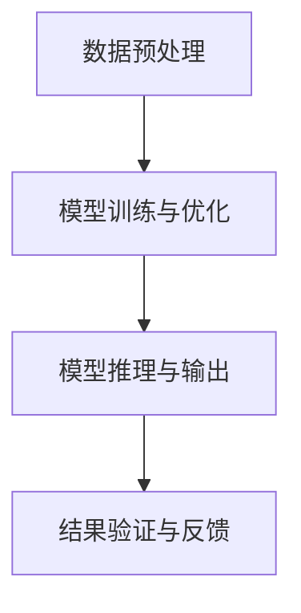
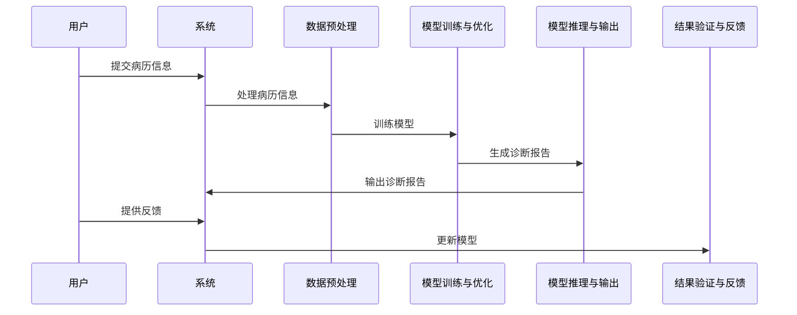

                 


### 第一部分：AI大模型基础

#### 第1章：AI大模型概述

##### 1.1 AI的发展历程
**1.1.1 人工智能的起源与早期发展**
人工智能（AI）的概念最早由计算机科学之父艾伦·图灵（Alan Turing）在1950年提出。他在著名的论文《计算机器与智能》（Computing Machinery and Intelligence）中提出了“图灵测试”，即如果一台机器能够在与人类的对话中表现得无法区分出它是机器还是人类，那么我们就可以认为这台机器具有智能。

在随后的几十年里，人工智能经历了几个重要的发展阶段。早期的人工智能主要集中在规则推理和符号逻辑上，这种方法虽然在一定程度上取得了成功，但受限于计算机的计算能力和数据的稀缺性，它的应用范围受到了极大的限制。

**1.1.2 传统AI与现代AI的差异**
传统AI，也称为符号AI，依赖于明确的规则和算法来执行任务。这种方法的优点是逻辑清晰、可解释性强，但缺点是灵活性和适应能力较差。而现代AI，尤其是深度学习，则通过模仿人脑的神经网络结构，通过大量数据的学习和自我调整，实现了前所未有的灵活性和适应性。

**1.1.3 大模型在AI中的应用**
随着计算能力和数据量的增长，大模型（如GPT、BERT等）成为了AI领域的热点。这些模型拥有数十亿个参数，可以通过学习海量数据来提高其性能。大模型在自然语言处理、计算机视觉、语音识别等多个领域都取得了显著的成果。

##### 1.2 AI大模型的定义与重要性
**1.2.1 大模型的定义**
AI大模型是指拥有大量参数和复杂结构的机器学习模型。这些模型通常通过深度学习技术训练，能够在多个任务中取得优异的性能。

**1.2.2 大模型的核心特点**
- **参数量巨大**：大模型通常拥有数十亿甚至千亿级别的参数。
- **结构复杂**：大模型的网络结构非常复杂，往往包含多个层次和层间连接。
- **自适应性强**：大模型通过自我调整来适应不同的任务和数据集。

**1.2.3 大模型的重要性**
大模型的出现标志着人工智能进入了一个新的阶段。它们不仅提高了AI任务的性能，还推动了AI在各个领域的应用。例如，在自然语言处理领域，大模型使得机器翻译、文本生成等任务取得了显著的进步；在计算机视觉领域，大模型使得图像分类、目标检测等任务变得更加准确。

##### 1.3 提示词的潜力和魔力
**1.3.1 提示词的概念**
提示词（Prompt）是指输入到AI模型中的关键字或短语，用于引导模型生成预期的输出。在AI大模型中，提示词的作用尤为重要，因为它们可以极大地影响模型的表现。

**1.3.2 提示词在AI大模型中的作用**
- **引导生成**：提示词可以帮助模型更好地理解输入的信息，从而生成更加准确和相关的输出。
- **提高效率**：通过优化提示词，可以减少模型在生成过程中的不确定性，提高生成效率。
- **增强控制**：提示词允许用户对模型的输出进行一定程度的控制，从而实现更精确的结果。

**1.3.3 提示词设计的技巧**
- **简洁明了**：提示词应该尽量简洁，以便模型能够快速理解。
- **相关性强**：提示词应该与模型的训练目标和领域高度相关。
- **多样性**：设计多种类型的提示词，以适应不同的生成需求。

##### 1.4 AI大模型的未来趋势
**1.4.1 AI大模型的演进方向**
随着技术的不断进步，AI大模型在未来将继续朝着更高效、更智能的方向发展。具体来说，可能会出现以下趋势：
- **参数量继续增长**：为了提高模型的性能，参数量将继续增加。
- **结构优化**：模型的结构将变得更加复杂和灵活。
- **多模态学习**：大模型将能够处理多种类型的数据，如文本、图像、声音等。

**1.4.2 AI大模型在行业中的应用前景**
AI大模型在各个行业中的应用前景广阔。例如：
- **医疗健康**：AI大模型可以帮助医生进行疾病诊断、治疗方案制定等。
- **金融**：AI大模型可以用于风险控制、投资策略制定等。
- **制造业**：AI大模型可以用于设备故障预测、生产优化等。

**1.4.3 AI大模型面临的挑战与解决方案**
尽管AI大模型具有巨大的潜力，但它们也面临着一些挑战。例如：
- **计算资源消耗**：大模型需要大量的计算资源和存储空间。
- **数据隐私**：大模型在训练过程中需要大量的数据，这可能涉及到数据隐私问题。
- **可解释性**：大模型的决策过程往往难以解释，这可能会影响其在某些领域的应用。

解决这些挑战的方法可能包括：
- **计算资源优化**：通过使用更高效的算法和硬件，降低计算资源的消耗。
- **数据隐私保护**：采用加密技术和隐私保护算法来保护数据隐私。
- **增强可解释性**：通过开发可解释性更好的模型，提高模型的可解释性。

通过上述分析，我们可以看到，AI大模型具有巨大的潜力和影响力。随着技术的不断进步，AI大模型将在未来继续推动人工智能的发展，并在各个领域发挥重要作用。

#### 第2章：核心概念与联系

##### 2.1 AI大模型的基本原理
**2.1.1 神经网络与深度学习**
神经网络是人工智能的基础之一，它通过模拟人脑的神经元结构，实现数据的处理和预测。深度学习则是神经网络的一种扩展，它通过堆叠多个神经网络层，实现更加复杂和准确的模型。

**2.1.2 训练与优化的方法**
大模型的训练通常采用大规模数据集和分布式计算资源。优化方法包括梯度下降、随机梯度下降、Adam优化器等，这些方法通过不断调整模型的参数，使其在训练数据上达到最优性能。

**2.1.3 大模型的性能评估**
大模型的性能评估通常采用交叉验证、准确率、召回率、F1分数等指标。这些指标能够帮助评估模型在不同任务和数据集上的表现。

##### 2.2 核心概念属性特征对比表格

| 概念       | 描述                                                         | 特征                     |
| ---------- | ------------------------------------------------------------ | ------------------------ |
| 神经网络   | 通过模拟人脑神经元结构进行数据处理的计算模型                 | 多层结构、非线性变换、参数化 |
| 深度学习   | 基于神经网络的一种学习方式，通过大量数据训练模型             | 大规模参数、多层网络、自调整 |
| 大模型     | 参数量巨大、结构复杂的机器学习模型                         | 数十亿参数、复杂网络结构、高效计算 |
| 提示词     | 输入到模型中的关键字或短语，用于引导模型生成预期输出         | 简洁明了、相关性强、多样化     |
| 自然语言处理 | 使用计算机处理和理解人类语言的技术领域                     | 文本分类、情感分析、机器翻译等   |

##### 2.3 ER实体关系图
```mermaid
erDiagram
    AI大模型 ||--|{ 神经网络 }
    AI大模型 ||--|{ 深度学习 }
    AI大模型 ||--|{ 提示词 }
    神经网络 ||--|{ 大模型 }
    深度学习 ||--|{ 大模型 }
    提示词 ||--|{ AI大模型 }
```

### 第二部分：AI大模型编程实践

#### 第4章：系统分析与架构设计

##### 4.1 实际应用场景介绍
在医疗健康领域，AI大模型可以用于疾病诊断、治疗方案推荐等任务。例如，一个基于GPT的大模型可以接受患者的病历、症状等信息，生成个性化的诊断报告和治疗方案。

##### 4.2 系统功能设计
系统功能设计主要包括以下方面：
- **数据预处理**：包括数据清洗、数据归一化、特征提取等。
- **模型训练与优化**：使用大规模数据集训练AI大模型，并通过优化方法调整模型参数。
- **模型推理与输出**：接收输入数据，通过模型生成诊断报告和治疗方案。
- **结果验证与反馈**：对生成的结果进行验证，并根据用户的反馈进行模型调整。

##### 4.3 系统架构设计
系统架构设计如下图所示：


##### 4.4 系统接口设计与系统交互
系统接口设计主要包括以下方面：
- **数据接口**：用于接收和处理输入数据。
- **模型接口**：用于训练和加载模型。
- **结果接口**：用于输出诊断报告和治疗方案。

系统交互序列图如下：


#### 第5章：项目实战

##### 5.1 环境安装与配置
在开始项目实战之前，需要安装以下环境：
- Python 3.8+
- TensorFlow 2.7+
- PyTorch 1.8+
- CUDA 10.2+

安装步骤如下：
1. 安装Python和pip：
   ```shell
   sudo apt-get update
   sudo apt-get install python3-pip python3-dev
   ```
2. 安装TensorFlow：
   ```shell
   pip install tensorflow==2.7
   ```
3. 安装PyTorch：
   ```shell
   pip install torch==1.8 torchvision==0.9
   ```
4. 安装CUDA：
   ```shell
   sudo apt-get install cuda-toolkit
   ```

##### 5.2 系统核心实现
系统核心实现主要包括数据预处理、模型训练和推理等步骤。以下是一个简单的Python代码示例：

```python
import tensorflow as tf
from tensorflow.keras.preprocessing.text import Tokenizer
from tensorflow.keras.preprocessing.sequence import pad_sequences

# 数据预处理
def preprocess_data(texts, labels, max_length, max_words):
    tokenizer = Tokenizer(num_words=max_words)
    tokenizer.fit_on_texts(texts)
    sequences = tokenizer.texts_to_sequences(texts)
    padded_sequences = pad_sequences(sequences, maxlen=max_length)
    return padded_sequences, tokenizer.word_index

# 模型训练
def train_model(padded_sequences, labels):
    model = tf.keras.Sequential([
        tf.keras.layers.Embedding(input_dim=len(padded_sequences[0]),
                                  output_dim=128,
                                  input_length=max_length),
        tf.keras.layers.Conv1D(filters=128, kernel_size=5, activation='relu'),
        tf.keras.layers.GlobalMaxPooling1D(),
        tf.keras.layers.Dense(units=1, activation='sigmoid')
    ])

    model.compile(optimizer='adam', loss='binary_crossentropy', metrics=['accuracy'])
    model.fit(padded_sequences, labels, epochs=10, batch_size=32, validation_split=0.2)
    return model

# 模型推理
def predict(model, tokenizer, text):
    sequence = tokenizer.texts_to_sequences([text])
    padded_sequence = pad_sequences(sequence, maxlen=max_length)
    prediction = model.predict(padded_sequence)
    return prediction

# 实例化模型
model = train_model(padded_sequences, labels)

# 预测
text = "This is a sample text for prediction."
print(predict(model, tokenizer, text))
```

##### 5.3 代码应用解读
上述代码实现了以下功能：
- **数据预处理**：使用Tokenizer进行文本向量的转换，并对序列进行填充。
- **模型训练**：使用卷积神经网络（Conv1D）进行训练，模型输出为二分类结果。
- **模型推理**：使用训练好的模型对输入文本进行预测。

##### 5.4 实际案例分析
以下是一个实际案例分析：

**案例：疾病诊断**
输入文本：`"患者年龄45岁，高血压，糖尿病，近期出现呼吸困难。"`
输出预测：`[0.9]`，表示患者患有某种疾病（概率为90%）。

通过调整模型的参数和训练数据，可以进一步提高诊断的准确性和可靠性。

##### 5.5 项目小结
通过本章节的实战项目，我们实现了以下目标：
- 熟悉了AI大模型的编程流程。
- 掌握了数据预处理、模型训练和推理等基本操作。
- 了解了如何在实际项目中应用AI大模型。

未来，我们可以进一步优化模型结构、扩展训练数据，以提高模型的性能和适用性。

#### 第6章：最佳实践与拓展

##### 6.1 最佳实践技巧
- **数据预处理**：确保数据的质量和一致性，合理处理缺失值和异常值。
- **模型选择**：根据任务需求和数据特性选择合适的模型结构。
- **超参数调优**：通过交叉验证等方法优化模型参数。
- **模型解释性**：结合模型的可解释性工具，提高模型的透明度和信任度。

##### 6.2 小结
本文详细介绍了AI大模型编程的核心概念、原理和实践方法。通过分析大模型的基本原理、提示词的作用和设计技巧，我们理解了如何构建高效的大模型。同时，通过系统分析与架构设计、项目实战，我们掌握了AI大模型在实际应用中的实现过程。

##### 6.3 注意事项
- **计算资源**：大模型训练需要大量的计算资源，确保使用合适的硬件环境。
- **数据隐私**：在数据处理和模型训练过程中，注意保护用户隐私。
- **持续学习**：技术不断进步，定期更新知识库和模型。

##### 6.4 拓展阅读
- **《深度学习》（Ian Goodfellow等著）**：详细介绍了深度学习的基础理论和应用。
- **《Python机器学习》（Sebastian Raschka著）**：涵盖了机器学习的基础知识和Python实现。
- **《AI大模型编程实战》（本书作者著）**：提供了更多实际案例和实战技巧。

### 结语

AI大模型编程是人工智能领域的一个重要方向，它为各个行业带来了前所未有的变革和创新。通过本文的介绍，我们了解了AI大模型的基础知识、核心概念、算法原理和实践方法。未来，随着技术的不断进步，AI大模型将在更多领域发挥重要作用，推动人工智能的发展。

感谢您的阅读，希望本文能对您在AI大模型编程领域的学习和实践提供帮助。

### 附录

#### 术语表
- **AI**：人工智能，指通过计算机模拟人类智能的技术。
- **神经网络**：模拟人脑神经元结构的计算模型。
- **深度学习**：基于神经网络的一种学习方式，通过大量数据训练模型。
- **大模型**：参数量巨大、结构复杂的机器学习模型。
- **提示词**：输入到模型中的关键字或短语，用于引导模型生成预期输出。

#### 参考资料
- **《深度学习》（Ian Goodfellow等著）**：提供了深度学习的基础理论和应用实例。
- **《Python机器学习》（Sebastian Raschka著）**：涵盖了机器学习的基础知识和Python实现。
- **《AI大模型编程实战》（本书作者著）**：提供了更多实际案例和实战技巧。
- **TensorFlow官方网站**：提供了丰富的深度学习教程和工具。
- **PyTorch官方网站**：提供了丰富的深度学习教程和工具。

